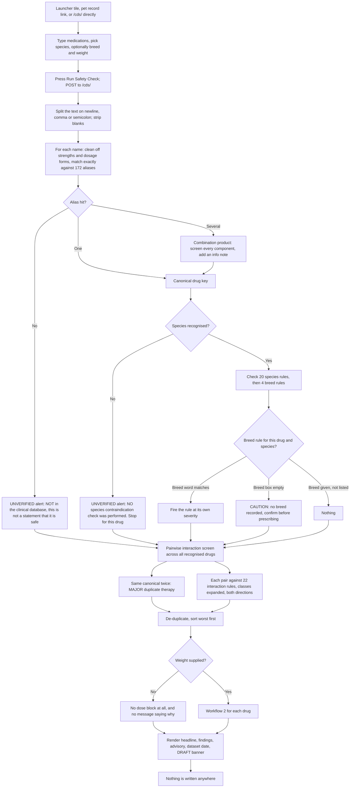
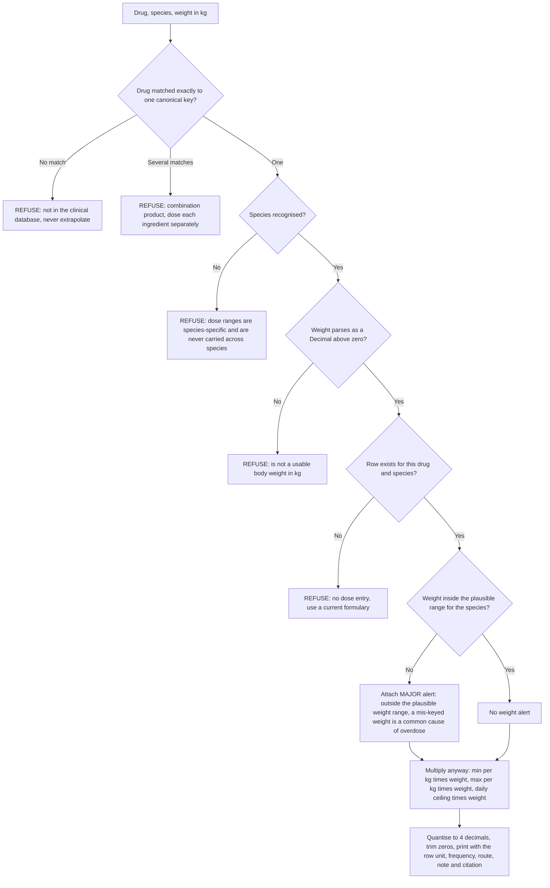

# Clinical Decision Support — Screening a Prescription, Sizing a Dose

**Module:** `cds` · **URL prefix:** `/cds/` · **Blueprint:** `blueprints/cds/routes.py` (635 lines)
· **Template:** `templates/cds/index.html` (one page) · **Clinical data:** `blueprints/cds/drug_data.json`

---

## Read this before the rest of the chapter

**This module is decision *support*. It is not a decision, and it is not a clearance.**
The treating veterinarian remains responsible for every prescription. The module's own
advisory says so on every result page, in both languages:

> **EN** — "Decision support only. It does not replace clinical judgement, and the treating
> veterinarian remains responsible for every prescription. ⚕️ Verify with Dr. Hatem or a
> licensed vet."
>
> **AR** — «دعم للقرار فقط. لا يغني عن الحكم السريري، والطبيب البيطري المعالج هو المسؤول عن كل
> وصفة. ⚕️ يُرجى التحقق مع د. حاتم أو طبيب بيطري مرخّص.»

Source: `blueprints/cds/drug_data.json` → `advisory`; rendered at `templates/cds/index.html:216, 228`

**An interaction that is not in the rule set produces no warning. No warning is not the
same as "safe".** The rule set is a curated shortlist of 20 species contraindications,
4 breed rules and 22 interaction pairs (§0.5). Everything outside those 46 rules is
silent — not cleared. The page itself says this when nothing matches:

> **EN** — "No rule in this database matched. This is NOT a statement that the combination
> is safe — it only means nothing in the curated dataset applies. The dataset is a
> shortlist, not a complete formulary."
>
> **AR** — «لم تتطابق أي قاعدة في قاعدة البيانات هذه. هذا لا يعني أن التركيبة آمنة — بل يعني
> فقط أنه لا توجد قاعدة منطبقة ضمن البيانات المُنسَّقة، وهي قائمة مختصرة وليست مرجعًا دوائيًا
> شاملًا.»

Source: `templates/cds/index.html:138-140`

**The data file ships marked as unreviewed.** Every result page prints, verbatim:
`DRAFT — NOT YET REVIEWED BY A LICENSED VETERINARIAN`, next to the dataset date
`2026-07-25`. That string is a field in the data file, not a placeholder in the template.
Source: `drug_data.json` → `review_status`, `version`; `routes.py:66-67`;
`templates/cds/index.html:220-221, 230-231`

This chapter documents **only what the code does today**. Where a control does less than
its label suggests, that is written down as a limit, not as a feature.

---

## 0. Before you start

### 0.1 One screen and two JSON endpoints

| # | Screen / endpoint | URL | What it is |
|---|-------------------|-----|------------|
| 1 | Clinical Decision Support | `GET\|POST /cds/` | The only page. Form on top, results below. Server-rendered; works with JavaScript off |
| 2 | Screen (JSON) | `POST /cds/api/screen` | Same engine, JSON in and out. **Called by nothing in the platform** |
| 3 | Dose (JSON) | `POST /cds/api/dose` | One drug, one patient. **Called by nothing in the platform** |

Source: `routes.py:579, 605, 626`; `blueprints/cds/__init__.py:3`; `app.py:289-290`

There is no dashboard, no list, no history, no settings screen. **Nothing is ever
written**: the blueprint imports no database module at all, writes no audit row, and
leaves no trace on the patient record. Running a check and not running one look identical
afterwards. Source: `routes.py:25-35` (the complete import list)

### 0.2 Who can open it

**Every signed-in user, of every role.** There is no role gate on any of the three routes
— only `@login_required` — and the module-grant gate inside `login_required` falls open
here, because `cds` is not one of the 25 grantable permission keys. `_permission_for()`
returns `""` for a blueprint with no key, and a blank key means "nothing can govern this,
so do not enforce". A groomer, a receptionist and an auditor can all open `/cds/` and both
JSON endpoints.

Source: `routes.py:580, 606, 627`; `blueprints/auth/routes.py:59-69, 110-112, 154-165`
(`_permission_for`); `models/database.py:4302-4330` (`ALL_PERMISSIONS` — no `cds` entry)

Consequences worth knowing:

- **It cannot be revoked on the Roles screen.** There is no "Clinical Decision Support"
  checkbox to clear, because there is no permission key to list.
- **The launcher tile is narrower than the reality.** The tile is offered only to
  `super_admin, clinic_owner, branch_manager, doctor, nurse, pharmacist`. Anyone else has
  no tile and reaches the page by URL or from a pet record instead.
  Source: `blueprints/launcher/routes.py:169-183`, `:574-579`
- Signing out or letting the session lapse is still enforced: the shared `before_request`
  flashes `Your session has expired. Please log in again.` and sends you to the login page.
  Source: `app.py:344-347`

### 0.3 How to get in

| Door | Where | What it does |
|------|-------|--------------|
| Launcher tile ⚕️ **Clinical Decision Support / دعم القرار السريري**, badge `Beta / تجريبي` | `/`, under the *Clinical* group | Opens `/cds/` empty |
| Pet record → quick actions → **⚕️ Drug & Dose Check / فحص الأدوية والجرعات** | `/crm/pets/<id>` | Opens `/cds/` **empty** — it is a plain link and carries no pet, species, breed or weight |
| Prescription detail → **Open drug reference for this patient → / فتح المرجع الدوائي لهذا المريض ←** | `/pharmacy/rx/<id>` | POSTs the prescription's medications, species, breed and weight into `/cds/` and renders the result in one click (Workflow 3) |
| Direct URL | `/cds/` | Same as the tile |

There is **no sidebar entry** for this module in `templates/base.html`.

Source: `blueprints/launcher/routes.py:169-183`; `templates/crm/pet_detail.html:402`;
`templates/pharmacy/rx_detail.html:175-207`; `templates/base.html` (no `cds` occurrence)

### 0.4 Language: Arabic and English

The interface language comes from the signed-in user's `language`, falling back to the
session, falling back to `PLATFORM_DEFAULT_LANG` (default `en`). With `lang=ar` the page
root carries `dir="rtl"` and each alert card is forced to `direction:rtl`.
Source: `app.py:373-378, 406-408`; `templates/base.html:3`; `templates/cds/index.html:18, 74`

**Bilingual coverage in this module is complete for anything clinical.** Every alert
message, every severity label, every dose note, every refusal reason and the advisory all
carry both an `_en` and an `_ar` string, and both are rendered through `t()`:

| Element | English | Arabic |
|---------|---------|--------|
| Page title | Clinical Decision Support | دعم القرار السريري |
| Subtitle | Species contraindications · Drug interactions · Weight-based dosing | موانع الاستعمال حسب النوع · التداخلات الدوائية · الجرعة حسب الوزن |
| Fields | Medications * / Species * / Breed / Weight (kg) | الأدوية * / النوع * / السلالة / الوزن (كجم) |
| Submit | 🩺 Run Safety Check | 🩺 إجراء فحص السلامة |
| Sections | Findings / Dose for this patient / Instead: / Source | النتائج / الجرعة لهذا المريض / البديل: / المرجع |
| Severity `contraindicated` | **DO NOT GIVE** | **ممنوع الإعطاء** |
| Severity `major` | Major risk | خطر كبير |
| Severity `unverified` | Not in database — verify manually | غير موجود في قاعدة البيانات — تحقق يدويًا |
| Severity `moderate` | Moderate | خطر متوسط |
| Severity `caution` | Caution | تنبيه |
| Severity `info` | Note | ملاحظة |

Source: `templates/cds/index.html:2-5, 81-117, 155, 164, 166, 176, 207`; `routes.py:100-108`

Three things stay English whatever the language is set to, because they are raw data
values rather than `t()` calls:

1. The **`Source` / `المرجع` citation text** itself (`Plumb's Veterinary Drug Handbook,
   10th ed.` and so on) — the label is translated, the citation is not.
   `templates/cds/index.html:166, 193`
2. The **`review_status` banner** `DRAFT — NOT YET REVIEWED BY A LICENSED VETERINARIAN`.
   `index.html:221, 231`
3. `route`, `frequency` and the per-kg range on a dose card (`PO`, `q8-12h`,
   `0.1-0.3 mg/kg`), and the unit suffix `kg`. `index.html:182-187`

The `_KNOWN_GAPS` list inside the data file — the module's own statement of what it does
not cover — exists **in English only** and is **not displayed on any screen**. It is
reproduced in §0.6 of this chapter. Source: `drug_data.json` → `_KNOWN_GAPS`

### 0.5 Exactly what is in the rule set

This is the most important section in the chapter. The engine is deterministic and reads
one file, `blueprints/cds/drug_data.json` (~70 KB). Nothing is generated by an AI at
runtime; the module works with the AI service switched off. Source: `routes.py:1-23, 42-63`

**Everything the engine can possibly know is in this table.**

| Rule table | Rows | What it covers |
|------------|-----:|----------------|
| `species_contraindications` | **20** | "Do not give drug X to species Y". 15 at severity `contraindicated`, 5 at `major` |
| `breed_contraindications` | **4** | Breed / genotype rules. 2 `contraindicated`, 1 `major`, 1 `caution` |
| `interactions` | **22** | Drug-pair rules. 3 `contraindicated`, 9 `major`, 9 `moderate`, 1 `caution` |
| `doses` | **36** | Weight-based dose rows = 19 drugs × (dog 18, cat 17, rabbit 1) |
| `drug_classes` | **6** | Lets one rule stand for a whole class (§ below) |
| `aliases` | **172 keys → 79 canonical drugs** | Trade names, generics and 17 Arabic names |
| `species_aliases` | **41 keys → 8 species** | dog, cat, rabbit, guinea_pig, hamster, bird, turtle, fish |
| `species_weight_range_kg` | **8** | Plausibility bounds used by the weight sanity check |

**That is 46 clinical rules in total** (20 + 4 + 22), plus 36 dose rows. It is a
hand-curated shortlist, and every row carries a `source` citation. It is not a formulary
and it is not an interaction database.

**The 20 species contraindications, in full:**

| Drug | Species | Severity |
|------|---------|----------|
| paracetamol | cat | contraindicated |
| permethrin | cat | contraindicated |
| deltamethrin | cat | contraindicated |
| amitraz | cat | contraindicated |
| ibuprofen | dog, cat | contraindicated |
| naproxen | dog, cat | contraindicated |
| diclofenac | dog, cat, bird | contraindicated |
| fipronil | rabbit | contraindicated |
| penicillin | rabbit, guinea_pig, hamster | contraindicated |
| amoxicillin | rabbit, guinea_pig, hamster | contraindicated |
| amoxicillin_clavulanate | rabbit, guinea_pig, hamster | contraindicated |
| clindamycin | rabbit, guinea_pig, hamster | contraindicated |
| lincomycin | rabbit, guinea_pig, hamster | contraindicated |
| erythromycin | rabbit, guinea_pig, hamster | contraindicated |
| ivermectin | turtle | contraindicated |
| meloxicam | cat | major |
| carprofen | cat | major |
| aspirin | cat | major |
| enrofloxacin | cat | major |
| griseofulvin | cat | major |

**The 4 breed rules, in full** — all dogs, three of them the MDR1/ABCB1 story:

| Drug | Gene | Severity | Breed list |
|------|------|----------|-----------|
| ivermectin | ABCB1 (MDR1) nt230(del4) | contraindicated | 15 entries: collie, border collie, australian shepherd, miniature american shepherd, shetland sheepdog, sheltie, old english sheepdog, english shepherd, german shepherd, longhaired whippet, long-haired whippet, silken windhound, mcnab, white swiss shepherd, herding |
| loperamide | ABCB1 (MDR1) | contraindicated | 12 entries, same list minus the miniature american shepherd, the white swiss shepherd and the hyphenated whippet |
| moxidectin | ABCB1 (MDR1) | major | 12 entries, as loperamide |
| trimethoprim_sulfonamide | — | caution | doberman, dobermann, miniature schnauzer, samoyed |

**The 22 interaction pairs, in full.** `nsaid`, `corticosteroid`, `aminoglycoside`,
`macrocyclic_lactone`, `azole` and `fluoroquinolone` are *classes* — one rule written
against a class fires for every member listed in §0.5's class table below.

| Pair | Severity |
|------|----------|
| nsaid + corticosteroid | major |
| nsaid + nsaid | major |
| nsaid + gentamicin | major |
| nsaid + ace_inhibitor | moderate |
| nsaid + furosemide | moderate |
| ace_inhibitor + spironolactone | moderate |
| furosemide + gentamicin | major |
| furosemide + amikacin | major |
| digoxin + furosemide | moderate |
| ketoconazole + ciclosporin | major |
| ketoconazole + ivermectin | moderate |
| fluoxetine + tramadol | major |
| selegiline + fluoxetine | contraindicated |
| selegiline + tramadol | contraindicated |
| selegiline + amitraz | contraindicated |
| clomipramine + fluoxetine | major |
| phenobarbital + chloramphenicol | major |
| phenobarbital + potassium_bromide | caution |
| potassium_bromide + furosemide | moderate |
| sucralfate + enrofloxacin | moderate |
| sucralfate + doxycycline | moderate |
| insulin + corticosteroid | moderate |

**The 6 drug classes:**

| Class | Members |
|-------|---------|
| `nsaid` | meloxicam, carprofen, firocoxib, robenacoxib, ibuprofen, naproxen, diclofenac, aspirin, ketoprofen, tolfenamic_acid |
| `corticosteroid` | prednisolone, dexamethasone, methylprednisolone, triamcinolone, hydrocortisone, budesonide |
| `aminoglycoside` | gentamicin, amikacin, neomycin, tobramycin |
| `macrocyclic_lactone` | ivermectin, moxidectin, milbemycin, selamectin, eprinomectin |
| `azole` | ketoconazole, itraconazole, fluconazole |
| `fluoroquinolone` | enrofloxacin, marbofloxacin, ciprofloxacin, pradofloxacin |

Note the classes are used **only where a rule names the class.** `aminoglycoside`,
`macrocyclic_lactone`, `azole` and `fluoroquinolone` are defined but no rule references
them by name — the aminoglycoside interactions are written against `gentamicin` and
`amikacin` individually, so **neomycin and tobramycin plus furosemide produce nothing**.

**The 36 dose rows** cover 19 drugs in **three species only** — dog, cat and rabbit:

| Drug | dog | cat | rabbit |
|------|:---:|:---:|:------:|
| amoxicillin, amoxicillin_clavulanate, cephalexin, enrofloxacin, metronidazole, doxycycline, clindamycin, meloxicam, prednisolone, furosemide, maropitant, gabapentin, buprenorphine, praziquantel, omeprazole | ✓ | ✓ | — |
| carprofen, ivermectin | ✓ | — | — |
| insulin | — | ✓ | — |
| fenbendazole | ✓ | ✓ | ✓ |

**60 of the 79 canonical drugs the engine can recognise have no dose row at all.** For
those the engine refuses to calculate (Workflow 2) rather than estimating.

Source for this whole section: `blueprints/cds/drug_data.json`, sections
`species_contraindications`, `breed_contraindications`, `interactions`, `drug_classes`,
`doses`, `aliases`, `species_aliases`, `species_weight_range_kg`; loaded at
`routes.py:45-75`

### 0.6 What is NOT screened

The data file carries its own gap list, `_KNOWN_GAPS`. It is never shown on screen. Read
it as part of using the tool:

1. **No horses, cattle, sheep, goats, camels, pigs or poultry. Food-animal withdrawal
   periods are NOT covered at all.**
2. No chemotherapy, no anaesthetic agents, no euthanasia agents, no fluid therapy, no CRI
   rates.
3. No pregnancy, lactation or paediatric dose adjustment.
4. No renal or hepatic dose adjustment — a patient with CKD or liver disease needs doses
   the engine does not compute.
5. Interaction coverage is a curated shortlist of high-yield pairs, not a complete
   interaction database.
6. No non-drug toxins (xylitol, chocolate, lilies, grapes, rodenticide) — this is a
   prescribing tool, not a poison centre.
7. Acepromazine in Boxers was deliberately left out: the classical warning is not
   supported by recent evidence and the authors chose to omit rather than assert.
8. Isoxazolines (fluralaner, sarolaner, afoxolaner) are named as *alternatives* in four
   rules but have no dose entries and no rules of their own.
9. **Bird and fish dosing is absent entirely.**

Source: `drug_data.json` → `_KNOWN_GAPS`

Read from the code, these further limits hold and are **not** in that list:

- **The engine never looks at age, sex, neuter status, body condition, pregnancy, renal or
  hepatic function, current diagnosis, or any other drug when it sizes a dose.** A dose
  depends on exactly three inputs: drug, species, weight (Workflow 2).
- **No duration, no course length, no total-course ceiling.** Only a per-administration
  range and, where the row has one, a per-day ceiling.
- **No route selection.** The row's own route is displayed (`PO`, `SC`, `PO/SC`…); you
  cannot ask for a different route and get a different number.
- **No frequency arithmetic.** `frequency` is a display string. The engine does not check
  that your intended frequency times the per-dose amount stays under the daily ceiling.
- **No drug-food, drug-disease or drug-lab interactions.**
- **Interactions are not species-aware.** The pairwise screen never consults the species —
  the same 22 rules fire identically in a hamster and a dog. Source: `routes.py:366-420`
- **There is no separate paediatric/geriatric branch, and no dose adjustment of any kind.**
- The visit screen's `/ai/drug-interactions` banner is **a different check** — AI-backed,
  not this rule engine, and sharing none of this data. Do not read one as confirming the
  other. Source: `templates/visits/visit_detail.html:1131-1170`

### 0.7 The security token

Both JSON endpoints and the page form are POSTs, so the platform-wide CSRF check applies:
the hidden `_csrf_token` field on the form, or an `X-CSRF-Token` header for the endpoints.
A missing or stale token produces **HTTP 403 with the HTML error page**
`Invalid or missing security token. Please go back and try again.` — note this is an HTML
page even when you asked for JSON. Reload and repeat.
Source: `app.py:349-357`; `templates/cds/index.html:78`; `routes.py:612-614`

---

## Workflow 1 — Screen a prescription before you write it

### 1.1 Who, when, why

Any signed-in user (§0.2); in practice the doctor or the pharmacist, at the moment of
choosing a drug for a patient whose species, breed and weight are already known. The point
is to catch the four things this rule set does catch — a species-lethal drug, an MDR1
breed, a duplicate active ingredient under two trade names, and one of 22 interaction
pairs — before the prescription is written, not after.

It is deliberately **opt-in and fail-closed**: nothing is screened until a human asks for
it, and opening the page is never presented as clearing a prescription.
Source: `templates/pharmacy/rx_detail.html:175-183` (the code comment stating this)

### 1.2 Preconditions

- You are signed in. Nothing else is required — no grant, no role.
- You know the patient's **species**. Without it the single most valuable check in the
  module does not run and the tool says so loudly (§1.5, case 2).
- Breed and weight are optional for screening. Weight is required only for doses
  (Workflow 2).
- Nothing needs to exist in the database. The engine reads one JSON file and no tables.

### 1.3 The happy path

Worked example: **Mishmish**, a 4.2 kg Persian queen belonging to Mrs. Hoda Abdel-Aziz of
Heliopolis, Cairo, is in for post-operative pain. The doctor is considering Metacam
(meloxicam) and already has her on prednisolone.

1. **Open the page.** Launcher → ⚕️ `Clinical Decision Support / دعم القرار السريري`
   (badge `Beta / تجريبي`), or `/cds/` directly.
   *You see:* one card with four fields, a `🩺 Run Safety Check / 🩺 إجراء فحص السلامة`
   button, and below it a dashed advisory box reading the advisory quoted at the top of
   this chapter, `Dataset / مجموعة البيانات 2026-07-25`, and in amber
   `DRAFT — NOT YET REVIEWED BY A LICENSED VETERINARIAN`.
   Source: `routes.py:579-602`; `templates/cds/index.html:76-120, 227-233`

2. **Type the medications.** Into `Medications * / الأدوية *`, one per line:

   ```
   Metacam 1.5mg/ml
   Prednisolone 5mg
   ```

   The placeholder shows the same shape (`One drug per line, e.g. / دواء واحد في كل سطر،
   مثال:`). Under the box, in grey: *"Trade names and Arabic names are matched exactly, not
   guessed. Anything unrecognised is reported as unverified." / «يتم مطابقة الأسماء
   التجارية والعربية مطابقةً تامة دون تخمين. وأي اسم غير معروف يُبلَّغ عنه كغير مُتحقَّق منه.»*
   Commas and semicolons split too, so `Metacam, Prednisolone` on one line works.
   Source: `templates/cds/index.html:81-91`; `routes.py:565-569`

3. **Pick the species.** `Species * / النوع *` is a required dropdown with exactly eight
   options: `Dog / كلب`, `Cat / قطة`, `Rabbit / أرنب`, `Guinea pig / خنزير غينيا`,
   `Hamster / هامستر`, `Bird / طائر`, `Turtle / سلحفاة`, `Fish / سمك`. Choose **Cat**.
   Source: `templates/cds/index.html:94-103`

4. **Type the breed (optional).** `Breed / السلالة`, placeholder `e.g. Border Collie /
   مثال: بوردر كولي`. Type `Persian`. Matching is a case-insensitive **substring** test
   against each rule's breed list, so `Rough Collie` matches the rule word `collie`.
   Source: `routes.py:319, 336`

5. **Type the weight (optional here, required for doses).** `Weight (kg) / الوزن (كجم)`,
   placeholder `e.g. 4.2 / مثال: 4.2`. Type `4.2`.

6. **Press `🩺 Run Safety Check / 🩺 إجراء فحص السلامة`.** The page POSTs to itself and
   re-renders. Nothing is stored.

7. **Read the headline.** A single wide card at the top, coloured and shaped by the worst
   severity found, showing the icon, the severity label and a count:
   `⚠️ Major risk / خطر كبير` — `2 finding(s) for 2 medication(s).` /
   `2 نتيجة لعدد 2 من الأدوية.`
   If any drug was not recognised at all, a second line appears:
   `Not checked at all: / لم يُفحص إطلاقًا:` followed by the raw names joined with ` · `.
   Source: `templates/cds/index.html:124-150`

8. **Read the findings.** Under `Findings / النتائج`, one card per alert, **sorted
   worst-first**. For Mishmish:

   - `⚠️ Major risk / خطر كبير` — drugs line `Metacam 1.5mg/ml · cat`, message: repeated
     meloxicam use in cats carries the FDA boxed warning for renal failure and death; an
     `Instead: / البديل:` block in a green-edged box; and a `Source / المرجع` line citing
     the US FDA boxed warning on Metacam.
   - `⚠️ Major risk / خطر كبير` — drugs line `Metacam 1.5mg/ml + Prednisolone 5mg`,
     message: concurrent NSAID and corticosteroid multiplies the risk of gastroduodenal
     ulceration and perforation, with its own citation.

   Source: `templates/cds/index.html:152-171`; `routes.py:322-331, 392-411`

9. **Read the dose block** (only present because a weight was given — Workflow 2).
   `Dose for this patient / الجرعة لهذا المريض`, one card per drug.

10. **Read the advisory at the foot.** The same advisory, plus
    `Rule engine only — no AI generated any statement on this page. / محرك قواعد فقط — لم
    يُولِّد الذكاء الاصطناعي أي عبارة في هذه الصفحة.` and the dataset date and DRAFT status.
    Source: `templates/cds/index.html:215-223`

11. **Act on it — or don't.** There is no accept, dismiss, acknowledge, override, print or
    save control. The page is a reference. Nothing about this screen changes the
    prescription, the visit, the pet record or the audit log.

### 1.4 Every alternative that genuinely branches

**A. Species recognised versus not.** The dropdown's eight values all resolve. Free text
sent to the JSON endpoint resolves through 41 aliases — `dog, dogs, canine, canis, puppy,
كلب, كلاب` / `cat, cats, feline, kitten, queen, قط, قطة, قطط` / `rabbit, rabbits,
lagomorph, bunny, أرنب, ارنب` / `guinea pig, cavy, guinea_pig` / `hamster, hamsters,
هامستر` / `bird, birds, avian, parrot, budgie, طائر, طيور` / `turtle, tortoise, chelonian,
terrapin, سلحفاة` / `fish, سمك`. The whole cleaned string is tried first, then each word,
so `Dog (mixed breed)` resolves to dog. Anything else does not resolve and takes the
branch in §1.5 case 2. Source: `routes.py:247-256`; `drug_data.json` → `species_aliases`

**B. Drug recognised, unrecognised, or read as a combination.** Matching is deliberately
**exact, never fuzzy**. The name is lowercased, punctuation dropped, and packaging words
and strengths stripped (a 99-word noise list covering `mg`, `tablets`, `suspension`,
`spot-on`, `for dogs`, `أقراص`, `شراب`, `حقن`, `مجم` and so on); the cleaned tokens are
then scanned longest-n-gram-first against 172 alias keys. Three outcomes:

- **one hit** → screened normally;
- **several distinct hits at the same n-gram length** → treated as a **combination
  product**: every component is screened separately, and an `ℹ️ Note / ملاحظة` card
  appears — *"Read as a combination product containing: ivermectin, praziquantel. Each
  component was screened separately — confirm this is correct."* / «تمت قراءته كمستحضر
  مركّب يحتوي على: … فُحص كل مكوّن على حدة — يُرجى التأكد من صحة ذلك.»
- **no hit** → the `unverified` alert in §1.5 case 1.

The code comment gives the reason for refusing fuzzy matching outright: edit-distance
matching would confuse prednisone with prednisolone and amikacin with amoxicillin, and a
wrong match that silently fails to warn is the dangerous outcome.
Source: `routes.py:161-171, 174-208, 222-244, 295-304`

**C. Breed given, breed blank, breed not on any list.** Breed only matters when the drug
has a breed rule (ivermectin, moxidectin, loperamide, trimethoprim_sulfonamide in dogs).
For those four:

- breed text contains a listed word → the rule fires at its own severity;
- **breed box left empty** → a `🔎 Caution / تنبيه` card instead: *"No breed recorded for
  this patient. ivermectin has a breed-specific contraindication (ABCB1 (MDR1)
  nt230(del4)) — confirm the breed before prescribing."* / «لم تُسجَّل سلالة هذا المريض.
  للدواء ivermectin مانع استعمال مرتبط بالسلالة — يجب تأكيد السلالة قبل الوصف.»
  Note the drug is named by its **canonical key**, in English, in both messages.
- breed text present but not on the list (`Labrador Retriever`) → **nothing at all**. No
  card, not even a note. Source: `routes.py:333-361`

**D. Same active ingredient twice.** Two different strings resolving to the same canonical
drug produce a `⚠️ Major risk` duplicate-therapy card before any interaction rule is
considered: *"Rimadyl" and "Carprofen" are both carprofen — duplicate therapy. The patient
would receive a double dose.* / «"Rimadyl" و"Carprofen" كلاهما carprofen — ازدواج علاجي؛
سيتلقى المريض ضعف الجرعة.» Two identical strings do **not** trigger it — the check
compares the raw text as typed. Source: `routes.py:377-390`

**E. Weight given versus not.** Weight changes nothing about the alerts. It only decides
whether the `Dose for this patient` block appears at all — see Workflow 2 and §1.5 case 6.

**F. Arabic interface.** With `lang=ar` the page is RTL, every label and every clinical
message switches (§0.4), and the citations, the DRAFT banner and the route/frequency
strings stay English.

**G. Screening from a prescription instead of typing.** Workflow 3.

### 1.5 Errors and edge cases — exact messages

1. **A drug the engine does not recognise.** Severity `unverified`, shown with a dashed
   amber bar and the label `Not in database — verify manually / غير موجود في قاعدة
   البيانات — تحقق يدويًا`:

   > **EN** — `"Zorbaxifen" is NOT in the clinical database. No contraindication,
   > interaction or dose check has been performed for it. This is not a statement that it
   > is safe — check a current formulary manually.`
   >
   > **AR** — «الدواء "Zorbaxifen" غير موجود في قاعدة البيانات السريرية. لم يتم إجراء أي فحص
   > لموانع الاستعمال أو التداخلات أو الجرعة. هذا لا يعني أنه آمن — يجب المراجعة يدويًا في مرجع
   > دوائي حديث.»

   `unverified` deliberately **outranks `moderate`** in the sort order, so "we do not know"
   is shown above a known, managed, moderate interaction. The same names are also listed
   on the headline card after `Not checked at all: / لم يُفحص إطلاقًا:`.
   Source: `routes.py:89-98, 264-279`; `templates/cds/index.html:143-148`

2. **Species not recognised.** Severity `unverified`, and — critically — the contraindication
   check for that drug **stops there**: no species rule and no breed rule is evaluated.

   > **EN** — `Species "Ferret" was not recognised, so NO species contraindication check
   > was performed. Species-specific lethality is the most important check this tool does —
   > set the species on the patient record and re-run.`
   >
   > **AR** — «لم يتم التعرف على النوع "Ferret"، لذلك لم يُجرَ أي فحص لموانع الاستعمال حسب
   > النوع. يُرجى ضبط نوع الحيوان في ملف المريض وإعادة الفحص.»

   With a blank species the quoted value renders as `(blank)` / `(فارغ)`. Interaction
   screening still runs — it never uses the species. Source: `routes.py:306-317`

3. **Nothing matched.** The headline turns into a **green tick**, `✅`, with the label
   `No rule triggered / لم تُفعَّل أي قاعدة` and the "this is NOT a statement that the
   combination is safe" paragraph quoted at the top of this chapter. **Read the paragraph,
   not the tick.** A clean screen of a hamster on tobramycin and furosemide looks exactly
   like this, and that pair is genuinely nephrotoxic — it simply is not one of the 22 rules.
   Source: `templates/cds/index.html:126-141`

4. **A drug that is contraindicated but also has no dose row.** Both happen: the
   contraindication card fires, and the dose card refuses separately. Amoxicillin in a
   rabbit shows `⛔ DO NOT GIVE / ممنوع الإعطاء` in Findings **and**
   `No dose calculated. / لم تُحسب الجرعة.` with `No dose entry for amoxicillin in rabbit…`
   in the dose block. The two blocks do not talk to each other: **a dose is still printed
   for a drug that a contraindication rule has just forbidden**, whenever a dose row
   exists — meloxicam in a cat is the live example. Source: `routes.py:526-543`

5. **A dose that is calculated on an implausible weight.** The dose is still shown, with a
   `⚠️ Major risk` card attached to it — see Workflow 2 §2.5.

6. **Weight left blank on the page.** No dose block appears at all, and **nothing says
   why**. `screen()` computes doses only when the weight is truthy, and an empty box is
   falsy, so the section is simply absent. Do not read a missing dose block as "no dose
   needed". Source: `routes.py:543`; `templates/cds/index.html:174`

7. **No medications entered.** The textarea is `required`, so the browser blocks the
   submission. A POST that bypasses the browser (or a JSON call with no `drugs`) is
   accepted and returns **`checked_count: 0`, no alerts, and the green
   `No rule triggered / لم تُفعَّل أي قاعدة` headline** — an empty screen that looks like a
   clean screen. Verified against the running route.
   Source: `templates/cds/index.html:82`; `routes.py:528, 552-553`

8. **A drug name containing a comma.** The page form splits on newline, comma **and**
   semicolon, so a product written `Amoxicillin, clavulanic acid` on one line becomes two
   names. Both happen to resolve here; a name that only makes sense whole would be broken
   in two and reported as two unverified drugs. One drug per line avoids it. The JSON
   endpoint does not split when you send a proper list. Source: `routes.py:565-569`

9. **Stale security token** (the tab sat open past the session timeout). HTTP 403 and the
   HTML error page `Invalid or missing security token. Please go back and try again.`
   Reload and re-run. Source: `app.py:349-357`

10. **Duplicate unrecognised names.** `Zorbaxifen` typed twice appears **twice** in the
    `Not checked at all:` list — that list is not de-duplicated, unlike the alert list.
    Source: `routes.py:554`

### 1.6 Known limits of this workflow

- **There is no record that a screen ever ran.** No audit row, no note on the visit, no
  flag on the prescription, nothing on the pet timeline. You cannot demonstrate afterwards
  that a check was performed, and the prescription screen will still say
  `❔ Not screened / ❔ لم يتم الفحص` after you have screened it (Workflow 3).
- **No print view and no export.** `@media print` avoids splitting an alert card across
  pages, and that is the whole of the print support. Use the browser's own print.
  Source: `templates/cds/index.html:68`
- **The results are not attached to a patient.** The page never loads a pet: species,
  breed and weight are free text you re-type (or that the pharmacy page posts for you).
  The pet-record link at `crm/pet_detail.html:402` carries no parameters, so it opens the
  page **empty** even though it sits under that pet's chart.
- **The severity of a combination product is the worst of its components**, and the `ℹ️
  Note` card telling you it was read as a combination sits at the *bottom* of the list, at
  `info` rank. Read the whole list, not just the top card.
- **Class rules cannot fire against themselves for one drug.** `nsaid + nsaid` needs two
  *different* NSAIDs; the same NSAID twice is caught by the duplicate-therapy rule instead.
  Source: `routes.py:403-404`

### 1.7 What gets written, and what changes elsewhere

**Nothing.** No table is touched, no audit row is written, no notification is raised, no
file is created. `blueprints/cds/routes.py` imports no database module and holds no write
path. The only state that changes is the rendered page in front of you.
Source: `routes.py:25-35`

Screens that change as a result: none.

### 1.8 Flowchart



---

## Workflow 2 — Get a weight-based dose range for one patient

### 2.1 Who, when, why

The prescriber, once the drug is chosen and the patient has been weighed **today**. The
job is to turn a per-kilogram range from a cited formulary into millilitres-of-thinking for
this animal, using exact decimal arithmetic instead of mental maths at 8 pm.

### 2.2 Preconditions

- The drug must be one of the **19** with dose rows (§0.5), and the species must be one of
  **dog, cat or rabbit** — and the drug/species pair must exist. Sixty of the 79
  recognisable drugs have no dose row.
- A **current body weight in kilograms**. Not pounds, not grams.
- Nothing else. The engine does not ask for, and cannot use, age, renal function, hepatic
  function, pregnancy, body condition or the indication.

### 2.3 How a dose is calculated — the exact formula

Three inputs go in: **drug**, **species**, **weight in kg**. Nothing else.

```
min_total       = min_per_kg           × weight_kg
max_total       = max_per_kg           × weight_kg
max_daily_total = max_per_kg_per_day   × weight_kg     (only if the row carries this field)
```

- `min_per_kg`, `max_per_kg` and `max_per_kg_per_day` are read from the one matching row in
  `doses` where `drug == canonical` **and** `species == canonical species`. There is no
  fallback and no interpolation.
- **Units.** For 35 of the 36 rows the unit is `mg`, so the totals are milligrams and the
  per-kg range prints as e.g. `0.1-0.3 mg/kg`. Insulin is the exception and its unit
  handling is wrong — see §2.6.
- **All arithmetic is `decimal.Decimal`, built from the strings in the data file.** Every
  number in `drug_data.json` is stored as quoted text specifically so no value ever passes
  through a binary float. Source: `routes.py:423-427, 507-518`; `drug_data.json`
  `_README_FOR_VETERINARIANS` rule 2
- **Display rounding.** Each printed number is quantised to **4 decimal places**
  (banker's rounding, Python's `Decimal` default) and trailing zeros are trimmed, then
  printed in plain notation. `0.005 mg/kg × 0.333 kg` prints as `0.0017`. The displayed
  weight is rounded the same way — enter `12.123456789` and the card says `12.1235 kg`,
  though the full value was used in the multiplication. Source: `routes.py:430-433`
- **What is *not* computed:** number of doses per day, course length, total course amount,
  volume in mL from a concentration, tablet counts, loading doses, or any adjustment of any
  kind. `frequency` and `route` are text copied from the row.

Worked example — Mishmish, cat, 4.2 kg, meloxicam:

| Field on the card | Value | Where it comes from |
|---|---|---|
| Header | `Metacam 1.5mg/ml · Cat · 4.2 kg · SC` | your text · your species · `_fmt(weight)` · `row.route` |
| Big line | **`0.42 – 1.26 mg`** `single dose only` | `0.1 × 4.2` – `0.3 × 4.2` · `row.frequency` |
| Grey line | `0.1-0.3 mg/kg · **Do not exceed 1.26 mg/day**` | `row.min-max` · `0.3 × 4.2` |
| Note | *SINGLE one-time dose. Repeated dosing in cats carries an FDA boxed warning for renal failure and death. Check the label in your jurisdiction before any second dose.* | `row.note.en` / `.ar` |
| Source | `US FDA Metacam feline label and boxed warning (2010).` | `row.source` |

Source: `routes.py:507-522`; `templates/cds/index.html:178-203`; `drug_data.json` → `doses`

### 2.4 The happy path

1. Fill the form as in Workflow 1, **including `Weight (kg) / الوزن (كجم)`**.
2. Press `🩺 Run Safety Check / 🩺 إجراء فحص السلامة`.
3. Below `Findings`, the block `Dose for this patient / الجرعة لهذا المريض` appears with
   **one card per medication you entered** — including refusal cards for the ones that
   cannot be dosed.
4. Read the big line, then the `Do not exceed … /day` ceiling, then the note, then the
   citation. **The big line is a *range*, not a recommendation.** The insulin note in the
   data file states the principle for all of them: *"Never start at a calculated
   maximum."*

### 2.5 Errors and edge cases — exact messages

The engine **refuses rather than extrapolates**, and the refusals are checked in this
order. The first one that applies is the only one you see.

1. **Drug not in the database:**
   > **EN** — `"Zorbaxifen" is not in the clinical database, so no dose can be calculated.
   > Never extrapolate a dose from another drug or another species.`
   > **AR** — «الدواء "Zorbaxifen" غير موجود في قاعدة البيانات، ولا يمكن حساب الجرعة. لا يجوز
   > إطلاقًا اشتقاق الجرعة من دواء آخر أو نوع آخر.»

   The `unverified` lookup alert is attached to the same card. Source: `routes.py:452-459`

2. **Read as a combination product:**
   > **EN** — `"Ivermectin and Praziquantel tablets" was read as a combination product
   > (ivermectin, praziquantel). Dose each active ingredient separately from the product
   > label.`
   > **AR** — «تمت قراءة "…" كمستحضر مركّب (…). يجب حساب جرعة كل مادة فعّالة على حدة من نشرة
   > المستحضر.»

   Source: `routes.py:460-466`

3. **Species not recognised:**
   > **EN** — `Species "Ferret" is not recognised. Dose ranges are species-specific and are
   > never carried across species.`
   > **AR** — «النوع "Ferret" غير معروف. مدى الجرعات يختلف حسب النوع ولا يُنقل بين الأنواع.»

   A blank species renders as `(blank)` / `(فارغ)`. Source: `routes.py:467-473`

4. **Weight missing, non-numeric, zero or negative:**
   > **EN** — `Weight "abc" is not a usable body weight in kg.`
   > **AR** — «الوزن "abc" غير صالح كوزن جسم بالكيلوجرام.»

   The rejected value is quoted back verbatim. This covers `""` (quoted as `Weight ""`),
   `0`, `-3`, `abc`, and `4,2` — **a comma decimal separator is rejected**; use `4.2`.
   Arabic-Indic digits *are* accepted (`٤` is read as 4). Source: `routes.py:474-478`

   ⚠️ **On the page this message is usually invisible.** A blank weight box makes the whole
   dose section disappear before this check is ever reached (Workflow 1, §1.5 case 6). You
   see this text only when the box holds something unusable but non-empty — `0`, `abc`,
   `4,2` — or when calling `/cds/api/dose` directly.

5. **No dose row for this drug in this species:**
   > **EN** — `No dose entry for amoxicillin in rabbit. This tool will not extrapolate a
   > dose from another species — use a current formulary.`
   > **AR** — «لا توجد جرعة مسجلة لـ amoxicillin في rabbit. لن تُشتق الجرعة من نوع آخر —
   > يُرجى الرجوع إلى مرجع دوائي حديث.»

   Both the drug and the species are named by their **canonical English keys**, in the
   Arabic message too. This is the message you get for a bird, a fish, a hamster, a guinea
   pig, a turtle, and for 60 of the 79 recognisable drugs. Source: `routes.py:483-489`

6. **A weight outside the plausible range for the species — the dose is still calculated.**
   Before the arithmetic, the weight is compared against `species_weight_range_kg`:

   | Species | Plausible range (kg) |
   |---|---|
   | dog | 0.5 – 100 |
   | cat | 0.4 – 12 |
   | rabbit | 0.4 – 9 |
   | guinea_pig | 0.3 – 1.6 |
   | hamster | 0.02 – 0.3 |
   | bird | 0.01 – 15 |
   | turtle | 0.02 – 120 |
   | fish | 0.001 – 50 |

   Outside it, a `⚠️ Major risk / خطر كبير` card is attached **to the dose card itself**:

   > **EN** — `4200 kg is outside the plausible weight range for a cat (0.4-12 kg). Check
   > the weight and the units before giving this dose — a mis-keyed weight is a common
   > cause of overdose.`
   > **AR** — «الوزن 4200 كجم خارج المدى المنطقي لهذا النوع (cat: 0.4-12 كجم). تحقق من الوزن
   > ووحدته قبل الإعطاء — خطأ إدخال الوزن سبب شائع لفرط الجرعة.»

   **The dose is printed anyway.** Entering a cat's weight in grams — `4200` instead of
   `4.2` — produces a fully formatted card reading `420 – 1260 mg` alongside the warning.
   The warning is the only thing standing between that card and a thousandfold overdose.
   Verified against the running engine. Source: `routes.py:491-505, 510-522`

   Note the range check is skipped entirely for a species with no entry — but all eight
   recognised species have one, so in practice it always runs.

7. **An absurdly large weight crashes the request.** A weight of about 10²⁴ kg or more —
   most easily typed as scientific notation, e.g. `1e24` — raises an uncaught
   `decimal.InvalidOperation` inside the display formatter, so the request returns HTTP
   500 and the page *"An internal error occurred. Please try again."* instead of a
   refusal. Ordinary long numbers are fine (`999999999999999999999999` returns a dose).
   Verified by running the route. Source: `routes.py:430-433, 512-515`; `app.py:647-663`

### 2.6 Known limits of this workflow

- ⚠️ **The insulin card prints the wrong unit.** The insulin row stores `"units": "IU/kg"`,
  and the engine treats that whole string as the unit of the *total*. For a 5 kg cat the
  card reads **`1.25 – 2.5 IU/kg`** when the number means 1.25–2.5 IU in total, and the
  grey line reads **`0.25-0.5 IU/kg/kg`**. There is also no `max_units_per_kg_per_day`, so
  no `Do not exceed` line is drawn. The row's own note is correct and worth reading in
  full: *"Insulin is dosed in INTERNATIONAL UNITS, not mg. Typical feline starting dose
  0.25-0.5 IU/kg q12h, or a flat 1-2 IU/cat q12h, then titrate on a glucose curve. Never
  start at a calculated maximum."* Treat the printed numbers as IU and ignore the `/kg`.
  Verified against the running engine. Source: `routes.py:49-59, 512, 516-518`;
  `drug_data.json` → `doses` (insulin/cat)
- **A dose is printed for a drug that has just been declared contraindicated**, whenever a
  dose row exists for that drug/species pair. Meloxicam in a cat shows both a `Major risk`
  contraindication card and a fully formatted dose card. Nothing suppresses the second.
- **The ivermectin dog row is heartworm prevention only** (6 mcg/kg monthly). Its note says
  so in capitals; the big line does not. Demodicosis and sarcoptic-mange doses are 50-100×
  higher and are deliberately absent.
- **No mL, no tablets, no concentration.** The card gives milligrams; converting to a
  volume from a 1.5 mg/mL bottle is still yours to do.
- **No frequency arithmetic.** The card can simultaneously show a per-dose maximum, a
  frequency of `q8-12h`, and a daily ceiling that three of those doses would exceed.
  Nothing checks the combination. Metronidazole in a dog is a live example:
  `10-15 mg/kg` at `q12h` against a ceiling of `50 mg/kg/day`.
- **Only 28 of the 36 dose rows carry a note.** The other 8 hold a note object with empty
  strings and render no note line at all. **35 of 36 carry a daily ceiling** — insulin is
  the one that does not.

### 2.7 Flowchart



---

## Workflow 3 — Screen a prescription you have already written

### 3.1 Who, when, why

The pharmacist or the doctor looking at a saved prescription in the pharmacy module, who
wants the whole item list screened without retyping it.

### 3.2 The happy path

1. Open `/pharmacy/rx/<id>` for the prescription.
2. Scroll past the items to a grey-bordered card headed `❔ Not screened / ❔ لم يتم الفحص`:

   > **EN** — "This prescription has not been checked against species contraindications,
   > drug interactions or dosing. That is not a statement that it is safe — verify
   > manually."
   > **AR** — «لم تُفحص هذه الوصفة للبحث عن موانع الاستعمال حسب النوع أو التداخلات الدوائية أو
   > الجرعات. هذا ليس تأكيداً على سلامتها — تحقق يدوياً.»

3. Press `Open drug reference for this patient → / فتح المرجع الدوائي لهذا المريض ←`.
   The button submits a hidden form that POSTs to `/cds/` carrying every item's
   `medication_name` (one per line), plus the prescription's `species`, `breed` and
   `weight_kg`.
4. `/cds/` renders the full result immediately — Workflows 1 and 2 in one click.

Below the button, permanently: *"Reference data is a DRAFT that has not been reviewed by a
licensed veterinarian. Opening it does not check, clear or approve this prescription." /
«بيانات المرجع مسودة لم يراجعها طبيب بيطري مرخّص. فتحه لا يفحص هذه الوصفة ولا يجيزها ولا
يعتمدها.»*

Source: `templates/pharmacy/rx_detail.html:175-207`; `routes.py:585-597`

### 3.3 Known limits of this workflow

- **The banner never changes.** It says `❔ Not screened` before and after you screen,
  because nothing is written back (Workflow 1 §1.7). It is a label on the prescription, not
  a status.
- **You leave the prescription.** The button navigates away to `/cds/`; there is no back
  link to the prescription on the CDS page. Use the browser's Back button.
- **A species the pet record cannot express.** The pet form offers `Dog, Cat, Rabbit, Bird,
  Hamster, Fish, Turtle, Other` — **there is no Guinea pig**. A guinea pig recorded as
  `Other` does not resolve, so all six guinea-pig antibiotic contraindications
  (penicillin, amoxicillin, amoxicillin-clavulanate, clindamycin, lincomycin, erythromycin)
  are **never reached** through this hand-off. You get the "Species … was not recognised"
  alert instead. Type `Guinea pig` into the CDS form by hand to screen one.
  Source: `templates/crm/pet_form.html:206-213`; `routes.py:247-256`
- **Whatever is in `medication_name` is what gets screened.**

> **The hand-off is not medication_name alone.** `templates/pharmacy/rx_detail.html:194`
> posts `{{ item.medication_name or item.item_name or '' }}` — when `medication_name`
> is blank the line's generic `item_name` is sent instead. A non-drug line (a service,
> a consumable, a bag of food) therefore reaches the screener and comes back as an
> `UNVERIFIED` alert for a drug that does not exist. The alert is honest — the engine
> genuinely does not recognise it — but the reason is the line item, not the drug.
> Source: `templates/pharmacy/rx_detail.html:194`
 A free-text item, a compound,
  or an inventory row whose trade name is not one of the 172 aliases comes back as
  `unverified`.
- **Weight comes from the prescription record**, not from today's scale. If that column is
  blank, the dose block silently does not appear.

---

## 4. The two JSON endpoints

Both exist, both work, and **neither is called by anything in the platform** — no template,
no JavaScript, no other blueprint. They are reachable by any signed-in user with a valid
CSRF token. Verified: `/cds/api/screen` and `/cds/api/dose` appear only in `routes.py` and
in `tests/`. A test in `tests/test_links_clinical.py:208` asserts the opposite of a
call-site — that the visit page must *not* invoke CDS automatically.

**`POST /cds/api/screen`** — the docstring says "Callable from the visits / pharmacy
prescribing flows"; today nothing calls it.

```json
{"drugs": ["Metacam 1.5mg/ml", "Prednisolone"], "species": "Cat",
 "breed": "Persian", "weight_kg": "4.2"}
```

Returns `drugs`, `species`, `breed`, `weight_kg`, `alerts` (sorted worst-first, each with
`severity`, `kind` — one of `contraindication | breed | interaction | dose | lookup` —,
`drugs`, `message_en`, `message_ar`, `alternative_en`, `alternative_ar`, `source`, and a
bilingual `severity_label`), `doses`, `worst_severity`, `checked_count`, `unrecognised`,
`advisory`, `data_version`, `review_status`. Source: `routes.py:545-558, 572-576, 605-623`

**`POST /cds/api/dose`** — `{"drug": …, "species": …, "weight_kg": …}` returns the
`DoseResult` fields plus `advisory`. On refusal, `ok` is `false`, every numeric field is
`null`, and `refusal_en` / `refusal_ar` carry the reason. Source: `routes.py:626-635`

Behaviour worth knowing before you build against them:

- A missing or wrong CSRF token returns **403 with an HTML page**, not JSON.
- `GET` on either endpoint returns **405**.
- An empty or absent `drugs` list is accepted and returns `checked_count: 0` with no
  alerts — success-shaped, and not a clean screen.
- `drugs` also accepts a single string, which is then split on newlines, commas and
  semicolons like the form field.

---

## 5. Module-wide known limits

Everything below was read in the source or produced by running the engine. None is inferred.

1. **The module cannot be permission-controlled.** `cds` is not in `ALL_PERMISSIONS`, so
   the module gate falls open and every signed-in user of every role can open the page and
   both endpoints. There is no checkbox for it on the Roles screen.
   `blueprints/auth/routes.py:110-112, 154-165`; `models/database.py:4302-4330`
2. **The launcher tile's role list is narrower than the real access** — it is shown to six
   roles while all roles can reach the URL. `blueprints/launcher/routes.py:175-179`
3. **Nothing is ever recorded.** No audit row, no note, no flag, no history. A screen that
   was run and a screen that was not are indistinguishable afterwards. `routes.py:25-35`
4. **The pet-record link opens the page empty**, carrying no pet, species, breed or weight.
   `templates/crm/pet_detail.html:402`
5. **A blank weight silently removes the whole dose section** with no message.
   `routes.py:543`
6. **A zero-drug screen renders the green `No rule triggered` headline.** `routes.py:552`
7. **A contraindicated drug still gets a dose card** when a dose row exists.
   `routes.py:526-543`
8. ⚠️ **Insulin's totals are labelled `IU/kg` and its per-kg range `IU/kg/kg`.**
   `routes.py:53, 512, 516-518`
9. ⚠️ **The hyphenated `long-haired whippet` breed entry can never match.** Typed breeds
   are stripped of punctuation before comparison (`Long-haired Whippet` → `long haired
   whippet`) while the rule's breed strings are not, so the hyphenated entry is dead. The
   sibling entry `longhaired whippet` matches only the unhyphenated spelling. **Typing
   `Long-haired Whippet` into the breed box produces no MDR1 warning for ivermectin.**
   Verified. `routes.py:194-199, 336`; `drug_data.json` → `breed_contraindications`
10. **A weight around 10²⁴ kg or above returns HTTP 500** rather than a refusal, from an
    uncaught `decimal.InvalidOperation` in the display formatter. `routes.py:430-433`;
    `app.py:647-663`
11. **Four of the six drug classes are defined but referenced by no rule** —
    `aminoglycoside`, `macrocyclic_lactone`, `azole`, `fluoroquinolone`. Consequently
    neomycin or tobramycin with furosemide produces nothing, while gentamicin or amikacin
    with furosemide produces a `major` alert. `drug_data.json` → `interactions`,
    `drug_classes`
12. **`_KNOWN_GAPS` is never displayed** and exists in English only. The clinicians who most
    need §0.6 cannot read it from the screen. `drug_data.json` → `_KNOWN_GAPS`
13. **Two unrelated interaction checks exist in this platform.** This rule engine, and the
    AI-backed `/ai/drug-interactions` banner on the visit screen. They share no data and no
    logic, and neither confirms the other.
    `templates/visits/visit_detail.html:1131-1170`
14. **Interaction rules ignore species.** The same 22 pairs fire in a hamster and a dog.
    `routes.py:366-420`
15. **`Guinea pig` is a CDS species with six contraindication rules but is not an option
    on the pet record form.** `templates/crm/pet_form.html:206-213`
16. **Citations, the DRAFT banner and route/frequency strings stay English in Arabic mode.**
    `templates/cds/index.html:166, 182-187, 193, 221`
17. **The `unrecognised` list is not de-duplicated**, unlike the alert list. `routes.py:554`
18. **The data file is DRAFT and unreviewed as shipped**, and the module says so on every
    result page. Until a licensed veterinarian signs it off, treat every row as a prompt to
    check the citation, not as the citation.

---

## 6. Source map

| What | Where |
|------|-------|
| All three routes | `D:/vet/platform/blueprints/cds/routes.py` |
| Blueprint + URL prefix | `blueprints/cds/__init__.py:3`; registered at `app.py:289-290` |
| Data file load and normalisation | `routes.py:42-75` |
| Severity constants, rank and bilingual labels | `routes.py:82-108` |
| `Alert` / `DoseResult` shapes | `routes.py:111-158` |
| Name cleaning and the 99-word noise list | `routes.py:174-208` |
| Exact drug matching (`resolve_drug`) | `routes.py:222-244` |
| Species matching (`resolve_species`) | `routes.py:247-256` |
| Unknown-drug alert text | `routes.py:264-279` |
| Species + breed contraindications | `routes.py:286-363` |
| Pairwise interactions + duplicate therapy | `routes.py:366-420` |
| Decimal parsing and 4-dp display formatting | `routes.py:423-433` |
| Dose calculation and every refusal string | `routes.py:436-523` |
| Full screen (`screen`) | `routes.py:526-558` |
| Free-text drug splitting | `routes.py:565-569` |
| Page route | `routes.py:579-602` · `templates/cds/index.html` |
| JSON endpoints | `routes.py:605-635` |
| Clinical data (all 46 rules + 36 dose rows) | `blueprints/cds/drug_data.json` |
| Editing rules for veterinarians | `drug_data.json` → `_README_FOR_VETERINARIANS` |
| Gap list | `drug_data.json` → `_KNOWN_GAPS` |
| Access gates (and why this module has none) | `blueprints/auth/routes.py:59-69, 110-112, 154-165`; `models/database.py:4302-4330` |
| Launcher tile | `blueprints/launcher/routes.py:169-183, 574-579` |
| Prescription hand-off | `templates/pharmacy/rx_detail.html:175-207` |
| Pet-record link | `templates/crm/pet_detail.html:402` |
| CSRF | `app.py:349-357` |
| Language | `app.py:373-378, 406-408`; `templates/base.html:3` |
| Safety specification (69 tests) | `tests/test_cds.py` |
