# Clinical — Visits, the One-Screen Exam, Diagnoses, Prescriptions, Vaccinations

**Modules:** `visits` (URL prefix `/visits/`) and `clinical` (URL prefix `/clinical/`)
**Blueprints:** `blueprints/visits/routes.py` (1539 lines), `blueprints/clinical/routes.py` (434 lines)
**Templates:** `templates/visits/` (5 files), `templates/clinical/` (7 files)

This chapter documents **only what the code does today**. Where a screen promises
something it does not deliver, that is written down as a limit, not as a feature.
Every section ends with a `Source` line so the next writer can check the claim.

A receptionist on her first day should be able to follow any workflow below without
asking anyone. Where the app will refuse her, the exact refusal message is quoted.

---

## 0. Before you start

### 0.1 Every screen and endpoint in this chapter

**Visits blueprint** — `blueprints/visits/routes.py`

| # | Screen or action | URL | What it is |
|---|------------------|-----|------------|
| 1 | Medical Visits list | `GET /visits/` | Filterable list, hard cap 50 rows |
| 2 | New visit form | `GET /visits/new` | Long-form visit creation |
| 3 | Create visit | `POST /visits/new` | Action only — redirects to the visit |
| 4 | Visit detail | `GET /visits/<visit_id>` | The full clinical record |
| 5 | Add diagnosis | `POST /visits/<visit_id>/diagnosis` | Action only |
| 6 | Save treatment plan | `POST /visits/<visit_id>/treatment` | Action only — upsert, one per visit |
| 7 | Add prescription | `POST /visits/<visit_id>/prescription` | Action only |
| 8 | Save SOAP notes | `POST /visits/<visit_id>/soap` | Action only — audited |
| 9 | Complete visit | `POST /visits/<visit_id>/complete` | Action only — closes + auto-invoices |
| 10 | Invoice jump | `GET /visits/<visit_id>/invoice` | Redirect helper, no page of its own |
| 11 | Printable record | `GET /visits/<visit_id>/print` | Standalone print sheet, auto-prints |
| 12 | Hatem Way — empty | `GET /visits/exam` | One-screen exam with no patient loaded |
| 13 | Hatem Way — loaded | `GET /visits/exam/<pet_id>` | The one-screen exam on one animal |
| 14 | The single save | `POST /visits/exam/<pet_id>` | Visit + vaccines + Rx + invoice + payment |
| 15 | Client search API | `GET /visits/exam/api/search?q=` | JSON — the on-page client picker |
| 16 | Pet context API | `GET /visits/exam/api/pet/<pet_id>` | JSON — loads one animal |
| 17 | Client 360 API | `GET /visits/exam/api/owner/<owner_id>` | JSON — feeds every tab in one call |
| 18 | Walk-in registration | `POST /visits/exam/api/client` | JSON — new client + first pet |
| 19 | Task create/tick | `POST /visits/exam/api/task` | JSON — Tasks tab |
| 20 | Inline booking | `POST /visits/exam/api/appointment` | JSON — Planned tab |
| 21 | Add another pet | `POST /visits/exam/api/pet` | JSON — Pets tab |

Source: `blueprints/visits/routes.py:13, 67, 110, 163, 237, 264, 355, 432, 465, 591, 608, 691, 827, 1301, 850, 876, 1046, 1062, 1128, 1199, 1259`

**Clinical blueprint** — `blueprints/clinical/routes.py`

| # | Screen or action | URL | What it is |
|---|------------------|-----|------------|
| 22 | Clinical root | `GET /clinical/` | Pure redirect to `/clinical/vaccinations` |
| 23 | Lab requests | `GET /clinical/lab` | Three client-side tabs, 200 rows per bucket |
| 24 | New lab request | `GET\|POST /clinical/lab/new` | Usable only as `?visit_id=N` — see 9.5 |
| 25 | Lab detail + results | `GET /clinical/lab/<lab_id>` | Request, past results, result form |
| 26 | File a result | `POST /clinical/lab/<lab_id>/results` | Action only — flips status to Completed |
| 27 | Vaccinations | `GET /clinical/vaccinations` | 30-day due banner + all records (200) |
| 28 | Record vaccination | `GET\|POST /clinical/vaccinations/new` | The recall-setting screen |
| 29 | Certificate PDF | `GET /clinical/vaccinations/<vacc_id>/certificate` | Binary download |
| 30 | Surgeries | `GET /clinical/surgeries` | Read-only table, 200 rows |
| 31 | Record surgery | `GET\|POST /clinical/surgeries/new` | The only way to write a surgery row |

Source: `blueprints/clinical/routes.py:70, 77, 93, 157, 190, 228, 251, 320, 363, 384`

### 0.2 Who can open what

Two gates run and **both** must pass:

1. **The module grant.** `login_required` checks the signed-in role holds the permission
   key that governs the blueprint. Every route in this chapter carries `login_required`
   and nothing more — there is no second `role_required` gate anywhere in either
   blueprint.
2. **The role list.** Not used here. The one role rule inside this chapter is
   `PRESCRIBER_ROLES`, which decides whose *name* may go on a prescription, not who may
   open the screen (Workflow 3).

Source: `blueprints/auth/routes.py:59-69, 87-133`; `blueprints/visits/routes.py:310`

**Both blueprints are governed by the same key: `visits`.** The `clinical` blueprint is
mapped to `visits` explicitly, so a role that can open a visit can also open Lab,
Vaccinations and Surgeries — there is no separate grant for them.
Source: `blueprints/auth/routes.py:140-152`

**Roles holding the `visits` grant out of the box:**

| Role | Holds `visits`? |
|------|-----------------|
| `super_admin` | Bypasses the check entirely |
| `clinic_owner` | Yes (holds every key) |
| `branch_manager` | Yes |
| `doctor` | Yes |
| `nurse` | Yes |
| `pharmacist` | Yes |
| `reception` | **No** |
| `groomer`, `boarding_staff`, `finance`, `hr`, `inventory_mgr`, `auditor`, `support_admin` | **No** |

Source: `models/database.py:4346-4379`

**What being denied looks like:** a red flash `You don't have permission to access this
page.` and a redirect to the launcher (`/`). Nothing is written. For a request whose
path starts `/api/` or whose `Accept` header is exactly `application/json`, the answer
is `{"ok": false, "error": "forbidden"}` with HTTP 403 instead.
Source: `blueprints/auth/routes.py:126-133`

**The reception problem — read this before training the front desk.** The launcher
advertises the exam screen, the visits list and the vaccinations screen to `reception`,
but `reception` has no `visits` grant. A receptionist sees three tiles, clicks any of
them, and is bounced to the launcher with the permission flash. This matters because
the one-screen exam was designed around the walk-in and the front desk.
**Fix:** an administrator grants `Medical Visits & SOAP` to the `reception` role on the
Roles screen. The defaults are only a starting point; `seed_default_permissions` writes
them once at database init and never overwrites an administrator's edit.
Source: `blueprints/launcher/routes.py:85, 118, 130`; `models/database.py:4365-4368, 4383-4397`

**Cross-module gaps that bite inside these screens.** Several buttons here lead into
blueprints governed by *other* keys, and the grants do not line up:

| Button / redirect | Lands in | Needs key | `doctor` | `nurse` | `pharmacist` |
|---|---|---|---|---|---|
| `Complete Visit` → new invoice | `finance` | `invoicing` | **No** | **No** | **No** |
| Exam `Save visit` → invoice | `finance` | `invoicing` | **No** | **No** | **No** |
| Exam Invoices tab → `Pay` | `finance` | `invoicing` | **No** | **No** | **No** |
| `🧾 Invoice …` on a visit | `finance` | `invoicing` | **No** | **No** | **No** |
| `🩻 Imaging`, `📤 Upload Image` | `imaging` | `imaging` | Yes | Yes | **No** |
| `💊 Pharmacy` | `pharmacy` | `pharmacy` | Yes | Yes | Yes |
| AI buttons (`Discharge Instructions`, `Check Interactions`, 🤖 panel) | `ai_assistant` | `ai` | Yes | **No** | **No** |
| Owner/pet search behind the long form | `crm` | `patients` | Yes | Yes | Yes |

The consequence is spelled out in Workflow 4 and Workflow 6: **the work is saved, and
the user is still bounced to the launcher with a permission error.**
Source: `blueprints/auth/routes.py:140-152`; `models/database.py:4356-4372`

### 0.3 How to get in

- **Sidebar → CLINIC group → `Medical Visits / الفحوصات`** goes to `/visits/`.
  Source: `templates/base.html:126-129`
- **Sidebar → CLINICAL group → `Lab & Vaccines / المختبر والتطعيمات`** goes to
  `/clinical/lab`. This is the **only** sidebar entry into the clinical blueprint —
  there is **no sidebar link to Vaccinations and none to Surgeries**.
  Source: `templates/base.html:145-148`
- **Sidebar → `New Visit / زيارة جديدة`** goes to `/workflow` — a **different** wizard
  blueprint, not the screens in this chapter. It is governed by the same `visits` grant.
  Source: `templates/base.html:113-117`; `blueprints/auth/routes.py:151`
- **Launcher tiles:** `⚡ Hatem Way — One-Screen Exam / طريقة حاتم — كشف بشاشة واحدة`,
  `📝 Visits & Consultations`, `💉 Vaccination & Preventive Care`,
  `🔧 Surgery & Procedures`. Surgeries and Vaccinations are reachable *only* from here,
  from a link inside another screen, or by typing the URL.
  Source: `blueprints/launcher/routes.py:76-135`
- **From the visits list topbar:** `⚡ Hatem Way / طريقة حاتم` → `/visits/exam`, and
  `+ New Visit / زيارة جديدة` → `/visits/new`.
  Source: `templates/visits/visits_list.html:7-9`
- **Direct URL** works for all of them.

### 0.4 Language: Arabic and English

The UI language comes from the signed-in user's `language` field, falling back to the
session, falling back to the `PLATFORM_DEFAULT_LANG` environment variable (default
`en`). Every bilingual label in these templates is written `t('English', 'العربية')`.
Source: `app.py:373-378, 406-408`

Bilingual coverage in this chapter is **uneven**:

- **Fully bilingual:** the visits list, the new-visit form, the whole visit detail page,
  the whole exam screen (including its JavaScript strings, which are passed in through a
  `L = {…}` label block), the vaccination form and list, the lab form and detail, the
  surgery form and list.
  Source: `templates/visits/exam.html:1171-1214`
- **English only, whatever the language is set to:** the three Lab list tab labels
  (`Pending`, `In Progress`, `Completed`), the vaccination due banner heading
  `⚠️ Vaccinations Due in Next 30 Days (n)`, the words `Owner:` and `Due` inside that
  banner, `Dose #n` and `Batch:` in the vaccination table, `records` counters, the whole
  printable visit sheet's section titles (`Patient Information`, `Vitals`, `Diagnoses`,
  `Prescription #n`, `Veterinarian Signature`, `Owner Acknowledgement`), and the
  `alert()` text on the broken in-visit lab form.
  Source: `templates/clinical/lab_list.html:70-83`; `templates/clinical/vaccinations.html:80, 91-95, 148, 158`; `templates/visits/visit_print.html:63, 82, 105, 137, 172-179`; `templates/visits/visit_detail.html:987`
- **Every server flash message in both blueprints is English only.** There is no Arabic
  version of `Diagnosis text is required.`, `Visit and pet are required.` or any other
  flash quoted in this chapter.
  Source: `blueprints/visits/routes.py:131, 246, 306`; `blueprints/clinical/routes.py:110, 127, 259`

**Direction.** The app shell handles RTL. The printable visit sheet handles it itself,
setting `dir="rtl"` on `<html>` when the language is Arabic.
Source: `templates/visits/visit_print.html:2-3`

### 0.5 Money, dates and numbering

- **Currency is EGP.** The exam screen labels the discount unit `EGP`; nothing else in
  this chapter prints a currency symbol — the exam's own totals, change and due are bare
  numbers to 2 decimals. The outstanding-balance alert prints `… EGP`.
  Source: `templates/visits/exam.html:323` (discount unit), `exam.html:1667` (outstanding alert)
- **Amounts are `REAL` in SQLite,** rounded to 2 decimals at each write inside
  `db.create_invoice`. A per-line discount is a **percentage** and is clamped to 0–100
  on both the screen and the server; the invoice-level discount is clamped so it can
  never exceed the subtotal.
  Source: `models/database.py:3578-3617`; `blueprints/visits/routes.py:1478-1481`
- **Invoice numbers** look like `INV-2026-00042`.
  Source: `models/database.py:3572-3576`
- **Visit dates.** The long form stamps `datetime('now')`, which is **UTC**. The exam
  screen writes whatever is in its `Visit date / تاريخ الزيارة` box, defaulting to the
  server's **local** date. So two visits recorded minutes apart by the two routes can
  carry dates a day apart at either end of a Cairo night (Cairo is UTC+2/+3).
  Source: `blueprints/visits/routes.py:135, 1321`
- **The visits list shows `visit_date[:16]`,** so a long-form visit shows a UTC
  timestamp and an exam visit shows a bare `2026-08-19`.
  Source: `templates/visits/visits_list.html:58`

### 0.6 The security token

Every POST carries a CSRF token. If it is missing or stale (typically: the page sat open
past the session timeout), the server answers **403** with the error page
`Invalid or missing security token. Please go back and try again.` Fix: reload the page
and repeat the action.
Source: `app.py:349-357`

Where the token comes from differs, and it matters:

- `visit_form.html`, `visit_detail.html` and `exam.html` carry an explicit
  `<input type="hidden" name="_csrf_token">` in their forms.
  Source: `templates/visits/visit_form.html:8`; `visit_detail.html:48, 249, 322, 381, 489`; `exam.html:98`
- **Every form in `templates/clinical/` carries no token of its own** — the lab request
  form, the lab result form, the vaccination form and the surgery form all rely on the
  global JavaScript that injects `_csrf_token` into any POST form as it is submitted.
  With JavaScript disabled, **every clinical POST fails with the 403 page**.
  Source: `static/js/platform.js:129-145`; `templates/clinical/lab_form.html:41`, `lab_detail.html:193`, `vaccination_form.html:44`, `surgery_form.html:53`

### 0.7 Two ways to record a consultation — pick one before you start

The platform ships **two** independent consultation screens in this chapter. They write
to the same tables but they are not interchangeable.

| | **Long form** (`/visits/new` → `/visits/<id>`) | **One-screen exam** (`/visits/exam`) |
|---|---|---|
| Visit type | Any of 8 (Consultation, Follow-up, Vaccination, Surgery, Emergency, Dental, Wellness, Other) | **Always `Consultation`** — forced |
| Status when saved | `Open`, closed later by hand | **Always `Completed`** — forced |
| Chief complaint | Required | Not collected (the symptom box fills both `chief_complaint` and `symptoms`) |
| Vitals | Weight, temp, heart rate, respiratory rate | **Weight and temp only** |
| SOAP notes | Yes, four fields, audited | **No** |
| Diagnosis | One or more, with severity + notes; required before completing | One, with severity + chronic flag; **optional** |
| Treatment plan | Yes, one per visit | **No** |
| Prescription | Yes, with route, quantity | Yes; **no route, no quantity, no instructions** |
| Lab request | The in-visit form is broken (see 9.5) | **No** |
| Vaccination | No | Yes, with next-due date |
| Follow-up booking | Recorded as text on the plan only | Yes — writes a real appointment |
| File attachment | No | Yes |
| Invoice | Auto-generated on completion, **prices guessed** | Built by hand on screen, **prices real** |
| Payment | Not here — go to Finance | Taken on the same screen, with change |
| Editing afterwards | Impossible once Completed | Impossible — it is born Completed |

**Rule of thumb from the code, not from opinion:** the exam screen is for a routine paid
consultation that finishes at the counter. The long form is for anything that needs
SOAP notes, a treatment plan, a specific visit type, a lab request, or that stays open
across days.

Source: `blueprints/visits/routes.py:1315-1317` (forced type/status), `465-588` (auto-invoice), `templates/visits/visit_detail.html:225-702` (every form gated on `visit.status == 'Open'`)

---
## Workflow 1 — Open a long-form visit

### 1.1 Who, when, why

**Who:** anyone holding the `visits` grant — `clinic_owner`, `branch_manager`, `doctor`,
`nurse`, `pharmacist`, `super_admin`. Out of the box **not** `reception` (see 0.2).

**When:** the animal is in the room and the encounter needs a real medical record —
SOAP notes, a treatment plan, a lab request, or a visit type other than a plain
consultation. Also when the visit will stay open across days (a hospitalised case, a
lab result you are waiting on).

**Why:** this creates the `visits` row that every other clinical record in this chapter
hangs off. Diagnoses, treatment plans, prescriptions and lab requests all carry a
`visit_id` and cannot exist without one.

Source: `blueprints/visits/routes.py:67-160`; `models/database.py:1308-1405`

### 1.2 Preconditions

- The client exists in CRM (`owners`) and the animal exists under them (`pets`).
  If not, register them first — this form has no "new client" button. The exam screen
  does (Workflow 7).
- **JavaScript must be on.** The owner list is not rendered into the page: only the
  pre-selected owner, if any, is. Everything else arrives by typing. The pet dropdown
  is filled by a `fetch` when an owner is chosen.
  Source: `blueprints/visits/routes.py:91-95`; `templates/visits/visit_form.html:119-134`
- Nothing else. There is no requirement for an appointment to exist.

### 1.3 The happy path

Example: **Mrs Mona Abdel Rahman / منى عبد الرحمن**, phone `0100 123 4567`, brings her
cat **Basbous / بسبس** to the Nasr City branch. Basbous has been vomiting for two days.

1. **Open the list.** Sidebar → `Medical Visits / الفحوصات`. You land on
   `/visits/` — page title `Medical Visits / الزيارات الطبية`, subtitle
   `Clinical examination records / سجلات الفحص السريري`.
   Source: `templates/visits/visits_list.html:2-4`
2. **Press `+ New Visit / زيارة جديدة`** in the topbar (the other topbar button,
   `⚡ Hatem Way / طريقة حاتم`, is the other screen — Workflow 6).
   You land on `/visits/new`, title `New Medical Visit / زيارة طبية جديدة`.
   Source: `templates/visits/visits_list.html:7-9`; `visit_form.html:3`
3. **Find the client.** In the left card `Patient / المريض`, the field labelled
   `Owner / المالك *` has a plain text box above it placed there by the shell script,
   with the placeholder `Type to search…` (`اكتب للبحث…` in Arabic). Type at least
   **2 characters** of the name or phone — `مني`, `Mona`, or `0100`. After a 220 ms
   pause the dropdown below fills with up to **25** matches formatted
   `Mona Abdel Rahman · 01001234567`.
   **If exactly one client matches, the app selects them for you** and fires the change
   event, so step 4 starts by itself.
   Source: `static/js/platform.js:406-441`; `blueprints/crm/routes.py:541-560`
4. **Pick the client** from the dropdown. The `Pet / الحيوان *` dropdown immediately
   shows `Loading… / جارٍ التحميل…`, then fills from
   `/crm/owners/<id>/pets-json` with one option per pet: `Basbous (Cat)`.
   If the fetch fails you see `Error loading pets / خطأ في تحميل الحيوانات` in the
   dropdown — reload and try again.
   Source: `templates/visits/visit_form.html:119-134`; `blueprints/crm/routes.py:534-538`
5. **Pick the animal** — `Basbous (Cat)`.
6. **Type the vitals** in the `Vitals / العلامات الحيوية` card. All four are optional
   and all four are free of any validation beyond the browser's number input:
   - `Weight (kg) / الوزن (كجم)` — `4.6`
   - `Temperature (°C) / درجة الحرارة (°م)` — `39.4`
   - `Heart Rate (bpm) / معدل القلب` — `180`
   - `Resp. Rate (brpm) / معدل التنفس` — `36`
   Source: `templates/visits/visit_form.html:48-72`
7. **Fill the right-hand card `Visit Details / تفاصيل الزيارة`:**
   - `Visit Type / نوع الزيارة` — one of `Consultation`, `Follow-up`, `Vaccination`,
     `Surgery`, `Emergency`, `Dental`, `Wellness`, `Other`. These option labels are
     **English only**. Leave `Consultation`.
   - `Doctor Name / اسم الطبيب` — a free text box, **pre-filled with your own full
     name**. Overtype it with the vet who will actually see the animal, e.g.
     `Dr. Sara Fathy`.
   - `Chief Complaint / الشكوى الرئيسية *` — **required.** `Vomiting for two days`.
   - `Symptoms / History / الأعراض / التاريخ المرضي` — free text.
   - `Notes / ملاحظات` — free text.
   Source: `templates/visits/visit_form.html:78-104`
8. **Press `Create Visit / إنشاء زيارة`.**
9. **What you see:** a green flash `Visit created successfully.` and the browser lands
   on `/visits/<new id>` — the visit detail page, titled
   `Visit #41 — Basbous`, with an amber banner reading
   `⚠️ Add at least one diagnosis before completing this visit. / أضف تشخيصاً واحداً على الأقل قبل إنهاء هذه الزيارة.`
   Source: `blueprints/visits/routes.py:158-160`; `templates/visits/visit_detail.html:67-72`

### 1.4 Every alternative that genuinely branches

**a) From an appointment — `?appt_id=`.** The route reads the appointment row and, if it
finds one, takes the `pet_id` and `owner_id` from it when they were not passed
separately. A hidden `appointment_id` input is rendered, and the created visit stores
it in `visits.appointment_id`. **Nothing on the page tells you an appointment is
attached** — there is no visible confirmation.
Source: `blueprints/visits/routes.py:75-84`; `templates/visits/visit_form.html:9-11`; `routes.py:135`

**b) From a pet — `?pet_id=`.** The owner and pet dropdowns come pre-selected, and a
grey strip appears under them showing the pet name, species, breed, `Weight / الوزن` and,
if there is one, `⚠ Allergies / الحساسية`. This strip is the **only** place allergies
appear on this form.
Source: `templates/visits/visit_form.html:38-45`

**c) From an owner — `?owner_id=`.** The owner is pre-selected; the pet dropdown still
says `— Select Owner First / اختر المالك أولاً —` until you touch the owner dropdown,
because the pet list is only fetched by the `onchange` handler. **Workaround:** click
the owner dropdown and re-pick the same client.
Source: `templates/visits/visit_form.html:23-36`

**d) An appointment id that does not exist.** No error. `appointment` stays `None`,
nothing is pre-filled, and you fill the form by hand.
Source: `blueprints/visits/routes.py:75-79`

**e) The doctor you type is not a user on the system.** Perfectly allowed — a locum vet
is typed by hand. The name is stored in `visits.doctor_name` and `visits.doctor_id` is
left **NULL** rather than being stamped with your own id. Special case: if the name you
typed equals **your own** full name, your id is used even if your user row is inactive.
Source: `blueprints/visits/routes.py:891-920`

**f) You leave the doctor box empty.** `doctor_id` falls back to **your** user id and
`doctor_name` is stored blank. The visits list then shows `—` in the Doctor column.
Source: `blueprints/visits/routes.py:906-908`; `templates/visits/visits_list.html:61`

**g) Arabic interface.** Every label on this form is bilingual. The eight visit-type
options and the vitals placeholders (`e.g. 4.5`, `e.g. 38.5`, `e.g. 90`, `e.g. 20`) are
English only.
Source: `templates/visits/visit_form.html:80-85, 52-70`

### 1.5 Errors and edge cases — the exact messages

| What you do | What happens | Exact text |
|---|---|---|
| Submit with no owner chosen | Browser blocks it (the select is `required`) | browser's own message |
| Submit with no pet chosen | Browser blocks it | browser's own message |
| Submit with no chief complaint | Browser blocks it | browser's own message |
| Post without owner or pet (JS off, or a hand-built request) | Red flash, back to the empty form. **Nothing is written.** | `Owner and pet are required.` |
| Submit with a stale page (session timed out) | 403 error page | `Invalid or missing security token. Please go back and try again.` |
| Type a weight of `-5` or `999` | **Accepted and stored.** The long form has no vitals sanity check at all — that exists only on the exam screen. | — |
| Open `/visits/new` without the `visits` grant | Red flash, redirect to launcher | `You don't have permission to access this page.` |

Source: `blueprints/visits/routes.py:130-133`; `templates/visits/visit_form.html:25, 32, 90`; `app.py:355-357`; `blueprints/auth/routes.py:129-133`

### 1.6 What gets written, and what changes elsewhere

**One row in `visits`:**

| Column | Value |
|---|---|
| `appointment_id` | from `?appt_id=`, else NULL |
| `owner_id`, `pet_id` | from the two dropdowns |
| `doctor_id` | resolved from the typed name; NULL when it matches no active user |
| `doctor_name` | exactly what was typed |
| `visit_date` | `datetime('now')` — **UTC** |
| `visit_type` | the dropdown, default `Consultation` |
| `status` | `Open` |
| `chief_complaint`, `symptoms`, `notes` | as typed |
| `weight_kg`, `temp_c`, `heart_rate`, `respiratory_rate` | as typed, NULL when blank |
| `created_by` | your **user id** (into a TEXT column) |

Source: `blueprints/visits/routes.py:135-156`; schema at `models/database.py:1308-1332`

**What changes elsewhere immediately:**

- `/visits/` — the new row appears at the top with an amber `Open / مفتوح` badge.
- The exam screen's **History** tab for this client gains a row (it reads every visit of
  every animal the client owns).
- `/finance/invoices/new?visit_id=N` becomes meaningful — an invoice can now be linked
  to this visit by hand.
- **Nothing is written to `pets`.** The weight you typed is the *visit's* weight; the
  animal's own `pets.weight_kg` is untouched. Only the exam screen updates that.
  Source: `blueprints/visits/routes.py:1334-1338`

### 1.7 Flowchart

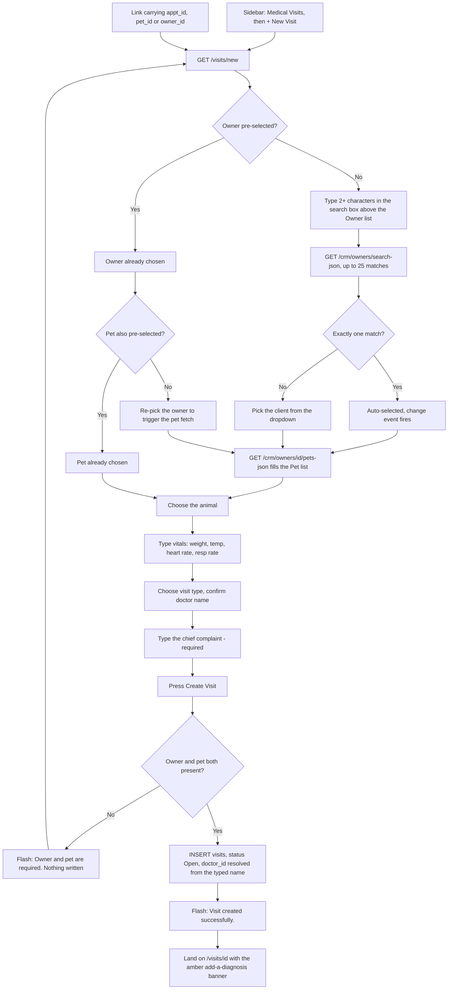

---

## Workflow 2 — Work up an open visit: SOAP, diagnosis, treatment plan

### 2.1 Who, when, why

**Who:** the same `visits` grant holders. In practice the vet, sometimes with a nurse
typing.

**When:** immediately after Workflow 1, and any time afterwards **while the visit is
still `Open`**.

**Why:** a visit with no diagnosis cannot be completed, and a visit that is never
completed never produces an invoice. Everything in this workflow is what turns the
appointment into a medical record.

**The one rule that governs this entire screen:** every add/edit form on the visit detail
page is wrapped in ``. The moment the visit is Completed,
all of them disappear and the page becomes permanently read-only.
Source: `templates/visits/visit_detail.html:237, 313, 372, 480, 627`

### 2.2 Preconditions

- A visit exists and its status is `Open`.
- You are on `/visits/<id>`.

### 2.3 The happy path

Continuing with Basbous, visit `#41`.

**What the page shows you before you type anything.** Left rail, top to bottom:

- **Patient card** — a species emoji (🐶 Dog, 🐱 Cat, 🦜 Bird, 🐰 Rabbit, 🐾 anything
  else), the pet name, species · breed, then `Sex / الجنس`,
  `Record Weight / الوزن المسجل` (the animal's stored weight, **not** today's) and
  `DOB / تاريخ الميلاد`.
- **Allergies box** — a red-bordered panel `⚠️ Allergies / الحساسية` shown only when
  `pets.allergies` is not empty.
- **Owner card** — name, phone, and a green `💬 WhatsApp / واتساب` link that opens
  `wa.me/<phone with + , spaces and dashes stripped>`. Note: it does **not** add the
  Egyptian country code, so a number stored as `01001234567` produces a `wa.me` link
  that will not resolve. Store the number as `+201001234567` if you want this link to
  work.
- **Visit Vitals card** — `Weight / الوزن`, `Temperature / درجة الحرارة`,
  `Heart Rate / معدل النبض`. **The respiratory rate you typed on the new-visit form is
  not displayed here or anywhere else on this page.**
- **Visit Info card** — date, type, doctor, and a status badge
  (`Open / مفتوحة` blue, `Completed / مكتملة` green).

Source: `templates/visits/visit_detail.html:81-176`

Right column, top to bottom: `Chief Complaint`, `📝 SOAP Clinical Notes`,
`🔍 Diagnosis`, `💊 Treatment Plan`, `💉 Prescriptions`, `🔬 Lab Requests`, `📝 Notes`.

**Step 1 — SOAP notes.**

1. In the `📝 SOAP Clinical Notes / ملاحظات SOAP السريرية` card, click the summary line
   `＋ Record SOAP Notes / تسجيل ملاحظات SOAP`. (It is **already open** when both
   Subjective and Objective are empty, which is the normal first visit.)
2. Fill any of the four boxes — none is required:
   - `👤 Subjective / البيانات الذاتية` *(owner reports / ما يذكره المالك)*
   - `🔍 Objective / البيانات الموضوعية` *(doctor observes / ما يلاحظه الطبيب)*
   - `🧠 Assessment / التقييم` *(diagnosis / evaluation)*
   - `💊 Plan / الخطة` *(treatment plan / خطة العلاج)*
3. Press `Save SOAP Notes / حفظ ملاحظات SOAP`.
4. **What you see:** green flash `SOAP notes saved.`, the page reloads at the `#soap`
   anchor, the four values now appear as read-only tiles above the form, and a green
   `Recorded / مسجلة` badge appears next to the card title. The fold now says
   `✏️ Update SOAP Notes / تحديث ملاحظات SOAP`.

Source: `templates/visits/visit_detail.html:211-276`; `blueprints/visits/routes.py:432-462`

**Step 2 — Diagnosis** (this is the one the Complete button depends on).

1. In the `🔍 Diagnosis / التشخيص` card, open `＋ Add Diagnosis / إضافة تشخيص`
   (already open when there are no diagnoses yet).
2. `Diagnosis / التشخيص *` — **required**, free text, placeholder
   `e.g. Acute gastroenteritis / مثال: التهاب معدي معوي حاد`.
3. `Severity / الشدة` — `Mild / بسيط`, `Moderate / متوسط`, `Severe / شديد`,
   `Critical / حرج`. Defaults to `Mild`.
4. `Notes / ملاحظات` — a single-line free text box.
5. Press `Add Diagnosis / إضافة تشخيص`.
6. **What you see:** green flash `Diagnosis added.`, the page returns at `#diagnosis`,
   the diagnosis appears as a card with its severity badge and a timestamp, the counter
   next to the card title goes to `1 record(s) / سجل`, the amber banner at the top of the
   page disappears, and — critically — **the greyed-out `✔ Complete Visit` button in the
   topbar becomes live**, joined by a green `📋 Discharge Instructions / تعليمات الخروج`
   button.

Source: `templates/visits/visit_detail.html:277-350, 40-58`; `blueprints/visits/routes.py:237-262`

**Step 3 — Treatment plan** (optional; one per visit).

1. In the `💊 Treatment Plan / خطة العلاج` card open
   `＋ Add Treatment Plan / إضافة خطة علاج`.
2. Fill:
   - `Treatment Plan / خطة العلاج` — multi-line.
   - `Goals / الأهداف` — multi-line.
   - `Duration / المدة` — free text, placeholder `e.g. 7 days / مثال: 7 أيام`.
   - `Follow-up in / المتابعة خلال` — a number.
   - `Unit / الوحدة` — `Days / أيام`, `Weeks / أسابيع`, `Months / شهور`.
3. Press `Save Treatment Plan / حفظ خطة العلاج`.
4. **What you see:** green flash `Treatment plan saved.`, return at `#treatment`, the
   plan rendered above the form as `Plan: … / Goals: … / Duration: … / Follow-up: in 2 weeks`,
   and the fold relabelled `✏️ Update Plan / تحديث الخطة`.

Source: `templates/visits/visit_detail.html:353-421`; `blueprints/visits/routes.py:264-308`

### 2.4 Every alternative that genuinely branches

**a) Several diagnoses on one visit.** Fully supported and normal — repeat step 2. Each
becomes its own row and, at completion, **its own consultation line on the invoice**
(Workflow 4). Three diagnoses means three consultation charges. Delete the extra lines
in Finance if that is not what you want.
Source: `blueprints/visits/routes.py:518-527`

**b) Editing the treatment plan.** The plan is an **upsert keyed on `visit_id`** — saving
again overwrites the existing row; there is never more than one plan per visit. The form
comes back pre-filled with what is stored.
Source: `blueprints/visits/routes.py:274-303`

**c) Editing a diagnosis.** **Not possible.** There is no edit form and no delete button
for a diagnosis at any status. A mistyped diagnosis stays on the record for ever, and if
it was typed before completion it is also priced onto the invoice. The only remedy is a
second, corrected diagnosis alongside the wrong one.
Source: `templates/visits/visit_detail.html:277-350` (no edit/delete markup exists)

**d) Editing SOAP after completion.** **Not possible** — the whole `<details>` block is
inside the `status == 'Open'` guard. The saved text stays visible as read-only tiles.
Source: `templates/visits/visit_detail.html:237`

**e) A nurse doing the typing.** Everything in this workflow is open to any `visits`
grant holder. Only the **prescription** carries an extra rule (Workflow 3). SOAP,
diagnosis and treatment plan record `created_by` as your user id and nothing anywhere
distinguishes "the nurse typed it" from "the vet typed it" — except the audit log, which
is written for SOAP only.
Source: `blueprints/visits/routes.py:241, 250, 297, 452-460`

**f) The 🤖 AI panel and `📋 Discharge Instructions`.** Both live on this page and both
call `/ai/*`, governed by the separate `ai` grant that only `doctor` and `clinic_owner`
hold by default. A **nurse sees both buttons and both fail.** The discharge modal shows
`⚠️ ` plus the server's error, or
`⚠️ Could not generate instructions. Is the AI service running?` on a network failure.
The chat panel answers `Connection error — is the AI service running?`.
Source: `templates/visits/visit_detail.html:40-46, 711-790, 836-852, 968-1010`; `models/database.py:4356-4360`

### 2.5 Errors and edge cases — the exact messages

| What you do | What happens | Exact text |
|---|---|---|
| Submit the diagnosis form with an empty box | Browser blocks it (`required`) | browser's own message |
| Post an empty diagnosis anyway (JS off / hand-built) | Red flash, back to the visit. Nothing written. | `Diagnosis text is required.` |
| A diagnosis of only spaces | Same as empty — the value is `.strip()`ped first | `Diagnosis text is required.` |
| Open a visit id that does not exist | Red flash, redirect to `/visits/` | `Visit not found.` |
| Save SOAP with all four boxes empty | **Succeeds.** Four empty strings are written and an audit row is created. | `SOAP notes saved.` |
| Save a treatment plan with every box empty | **Succeeds.** An empty plan row is created and the card renders `Plan: —`. | `Treatment plan saved.` |
| Any of these forms with a stale token | 403 error page | `Invalid or missing security token. Please go back and try again.` |

Source: `blueprints/visits/routes.py:244-249, 175-178, 434-462, 266-303`

### 2.6 What gets written, and what changes elsewhere

| Action | Table | Notes |
|---|---|---|
| Save SOAP | `visits` — `soap_subjective`, `soap_objective`, `soap_assessment`, `soap_plan`, `updated_at` | Plus one `audit_log` row: `action=soap_update`, `module=visits`, `entity_type=visits`, `entity_id=<visit id>`, `details=SOAP notes updated` |
| Add diagnosis | one `diagnoses` row | `pet_id` is copied **from the visit**, so it can never be filed under another animal. Column is `diagnosis`; `severity`; `notes`; `created_by` = your user id |
| Save treatment plan | one `treatment_plans` row, upserted on `visit_id` | `pet_id` copied from the visit. There is **no `updated_at` column** on this table |

Source: `blueprints/visits/routes.py:434-462, 250-256, 274-303`; `models/database.py:1349-1361`

**What changes elsewhere:**

- The **Complete Visit** button unlocks as soon as the first diagnosis exists.
- The exam screen's **Medical → Diagnoses** table and its **History** detail line pick up
  the new diagnosis for this pet.
- If the diagnosis is marked chronic — which this form **cannot do**, only the exam
  screen can — it would also raise a red alert strip on the exam screen. From the long
  form, `is_chronic` is left at its default `0`.
- The printable sheet (Workflow 5) gains a Diagnoses table and a Treatment Plan box.
  **It does not print SOAP notes.**
  Source: `templates/visits/visit_print.html:105-135` (no SOAP section exists)

### 2.7 Flowchart

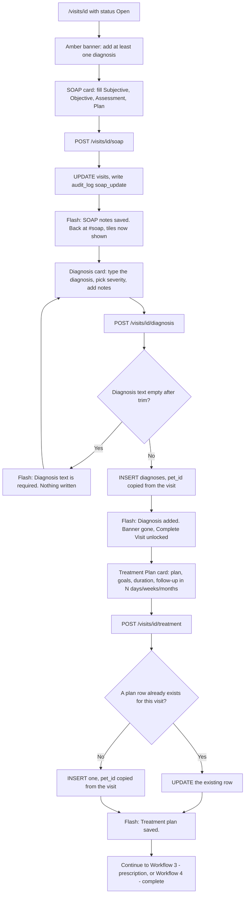

---
## Workflow 3 — Write a prescription, including on another vet's behalf

### 3.1 Who, when, why

**Who reaches the form:** anyone with the `visits` grant.
**Whose name may go on it:** only a user whose role is `doctor`, `clinic_owner` or
`super_admin`. That list is `PRESCRIBER_ROLES` and it is not configurable from any
screen — it is a constant in the code.
Source: `blueprints/visits/routes.py:310`

**When:** during an open visit, after the diagnosis.

**Why the split exists, in the code's own words:** a nurse may *type* a prescription —
a vet dictating while someone else enters it is how a busy clinic runs, and how paper
works. What she may not be is *recorded as the prescriber*.
Source: `blueprints/visits/routes.py:371-383`

### 3.2 Preconditions

- The visit exists and is `Open` (the form is hidden otherwise).
- **At least one active user with the role `doctor`, `clinic_owner` or `super_admin`
  must exist** if the person typing is not one of them. With none, no prescription can
  be recorded at all.
- The list of selectable vets is built from `users` where `is_active=1` and the role is
  one of the three, ordered by full name, showing `full_name` or, when that is blank,
  `username`. **A `super_admin` account appears in this list as if it were a vet** —
  worth knowing before you name one.
  Source: `blueprints/visits/routes.py:313-323`

### 3.3 The happy path — a vet writing their own

Dr Sara Fathy (role `doctor`) is signed in, on visit `#41`.

1. In the `💉 Prescriptions / الوصفات الطبية` card, open the fold
   `＋ Add Prescription / إضافة وصفة`. **It is closed by default**, unlike the diagnosis
   and treatment folds.
2. Because Dr Sara *is* a prescriber, there is **no** vet selector — the form starts
   straight at the medication line.
3. Fill line 1:
   - `Medication / دواء *` — **required.** `Metoclopramide`
   - `Dosage / الجرعة` — `2.5 mg` *(placeholder `e.g. 5mg / مثال: 5 مجم`)*
   - `Frequency / التكرار` — `BID` *(placeholder `e.g. BID / مثال: BID`)*
   - `Duration / المدة` — `5d` *(placeholder `e.g. 7d / مثال: 7 أيام`)*
   - `Route / طريقة الإعطاء` — `—`, `Oral / فموي`, `IV`, `IM`, `SC`,
     `Topical / موضعي`, `Ophthalmic / عيني`, `Otic / أذني`. Choose `Oral / فموي`.
   - `Qty / الكمية` — a number box. `10`
4. **More medicines:** press `＋ Add Line / إضافة سطر`. A second identical row appears.
   **Warning:** the rows added by this button are built in JavaScript with **English-only
   labels** (`Medication *`, `Dosage`, `Frequency`, `Duration`, `Route`, `Qty`) — they do
   not follow the Arabic interface.
   Source: `templates/visits/visit_detail.html:923-970`
5. `Prescription Notes / ملاحظات الوصفة` — one line of free text, e.g.
   `Give 30 minutes before food`.
6. *(Optional)* Press `💊 Check Interactions / فحص التداخلات الدوائية`. This is an AI
   call — see 3.4(e).
7. Press `Save Prescription / حفظ الوصفة`.
8. **What you see:** green flash `Prescription added.`, the page returns at
   `#prescriptions`, and the new prescription renders as `Rx #1 — 2026-08-19` with a
   table of its lines (Medication / Dosage / Frequency / Duration / Route / Qty). The
   counter beside the card title reads `1 Rx`. A purple
   `💊 Pharmacy / الصيدلية` button now appears in the topbar.
   Source: `blueprints/visits/routes.py:427-429`; `templates/visits/visit_detail.html:423-476, 35-39`

### 3.4 Every alternative that genuinely branches

**a) A nurse types it for a vet — the main branch.** Nurse Heba (role `nurse`) opens the
same fold. Above the medication rows she now sees an extra required field:

> `Prescribing veterinarian / الطبيب المعالج *`
> `— Select the vet / اختر الطبيب —` … list of active vets …
> *You may enter this on their behalf; it will be recorded in their name. / يمكنك إدخالها نيابةً عنه، وستُسجَّل باسمه.*

She picks `Dr. Sara Fathy` and saves. The prescription is stored with
`prescribed_by = 'Dr. Sara Fathy'`, and this line is **appended to the prescription
notes**:

```
[entered by Heba Mostafa on behalf of Dr. Sara Fathy]
```

It shows on the visit page under the Rx table as `Notes: … [entered by …]` and prints on
the take-home sheet.
Source: `templates/visits/visit_detail.html:494-517`; `blueprints/visits/routes.py:385-390`

**b) No vet exists on the system at all.** The selector is replaced by red text:

> `No veterinarian is set up on this system, so a prescription cannot be recorded. / لا يوجد طبيب بيطري مُسجَّل، لذا لا يمكن تسجيل وصفة.`

The medication rows and the Save button are still on screen. Pressing Save produces the
server-side refusal in 3.5.
Source: `templates/visits/visit_detail.html:510-515`

**c) A doctor prescribing on *another* vet's behalf.** Possible on the server — a
non-empty `prescribed_by` is validated against the active-vet list for **everyone**,
regardless of role — but the form does not render the selector for a prescriber, so
there is no way to do it from the screen.
Source: `blueprints/visits/routes.py:337-352`

**d) Several prescriptions on one visit.** Supported. Each save creates a new
`prescriptions` row; they render as `Rx #1`, `Rx #2`, … in creation order, and the
counter shows `2 Rx`. At completion **every item of every prescription becomes its own
invoice line** (Workflow 4).

**e) `💊 Check Interactions`.** Posts the medication names on the form plus every
medication already prescribed on this visit to `/ai/drug-interactions`. The banner that
appears is one of five:

| Result | Banner |
|---|---|
| Severe | 🚨 `SEVERE INTERACTION`: + the recommendation and each interaction |
| Moderate | ⚠️ `Moderate interaction`: + recommendation |
| Mild | 💛 `Mild interaction noted`: + recommendation |
| Not verified / service down / `safe` not exactly true | ❔ `Not checked.` `This is not a statement that the combination is safe — verify manually.` |
| Clean | ✅ `No interaction found in this check.` `Screened against known interactions only — species contraindications and dosing are not covered.` |
| Network failure | `⚠️ Interaction check unavailable — AI service offline.` |

All six strings are **English only**. The whole feature needs the `ai` grant, which a
nurse and a pharmacist do not hold — for them the button always lands on the last row.
Source: `templates/visits/visit_detail.html:1092-1170`

**f) Route and quantity left blank.** Route stores an empty string; quantity stores
NULL and prints as `—`.
Source: `blueprints/visits/routes.py:408-424`

### 3.5 Errors and edge cases — the exact messages

| What you do | What happens | Exact text |
|---|---|---|
| A non-prescriber saves without choosing a vet | Red flash, back to the visit. **Nothing written.** | `Select the prescribing veterinarian. Only a vet may be recorded as the prescriber, though you may enter the prescription on their behalf.` |
| A non-prescriber saves and **no** active vet exists | Red flash, back to the visit. Nothing written. | `No veterinarian is set up on this system, so a prescription cannot be attributed to one. Add a user with the doctor role first.` |
| A name is posted that is not an active vet (hand-built request, or the vet was deactivated while the page sat open) | Red flash, back to the visit. Nothing written. | `“Dr. Someone” is not an active veterinarian on this system, so a prescription cannot be recorded against them.` (note the curly quotes) |
| The visit id does not exist | Red flash, redirect to `/visits/` | `Visit not found.` |
| Line 1's medication box is empty | Browser blocks it (`required`) | browser's own message |
| Line 1 empty but line 2 filled (JS off / hand-built) | **A prescription row is created with no items.** The server's loop stops at the first missing `medication_name_N`, so line 2 is silently discarded and the card renders `No items in this prescription. / لا توجد أصناف في هذه الوصفة.` | `Prescription added.` |
| Stale token | 403 error page | `Invalid or missing security token. Please go back and try again.` |

Source: `blueprints/visits/routes.py:340-353, 363-368, 406-425`; `templates/visits/visit_detail.html:468`

### 3.6 What gets written, and what changes elsewhere

**One row in `prescriptions`:** `visit_id`, `pet_id` and `owner_id` (both copied from the
visit — the pharmacy queue joins on them), `prescribed_by` = the resolved **name**,
`status = 'Active'`, `notes` (with the on-behalf line appended when relevant),
`created_at`.

**One row in `prescription_items` per line:** `medication_name`, `dosage`, `frequency`,
`duration`, `route`, `quantity` (NULL when blank), `unit`, `instructions`.

**Two columns you should know are always blank from this screen:** the form renders **no
`unit` and no `instructions` input**, so both are written as empty strings — overriding
the schema's `'tablet'` default for `unit`. The printable sheet's `Instructions` column
is therefore always `—` for prescriptions written here.
Source: `blueprints/visits/routes.py:398-424`; `templates/visits/visit_detail.html:519-557`; `models/database.py:1376-1390`

**What changes elsewhere:**

- **Pharmacy** — the prescription enters the dispensing queue attributed to the named
  vet. The topbar `💊 Pharmacy / الصيدلية` link appears on this visit.
- **The exam screen** — the medication shows in this pet's `Medical → Medications` table
  and on the History detail line for this visit.
- **Completion** — every item becomes a `medication` line on the auto-invoice.
- **The print sheet** — a `Prescription #n` table per prescription.

### 3.7 Flowchart

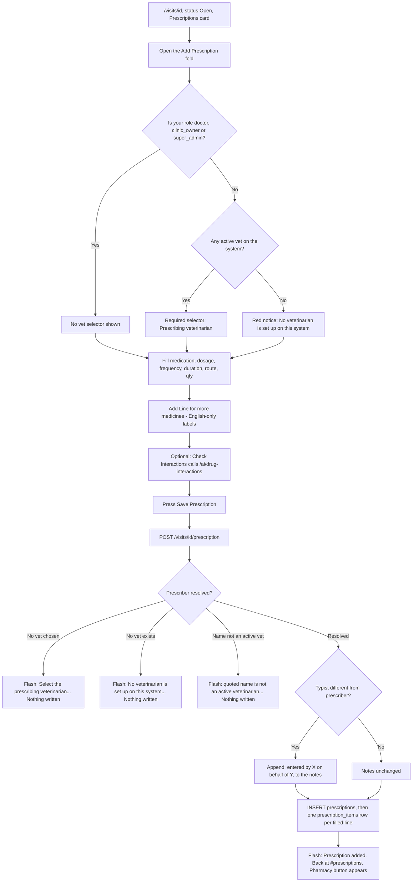

---

## Workflow 4 — Close the visit and bill it

### 4.1 Who, when, why

**Who:** any `visits` grant holder. In practice the vet at the end of the consultation.
**When:** the record is finished — at least one diagnosis exists.
**Why:** completion is the only way a long-form visit produces an invoice, and it is
irreversible from the interface.

**Read this before pressing the button.** Completion does three things at once and
**none of them can be undone from any screen in this chapter**:

1. The visit status becomes `Completed`.
2. **Every add/edit form on the visit page disappears for ever** — no more SOAP,
   diagnoses, treatment plan, prescriptions or lab requests on this visit.
3. An invoice is generated **with guessed prices**.

Source: `blueprints/visits/routes.py:465-588`; `templates/visits/visit_detail.html:237, 313, 372, 480, 627`

### 4.2 Preconditions

- Status is `Open`.
- **At least one diagnosis exists.** Until then the topbar shows a greyed-out
  `✔ Complete Visit / إنهاء الزيارة` with the tooltip
  `Add a diagnosis first / أضف تشخيصاً أولاً`, and the amber banner sits at the top of
  the page.
- A service catalogue with sensible names, if you want the auto-invoice to carry real
  prices (see 4.4).

Source: `templates/visits/visit_detail.html:40-58, 67-72`

### 4.3 The happy path

1. On `/visits/41`, press `✔ Complete Visit / إنهاء الزيارة` in the topbar.
2. **A browser confirm dialog appears:**
   `Mark this visit as Completed? An invoice will be auto-generated. / إنهاء هذه الزيارة؟ سيتم إنشاء فاتورة تلقائياً.`
   Press OK.
   Source: `templates/visits/visit_detail.html:50-53`
3. The server checks the diagnosis count, sets `status='Completed'`, then builds the
   invoice:
   - **One `service` line per diagnosis**, described as `Consultation — <diagnosis>`,
     quantity 1.
   - **One `medication` line per prescription item**, described by the medication name,
     quantity = the item's `quantity` or 1 when blank.
   - **Prices** come from a `LIKE '%keyword%'` search of `service_catalog.name` among
     active services, first match wins. For the consultation lines the keyword is the
     **visit type** (`Consultation`, `Dental`, …), falling back to the literal word
     `consultation`. For a medication line the keyword is the medication name.
     **Anything that does not match is priced 0.00.**
   - Discount 0, tax 0, note
     `Auto-generated from visit #41. Please update prices.`
   Source: `blueprints/visits/routes.py:499-563`
4. **What you see:** green flash `Visit completed. Invoice #7 auto-generated.`
   (that is the invoice **row id**, not the `INV-…` number) and you land on
   `/finance/invoices/7`.
5. **Fix the prices there** and take the money. The invoice note tells the next person
   the prices are guesses.
6. Back on the visit, the topbar now shows a green `✔ Completed / مكتملة` badge and a
   `🧾 Invoice INV-2026-00007` button. Every form is gone.
   Source: `templates/visits/visit_detail.html:25-33, 58-61`

### 4.4 Every alternative that genuinely branches

**a) An invoice is already linked to this visit.** Nothing is generated. The visit is
marked Completed, you get the flash `Visit marked as Completed.` and you stay on the
visit page.
Source: `blueprints/visits/routes.py:510-512, 583-587`

**b) Nothing in the service catalogue matches.** The invoice still appears — every line
priced `0.00`. This is not an error and there is no warning beyond the invoice note.
Practical example: a `Dental` visit at a clinic whose catalogue calls the service
`كشف أسنان` with no Latin name produces a `0.00` line, because the match is on the
English `name` column only.
Source: `blueprints/visits/routes.py:507-517`

**c) Three diagnoses.** Three consultation lines at the same price — the invoice charges
the consultation three times. Delete two in Finance if that is wrong.

**d) A prescription with five items.** Five medication lines, each priced by a name
search of the *service* catalogue (not the pharmacy items table), so a medicine that is
not also a service line is priced `0.00`.
Source: `blueprints/visits/routes.py:529-545`

**e) You are a `doctor`, `nurse` or `pharmacist` — the important one.** The visit **is**
completed and the invoice **is** created, then the redirect into `/finance/invoices/<id>`
hits the `invoicing` grant, which none of those roles holds by default. You are bounced
to the launcher and see **two** flashes at once:

> `Visit completed. Invoice #7 auto-generated.`
> `You don't have permission to access this page.`

Nothing is lost — the invoice exists and someone with the `invoicing` grant can open it.
But the vet cannot see or correct the guessed prices.
Source: `blueprints/visits/routes.py:570-575`; `blueprints/auth/routes.py:129-133`; `models/database.py:4356-4360`

**f) Invoice creation raises.** The visit is **still Completed**. You get an amber flash
`Visit completed but invoice creation failed: <the error>` and stay on the visit page.
Use the `🧾 Create Invoice / إنشاء فاتورة` button that now appears in the topbar — it
sends you to `/finance/invoices/new?visit_id=41`.
Source: `blueprints/visits/routes.py:576-578`; `routes.py:591-605`; `templates/visits/visit_detail.html:30-33`

**g) Re-completing an already Completed visit.** There is no button for it — the topbar
shows a badge instead. Posting to the endpoint by hand simply re-runs it; because an
invoice now exists, it takes branch (a).

### 4.5 Errors and edge cases — the exact messages

| What you do | What happens | Exact text |
|---|---|---|
| Press Complete with zero diagnoses (button is disabled, so only by hand-built request) | Amber flash, back to the visit. **Status unchanged.** | `Please add at least one diagnosis before completing the visit.` |
| Invoice creation fails | Amber flash, visit already Completed | `Visit completed but invoice creation failed: …` |
| Completion when an invoice already exists | Green flash, back to the visit | `Visit marked as Completed.` |
| Normal completion | Green flash, into Finance | `Visit completed. Invoice #<id> auto-generated.` |
| Stale token | 403 error page | `Invalid or missing security token. Please go back and try again.` |

Source: `blueprints/visits/routes.py:474-478, 570-578, 586`

### 4.6 What gets written, and what changes elsewhere

- `visits` — `status='Completed'`, `updated_at=datetime('now')`.
- `invoices` — one row: `status='Unpaid'`, `paid_amount=0`, `due_amount=total`,
  `visit_id` = this visit, `doctor_name` = the visit's doctor (or your own name when the
  visit has none), `issue_date` = today (**local** date), `notes` = the auto-generated
  warning, `created_by` = your full name. Number format `INV-2026-00007`.
- `invoice_lines` — one per diagnosis (`line_type='service'`) plus one per prescription
  item (`line_type='medication'`), each with `discount=0`.

Source: `blueprints/visits/routes.py:487-491, 556-568`; `models/database.py:3578-3617`

**What changes elsewhere:**

- `/visits/` — the row's badge turns green `Completed / مكتمل`.
- The visit page becomes read-only for ever.
- Finance — a new unpaid invoice appears in the invoices list and in the client's
  outstanding balance.
- The exam screen — this client's `Invoices` tab gains the row with a red `Pay` button,
  the `Owes / مديونية` alert strip appears at the top of their file, and the History row
  for this visit shows the charge and an `Unpaid` chip.
  Source: `blueprints/visits/routes.py:1010-1013`; `templates/visits/exam.html:2226-2266`

### 4.7 Flowchart

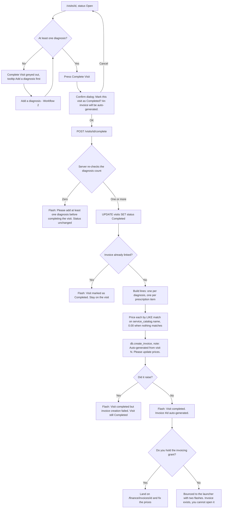

---

## Workflow 5 — Hand the record to the owner

### 5.1 Who, when, why

**Who:** any `visits` grant holder.
**When:** whenever the client asks for a copy — at any status, Open or Completed.
**Why:** it is the only printable clinical document in this chapter (the vaccination
certificate in Workflow 10 is the other printable artefact, and it is a real PDF).

### 5.2 Preconditions

- The visit exists. Nothing else. A visit with no diagnosis and no prescription still
  prints — the empty sections simply do not render.

### 5.3 The happy path

1. On `/visits/41`, press `🖨 Print / طباعة` in the topbar. It opens **in a new tab**.
2. The new tab loads `/visits/41/print` and **calls the browser's print dialog by
   itself** as soon as the page finishes loading.
3. What is on the sheet, in order:
   - **Header** — the clinic name from settings (falling back to `Aleefy`), its doctor
     name (falling back to `Happy Pets, Healthy Lives`), and on the right
     `VISIT #41`, the date/time, and a status badge.
   - **`⚠ ALLERGIES: …`** — a red box, only when the animal has allergies recorded.
   - **`Patient Information`** — pet name, `Species / النوع`, `Breed / السلالة`,
     `Sex / الجنس`, Date of Birth, `Owner / المالك`, `Phone / الهاتف`, Visit Type,
     `Doctor / الطبيب`.
   - **`Vitals`** — Weight, Temperature, `Heart Rate / معدل النبض`, then
     `Chief Complaint / الشكوى الرئيسية` and `Symptoms / الأعراض`.
   - **`Diagnoses`** — a numbered table with severity badges and notes.
   - **`Treatment Plan / خطة العلاج`** — a blue box with plan, goals, duration,
     follow-up.
   - **`Prescription #n`** — one table per prescription:
     `Medication / Dosage / Frequency / Duration / Route / Qty / Instructions`,
     then the prescription notes.
   - **Two signature lines** — `Veterinarian Signature` over `Dr. <doctor name>` and
     `Owner Acknowledgement` over the owner's name.
   - **Footer** — `<clinic> — Confidential Medical Record` and the print date.
4. Print or save as PDF from the browser dialog. **Nothing is written to the database.**

Source: `blueprints/visits/routes.py:608-660`; `templates/visits/visit_print.html:44-180`

### 5.4 Every alternative that genuinely branches

**a) Arabic.** The page sets `dir="rtl"` on `<html>` when the language is Arabic, so the
layout mirrors. About half the labels are bilingual; the section titles
(`Patient Information`, `Vitals`, `Diagnoses`, `Prescription #n`), `Pet Name`,
`Date of Birth`, `Visit Type`, `Weight`, `Temperature`, `Severity`, `Goals`,
`Veterinarian Signature`, `Owner Acknowledgement` and the footer are **English only**.
Source: `templates/visits/visit_print.html:2-3, 63-179`

**b) Printing an Open visit.** Allowed. The status badge shows amber `Open`.

**c) Sections that vanish.** No diagnoses → no Diagnoses table. No treatment plan → no
Treatment Plan box. No prescriptions → no prescription tables. There is no "nothing
recorded" placeholder for any of them.

**d) The print dialog does not appear.** The call is `window.onload`. If the tab is
loaded in the background some browsers defer it; switch to the tab and press Ctrl+P.
Source: `templates/visits/visit_print.html:178`

### 5.5 Known limits of this sheet

- **It does not print SOAP notes.** The four SOAP fields are on the visit row and shown
  on screen, but the print template has no SOAP section at all.
- **It does not print lab requests.** The route fetches `lab_requests` and passes them to
  the template; the template never renders them. The variable is loaded and thrown away.
  Source: `blueprints/visits/routes.py:645-648` vs `templates/visits/visit_print.html` (no `lab_requests` reference anywhere)
- **It does not print the visit's own `notes` field**, though the screen does.
- **Severity badge colours collapse:** `Critical` is drawn with the same red badge as
  `Severe`; anything else, including `Moderate`'s own amber, is handled but an unknown
  value falls to the green "mild" style.
  Source: `templates/visits/visit_print.html:116`

### 5.6 Flowchart

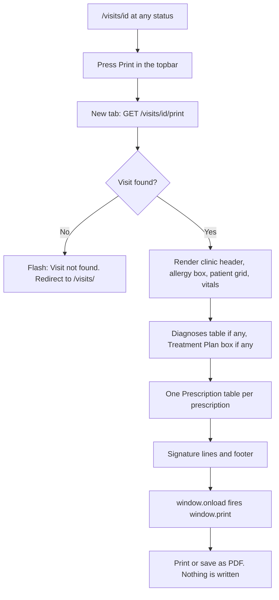

---
## Workflow 6 — The one-screen exam ("Hatem Way / طريقة حاتم")

### 6.1 Who, when, why

**Who:** any `visits` grant holder. The screen was written for the vet and the front
desk, but **`reception` cannot open it as shipped** — see 0.2 and fix the role first.

**When:** a routine paid consultation that begins and ends at the counter. The whole
encounter — vitals, symptom, diagnosis, vaccination, prescription, follow-up booking,
photo, bill, cash and change — is **one page and one Save**.

**Why:** it exists so the vet never navigates away mid-consultation. Everything is on one
URL, and the client picker, the 360 tabs and the walk-in registration are all fetches
that do not reload the page.

**Before you use it, know its three hard constraints:**

1. Every visit it writes is `visit_type = 'Consultation'` and `status = 'Completed'`.
   There is no way to record any other type, and no way to leave it open.
2. It writes **no SOAP notes, no heart rate, no respiratory rate, no treatment plan**.
3. Because the visit is born Completed, **it can never be edited afterwards** — the
   visit detail page will show it read-only.

Source: `blueprints/visits/routes.py:1323-1331`; `templates/visits/visit_detail.html:237, 313, 372, 480, 627`

### 6.2 Preconditions

- The service catalogue (`service_catalog`) has active rows with real prices, otherwise
  every line you add will be typed by hand at 0.00.
  Source: `blueprints/visits/routes.py:675-679`
- **JavaScript is mandatory.** The form's `action` is empty in the HTML and is set by
  script when a pet loads; the whole form starts `hidden`. With JS off the screen is a
  search box that does nothing.
  Source: `templates/visits/exam.html:97`; `exam.html:1734` (form.action set in show())
- The medication suggestion list comes from `items` where `is_medication=1` and
  `is_active=1` (max 400). A missing table is survivable — the datalist is simply empty.
  Source: `blueprints/visits/routes.py:681-689`

### 6.3 The happy path

Example: **Mr Karim Sabry / كريم صبري**, `0122 555 8899`, walks in with his dog
**Lulu / لولو** for a check-up and a rabies booster. Total will be 450 EGP; he hands over
500.

**Finding the client**

1. Open `/visits/exam` — launcher tile `⚡ Hatem Way — One-Screen Exam` or the
   `⚡ Hatem Way / طريقة حاتم` button on the visits list. The cursor lands in the search
   box by itself.
   Source: `templates/visits/exam.html:2660-2661`
2. The box is labelled `Phone or client name / رقم الهاتف أو اسم العميل`, placeholder
   `Type at least 2 characters… / اكتب حرفين على الأقل…`. Type `0122` or `كريم`.
   After 220 ms the results panel drops down: one block per client showing
   `Karim Sabry  ·  01225558899`, with a button per animal underneath
   (`Lulu · Dog`). Up to **25** clients are returned; the match runs against
   `full_name`, `phone` **and** `whatsapp_phone`.
   Source: `templates/visits/exam.html:1921-1990`; `blueprints/visits/routes.py:850-873`
3. **Keyboard, without touching the mouse:** `↓` / `↑` move between the animal buttons
   across all results, `Enter` opens the highlighted one (or the first, if none is
   highlighted), `Escape` closes the panel.
   Source: `templates/visits/exam.html:1993-2008`
4. Click (or Enter) `Lulu · Dog`. A `fetch` to `/visits/exam/api/pet/<id>` loads the
   whole file and the exam appears. **No page navigation happens** — the URL stays
   `/visits/exam`.

**What you now see, top to bottom**

5. **The client bar** — `Client / العميل` with the name (links to the CRM client page),
   the phone (a `tel:` link) and a `WhatsApp` link; `Pet / الحيوان` with the name (links
   to the CRM pet page) and `species · breed · sex · age`. The WhatsApp link **does**
   fix Egyptian numbers here: a number starting `0` is prefixed with `2` to make
   `wa.me/201225558899`.
   Source: `templates/visits/exam.html:1797-1806`
6. **The alert strip**, in this fixed order — anything not applicable is simply absent:

   | Alert | Colour | Text | Where it takes you |
   |---|---|---|---|
   | `Allergies / الحساسية` | red | the pet's `allergies` field | nowhere |
   | `Chronic / أمراض مزمنة` | red | the pet's `chronic_conditions` field | nowhere |
   | `Chronic / أمراض مزمنة` | amber | every diagnosis flagged chronic, joined by ` · ` | the first such visit |
   | `Vaccine overdue / تطعيم متأخر` | amber | `Rabies (2026-02-01)` per overdue vaccine | `/clinical/vaccinations?pet_id=…` |
   | `Owes / مديونية` | red | `320.00 EGP` | `/finance/invoices?owner_id=…&status=Unpaid` |
   | `Booked / موعد قادم` | blue | one per upcoming appointment: `date time · type · doctor` | `/appointments/<id>` |
   | `Diet / النظام الغذائي` | blue | the pet's `diet_notes` | nowhere |

   Source: `templates/visits/exam.html:1642-1688`
7. **Twelve tabs**, each with a count badge that is hidden when zero:
   `🩺 Visit / الكشف` · `🐾 Pets / الحيوانات` · `👤 Owner / المالك` ·
   `📅 Planned / المواعيد` · `🕘 History / السجل` · `💊 Medical / طبي` ·
   `🧾 Invoices / الفواتير` · `💰 Payments / المدفوعات` ·
   `🔔 Reminders / التذكيرات` · `📎 Documents / الملفات` · `✅ Tasks / المهام` ·
   `📝 Notes / ملاحظات`. Workflow 8 covers all of them; the `Visit` tab is the one you
   are on.
   Source: `templates/visits/exam.html:109-143`

**Charting**

8. The cursor is placed in `Weight (kg) / الوزن (كجم)`, pre-filled with the animal's
   stored weight. Type today's: `12.4`.
9. `Temp (C) / الحرارة` — `38.6`.
   **Sanity warnings** appear under the vitals as grey text, and never block the save:
   weight `≤ 0` or `> 120` → `Check the weight / راجع الوزن`; temperature `< 30` or
   `> 45` → `Check the temperature / راجع درجة الحرارة`.
   Source: `templates/visits/exam.html:2051-2069`
10. `Visit date / تاريخ الزيارة` — defaults to today. Back-date it here if you are
    entering yesterday's paper notes.
11. `Seen by / الطبيب المعالج` — a text box with a dropdown list of active vets. It is
    filled **from the client's preferred doctor** when they have one, otherwise with
    your own name. Overtype freely; an unknown name is allowed and stores `doctor_id`
    as NULL.
    Source: `templates/visits/exam.html:1760-1763`; `blueprints/visits/routes.py:891-920`
12. *(optional)* Open `Pet details / بيانات الحيوان` to read Name, Species, Breed, Sex,
    Date of birth, Age, Colour, Neutered, Microchip, Insurance. **All read-only** —
    nothing here is editable or saved.
13. `Symptom or disease / العرض أو المرض` — the big box. `Routine check-up, eating well`.
14. `Diagnosis / التشخيص` — `Healthy — annual check`.
15. `Severity… / الشدة…` — `Mild / خفيف`, `Moderate / متوسط`, `Severe / شديد`.
    **There is no `Critical` here**, unlike the long form. Leaving it blank stores NULL.
16. `Chronic / مزمن` checkbox — tick it and the diagnosis will raise a permanent amber
    alert on this animal's file for ever after.
17. `Notes / ملاحظات` — goes on **both** the visit row and the invoice.

Source: `templates/visits/exam.html:155-267`; `blueprints/visits/routes.py:1338-1360, 1490-1498`

**Billing**

18. In the middle column `Services and items / الخدمات والأصناف`, the box
    `Type to search, then Enter / اكتب للبحث ثم Enter` (placeholder
    `e.g. exam, vacc, shav… / مثال: كشف، تطعيم…`). Type `cons`. A menu drops down with up
    to **12** matches, each showing `English name  ·  الاسم العربي` and its price, the
    first one highlighted. Names that *start* with what you typed sort above names that
    merely contain it, and the Arabic name is searched too.
    Source: `templates/visits/exam.html:1314-1352`
19. `↓` / `↑` move the highlight, `Enter` adds the highlighted service, `Escape` closes.
    Or click a row. Or use the **quick chips** under the box — the first six catalogue
    services with their prices, one tap each.
    Source: `templates/visits/exam.html:1361-1391, 1556-1573`
20. The line lands in the table: `Item / الصنف`, `Price / السعر`, `Qty / الكمية`,
    `Disc % / خصم %`, `Total / الإجمالي`, and an `×` to remove it. Price, quantity and
    the per-line discount are all editable in place; `Total to pay / الإجمالي المطلوب`
    and `Items quantity / عدد الأصناف` update as you type.
    Source: `templates/visits/exam.html:1233-1305`
21. Add the rabies vaccine service the same way. Say the two lines come to 450.00.

**The money**

22. Right column `Payment / الدفع`:
    - `Payment type / طريقة الدفع` — `Cash / نقدي` (default) or `VISA`.
    - `Discount / الخصم` — a unit selector (`EGP` or `%`) and a value. This is the
      **whole-invoice** discount, separate from the per-line `Disc %`.
    - `Cash received / المبلغ المستلم` — type `500`.
    - `Change / الباقي` shows `50.00` and `Due / المتبقي` shows `0.00`, live.
    Source: `templates/visits/exam.html:310-338`; `exam.html:1281-1300`

**Everything else, in the folds below**

23. `Prescription / الروشتة` → `+ Add medication / أضف دواء` adds a row:
    `Medication / الدواء` (with the suggestion list), `Dose / الجرعة`,
    `Frequency / التكرار`, `Duration / المدة`, and `×` to remove. The fold's summary
    shows a live count `(2)`.
24. `Vaccination given today / تطعيم أُعطي اليوم` → `+ Record a vaccination / سجّل تطعيم`
    adds a row: `Vaccine / التطعيم`, `Brand / الماركة`, `Batch / التشغيلة`,
    `Next due / الموعد القادم`. **The next-due date is pre-filled one year after the
    visit date.** The fold carries the standing warning:
    *Billing a vaccine and recording it are different. Only this sets the next due date
    the reminder uses. / فوترة التطعيم غير تسجيله. هذا وحده يحدد موعد الجرعة القادمة الذي
    يعتمد عليه التذكير.* Type `Rabies`, brand `Nobivac`, batch `B2026-114`.
    Source: `templates/visits/exam.html:380-400`; `exam.html:1445-1481`
25. `Book the follow-up / حجز المتابعة` → `Date / التاريخ` and `Time / الوقت`, with quick
    chips `1 week / أسبوع`, `2 weeks / أسبوعان`, `1 month / شهر` that set the date
    relative to the **visit date**.
26. `Attach a photo or file / إرفاق صورة أو ملف` → one file
    (`.jpg .jpeg .png .gif .webp .pdf .doc .docx .xls .xlsx`) plus a
    `Caption / وصف`. The chosen filename shows in the fold's summary.

**Saving**

27. Press `Save visit / حفظ الكشف` — or `Ctrl/Cmd + Enter` from anywhere on the page.
    Both Save buttons disable themselves immediately so a double press cannot double
    submit.
    Source: `templates/visits/exam.html:2014-2023`
28. **What you see:** you land on `/finance/invoices/<id>` with a green flash such as

    > `Visit saved. Invoice INV-2026-00012 — total 450.00, change 50.00.`

    `change` is appended only when the client handed over more than the total, and
    `due` only when they handed over less. With exact money you get just
    `Visit saved. Invoice INV-2026-00012 — total 450.00.`
    Source: `blueprints/visits/routes.py:1524-1533`

### 6.4 Every alternative that genuinely branches

**a) `Save and print / حفظ وطباعة`** does everything identically and then lands on
`/finance/invoices/<id>/print` instead of the invoice page.
Source: `blueprints/visits/routes.py:1536-1539`

**b) Cash vs VISA.** The radio is the only choice on this screen. `VISA` records the
payment with method `Visa`; **anything else, including a blank, records `Cash`**. There
is no Instapay option here — that exists only in the Invoices-tab payment dialog
(Workflow 8).
Source: `blueprints/visits/routes.py:1519-1523`

**c) Paid in full / overpaid / part-paid / not paid at all.** One rule governs all four:
`applied = min(cash_received, invoice total)`.

| Client hands over | Invoice total | Payment recorded | `Change / الباقي` | `Due / المتبقي` | Invoice status |
|---|---|---|---|---|---|
| 500.00 | 450.00 | 450.00 | 50.00 | 0.00 | `Paid` |
| 450.00 | 450.00 | 450.00 | 0.00 | 0.00 | `Paid` |
| 200.00 | 450.00 | 200.00 | 0.00 | 250.00 | `Partial` |
| blank / 0 | 450.00 | **none at all** | 0.00 | 450.00 | `Unpaid` |

The surplus is **change, not an overpayment** — the ledger never records more than the
invoice is owed. A negative amount is floored at zero.
Source: `blueprints/visits/routes.py:1512-1523`

**d) Nothing billable.** If every service line was removed (or none was ever added), no
invoice and no payment are created. You get the green flash
`Visit saved. No services were billed.` and land on **`/visits/<id>`** — the read-only
visit page, because the visit is already Completed.
Source: `blueprints/visits/routes.py:1500-1502`

**e) A service that is not in the catalogue.** Type its name and press `Enter` with no
menu matches: the line is added at **0.00** and the cursor jumps into the price box with
the value selected, so the zero cannot be missed. That line is saved with `item_id`
NULL.
Source: `templates/visits/exam.html:1354-1360`

**f) Discounts.** Two independent mechanisms:
- **Per line, `Disc %`** — a percentage, clamped `0–100` on screen and again on the
  server. `150` becomes `100`.
- **Whole invoice, `Discount / الخصم`** — `EGP` (a flat amount) or `%`. Negative values
  are floored at zero, and `db.create_invoice` clamps the resulting amount so it can
  never exceed the subtotal.
Source: `blueprints/visits/routes.py:1478-1487, 1504-1510`; `models/database.py:3588-3594`

**g) Several pets, one client.** Under the left column, `Other pets of this client /
حيوانات أخرى لنفس العميل` shows a button per sibling (`Bella · Cat · 3y 2m`). Clicking
one loads that animal **and wipes the form first** — symptom, temp, notes, cash,
discount, services, prescription rows, vaccination rows, follow-up, file, diagnosis,
severity and chronic are all cleared, and the payment type returns to Cash. This is
deliberate: it stops you charting the cat onto the dog. The weight box is then refilled
from the newly loaded animal.
Source: `templates/visits/exam.html:1706-1729, 1730-1733`

**h) Two clients at once.** Press `⧉ Second file / ملف ثانٍ` in the client bar. It opens
another `/visits/exam` **in a new tab**; the server keeps no notion of a "current case",
so both tabs work independently.
Source: `templates/visits/exam.html:26-30`

**i) `Hide billing / إخفاء الفاتورة`.** The button above the columns drops the two
billing panes and gives the whole width to the clinical column. The running total moves
onto the button itself, and the button becomes `Show billing / إظهار الفاتورة`. The
choice is remembered in the browser (`localStorage` key `hw-focus`).
**On a screen narrower than 1180 px the toggle is hidden entirely.**
Source: `templates/visits/exam.html:146-151, 1874-1899, 922`

**j) Which folds are open, and which tab you were on,** are also remembered per browser
(`hw-folds`, `hw-tab`).
Source: `templates/visits/exam.html:1903-1917, 2080`

**k) Leaving with unsaved work.** Navigating away, closing the tab or pressing Back with
anything typed into symptom, temp, notes, cash, a service line, a file, a prescription
row, a diagnosis or a vaccination row triggers the browser's own
"Leave site?" confirmation. It does not fire after you press Save.
Source: `templates/visits/exam.html:2033-2049`

**l) Arabic.** This screen is the most completely bilingual in the chapter — even its
JavaScript messages come from a server-rendered label block. The service picker searches
the Arabic name (`service_catalog.name_ar`) as well as the English one, and shows both.
What stays English: the `VISA` radio label, `EGP`, `WhatsApp`, and the flash message
after saving.
Source: `templates/visits/exam.html:1171-1214, 1315-1329`

### 6.5 Errors and edge cases — the exact messages

| What you do | What happens | Exact text |
|---|---|---|
| Open `/visits/exam/<pet_id>` for a pet that does not exist **or is inactive** | Red flash, back to the empty exam screen | `Pet not found.` |
| Post the save for a missing/inactive pet | Red flash, back to the empty exam screen. Nothing written. | `Pet not found.` |
| A sibling button fails to load (network, or the pet was deactivated) | **The form is wiped** and a red alert appears, so the previous animal's chart cannot be mistaken for the new one | `Could not open that animal / تعذر فتح ملف الحيوان` — `The form was cleared so nothing is charted against the wrong animal. Pick the pet again. / تم مسح النموذج حتى لا تُسجَّل بيانات على حيوان خطأ. اختر الحيوان مرة أخرى.` |
| Type a weight of `0` or `250` | Grey warning under the vitals. **Save still works.** | `Check the weight / راجع الوزن` |
| Type a temp of `12` or `60` | Grey warning. Save still works. | `Check the temperature / راجع درجة الحرارة` |
| Set a line quantity to `0` or a negative, or a negative price | **That line is silently dropped from the invoice.** No message. | — |
| Type letters into a money or vitals box | Parsed as `0` (or NULL for vitals) rather than raising | — |
| Attach a file the validator rejects | Amber flash on the invoice page; the visit and invoice are still saved | `Photo not attached: File type not allowed.` / `Photo not attached: File content does not match its extension.` / `Photo not attached: No file selected.` |
| Attach a file over 16 MB | Flask rejects the whole request before any code runs — a `413` page. **Nothing at all is saved.** | Flask's own 413 |
| Double-click Save | The buttons disable on submit, and the payment carries the idempotency key `exam-<visit_id>-<invoice_id>`, so the money cannot be taken twice | — |
| Stale token | 403 error page | `Invalid or missing security token. Please go back and try again.` |
| You are a `doctor`, `nurse` or `pharmacist` | **Everything is saved** — visit, diagnosis, vaccination, follow-up, prescription, attachment, invoice, payment — and then the redirect into Finance is refused. You land on the launcher with both the success flash and `You don't have permission to access this page.` | see 0.2 |

Source: `blueprints/visits/routes.py:836-839, 1308-1312, 1470-1476, 1444-1450`; `templates/visits/exam.html:2051-2069, 1851-1866`; `blueprints/uploads/routes.py:96-124`; `config.py:149`

**The silent failures you must know about.** Four of the seven things this Save writes
are wrapped in `try/except` that **log and continue without telling you**:

| If this fails | You are told | The visit is still saved |
|---|---|---|
| The diagnosis | **No** | Yes |
| A vaccination row | **No** | Yes |
| The follow-up appointment | **No** | Yes |
| The prescription | **No** | Yes |
| The attachment | Yes — amber flash | Yes |
| The invoice | No — the exception propagates and you get a 500 page | Yes (already committed) |

**Practical consequence:** after saving a visit that included a vaccination, check the
`Medical` tab or `/clinical/vaccinations?pet_id=…` to confirm it is there. The wizard at
`/workflow` verifies its own vaccination write; this screen does not.
Source: `blueprints/visits/routes.py:1345-1360, 1372-1382, 1387-1402, 1416-1435, 1444-1450`

### 6.6 What gets written, and what changes elsewhere

One press of Save writes, **in this order**:

| # | Table | What |
|---|---|---|
| 1 | `visits` | `visit_type='Consultation'`, `status='Completed'`, `chief_complaint` **and** `symptoms` both set to the symptom box, `weight_kg`, `temp_c`, `visit_date` from the date box, `doctor_id` resolved from the typed name, `created_by` = your user id |
| 2 | `pets` | `weight_kg` overwritten with today's weight, `updated_at` bumped — **only when a weight was typed** |
| 3 | `diagnoses` | one row if the box was filled: `diagnosis`, `severity` (NULL when blank), `is_chronic`, `created_by` = your **full name** |
| 4 | `vaccinations` | one row per filled vaccine name: `vaccine_name`, `vaccine_brand`, `batch_number`, `administered_by` = the doctor named on the visit, `administered_at` = the visit date, `next_due_at`, and **`visit_id`** |
| 5 | `appointments` | one `Follow-up`, status `Scheduled`, `appt_start` defaulting to `09:00` when no time was given, reason `Follow-up for: <diagnosis or symptom or "visit">` |
| 6 | `prescriptions` + `prescription_items` | one prescription (`prescribed_by` = the doctor named on the visit, `status='Active'`, empty notes) with one item per filled medication |
| 7 | `attachments` | the file, against `entity_type='visit'` |
| 8 | `invoices` + `invoice_lines` | via the same `db.create_invoice` Finance uses. Every line is `line_type='service'` |
| 9 | `payments` | via `db.add_payment` — only when `applied > 0` |

Source: `blueprints/visits/routes.py:1323-1533`

**Two things about the prescription written here that matter to the pharmacy:** the form
collects **no route, no quantity and no instructions**, and the INSERT names only
`medication_name, dosage, frequency, duration, instructions`. So every item lands with
the schema defaults `route='Oral'`, `quantity=1`, `unit='tablet'`, and an empty
`instructions` — regardless of what was actually prescribed.
Source: `blueprints/visits/routes.py:1424-1431`; `models/database.py:1376-1390`; `templates/visits/exam.html:1512-1538`

**What changes elsewhere:**

- `/visits/` — the visit appears with a green `Completed / مكتمل` badge.
- `/visits/<id>` — the full record, **read-only for ever**.
- Finance — a new invoice, already `Paid` / `Partial` / `Unpaid` per the cash taken.
- `/clinical/vaccinations` — the new record, and the animal's next due date now drives
  the 30-day banner and the WhatsApp recall.
- Appointments — the follow-up appears on the calendar and in the `Booked / موعد قادم`
  alert next time this animal is opened.
- Pharmacy — the prescription enters the dispensing queue.
- The exam screen's own tabs, next time the client is loaded: History, Medical,
  Invoices, Payments, Documents all gain rows.

### 6.7 Flowchart

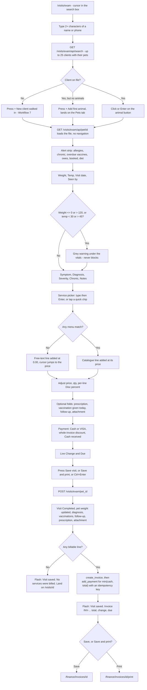

---
## Workflow 7 — Register a walk-in without leaving the exam

### 7.1 Who, when, why

**Who:** whoever is on the exam screen — in a real clinic, the front desk.
**When:** a client with no file walks in with an animal.
**Why:** the alternative is leaving the screen for CRM, which throws away anything
already typed. This registers the client and their first animal and opens the exam on
that animal, all without a page load.

Source: `blueprints/visits/routes.py:1062-1122`

### 7.2 Preconditions

- You are on `/visits/exam` with no patient loaded (the empty state), **or** you have
  found a client who has no animals (7.4 b).
- Nothing else — no CRM permission is needed, because the write goes through the exam's
  own endpoint under the `visits` grant.

### 7.3 The happy path

**Mrs Salma Naguib / سلمى نجيب** arrives with a kitten, no file, phone `0111 234 5678`.

1. On the empty exam screen the card reads
   `Search for a client above to begin. / ابحث عن عميل بالأعلى للبدء.`
   Press `+ New client walked in / عميل جديد`. The cursor lands in the first box.
2. The card `New client and pet / عميل وحيوان جديد` opens with eight fields:
   - `Client name / اسم العميل *` — **required.** `Salma Naguib`
   - `Phone / الهاتف` — `01112345678` *(numeric keypad on mobile)*
   - `Address / العنوان` — `Maadi, Cairo`
   - `Pet name / اسم الحيوان *` — **required.** `Mishmish`
   - `Species / النوع` — free text with suggestions `Canine`, `Feline`, `Avian`,
     `Rabbit`, `Reptile`
   - `Breed / السلالة`
   - `Sex / الجنس` — `—` (stored `Unknown`), `Male / ذكر` (`M`), `Female / أنثى` (`F`)
   - `Date of birth / تاريخ الميلاد`
   Source: `templates/visits/exam.html:59-95`
3. Press `Save and start the exam / حفظ وبدء الكشف`. The button disables while the
   request is in flight.
4. **What you see:** the card closes, its boxes are cleared, and **the exam opens loaded
   on Mishmish** — client bar, alert strip, tabs and all. You can start charting
   immediately.
   Source: `templates/visits/exam.html:1399-1447`

### 7.4 Every alternative that genuinely branches

**a) The phone already belongs to a client — the important one.** Before creating
anything the server looks the number up **normalised**: only digits are kept, Arabic-Indic
digits (`٠١٢…`) are folded to ASCII, and the Egyptian country code is stripped, so
`0100 123 4567`, `+201001234567` and `٠١٠٠١٢٣٤٥٦٧` are all the same person.

If a match is found: **no new client is created.** The animal is filed under the existing
client, the name you typed is discarded, and an amber alert appears at the top of the
screen so you know:

> `This number already has a file / هذا الرقم له ملف بالفعل`
> `The animal was added to Karim Sabry — one mobile number, one client file. / تمت إضافة الحيوان إلى ملف Karim Sabry — رقم واحد لكل عميل.`

Check the client bar before you continue — the file you are now in belongs to the name
in that message.
Source: `blueprints/visits/routes.py:1085-1099`; `models/database.py:3080-3118`; `templates/visits/exam.html:1433-1436`

**b) The client exists but owns no animals.** In the search results their block shows a
dashed button `+ Add first animal / أضف أول حيوان` instead of animal buttons. Pressing it
opens their file **on the Pets tab** with a blue alert:

> `No animals registered / لا يوجد حيوانات مسجلة`
> `Add the animal below and the visit opens on it. / أضف الحيوان بالأسفل وسيفتح الكشف عليه مباشرة.`

The **whole Visit tab is hidden** until an animal exists, so there is no live Save button
that could post a visit with no patient. Use `+ Add another pet / أضف حيوان آخر` on the
Pets tab (Workflow 8) and the screen switches to the Visit tab on that animal.
Source: `templates/visits/exam.html:1950-1965, 1837-1850, 883-885`

**c) No phone at all.** Allowed — the duplicate check is skipped and a new client is
created with empty `phone` and `whatsapp_phone`.
Source: `blueprints/visits/routes.py:1085`

**d) `Cancel / إلغاء`.** Closes the card and restores the empty state. Nothing is
written, and what you typed is discarded.

### 7.5 Errors and edge cases — the exact messages

| What you do | What happens | Exact text |
|---|---|---|
| Leave the client name or the pet name empty | Red line under the card, **the request is never sent** | `A client name and a pet name are required. / اسم العميل واسم الحيوان مطلوبان.` |
| Post with no client name (hand-built) | HTTP 400, message shown in the card | `A client name is required.` |
| Post with no pet name | HTTP 400 | `A pet name is required.` |
| The insert fails (bad data, database error) | HTTP 500, message in the card | `Could not save. Check the details and retry.` |
| The rows save but the pet cannot be re-read | HTTP 500 | `Saved, but could not load the pet.` |
| Network failure | Message in the card | `Could not save. Check the details and retry. / تعذر الحفظ. راجع البيانات وحاول مرة أخرى.` |

Source: `blueprints/visits/routes.py:1077-1081, 1113-1122`; `templates/visits/exam.html:1405-1410, 1437-1442`

### 7.6 What gets written, and what changes elsewhere

- **`owners`** — one row, only when the phone matches nobody: `full_name`, `phone`,
  **`whatsapp_phone` set to the same number**, `address`, `created_by` = your full name.
- **`pets`** — one row always: `owner_id`, `pet_name`, `species`, `breed`, `sex`
  (defaulting to `Unknown`), `dob` (NULL when blank).

Source: `blueprints/visits/routes.py:1100-1112`

**What changes elsewhere:** the client and animal appear immediately in CRM, in every
owner and pet dropdown across the platform, and in the exam screen's own search. No
visit, invoice or appointment is created by this step — that is the Save in Workflow 6.

### 7.7 Flowchart

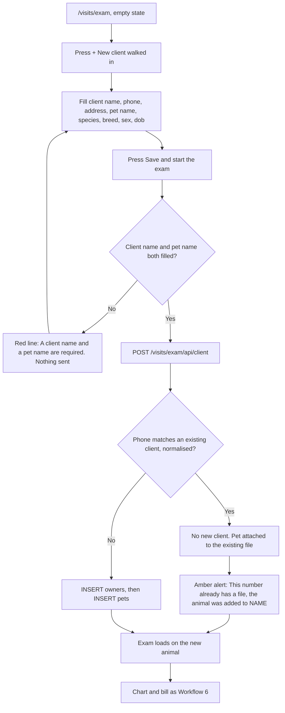

---

## Workflow 8 — Work the client's whole file while they stand at the counter

### 8.1 Who, when, why

**Who:** whoever has the exam screen open.
**When:** the client asks a question that is not about today's consultation — "what did
we pay last time?", "when is the other cat's vaccine due?", "can you book me for
grooming?", "did you send me a message?".
**Why:** every tab is a view of **one** fetch. Switching tabs never waits and never
reloads, so you can answer while the client is still at the desk.

**How it loads.** Choosing an animal calls `/visits/exam/api/pet/<id>` for the clinical
panels, and then `/visits/exam/api/owner/<owner_id>` once — that single call returns the
client, every animal, up to 200 visits, 50 upcoming appointments, 100 invoices, 100
payments, 100 vaccinations, 100 diagnoses, 100 medications, 100 documents, 50 WhatsApp
messages and 100 tasks, plus the badge counts.
Source: `blueprints/visits/routes.py:921-1044, 1046-1059`; `templates/visits/exam.html:2208-2215`

### 8.2 The twelve tabs, and what each is for

| Tab | Badge shows | What is in it | Rows link to |
|---|---|---|---|
| `🩺 Visit / الكشف` | — | Today's consultation — Workflow 6 | — |
| `🐾 Pets / الحيوانات` | number of animals | A card per animal with species · breed · sex · age and tags for `Allergies`, `Chronic`, `Vaccine overdue`, weight. Plus the `+ Add another pet` fold | clicking a card **switches the exam to that animal** |
| `👤 Owner / المالك` | — | Read-only client details incl. `Outstanding / المديونية` and `Loyalty points / نقاط الولاء`, a VIP badge, `Edit client / تعديل العميل` and a WhatsApp link | CRM |
| `📅 Planned / المواعيد` | upcoming count | Every future appointment for this client, plus the inline booking form | `/appointments/<id>` |
| `🕘 History / السجل` | number of visits | **Every visit of every animal this client owns**: date, animal, type, symptom, diagnosis, weight, temp, doctor, amount charged and a paid/partial/unpaid chip. Rows with extras expand to show vaccines given, medicines, file count, invoice number and severities | the date is always a real link to `/visits/<id>` |
| `💊 Medical / طبي` | overdue vaccines | Three tables for **the loaded animal**: Vaccinations (overdue dates in red), Medications, Diagnoses | certificate PDF / `/pharmacy/prescription/<id>` / `/visits/<id>` |
| `🧾 Invoices / الفواتير` | unpaid + partial count | This client's invoices with total, paid, due, status pill and a `Pay / دفع` button on anything still owed | `/finance/invoices/<id>` |
| `💰 Payments / المدفوعات` | payments count | Date, invoice, amount, method, received by | `/finance/invoices/<id>` |
| `🔔 Reminders / التذكيرات` | messages count | The WhatsApp log: date, template, first 60 characters, status | — |
| `📎 Documents / الملفات` | documents count | Files attached to this client's animals and visits | `/uploads/file/<id>` |
| `✅ Tasks / المهام` | **overdue** open tasks | Tick-box list plus a create form | — |
| `📝 Notes / ملاحظات` | — | The client note and the pet note, read-only | — |

Source: `templates/visits/exam.html:109-143, 433-806`; `exam.html:2098-2216, 2401-2468`

### 8.3 The four things you can write from these tabs

**a) Add another pet — `Pets` tab.**

1. Open the fold `+ Add another pet / أضف حيوان آخر`.
2. `Pet name / اسم الحيوان *` (required), `Species / النوع`, `Breed / السلالة`,
   `Sex / الجنس`, `Date of birth / تاريخ الميلاد`.
3. Press `Add pet and open it / أضف الحيوان وافتحه`.
4. The animal is created **and the exam switches onto it**, on the Visit tab, with the
   form cleared.
5. Refusals: `A pet name is required. / اسم الحيوان مطلوب.` (client-side and server-side,
   HTTP 400) · `Client not found.` (HTTP 404) · `Saved, but could not load the pet.`
   (HTTP 500).

Source: `templates/visits/exam.html:546-568, 2621-2657`; `blueprints/visits/routes.py:1259-1288`

**b) Book any appointment — `Planned` tab.**

1. Open `+ Book an appointment / حجز موعد`.
2. `Animal / الحيوان` (this client's animals only, defaulting to the one on the table),
   `Type / النوع` — `Consultation / كشف`, `Follow-up / متابعة`, `Vaccination / تطعيم`,
   `Grooming / تجميل`, `Surgery / جراحة`, `Lab / تحاليل`, `Emergency / طوارئ` —
   `Date / التاريخ`, `Time / الوقت` (defaults `09:00`), `Doctor / الطبيب`,
   `Reason / السبب`.
3. Press `Book it / احجز`.
4. The fold closes, the Planned table and its badge refresh, and a green alert appears at
   the top: `Appointment booked / تم حجز الموعد` with the date and time.
5. Refusals: no date → `Pick a date for the appointment. / اختر تاريخاً للموعد.` ·
   server with no client or date → `A client and a date are required.` (400) ·
   unknown client → `Unknown client.` (404) · an animal that is not this client's →
   `That animal is not registered to this client.` (400) · anything else →
   `Could not book. Check the details and retry.` (500).

**Note:** these inputs deliberately carry **no `name` attribute** — they sit inside the
visit form and would otherwise be posted with the examination.

Source: `templates/visits/exam.html:620-670, 2580-2619`; `blueprints/visits/routes.py:1199-1256`

**c) Create or tick off a task — `Tasks` tab.**

1. `New task / مهمة جديدة` (required; placeholder
   `e.g. Call about the lab result / مثال: الاتصال بخصوص نتيجة التحليل`),
   `Due / الاستحقاق`, `Assign to / مسؤول` (suggestions are the vet list),
   `Priority / الأولوية` — `Normal / عادية`, `High / عاجلة`, `Low / منخفضة`.
2. Press `Add task / أضف المهمة`. The list and the badge refresh; the title box clears
   and keeps focus so you can add another.
3. **Ticking the `Done / تم` box** flips the task closed and stamps who closed it and
   when. Un-ticking reopens it and clears both. Only the status moves — the text cannot
   be edited from here.
4. Rows are styled: done tasks greyed, tasks past their due date highlighted. The tab
   badge counts **overdue** open tasks, compared against the **local** date.
5. Refusals: empty title → `Type what needs doing. / اكتب المطلوب عمله.` (client-side)
   and `A task needs a title.` (400) · unknown id when ticking → `Unknown task.` (404) ·
   an animal that is not this client's → `That animal is not registered to this client.`
   (400) · anything else → `Could not save the task.` (500). On any failure the list is
   **re-read from the server**, so a tick that did not save cannot stay on screen.

Source: `templates/visits/exam.html:744-790, 2490-2578`; `blueprints/visits/routes.py:1128-1196`

**d) Settle an old invoice — `Invoices` tab.**

1. Press `Pay / دفع` on any row with money outstanding.
2. A dialog `Record payment / تسجيل دفعة` shows `Invoice / الفاتورة`,
   `Total / الإجمالي`, `Already paid / المدفوع`, `Still owed / المتبقي`.
3. `Amount received / المبلغ المستلم` is pre-filled with the full amount owed; the chip
   `Pay it all / سداد كامل` refills it.
4. `Method / الطريقة` — `Cash / نقدي`, `VISA`, **`Instapay`** (the only place in this
   chapter that offers Instapay).
5. Press `Paid / تم الدفع`. The dialog closes, the invoice list reloads, the screen jumps
   to the `Invoices` tab, and an alert appears:
   - paid in full → green `Settled in full / تم السداد بالكامل`, **plus a
     `+ Start a new case / بدء حالة جديدة` button** that blanks the screen and puts the
     cursor back in the search box;
   - part paid → amber `Payment recorded / تم تسجيل الدفعة` — `Still owed: 150.00`.
6. `Escape`, the `Cancel / إلغاء` button, or clicking the dark backdrop closes the dialog.
7. Refusals: zero or blank amount → `Enter an amount greater than zero. / أدخل مبلغاً
   أكبر من صفر.` (the request is not sent) · a failed request → the dialog **stays open**
   with `The payment was NOT recorded / لم يتم تسجيل الدفعة — Nothing was taken. Check
   the amount and try again. / لم يُخصم أي مبلغ. راجع المبلغ وحاول مرة أخرى.`
8. Double-click safety: one nonce per opening of the dialog is sent as the idempotency
   key, so a double press is one payment.

Source: `templates/visits/exam.html:808-855, 2268-2376`; `blueprints/finance/routes.py:368-420`

> **Warning — this button needs the `invoicing` grant, which `doctor`, `nurse` and
> `pharmacist` do not hold.** For those roles the POST is refused by the permission gate,
> which answers with a **redirect to the launcher** rather than a JSON error. The
> browser follows the redirect, the response arrives as HTTP 200, and the dialog reports
> success — **`Settled in full` — while no payment was taken.** Until this is fixed,
> only `clinic_owner`, `branch_manager` and `super_admin` should use the inline `Pay`
> button; everyone else should settle invoices in Finance. The main `Save visit` button
> is **not** affected: it takes payment through `db.add_payment` directly, inside the
> `visits` grant.
> Source: `blueprints/auth/routes.py:129-133`; `templates/visits/exam.html:2345-2353`; `blueprints/visits/routes.py:1512-1523`

### 8.4 Every alternative that genuinely branches

**a) Nothing to show.** Each table has its own empty line:
`No previous visits. / لا توجد زيارات سابقة.` ·
`No vaccinations recorded. / لا توجد تطعيمات مسجلة.` ·
`No medications recorded. / لا توجد أدوية مسجلة.` ·
`No diagnoses recorded. / لا توجد تشخيصات مسجلة.` ·
`No invoices for this client. / لا توجد فواتير لهذا العميل.` ·
`No payments recorded. / لا توجد مدفوعات.` ·
`Nothing has been sent yet. / لم يتم إرسال أي رسالة.` ·
`No files yet. Attach one on the Visit tab. / لا توجد ملفات. أرفق ملفاً من تبويب الكشف.` ·
`Nothing booked. / لا توجد مواعيد.` · `Nothing outstanding. / لا توجد مهام.`
Source: `templates/visits/exam.html:433-806`

**b) History before the 360 arrives.** For the fraction of a second before the owner call
returns, History shows **only the loaded animal's** visits. Once the owner payload lands
it is redrawn with every animal in the household.
Source: `templates/visits/exam.html:1813-1822`

**c) Middle-click and Ctrl-click.** Every linked row puts a real `<a>` in its first cell
and makes the whole row clickable on top, so "open in new tab" works properly.
Source: `templates/visits/exam.html:1585-1625`

**d) Documents.** The tab lists files attached to this client's **pets and visits**. The
only way to add one from this screen is the `Attach a photo or file` fold on the Visit
tab, which attaches to the visit being saved.

**e) Reminders.** Read-only. Nothing on this screen sends a WhatsApp message; the tab
shows what the messaging module has already sent.

### 8.5 What gets written

| Action | Table | Notes |
|---|---|---|
| Add another pet | `pets` | one row under the client on screen |
| Book an appointment | `appointments` | `status='Scheduled'`, `appt_start` defaults `09:00`, `created_by` and the doctor default to you |
| Create a task | `tasks` | `status='Open'`, `assigned_to` defaults to you, `created_by` = you |
| Tick a task | `tasks` | `status`, `done_at` (**local** date), `done_by`, `updated_at` |
| Pay | `payments` + `invoices` | through the Finance endpoint; `paid_amount` and `due_amount` are re-derived from the ledger |

Source: `blueprints/visits/routes.py:1148-1160, 1161-1178, 1226-1240, 1274-1281`; `models/database.py:3911-3938`

### 8.6 Flowchart

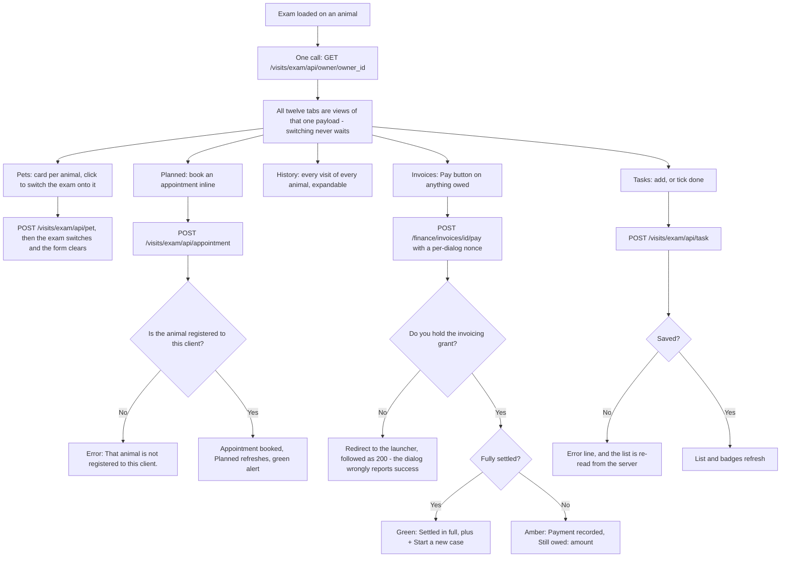

---
## Workflow 9 — Lab request, then the result

### 9.1 Who, when, why

**Who:** any `visits` grant holder — the vet raises the request, the technician files the
result. There is no role separation between the two.
**When:** a test is needed during a visit, and again when the analyser or the reference
lab returns a value.
**Why:** the request is the only way the test appears on the visit record and in the lab
queue, and the result is the only way it is recorded against the animal.

**Read 9.5 before you train anyone on this.** The `＋ Request Lab Test` form on the visit
page **does not work**, and the `＋ New Lab Request` button on the lab list leads to a
dead end. There is exactly one path that works, and it is the one below.

Source: `blueprints/clinical/routes.py:93-154, 157-224`

### 9.2 Preconditions

- **A visit must exist**, and you must know its id. `lab_requests.visit_id` and
  `lab_requests.pet_id` are both `NOT NULL`, and the form supplies them only from a
  visit passed in the URL.
  Source: `models/database.py:1392-1406`; `templates/clinical/lab_form.html:44-48`
- JavaScript must be on — the clinical forms carry no CSRF token of their own (0.6).

### 9.3 The happy path

Basbous's visit is `#41`. Dr Sara wants a CBC.

1. **Go to `/clinical/lab/new?visit_id=41`.** Type it, or follow a link that carries the
   visit id. (There is no button anywhere that produces this URL — see 9.5.)
2. A blue-edged context card confirms the patient: `Patient / المريض` with pet name and
   species · breed, `Owner / المالك` with name and phone, `Visit / الزيارة` with the
   visit date and type. **If this card is missing, stop** — the form will refuse to save.
   Source: `templates/clinical/lab_form.html:13-33`
3. Fill `🧪 Lab Request Details / 🧪 تفاصيل طلب المختبر`:
   - `Test Name / اسم الفحص *` — a dropdown of twelve: `CBC (Complete Blood Count)`,
     `Biochemistry Panel`, `Urinalysis`, `X-Ray`, `Ultrasound`,
     `Culture & Sensitivity`, `Fecal Exam`, `Heartworm Test`, `Thyroid Panel`,
     `Electrolytes`, `Blood Glucose`, `Coagulation Profile`, plus
     `Custom / Other / مخصص / أخرى`. **The twelve names are English only.**
   - `Custom Test Name / اسم فحص مخصص` — appears, and becomes required, only when
     `Custom` is chosen.
   - `Test Code / كود الفحص` — free text, placeholder `e.g. CBC-001 / مثال: CBC-001`.
   - `Priority / الأولوية *` — `Routine / روتيني` (default), `Urgent / عاجل`,
     `STAT (Immediate) / STAT (فوري)`.
   - `Sample Type / نوع العينة` — ten bilingual options: `Blood (EDTA) / دم (EDTA)`,
     `Blood (Serum) / دم (مصل)`, `Urine / بول`, `Feces / براز`, `Swab / مسحة`,
     `Tissue Biopsy / خزعة نسيجية`, `Fluid (Pleural) / سائل جنبي`,
     `Fluid (Abdominal) / سائل بطني`, `Skin Scraping / كشط جلدي`, `Other / أخرى`.
   - `Notes / Instructions / ملاحظات / تعليمات` — free text for the lab team.
   Source: `blueprints/clinical/routes.py:19-31`; `templates/clinical/lab_form.html:53-108`
4. Press `Create Lab Request / إنشاء طلب مختبر`.
5. **What you see:** green flash
   `Lab request for 'CBC (Complete Blood Count)' created.` and you land on
   `/clinical/lab` with the request in the **Pending** tab.
6. The request also now appears on the visit page, in the `🔬 Lab Requests / طلبات المختبر`
   card, with its priority badge and date.
   Source: `templates/visits/visit_detail.html:590-625`

**Filing the result** — later, when the value comes back:

7. Sidebar → `Lab & Vaccines / المختبر والتطعيمات` → `/clinical/lab`. Three tabs:
   `Pending`, `In Progress`, `Completed` (**English only**, each with a count pill).
8. In `Pending`, press `View / Enter Results / عرض / إدخال النتائج` on the row.
9. On `/clinical/lab/<id>` read `🧪 Request Information / 🧪 بيانات الطلب` — test name,
   test code, patient (links to CRM), owner (links to CRM), visit (links to
   `/visits/41`), requesting doctor, sample type, when it was requested, and the notes.
10. Fill `✏️ Enter Results / ✏️ إدخال النتائج`:
    - `Result Text / Report / نص النتيجة / التقرير` — the narrative.
    - `Numeric Value / القيمة الرقمية` — e.g. `6.5`.
    - `Unit / الوحدة` — placeholder `e.g. g/dL, cells/µL`.
    - `Reference Range / المدى المرجعي` — placeholder `e.g. 4.0–5.5 g/dL`.
    - `Mark as Abnormal / تعليم كغير طبيعي` — a red checkbox.
11. Press `Save Results & Mark Complete / حفظ النتائج وإنهاء الطلب`.
12. **What you see:** green flash `Lab results saved.`, back on the same page. The result
    appears as a card stamped with your name and the time; an abnormal one is drawn with a
    red border and a `⚠ ABNORMAL / ⚠ غير طبيعي` badge. The form is replaced by a green
    bar: `✅ This lab request is complete. Results have been recorded above. / ✅ اكتمل
    طلب المختبر. سُجّلت النتائج أعلاه.`

Source: `blueprints/clinical/routes.py:190-224`; `templates/clinical/lab_detail.html:150-244`

### 9.4 Every alternative that genuinely branches

**a) A custom test.** Choose `Custom / Other`, type the name in the box that appears. The
typed name replaces `Custom` and is what is stored and displayed.
Source: `blueprints/clinical/routes.py:106-108`

**b) Several tests for one visit.** Repeat the whole form once per test. There is no
multi-test screen and no basket.

**c) Several results for one request.** Possible only by re-opening a request that is not
yet `Completed` — but the first result sets it to `Completed`, which hides the form.
**In practice one request holds exactly one result.** Older results, if any exist from
another route, render newest first.
Source: `blueprints/clinical/routes.py:217-221`; `templates/clinical/lab_detail.html:150-152, 191`

**d) Priority.** `Urgent` and `STAT` render as red badges on the list and on the visit
page; `Routine` renders grey. **Nothing in the code sorts or filters by priority** — the
lists are ordered by `created_at DESC` only. A STAT request in a busy queue is a red
badge, not a queue jump.
Source: `blueprints/clinical/routes.py:56-63`; `templates/clinical/lab_list.html:44-47`

**e) Arabic.** The form and the detail page are bilingual apart from the twelve test
names. The list's three tab labels, the `Results (n)` heading and the placeholders are
English only.

### 9.5 Errors, edge cases, and the two broken paths

| What you do | What happens | Exact text |
|---|---|---|
| Submit with no test chosen | Browser blocks it (`required`) | browser's own message |
| Post with an empty test name | The form is re-rendered with the same visit context. Nothing written. | `Test name is required.` |
| Reach the form **without** `?visit_id=` and submit | Red flash and a redirect **back to the same dead-end form** | `Visit and pet are required.` |
| Choose `Custom` and leave the custom box empty (JS off) | **A request literally named `Custom` is saved.** | `Lab request for 'Custom' created.` |
| Open a lab id that does not exist | Flask 404 page | — |
| File a result on a request id that does not exist | Flask 404 page | — |
| Type a non-numeric value in `Numeric Value` (JS off / bypassed) | **HTTP 500.** The value is parsed with a bare `float()` with no guard. | Flask error page |
| Save a result with every box empty | **Succeeds** — an empty result row is written and the request is marked Completed. | `Lab results saved.` |
| Stale token, or JavaScript off | 403 error page | `Invalid or missing security token. Please go back and try again.` |

Source: `blueprints/clinical/routes.py:105-129, 167-170, 193-201`

**Broken path 1 — the `＋ Request Lab Test / طلب فحص مخبري` form on the visit page.**
It is on every open visit, it looks complete (test name with an eleven-entry suggestion
list, `Priority`, `Sample Type`, `Notes`, a `Request Test / طلب الفحص` button) and **it
cannot work**. Its `action` evaluates to `#`, and its JavaScript posts to
`/clinical/lab/request` — **an endpoint that does not exist anywhere in the codebase**.
You get a plain browser alert, English only:

> `Error submitting lab request. Please try from the Lab module.`

On a network-level failure it instead navigates you to `/clinical/lab`. **Nothing is ever
written.** Use `/clinical/lab/new?visit_id=N`.
Source: `templates/visits/visit_detail.html:633, 970-993`; endpoint absent from `blueprints/clinical/routes.py` (routes at lines 70, 77, 93, 157, 190, 228, 251, 320, 363, 384)

**Broken path 2 — the `＋ New Lab Request / ＋ طلب مختبر جديد` button on the lab list.**
It links to the bare `/clinical/lab/new`, with no visit. The form renders with **no way
to type a visit or a pet** — both are hidden inputs that only exist when a visit was
passed in — so submitting always produces `Visit and pet are required.` and returns you
to the same bare form. It is an unbreakable loop.
Source: `templates/clinical/lab_list.html:8-10`; `lab_form.html:44-48`; `blueprints/clinical/routes.py:121-124`

**Broken path 3 — the `In Progress` tab can never contain anything.** Creating a request
writes `Pending`; filing a result writes `Completed`. **No code path anywhere writes
`In Progress`.** The tab will always show
`No tests currently in progress. / لا توجد فحوصات جارية حالياً.`
Source: `blueprints/clinical/routes.py:137, 219`

### 9.6 What gets written, and what changes elsewhere

- **`lab_requests`** — one row: `visit_id`, `pet_id`, `test_name`, `test_code`,
  `priority`, `status='Pending'`, `sample_type`, `notes`,
  `requested_by` = your full name (or username when you have no full name).
- **`lab_results`** — one row: `lab_request_id`, `pet_id` (copied from the request),
  `result_text`, `result_value` (REAL or NULL), `unit`, `reference_range`,
  `is_abnormal`, `reviewed_by` = your name, `reviewed_at` = now (**UTC**).
- **`lab_requests.status`** → `Completed`.

Source: `blueprints/clinical/routes.py:128-145, 199-222`

**What changes elsewhere:** the request appears on the visit page and in the lab list;
the completed result moves the row from the `Pending` tab to `Completed`. **The visit's
printable sheet does not show lab requests** (Workflow 5), and the exam screen has no lab
panel at all.

### 9.7 Flowchart

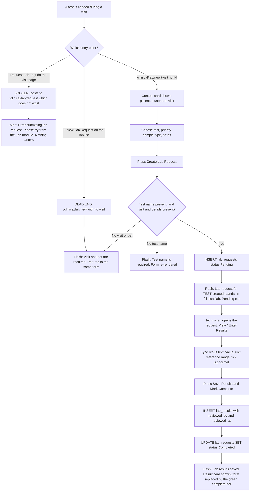

---

## Workflow 10 — The vaccination recall loop

### 10.1 Who, when, why

**Who:** any `visits` grant holder.
**When:** every time a vaccine is administered — and every time the 30-day due list is
worked.
**Why:** one field decides whether the owner is ever reminded. The WhatsApp recall selects
on `vaccinations.next_due_at`. **A vaccination recorded without a next-due date means the
animal quietly lapses.** The code says so and the screen warns you.

Source: `blueprints/clinical/routes.py:251-315`

### 10.2 Preconditions

- The animal exists. If you arrive without `?pet_id=` you must know the animal's
  **numeric id** — the form gives you a bare `Pet ID / رقم الحيوان` number box with no
  search.
- There is **no sidebar link to this screen.** Reach it from the launcher tile
  `💉 Vaccination & Preventive Care`, from an exam-screen overdue alert, from a CRM pet
  page, or by URL.

Source: `templates/clinical/vaccination_form.html:44-56`; `templates/base.html:145-148`

### 10.3 The happy path

1. Open `/clinical/vaccinations`. Two blocks:
   - **The due banner** — amber, headed `⚠️ Vaccinations Due in Next 30 Days (3)`
     (English only). One card per animal: pet name (links to the CRM pet page), the
     vaccine name, `Owner: Karim Sabry · 01225558899` (the **WhatsApp** number), a
     `Due 2026-09-02` badge, and a `Record / تسجيل` button.
     If nothing is due:
     `✅ No vaccinations due in the next 30 days. / ✅ لا توجد تطعيمات مستحقة خلال 30 يوماً.`
   - **`💉 All Vaccination Records / 💉 جميع سجلات التطعيم`**, showing `n records`
     (up to 200): `Pet / الحيوان` (+ owner, + a link
     `All vaccinations for this pet → / كل تطعيمات هذا الحيوان ←`),
     `Vaccine / اللقاح` (+ `Dose #2`), `Brand / Batch / الماركة / الدفعة`,
     `Date Given / تاريخ الإعطاء`, `Next Due / الجرعة التالية` (**bold red when it is
     today or in the past**), `Administered By / أعطاه`, `Site / الموضع`, and a
     `PDF` button.
   Source: `templates/clinical/vaccinations.html:72-186`
2. Press `Record / تسجيل` next to the animal that is due — this carries `?pet_id=` for
   you. (Or press `＋ Record Vaccination / ＋ تسجيل تطعيم` in the topbar and type the
   numeric pet id.)
3. On `Record Vaccination / تسجيل تطعيم` a blue-edged card confirms
   `Patient / المريض`, `Owner / المالك`, and — when there are any —
   `⚠ Allergies / ⚠ الحساسية` in red.
4. Fill `💉 Vaccination Details / 💉 تفاصيل التطعيم`:
   - `Vaccine / اللقاح *` — `Rabies`, `DHPP (Distemper/Hepatitis/Parvovirus/Parainfluenza)`,
     `Bordetella`, `Leptospirosis`, `Feline FVRCP`, `FeLV (Feline Leukemia)`, `Custom`.
     **English only.**
   - `Custom Vaccine Name / اسم لقاح مخصص` — appears and becomes required when `Custom`
     is chosen.
   - `Brand / Manufacturer / الماركة / المُصنّع` — placeholder
     `e.g. Nobivac, Felocell / مثال: Nobivac، Felocell`.
   - `Batch / Lot Number / رقم الدفعة / التشغيلة` — placeholder `e.g. B2024-001`.
   - `Dose Number / رقم الجرعة` — default `1`, min 1, max 10.
   - `Injection Site / موضع الحقن` — `Subcutaneous / تحت الجلد` (default),
     `Intramuscular / عضلي`, `Intranasal / أنفي`, `Oral / فموي`.
   - `Date Administered / تاريخ الإعطاء *` — required, defaults to today.
   - `Next Due Date / تاريخ الجرعة التالية` — **the field that drives the recall.**
   - `Notes / ملاحظات` — reactions, observations.
   Source: `blueprints/clinical/routes.py:33-41`; `templates/clinical/vaccination_form.html:58-124`
5. **The next-due date fills itself** the moment you choose the vaccine, provided the
   administered date is set and the next-due box is still empty:
   **+12 months** for Rabies, DHPP, FVRCP, Leptospirosis and FeLV; **+6 months** for
   Bordetella. Nothing is suggested for a custom vaccine.
   Source: `templates/clinical/vaccination_form.html:139-158`
6. Press `💉 Record Vaccination / 💉 تسجيل تطعيم`.
7. **What you see:** green flash `Vaccination 'Rabies' recorded.` and the vaccinations
   list, with the new row at the top of the records table.
8. **Hand the client the certificate:** press `PDF` on that row. A file
   `vacc_cert_<PetName>_<id>.pdf` downloads. It is a one-page A4 certificate headed
   `VACCINATION CERTIFICATE` with the clinic branding, a certificate number
   `CERT-00042`, an issue date, boxes for `Patient Information` (name, species, breed,
   sex, date of birth, microchip) and `Owner Information` (owner, phone, address), a
   `VACCINE DETAILS` table (vaccine, brand, batch, dose number, site, date administered,
   next due date, administered by), the notes, and a signature line. **The certificate is
   entirely in English.**
   Source: `blueprints/clinical/routes.py:320-350`; `models/pdf_generator.py:562-728`

### 10.4 Every alternative that genuinely branches

**a) The vaccine was given during a one-screen exam.** Use the
`Vaccination given today / تطعيم أُعطي اليوم` fold instead (Workflow 6, step 24). That
path writes the same `vaccinations` row **and** fills `visit_id`, which this form never
does — see 10.5.

**b) `?pet_id=` narrows the whole page.** `/clinical/vaccinations?pet_id=17` shows a
header strip `Showing vaccinations for Lulu / عرض تطعيمات` with a
`Show all pets / عرض كل الحيوانات` button, filters the due banner to that animal, and
lists **all** of its vaccinations with no 200-row cap. In this mode the owner name is not
fetched, so the small grey owner line under each pet name disappears.
Source: `blueprints/clinical/routes.py:232-238`; `models/database.py:4106-4118`

**c) A custom vaccine.** The typed name replaces `Custom` and no next-due date is
suggested — type it yourself.
Source: `blueprints/clinical/routes.py:263-266`

**d) You leave `Next Due Date` empty.** The record still saves, and you get **two**
flashes, the amber one first:

> `No next-due date was set, so no reminder will be sent for this vaccination.`
> `Vaccination 'Rabies' recorded.`

Source: `blueprints/clinical/routes.py:300-306`

**e) The certificate cannot be produced.** If the PDF library is missing you get a red
flash `fpdf2 is not installed. Run: pip install fpdf2` and are returned to the
vaccinations list. Any other failure flashes
`Certificate generation failed: <the error>`.
Source: `blueprints/clinical/routes.py:341-350`; `models/pdf_generator.py:569-570`

### 10.5 Known limits of this screen

- **Overdue vaccines are invisible on this page's banner.** The 30-day list selects
  `next_due_at BETWEEN today AND today+30`, so anything whose due date has already passed
  is **excluded**. It shows only as red text in the records table, and on the exam
  screen's `Vaccine overdue / تطعيم متأخر` alert. There is no "overdue" list anywhere in
  this module.
  Source: `models/database.py:4120-4130`
- **The form never sends `visit_id`.** The route supports it and the column exists, but
  the template has no such input, so a vaccination recorded here is orphaned from the
  consultation it happened at. Only the exam screen (Workflow 6) and the `/workflow`
  wizard fill it.
  Source: `blueprints/clinical/routes.py:275-280`; `templates/clinical/vaccination_form.html:41-56`
- **No sidebar link.** See 10.2.
- **No edit and no delete.** A vaccination recorded with the wrong date or the wrong
  next-due date cannot be corrected from any screen in this chapter.
- **Without `?pet_id=` the form asks for a raw numeric `Pet ID`** and offers no search.

### 10.6 What gets written, and what changes elsewhere

**One row in `vaccinations`:** `pet_id`, `visit_id` (**always NULL from this form**),
`vaccine_name`, `vaccine_brand`, `batch_number`, `dose_number`,
`administered_by` = your full name (or username), `administered_at`, `next_due_at`,
`site`, `notes`.
Source: `blueprints/clinical/routes.py:282-298`; `models/database.py:1424-1439`

**What changes elsewhere:**

- The **WhatsApp recall** now has a date to select on for this animal.
- The **exam screen** — `Medical → Vaccinations` gains the row; once the due date passes,
  the amber `Vaccine overdue / تطعيم متأخر` alert appears at the top of the animal's file
  and links straight back here.
- The **due banner** on this page picks the animal up when the date comes within 30 days.
- The **certificate** becomes available for that row.

### 10.7 Flowchart

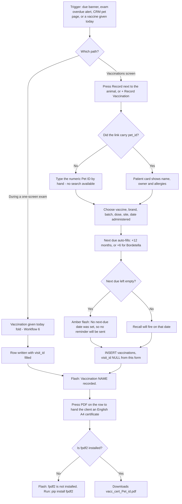

---

## Workflow 11 — Record a surgery

### 11.1 Who, when, why

**Who:** any `visits` grant holder.
**When:** after a procedure, as the paper record.
**Why:** it is the only place the platform stores a surgical record.

**Set expectations before you rely on it.** A surgery row, once saved, **cannot be
opened, edited, deleted or printed**, is **not linked to a visit or an invoice**, and the
list has no filter or search. It is a logbook, not a workflow.

Source: `blueprints/clinical/routes.py:363-434`; `templates/clinical/surgeries.html`

### 11.2 Preconditions

- The animal exists. Without `?pet_id=` you need its **numeric id**.
- There is **no sidebar link**. The only entry point is the launcher tile
  `🔧 Surgery & Procedures`, or the URL `/clinical/surgeries`.

### 11.3 The happy path

1. Open `/clinical/surgeries`. The card `🔧 Surgery Records / 🔧 سجلات العمليات` shows
   `n records` and a table (up to 200, newest first): `Date / التاريخ`,
   `Patient / المريض` (name, then species · owner), `Procedure / الإجراء`
   (+ `Anesthetist: …` underneath), `Surgeon / الجراح`, `Anesthesia / التخدير`,
   `Duration / المدة` shown as `45 min`, `Outcome / النتيجة` as a coloured badge, and
   `Follow-up / المتابعة`. **No row is clickable.**
   With nothing recorded: `No surgery records yet. / لا توجد سجلات عمليات بعد.` and a
   `Record First Surgery / سجّل أول عملية` button.
   Source: `templates/clinical/surgeries.html:33-96`
2. Press `＋ Record Surgery / ＋ تسجيل عملية`.
3. If you arrived with `?pet_id=`, a blue-edged card confirms `Patient / المريض`
   (with weight), `Owner / المالك`, `⚠ Allergies / ⚠ الحساسية` and
   `Chronic Conditions / الأمراض المزمنة`. Otherwise, type the numeric
   `Pet ID / رقم الحيوان *`.
4. Fill `Procedure Information / بيانات الإجراء`:
   - `Procedure Name / اسم الإجراء *` — required, placeholder
     `e.g. Ovariohysterectomy, Fracture repair, Cystotomy… / مثال: استئصال الرحم والمبيضين، تثبيت كسر، فتح المثانة…`
   - `Surgeon / الجراح *` — required, free text.
   - `Anesthetist / طبيب التخدير` — free text.
   - `Surgery Date / تاريخ العملية *` — required, defaults to today.
   - `Duration (minutes) / المدة (دقائق)` — a number.
   - `Anesthesia Type / نوع التخدير` — `General`, `Local`, `Sedation`
     (**English only**).
   - `Outcome / النتيجة` — `Successful / ناجحة` (default), `Complicated / بمضاعفات`,
     `Unsuccessful / غير ناجحة`, `Ongoing / مستمرة`.
   - `Follow-up Date / تاريخ المتابعة`.
5. Fill `Clinical Notes / ملاحظات سريرية`:
   - `Pre-operative Notes / ملاحظات ما قبل الجراحة`
   - `Intra-operative Notes / ملاحظات أثناء الجراحة`
   - `Post-operative Notes / ملاحظات ما بعد الجراحة`
6. Tick `Owner consent has been obtained and documented / تم الحصول على موافقة المالك وتوثيقها`.
7. Press `🔧 Save Surgery Record / 🔧 حفظ سجل العملية`.
8. **What you see:** green flash `Surgery record saved.` and the surgeries list with the
   new row.

Source: `blueprints/clinical/routes.py:384-434`; `templates/clinical/surgery_form.html:53-160`

### 11.4 Every alternative that genuinely branches

**a) The consent box left unticked.** Saves normally, storing `consent_given = 0`.
**The list does not show the consent flag at all**, so an unconsented procedure is
indistinguishable on screen from a consented one.
Source: `blueprints/clinical/routes.py:392, 405-419`; `templates/clinical/surgeries.html:41-49`

**b) `Duration` typed as anything but plain digits** — `45 min`, `1.5`, `about 45` — is
stored as **NULL**, silently, because the value is only accepted when the whole string is
digits. The row then prints `—` in the Duration column.
Source: `blueprints/clinical/routes.py:393-394`

**c) An outcome the badge styling does not know** cannot happen from this form (the four
options are fixed), but an outcome stored by any other means renders with an unstyled
badge.

**d) `?pet_id=` from a CRM pet page.** The patient card is shown and the id is hidden —
this is the safe way in.

### 11.5 Errors and edge cases — the exact messages

| What you do | What happens | Exact text |
|---|---|---|
| Submit with no procedure name, surgeon or date | Browser blocks it (all three are `required`) | browser's own message |
| Post with no pet id (JS off / hand-built) | Red flash, redirect back to the blank form | `Pet is required.` |
| Type a pet id that does not exist | **The row is saved anyway.** There is no existence check on POST. It then **disappears from the list**, because the list `JOIN`s `pets` and `owners`. | `Surgery record saved.` |
| Type a non-numeric pet id | `int()` raises → HTTP 500 | Flask error page |
| Stale token, or JavaScript off | 403 error page | `Invalid or missing security token. Please go back and try again.` |

Source: `blueprints/clinical/routes.py:388-391, 405-419, 366-372`

### 11.6 What gets written, and what changes elsewhere

**One row in `surgeries`:** `pet_id`, `procedure_name`, `surgeon`, `anesthetist`,
`surgery_date`, `duration_min`, `anesthesia_type`, `pre_op_notes`, `intra_op_notes`,
`post_op_notes`, `outcome`, `followup_date` (NULL when blank), `consent_given`.

**`surgeries.visit_id` exists in the schema and is never written by this route.**

Source: `blueprints/clinical/routes.py:405-419`; `models/database.py:1441-1457`

**What changes elsewhere: nothing.** The row appears on `/clinical/surgeries` and nowhere
else — not on the visit page, not on the exam screen's tabs, not in Finance, and not in
the pet's CRM timeline from this module. No invoice is raised and no follow-up appointment
is booked from the `Follow-up Date` you typed — it is a date on a row, not a booking.

### 11.7 Flowchart

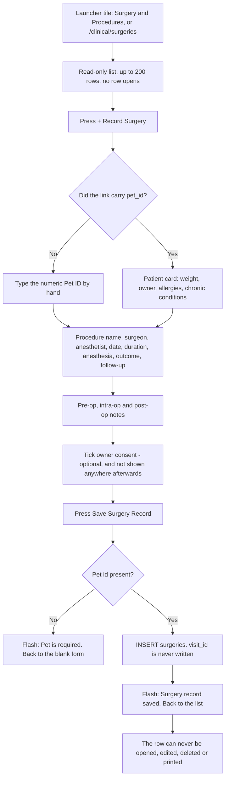

---

## Workflow 12 — Find a visit again

### 12.1 Who, when, why

**Who:** any `visits` grant holder.
**When:** the client phones about last week's consultation; the vet wants their own open
cases; an auditor wants a date range.
**Why:** it is the only list of visits in this chapter.

### 12.2 The happy path

1. Sidebar → `Medical Visits / الفحوصات`, or `/visits/`.
2. The filter bar across the top:
   - **Status** — `All / الكل`, `Open / مفتوح`, `Completed / مكتمل`, `Cancelled / ملغى`.
   - **From** and **To** — two date boxes, compared against the visit's date part.
   - **Doctor** — `All Doctors / جميع الأطباء` plus one entry per distinct
     `doctor_name` ever recorded. The match is case-insensitive and partial.
   - `Filter / تصفية` and `Clear / مسح`.
3. The table: `#`, `Date / التاريخ` (first 16 characters of the stored value),
   `Pet / الحيوان` (name, then species · breed), `Owner / المالك` (name, then phone),
   `Type / النوع`, `Doctor / الطبيب`, `Chief Complaint / الشكوى الرئيسية`
   (truncated to one line), `Status / الحالة` badge, and an `Open / فتح` button.
4. Press `Open / فتح` to reach the visit (Workflows 2–5).
5. Nothing found: `No visits found. / لا توجد زيارات.`

Source: `blueprints/visits/routes.py:13-63`; `templates/visits/visits_list.html:13-73`

### 12.3 Known limits of this list

- **Hard cap of 50 rows, newest first, with no paging.** A clinic doing 30 visits a day
  sees less than two days at a time, and there is no page 2. **Narrow with the date
  filters** — that is the only way to reach older visits from this screen. Compare: the
  lab and surgery lists cap at 200.
  Source: `blueprints/visits/routes.py:44`
- **The `Cancelled / ملغى` status can never match anything.** No code in the platform
  ever sets a visit's status to `Cancelled` — the only writes are `Open` at creation and
  `Completed` at completion. Choosing it always returns an empty table.
  Source: `blueprints/visits/routes.py:143, 493`; `models/database.py:3440`
- **No free-text search.** You cannot search by pet name, owner name, phone or complaint.
  To find a visit by client, use the exam screen's `History` tab (Workflow 8) or the CRM
  pet page.
- **Mixed date formats in one column.** Long-form visits show a UTC timestamp
  (`2026-08-19 21:04`), exam visits show a bare date (`2026-08-19`) — see 0.5.

### 12.4 Flowchart

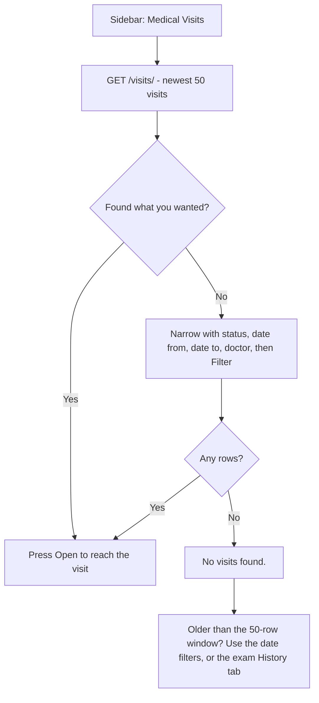

---
## 13. Known limits of the whole area

Everything below was verified in the source. None of it is speculation, and none of it is
a feature request — it is what a user will hit.

### 13.1 Broken — the screen offers something that cannot work

1. **The `＋ Request Lab Test / طلب فحص مخبري` form on every open visit is dead.**
   Its `action` resolves to `#` and its JavaScript posts to `/clinical/lab/request`, an
   endpoint that exists nowhere. The user gets an English-only browser alert
   `Error submitting lab request. Please try from the Lab module.`
   `templates/visits/visit_detail.html:633, 981-988`

2. **`/clinical/lab/new` with no `?visit_id=` is an unbreakable loop.** The visit and pet
   ids exist only as hidden inputs rendered from a visit that was passed in, so a bare
   form has no way to supply them and always answers `Visit and pet are required.` — and
   redirects back to itself. **The `＋ New Lab Request / ＋ طلب مختبر جديد` button on the
   Lab list points at exactly that URL.**
   `templates/clinical/lab_list.html:8-10`; `lab_form.html:44-48`; `blueprints/clinical/routes.py:121-124`

3. **The Lab list's `In Progress` tab can never be populated.** Requests are created
   `Pending` and results set them `Completed`. Nothing writes `In Progress`.
   `blueprints/clinical/routes.py:137, 219`

4. **The visits list's `Cancelled / ملغى` filter can never match.** Nothing in the
   platform ever writes that status to a visit.
   `blueprints/visits/routes.py:143, 493`; `models/database.py:3440`

5. **The vaccination form never sends `visit_id`.** The route reads it and the column
   exists, but the template has no such input — so a vaccination recorded there is
   orphaned from the consultation. Only the exam screen and the `/workflow` wizard fill
   it.
   `blueprints/clinical/routes.py:275-280`; `templates/clinical/vaccination_form.html:41-56`

6. **The exam's inline `Pay` button silently no-ops for clinical roles.** The permission
   gate answers a refused POST with a **redirect**, not a JSON 403 (the request's
   `Accept` header is `*/*`, and the path does not start `/api/`). `fetch` follows it, the
   response is HTTP 200, and the dialog announces `Settled in full / تم السداد بالكامل`
   although no payment was recorded. Affects `doctor`, `nurse` and `pharmacist`.
   `blueprints/auth/routes.py:129-133`; `templates/visits/exam.html:2345-2353`

7. **Roles contradiction.** The launcher offers `reception` the exam tile, the visits tile
   and the vaccination tile; `reception` has no `visits` grant, so all three bounce.
   `blueprints/launcher/routes.py:85, 118, 130`; `models/database.py:4365-4368`

8. **The `💬 WhatsApp / واتساب` link on the visit page does not add Egypt's country
   code.** It strips `+`, spaces and dashes and nothing else, so a number stored as
   `01001234567` produces an unusable `wa.me/01001234567`. The exam screen's equivalent
   link *does* prefix `2`.
   `templates/visits/visit_detail.html:126-133` vs `templates/visits/exam.html:1802-1804`

9. **The tests are behind the screen.** `test_the_screen_renders_eleven_tabs_and_the_payment_modal`
   asserts eleven tabs and omits `tasks`; the template has **twelve**. The Tasks tab was
   added after the test.
   `tests/test_exam_screen.py:917-925` vs `templates/visits/exam.html:109-143`

### 13.2 Silent — the app accepts something and tells you nothing

10. **Four of the exam's writes fail silently.** The diagnosis, each vaccination row, the
    follow-up appointment and the prescription are each wrapped in `try/except` that logs
    and continues. The visit and the money are saved either way, and the user is never
    told. Verify a vaccination on the `Medical` tab after saving.
    `blueprints/visits/routes.py:1345-1360, 1372-1382, 1387-1402, 1416-1435`

11. **Exam invoice lines with quantity ≤ 0 or a negative price are dropped** without a
    message.
    `blueprints/visits/routes.py:1470-1476`

12. **`Duration (minutes)` on the surgery form is stored only when the whole string is
    digits.** `45 min` becomes NULL.
    `blueprints/clinical/routes.py:393-394`

13. **A surgery saved against a pet id that does not exist is written and then vanishes**
    from the list, which `JOIN`s `pets` and `owners`.
    `blueprints/clinical/routes.py:366-372, 405-419`

14. **`complete_visit` prices lines by a `LIKE` match on `service_catalog.name` and falls
    back to `0.00`,** with no warning beyond the invoice's own note. The match is against
    the English `name` only — an Arabic-named service never matches.
    `blueprints/visits/routes.py:507-517`

15. **Choosing `Custom` on the lab or vaccination form and leaving the custom box empty
    saves a record literally named `Custom`** (only reachable with JavaScript disabled,
    which also breaks CSRF — so in practice this is theoretical).
    `blueprints/clinical/routes.py:106-108, 263-266`

### 13.3 Missing — the workflow stops short

16. **Nothing in this chapter can be edited or deleted.** No delete exists for a
    diagnosis, prescription, prescription item, treatment plan, lab request, lab result,
    vaccination or surgery, at any status. A visit completed with a wrong diagnosis keeps
    it for ever. The only correction is to add a second, contradicting record.

17. **A Completed visit is permanently read-only.** Every add/edit form on the visit page
    is inside ``, and there is no re-open action.
    `templates/visits/visit_detail.html:237, 313, 372, 480, 627`

18. **Because the exam writes `status='Completed'`, an exam visit can never be worked up
    at all** — no SOAP, no treatment plan, no lab request, no second diagnosis, no second
    prescription.
    `blueprints/visits/routes.py:1329-1331`

19. **`respiratory_rate` is collected on the new-visit form and displayed nowhere** — not
    on the visit page, not on the print sheet, not on the exam screen.
    `templates/visits/visit_form.html:63-67` vs `visit_detail.html:137-155`, `visit_print.html:78-88`

20. **The printable visit sheet omits SOAP notes, lab requests and the visit's own
    notes.** The route even loads `lab_requests` and passes them to a template that never
    reads them.
    `blueprints/visits/routes.py:645-648`; `templates/visits/visit_print.html`

21. **No sidebar entry for `/clinical/vaccinations` or `/clinical/surgeries`.** The
    sidebar's only clinical link is `Lab & Vaccines / المختبر والتطعيمات`, which goes to
    the Lab list.
    `templates/base.html:145-148`

22. **The 30-day vaccination banner excludes anything already overdue** — it selects
    `next_due_at BETWEEN today AND today+30`. There is no overdue list anywhere in the
    Clinical module; overdue vaccines surface only as red text in the records table and
    as an alert on the exam screen.
    `models/database.py:4120-4130`

23. **Surgeries have no detail page, no edit, no delete, no print, no visit link and no
    invoice link.** `surgeries.visit_id` exists and is never written. The consent flag is
    stored and never displayed.
    `blueprints/clinical/routes.py:363-434`; `templates/clinical/surgeries.html`

24. **The visits list is capped at 50 rows with no paging and no text search.** Older
    visits are reachable only by narrowing the date filters, or through the exam screen's
    History tab.
    `blueprints/visits/routes.py:44`

25. **The long-form visit has no vitals sanity check.** A weight of `-5` or `999` saves
    without comment; only the exam screen warns.
    `blueprints/visits/routes.py:120-123` vs `templates/visits/exam.html:2051-2069`

26. **Prescriptions carry less than the schema allows, and differently depending on the
    screen.** From the visit page, `unit` and `instructions` are written as empty strings
    because the form has no such inputs. From the exam screen, `route`, `quantity` and
    `unit` are never named in the INSERT at all, so every item silently becomes
    `Oral`, `1`, `tablet`.
    `blueprints/visits/routes.py:406-424, 1424-1431`; `models/database.py:1376-1390`

### 13.4 Inconsistent — the same thing behaves differently in two places

27. **`diagnoses.created_by` holds two different kinds of value.** The long form writes
    the user's **numeric id**; the exam screen writes the user's **full name**. Anything
    reading that column has to cope with both.
    `blueprints/visits/routes.py:250-256, 1350-1356`

28. **Visit dates are UTC from the long form and local from the exam screen** (see 0.5).
    Task due-date and done-date comparisons on the exam screen deliberately use the
    **local** date, and say so in the code.
    `blueprints/visits/routes.py:135, 1321, 1029-1035`

29. **Severity options differ between the two screens.** The long form offers
    `Mild / Moderate / Severe / Critical`; the exam offers `Mild / Moderate / Severe`
    only — and translates `Mild` as `خفيف` where the long form uses `بسيط`.
    `templates/visits/visit_detail.html:331-336` vs `exam.html:226-231`

30. **`is_chronic` can only be set from the exam screen.** The long form's diagnosis form
    has no chronic checkbox, so a chronic condition diagnosed there never raises the
    chronic alert.
    `templates/visits/visit_detail.html:319-348` vs `exam.html:232-234`

31. **Clinical templates carry no inline CSRF token; the visits templates do.** With
    JavaScript disabled, every POST in `/clinical/` returns the 403 token page while the
    visit forms still work.
    `static/js/platform.js:129-145`; `templates/clinical/*.html`

32. **AI features are governed by a separate `ai` grant that only `doctor` and
    `clinic_owner` hold.** A nurse sees the 🤖 panel, `📋 Discharge Instructions` and
    `💊 Check Interactions` on every open visit, and all three fail.
    `blueprints/auth/routes.py:143`; `models/database.py:4356-4362`

### 13.5 Adjacent, and not covered here

- **`/workflow` — the sidebar's `New Visit / زيارة جديدة`** is a third visit-entry wizard
  in its own blueprint, mapped to the same `visits` grant. It posts into
  `/clinical/vaccinations/new` with a `visit_id`, and it verifies its own vaccination
  write afterwards — the only path in the platform that does.
  `blueprints/auth/routes.py:151`; `templates/workflow/index.html:1655-1676`
- **`/doctor` — the Doctor Workspace** is also mapped to the `visits` grant.
  `blueprints/auth/routes.py:144`
- **Finance, Pharmacy, Imaging and CRM** are all reached from these screens and are
  documented in their own chapters.

---

## 14. Source map

| What | Where |
|------|-------|
| Visits routes (all) | `D:/vet/platform/blueprints/visits/routes.py` |
| Visits list + filters | `routes.py:13-63` · `templates/visits/visits_list.html` |
| New visit form + submit | `routes.py:67-160` · `templates/visits/visit_form.html` |
| Visit detail | `routes.py:163-235` · `templates/visits/visit_detail.html` |
| Add diagnosis | `routes.py:237-262` · form at `visit_detail.html:319-348` |
| Save treatment plan (upsert) | `routes.py:264-308` · form at `visit_detail.html:378-419` |
| Prescriber rules | `routes.py:310-352` (`PRESCRIBER_ROLES`, `prescribers`, `_resolve_prescriber`) |
| Add prescription | `routes.py:355-429` · form at `visit_detail.html:486-586` |
| Save SOAP (audited) | `routes.py:432-462` · form at `visit_detail.html:243-274` |
| Complete visit + auto-invoice | `routes.py:465-588` · button at `visit_detail.html:47-56` |
| Invoice jump helper | `routes.py:591-605` |
| Printable record | `routes.py:608-660` · `templates/visits/visit_print.html` |
| Exam — empty state | `routes.py:691-713` · `templates/visits/exam.html` |
| Exam — context builder | `routes.py:733-824` (`_exam_context`) |
| Exam — loaded screen | `routes.py:827-847` |
| Exam — client search API | `routes.py:850-873` |
| Exam — pet context API | `routes.py:876-887` |
| Doctor id resolution | `routes.py:891-919` (`_doctor_id_for`) |
| Client 360 builder + API | `routes.py:921-1044`, `1046-1059` |
| Walk-in registration API | `routes.py:1062-1122` · UI at `exam.html:59-95` |
| Task API | `routes.py:1128-1196` · UI at `exam.html:744-790` |
| Inline appointment API | `routes.py:1199-1256` · UI at `exam.html:620-670` |
| Add-a-pet API | `routes.py:1259-1288` · UI at `exam.html:546-568` |
| **The single exam save** | `routes.py:1301-1539` |
| Clinical routes (all) | `D:/vet/platform/blueprints/clinical/routes.py` |
| Test / vaccine / anesthesia option lists | `clinical/routes.py:19-43` |
| Lab list | `clinical/routes.py:77-91` · `templates/clinical/lab_list.html` |
| New lab request | `clinical/routes.py:93-154` · `templates/clinical/lab_form.html` |
| Lab detail + result entry | `clinical/routes.py:157-224` · `templates/clinical/lab_detail.html` |
| Vaccinations list | `clinical/routes.py:228-248` · `templates/clinical/vaccinations.html` |
| Record vaccination | `clinical/routes.py:251-315` · `templates/clinical/vaccination_form.html` |
| Certificate PDF | `clinical/routes.py:320-350` · `models/pdf_generator.py:562-728` |
| Surgeries list | `clinical/routes.py:363-381` · `templates/clinical/surgeries.html` |
| Record surgery | `clinical/routes.py:384-434` · `templates/clinical/surgery_form.html` |
| Access gates | `blueprints/auth/routes.py:59-69, 87-133, 140-162` |
| Default role grants | `models/database.py:4302-4380`; seeding at `4382-4397` |
| Visit / diagnosis / plan / Rx / lab / vaccine / surgery schemas | `models/database.py:1308-1457` |
| Tasks schema | `models/database.py:2411-2431` |
| Invoice + payment writes | `models/database.py:3578-3617, 3911-3938` |
| Phone normalisation (walk-in de-duplication) | `models/database.py:3080-3118` |
| Upcoming / all vaccinations queries | `models/database.py:4106-4130` |
| Owner + pet lookups behind the long form | `blueprints/crm/routes.py:534-560` |
| Finance payment endpoint (exam Pay button) | `blueprints/finance/routes.py:368-420` |
| Attachment validation | `blueprints/uploads/routes.py:20-30, 96-149`; 16 MB cap at `config.py:149` |
| CSRF | `app.py:349-357`; auto-inject at `static/js/platform.js:129-145` |
| Language helper `t()` | `app.py:373-378, 406-412` |
| Sidebar entries | `templates/base.html:113-129, 145-148` |
| Launcher tiles | `blueprints/launcher/routes.py:76-135` |
| Exam screen tests | `tests/test_exam_screen.py` |
