# Communications — WhatsApp, Reminders, Campaigns and the Notification Bell

**التواصل — واتساب والتذكيرات والحملات وجرس الإشعارات**

**Modules:** `whatsapp` · `notifications`
**URL prefixes:** `/whatsapp/` · `/notifications/`
**Blueprints:** `blueprints/whatsapp/routes.py` (58 view functions) · `blueprints/whatsapp/wapilot.py` ·
`blueprints/whatsapp/scheduler.py` · `blueprints/notifications/routes.py` (4 view functions)
**Templates:** `templates/whatsapp/` (13 files) · `templates/notifications/index.html`
**Also documented here:** the two send buttons that live outside the module —
`POST /finance/invoices/<id>/whatsapp` on the invoice screen, and the **Send Message** button on
the CRM client record.

This chapter documents **only what the code does today**. Where a screen promises something it
does not deliver, that is written down in **Known limits** at the end, not described as a
feature. Every section ends with a `Source:` line carrying `file:line`, so the next writer can
check the claim without re-reading the module.

Nothing in this chapter was exercised in a browser. It is read from source.

---

## 0. Before you touch anything

### 0.1 Read this first — nothing has ever been sent

**No Wapilot instance has ever been connected on the demo database, and no WhatsApp message has
ever been transmitted end to end from this platform.** That is a statement of fact about
`data/demo.db`, not a caution:

- `settings` holds **zero rows** in the `wapilot` category and **zero rows** in the `whatsapp`
  category. Neither `wapilot_token` nor `wapilot_instance_id` has ever been saved.
- `reminder_runs` holds **zero rows**, so the nightly 09:00 job has never completed a run
  against this database.
- `whatsapp_log` holds **109 rows** — 107 marked `Sent`, 2 marked `Failed`. Every one of them
  was **fabricated by the demo seeder**, not sent. `seed_comms()` loops over the first 120
  `reminders` rows and inserts a log row per reminder with a status picked at random
  (`rnd.choices(["Sent", "Sent", "Failed"], weights=[88, 8, 4])`), `http_status` hardcoded to
  `200`, `response` and `error` left empty, and `sent_at` back-dated by a random 1–60 days.

So the green **✓ Sent / ✓ أُرسلت** column on `/whatsapp/log` on the demo is decoration. Do not
demonstrate it as delivery evidence, and do not use it to reason about deliverability.

Everything downstream of the transport — the settings form, the template store, the reminder
list, the message log, the audit rows, the permission gates — is exercised by the test suite
against a stubbed Wapilot client (`tests/test_whatsapp_routes.py`, whose fixture treats *"Any
real outbound HTTP from this module is a test failure, not a flake"*). What has **not** been
exercised is the one thing that matters to a clinic: a message arriving on a phone.

Source: `D:/vet/platform/scripts/seed/demo_showcase.py:1332-1347`;
`D:/vet/platform/tests/test_whatsapp_routes.py:32-37`; `data/demo.db` (`settings` where
`category IN ('wapilot','whatsapp')` → 0 rows; `reminder_runs` → 0 rows; `whatsapp_log` → 109
rows)

---

### 0.2 The single most important fact about the transport

**The nightly reminder job and every manual Send button now go through the same client, the
same host, the same path, the same auth header and the same payload.** That was not always
true, and the difference used to be invisible and total.

`blueprints/whatsapp/scheduler.py:94-124` — `_make_sender(conn)`. Its body is
`:111-124`: read `settings WHERE category='wapilot'`, fall back to `WAPILOT_TOKEN` /
`WAPILOT_INSTANCE` in the environment, and, at **`:124`**, hand both values to
`WapilotClient(token, iid)`. That is byte-for-byte the
same resolution `blueprints/whatsapp/routes.py:32-48` (`_client()`) performs for the Send
Centre, the invoice button and the Reminder Admin **Send Now** button. Both end up posting

```
POST https://api.wapilot.net/api/v2/<instance>/send-message
token: <api token>
Content-Type: application/json

{"chat_id": "...", "text": "..."}
```

The docstring on `_make_sender` records what it replaced: the job used to read `$WAPILOT_TOKEN`
alone and `POST {"phone","message"}` with a `Bearer` header to `https://api.wapilot.io/send` —
*"Different host, path, auth scheme and payload — so a clinic that connected WhatsApp the only
documented way (scan the QR, save the token in Settings) got a working Send Center and a nightly
job that logged 'Not Configured' for every single reminder. There was no configuration under
which a scheduled reminder was deliverable."*

Three consequences you can rely on:

1. **Connect once, in one place.** Saving the token and instance ID on **WhatsApp → Settings /
   إعدادات واتساب** configures the manual buttons *and* the nightly job. There is no second
   place to configure, and no environment variable that has to agree with the form.
2. **A run gives up after five consecutive failures.** `_MAX_CONSECUTIVE_FAILURES = 5`. Each
   failed send increments `sender.failures`; each success resets it to `0`. On the fifth
   consecutive failure the run sets `sender.gave_up = True`, and every remaining recipient in
   that run — across all three reminder types, because one `_Sender` is shared by all three — is
   logged with status `Not Sent` and the error *"Skipped: 5 sends in a row failed, so the rest
   of this run was abandoned rather than left retrying a dead connection."* The comment above
   the constant explains the number: *"One send against an unreachable host was measured at 535
   SECONDS. Without a cap, a clinic with 200 clients and a dead WhatsApp instance would keep the
   scheduler thread busy for most of a day, and the following morning's run would still be
   queued behind it."*
3. **An unconnected clinic gets `Not Configured`, never a false `Sent`.** If no token or no
   instance ID resolves, `_make_sender` returns a `_Sender` whose `.client` is `None`, and
   `_send_whatsapp` writes status **`Not Configured`** with the reason in the `error` column. It
   does not write `Sent`. The comment is explicit: *"This previously logged stub-mode sends as
   Sent, so a clinic saw a green column of reminders that had not left the building — and then
   blamed clients for not turning up. A reminder system that lies about delivery is worse than
   having none."* `templates/whatsapp/message_log.html:91-94` renders that status in red as
   **⚠ Not sent — WhatsApp not connected / ⚠ لم تُرسل — واتساب غير متصل**.

Source: `D:/vet/platform/blueprints/whatsapp/scheduler.py:74`, `:77-91`, `:94-124`, `:127-165`;
`D:/vet/platform/blueprints/whatsapp/routes.py:32-48`, `:51-72`;
`D:/vet/platform/blueprints/whatsapp/wapilot.py:11`, `:23-27`, `:111-119`;
`D:/vet/platform/templates/whatsapp/message_log.html:91-94`

---

### 0.3 Who can open which screen

Two gates run on every `/whatsapp/*` request and **both** must pass.

1. **The module grant.** `login_required` looks up the blueprint's permission key — for this
   blueprint that is simply `whatsapp` — and checks the signed-in role holds it. Grants are
   editable on the Roles screen in the System module.
2. **The route's role list.** `role_required(...)` narrows further. A grant can only ever
   narrow, never widen. `super_admin` bypasses both.

Source: `D:/vet/platform/blueprints/auth/routes.py:59-69`, `:89-135`, `:155-193`

**Who holds the `whatsapp` grant out of the box** (`models/database.py:4311`, `:4346-4379`):

| Role | Holds `whatsapp`? |
|---|---|
| `super_admin` | bypasses every check |
| `clinic_owner` | ✅ (holds every key) |
| `branch_manager` | ✅ |
| `reception` | ✅ |
| `doctor`, `nurse`, `pharmacist`, `inventory_mgr`, `finance`, `hr`, `groomer`, `boarding_staff`, `support_admin`, `auditor` | ❌ |

**So out of the box exactly four roles can open any WhatsApp screen at all:** `super_admin`,
`clinic_owner`, `branch_manager`, `reception`. Everyone else gets the red flash **"You don't
have permission to access this page."** and a redirect to the launcher (`/`) — even though the
sidebar shows them the WhatsApp link (§ 0.4).

**Route-level role lists, after the grant has already filtered:**

| Route group | `role_required(...)` on the route | Who can actually use it as shipped |
|---|---|---|
| Everything with only `@login_required` — control centre, status/QR/screenshot/details, queue settings, message list/detail/retry, Send Centre and all four send endpoints, campaign list/detail and all read APIs, campaign delay + bulk messages, template list + `api/templates`, reminders list, reminder send / mark-sent, message log, LID lookups, reminder admin, reminder create/cancel/send-now, `/whatsapp/send`, scheduler screen, scheduler run, clear history | *(none)* | super_admin, clinic_owner, branch_manager, reception |
| Instance start / restart / logout | `super_admin, clinic_owner, branch_manager, support_admin` | super_admin, clinic_owner, branch_manager |
| Instance troubleshoot (**🛠 Fix**) | `super_admin, clinic_owner` | super_admin, clinic_owner |
| Retry all failed messages | `super_admin, clinic_owner, branch_manager` | those three |
| New campaign (HTML form), campaign start / pause | `super_admin, clinic_owner, branch_manager, support_admin` | super_admin, clinic_owner, branch_manager |
| Create campaign (JSON), finish, copy, reset-failed, schedule/unschedule | `super_admin, clinic_owner, branch_manager` | those three |
| New template, edit template | `super_admin, clinic_owner, branch_manager, support_admin, reception` | super_admin, clinic_owner, branch_manager, reception |
| Delete template | `super_admin, clinic_owner, branch_manager` | those three |
| WhatsApp Settings (`/whatsapp/settings`) | `super_admin, clinic_owner, branch_manager, support_admin` | super_admin, clinic_owner, branch_manager |
| Run reminder job now (Reminder Admin topbar) | `super_admin, clinic_owner, branch_manager, support_admin` | super_admin, clinic_owner, branch_manager |

Source: `D:/vet/platform/blueprints/whatsapp/routes.py:80`, `:86`, `:127`, `:134`, `:141`,
`:148`, `:155`, `:162`, `:169`, `:176`, `:183`, `:199`, `:207`, `:214`, `:221`, `:233`, `:245`,
`:271`, `:284`, `:297`, `:314`, `:327`, `:357`, `:383`, `:390`, `:401`, `:408`, `:415`, `:422`,
`:429`, `:436`, `:447`, `:458`, `:473`, `:480`, `:487`, `:498`, `:510`, `:549`, `:588`, `:599`,
`:615`, `:633`, `:662`, `:679`, `:698`, `:774`, `:784`, `:791`, `:804`, `:882`, `:895`, `:921`,
`:932`, `:965`, `:1002`, `:1081`, `:1116`

**Four consequences that will confuse you on day one:**

- **`support_admin` is named in six route role lists and holds no `whatsapp` grant.** Its grant
  set is `system, backup, audit, settings`. It is stopped by the first gate before the role list
  is even consulted, so its entry in the instance-start, campaign-new, campaign-start,
  campaign-pause, template-new/edit, WhatsApp-Settings and reminder-trigger lists is dead. The
  sidebar still offers it the **Reminder Settings** link.
  Source: `D:/vet/platform/models/database.py:4376`; `D:/vet/platform/templates/base.html:275-281`
- **A receptionist can create, edit and send templates, and can run the nightly job by hand.**
  `reception` holds the grant, and `/whatsapp/scheduler/run` and
  `/whatsapp/reminder-admin/reminders/<id>/send-now` carry only `@login_required`. The three
  destructive-ish campaign actions and template delete are role-gated away from her; the
  reminder cannon is not.
  Source: `D:/vet/platform/blueprints/whatsapp/routes.py:921`, `:932`, `:1081`, `:1116`
- **`finance` cannot open a single WhatsApp screen but can still send a WhatsApp message.**
  The invoice **📱 Send WhatsApp / إرسال** button lives on `/finance/invoices/<id>` and is
  governed by the `invoicing` grant, which `finance` holds. It calls the WhatsApp module's
  `_send_and_log` directly, bypassing the module gate entirely. A finance user can send a bill
  by WhatsApp and then cannot open the log to see whether it worked.
  Source: `D:/vet/platform/blueprints/finance/routes.py:707-709`, `:740-752`;
  `D:/vet/platform/models/database.py:4372`
- **A doctor or nurse sees the WhatsApp link in the sidebar and cannot use it.** The nav item is
  rendered with no role condition at all.
  Source: `D:/vet/platform/templates/base.html:263-266`

**What being denied looks like:**

- Not signed in → yellow flash **"Please log in to continue."** and a redirect to the login page
  with `?next=` set to the path you asked for.
- Signed in but blocked by either gate on an HTML page → red flash **"You don't have permission
  to access this page."** and a redirect to the launcher (`/`). Nothing is written.
- Blocked on a path starting `/api/`, or when the browser's `Accept` header prefers JSON →
  `{"ok": false, "error": "forbidden"}` with HTTP 403. **Note the module's own JSON endpoints
  live at `/whatsapp/api/…`, not `/api/…`,** so a denied `fetch()` from the control centre gets
  the HTML redirect, not the JSON — which is why a blocked action shows as a JSON parse error in
  the browser console rather than a clean toast.
- POST with a missing or wrong CSRF token → the full-page 403 error screen reading **"Invalid or
  missing security token. Please go back and try again."**

Source: `D:/vet/platform/blueprints/auth/routes.py:62-64`, `:131-135`, `:150-153`;
`D:/vet/platform/app.py:355-357`

---

### 0.4 How to get in

- **Sidebar → PLATFORM / المنصة group.**
  - `WhatsApp / واتساب` → `/whatsapp/control`. **Rendered to every signed-in user with no role
    condition**, which is wider than the grant.
  - `Notifications / الإشعارات` → `/notifications/`, with an unread badge (`99+` above 99).
    Rendered whenever `current_user` is set.
  - `Reminder Settings / إعدادات التذكير` → `/whatsapp/reminder-settings`, rendered to
    `super_admin, clinic_owner, branch_manager, support_admin`. **That route is a redirect
    only** — it 302s straight to `/whatsapp/settings`, so the two sidebar entries lead to
    different screens only in name.
  Source: `D:/vet/platform/templates/base.html:263-281`;
  `D:/vet/platform/blueprints/whatsapp/routes.py:773-780`
- **Launcher tile.** `💬 WhatsApp Communication Center / مركز التواصل عبر واتساب` →
  `/whatsapp/control`, described as *"Message templates · Reminders · Campaigns · Message log ·
  Schedule · Retry failed"*, shown to `super_admin, clinic_owner, branch_manager, reception` —
  which matches the grant exactly.
  Source: `D:/vet/platform/blueprints/launcher/routes.py:308-323`
- **From a client record.** `/crm/owners/<id>` → **Communication History / سجل التواصل** card →
  **✉️ Send Message / إرسال رسالة** → `/whatsapp/send-center`. Workflow 4.
  Source: `D:/vet/platform/templates/crm/owner_detail.html:583-587`
- **From an invoice.** `/finance/invoices/<id>` → **📱 Send via WhatsApp / إرسال واتساب** card.
  Workflow 3.
  Source: `D:/vet/platform/templates/finance/invoice_detail.html:267-278`
- **Typed URL only — no template anywhere links these:**
  - `/whatsapp/scheduler` — the reminder scheduler screen with the four manual-trigger buttons
    and the 200-row history. **Nothing links to it.** Bookmark it.
  - `/whatsapp/reminders/<id>/send` — a JSON send endpoint no page calls (KL-14).
  - `templates/whatsapp/reminder_settings.html` — a complete, prettier reminder-settings screen
    with ON/OFF toggle switches that **no route renders**. The route that used to render it now
    redirects to `/whatsapp/settings` (KL-13).
  Source: no `url_for('whatsapp.scheduler')`, `url_for('whatsapp.reminder_send')` or
  `render_template("whatsapp/reminder_settings.html")` exists anywhere under
  `D:/vet/platform/templates/` or `D:/vet/platform/blueprints/`

**The link graph, once you are inside:**

```
Control Center  ──► Send Message (Send Centre)
                ──► Campaigns ──► New Campaign
                │                └► Campaign detail
                ──► Templates ──► New / Edit Template
                ──► Settings
                ──► Reminder Admin
                └► View All Logs → (Message Log)

Message Log     ──► Templates, Reminders
Templates       ──► New Template, Message Log, Reminders
Reminders       ──► Templates, Message Log
Send Centre     ──► Control Center, Templates list
Reminder Admin  ──► Control Center

Scheduler       ──► Control Center        (but nothing links IN to Scheduler)
```

---

### 0.5 Arabic and English

Every WhatsApp screen extends `base.html` and uses the `t('English','العربية')` helper
registered in `app.py`, so page titles, card headers, table headers, buttons and placeholders
switch with the toolbar `EN` / `عربي` buttons. Arabic sets `dir="rtl"` on `<html>` and loads the
Cairo font.

Source: `D:/vet/platform/app.py:406-408`; `D:/vet/platform/templates/base.html:2-3`, `:53`

**Where English leaks through in this module — and it leaks badly.** Sorted by how likely a
clinic is to hit it:

1. **Every message the platform actually sends is English-only.** The three built-in reminder
   bodies in `scheduler.py`, the invoice summary built in `finance/routes.py`, and all six
   seeded templates but one are hardcoded English. `t()` is not consulted anywhere in the send
   path. KL-1.
   Source: `D:/vet/platform/blueprints/whatsapp/scheduler.py:232-237`, `:274-279`, `:319-324`;
   `D:/vet/platform/blueprints/finance/routes.py:717-734`;
   `D:/vet/platform/models/database.py:2460-2473`
2. **Every toast in the module is English.** The control centre, Send Centre, campaigns list and
   campaign detail all render results through a hardcoded-English `toast()` / `showResult()`
   helper: `✅ Sent to 201012345678`, `❌ Error: …`, `start successful`, `Queue settings saved`,
   `Retry-all triggered`, `Marked as finished`, `12 contacts added`, `Delay updated`.
   Source: `D:/vet/platform/templates/whatsapp/control_center.html:275-281`, `:363`, `:378`,
   `:395`, `:441`, `:450`; `D:/vet/platform/templates/whatsapp/send_center.html:276-282`,
   `:293`, `:312`; `D:/vet/platform/templates/whatsapp/campaign_detail.html:242-248`, `:263`,
   `:271`, `:279`
3. **Every `confirm()` dialog is English.** `Run the reminder job now?`, `Cancel this
   reminder?`, `Run ALL reminder jobs now? This will send real WhatsApp messages.`, `Send
   appointment reminders now?`, `Send vaccine reminders now?`, `Send invoice reminders now?`,
   `Clear history older than 30 days?`, `Delete template 'appointment_reminder'?`, `Delete this
   template?`, `Delete 12 message(s)?`, `Remove schedule?`.
   Source: `D:/vet/platform/templates/whatsapp/reminder_admin.html:11`, `:137`, `:173`;
   `D:/vet/platform/templates/whatsapp/scheduler.html:58`, `:65`, `:72`, `:79`, `:85`;
   `D:/vet/platform/templates/whatsapp/templates_list.html:201`;
   `D:/vet/platform/templates/whatsapp/template_form.html:94`;
   `D:/vet/platform/templates/whatsapp/campaign_detail.html:354`, `:401`
4. **Every server-side flash message is English.** `Settings saved.`, `Template updated.`,
   `Reminder created.`, `Message sent to 201012345678.` — none of the 24 flashes in
   `whatsapp/routes.py` calls `t()`.
5. **Section headings that skipped `t()` while their neighbours use it:** `🔴 Overdue Reminders
   (3)` and `📅 Upcoming Reminders (12)` on Reminder Admin; `All Messages (48)` on campaign
   detail; `📱 Instance — instance4042` on the control centre; `Your in-app alerts and messages`
   on the notifications page; `WhatsApp Preview` as a CSS `::before` on the templates list.
   Source: `D:/vet/platform/templates/whatsapp/reminder_admin.html:114`, `:149`;
   `D:/vet/platform/templates/whatsapp/campaign_detail.html:105`;
   `D:/vet/platform/templates/whatsapp/control_center.html:121`;
   `D:/vet/platform/templates/notifications/index.html:4`;
   `D:/vet/platform/templates/whatsapp/templates_list.html:74`
6. **Template form title.** `{{ 'Edit' if action=='edit' else 'New' }} WhatsApp Template` and
   the submit button `💾 Save Changes` / `💾 Create Template` are plain English while every
   other label on the same form is bilingual.
   Source: `D:/vet/platform/templates/whatsapp/template_form.html:2-3`, `:89`
7. **Pluralisation is English-grammar.** `{{ reminders|length }} pending reminder{{ 's' if
   reminders|length != 1 }}` and `{{ templates|length }} template{{ 's' if … }}` render in both
   languages.
   Source: `D:/vet/platform/templates/whatsapp/reminders.html:53`;
   `D:/vet/platform/templates/whatsapp/templates_list.html:145`

**Which data is bilingual.** None of it. `whatsapp_templates` has a `language` column
(`en` / `ar` / `Any`) that decides only what the **🌐** badge on the template card says — it does
not switch which template is offered, and no code reads it. `whatsapp_log.message`,
`reminders.message` and `whatsapp_templates.template_text` are single fields that store exactly
what was typed, in whatever language, and are shown identically in both interface languages.

Source: `D:/vet/platform/models/database.py:1858-1868`;
`D:/vet/platform/templates/whatsapp/templates_list.html:193`; no code reads
`whatsapp_templates.language`

---

### 0.6 The transport: what actually goes over the wire

`WapilotClient` is 251 lines of `urllib.request` with no third-party dependency. Everything you
need to know about it:

| Property | Value |
|---|---|
| Base URL | `https://api.wapilot.net/api/v2` |
| Auth | a single request header `token: <api token>` — **not** `Authorization: Bearer` |
| Timeout | **15 seconds** per request, hardcoded |
| Retries | none |
| Return shape | every method returns `(data, error)` — `data` is parsed JSON (or `{"raw": "…"}` when the body is not JSON), `error` is `""` on success |
| HTTP error | returns the parsed error body plus `error = "HTTP 401: Unauthorized"` (code and reason) |
| Network error | returns `({}, str(exception))` — e.g. `<urlopen error [Errno 11001] getaddrinfo failed>` |
| Token exposure | the token never reaches the browser; every call is proxied server-side through `/whatsapp/api/…` |

Send is `POST /<instance>/send-message` with body `{"chat_id": …, "text": …}`. Media is a
hand-rolled multipart body with boundary `----WapilotBoundary7623` posted to `/<instance>/send-image`,
`/send-file` or `/send-video`, carrying `chat_id`, an optional `caption`, and the file under the
field name `media`.

Source: `D:/vet/platform/blueprints/whatsapp/wapilot.py:11`, `:23-27`, `:29-57`, `:111-119`,
`:139-178`

**The 15-second timeout is the number that governs how long a bad night takes.** Five failing
sends at 15 s each is 75 s before the run abandons itself. A host that black-holes packets
rather than refusing them can push a single call well past that — the comment in `scheduler.py`
records one measured at **535 seconds** — which is exactly why the five-failure budget exists.

Source: `D:/vet/platform/blueprints/whatsapp/wapilot.py:43`;
`D:/vet/platform/blueprints/whatsapp/scheduler.py:67-74`

---

### 0.7 Phone numbers and chat ids — the one inconsistency that matters

WhatsApp v2 addresses a **conversation**, not a phone. A chat id looks like
`201012345678@c.us`. Three different code paths build it three different ways:

| Path | What it sends as `chat_id` | Code |
|---|---|---|
| `_send_and_log` — used by Reminder Admin **Send Now**, the `/whatsapp/send` modal, and the invoice button | `phone if "@" in phone else f"{phone.lstrip('+')}@c.us"` | `routes.py:56` |
| `api_send_text` / `api_send_image` / `api_send_file` / `api_send_video` — the Send Centre | same expression, computed inline in each of the four routes | `routes.py:248`, `:275`, `:288`, `:301` |
| `_send_whatsapp` — **the nightly job and the Scheduler screen's four buttons** | `str(phone or "").strip()` — **raw, with no `@c.us` suffix and no `+` stripped** | `scheduler.py:149` |

The scheduler path carries the comment *"chat_id, not phone: the v2 API addresses a
conversation"* directly above a line that passes the phone through untouched. Whether Wapilot
accepts a bare `201012345678` is untested here — no reminder has ever been transmitted. **KL-2.**

**What the platform stores in `owners.whatsapp_phone`.** Nothing normalises it. An Egyptian
mobile entered at the front desk as `01001234567` is stored as `01001234567`. The manual paths
turn that into `01001234567@c.us`, which is not the international form
`201001234567@c.us`. Only two places in the whole product know that an Egyptian `0…` needs a
`2` prefix, and both are `wa.me` deep links in the visits module, not this transport:

```javascript
$('hwOwnerWa').href = 'https://wa.me/' + (wa.indexOf('0') === 0 ? '2' + wa : wa);
```

**KL-3.**

Source: `D:/vet/platform/blueprints/whatsapp/routes.py:56`, `:248`, `:275`, `:288`, `:301`;
`D:/vet/platform/blueprints/whatsapp/scheduler.py:148-149`;
`D:/vet/platform/templates/visits/exam.html:1803-1804`, `:2120`

**Which phone column is used, and in what order:**

| Screen / job | Phone source |
|---|---|
| Nightly job — all three types | `owners.whatsapp_phone` **only**; the query requires it to be non-null and non-empty, so an owner with only a landline column filled is silently skipped |
| Reminders list **📱 Send WA** modal | `owners.whatsapp_phone` pre-filled into an editable field; blank if absent |
| Reminder Admin **Send Now** | `r["whatsapp_phone"] or r["phone"] or ""` — falls back to the ordinary phone |
| `/whatsapp/reminders/<id>/send` (JSON, unused) | same fallback |
| Invoice **Send WhatsApp** | `invoice["owner_phone"]` — the **ordinary** `owners.phone`, never `whatsapp_phone` |
| Send Centre | whatever you type |

Source: `D:/vet/platform/blueprints/whatsapp/scheduler.py:225`, `:266`, `:306`;
`D:/vet/platform/blueprints/whatsapp/routes.py:643`, `:952`;
`D:/vet/platform/templates/whatsapp/reminders.html:100`;
`D:/vet/platform/blueprints/finance/routes.py:736`; `D:/vet/platform/models/database.py:3623`

**Phone lookup.** The Send Centre has a **🔍 Phone Lookup / 🔍 البحث عن رقم** box that calls
`GET /whatsapp/api/lookup/phone/<phone>` and offers a **Use** button to copy the result into the
send field. Both lookup endpoints are **broken**: `WapilotClient.get_lid_by_phone` and
`get_chat_id_by_lid` build their path as `f"/api/v2/{iid}/lids/…"`, and `_request` already
prefixes `BASE_URL`, which ends in `/api/v2`. The URL that goes out is
`https://api.wapilot.net/api/v2/api/v2/<instance>/lids/pn/<phone>`. **KL-4.**

Source: `D:/vet/platform/blueprints/whatsapp/wapilot.py:11`, `:31`, `:247-251`;
`D:/vet/platform/templates/whatsapp/send_center.html:234-242`, `:315-330`

---

### 0.8 The security token

Every POST, PUT, PATCH and DELETE in the platform is checked for a CSRF token. It is accepted
from `request.form["_csrf_token"]`, the `X-CSRF-Token` header, or a `_csrf_token` key in a JSON
body — in that order. Missing or wrong → the full-page 403 screen: **"Invalid or missing
security token. Please go back and try again."**

Source: `D:/vet/platform/app.py:350-357`; `D:/vet/platform/models/security.py:257-283`

Inside this module the token arrives three different ways:

1. **Hidden field written into the template.** `wa_settings.html`, `template_form.html`,
   `campaign_form.html`, `reminder_admin.html` (all four forms) use
   `value="{{ session.get('_csrf_token','') }}"`; `reminders.html` (both forms) and
   `notifications/index.html` use `value="{{ csrf_token }}"`. Both spellings resolve to the same
   value — `_CSRF_SESSION_KEY` **is** the string `"_csrf_token"` and the context processor
   exposes it as `csrf_token`.
   Source: `D:/vet/platform/models/security.py:257`, `D:/vet/platform/app.py:398`, `:451`
2. **`X-CSRF-Token` header from `fetch()`.** Every JSON call in the control centre, Send Centre,
   campaigns list and campaign detail reads
   `document.querySelector('meta[name="csrf-token"]')?.content` and sends it as a header. The
   meta tag is in `base.html:13`.
3. **Injected by JavaScript at submit time.** `platform.js` installs a capture-phase `submit`
   listener that appends a `_csrf_token` hidden input to any POST form that lacks one.

**The five forms on `/whatsapp/scheduler` — the four manual triggers and Clear Old History —
carry no `_csrf_token` field of their own and depend entirely on point 3.** With JavaScript
disabled, every button on that screen returns the 403 page. **KL-5.**

Source: `D:/vet/platform/static/js/platform.js:129-146`;
`D:/vet/platform/templates/base.html:13`, `:884`;
`D:/vet/platform/templates/whatsapp/scheduler.html:55-88`

---

### 0.9 Screen index — every route in the module

**HTML screens (13)**

| # | Screen | URL | What it is |
|---|--------|-----|------------|
| 1 | Module entry | `GET /whatsapp/` | Redirect only — sends you to the control centre |
| 2 | WhatsApp Control Center | `GET /whatsapp/control` | Live instance status, QR, screenshot, queue settings, last 10 log rows, 3 tabs |
| 3 | Send Message (Send Centre) | `GET /whatsapp/send-center` | Four send tabs, template picker, AI drafter, phone lookup |
| 4 | Campaigns | `GET /whatsapp/campaigns` | Cards for every upstream Wapilot campaign |
| 5 | Create Campaign | `GET\|POST /whatsapp/campaigns/new` | One textarea — the default message |
| 6 | Campaign Details | `GET /whatsapp/campaigns/<cid>` | Stats, delay, message table, bulk add, schedule |
| 7 | WhatsApp Templates | `GET /whatsapp/templates` | Card grid with category tabs and search |
| 8 | New / Edit Template | `GET\|POST /whatsapp/templates/new`, `/templates/<id>/edit` | The template form with a live preview |
| 9 | Pending Reminders | `GET /whatsapp/reminders` | Every `reminders` row with `status='Pending'` |
| 10 | Message Log | `GET /whatsapp/log` | Last 200 `whatsapp_log` rows with a 4-tile stats bar |
| 11 | WhatsApp Settings | `GET\|POST /whatsapp/settings` | Token + instance ID, three switches, three message boxes |
| 12 | Reminder Admin | `GET /whatsapp/reminder-admin` | Counters, manual-reminder form, overdue + upcoming tables, run log |
| 13 | WhatsApp Reminder Scheduler | `GET /whatsapp/scheduler` | Queue overview, four manual triggers, 200-row history — **unlinked** |

**Action-only POST routes (11)**

| # | Action | URL |
|---|--------|-----|
| 14 | Delete template | `POST /whatsapp/templates/<id>/delete` |
| 15 | Send a pending reminder (JSON — **called by nothing**) | `POST /whatsapp/reminders/<id>/send` |
| 16 | Mark reminder sent without sending | `POST /whatsapp/reminders/<id>/mark-sent` |
| 17 | Reminder settings alias (302 → Settings) | `GET /whatsapp/reminder-settings` |
| 18 | Run the reminder job now | `POST /whatsapp/reminder-admin/trigger` |
| 19 | Create a manual reminder | `POST /whatsapp/reminder-admin/reminders/new` |
| 20 | Cancel a reminder | `POST /whatsapp/reminder-admin/reminders/<id>/cancel` |
| 21 | Send one reminder immediately | `POST /whatsapp/reminder-admin/reminders/<id>/send-now` |
| 22 | Send shortcut (the modal on the Reminders list) | `POST /whatsapp/send` |
| 23 | Run reminder jobs (all / appt / vaccine / invoice) | `POST /whatsapp/scheduler/run` |
| 24 | Clear history older than 30 days | `POST /whatsapp/scheduler/clear-history` |

**JSON API — instance (9)**

| # | Endpoint | Wapilot path it proxies |
|---|---|---|
| 25 | `GET /whatsapp/api/instance/status` | `GET /instances/<id>/status` |
| 26 | `GET /whatsapp/api/instance/details` | `GET /instances/<id>` |
| 27 | `GET /whatsapp/api/instance/qr` | `GET /instances/<id>/qr-code` |
| 28 | `GET /whatsapp/api/instance/screenshot` | `GET /instances/<id>/screenshot` |
| 29 | `POST /whatsapp/api/instance/start` | `POST /instances/<id>/start` |
| 30 | `POST /whatsapp/api/instance/restart` | `POST /instances/<id>/restart` |
| 31 | `POST /whatsapp/api/instance/logout` | `POST /instances/<id>/logout` |
| 32 | `POST /whatsapp/api/instance/troubleshoot` | `POST /instances/<id>/troubleshoot` |
| 33 | `GET\|PUT /whatsapp/api/instance/queue-settings` | `GET\|PUT /instances/<id>/queue-settings` |

**JSON API — messages and sending (8)**

| # | Endpoint | Notes |
|---|---|---|
| 34 | `GET /whatsapp/api/messages` | forwards every query-string parameter as an upstream filter |
| 35 | `GET /whatsapp/api/messages/<msg_id>` | |
| 36 | `POST /whatsapp/api/messages/<msg_id>/retry` | |
| 37 | `POST /whatsapp/api/messages/retry-all` | forwards the JSON body as the filter |
| 38 | `POST /whatsapp/api/send/text` | **writes a `whatsapp_log` row** |
| 39 | `POST /whatsapp/api/send/image` | multipart; **writes nothing to the log** |
| 40 | `POST /whatsapp/api/send/file` | multipart; **writes nothing to the log** |
| 41 | `POST /whatsapp/api/send/video` | multipart; **writes nothing to the log** |

**JSON API — campaigns (13)**

| # | Endpoint |
|---|---|
| 42 | `GET /whatsapp/api/campaigns` |
| 43 | `POST /whatsapp/api/campaigns` |
| 44 | `POST /whatsapp/api/campaigns/<cid>/start` |
| 45 | `POST /whatsapp/api/campaigns/<cid>/pause` |
| 46 | `PATCH /whatsapp/api/campaigns/<cid>/finish` |
| 47 | `POST /whatsapp/api/campaigns/<cid>/copy` |
| 48 | `POST /whatsapp/api/campaigns/<cid>/reset-failed` |
| 49 | `POST\|DELETE /whatsapp/api/campaigns/<cid>/schedule` |
| 50 | `GET\|PATCH /whatsapp/api/campaigns/<cid>/delay` |
| 51 | `GET\|POST\|DELETE /whatsapp/api/campaigns/<cid>/messages` |
| 52 | `GET /whatsapp/api/campaigns/<cid>/stats` |
| 53 | `GET /whatsapp/api/campaigns/<cid>/queue` |
| 54 | `GET /whatsapp/api/campaigns/<cid>/done` |

**JSON API — templates and lookup (3)**

| # | Endpoint | Notes |
|---|---|---|
| 55 | `GET /whatsapp/api/templates` | active templates only; **called by no template in this repo** |
| 56 | `GET /whatsapp/api/lookup/lid/<lid>` | broken path (KL-4); called by no page |
| 57 | `GET /whatsapp/api/lookup/phone/<phone>` | broken path (KL-4); called by the Send Centre lookup box |

**Notification centre (4)**

| # | Endpoint | What it is |
|---|---|---|
| 58 | `GET /notifications/` | Last 50 notifications for the signed-in user |
| 59 | `POST /notifications/mark-read/<id>` | JSON `{"ok": true}`; scoped to the caller's own rows |
| 60 | `POST /notifications/mark-all-read` | Redirects back to `request.referrer` |
| 61 | `GET /notifications/api/unread` | JSON count + last 10; **called by nothing** |

Source: `D:/vet/platform/blueprints/whatsapp/routes.py:79`, `:85`, `:126`, `:133`, `:140`,
`:147`, `:154`, `:161`, `:168`, `:175`, `:182`, `:198`, `:206`, `:213`, `:220`, `:232`, `:244`,
`:270`, `:283`, `:296`, `:313`, `:326`, `:356`, `:382`, `:389`, `:400`, `:407`, `:414`, `:421`,
`:428`, `:435`, `:446`, `:457`, `:472`, `:479`, `:486`, `:497`, `:509`, `:548`, `:587`, `:598`,
`:614`, `:632`, `:661`, `:678`, `:697`, `:773`, `:783`, `:790`, `:803`, `:881`, `:894`, `:920`,
`:931`, `:964`, `:1001`, `:1080`, `:1115`;
`D:/vet/platform/blueprints/notifications/routes.py:9`, `:18`, `:25`, `:31`

---

### 0.10 The five tables this chapter writes to

**`settings`** — key/value with a `category`. This module writes two categories:

| Category | Keys | Written by |
|---|---|---|
| `wapilot` | `wapilot_token`, `wapilot_instance_id` | WhatsApp Settings, **only when the posted value is non-empty** |
| `whatsapp` | `reminder_appt_enabled`, `reminder_vaccine_enabled`, `reminder_invoice_enabled`, `reminder_appt_msg`, `reminder_vaccine_msg`, `reminder_invoice_msg` | WhatsApp Settings, always (unchecked boxes post nothing and are stored as `"0"`) |

Source: `D:/vet/platform/models/database.py:1193-1199`;
`D:/vet/platform/blueprints/whatsapp/routes.py:700-717`, `:719-741`

**`whatsapp_templates`** — the clinic's reusable message bodies.

```sql
id, name (UNIQUE, NOT NULL), scenario, language DEFAULT 'en',
template_text (NOT NULL), variables_json DEFAULT '[]',
is_active DEFAULT 1, is_default DEFAULT 0, created_at
```

Six rows are seeded on first run: `appointment_reminder`, `appointment_confirmation`,
`followup_reminder`, `vaccine_due`, `invoice_sent` (all `en`), and `appointment_reminder_ar`
(`ar`). Source: `D:/vet/platform/models/database.py:1858-1868`, `:2460-2473`, `:2667-2671`

**`reminders`** — the queue of things somebody meant to say to a client.

```sql
id, owner_id (NOT NULL, FK owners), pet_id, appointment_id,
reminder_type (NOT NULL)  -- appointment/followup/vaccine/medication/custom
message, channel DEFAULT 'WhatsApp', scheduled_for (NOT NULL),
status DEFAULT 'Pending'  -- Pending/Sent/Failed/Cancelled
sent_at, api_response, retry_count DEFAULT 0, created_by, created_at
```

**Three things write rows here, and the nightly job is not one of them:**
- The **➕ Create Manual Reminder** form on Reminder Admin.
- The public website booking API (`POST /api/public/book`) when the visitor chose *"WhatsApp
  reminder"* and opted in — it inserts one row scheduled for `<appt_date> 09:00:00`.
- The demo seeder.

`db.create_reminder()` exists at `models/database.py:4087-4098` and **has no callers anywhere**.

Source: `D:/vet/platform/models/database.py:1840-1856`, `:4087-4098`;
`D:/vet/platform/blueprints/whatsapp/routes.py:894-918`;
`D:/vet/platform/blueprints/public_api/routes.py:224-236`

**`whatsapp_log`** — the record of every attempt.

```sql
id, reminder_id, owner_id, pet_id, phone, message, template_name,
status DEFAULT 'Pending', http_status, response, error,
sent_at DEFAULT (datetime('now'))
```

Which writer fills which column — this table is the reason the log looks inconsistent:

| Writer | `reminder_id` | `owner_id` | `pet_id` | `template_name` | `http_status` | `response` | `error` | message truncated? |
|---|---|---|---|---|---|---|---|---|
| `_send_and_log` (routes.py:51-72) | — | ✅ when passed | — | ✅ | ✅ *(the JSON body's `status` key, **not** the HTTP status)* | ✅ first 500 chars | ✅ first 300 chars | ✅ 500 chars |
| `api_send_text` (Send Centre) | — | only if the caller sent `owner_id` — **the Send Centre JS never does** | — | the numeric **template id**, not the name | — | ✅ first 500 chars | ✅ full | ✅ 500 chars |
| `_send_whatsapp` (nightly job + Scheduler buttons) | — | ✅ | — | `appt_reminder` / `vaccine_reminder` / `invoice_reminder` | — | — | ✅ full | ❌ not truncated |
| Media sends (image/file/video) | *nothing is written at all* | | | | | | | |
| Demo seeder | ✅ | ✅ | ✅ | `appointment_reminder` | hardcoded `200` | — | — | — |

Source: `D:/vet/platform/models/database.py:1870-1883`;
`D:/vet/platform/blueprints/whatsapp/routes.py:58-70`, `:255-265`, `:270-310`;
`D:/vet/platform/blueprints/whatsapp/scheduler.py:161-164`;
`D:/vet/platform/scripts/seed/demo_showcase.py:1339-1346`

**`reminder_runs`** — the nightly job's de-duplication ledger.

```sql
id, run_type (NOT NULL), entity_id, entity_type,
status DEFAULT 'sent', run_at DEFAULT (datetime('now')),
UNIQUE(run_type, entity_id, entity_type)
```

One row per *entity* the job has ever touched, refreshed in place on each subsequent day. It has
**no `sent_count`, `failed_count` or `total_processed` columns**, which the Reminder Admin run
log renders anyway — see KL-6.

Source: `D:/vet/platform/models/database.py:2164-2172`;
`D:/vet/platform/blueprints/whatsapp/scheduler.py:49-64`;
`D:/vet/platform/templates/whatsapp/reminder_admin.html:199-201`

**`notifications`** — the bell. `recipient_id`, `recipient_role`, `title`, `body`, `icon`,
`link`, `module`, `entity_type`, `entity_id`, `is_read`, `created_at`. **The WhatsApp module
never writes a row here.** A failed nightly run notifies nobody in the product; it writes to the
Python logger and to `whatsapp_log`, and that is all.

Source: `D:/vet/platform/models/database.py:2127-2142`; no `notify_role` / `notify_managers`
call exists anywhere under `D:/vet/platform/blueprints/whatsapp/`

---

## Workflow 1 — Connect the clinic's WhatsApp

### 1.1 Who, when, why

**Who:** `super_admin`, `clinic_owner` or `branch_manager`. Nobody else can open
`/whatsapp/settings` — `reception` holds the module grant but is not in the settings role list,
and `support_admin` is in the role list but holds no grant.

**When:** once, at go-live, and again whenever the linked phone is logged out of WhatsApp Web —
which happens when the handset is offline for long enough, when somebody removes the linked
device from the phone, or after **↩ Logout / ↩ تسجيل خروج** is pressed on the control centre.

**Why:** until both the API token and the instance ID are saved, **every JSON endpoint in the
module returns HTTP 503**, the four screens that talk to Wapilot on load — Control Center,
Campaigns, New Campaign and Campaign Details — bounce you to Settings, every manual send fails,
and every nightly reminder is logged `Not Configured`. This is the single precondition for the
other ten workflows in this chapter.

The database-only screens — Send Centre, Templates, Pending Reminders, Message Log, Reminder
Admin, Scheduler and Settings itself — **do** still open on an unconfigured clinic. They just
cannot send anything.
Source: `_client()` is called on load only at `D:/vet/platform/blueprints/whatsapp/routes.py:89`,
`:316`, `:329`, `:359`

**What you need in hand before you start:**
- A wapilot.net account with an instance provisioned.
- That account's **API token** (a secret — treat it as a password).
- The instance's **unique name** — the placeholder on the form is `instance4042`, and the
  campaign form hardcodes that same string into its yellow note (KL-7).
- The clinic's WhatsApp handset, unlocked, with the number you intend to send from.

### 1.2 Preconditions

| # | Condition | If it is not met |
|---|---|---|
| 1 | Signed in as `super_admin`, `clinic_owner` or `branch_manager` | Red flash **"You don't have permission to access this page."**, redirect to `/` |
| 2 | JavaScript enabled | **🔍 Test Connection**, **📷 Show QR** and the status polling all silently do nothing; Save still works, because this form carries a real hidden CSRF field |
| 3 | The server can reach `api.wapilot.net` on 443 outbound | Every call returns a network error string; the status badge shows `Unreachable` |

### 1.3 Happy path — Step A: save the credentials

1. **Sidebar → PLATFORM / المنصة → WhatsApp / واتساب.** You are aiming for
   `/whatsapp/control`. **If the clinic is not yet configured you never see that screen** —
   `control_center()` calls `_client()` on its first line, which raises `WapilotNotConfigured`,
   and the blueprint's error handler flashes the message in red and redirects you straight to
   `/whatsapp/settings`. That is the intended on-ramp.

   > **WhatsApp is not configured. Set the Wapilot API token and instance ID under WhatsApp →
   > Settings, or via the WAPILOT_TOKEN / WAPILOT_INSTANCE environment variables.**

   Source: `D:/vet/platform/blueprints/whatsapp/routes.py:24-29`, `:41-46`, `:85-88`

2. **You are now on WhatsApp Settings / إعدادات واتساب**, subtitled *"Configure Wapilot API
   connection and reminder messages / إعداد اتصال Wapilot API ورسائل التذكير"*. The only topbar
   button is **← Control Center / ← مركز التحكم**.

3. **First card — 🔌 Wapilot API Connection / 🔌 اتصال Wapilot API**, with the line
   *"Credentials from / بيانات الاعتماد من wapilot.net dashboard."* Two fields, rendered from
   the `WAPILOT_KEYS` list in the route, so their labels and help text are **English-only**:

   | Field name | Label | Help text | Input type | Placeholder |
   |---|---|---|---|---|
   | `wapilot_token` | `API Token` | `API token from wapilot.net` | `password` (masked) | `API token…` |
   | `wapilot_instance_id` | `Instance ID` | `Your WhatsApp instance unique name` | `text` | `instance4042` |

   The type is chosen by `'password' if 'token' in key else 'text'`, so the token is masked on
   screen — but it is also **re-rendered into the HTML on every GET** as the input's `value`, so
   it sits in view-source for anyone who can already open the page.
   Source: `D:/vet/platform/templates/whatsapp/wa_settings.html:22-31`

4. **Paste the token, type the instance name.**

5. **Press 🔍 Test Connection / 🔍 اختبار الاتصال.** This does **not** test what you just
   typed — it `fetch`es `/whatsapp/api/instance/status`, which reads the **saved** settings from
   the database. Before your first save it tests nothing. Save first, then test. **KL-8.**
   The result appears beside the button, in English only:
   - `Testing…` (grey) while in flight
   - `✅ Connected — Status: connected` (green) — the text after `Status:` is `json.data.status`,
     falling back to `json.data.state`, falling back to the literal `OK`
   - `❌ <error>` (red), or `❌ Connection failed` if the error string came back empty
   - `❌ Network error: <message>` (red) if the `fetch` itself threw
   Source: `D:/vet/platform/templates/whatsapp/wa_settings.html:34-37`, `:81-99`

6. **Scroll past the second card** (🔔 Automated Reminder Settings — that is Workflow 8) and
   press **💾 Save Settings / 💾 حفظ الإعدادات**.

7. Green flash **"Settings saved."** and a redirect back to `/whatsapp/settings`.

8. **Press 🔍 Test Connection again.** Now it means something.

Source: `D:/vet/platform/blueprints/whatsapp/routes.py:697-770`;
`D:/vet/platform/templates/whatsapp/wa_settings.html:1-101`

### 1.4 Happy path — Step B: link the handset with the QR code

9. **Press ← Control Center / ← مركز التحكم.** Now that credentials exist, `_client()` succeeds
   and the screen renders.

10. **The control centre opens.** Four stat tiles across the top: **Instance Status / حالة
    الحساب** (filled in by JavaScript — shows `—` until the first poll returns), **Active
    Templates / القوالب النشطة** (`SELECT COUNT(*) FROM whatsapp_templates WHERE is_active=1`),
    **Pending Reminders / تذكيرات معلقة** (`SELECT COUNT(*) FROM reminders WHERE
    status='Pending'`) and **Messages Queued / رسائل في الطابور** (stays `—` until you open the
    **📨 API Messages** tab and press Refresh — it is counted client-side from that response).

11. **Left column, first card: `📱 Instance — instance4042`** — that heading is English in both
    languages. Underneath it, a pill badge that auto-refreshes **every 30 seconds**:

    | `status` from Wapilot | Badge class | Colour | Dot |
    |---|---|---|---|
    | `connected` | `.connected` | dark green on pale green | pulsing, 2 s |
    | `disconnected` | `.disconnected` | dark red on pale red | static |
    | `qr` | `.qr` | amber on pale amber | pulsing, 1 s |
    | anything else, or no response | `.unknown` | slate on grey | static |

    The label is the raw status string with its first letter upper-cased — `Connected`, `Qr`,
    `Disconnected`. If the `fetch` throws, the label becomes `Unreachable`.
    Source: `D:/vet/platform/templates/whatsapp/control_center.html:24-35`, `:294-316`, `:473-476`

12. **Press ▶ Start / ▶ بدء.** A dark toast reads `Starting…`, the browser POSTs
    `/whatsapp/api/instance/start`, then a second toast reads `start successful` (green) or
    `Error: <message>` (red). The status is re-polled **2 seconds later**.

13. **When the status comes back as `qr` or `scan` the QR section appears by itself** and
    `loadQR()` fires. You can also force it at any time with **📷 Show QR / 📷 عرض QR**.

14. **The QR image renders** under the instruction line *"Open WhatsApp → Linked Devices → Scan
    this QR code / افتح واتساب ← الأجهزة المرتبطة ← امسح رمز QR"*. The page accepts the code
    under any of four keys — `qr`, `qr_code`, `base64`, `image` — and if the value does not
    already begin with `data:` it wraps it as `data:image/png;base64,…`.
    Source: `D:/vet/platform/templates/whatsapp/control_center.html:131-136`, `:319-335`

15. **On the handset:** WhatsApp → **Settings** → **Linked devices** → **Link a device** → scan.

16. **Within 30 seconds** the badge turns green and reads `Connected`, and the QR section hides
    itself.

17. **Confirm with the 🖼 Live Screenshot / 🖼 لقطة شاشة مباشرة card.** Press **🔄 Refresh
    Screenshot / 🔄 تحديث اللقطة**; it calls `/whatsapp/api/instance/screenshot` and renders
    whatever comes back under `screenshot`, `image` or `base64`. You should be looking at the
    clinic's own WhatsApp Web session.

18. **You are connected.** The manual send buttons and the nightly job are both live from this
    moment, because they read the same two settings rows.

Source: `D:/vet/platform/blueprints/whatsapp/routes.py:85-116`, `:126-180`;
`D:/vet/platform/templates/whatsapp/control_center.html:94-191`, `:271-477`;
`D:/vet/platform/blueprints/whatsapp/wapilot.py:82-101`

### 1.5 Optional — the throttle (⚙️ Queue Settings / ⚙️ إعدادات الطابور)

The third left-column card sets Wapilot's own pacing. It is **not** stored in this platform's
database; it is read from and written to the Wapilot instance directly.

| Input id | Label EN / AR | Wapilot key | Placeholder |
|---|---|---|---|
| `q-wf` | Min delay (s) / أقل تأخير (ث) | `wait_between_messages_from` | `e.g. 3` |
| `q-wt` | Max delay (s) / أقصى تأخير (ث) | `wait_between_messages_to` | `e.g. 8` |
| `q-sf` | Sleep after (min) / الإيقاف بعد (أدنى) | `sleep_after_from` | `e.g. 20` |
| `q-st` | Sleep after (max) / الإيقاف بعد (أقصى) | `sleep_after_to` | `e.g. 50` |
| `q-stf` | Sleep time min (s) / مدة الإيقاف الدنيا (ث) | `sleep_time_from` | `e.g. 30` |
| `q-stt` | Sleep time max (s) / مدة الإيقاف القصوى (ث) | `sleep_time_to` | `e.g. 60` |

- **🔄 Load / 🔄 تحميل** → `GET /whatsapp/api/instance/queue-settings` → toast `Queue settings
  loaded`.
- **💾 Save / 💾 حفظ** → `PUT` with all six numbers coerced by the unary `+` operator, so an
  **empty box is sent as `0`, not omitted**. Load before you save, or you will zero the five
  fields you did not fill in. Toast `Queue settings saved` or `Error: <message>`.

Source: `D:/vet/platform/templates/whatsapp/control_center.html:157-190`, `:368-396`;
`D:/vet/platform/blueprints/whatsapp/routes.py:182-196`;
`D:/vet/platform/blueprints/whatsapp/wapilot.py:103-107`

### 1.6 Every alternative scenario

**A. The clinic already has credentials in environment variables.** `_client()` and
`_make_sender()` both read the `settings` table **first** and fall back to `WAPILOT_TOKEN` /
`WAPILOT_INSTANCE`. A deployment configured that way is connected without anybody opening the
form — and the Settings screen will show both fields **empty**, because it renders
`settings.get(key,'')` from the table, not the effective value. Saving over an empty form
changes nothing (see B), so the environment keeps winning and the screen keeps looking
unconfigured.
Source: `D:/vet/platform/blueprints/whatsapp/routes.py:38-42`;
`D:/vet/platform/blueprints/whatsapp/scheduler.py:114-118`;
`D:/vet/platform/templates/whatsapp/wa_settings.html:27`

**B. You want to disconnect by clearing the token.** You cannot, from this screen. The POST
branch writes a `wapilot` key **only when the submitted value is non-empty** (`if val:`).
Blanking the field and saving leaves the old token in place. To disconnect, use **↩ Logout** on
the control centre — which ends the WhatsApp session but leaves the credentials — or edit the
`settings` table directly. **KL-9.**
Source: `D:/vet/platform/blueprints/whatsapp/routes.py:721-731`

**C. You change the instance ID but keep the token.** They are upserted independently. Every
screen and the nightly job pick up the new instance on the next request; nothing is cached.

**D. Two clinics on one deployment (multi-tenant).** Each clinic has its own database, so each
has its own `settings` rows and its own Wapilot instance. The 09:00 job iterates every clinic
(`_for_every_clinic("wa_reminders", …)`), and because `run_reminder_jobs()` opens its own
connection each time, each clinic gets a fresh `_Sender` with a fresh failure budget. One clinic
failing does not stop the rest — the loop catches per clinic and logs
`wa_reminders failed for clinic <slug>`.
Source: `D:/vet/platform/app.py:735-780`

**E. Wapilot returns `qr` but the image will not load.** The QR box shows the upstream error
string, or the fallback `QR not available yet. Make sure instance is started.` Press
**▶ Start** first, wait, then **📷 Show QR**.
Source: `D:/vet/platform/templates/whatsapp/control_center.html:331-334`

**F. The instance is wedged.** **🛠 Fix / 🛠 إصلاح** POSTs
`/whatsapp/api/instance/troubleshoot`. It is the narrowest gate in the module —
`super_admin` and `clinic_owner` only, deliberately narrower than start/restart/logout. Toast
`troubleshoot successful` or `Error: …`.
Source: `D:/vet/platform/blueprints/whatsapp/routes.py:175-180`

**G. You want to log the handset out.** **↩ Logout / ↩ تسجيل خروج** POSTs
`/whatsapp/api/instance/logout`. The saved token and instance ID are untouched; you will need to
re-scan a QR before anything can send again. There is **no confirm dialog** on this button, and
nothing is written to the audit log. **KL-10.**
Source: `D:/vet/platform/templates/whatsapp/control_center.html:142`

**H. Restart vs Start.** Both are one-line proxies with no difference beyond the toast label
(`Restarting…` vs `Starting…`) and the upstream path. Same role gate.

**I. You want to see what the platform thinks the instance is.** **ℹ️ Details / ℹ️ التفاصيل**
tab → **🔄 Refresh / 🔄 تحديث** → `GET /whatsapp/api/instance/details`. It renders every
key/value pair the API returns into a two-column table, JSON-stringifying nested objects. An
empty response gives `No details available` in red. **The table is built with `innerHTML` from
unescaped upstream values.**
Source: `D:/vet/platform/templates/whatsapp/control_center.html:454-470`

**J. Everything is connected but you still have no templates.** Nothing about connecting seeds
templates; the six seeded rows are created on first database initialisation, not on connect.
Workflow 5.

### 1.7 Errors and edge cases — exact messages

| What you did | What the app does | Exact message |
|---|---|---|
| Opened Control Center, Campaigns, New Campaign or Campaign Details with no token or no instance ID | Red flash, redirect to `/whatsapp/settings` | `WhatsApp is not configured. Set the Wapilot API token and instance ID under WhatsApp → Settings, or via the WAPILOT_TOKEN / WAPILOT_INSTANCE environment variables.` |
| Opened Send Centre, Templates, Pending Reminders, Message Log, Reminder Admin, Scheduler or Settings with no token | The screen renders normally — none of them calls `_client()` on load | *(none)* |
| Called any `/whatsapp/api/…` endpoint with no token or no instance ID | HTTP **503**, JSON `{"ok": false, "data": {}, "error": "<same text>"}` | as above |
| Pressed Test Connection before ever saving | Red text beside the button | `❌ WhatsApp is not configured. Set the Wapilot API token and instance ID under WhatsApp → Settings, or via the WAPILOT_TOKEN / WAPILOT_INSTANCE environment variables.` |
| Token is wrong | Red text beside the button | `❌ HTTP 401: Unauthorized` |
| Instance name is wrong | Red text beside the button | `❌ HTTP 404: Not Found` |
| DNS or firewall blocks `api.wapilot.net` | Red text beside the button | `❌ <urlopen error [Errno 11001] getaddrinfo failed>` — the raw Python exception text |
| Wapilot took longer than 15 s | Red text beside the button | `❌ The read operation timed out` |
| The status poll threw in the browser | Badge label only | `Unreachable` |
| Saved the settings form | Green flash, redirect to itself | `Settings saved.` |
| Opened `/whatsapp/settings` as `reception` or `support_admin` | Red flash, redirect to `/` | `You don't have permission to access this page.` |
| Any instance action as a role outside its list | Red flash, redirect to `/` — the browser's `fetch` receives the redirected HTML and the JSON parse throws in the console | `You don't have permission to access this page.` |

The 503 branch is chosen by `if "/api/" in request.path or request.is_json` — note the
substring test matches `/whatsapp/api/…` as well as a bare `/api/…`.

Source: `D:/vet/platform/blueprints/whatsapp/routes.py:24-29`, `:41-46`, `:719-752`;
`D:/vet/platform/blueprints/whatsapp/wapilot.py:43-57`;
`D:/vet/platform/templates/whatsapp/wa_settings.html:81-99`

### 1.8 What gets written, and what changes elsewhere

**Saving the settings form writes:**
- Up to two `settings` rows in category `wapilot` — only the non-empty ones — each with
  `updated_at = NOW()` and `updated_by = <your username>`.
- Exactly six `settings` rows in category `whatsapp` — the three switches and the three message
  bodies — **every time**, whether you touched them or not. An unchecked switch stores the
  string `"0"`; a checked one stores `"1"`.
- One `audit_log` row: `action='update'`, `module='whatsapp'`, `entity_type='settings'`,
  `details='Updated WhatsApp / Wapilot settings'`. **The `ip` argument is not passed**, so this
  row's IP column is empty — unlike template creation and campaign creation, which do pass
  `request.remote_addr`. **KL-11.**

**Nothing else is written.** Starting, restarting, logging out, troubleshooting, loading a QR,
taking a screenshot and changing queue settings all write **zero rows** to this platform's
database — no message log, no audit trail. If somebody logs the clinic's WhatsApp out at
11 a.m., there is no record of who did it.

**What changes elsewhere the moment credentials exist:**
- Control Center, Campaigns, New Campaign and Campaign Details stop redirecting to Settings.
- The nightly 09:00 job stops writing `Not Configured` and starts making real HTTP calls.
- The invoice **📱 Send WhatsApp / إرسال** button on `/finance/invoices/<id>` starts working.
- The **📱 Send WA / 📱 إرسال واتساب** modal on the Pending Reminders list starts working.

Source: `D:/vet/platform/blueprints/whatsapp/routes.py:719-752`;
`D:/vet/platform/models/database.py:2965-2975`

### 1.9 Flowchart

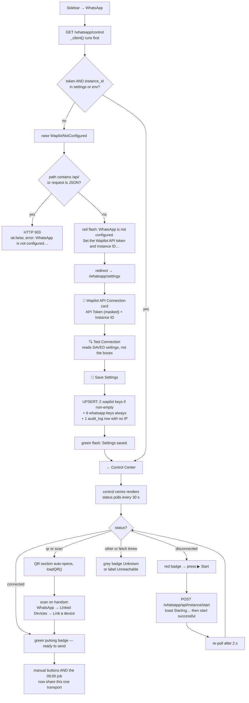

---

## Workflow 2 — Send one message from the Send Centre

### 2.1 Who, when, why

**Who:** anybody who can open the module — `super_admin`, `clinic_owner`, `branch_manager`,
`reception`. There is no extra role gate on any of the four send endpoints.

**When:** the one-off. A client rings asking for the clinic's address; a vet wants a photo of a
wound sent back to the owner; somebody needs the price list as a PDF. It is the "type a number,
type a message, press send" screen.

**Why:** it is the only screen in the product that sends **arbitrary** WhatsApp content —
free text, an image, a document or a video — to an arbitrary number. Everything else in the
module sends a fixed shape.

**Where it is:** Control Center topbar → **✉️ Send Message / ✉️ إرسال رسالة**, or the CRM client
record's **✉️ Send Message / إرسال رسالة** button (Workflow 4), or type
`/whatsapp/send-center`.

### 2.2 Preconditions

| # | Condition | If it is not met |
|---|---|---|
| 1 | WhatsApp connected (Workflow 1) | The page still renders — `send_center()` does **not** call `_client()` — but every send returns `❌ Error: WhatsApp is not configured. …` |
| 2 | JavaScript enabled | **Nothing on this screen works.** There is no `<form>`; all four send buttons are `onclick` handlers calling `fetch()`. **KL-12** |
| 3 | You know the number in a form Wapilot accepts | § 0.7 — the field's own placeholder is `e.g. 201012345678 or chat_id@c.us`, i.e. the international form without a `+` |

### 2.3 Happy path — plain text

1. **Open `/whatsapp/send-center`.** Page title **Send Message / إرسال رسالة**, subtitle *"Send
   text, images, files or videos via WhatsApp / إرسال نصوص أو صور أو ملفات أو فيديوهات عبر
   واتساب"*. Topbar: **← Control Center / ← مركز التحكم**.

2. **Two columns.** Left = the send card (**✉️ Send / ✉️ إرسال**). Right = the template picker
   (**📋 Templates / 📋 القوالب**) and the phone lookup box.

3. **Pick a tab.** Four buttons across the top of the left card:
   **💬 Text / 💬 نص** (selected) · **🖼 Image / 🖼 صورة** · **📎 File / 📎 ملف** ·
   **🎬 Video / 🎬 فيديو**.

4. **Fill in Phone Number * / رقم الهاتف *.** One shared field above the tabs — the same value
   is used whichever tab you send from. Placeholder: `e.g. 201012345678 or chat_id@c.us`.

5. **Optionally click a template card on the right.** Each card shows the template's `name` in
   bold and the first lines of `template_text` beneath. Clicking it:
   - highlights the card,
   - **replaces** the message box contents with the template text,
   - switches you to the **💬 Text** tab,
   - records the template's numeric id in `selectedTemplateId`.

   The text that lands in the box has already been mangled by the template: the `onclick`
   attribute is built with `'{{ tpl.template_text | replace("'","") | truncate(200) }}'`, so
   **every apostrophe is stripped and anything past ~200 characters is cut and replaced with
   `...`**. The full text is still visible in the card preview; it is the copy that reaches the
   textarea that is truncated. **KL-15.**
   Source: `D:/vet/platform/templates/whatsapp/send_center.html:217`, `:260-266`

6. **Or search the templates** with the *"Search templates… / ابحث في القوالب…"* box above the
   grid. It filters client-side on lower-cased name **and** body.

7. **Or draft it with AI.** The **✨ AI Draft / ✨ مسودة بالذكاء الاصطناعي** button beside the
   Message label opens a modal:
   - **"What's the message about? / ما موضوع الرسالة؟"** — a textarea, placeholder *"e.g.
     Remind owner about vaccination due next week for their cat Mimi… / مثال: ذكّر المالك بموعد
     تطعيم قطته ميمي الأسبوع القادم…"*
   - a language `<select>`: **English / الإنجليزية** or **Arabic / العربية**
   - **🤖 Generate Message / 🤖 توليد الرسالة** → `POST /ai/draft-message` with
     `{context, lang}`. While it runs the button reads `...` and is disabled.
   - the result appears in a scrollable grey box; **✅ Use This Message / ✅ استخدم هذه الرسالة**
     copies it into the message textarea and closes the modal.
   - **Empty context** → browser `alert('Please describe what the message should say.')`
   - **The fetch threw** → browser `alert('AI unavailable. Please write the message manually.')`
   - **The endpoint answered but returned no `message` key** → the box shows the literal
     `(no response)`, and the **Use This Message** button is still offered.
   Source: `D:/vet/platform/templates/whatsapp/send_center.html:85-156`

8. **Press 📤 Send Message / 📤 إرسال رسالة.**

9. **What actually happens.** `sendText()` POSTs JSON to `/whatsapp/api/send/text`:

   ```json
   {"phone": "201012345678", "text": "…", "template_name": "3"}
   ```

   Note `template_name` carries the **numeric template id**, not the name — and `''` when no
   template was clicked. That value is what lands in `whatsapp_log.template_name`, so the
   Message Log's **Template / القالب** column shows `3` rather than `appointment_reminder`.
   **KL-16.**
   Source: `D:/vet/platform/templates/whatsapp/send_center.html:284-294`

10. **Server side** (`api_send_text`): the chat id is built as
    `phone if "@" in phone else f"{phone.lstrip('+')}@c.us"`, both fields are rejected if blank,
    the message is sent, and **one `whatsapp_log` row is written whatever the outcome** —
    `owner_id` from the body (the Send Centre never sends one, so it is `NULL`), the first 500
    characters of the text, the template name, `status` = `Sent` or `Failed`, the first 500
    characters of the JSON response, and the error string.

11. **A coloured box appears under the send button for 6 seconds**, then fades:
    - green — `✅ Sent to 201012345678`
    - red — `❌ Error: <the error string>`

Source: `D:/vet/platform/blueprints/whatsapp/routes.py:232-268`;
`D:/vet/platform/templates/whatsapp/send_center.html:45-204`, `:247-294`

### 2.4 Happy path — image, file or video

12. **Switch to 🖼 Image / 📎 File / 🎬 Video.** Each panel has the same two controls:

    | Tab | File label | `accept` | Caption label |
    |---|---|---|---|
    | Image | `Image File * / ملف الصورة *` | `image/*` | `Caption (optional) / تعليق (اختياري)` |
    | File | `Document File * / ملف المستند *` | *(none — anything)* | same |
    | Video | `Video File * / ملف الفيديو *` | `video/*` | same |

13. **Choose the file, type an optional caption, press 📤 Send Image / 📤 Send File / 📤 Send
    Video** (`📤 إرسال الصورة` / `📤 إرسال الملف` / `📤 إرسال الفيديو`).

14. `sendMedia(type)` builds a `FormData` with `phone`, `caption` and `media`, and POSTs it to
    `/whatsapp/api/send/<type>`. The server reads the whole file into memory
    (`file.read()`) and hand-assembles a multipart body with boundary
    `----WapilotBoundary7623`, `Content-Type: application/octet-stream` for the file part, and
    the filename taken verbatim from the upload.

15. **Result box:** green `✅ image sent` / `✅ file sent` / `✅ video sent`, or red
    `❌ Error: <message>`.

16. **Nothing is written to `whatsapp_log`.** All three media routes return the API result and
    stop. A media send leaves **no trace anywhere in the platform** — not in the log, not in the
    client's Communication History, not in the audit trail. **KL-17.**

Source: `D:/vet/platform/blueprints/whatsapp/routes.py:270-310`;
`D:/vet/platform/blueprints/whatsapp/wapilot.py:139-178`;
`D:/vet/platform/templates/whatsapp/send_center.html:158-201`, `:296-313`

### 2.5 Every alternative scenario

**A. You already know the client's chat id.** Type it with the `@c.us` suffix and it is passed
through untouched — the `"@" in phone` test short-circuits the reformatting. Tested:
`test_send_text_accepts_a_full_chat_id_unchanged`.
Source: `D:/vet/platform/tests/test_whatsapp_routes.py:407`

**B. There are no templates yet.** The right column shows *"No templates yet. / لا توجد قوالب
بعد."* with a **Create one → / أنشئ واحداً ←** link to `/whatsapp/templates/new`.
Source: `D:/vet/platform/templates/whatsapp/send_center.html:222-227`

**C. The template contains placeholders like `{owner}`.** They are sent **literally**. No
substitution happens anywhere in this path — the client receives `Dear {owner_name}, …`. This is
the single most damaging behaviour in the chapter, and it applies to every seeded template.
**KL-18.**
Source: `D:/vet/platform/blueprints/whatsapp/routes.py:244-268` (no `.format()`, no `replace`)

**D. You want to send the same thing to 40 people.** Use a campaign (Workflow 7), not this
screen. There is no multi-recipient field here.

**E. You want to know a number's chat id first.** The **🔍 Phone Lookup / 🔍 البحث عن رقم** box
at the bottom right calls `/whatsapp/api/lookup/phone/<phone>` and, on success, renders
**LID:** and **PN:** with a **Use** button that copies the PN into the send field. **The
endpoint's upstream URL is malformed** (§ 0.7, KL-4), so in practice this shows `Not found` or
an upstream error.
Source: `D:/vet/platform/templates/whatsapp/send_center.html:234-242`, `:315-330`

**F. You picked a template then edited the text.** `selectedTemplateId` is not cleared, so the
log still records that template id even though the body no longer matches it.

**G. The file is large.** The platform's `MAX_CONTENT_LENGTH` applies before any view runs; over
it, Werkzeug rejects the request and the 413 page appears telling you to split the file. The
`fetch` sees an HTML body and the JSON parse throws in the console — no result box appears.
Source: `D:/vet/platform/app.py:473-485`

**H. You are `reception`.** Everything on this screen works for you. The Send Centre is not
role-gated beyond the module grant.

### 2.6 Errors and edge cases — exact messages

| What you did | What the app does | Exact message |
|---|---|---|
| Left the phone or the message empty | Client-side guard; no request is sent | red box `Phone and message required` |
| Left the phone or the file empty | Client-side guard; no request is sent | red box `Phone and file required` |
| Bypassed the JS and posted text with a blank field | HTTP **400**, **nothing is logged** | `{"ok": false, "error": "phone and text required"}` |
| Bypassed the JS and posted media with no file | HTTP **400**, nothing is logged | `{"ok": false, "error": "phone and media required"}` |
| WhatsApp not configured | HTTP **503** from the blueprint error handler | red box `❌ Error: undefined` — the 503 body uses the key `error`, so it renders, but a network-level failure to reach the app at all gives `undefined` |
| Wapilot rejected the send | Row written with `status='Failed'` | red box `❌ Error: HTTP 400: Bad Request` |
| Wapilot unreachable | Row written with `status='Failed'` and the raw exception in `error` | red box `❌ Error: <urlopen error …>` |
| Sent with no session | Redirect to the login page; the `fetch` gets HTML | nothing renders; console shows a JSON parse error |
| Sent with a missing CSRF header | Full-page 403 HTML returned to the `fetch` | nothing renders |

Both 400 branches return **before** any database write — verified by
`test_send_text_rejects_incomplete_input_without_writing` and
`test_send_media_rejects_a_missing_file`.

Source: `D:/vet/platform/blueprints/whatsapp/routes.py:250-251`, `:278-279`, `:291-292`,
`:304-305`; `D:/vet/platform/templates/whatsapp/send_center.html:287`, `:302`;
`D:/vet/platform/tests/test_whatsapp_routes.py:394`, `:440`

### 2.7 What gets written, and what changes elsewhere

**Text send** → exactly one `whatsapp_log` row:

| Column | Value |
|---|---|
| `owner_id` | `NULL` — the Send Centre JS never sends one |
| `phone` | exactly what you typed, **before** the `@c.us` suffix is added |
| `message` | first 500 characters of the text |
| `template_name` | the numeric template id, or `''` |
| `status` | `Sent` or `Failed` |
| `response` | first 500 characters of `json.dumps(data)` |
| `error` | the error string, or `''` |
| `sent_at` | `NOW()` |
| `http_status`, `reminder_id`, `pet_id` | never set by this route |

Because `owner_id` is `NULL`, **a Send Centre message never appears in that client's
Communication History on `/crm/owners/<id>`** — that panel joins on `whatsapp_log.owner_id`.
**KL-19.**

**Media send** → nothing at all.

**Neither writes an audit row.** The `whatsapp` module audits template creation, template
update, campaign creation and settings changes — not sends.

Source: `D:/vet/platform/blueprints/whatsapp/routes.py:255-266`;
`D:/vet/platform/blueprints/crm/routes.py:387-394`

### 2.8 Flowchart

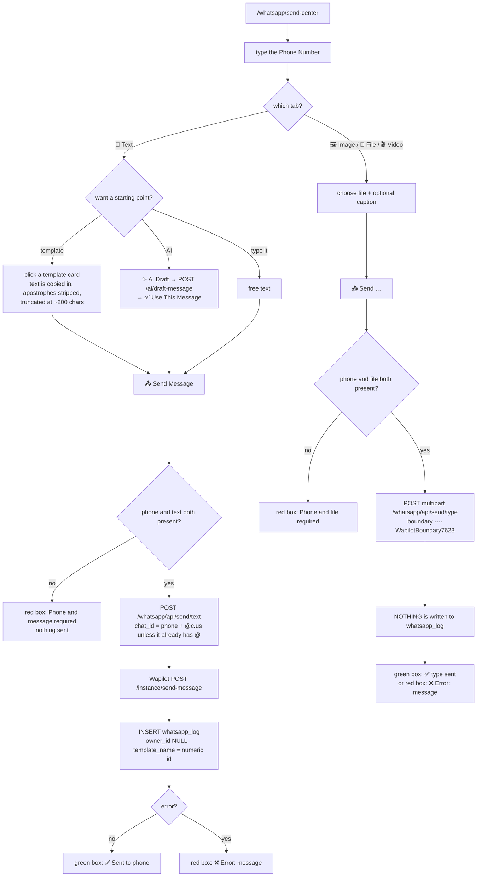

---

## Workflow 3 — Send a bill to the client from the invoice screen

### 3.1 Who, when, why

**Who:** anyone holding the `invoicing` grant — `super_admin`, `clinic_owner`,
`branch_manager`, `reception`, `finance`. **Note `finance` can press this button and cannot open
a single WhatsApp screen to see the result** (§ 0.3).

**When:** at the counter, right after taking payment or right after raising an unpaid invoice.
It is the fastest way to put a receipt in the client's hand without printing.

**Why:** because a printed A5 receipt is lost by the time the client reaches the car park, and a
WhatsApp message is not.

**Where:** `/finance/invoices/<id>` → right-hand column → **📱 Send via WhatsApp / إرسال
واتساب** card. This route also appears in the Finance chapter as Workflow 8, Route C; it is
repeated here in full because the failure modes belong to this module.

### 3.2 Preconditions

| # | Condition | If it is not met |
|---|---|---|
| 1 | WhatsApp connected (Workflow 1) | Red flash `WhatsApp error: WhatsApp is not configured. Set the Wapilot API token and instance ID under WhatsApp → Settings, or via the WAPILOT_TOKEN / WAPILOT_INSTANCE environment variables.` and **no log row is written** |
| 2 | The invoice exists | HTTP 404 |
| 3 | `owners.phone` is filled in | Amber flash `Owner has no phone number on file.` — nothing is sent, nothing is logged |
| 4 | You hold the `invoicing` grant | Red flash `You don't have permission to access this page.` |

Precondition 3 says `owners.phone`, not `owners.whatsapp_phone`. `db.get_invoice()` selects
`o.phone AS owner_phone` alongside `o.whatsapp_phone`, and this route reads **`owner_phone`**. A
client whose WhatsApp number differs from their landline gets the bill sent to the landline.
**KL-20.**
Source: `D:/vet/platform/models/database.py:3623`;
`D:/vet/platform/blueprints/finance/routes.py:736`

### 3.3 Happy path

1. **Open the invoice.** `/finance/invoices/<id>` — for example `INV-2026-00184` for Ahmed
   Hassan's cat Basbous.

2. **Find the 📱 Send via WhatsApp / إرسال واتساب card** in the right-hand column, below
   Record Payment and above Credit Note. It is marked `no-print`, so it does not appear on the
   printed page. The card body reads *"Send invoice summary to owner via WhatsApp / إرسال ملخص
   الفاتورة عبر واتساب"*.

3. **Press the single green button, 📱 Send WhatsApp / إرسال.** There is **no confirm dialog**
   and **no preview** — the message goes the moment you click.

4. **The route builds a hardcoded English message** from the invoice and its lines:

   ```
   🐾 *Aleefy*
   Invoice: *INV-2026-00184*
   Date: 2026-08-19

   *Services:*
     • Spay surgery — Basbous: 1500.00 EGP
     • Post-op medication: 350.00 EGP

   Subtotal: 1850.00 EGP
   *Total: 1850.00 EGP*
   Paid: 1850.00 EGP
   *Balance Due: 0.00 EGP*

   Thank you for choosing Aleefy 🐾
   Happy Pets, Healthy Lives
   ```

   `Discount: -<amount> EGP` is inserted after the subtotal only when `discount_amount` is
   non-zero; `Tax: +<amount> EGP` likewise. Everything is formatted `%.2f` and suffixed `EGP`.
   Source: `D:/vet/platform/blueprints/finance/routes.py:713-734`

5. **It calls `blueprints.whatsapp.routes._send_and_log`** with `owner_id` from the invoice and
   `template_name='invoice_whatsapp'`. That helper builds the chat id, sends, and writes the
   `whatsapp_log` row — **including the failure case**.

6. **Green flash on success:** `Invoice sent via WhatsApp to 01001234567.` — the phone as
   stored, not the chat id. You stay on the invoice page.

Source: `D:/vet/platform/blueprints/finance/routes.py:707-752`;
`D:/vet/platform/templates/finance/invoice_detail.html:267-278`;
`D:/vet/platform/blueprints/whatsapp/routes.py:51-72`

### 3.4 Every alternative scenario

**A. The clinic is not called Aleefy.** The brand name, the paw emoji and the tagline *"Happy
Pets, Healthy Lives"* are baked into the string. The clinic identity configured under System →
Branding is ignored. **KL-1.**
Source: `D:/vet/platform/blueprints/finance/routes.py:718`, `:732-733`

**B. The client reads Arabic.** So does the invoice print view and the PDF. This message does
not — `t()` is never called. **KL-1.**

**C. The invoice has no lines.** `invoice.get("lines") or []` yields an empty loop, so the
`*Services:*` heading is followed by a blank line and then the totals. Nothing errors.

**D. The invoice is partly paid.** The message shows `Paid:` and `*Balance Due:*` from
`paid_amount` and `due_amount`, so a client who paid 1,000 of 1,850 EGP is quoted the right
850.00 EGP outstanding. (Contrast the nightly invoice reminder, § 8.6 D, which had exactly this
bug and was fixed.)

**E. The send fails.** Amber flash `WhatsApp queued / failed — check message log.` The attempt
**is** in `whatsapp_log` with `status='Failed'`, so the log tells you why.

**F. WhatsApp is not configured at all.** `_send_and_log` calls `_client()`, which raises
`WapilotNotConfigured`. The whatsapp blueprint's error handler **does not fire** — this request
belongs to the `finance` blueprint — so the exception propagates to the route's own
`except Exception as e:` and you get a red flash `WhatsApp error: WhatsApp is not configured.
Set the Wapilot API token and instance ID under WhatsApp → Settings, or via the WAPILOT_TOKEN /
WAPILOT_INSTANCE environment variables.` **No `whatsapp_log` row is written in this case** — the
raise happens on the helper's first line, before the INSERT. So an unconfigured clinic pressing
this button leaves *no* evidence at all, whereas the nightly job in the same state leaves a
`Not Configured` row. **KL-21.**
Source: `D:/vet/platform/blueprints/whatsapp/routes.py:24-29`, `:53-54`;
`D:/vet/platform/blueprints/finance/routes.py:741-751`

**G. You want to send the PDF instead of a text summary.** You cannot from here. The PDF is a
separate download button, and the Send Centre's **📎 File** tab is the only way to attach it —
which means downloading it, then re-uploading it, and it will not be logged (Workflow 2, KL-17).

**H. You press it twice.** Two messages, two log rows. Nothing de-duplicates.

**I. The client has no phone at all.** Amber flash `Owner has no phone number on file.` and a
redirect back to the invoice. Nothing sent, nothing logged.

### 3.5 Errors and edge cases — exact messages

| What you did | What the app does | Exact message |
|---|---|---|
| Invoice id does not exist | HTTP 404 | — |
| Owner has no `phone` | Redirect to the invoice, nothing sent or logged | `Owner has no phone number on file.` (amber) |
| Sent successfully | Redirect to the invoice | `Invoice sent via WhatsApp to 01001234567.` (green) |
| `_send_and_log` returned anything but `Sent` | Redirect to the invoice; the row **is** logged | `WhatsApp queued / failed — check message log.` (amber) |
| WhatsApp not configured, or the helper raised for any other reason | Redirect to the invoice, **nothing logged** | `WhatsApp error: <exception text>` (red) |
| Not holding the `invoicing` grant | Redirect to `/` | `You don't have permission to access this page.` |
| CSRF missing | Full-page 403 | `Invalid or missing security token. Please go back and try again.` |

Source: `D:/vet/platform/blueprints/finance/routes.py:736-752`

### 3.6 What gets written

One `whatsapp_log` row, written by `_send_and_log` — the most completely populated row any
writer in this module produces:

| Column | Value |
|---|---|
| `owner_id` | the invoice's owner |
| `phone` | `owners.phone` as stored |
| `message` | first 500 characters of the summary |
| `template_name` | `invoice_whatsapp` |
| `status` | `Sent` or `Failed` |
| `http_status` | `data.get("status", 0)` — **the JSON body's `status` field, not the HTTP status code.** For a successful Wapilot v2 response this is usually `0` |
| `response` | first 500 characters of `json.dumps(data)` |
| `error` | first 300 characters of the error, or `''` |
| `sent_at` | `NOW()` |

**Nothing on the invoice changes.** No status flip, no note, no audit row. If you want to know
whether a bill was ever sent, the message log is the only record, and it records the attempt,
not the delivery.

Because `owner_id` **is** set here, this row **does** appear in the client's Communication
History on `/crm/owners/<id>` with channel `WhatsApp` and subject `invoice_whatsapp`.

Source: `D:/vet/platform/blueprints/whatsapp/routes.py:58-70`;
`D:/vet/platform/blueprints/crm/routes.py:387-394`

### 3.7 Flowchart

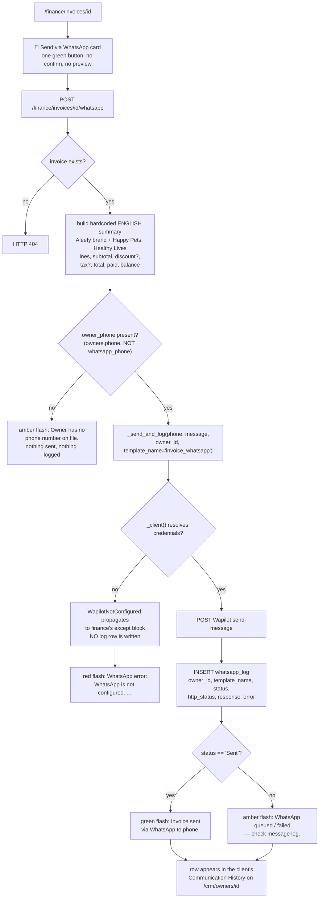

---

## Workflow 4 — Message a client from their record

### 4.1 Who, when, why

**Who:** anyone holding both `patients` (to open the client record) and `whatsapp` (to land on
the Send Centre) — in practice `super_admin`, `clinic_owner`, `branch_manager`, `reception`.

**When:** the client rang, or walked in, and you are already looking at their file. You want to
send them something and you want it on their record afterwards.

**Why it is in this chapter:** because **it does not do what it looks like it does.** This is
the shortest workflow in the chapter and the one most likely to mislead.

### 4.2 What the button actually is

`/crm/owners/<id>` has a **💬 Communication History / سجل التواصل** card. Its header carries one
button, **✉️ Send Message / إرسال رسالة**, and that button is a plain
`<a href="{{ url_for('whatsapp.send_center') }}">`.

It is a **link to `/whatsapp/send-center` with no query string.** It does not carry the owner's
id, their name, their phone number, or anything else. You arrive at an empty Send Centre and
have to copy the number across yourself — and the number is displayed two cards further up the
page under **WhatsApp / واتساب**, so you have to scroll back, select it, copy it, and paste.

**And because the Send Centre never sends `owner_id` (§ 2.7), the message you then send does not
come back to this panel.** The card you clicked "Send Message" from will not show what you sent.
**KL-19, KL-22.**

Source: `D:/vet/platform/templates/crm/owner_detail.html:583-587`, `:314-322`;
`D:/vet/platform/templates/whatsapp/send_center.html:284-294`

### 4.3 Happy path — what a receptionist actually has to do

1. **Open the client.** `/crm/owners/<id>`, e.g. Ahmed Hassan.
2. **Scroll to the contact block** and read the **WhatsApp / واتساب** row. If it is absent, the
   owner has no `whatsapp_phone` — use the **Phone / الهاتف** row instead.
3. **Select and copy the number.**
4. **Scroll down to 💬 Communication History / سجل التواصل** and press **✉️ Send Message /
   إرسال رسالة**.
5. **You land on `/whatsapp/send-center` with nothing filled in.**
6. **Paste the number into Phone Number * / رقم الهاتف *.** Remember § 0.7 — a stored
   `01001234567` becomes chat id `01001234567@c.us`, which is not the international form.
7. **Type or pick the message and send.** Workflow 2 from step 3.
8. **Go back to the client record.** Your message is **not** in the Communication History,
   because `owner_id` was never sent.

### 4.4 What the Communication History card does show

The panel is the union of two queries, sorted by timestamp descending, with **no overall limit**
applied after the merge (each half is capped at 20, so up to 40 rows render):

| Half | Source | `at` | `channel` | `subject` | `body` |
|---|---|---|---|---|---|
| Sent | `whatsapp_log WHERE owner_id = ?` ORDER BY `sent_at` DESC LIMIT 20 | `sent_at` | the literal `'WhatsApp'` | `template_name` | `message` |
| Queued | `reminders WHERE owner_id = ?` ORDER BY `scheduled_for` DESC LIMIT 20 | `scheduled_for` | `reminders.channel` (defaults `'WhatsApp'`) | `reminder_type` | `message` |

Each row renders the date (`at[:10]`), the channel in bold beneath it, the subject in bold if
present, and the body truncated at 160 characters.

So the panel mixes **what was attempted** with **what is merely scheduled**, on one timeline,
with only the channel word to tell them apart — and a `reminders` row that is still `Pending`
looks identical to one that was sent. The `status` column is selected in both halves and
**rendered by neither**. **KL-23.**

Source: `D:/vet/platform/blueprints/crm/routes.py:386-401`;
`D:/vet/platform/templates/crm/owner_detail.html:589-601`

### 4.5 Which sends do land on this panel

| Send path | `owner_id` set? | Appears in Communication History? |
|---|---|---|
| Invoice **📱 Send WhatsApp** | ✅ from the invoice | ✅ |
| Reminders list **📱 Send WA** modal (`/whatsapp/send`) | ✅ — the modal posts a hidden `owner_id` | ✅ |
| Reminder Admin **📱 Send Now** | ✅ from the reminder | ✅ |
| Nightly 09:00 job, all three types | ✅ from the query | ✅ |
| **Send Centre — text** | ❌ | ❌ |
| **Send Centre — image / file / video** | *not logged at all* | ❌ |
| Campaigns | *not logged at all* | ❌ |

Source: `D:/vet/platform/blueprints/whatsapp/routes.py:63`, `:255-263`, `:657`, `:959`, `:986`;
`D:/vet/platform/blueprints/whatsapp/scheduler.py:161-164`;
`D:/vet/platform/templates/whatsapp/reminders.html:127`

### 4.6 Every alternative scenario

**A. You want the message on the record.** Do not use this button. Either raise a reminder for
the client on Reminder Admin and press **📱 Send Now** (Workflow 6), or send the client's
invoice from the invoice screen (Workflow 3). Both set `owner_id`.

**B. You want to see everything ever sent to everybody.** `/whatsapp/log` — last 200 rows,
newest first (Workflow 10).

**C. The client's WhatsApp number differs from their phone.** `owners` has both columns and the
CRM shows both. Only the nightly job reads `whatsapp_phone` exclusively; the manual paths prefer
it but fall back, and the invoice path ignores it entirely (§ 0.7).

**D. You are on a pet page rather than the owner page.** There is no WhatsApp button on
`/crm/pets/<id>`.

### 4.7 Errors and edge cases

There are none specific to this step — it is a link. Every failure mode belongs to Workflow 2.

### 4.8 Flowchart

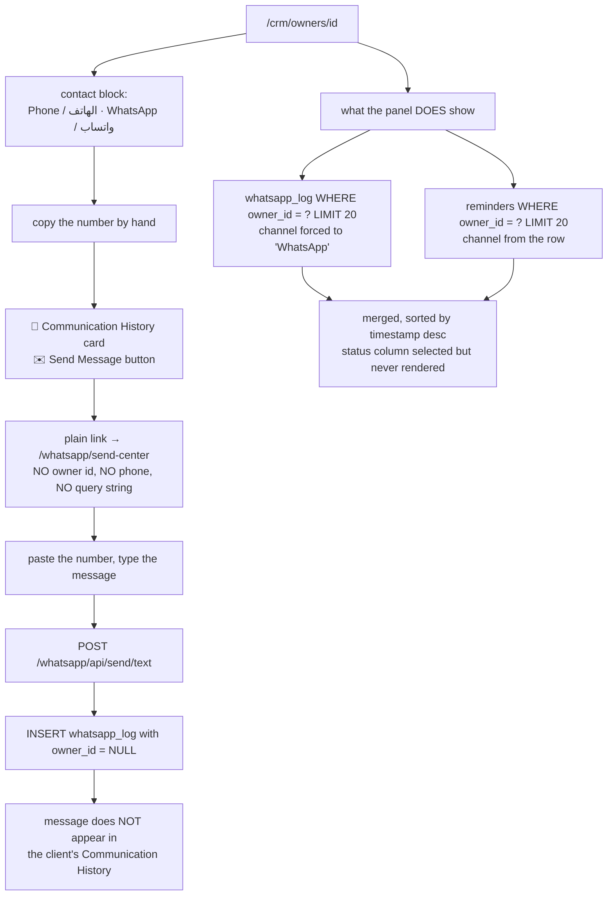

---

## Workflow 5 — Message templates

### 5.1 Who, when, why

**Who:** `super_admin`, `clinic_owner`, `branch_manager` and **`reception`** can create and
edit. Only the first three can delete. Everyone with the module grant can read the list and use
templates from the Send Centre.

**When:** at go-live, to replace the six seeded English rows with the clinic's own wording; and
whenever a member of staff finds themselves typing the same paragraph twice.

**Why:** so the same message goes out the same way every time, in the clinic's voice.

**Where:** Control Center topbar → **📋 Templates / 📋 القوالب**, or from the Message Log or
Pending Reminders topbars, or `/whatsapp/templates`.

### 5.2 What is seeded on day one

Six rows, created once during database initialisation with `INSERT OR IGNORE`:

| `name` | `scenario` | `language` | Body |
|---|---|---|---|
| `appointment_reminder` | `appointment` | `en` | `Dear {owner_name}, this is a reminder for {pet_name}'s appointment at {clinic_name} on {date} at {time}. Please confirm by replying YES. Thank you!` |
| `appointment_confirmation` | `appointment` | `en` | `Your appointment for {pet_name} at {clinic_name} on {date} at {time} is confirmed. See you soon!` |
| `followup_reminder` | `followup` | `en` | `Dear {owner_name}, it's time for {pet_name}'s follow-up visit at {clinic_name}. Please call us to schedule at your convenience.` |
| `vaccine_due` | `vaccine` | `en` | `Dear {owner_name}, {pet_name} is due for {vaccine_name} vaccination. Please contact {clinic_name} to schedule. Stay ahead of preventive care!` |
| `invoice_sent` | `invoice` | `en` | `Dear {owner_name}, your invoice #{invoice_number} for {amount} EGP is ready. Please contact us for payment details. Thank you!` |
| `appointment_reminder_ar` | `appointment` | `ar` | `عزيزي {owner_name}، تذكير بموعد {pet_name} في {clinic_name} يوم {date} الساعة {time}. يرجى التأكيد بالرد بـ نعم. شكراً!` |

**Every placeholder in every one of these six templates is dead.** Nothing anywhere substitutes
`{owner_name}`, `{pet_name}`, `{clinic_name}`, `{vaccine_name}`, `{invoice_number}`, `{date}`,
`{time}` or `{amount}` into a template on the way out. Send any of these six and the client
receives the braces. **KL-18.**

Worse, the placeholders in the seeded data do not even match the ones the UI advertises: the
template form's help line offers `{owner}` `{pet}` `{date}` `{time}` `{vet}` `{clinic}`
`{vaccine}` `{invoice}` `{amount}`, and its live preview substitutes exactly those nine — so the
preview of a seeded template shows `{owner_name}` unchanged while claiming to be a preview.
**KL-24.**

Source: `D:/vet/platform/models/database.py:2460-2473`, `:2667-2671`;
`D:/vet/platform/templates/whatsapp/template_form.html:61-63`, `:106-117`

### 5.3 Happy path — create a template

1. **Open `/whatsapp/templates`.** Title **WhatsApp Templates / قوالب واتساب**, subtitle
   *"Manage message templates for WhatsApp communication / إدارة قوالب الرسائل للتواصل عبر
   واتساب"*. Topbar: **➕ New Template / ➕ قالب جديد**, **📋 Message Log / 📋 سجل الرسائل**,
   **🔔 Reminders / 🔔 التذكيرات**.

2. **The list.** Five pill tabs across the top with live counts —
   **📋 All / 📋 الكل**, **📅 Appointment / 📅 موعد**, **🔄 Follow-up / 🔄 متابعة**,
   **💉 Vaccine / 💉 تطعيم**, **📢 Campaign & Other / 📢 حملة وأخرى** — then a search box
   (*"Search templates by name or message… / ابحث في القوالب بالاسم أو الرسالة…"*), then a line
   reading `6 templates available`, then a card grid.

   The five tabs cover only four scenarios: **anything that is not `appointment`, `followup` or
   `vaccine` is counted and filtered under Campaign & Other** — including `invoice` and
   `custom`. Both filters are client-side; `templates_list()` returns every row with
   `SELECT * FROM whatsapp_templates ORDER BY name` and no pagination.
   Source: `D:/vet/platform/blueprints/whatsapp/routes.py:497-507`;
   `D:/vet/platform/templates/whatsapp/templates_list.html:110-136`, `:228-260`

3. **Each card shows:** the name title-cased with underscores replaced (`Appointment Reminder`),
   the raw name below it in monospace, a coloured scenario badge, a collapsible
   **👁 Preview message / 👁 معاينة الرسالة** holding the body, a **Variables / المتغيرات** chip
   row parsed out of `variables_json`, and a footer reading
   `🌐 English · ● Active` (or `● Inactive`, plus `⭐ Default` when set) with
   **✏️ Edit / ✏️ تعديل** and a red **🗑** button.

4. **Press ➕ New Template / ➕ قالب جديد.**

5. **The form.** Page title `New WhatsApp Template` (English only), subtitle *"Define reusable
   message templates with dynamic variables / تعريف قوالب رسائل قابلة لإعادة الاستخدام بمتغيرات
   ديناميكية"*.

   | Field | Label EN / AR | Control | Notes |
   |---|---|---|---|
   | `name` | Template Name * / اسم القالب * | text, `required` | placeholder *"e.g. Appointment Reminder / مثال: تذكير بموعد"*; **UNIQUE in the schema** |
   | `scenario` | Scenario / السيناريو | select | `appointment`, `followup`, `vaccine`, `invoice`, `campaign`, `custom` — displayed title-cased, **English only** |
   | `language` | Language / اللغة | select | English / الإنجليزية (`en`), Arabic / العربية (`ar`), Any / أي (`Any`) — **stored and never read by any code** |
   | `is_active` | Active / نشط | checkbox, ticked by default on New | only active templates appear in the Send Centre and `/whatsapp/api/templates` |
   | `is_default` | Default / افتراضي | checkbox, unticked | **stored and never read by any code** — it only draws a `⭐ Default` badge |
   | `template_text` | Message Text * / نص الرسالة * | textarea, 7 rows, `required` | placeholder `Dear {owner}, {pet} has an appointment on {date} at {time}.` |
   | `variables_json` | Variables JSON (optional) / متغيرات JSON (اختياري) | text | placeholder `["owner","pet","date","time"]`; defaults to `[]`; **not validated, not parsed server-side** |

6. **Type the body.** A green **📱 WhatsApp Preview / 📱 معاينة واتساب** panel below updates on
   every keystroke, substituting nine sample values:

   `{owner}`→`Ahmed Hassan` · `{pet}`→`Max` · `{date}`→`Monday 2 June` · `{time}`→`10:00 AM` ·
   `{vet}`→`Dr. Sarah` · `{clinic}`→`Aleefy Veterinary Clinic` · `{vaccine}`→`Rabies` ·
   `{invoice}`→`INV-0042` · `{amount}`→`350 EGP`

   **This preview is a lie about what will be sent.** Nothing substitutes anything at send time.
   **KL-18.**
   Source: `D:/vet/platform/templates/whatsapp/template_form.html:106-117`

7. **Press 💾 Create Template.**

8. Green flash `Template 'appointment_reminder_ar_v2' created.` and a redirect to
   `/whatsapp/templates`.

Source: `D:/vet/platform/blueprints/whatsapp/routes.py:509-546`;
`D:/vet/platform/templates/whatsapp/template_form.html:1-119`

### 5.4 Happy path — edit a template

9. **Press ✏️ Edit / ✏️ تعديل** on a card, or open `/whatsapp/templates/<id>/edit`.

10. **The same form, pre-filled**, with the title now `Edit WhatsApp Template` and the button
    reading `💾 Save Changes`. A red **🗑 Delete / 🗑 حذف** button appears at the right end of
    the button row.

11. **Change what you need and press 💾 Save Changes.** Every field is written unconditionally —
    the UPDATE sets `name`, `scenario`, `language`, `template_text`, `variables_json`,
    `is_active` and `is_default` from the posted form, defaulting `name` to `''` and
    `template_text` to `''` if absent.

12. Green flash `Template updated.` and a redirect to `/whatsapp/templates`.

Source: `D:/vet/platform/blueprints/whatsapp/routes.py:548-585`

### 5.5 Happy path — delete a template

13. **From the list:** press the red **🗑** on the card. Browser confirm:
    `Delete template 'appointment_reminder'?`
14. **From the edit form:** press **🗑 Delete / 🗑 حذف**. Browser confirm:
    `Delete this template?`
15. **`DELETE FROM whatsapp_templates WHERE id=?`** — unconditional, no soft delete, no check
    that anything references it.
16. Green flash `Template deleted.` and a redirect to `/whatsapp/templates`.

**The delete button on the edit form is a `<form>` nested inside the edit `<form>`.** Nested
forms are invalid HTML; browsers drop the inner one during parsing, so the `🗑 Delete` button is
re-parented to the outer form and **behaves as a second submit button for the edit form** —
i.e. it saves the template instead of deleting it, after asking you to confirm a deletion.
**KL-25.**
Source: `D:/vet/platform/templates/whatsapp/template_form.html:12`, `:92-98`

Source: `D:/vet/platform/blueprints/whatsapp/routes.py:587-596`;
`D:/vet/platform/templates/whatsapp/templates_list.html:200-204`

### 5.6 Every alternative scenario

**A. You want a template that fills in the client's name.** Not possible. Nothing substitutes.
The nearest thing the product has is the three **reminder message** boxes on WhatsApp →
Settings, which *are* substituted — but only by the nightly job, and only for the three fixed
reminder types (Workflow 8, § 8.4).

**B. You want the Arabic version of an existing template.** Create a second row with a distinct
name — `name` is UNIQUE, so `appointment_reminder` and `appointment_reminder_ar` must differ.
Setting `language` to `ar` changes nothing about which one is offered; both appear in the Send
Centre picker.

**C. You want to retire a template without losing it.** Untick **Active / نشط** and save. It
stays on the templates list with a red `● Inactive` marker but disappears from the Send Centre
picker and from `GET /whatsapp/api/templates`.
Source: `D:/vet/platform/blueprints/whatsapp/routes.py:236-239`, `:604-607`

**D. You gave two templates the same name.** On **create**, the UNIQUE constraint raises and is
caught — see § 5.7. On **edit** there is no try/except at all, so the same collision produces an
unhandled exception and the 500 page. **KL-26.**
Source: `D:/vet/platform/blueprints/whatsapp/routes.py:543-544` versus `:558-570`

**E. You typed something that is not JSON into Variables JSON.** It is stored verbatim. The list
template then tries to render it: if the string starts with `[` it strips the brackets, removes
every quote, splits on commas and renders one chip per fragment; otherwise it renders the whole
string as a single chip. Nothing validates and nothing errors.
Source: `D:/vet/platform/templates/whatsapp/templates_list.html:173-188`

**F. A doctor tries to create a template.** Red flash `You don't have permission to access this
page.` — `doctor` holds no `whatsapp` grant, so the module gate stops them before the role list
is consulted. Tested: `test_template_write_routes_reject_a_veterinarian`.
Source: `D:/vet/platform/tests/test_whatsapp_routes.py:841`

**G. A receptionist tries to delete one.** Red flash, same message — `reception` may create and
edit but not delete. Tested: `test_template_delete_is_role_gated`, whose docstring is *"a
receptionist deleted a template"*.
Source: `D:/vet/platform/tests/test_whatsapp_routes.py:832`;
`D:/vet/platform/blueprints/auth/routes.py:128-143`

**H. You want to use a template in a campaign.** You cannot pick one. Campaigns take a free-text
default message typed into the campaign form (Workflow 7).

### 5.7 Errors and edge cases — exact messages

| What you did | What the app does | Exact message |
|---|---|---|
| Left the name blank on New | Re-renders the form **with your input preserved**; nothing written | `Template name is required.` (red) |
| Used a name that already exists on New | Catches the `IntegrityError`, flashes it, then **re-renders the form EMPTY — everything you typed is lost** | `Error: UNIQUE constraint failed: whatsapp_templates.name` (red, SQLite wording; PostgreSQL wording differs) |
| Any other database error on New | Same — flash then empty form | `Error: <exception text>` (red) |
| Used a name that already exists on Edit | **Unhandled** — HTTP 500 | `An internal error occurred. Please try again.` |
| Opened `/whatsapp/templates/<id>/edit` for an id that does not exist | Redirect to the list | `Template not found.` (red) |
| Created successfully | Redirect to the list | `Template '<name>' created.` (green) |
| Updated successfully | Redirect to the list | `Template updated.` (green) |
| Deleted | Redirect to the list | `Template deleted.` (green) |
| Deleted an id that does not exist | Nothing to delete; still succeeds | `Template deleted.` (green) |
| Not permitted | Redirect to `/` | `You don't have permission to access this page.` |

**The empty-form-after-error behaviour is worth calling out.** The blank-name branch re-renders
with `form=f` (your input); the exception branch falls through to the shared
`return render_template(..., form={}, ...)` at the end of the function. Type a 400-character
Arabic message, collide on the name, and it is gone. **KL-27.**

Source: `D:/vet/platform/blueprints/whatsapp/routes.py:514-516`, `:518-544`, `:552-556`,
`:587-596`; `D:/vet/platform/app.py:647-663`

### 5.8 What gets written, and what changes elsewhere

**Create** → one `whatsapp_templates` row + one `audit_log` row (`action='create'`,
`module='whatsapp'`, `entity_type='template'`, `details='Created template: <name>'`, `ip` =
`request.remote_addr`).

**Edit** → the row is updated + one `audit_log` row (`action='update'`, `entity_id=<tid>`,
`details='Updated template: <name>'`, with the IP).

**Delete** → the row is removed. **No audit row is written.** Creating and editing a template are
audited; destroying one is not. **KL-28.**

**What changes elsewhere:**
- The **Active Templates / القوالب النشطة** tile on the control centre.
- The Send Centre's right-hand picker and the `5 templates available` line.
- `GET /whatsapp/api/templates` — which, as it happens, **no template in this repository
  calls**; the Send Centre renders its picker server-side.

Source: `D:/vet/platform/blueprints/whatsapp/routes.py:532-539`, `:571-578`, `:587-596`,
`:598-610`

### 5.9 Flowchart

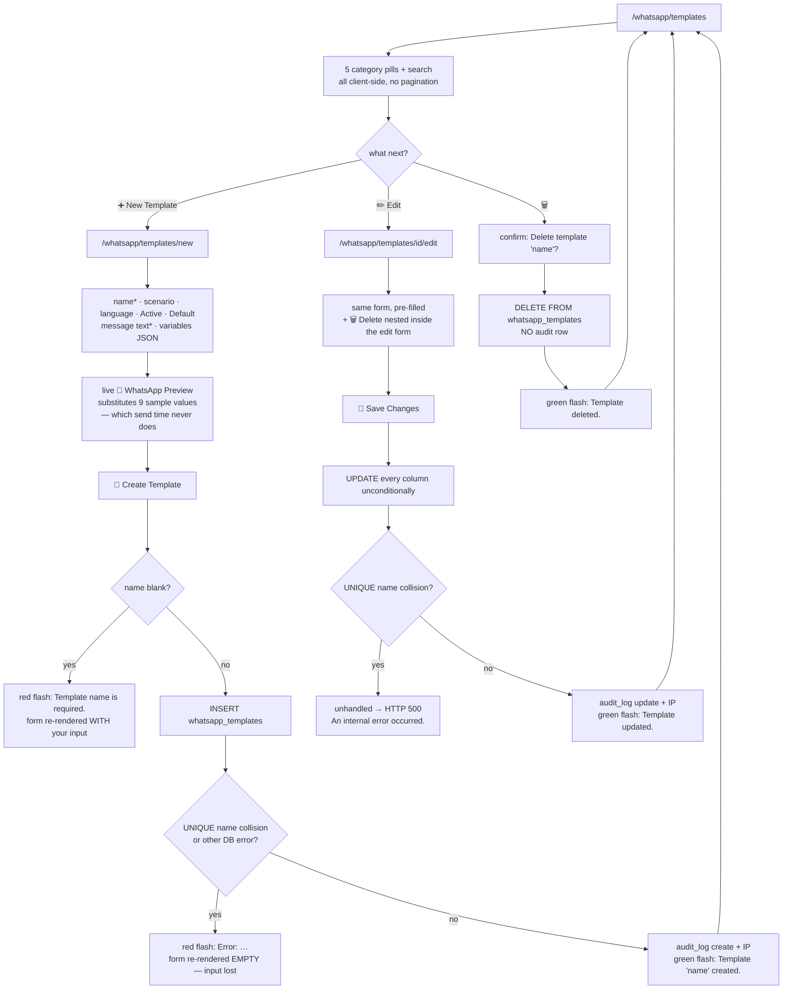

---

## Workflow 6 — The reminders list: work the queue

### 6.1 Who, when, why

**Who:** anybody with the module grant — `super_admin`, `clinic_owner`, `branch_manager`,
`reception`. Only the **▶ Run Reminder Job Now** button in the Reminder Admin topbar is
role-gated (`super_admin`, `clinic_owner`, `branch_manager`); creating, cancelling and
**📱 Send Now** are not.

**When:** every morning, as part of opening the front desk. Somebody has to look at what is
queued and actually send it.

**Why — and read this before anything else in this workflow:**

> **The nightly 09:00 job never reads the `reminders` table.** It queries `appointments`,
> `vaccinations` and `invoices` directly and writes its de-duplication marks to
> `reminder_runs`. A row sitting in `reminders` with `status='Pending'` will sit there for
> ever unless a human presses a button. Nothing automatic will ever send it.

Source: `D:/vet/platform/blueprints/whatsapp/scheduler.py:211-335` (three queries; the word
`reminders` appears only as `reminder_runs`)

That single fact is why there are **two** reminder screens, and why they disagree:

| | **Pending Reminders** `/whatsapp/reminders` | **Reminder Admin** `/whatsapp/reminder-admin` |
|---|---|---|
| Shows | every `Pending` row, no limit | counters, a create form, overdue (≤50), upcoming (≤50), and the run log (≤20) |
| Send button | **📱 Send WA** — opens a modal, posts `/whatsapp/send` | **📱 Send Now** — posts `/whatsapp/reminder-admin/reminders/<id>/send-now` |
| Editable before sending? | ✅ phone and message are editable in the modal | ❌ sends the stored message to the stored phone |
| Marks the reminder `Sent`? | ❌ **no** — `/whatsapp/send` never touches the `reminders` row | ✅ on success only |
| Also has | **✓ Mark Sent** (flip the status without sending) | **✕** cancel, and the job trigger |
| Linked from | Message Log, Templates list | Control Center topbar |

### 6.2 Preconditions

| # | Condition | If it is not met |
|---|---|---|
| 1 | There are `reminders` rows | Pending Reminders shows a 🎉 empty state; Reminder Admin shows `🎉 No upcoming reminders / 🎉 لا توجد تذكيرات قادمة` |
| 2 | WhatsApp connected, for the send buttons | See the error table in § 6.7 |
| 3 | The owner has a phone | Reminder Admin refuses with an amber flash; the Reminders modal opens with an empty, `required` phone field |

### 6.3 Where reminders come from

Only three writers, and two of them are hard to reach:

1. **The ➕ Create Manual Reminder form** on Reminder Admin (§ 6.5).
2. **The public website booking API** — `POST /api/public/book` inserts one row when the
   visitor selected *"WhatsApp reminder"* **and** answered the opt-in with `Yes`. It is
   scheduled for `<appt_date> 09:00:00`, typed `appointment`, and the message is built as
   `Dear <owner>, <pet> has an appointment on <date> at <time>.`
3. **The demo seeder.**

`db.create_reminder()` exists and **has no callers**. Booking an appointment through the
platform's own `/appointments/` screens creates **no** reminder row.

Source: `D:/vet/platform/blueprints/public_api/routes.py:223-236`;
`D:/vet/platform/models/database.py:4087-4098`;
`D:/vet/platform/blueprints/whatsapp/routes.py:894-918`

### 6.4 Happy path — the Pending Reminders list

1. **Open `/whatsapp/reminders`** — from the Message Log or Templates topbar
   (**🔔 Reminders / 🔔 التذكيرات**), or by typing the URL. Title **Pending Reminders /
   تذكيرات معلقة**, subtitle *"Appointments, follow-ups, and vaccine reminders awaiting action /
   مواعيد ومتابعات وتذكيرات تطعيم بانتظار الإجراء"*.

2. **The query** is every `reminders` row with `status='Pending'`, left-joined to `owners` and
   `pets`, ordered by `scheduled_for` ascending, **with no `LIMIT`**. A clinic with 4,000
   pending rows renders 4,000 table rows.
   Source: `D:/vet/platform/blueprints/whatsapp/routes.py:614-630`

3. **A count line** reads `12 pending reminders` (English pluralisation in both languages), then
   a six-column table:

   | Column EN / AR | Content |
   |---|---|
   | Due Date / تاريخ الاستحقاق | `scheduled_for[:10]`, colour-coded — see the warning below |
   | Owner / المالك | `owners.full_name` in bold, with `whatsapp_phone` in small grey beneath if present |
   | Pet / الحيوان | `pets.pet_name` |
   | Type / النوع | a coloured pill: Appointment (blue), Followup (green), Vaccine (violet), Medication (pink), Custom (grey) |
   | Message / الرسالة | one line, ellipsised, full text on hover |
   | Actions / إجراءات | **✓ Mark Sent** and **📱 Send WA** |

   > **The date colouring never fires.** The template computes
   > `{% set today = now().strftime('%Y-%m-%d') if now is defined else '' %}`, and **`now` is
   > not defined** — the app's context processor exposes `t`, `loc`, `csrf_token`,
   > `current_user` and friends, but no `now`. So `today` is `''`, `due < today` is false and
   > `due == today` is false, and **every row renders green `due-upcoming`**, including ones
   > three months overdue. The red and amber classes exist in the stylesheet and are
   > unreachable. **KL-29.**
   > Source: `D:/vet/platform/templates/whatsapp/reminders.html:68-71`;
   > `D:/vet/platform/app.py:440-462`

4. **Press 📱 Send WA / 📱 إرسال واتساب** on a row. A modal opens titled **📱 Send WhatsApp
   Message / 📱 إرسال رسالة واتساب** with:
   - **Phone Number / رقم الهاتف** — pre-filled with the owner's `whatsapp_phone`, `required`,
     placeholder `+20 10 xxxx xxxx`, **editable**
   - a hidden `owner_id`
   - **Message / الرسالة** — pre-filled with the reminder's message, `required`, **editable**
   - **Cancel / إلغاء** and **Send Message 📤 / إرسال الرسالة 📤**

   The message is injected into the `onclick` attribute with
   `|replace("'","\\'")`, so a message containing a double quote or a newline can break the
   attribute and the modal opens blank. **KL-30.**
   Source: `D:/vet/platform/templates/whatsapp/reminders.html:99-104`, `:119-136`

5. **Press Send Message 📤.** The modal is a real `<form method="post">` to `/whatsapp/send`
   with a hidden `_csrf_token`, so it works with JavaScript disabled apart from the modal itself
   opening.

6. **`send_message()` runs:**
   - `phone` blank → red flash `Phone number is required.`, redirect to `request.referrer`
   - if a `template_id` was posted **and** the message is empty, it loads that template and uses
     its `template_text` and `name` (this modal never posts one)
   - still no message → red flash `Message content is required.`
   - otherwise `_send_and_log(phone, message, owner_id, template_name)`

7. **Result:** green flash `Message sent to 01001234567.` or amber `Message queued / failed —
   check log.` You are returned to `request.referrer`, i.e. back to the Reminders list.

8. **The reminder row is untouched.** It is still `Pending`, it is still on this list, and it
   will still be there tomorrow. If you want it off the list, press **✓ Mark Sent** afterwards.
   **KL-31.**

Source: `D:/vet/platform/blueprints/whatsapp/routes.py:964-993`

9. **✓ Mark Sent / ✓ تعليم كمرسلة** — tooltip *"Mark as sent without sending WhatsApp / تعليم
   كمرسلة بدون إرسال واتساب"* — runs
   `UPDATE reminders SET status='Sent', sent_at=NOW() WHERE id=?` with **no status guard** (a
   `Cancelled` row can be flipped to `Sent`), flashes `Reminder marked as sent.` and redirects
   back. **No `whatsapp_log` row is written**, so the message log and the reminder status now
   disagree — deliberately, since that is the button's whole purpose (you rang them instead).
   Source: `D:/vet/platform/blueprints/whatsapp/routes.py:661-676`

### 6.5 Happy path — Reminder Admin

10. **Control Center topbar → 🔔 Reminder Admin / 🔔 إدارة التذكيرات**, or
    `/whatsapp/reminder-admin`. Subtitle: *"View, create, and manually trigger WhatsApp
    reminders / عرض وإنشاء وتشغيل تذكيرات واتساب يدوياً"*.

11. **Three counters** across the top, each a `COUNT(*)` over the whole `reminders` table:
    **⏳ Pending / ⏳ قيد الانتظار** (amber), **✅ Sent / ✅ أُرسلت** (green),
    **❌ Failed / ❌ فشلت** (red). Note there is no counter for `Cancelled`, so a cancelled
    reminder vanishes from every number on this screen.

12. **➕ Create Manual Reminder / ➕ إنشاء تذكير يدوي.** Five fields:

    | Field | Label EN / AR | Control | Required |
    |---|---|---|---|
    | `owner_id` | Owner ID * / رقم المالك * | **number box** | ✅ |
    | `pet_id` | Pet ID (optional) / رقم الحيوان (اختياري) | **number box** | ❌ |
    | `reminder_type` | Reminder Type / نوع التذكير | select: Appointment/موعد, Vaccine/اللقاح, Follow-up/المتابعة, Medication/دواء, **Custom/مخصص (default)** | — |
    | `scheduled_for` | Scheduled For * / مجدول لـ * | `datetime-local` | ✅ |
    | `message` | Message * / الرسالة * | textarea, placeholder `Dear {name}, your appointment is tomorrow…` | ✅ |

    **You must know the numeric database id of the owner and the pet.** There is no picker, no
    autocomplete, no search — two bare number inputs. Getting an owner's id means opening
    `/crm/owners/<id>` and reading it out of the address bar. **KL-32.**
    Source: `D:/vet/platform/templates/whatsapp/reminder_admin.html:74-110`

13. **Press 💾 Create Reminder / 💾 إنشاء تذكير.** The route validates only that `owner_id`,
    `message` and `scheduled_for` are all truthy, then inserts with `status='Pending'`. Green
    flash `Reminder created.`

    `datetime-local` posts `2026-08-20T09:00`, with a **`T`** and no seconds. That string is
    stored verbatim in `scheduled_for`, while the seeder and the public booking API both write
    `2026-08-20 09:00:00` with a space. The screen's own partition query compares
    `scheduled_for` against a bound `%Y-%m-%d %H:%M:%S` string, and `'T' > ' '` in ASCII, so a
    manually created reminder for **today** sorts as if it were later in the day than any
    space-formatted row and can land in Upcoming when it should be Overdue. **KL-33.**
    Source: `D:/vet/platform/blueprints/whatsapp/routes.py:894-918`, `:825`, `:828-849`

14. **🔴 Overdue Reminders (n)** — heading in English only, shown only when the list is
    non-empty. Every `Pending` row whose `scheduled_for < <now>`, ordered ascending, **capped at
    50**. Rows have a warm-cream background; the date is red and bold.

15. **📅 Upcoming Reminders (n)** — English-only heading, always shown. Every `Pending` row whose
    `scheduled_for >= <now>`, ordered ascending, **capped at 50**. The date is in the primary
    colour.

    Both use a `now_s = datetime.now().strftime("%Y-%m-%d %H:%M:%S")` bound as a parameter. The
    code carries a long comment explaining why: `scheduled_for` is a `TEXT` column, and
    PostgreSQL refuses to compare text to the `timestamptz` that `NOW()` returns
    (`operator does not exist: text >= timestamp with time zone`), so **this whole screen used
    to return HTTP 500 on the production engine while passing on SQLite**.
    Source: `D:/vet/platform/blueprints/whatsapp/routes.py:816-849`

16. **Each row in both tables** shows `scheduled_for[:16]`, owner name + `whatsapp_phone`, pet
    name, a type pill, the message ellipsised, and two buttons:
    - **📱 Send Now / 📱 إرسال الآن** (WhatsApp green) — `POST
      /whatsapp/reminder-admin/reminders/<id>/send-now`
    - **✕** (red) — `POST /whatsapp/reminder-admin/reminders/<id>/cancel`, behind the confirm
      `Cancel this reminder?`

17. **📱 Send Now** does what the Reminders modal does not: on success it flips the row.
    - Reminder not found → red `Reminder not found.`
    - `whatsapp_phone or phone` both empty → amber `Owner has no phone number.` — **nothing is
      sent and nothing is logged**
    - `_send_and_log` returns `Sent` → `UPDATE reminders SET status='Sent', sent_at=NOW()` and
      green flash `Reminder sent successfully.`
    - anything else → amber `Send failed — check message log.` and the row **stays Pending**, so
      you can try again
    Source: `D:/vet/platform/blueprints/whatsapp/routes.py:931-959`

18. **✕ Cancel** runs `UPDATE reminders SET status='Cancelled' WHERE id=? AND status='Pending'`
    — note the guard, so a `Sent` or already-`Cancelled` row is not touched — and flashes
    `Reminder cancelled.` **even when it changed nothing.**
    Source: `D:/vet/platform/blueprints/whatsapp/routes.py:920-929`

19. **📋 Reminder Run Log / 📋 سجل تشغيل التذكيرات** — the last 20 `reminder_runs` rows, each
    rendered as `<timestamp> <run_type>` on the left and
    `✅ n sent  ❌ n failed  n processed` on the right.

    > **Those three numbers are always `0 sent`, `0 failed`, `0 processed`.** `reminder_runs`
    > has six columns — `id, run_type, entity_id, entity_type, status, run_at` — and none of
    > them is `sent_count`, `failed_count` or `total_processed`. Jinja resolves the missing keys
    > to `Undefined`, `or 0` turns each into `0`, and the row renders. The table is also **one
    > row per entity reminded**, not one row per run, so twelve appointment reminders on
    > Tuesday produce twelve identical-looking `appt_reminder` lines. **KL-6.**
    > Source: `D:/vet/platform/models/database.py:2164-2172`;
    > `D:/vet/platform/templates/whatsapp/reminder_admin.html:192-204`

    Empty state: `No runs yet. Click "Run Reminder Job Now" to start.` (English only).

    The query is wrapped in a bare `try/except Exception: pass`, so on a database where
    `reminder_runs` does not exist the panel silently shows the empty state.
    Source: `D:/vet/platform/blueprints/whatsapp/routes.py:852-859`

20. **▶ Run Reminder Job Now / ▶ تشغيل مهمة التذكير الآن** in the topbar — Workflow 9.

Source: `D:/vet/platform/blueprints/whatsapp/routes.py:803-878`;
`D:/vet/platform/templates/whatsapp/reminder_admin.html:1-212`

### 6.6 Every alternative scenario

**A. You want to edit a reminder before sending it.** Only via the Reminders list modal, and the
edit is not saved back — you are editing the outgoing message, not the row. There is no edit
screen for a `reminders` row anywhere in the product.

**B. You want to delete a reminder.** You cannot. **✕** sets `status='Cancelled'`; there is no
DELETE route for `reminders`. Cancelled rows leave the Pending list and all three counters and
are then invisible everywhere except the client's Communication History panel — which renders
them without their status, so a cancelled reminder shows there as though it were pending
(§ 4.4). **KL-34.**

**C. You want to re-send a failed reminder.** `📱 Send Now` leaves failures at `Pending`, so
just press it again. Note nothing ever writes `status='Failed'` to a `reminders` row — the
**❌ Failed** counter on Reminder Admin can only be non-zero on a seeded or hand-edited
database. **KL-35.**
Source: no `reminders SET status='Failed'` statement exists in `D:/vet/platform/blueprints/`

**D. The reminder is older than the 50-row cap.** Both tables are `LIMIT 50`, with no
pagination and no "show more". A backlog of 300 overdue reminders shows you the oldest 50 and
hides the rest. The Pending Reminders list at `/whatsapp/reminders` has no cap, so use that one
to see everything.

**E. You created a reminder with an owner id that does not exist.** `reminders.owner_id` is a
foreign key to `owners(id)` and `PRAGMA foreign_keys = ON`, so the insert raises. The route has
**no try/except**, so you get the 500 page: `An internal error occurred. Please try again.`
**KL-36.**
Source: `D:/vet/platform/models/database.py:1855`, `:1094`;
`D:/vet/platform/blueprints/whatsapp/routes.py:905-914`

**F. A reminder's `scheduled_for` is in the past and you leave it.** Nothing happens to it,
ever. There is no expiry, no escalation, no notification. It sits in Overdue until somebody
sends or cancels it.

**G. You want reminders to send themselves.** They do not, and cannot — see § 6.1. What *does*
send itself is the nightly job, which works off appointments/vaccines/invoices and never looks
at this table (Workflow 8).

**H. Two staff members press 📱 Send Now on the same row at once.** Both sends go out; both log
rows are written; the second `UPDATE` is a no-op. The client gets the message twice.

### 6.7 Errors and edge cases — exact messages

| What you did | Where | What the app does | Exact message |
|---|---|---|---|
| Left owner id, date or message blank | Create form | Redirect to Reminder Admin, nothing written | `Owner, scheduled date, and message are required.` (red) |
| Created successfully | Create form | Redirect to Reminder Admin | `Reminder created.` (green) |
| Owner id does not exist | Create form | **HTTP 500** | `An internal error occurred. Please try again.` |
| Pressed ✕ | Reminder Admin | Redirect | `Reminder cancelled.` (green) — even if the row was already Sent and nothing changed |
| Pressed 📱 Send Now, id unknown | Reminder Admin | Redirect | `Reminder not found.` (red) |
| Pressed 📱 Send Now, owner has no phone at all | Reminder Admin | Redirect, nothing sent or logged | `Owner has no phone number.` (amber) |
| Pressed 📱 Send Now, it worked | Reminder Admin | Row → `Sent`, redirect | `Reminder sent successfully.` (green) |
| Pressed 📱 Send Now, it failed | Reminder Admin | Row stays `Pending`, log row written | `Send failed — check message log.` (amber) |
| Pressed 📱 Send Now, WhatsApp not configured | Reminder Admin | `WapilotNotConfigured` is caught by the blueprint handler → **red flash and a redirect to `/whatsapp/settings`**, not back to Reminder Admin; nothing logged | `WhatsApp is not configured. Set the Wapilot API token and instance ID under WhatsApp → Settings, or via the WAPILOT_TOKEN / WAPILOT_INSTANCE environment variables.` |
| Submitted the modal with a blank phone | Reminders list | Redirect to referrer | `Phone number is required.` (red) |
| Submitted the modal with a blank message | Reminders list | Redirect to referrer | `Message content is required.` (red) |
| Modal send worked | Reminders list | Redirect to referrer; **row stays Pending** | `Message sent to <phone>.` (green) |
| Modal send failed | Reminders list | Redirect to referrer | `Message queued / failed — check log.` (amber) |
| Pressed ✓ Mark Sent | Reminders list | Row → `Sent`, no log row | `Reminder marked as sent.` (green) |
| Called `POST /whatsapp/reminders/<id>/send` (the unlinked JSON route) with an unknown id | — | HTTP 404 | `{"ok": false, "error": "Reminder not found"}` |
| Same route, owner has no phone | — | HTTP 200 | `{"ok": false, "error": "No phone number"}` |

Source: `D:/vet/platform/blueprints/whatsapp/routes.py:632-659`, `:661-676`, `:894-999`

### 6.8 What gets written

| Action | `reminders` | `whatsapp_log` | `audit_log` |
|---|---|---|---|
| ➕ Create Manual Reminder | one new row, `status='Pending'` | — | — |
| ✕ Cancel | `status='Cancelled'` if it was `Pending` | — | — |
| ✓ Mark Sent | `status='Sent'`, `sent_at=NOW()`, **no guard** | — | — |
| 📱 Send Now — success | `status='Sent'`, `sent_at=NOW()` | one row via `_send_and_log`, `owner_id` set | — |
| 📱 Send Now — failure | unchanged | one row, `status='Failed'` | — |
| 📱 Send WA modal — either outcome | **unchanged** | one row via `_send_and_log`, `owner_id` from the hidden field | — |

**`reminders.api_response`, `reminders.retry_count`, `reminders.created_by`,
`reminders.appointment_id` and `whatsapp_log.reminder_id` are never written by any of these
paths.** The link between a reminder and the log row it produced is not recorded — only the
demo seeder ever sets `whatsapp_log.reminder_id`. **KL-37.**

Source: `D:/vet/platform/blueprints/whatsapp/routes.py:58-70`, `:651-657`, `:665-671`,
`:905-914`, `:923-927`, `:950-956`; `D:/vet/platform/scripts/seed/demo_showcase.py:1339-1346`

### 6.9 Flowchart

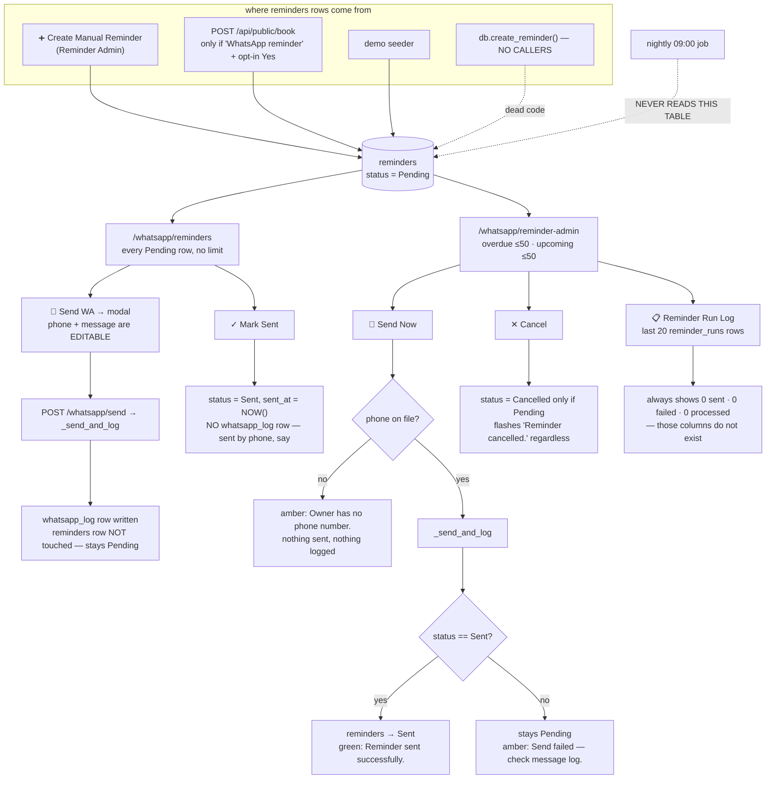

---

## Workflow 7 — Campaigns: message many clients at once

### 7.1 Who, when, why

**Who:** creating a campaign from the HTML form needs `super_admin`, `clinic_owner` or
`branch_manager` (`support_admin` is listed and blocked by the grant). **Start** and **Pause**
need the same. **Finish, Copy, Reset-failed and Schedule/Unschedule** need `super_admin`,
`clinic_owner` or `branch_manager`. **Listing, viewing, adding contacts, deleting contacts and
changing the delay** need only the module grant — so **a receptionist can bulk-load 500
recipients into a campaign and delete them again**, but not press Start.

**When:** Eid greetings, a price change, a rabies-vaccination drive, a new branch opening — any
message that goes to a list rather than a person.

**Why it is different from everything else in this chapter:** **campaigns live entirely inside
Wapilot.** This platform stores nothing about them. No table, no rows, no `whatsapp_log`
entries, no audit trail beyond the one row written when a campaign is created from the HTML
form. Every screen here is a live proxy — open the page, and the platform calls Wapilot; close
it, and the platform has forgotten. **KL-38.**

### 7.2 Preconditions

| # | Condition | If it is not met |
|---|---|---|
| 1 | WhatsApp connected | `campaigns_list()` calls `_client()` first → red flash and redirect to Settings |
| 2 | Wapilot reachable | The list renders with an amber banner (§ 7.4 A) |
| 3 | JavaScript enabled | Only **➕ New Campaign** works; every other control on every campaign screen is an `onclick` |

### 7.3 Happy path

1. **Control Center topbar → 📣 Campaigns / 📣 الحملات**, or `/whatsapp/campaigns`. Subtitle:
   *"Bulk WhatsApp messaging campaigns via Wapilot / حملات مراسلة واتساب جماعية عبر Wapilot"*.

2. **The list** calls `GET /campaigns` upstream and unwraps the response defensively — it
   accepts `{"data": [...]}`, `{"campaigns": [...]}` or a bare list. Each campaign renders as a
   card showing `ID: <id>`, a title (`name`, falling back to `default_message`, falling back to
   the literal `Campaign`), a status pill, and four counters — **Total / الإجمالي**,
   **Sent / أُرسلت**, **Failed / فشلت**, **Queued / في الطابور** — each with two accepted key
   spellings and a `0` fallback.

   | Upstream status | Pill |
   |---|---|
   | `active` | green |
   | `paused` | amber |
   | `finished` or `done` | grey |
   | `scheduled` | violet |
   | anything else | grey |

   Source: `D:/vet/platform/blueprints/whatsapp/routes.py:313-324`;
   `D:/vet/platform/templates/whatsapp/campaigns_list.html:42-82`

3. **Press ➕ New Campaign / ➕ حملة جديدة.**

4. **The form has exactly one field:** **Default Message / الرسالة الافتراضية**, a 5-row
   textarea with placeholder `Hello {name}, this is a message from {clinic}…` and the English
   help line *"This message will be sent to contacts that don't have an individual message set.
   You can also leave this empty and assign messages when adding contacts."*

   Below it, a yellow note: *"**ℹ️ Note: / ℹ️ ملاحظة:** The campaign will be created using your
   configured instance (**instance4042**). After creation, you'll be taken to the campaign page
   where you can add contacts and start sending."* — **`instance4042` is hardcoded into the
   template.** It is not your instance ID unless you happen to have named it that. **KL-7.**
   Source: `D:/vet/platform/templates/whatsapp/campaign_form.html:31-35`

5. **Press 🚀 Create Campaign / 🚀 إنشاء الحملة.** The route posts
   `{"instance_uns": [<your real instance id>], "default_message": "…"}` to `POST /campaigns` —
   so the *behaviour* is right even though the *note* is wrong.

6. **On success:** one `audit_log` row (`action='create'`, `entity_type='campaign'`,
   `details='Created campaign <id>: <first 60 chars of the message>'`, with the IP), green flash
   `Campaign created.`, and a redirect to `/whatsapp/campaigns/<id>` — **or**, if the response
   did not contain `data.id`, back to the campaigns list.

7. **The campaign detail screen.** Title **Campaign Details / تفاصيل الحملة**, subtitle
   `ID: <id>`. It fires three upstream calls on load — `campaign_messages`, `campaign_stats`,
   `get_delay` — and **discards all three error strings** (`data, _ = cli.campaign_messages(...)`).
   If Wapilot is down, the page renders as an empty campaign with zeroes and no explanation.
   **KL-39.**
   Source: `D:/vet/platform/blueprints/whatsapp/routes.py:356-377`

8. **Left column — 📊 Stats / 📊 الإحصائيات:** Total, ✅ Sent, ❌ Failed, ⏳ Queued, and when
   Total > 0 a green progress bar reading `<n>% delivered` (English only).
   **⏱ Delay Settings / ⏱ إعدادات التأخير** appears only if the delay call returned something:
   `Msg delay 3–8s`, `Sleep after 20–50 msgs`, `Sleep time 30–60s`.
   **🔧 Actions / 🔧 الإجراءات:** ▶ Start Campaign, ⏸ Pause, 📅 Schedule, 🗑 Unschedule,
   📋 Copy, ✅ Mark Finished, ↩ Reset Failed.

9. **Right column — three tabs:** `All Messages (48)` (English), **⏳ Queue / ⏳ الطابور**,
   **✅ Done / ✅ تم**. The Queue and Done tabs render *"Click Refresh to load. / اضغط تحديث
   للتحميل."* until you press their **🔄 Refresh / 🔄 تحديث**.

10. **Load the recipients: ➕ Add Contacts / ➕ إضافة جهات اتصال.** A modal with one monospace
    textarea and the instruction *"One per line: / واحد في كل سطر:* `phone_number|message text`
    *(message optional, uses campaign default) / (الرسالة اختيارية، تُستخدم رسالة الحملة
    الافتراضية)"*. Placeholder:

    ```
    201012345678|Hello {name}, your appointment is tomorrow
    201098765432
    ...
    ```

    Each non-blank line is split on the **first** `|`; everything after it is re-joined with
    `|` and used as that contact's `text`. Lines with no `|` get only `phone_number`, and
    Wapilot falls back to the campaign default. Press **Add Contacts / إضافة جهات اتصال** →
    `POST /whatsapp/api/campaigns/<cid>/messages` with `{"messages": [...]}` → toast
    `<n> contacts added`, the modal closes, and the All Messages tab reloads.
    Source: `D:/vet/platform/templates/whatsapp/campaign_detail.html:141-158`, `:367-384`

11. **Check the list.** The message table shows a select-all checkbox, **Phone / الهاتف**,
    **Message / الرسالة** (first 60 characters, full text on hover), **Status / الحالة** as a
    pill (`done`/`sent` → green **Sent / مُرسل**, `failed` → red **Failed / فشل**, anything else
    → amber, title-cased), and an **↩** retry button on failed rows only. A
    *"Filter by phone or text… / تصفية بالهاتف أو النص…"* box filters client-side, but it reads
    `data-text`, which the server-rendered rows populate with only the **first 80 characters**
    of each message — so searching for a word that appears late in a long message finds nothing.
    **KL-40.**
    Source: `D:/vet/platform/templates/whatsapp/campaign_detail.html:203-235`, `:338-344`

12. **Pace it: ⏱ Delay / ⏱ التأخير.** Opens the six-field modal, pre-loaded from the API with
    hardcoded fallbacks `3 / 8 / 20 / 50 / 30 / 60` if the call returns nothing. **Save / حفظ**
    PATCHes them. Toast `Delay updated`.

13. **Send it: ▶ Start / ▶ بدء.** Toast `start triggered`. **There is no confirm dialog on
    Start** — one click on the campaign detail screen begins messaging every contact in the
    list. **KL-41.**

14. **Watch it.** The campaign detail screen does **not** auto-refresh (unlike the control
    centre, which polls every 30 s). Press **🔄 Refresh** on the All Messages tab, or reload.
    Note the campaigns **list** page reloads itself 1.5 s after a successful action, while the
    **detail** page does not — so the same Start button behaves differently depending on which
    screen you pressed it from.
    Source: `D:/vet/platform/templates/whatsapp/campaigns_list.html:141`;
    `D:/vet/platform/templates/whatsapp/campaign_detail.html:258-264`

### 7.4 Every alternative scenario

**A. Wapilot is unreachable when you open the list.** The route passes the error through and the
page shows an amber banner: *"⚠️ Could not load campaigns from Wapilot: `<error>`"* followed by
*"Check your API token and instance ID in / تحقق من رمز API ومعرّف الحساب في
[Settings / الإعدادات](/whatsapp/settings)."* The empty state renders beneath it.
Source: `D:/vet/platform/templates/whatsapp/campaigns_list.html:35-40`

**B. Create failed upstream.** The form is **re-rendered with your text preserved**
(`form=f`) — better behaviour than the template form (§ 5.7) — with the red flash
`Failed to create campaign: <error>`. No audit row, no redirect.
Source: `D:/vet/platform/blueprints/whatsapp/routes.py:335-338`

**C. Create succeeded but Wapilot returned no id.** Green flash `Campaign created.` and a
redirect to the campaigns list rather than the detail page. Find it there.

**D. You want to schedule it rather than start it now.** **🕐 Schedule / 🕐 جدولة** on a list
card, or **📅 Schedule / 📅 الجدول** on the detail page. Both open a `datetime-local` picker and
POST `{"schedule_date": "2026-08-25T09:00"}` — the raw browser value, with its `T`, passed
through untouched to Wapilot. Empty → toast `Select a date/time first` (list) or
`Select date/time` (detail). Success → toast `Campaign scheduled` / `Scheduled`.
**🗑 Unschedule / 🗑 إلغاء الجدولة** (detail page only) asks `Remove schedule?` then DELETEs.
Source: `D:/vet/platform/templates/whatsapp/campaigns_list.html:151-162`;
`D:/vet/platform/templates/whatsapp/campaign_detail.html:389-407`

**E. Some contacts failed.** **↩ Reset / ↩ إعادة تعيين** on the list card, or **↩ Reset Failed /
↩ إعادة تعيين الفاشلة** on the detail page — both POST `reset-failed`, which asks Wapilot to
re-queue them. Individual rows also have their own **↩** retry, which calls
`POST /whatsapp/api/messages/<msg_id>/retry`. There is a **↩ Retry All Failed / ↩ إعادة محاولة
كل الفاشلة** button on the control centre's **📨 API Messages** tab that retries across the
whole instance, not one campaign.

**F. You want to run last month's campaign again.** **📋 Copy / 📋 نسخ** → toast
`copy triggered`. The copy appears in the list after a reload.

**G. You want to remove some recipients.** Tick their checkboxes, press **🗑 Delete Selected /
🗑 حذف المحدد**. No selection → toast `Select messages first`. Otherwise confirm
`Delete 12 message(s)?` → DELETE with `{"ids": [...]}` → toast `12 deleted` → the list reloads.

**H. You want to close a campaign off.** **✅ Mark Finished / ✅ تعليم كمنتهية** sends a
**PATCH** (not POST) to `/finish`. Toast `Marked as finished`.

**I. A receptionist opens a campaign.** She can read everything, add contacts, delete contacts,
retry a message and change the delay. She cannot start, pause, finish, copy, reset or schedule —
those six all redirect her to `/` with the permission flash, and the `fetch` receives HTML,
so **the toast never appears and nothing on screen tells her it was refused.** **KL-42.**

**J. You want the campaign's outcome in the client's file.** It is not there and cannot be.
Campaigns write nothing to `whatsapp_log`, so nothing reaches
`/crm/owners/<id>` → Communication History.

**K. You want to use a saved template as the campaign body.** No picker exists. Open
`/whatsapp/templates` in another tab and copy the text across.

### 7.5 Errors and edge cases — exact messages

| What you did | What the app does | Exact message |
|---|---|---|
| Opened `/whatsapp/campaigns` unconfigured | Red flash, redirect to Settings | `WhatsApp is not configured. Set the Wapilot API token and instance ID under WhatsApp → Settings, or via the WAPILOT_TOKEN / WAPILOT_INSTANCE environment variables.` |
| Opened it configured but with Wapilot down | Amber banner + empty state | `⚠️ Could not load campaigns from Wapilot: <error>` |
| Create failed upstream | Form re-rendered with your text | `Failed to create campaign: <error>` (red) |
| Create succeeded | Redirect to the campaign, or to the list if no id came back | `Campaign created.` (green) |
| Any JSON action succeeded | Toast (green) | `start triggered` · `pause triggered` · `copy triggered` · `reset-failed triggered` · `Marked as finished` · `Retried` · `Scheduled` · `Unscheduled` · `Delay updated` · `<n> deleted` · `<n> contacts added` |
| Any JSON action failed upstream | Toast (red) | `Error: <the upstream error string>` |
| Pressed Delete Selected with nothing ticked | Toast (red), no request | `Select messages first` |
| Pressed Add Contacts with an empty box | Toast (red), no request | `No contacts found` |
| Pressed Schedule with no date (list page) | Toast (red), no request | `Select a date/time first` |
| Pressed Schedule with no date (detail page) | Toast (red), no request | `Select date/time` |
| A role-gated action as `reception` | Redirect to `/` returned to `fetch`; **no toast at all** | *(silent)* |

Source: `D:/vet/platform/blueprints/whatsapp/routes.py:313-494`;
`D:/vet/platform/templates/whatsapp/campaigns_list.html:35-40`, `:117-162`;
`D:/vet/platform/templates/whatsapp/campaign_detail.html:242-437`

### 7.6 What gets written

**In this platform's database: one `audit_log` row, once, when a campaign is created through
the HTML form.** That is the entire footprint.

- `POST /whatsapp/api/campaigns` (the JSON create) writes **no** audit row — only the HTML form
  route does.
- Start, pause, finish, copy, reset-failed, schedule, unschedule, delay changes, contact adds
  and contact deletes write **nothing**.
- No campaign message ever reaches `whatsapp_log`.
- The control centre's **Messages Queued** tile is computed in the browser from a live API call
  and is not stored.

So: if a campaign goes out to the wrong list, this platform holds no record of who pressed
Start, when, or to whom it went. The record lives in the Wapilot dashboard.

Source: `D:/vet/platform/blueprints/whatsapp/routes.py:341-349`, `:389-398`, `:400-494`

### 7.7 Flowchart

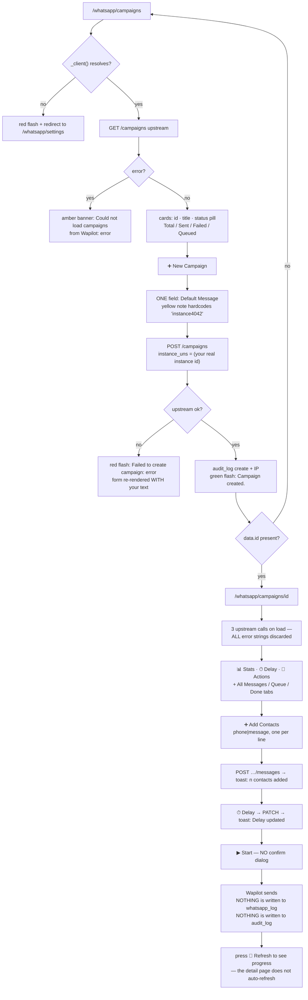

---

## Workflow 8 — The nightly 09:00 automatic reminder job

### 8.1 Who, when, why

**Who:** nobody. This is the one workflow in the chapter with no operator. It is started by
APScheduler inside the Flask process, runs as the pseudo-user `scheduler` with role `system`,
and finishes without telling anyone.

**When:** **every day at 09:00 server local time**, via
`CronTrigger(hour=9, minute=0)` registered with the job id `wa_reminders`.

**Why:** it is the clinic's entire automatic outreach — the reason a client turns up tomorrow,
the reason a booster does not lapse, the reason an unpaid bill gets chased without a phone call.

**What it sends, in one run, in this order:**

1. **Appointment reminders** — every appointment scheduled for **tomorrow**.
2. **Vaccine reminders** — every vaccination due **today or overdue by up to 7 days**.
3. **Overdue invoice alerts** — every `Unpaid` or `Partial` invoice due **3 or more days ago**.

Source: `D:/vet/platform/app.py:775-780`;
`D:/vet/platform/blueprints/whatsapp/scheduler.py:338-365`

### 8.2 How it is started, and the four guards around it

| Guard | What it does | Where |
|---|---|---|
| **One process only** | `_acquire_scheduler_lock()` takes an OS-level exclusive lock on `<backup_dir>/.scheduler.lock`. Every gunicorn worker calls `create_app()`; only the lock holder starts a scheduler. Without it, *"09:00 fires N concurrent backups and sends every WhatsApp reminder N times — a clinic's clients get the same message five times and blame the clinic."* The lock is an OS lock, not a PID file, so a crashed worker releases it automatically | `app.py:703-733` |
| **One run per clinic** | `_for_every_clinic("wa_reminders", lambda slug, row: run_reminder_jobs())` iterates `tenancy.each_clinic()`. One clinic raising does **not** stop the others — the loop catches per clinic and logs `wa_reminders failed for clinic <slug>`, then reports `wa_reminders: 3/20 clinics failed — cairo-maadi, giza-dokki, alex-smouha` | `app.py:735-780` |
| **One transport per run** | `run_reminder_jobs()` builds **one** `_Sender` and passes it to all three job functions, so the failure budget is shared: *"if the instance is down, the appointment job discovers it and the vaccine and invoice jobs do not each spend five more timeouts rediscovering the same thing."* It is passed as an argument, not held in a module global, deliberately: *"the globals in models.backup and models.tenancy are exactly how this codebase has ended up pointing at the wrong clinic before"* | `scheduler.py:77-91`, `:338-351` |
| **One reminder per entity per day** | `reminder_runs` carries `UNIQUE(run_type, entity_id, entity_type)`; `_already_sent()` gates on `DATE(run_at) = <local today>` | `scheduler.py:41-64` |

### 8.3 The clock

Both sides of the de-duplication gate now agree on **the clinic's local time**, and the module
carries a 20-line comment explaining why that matters:

> `_mark_sent` stored SQLite's `datetime('now')`, which is UTC, while the gate compared
> `DATE(run_at)` against Python's `date.today()`, which is local. Where those differ — anywhere
> far enough east at 09:00, and **Cairo between midnight and 03:00** — the gate could never
> match its own marker, so **EVERY client was re-reminded on EVERY run.**

The fix binds the timestamp from Python: `_run_stamp()` returns
`datetime.now().strftime("%Y-%m-%d %H:%M:%S")` and `_run_date()` returns
`date.today().isoformat()`. Both are local. This also makes the two database engines agree,
because `_fix_sql` rewrites `datetime('now')` to PostgreSQL's `NOW()`, which is evaluated in the
*server's* timezone rather than the clinic's.

The three queries reason in local dates throughout: tomorrow is `date.today() + 1`, the vaccine
window is `date.today() - 7 … date.today()`, the invoice cutoff is `date.today() - 3`.

Source: `D:/vet/platform/blueprints/whatsapp/scheduler.py:13-38`;
`D:/vet/platform/models/database.py:346-359`, `:640-663`

### 8.4 The three switches and the three message bodies

Before the run touches anything, each job asks whether it is switched on:

```python
def _enabled(conn, key) -> bool:
    """A reminder type is ON unless it was explicitly switched off."""
    return str(_wa_setting(conn, key, "1")).strip() not in ("0", "false", "no", "off")
```

So a fresh clinic with no `settings` rows at all has **all three reminder types ON**. Switching
one off logs `appointment reminders are switched off in Settings` and returns `0`.

| Setting key | Switch label on WhatsApp → Settings | Description shown |
|---|---|---|
| `reminder_appt_enabled` | `Appointment Reminders` | `Send reminders 24h before appointment` |
| `reminder_vaccine_enabled` | `Vaccine Due Reminders` | `Remind owners of upcoming vaccines` |
| `reminder_invoice_enabled` | `Invoice Overdue Alerts` | `Alert owners on unpaid invoices` |

> The vaccine description is wrong: the job selects vaccines **due today or already overdue by
> up to seven days**, never upcoming ones. The unrendered `reminder_settings.html` says it
> correctly — *"Due or overdue vaccines — up to 7 days past due"* — but nothing displays that
> file. **KL-43.**

The three message boxes are read by `_wa_setting()` and filled by `_render()`:

```python
def _render(template, fallback, **fields):
    text = (template or "").strip()
    if not text:
        return fallback
    try:
        return text.format(**fields)
    except (KeyError, IndexError, ValueError):
        logger.warning("reminder template has an unknown placeholder — "
                       "using the built-in wording instead")
        return fallback
```

**This is the only place in the entire product where a placeholder is actually substituted.**
Templates from `whatsapp_templates` are never rendered anywhere (KL-18); these three settings
strings are.

The module's own docstring records what it replaced: the three switches and the three boxes on
WhatsApp → Settings were **write-only** — *"Turning appointment reminders off did not stop them,
and editing the message changed nothing — the hardcoded English text below went out either way.
A switch that does nothing is worse than no switch, because somebody trusts it."*

| Setting key | Default seeded into the form | Fields available to `{}` |
|---|---|---|
| `reminder_appt_msg` | `Dear {owner}, {pet} has an appointment tomorrow ({date} at {time}).` | `owner`, `pet`, `date`, `time`, `type` |
| `reminder_vaccine_msg` | `Dear {owner}, {pet} is due for the {vaccine} vaccine (due: {date}).` | `owner`, `pet`, `vaccine`, `date` |
| `reminder_invoice_msg` | `Dear {owner}, Invoice #{invoice} ({amount}) was due on {date} and remains unpaid.` | `owner`, `invoice`, `amount`, `date`, `total` |

The help line above the boxes advertises seven placeholders —
`{owner} {pet} {date} {time} {vaccine} {invoice} {amount}` — as one undifferentiated list, but
each message only accepts its own set. Put `{pet}` in the invoice message and you get a
`KeyError`, which `_render` catches: the warning is logged and **the built-in English wording is
sent instead of yours, silently, to every client in that run**. The two fields that work but are
never advertised are `{type}` (appointment type) and `{total}` (the invoice's full value as
distinct from what is owed). **KL-44.**

Source: `D:/vet/platform/blueprints/whatsapp/scheduler.py:168-208`;
`D:/vet/platform/blueprints/whatsapp/routes.py:704-717`;
`D:/vet/platform/templates/whatsapp/wa_settings.html:43-47`;
`D:/vet/platform/templates/whatsapp/reminder_settings.html:23-27`

### 8.5 Job 1 — appointment reminders

**Query.** Every appointment where:

```sql
a.appt_date = <tomorrow>
AND a.status IN ('Scheduled','Confirmed')
AND o.whatsapp_phone IS NOT NULL AND o.whatsapp_phone != ''
```

joined `appointments → owners → pets` with **inner** joins, so an appointment with no pet row
is skipped entirely.

**Statuses that are excluded:** `Pending` (which is what the public website booking API writes),
`Completed`, `Cancelled`, `No Show`, and anything else. **A booking made through the clinic's
own website therefore never gets an automatic reminder**, because it lands as `Pending` — it
gets the separate `reminders` row instead, which nothing automatic ever sends (Workflow 6).
**KL-45.**
Source: `D:/vet/platform/blueprints/whatsapp/scheduler.py:217-226`;
`D:/vet/platform/blueprints/public_api/routes.py:215-221`

**Per appointment:** skip if `_already_sent("appt_reminder", a.id, "appointment")`; otherwise
build the message, send it, mark it, and count it.

**Built-in wording**, used when `reminder_appt_msg` is blank or malformed:

```
Dear Ahmed Hassan,
Reminder: Basbous has a Vaccination appointment tomorrow (2026-08-20 at 10:30).
Please arrive 10 minutes early. Reply CONFIRM to confirm.
```

`appt_start` falls back to the literal `TBD` when null.

> The built-in text says **"Reply CONFIRM to confirm"** and the seeded template
> `appointment_reminder` says **"Please confirm by replying YES"**. **Nothing anywhere in the
> platform reads an inbound WhatsApp message.** There is no webhook route, no inbound poller, no
> handler. A client who replies `CONFIRM` is talking to a number nobody is listening on, and
> their appointment stays `Scheduled`. **KL-46.**
> Source: `D:/vet/platform/blueprints/whatsapp/scheduler.py:236`;
> `D:/vet/platform/models/database.py:2462`; no inbound route exists in
> `D:/vet/platform/blueprints/whatsapp/routes.py`

**`template_name` written to the log:** `appt_reminder`.

Source: `D:/vet/platform/blueprints/whatsapp/scheduler.py:211-248`

### 8.6 Job 2 — vaccine reminders

**Query.** Every vaccination where:

```sql
v.next_due_at BETWEEN <today - 7 days> AND <today>
AND o.whatsapp_phone IS NOT NULL AND o.whatsapp_phone != ''
```

joined `vaccinations → pets → owners`.

So the window is **eight days wide and entirely in the past or present**: a vaccine due
tomorrow is not reminded; one that fell due today is; one eight days overdue has fallen out of
the window and will never be reminded again. Combined with the once-per-day-per-entity gate,
each vaccination gets **at most eight reminders**, one per day, unless somebody records the
booster and clears `next_due_at`.

**Built-in wording**, with the overdue variant chosen by `v.next_due_at < today`:

```
Dear Fatma El-Sayed,
OVERDUE: Loulou is overdue for the Rabies vaccine (due: 2026-08-15).
Please book an appointment at your earliest convenience.
```

and on the due-today path:

```
Dear Fatma El-Sayed,
Loulou is due for the Rabies vaccine (due: 2026-08-19).
Please book an appointment at your earliest convenience.
```

**`template_name` written to the log:** `vaccine_reminder`.

Source: `D:/vet/platform/blueprints/whatsapp/scheduler.py:251-289`

### 8.7 Job 3 — overdue invoice alerts

**Query.** Every invoice where:

```sql
inv.status IN ('Unpaid','Partial')
AND inv.due_date <= <today - 3 days>
AND o.whatsapp_phone IS NOT NULL AND o.whatsapp_phone != ''
```

**There is no lower bound.** An invoice that has been unpaid for two years is still selected,
every single day, for ever, until somebody marks it paid, voids it, or clears the owner's
WhatsApp number. Nothing escalates, nothing stops. **KL-47.**

**The amount quoted is what is still owed, not what was invoiced** — and the comment records
what that cost before it was fixed:

> This quoted `inv['total']`, so a client who had already paid most of a large invoice was
> chased for the whole amount — the clinic looked like it had lost the payment, and the client
> rang up to argue rather than to pay.

```python
owed = float(inv["due_amount"] if inv["due_amount"] is not None else inv["total"] or 0)
```

**Built-in wording:**

```
Dear Mohamed Abdel Rahman,
Invoice #INV-2026-00184 has 850.00 outstanding (due 2026-08-14).
Please contact us to settle your balance. Thank you.
```

Note the built-in text carries **no currency**. `{amount}` is formatted `%.2f` with no `EGP`
suffix, so a clinic that wants the currency shown has to type it into the message box on
Settings — as the shipped default does: `Invoice #{invoice} ({amount}) was due on {date} and
remains unpaid.` still has no currency either. **KL-48.**

**`template_name` written to the log:** `invoice_reminder`.

Source: `D:/vet/platform/blueprints/whatsapp/scheduler.py:292-335`

### 8.8 What one send does — the four possible statuses

`_send_whatsapp()` is the only writer. It has four outcomes and **writes a `whatsapp_log` row in
every one of them**:

| Precondition | `status` written | `error` written |
|---|---|---|
| `sender.client is None` — no token or no instance ID resolved | **`Not Configured`** | `WhatsApp is not connected — no API token is set. Connect it under WhatsApp → Settings.` (or `…no API instance ID is set…`) |
| `sender.gave_up` — five consecutive failures already happened in this run | **`Not Sent`** | `Skipped: 5 sends in a row failed, so the rest of this run was abandoned rather than left retrying a dead connection.` |
| The API call returned an error | **`Failed`** | the raw error string, e.g. `HTTP 401: Unauthorized` or `The read operation timed out` |
| The API call returned cleanly | **`Sent`** | `''` |

The `Not Configured` case also emits a Python warning:
`WhatsApp reminder NOT sent to 01001234567 (appt_reminder): WhatsApp is not connected — no API token is set. Connect it under WhatsApp → Settings.`

The fifth consecutive failure emits:
`WhatsApp run abandoned after 5 consecutive failures; last error: <last error>`

**The failure counter resets on any success**, so five *scattered* bad numbers across a hundred
good ones never trip the budget — only five bad ones **in a row** do. That is the distinction
the comment draws: *"Five failures is enough to tell 'this one number is bad' from 'the
transport is down'."*

**The `_Sender` is shared across all three jobs in a run**, so the budget is global to the run.
If appointments burn all five, vaccines and invoices are logged `Not Sent` without a single
network call being attempted.

Source: `D:/vet/platform/blueprints/whatsapp/scheduler.py:67-74`, `:127-165`

### 8.9 What gets written, per run

**`whatsapp_log` — one row per recipient attempted**, with:

| Column | Value |
|---|---|
| `owner_id` | the owner from the query |
| `phone` | `owners.whatsapp_phone`, **raw** (§ 0.7, KL-2) |
| `message` | the full message — **not truncated**, unlike every other writer, which caps at 500 characters |
| `template_name` | `appt_reminder` / `vaccine_reminder` / `invoice_reminder` |
| `status` | one of the four in § 8.8 |
| `error` | the reason, or `''` |
| `sent_at` | `datetime('now')` → local time on both engines |
| `http_status`, `response`, `reminder_id`, `pet_id` | **never set** |

**`reminder_runs` — one row per entity**, refreshed rather than duplicated:

```python
cur = conn.execute(
    "UPDATE reminder_runs SET status='sent', run_at=? "
    "WHERE run_type=? AND entity_id=? AND entity_type=?", …)
if not cur.rowcount:
    conn.execute("INSERT INTO reminder_runs(...) VALUES(?,?,?,'sent',?)", …)
```

The comment explains why an INSERT alone was wrong: *"An entity that stays eligible for several
days (an overdue invoice, a vaccine inside its 7-day window) therefore comes back tomorrow and a
plain INSERT would violate the key and abort the whole run."*

> **`_mark_sent` is called regardless of the send's outcome.** Look at the loop: `status =
> _send_whatsapp(...)` and then `_mark_sent(...)` unconditionally, on the very next line, before
> the `if status in ("Sent", "Pending")` counter. So a `Not Configured`, `Not Sent` or `Failed`
> send still lays down today's de-duplication mark, and **nothing will retry it today.** For
> appointment reminders that is permanent: tomorrow, tomorrow's appointment is today's, and it
> is no longer selected. A clinic whose WhatsApp was disconnected at 09:00 loses that day's
> appointment reminders outright, and the only sign is a column of `Not Configured` rows in a
> log nobody is prompted to open. **KL-49.**
> Source: `D:/vet/platform/blueprints/whatsapp/scheduler.py:242-247`, `:283-288`, `:329-334`

Also note the counter condition `if status in ("Sent", "Pending")`: `_send_whatsapp` never
returns `"Pending"` — its four outcomes are `Sent`, `Not Sent`, `Not Configured` and `Failed` —
so the `"Pending"` arm is dead.

**`audit_log` — exactly one row per run**, written after the transaction commits:

```
username=scheduler  role=system  action=reminder_run  module=whatsapp
entity_type=scheduler  details=appt=12 vaccine=3 invoice=7
```

Those three numbers count only sends whose status was `Sent`. A run that logged 40
`Not Configured` rows audits as `appt=0 vaccine=0 invoice=0`, which is truthful but easy to read
as "nothing to do".

**`notifications` — nothing.** A run that failed entirely notifies nobody. The bell stays quiet,
no manager is alerted, and the only trace is `whatsapp_log` and the Python log line
`Reminder run: 0 appt, 0 vaccine, 0 invoice reminders sent`. **KL-50.**

**Transaction shape:** all three jobs run inside `with conn:` and are followed by an explicit
`conn.commit()`; on any exception the error is logged (`run_reminder_jobs error: <e>`) and
re-raised so the per-clinic wrapper in `app.py` can record which clinic failed. `conn.close()`
runs in a `finally`.

Source: `D:/vet/platform/blueprints/whatsapp/scheduler.py:49-64`, `:161-164`, `:338-365`

### 8.10 Every alternative scenario

**A. The clinic has never connected WhatsApp.** Every recipient is logged `Not Configured` with
the reason. **Nothing is ever reported as `Sent`.** The message log shows a red
**⚠ Not sent — WhatsApp not connected / ⚠ لم تُرسل — واتساب غير متصل** badge on each, with the
full reason in the `title` attribute on hover. This is the state of the demo database today
(§ 0.1) — except that the demo has never even run the job, so there are no such rows.
Source: `D:/vet/platform/blueprints/whatsapp/scheduler.py:133-141`;
`D:/vet/platform/templates/whatsapp/message_log.html:91-94`

**B. Only the token is set, not the instance ID.** Same as A, with the reason naming the missing
half: `WhatsApp is not connected — no API instance ID is set. Connect it under WhatsApp →
Settings.` The `missing` variable is `"token" if not token else "instance ID"`.

**C. The instance is connected but the phone has been unlinked.** Wapilot returns an error per
send. The first five are logged `Failed`; from the sixth onwards everything in the run is
`Not Sent`, and the run finishes in well under two minutes rather than grinding for hours.

**D. One client's number is malformed among 200 good ones.** That one is logged `Failed`,
`sender.failures` goes to 1, the next success resets it to 0, and the run continues normally.

**E. An owner has a landline in `phone` but nothing in `whatsapp_phone`.** They are **not
selected at all** — all three queries require `whatsapp_phone IS NOT NULL AND != ''`. They are
also invisible: no screen anywhere lists clients who are missing a WhatsApp number.
**KL-51.**

**F. The same owner has an appointment tomorrow, an overdue vaccine and an overdue invoice.**
They receive **three separate messages** in the same run. Nothing batches per owner.
**KL-52.**

**G. The server was off at 09:00.** Nothing catches up. APScheduler's default
`misfire_grace_time` is not configured here, and there is no catch-up pass. That day's
appointment reminders are lost; the vaccine and invoice ones will be picked up tomorrow because
their windows are multi-day.

**H. Two clinics, one of them broken.** `_for_every_clinic` isolates them. Clinic 2 failing does
not stop clinic 3.

**I. The job is running when somebody presses Run Reminder Job Now.** Nothing prevents it. The
two runs share the database but not the `_Sender`, so each has its own five-failure budget. The
per-entity gate stops duplicate messages **unless** the two runs interleave between the
`_already_sent` check and the `_mark_sent` write, which is not locked. **KL-53.**

**J. You want to know what tomorrow's run will do before it happens.** `/whatsapp/scheduler`
shows three count tiles — but they do not match the job's own filters (Workflow 9, § 9.3).

### 8.11 Errors and edge cases

| Situation | Status written to `whatsapp_log` | Exact `error` text |
|---|---|---|
| No token saved and none in the environment | `Not Configured` | `WhatsApp is not connected — no API token is set. Connect it under WhatsApp → Settings.` |
| Token present, instance ID missing | `Not Configured` | `WhatsApp is not connected — no API instance ID is set. Connect it under WhatsApp → Settings.` |
| Sixth and later sends after five consecutive failures | `Not Sent` | `Skipped: 5 sends in a row failed, so the rest of this run was abandoned rather than left retrying a dead connection.` |
| Bad credentials | `Failed` | `HTTP 401: Unauthorized` |
| Wrong instance name | `Failed` | `HTTP 404: Not Found` |
| Host unreachable | `Failed` | `<urlopen error [Errno 11001] getaddrinfo failed>` |
| Slow host | `Failed` | `The read operation timed out` |
| Your custom message has a placeholder the job does not supply | *(no effect on status)* | the built-in English wording is sent instead; log line `reminder template has an unknown placeholder — using the built-in wording instead` |
| The whole run raised | *(nothing)* | Python log `run_reminder_jobs error: <e>`, re-raised; `app.py` logs `wa_reminders failed for clinic <slug>` |
| A reminder type is switched off | *(no rows at all for that type)* | Python log `appointment reminders are switched off in Settings` |

Source: `D:/vet/platform/blueprints/whatsapp/scheduler.py:120-124`, `:133-159`, `:204-208`,
`:213-215`, `:361-363`; `D:/vet/platform/app.py:744-758`

### 8.12 Flowchart

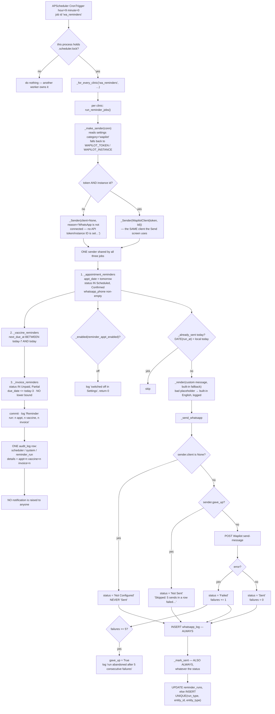

---

## Workflow 9 — Trigger the reminder job by hand

### 9.1 Who, when, why

**Who:** two different gates for two different buttons.
- **Reminder Admin → ▶ Run Reminder Job Now** — `super_admin`, `clinic_owner`,
  `branch_manager` (`support_admin` listed, blocked by the grant).
- **Scheduler → all five buttons** — **`@login_required` only**, so any of the four roles with
  the module grant, **including `reception`**.

**When:** after fixing a broken connection and wanting today's reminders to go out anyway; after
changing a message body and wanting to test it; while demonstrating the system.

**Why they are different screens:** they are not. `▶ Run Reminder Job Now` and
`🚀 Run All Jobs Now` call the same `run_reminder_jobs()`. The Scheduler screen just also lets
you run one type at a time — and, unlike the nightly job, **the three single-type buttons build
no shared `_Sender`**, so each one resolves its own transport and gets its own five-failure
budget (§ 9.5 C).

**Be clear about what "run now" means:** it sends **real WhatsApp messages to real clients**. The
Scheduler screen's own confirm dialog says so: `Run ALL reminder jobs now? This will send real
WhatsApp messages.` The Reminder Admin dialog does not: it just asks `Run the reminder job now?`

### 9.2 Preconditions

| # | Condition | If it is not met |
|---|---|---|
| 1 | JavaScript enabled | **The five Scheduler forms carry no CSRF field of their own** and rely on `platform.js` injecting one at submit. With JS off, every button returns the full-page 403 (KL-5). The Reminder Admin trigger form *does* carry a hidden token and works either way |
| 2 | The de-duplication gate has not already fired today | Entities already marked in `reminder_runs` for today are silently skipped — pressing the button twice sends nothing the second time |
| 3 | WhatsApp connected | The run completes "successfully" and logs `Not Configured` for every recipient. **The flash still says success** (§ 9.6) |

### 9.3 Happy path — the Scheduler screen

1. **Type `/whatsapp/scheduler`.** Nothing links here (§ 0.4). Title **WhatsApp Reminder
   Scheduler / مجدول تذكيرات واتساب**, subtitle *"Manual triggers, history & queue status /
   التشغيل اليدوي والسجل وحالة الطابور"*. Topbar: **← Control Center / ← مركز التحكم**.

2. **Three overview tiles.** Each is its own `COUNT(*)`, each wrapped in
   `try/except → 0`:

   | Tile | Query | Matches the job? |
   |---|---|---|
   | **📅 Tomorrow's Appointments / 📅 مواعيد الغد**, captioned *"owners with WhatsApp who have appointments tomorrow"* | `appt_date = tomorrow AND status IN ('Scheduled','Confirmed') AND whatsapp_phone IS NOT NULL AND != ''` | ✅ exactly |
   | **💉 Overdue Vaccines / 💉 تطعيمات متأخرة**, captioned *"pets with vaccine due or overdue (owner has WhatsApp)"* | `next_due_at <= today AND whatsapp_phone IS NOT NULL` | ❌ **no lower bound and no `!= ''` check** — counts every vaccine ever overdue, and counts owners whose column is an empty string. Almost always far higher than the job will send |
   | **🧾 Unpaid Invoices / 🧾 فواتير غير مدفوعة**, captioned *"owners with unpaid invoices and WhatsApp"* | `status IN ('Unpaid','Partial') AND whatsapp_phone IS NOT NULL` | ❌ **no `due_date` filter at all and no `!= ''` check** — counts invoices not yet due |

   **KL-54.** Treat these three numbers as a rough sense of scale, never as "this is what will
   be sent".
   Source: `D:/vet/platform/blueprints/whatsapp/routes.py:1035-1069`;
   `D:/vet/platform/blueprints/whatsapp/scheduler.py:224-226`, `:265-266`, `:304-306`

3. **⚡ Manual Trigger / ⚡ تشغيل يدوي** card, with the note *"Normally runs automatically at
   09:00 daily. Use these buttons to trigger right now. / تعمل تلقائياً الساعة 09:00 يومياً.
   استخدم هذه الأزرار للتشغيل الآن."* Five buttons, each its own POST form to
   `/whatsapp/scheduler/run` with a hidden `type`:

   | Button EN / AR | `type` | Confirm dialog |
   |---|---|---|
   | 🚀 Run All Jobs Now / 🚀 تشغيل كل المهام الآن | `all` | `Run ALL reminder jobs now? This will send real WhatsApp messages.` |
   | 📅 Appointment Reminders / 📅 تذكيرات المواعيد | `appt` | `Send appointment reminders now?` |
   | 💉 Vaccine Reminders / 💉 تذكيرات التطعيم | `vaccine` | `Send vaccine reminders now?` |
   | 🧾 Invoice Reminders / 🧾 تذكيرات الفواتير | `invoice` | `Send invoice reminders now?` |
   | 🗑 Clear Old History / 🗑 مسح السجل القديم (right-aligned) | *(posts to `/scheduler/clear-history`)* | `Clear history older than 30 days?` |

4. **Press one and confirm.**

5. **`scheduler_run()` dispatches:**
   - `all` → `run_reminder_jobs()` → green flash `All reminder jobs triggered successfully.`
   - `appt` → `n = _appointment_reminders(conn)` + `conn.commit()` → green flash
     `Appointment reminders sent: 12.`
   - `vaccine` → green flash `Vaccine reminders sent: 3.`
   - `invoice` → green flash `Invoice reminders sent: 7.`
   - anything else → amber `Unknown job type.`
   - any exception → red `Scheduler error: <exception>`
   - `finally: conn.close()`

6. **Redirect back to `/whatsapp/scheduler`.**

7. **📋 Reminder History / 📋 سجل التذكيرات** — the last **200** `reminder_runs` rows, newest
   first, in a five-column table: `#` (`id`), **Type / النوع** (a coloured job badge),
   **Entity / الكيان** rendered as `appointment #482`, **Status / الحالة** (always the literal
   `sent`), and **Sent At / أُرسلت في** (`run_at[:16]`).

   Empty state: *"No reminder history yet. Reminders run automatically at 09:00 daily, or trigger
   manually above."* (English only).

   The query LEFT JOINs `whatsapp_log` to pull `wa_status` and `wa_error` for each run —
   matching on `template_name = run_type AND sent_at >= run_at`, taking the earliest such row —
   and **the template renders neither column.** The join runs, costs a correlated subquery per
   row, and is discarded. If the join fails on the database engine in use, a bare `except`
   falls back to a plain `SELECT * FROM reminder_runs`. **KL-55.**
   Source: `D:/vet/platform/blueprints/whatsapp/routes.py:1005-1026`;
   `D:/vet/platform/templates/whatsapp/scheduler.html:112-137`

8. **A stats strip** above the history shows one tile per `run_type` present in the loaded
   history, captioned *"total sent (all time) / إجمالي المرسل (الإجمالي الكلي)"*.
   **It is not all time and it is not "sent".** It counts rows in the 200-row window, and a
   `reminder_runs` row exists for every entity the job *touched*, including ones logged
   `Not Configured` and `Failed`. **KL-56.**
   Source: `D:/vet/platform/blueprints/whatsapp/routes.py:1029-1033`;
   `D:/vet/platform/templates/whatsapp/scheduler.html:93-105`

Source: `D:/vet/platform/blueprints/whatsapp/routes.py:1001-1113`;
`D:/vet/platform/templates/whatsapp/scheduler.html:1-139`

### 9.4 Happy path — the Reminder Admin trigger

9. **`/whatsapp/reminder-admin` → topbar → ▶ Run Reminder Job Now / ▶ تشغيل مهمة التذكير
   الآن.** Confirm `Run the reminder job now?` — which does **not** warn that real messages will
   go out.

10. `reminder_trigger()` imports `run_reminder_jobs` inside the function and calls it:
    - success → green flash `Reminder job triggered successfully. Check the run log.`
    - exception → red flash `Reminder job failed: <exception>`

11. **Redirect to `/whatsapp/reminder-admin`**, where the **📋 Reminder Run Log** now has new
    rows — showing `0 sent · 0 failed · 0 processed` on every one of them (§ 6.5, KL-6).

Source: `D:/vet/platform/blueprints/whatsapp/routes.py:881-892`;
`D:/vet/platform/templates/whatsapp/reminder_admin.html:8-14`

### 9.5 Every alternative scenario

**A. You press it twice in a row.** The second press sends **nothing** — every entity is already
marked in `reminder_runs` for today — but the flash still reads
`All reminder jobs triggered successfully.` and the single-type flashes read
`Appointment reminders sent: 0.` Only the single-type buttons tell you the truth, and only by
their number.

**B. You want to force a re-send today.** There is no supported way. You would have to delete
the relevant `reminder_runs` rows by hand. **🗑 Clear Old History** deletes only rows older than
30 days, so it does not help.

**C. The three single-type buttons behave differently from Run All.** `scheduler_run` calls
`_appointment_reminders(conn)` **without a `sender` argument**, so `_send_whatsapp` calls
`_make_sender(conn)` **once per message** — a settings query per recipient — and every message
gets a brand-new `_Sender` with `failures = 0`. **The five-failure budget therefore never trips
on the single-type buttons.** A dead instance and 200 recipients means 200 sequential 15-second
timeouts: fifty minutes of a blocked request, and the browser will have given up long before.
The `Run All` path does not have this problem because `run_reminder_jobs()` builds the sender
once. **KL-57.**
Source: `D:/vet/platform/blueprints/whatsapp/routes.py:1088-1106` versus
`D:/vet/platform/blueprints/whatsapp/scheduler.py:130-131`, `:347-350`

**D. You pressed 🗑 Clear Old History.** It deletes `reminder_runs` rows older than 30 days,
using a cutoff bound as an ISO string. The route carries a long comment about why it is written
that way: `run_at < NOW() - INTERVAL '30 days'` made PostgreSQL compare text to a timestamp and
refuse, *"That failure ABORTED THE TRANSACTION, so the SQLite fallback in the except could not
run either — it died with 'current transaction is aborted' and the user was told 'Could not clear
history'. The fallback existed precisely for this case and was unreachable."*
Success → green flash `History cleared (entries older than 30 days removed).`
The fallback path (still present) flashes `History cleared.` and the final failure flashes
`Could not clear history: <exception>` in amber.
Source: `D:/vet/platform/blueprints/whatsapp/routes.py:1115-1148`

**E. You want to test a message change safely.** You cannot, from these screens — every trigger
sends to real clients. The nearest safe test is the Send Centre, sending to your own number
(Workflow 2), remembering that the Send Centre does **not** substitute placeholders while the
job does.

**F. `reception` presses 🚀 Run All Jobs Now.** It runs. Only the Reminder Admin trigger is
role-gated; the Scheduler screen's five buttons are not.

**G. The run takes longer than the web server's timeout.** Nothing here is asynchronous — the
HTTP request blocks until the last message is sent. With a healthy instance and Wapilot's own
queueing this is fast; with a sick one, see C.

### 9.6 Errors and edge cases — exact messages

| What you did | Screen | Exact message |
|---|---|---|
| 🚀 Run All Jobs Now, no exception | Scheduler | `All reminder jobs triggered successfully.` (green) — **regardless of how many were logged `Not Configured`** |
| 📅 Appointment Reminders | Scheduler | `Appointment reminders sent: <n>.` (green) |
| 💉 Vaccine Reminders | Scheduler | `Vaccine reminders sent: <n>.` (green) |
| 🧾 Invoice Reminders | Scheduler | `Invoice reminders sent: <n>.` (green) |
| Posted an unrecognised `type` | Scheduler | `Unknown job type.` (amber) |
| The run raised | Scheduler | `Scheduler error: <exception>` (red) |
| 🗑 Clear Old History succeeded | Scheduler | `History cleared (entries older than 30 days removed).` (green) |
| 🗑 Clear Old History fell back | Scheduler | `History cleared.` (green) |
| 🗑 Clear Old History failed twice | Scheduler | `Could not clear history: <exception>` (amber) |
| ▶ Run Reminder Job Now, no exception | Reminder Admin | `Reminder job triggered successfully. Check the run log.` (green) |
| ▶ Run Reminder Job Now raised | Reminder Admin | `Reminder job failed: <exception>` (red) |
| Any Scheduler button with JavaScript off | Scheduler | full-page 403 `Invalid or missing security token. Please go back and try again.` |
| ▶ Run Reminder Job Now as `reception` or `support_admin` | Reminder Admin | `You don't have permission to access this page.` (red), redirect to `/` |

**The success flashes are the weakest part of this workflow.** *"All reminder jobs triggered
successfully."* is true of the *job*, not of the *messages*: a completely disconnected clinic
gets that green flash while writing `Not Configured` for every client. The only way to know what
happened is `/whatsapp/log`. **KL-58.**

Source: `D:/vet/platform/blueprints/whatsapp/routes.py:1085-1113`, `:1128-1146`, `:886-890`

### 9.7 Flowchart

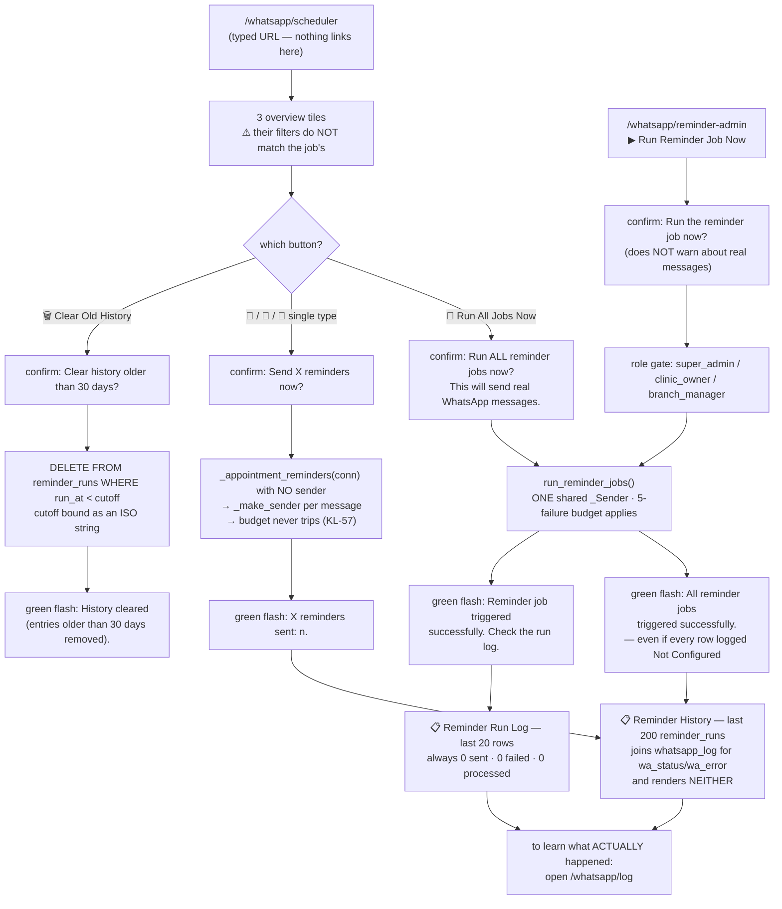

---

## Workflow 10 — Read the message log and work out what went wrong

### 10.1 Who, when, why

**Who:** anyone with the module grant — `super_admin`, `clinic_owner`, `branch_manager`,
`reception`.

**When:** a client says *"you never told me about the appointment"*; the nightly job flashed
green and you want to know whether anything actually left; a bill was "sent" and the client
denies it.

**Why:** this is the **only** record in the product of what the platform tried to send. There is
no other. `reminder_runs` records that an entity was processed, not what happened;
`audit_log` records one line per run; campaigns record nothing.

**Where:** Control Center → **📜 Message Log** tab → **View All Logs → / عرض كل السجلات ←**, or
the Templates / Pending Reminders topbars, or `/whatsapp/log`.

### 10.2 What the screen shows

**The query is fixed and has no parameters:**

```sql
SELECT wl.*, o.full_name AS owner_name
FROM whatsapp_log wl
LEFT JOIN owners o ON wl.owner_id = o.id
ORDER BY wl.sent_at DESC
LIMIT 200
```

**No filter, no search box, no date range, no status filter, no pagination, no export.** A busy
clinic sending 60 reminders a night sees the last three days and nothing before that. To answer
*"did we message Ahmed Hassan in June?"* you have to query the database directly. **KL-59.**

Source: `D:/vet/platform/blueprints/whatsapp/routes.py:678-695`

**A four-tile stats bar** across the top, computed in Jinja over **the 200 rows shown**, not
over the table:

| Tile | Computation |
|---|---|
| **Total Shown / إجمالي المعروض** | `logs\|length` |
| **Sent / مُرسل** | rows whose `status` is exactly `Sent` |
| **Failed / فشل** | rows whose `status` is exactly `Failed` |
| **Pending / قيد الانتظار** | rows whose `status` is exactly `Pending` |

**Rows with status `Not Configured` or `Not Sent` — the two the nightly job writes when it
cannot send — are counted in none of the three coloured tiles.** A night on which 40 reminders
were never transmitted shows `40 / 0 / 0 / 0`. **KL-60.**
Source: `D:/vet/platform/templates/whatsapp/message_log.html:36-56`

**Six columns:**

| Column EN / AR | Content |
|---|---|
| Date / Time — التاريخ / الوقت | `sent_at[:16]`, e.g. `2026-08-19 21:04` |
| Owner / المالك | `owners.full_name`, or `—` when `owner_id` is `NULL` |
| Phone / الهاتف | monospace, as stored |
| Message / الرسالة | one line, ellipsised at the column width, full text in the `title` on hover |
| Template / القالب | an indigo monospace chip with `template_name`, or the grey word **custom / مخصص** when empty |
| Status / الحالة | see below |

**The status column, in the order the template tests it:**

| Stored `status` | Rendered |
|---|---|
| `Not Configured` | **red** badge `⚠ Not sent — WhatsApp not connected / ⚠ لم تُرسل — واتساب غير متصل`, with the full reason in the `title` attribute |
| `Sent` | **green** badge `✓ Sent / ✓ أُرسلت` |
| `Failed` | **red** badge `✗ Failed / ✗ فشلت`, and beneath it, if `error` is set, a small red line showing `error[:40]` followed by `…` |
| **anything else** — including `Not Sent` and `Pending` | **amber** badge `⏳ Pending / ⏳ قيد الانتظار` |

> The last row matters. A message the nightly job **abandoned** after the five-failure budget
> tripped is stored as `Not Sent` and rendered as **⏳ Pending** — amber, the same as a message
> genuinely waiting. It is not pending; it will never be retried. **KL-61.**
> Source: `D:/vet/platform/templates/whatsapp/message_log.html:90-104`;
> `D:/vet/platform/blueprints/whatsapp/scheduler.py:142-146`

The Failed error line renders `error[:40]` with a `…` appended **unconditionally**, so a short
complete error still gains a trailing ellipsis — `HTTP 401: Unauthorized…` — and a long one is
cut at 40 characters with no way to tell the two cases apart. Hover the line for the whole
string.

**Empty state:** a green 💬, *"No messages sent yet / لم تُرسل رسائل بعد"*, *"Messages sent via
WhatsApp will appear here. / ستظهر هنا الرسائل المرسلة عبر واتساب."*, and a
**🔔 View Pending Reminders / 🔔 عرض التذكيرات المعلقة** button.

Source: `D:/vet/platform/templates/whatsapp/message_log.html:1-119`

### 10.3 Happy path — diagnosing a specific complaint

1. **Open `/whatsapp/log`.**
2. **Find the row.** Scan the Date/Time and Owner columns. With no search, `Ctrl+F` in the
   browser is your filter — and it only searches the ellipsised text, not the `title`
   attributes, so search on the phone number or the owner's name rather than on message text.
3. **Read the Status badge.**

   | Badge | What it means | What to do |
   |---|---|---|
   | green `✓ Sent` | Wapilot accepted it. **This is not delivery confirmation** — the platform never asks Wapilot whether it arrived | Check the client's phone; check the control centre's **📨 API Messages** tab for the upstream state |
   | red `✗ Failed` | Wapilot rejected it or was unreachable. Hover the small red line for the error | § 10.4 |
   | red `⚠ Not sent — WhatsApp not connected` | No token or no instance ID was resolvable at send time | Workflow 1 |
   | amber `⏳ Pending` on a job-written row | Almost certainly `Not Sent` — the run abandoned itself | Look for five consecutive `Failed` rows just above it; fix the transport, then Workflow 9 |

4. **Read the Template chip** to learn which path produced the row:

   | Chip | Path |
   |---|---|
   | `appt_reminder`, `vaccine_reminder`, `invoice_reminder` | the nightly job or a Scheduler button |
   | `invoice_whatsapp` | the invoice screen's **📱 Send WhatsApp** |
   | a bare number like `3` | the Send Centre with a template clicked (KL-16) |
   | `appointment_reminder` and friends | the demo seeder, or `/whatsapp/send` with a `template_id` |
   | **custom / مخصص** | the Send Centre with free text, or the Pending Reminders modal |

5. **Cross-check the owner.** If the Owner column shows `—`, the row has `owner_id = NULL` and
   came from the Send Centre. If it shows a name, the same row is also on that client's
   Communication History at `/crm/owners/<id>` (§ 4.5).

### 10.4 Reading the errors

The `error` column is written verbatim from `WapilotClient`. The common ones:

| Error text | Meaning | Fix |
|---|---|---|
| `HTTP 401: Unauthorized` | the API token is wrong or revoked | Workflow 1, re-paste the token |
| `HTTP 403: Forbidden` | the token is valid but not for this instance | check the instance ID |
| `HTTP 404: Not Found` | the instance name does not exist upstream | check the instance ID |
| `HTTP 422: Unprocessable Entity` | Wapilot rejected the payload — most often a malformed `chat_id` | § 0.7, KL-2/KL-3 |
| `HTTP 429: Too Many Requests` | you are over the rate limit | Queue Settings, § 1.5 |
| `The read operation timed out` | Wapilot took longer than 15 s | retry; if persistent, check the instance |
| `<urlopen error [Errno 11001] getaddrinfo failed>` | DNS failure on the server | networking, not WhatsApp |
| `<urlopen error [Errno 111] Connection refused>` | outbound 443 blocked | firewall |
| `WhatsApp is not connected — no API token is set. Connect it under WhatsApp → Settings.` | written by the job, not by the API | Workflow 1 |
| `Skipped: 5 sends in a row failed, so the rest of this run was abandoned rather than left retrying a dead connection.` | the failure budget tripped earlier in the same run | fix the cause of the five failures above it, then re-run |

Source: `D:/vet/platform/blueprints/whatsapp/wapilot.py:49-57`;
`D:/vet/platform/blueprints/whatsapp/scheduler.py:120-146`

### 10.5 The other two places to look

**The control centre's recent log.** `/whatsapp/control` → **📜 Message Log / 📜 سجل الرسائل**
tab shows the **last 10** rows in a five-column table (Time, Owner, Phone, Message, Status) with
its own simplified status rendering: `Sent` → green, `Failed` → red, **everything else → an
amber badge showing the raw status string**. So `Not Configured` appears there as an amber pill
literally reading `Not Configured`, which is clearer than the full log's treatment of
`Not Sent`.
Source: `D:/vet/platform/templates/whatsapp/control_center.html:204-242`

**The upstream message list.** `/whatsapp/control` → **📨 API Messages / 📨 رسائل API** tab →
**🔄 Refresh / 🔄 تحديث** calls `GET /whatsapp/api/messages`, which forwards **every**
query-string parameter it received as an upstream filter. The table shows ID, Phone, Text (60
chars), Status, and an **↩** retry button on `failed` rows. It renders **the first 50** and adds
`Showing 50 of 240 messages.` beneath. `done`/`sent` → green, `failed` → red, anything else →
amber. The **Messages Queued** tile is updated from this response by counting `queued` +
`pending`.

**↩ Retry All Failed / ↩ إعادة محاولة كل الفاشلة** posts an empty JSON body to
`/whatsapp/api/messages/retry-all` — so it retries **everything the upstream considers
retryable**, with no filter, across the whole instance and all campaigns. Toast
`Retry-all triggered`. There is **no confirm dialog**.

> Both this table and the campaign detail message table are built by string-concatenating
> upstream values into `innerHTML` with no escaping. A message body containing HTML is rendered
> as HTML. The `title` attributes get a single `.replace(/"/g,"'")` and nothing else.
> **KL-62.**
> Source: `D:/vet/platform/templates/whatsapp/control_center.html:409-429`;
> `D:/vet/platform/templates/whatsapp/campaign_detail.html:314-336`

Source: `D:/vet/platform/blueprints/whatsapp/routes.py:198-229`;
`D:/vet/platform/templates/whatsapp/control_center.html:244-253`, `:398-451`

### 10.6 Every alternative scenario

**A. The row is not in the log at all.** Six things send without logging: the three media
endpoints, every campaign message, the invoice button when WhatsApp is unconfigured, and
anything that never got as far as `_send_and_log`. Check § 4.5 before concluding nothing was
sent.

**B. You need older than 200 rows.** Not available in the UI. Query `whatsapp_log` directly.

**C. You need to know whether it was *delivered*, not merely accepted.** The platform never
asks. `whatsapp_log.status='Sent'` means the HTTP call returned without an error. Delivery state
lives upstream — the **📨 API Messages** tab is the closest you get.

**D. You want the log for one client.** `/crm/owners/<id>` → **💬 Communication History** shows
that client's last 20 `whatsapp_log` rows — but merged with their `reminders` rows and with the
status column dropped (§ 4.4).

**E. Two rows for the same message.** Someone pressed twice, or a manual run and the nightly run
both fired. Nothing de-duplicates on the manual paths.

**F. `sent_at` looks like it is in the wrong timezone.** It should not be. Both writers land on
local time on both engines — `NOW()` on PostgreSQL, and `datetime('now','localtime')` after
`_fix_sql_sqlite` rewrites it on SQLite (§ 8.3).

### 10.7 What gets written

**Nothing.** `/whatsapp/log` is read-only. There is no delete, no archive, no retention job, and
no export. `whatsapp_log` grows for ever.

### 10.8 Flowchart

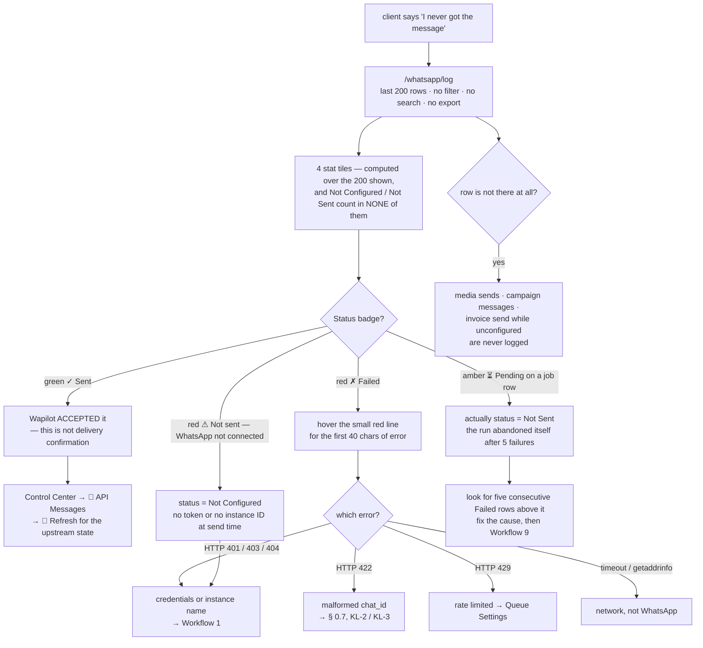

---

## Workflow 11 — The notification bell

### 11.1 Who, when, why

**Who:** every signed-in user. `/notifications/` carries only `@login_required`, and the
`notifications` blueprint has **no permission key** in `ALL_PERMISSIONS`, so
`_permission_for("notifications")` returns `""` and the module gate falls open by design —
*"launcher, auth, uploads, notifications: nothing to grant"*.

**When:** whenever the badge in the sidebar is non-zero.

**Why it is in this chapter:** because it is the platform's *other* communication channel — the
one that talks to staff rather than clients — and because **the WhatsApp module never uses it.**

Source: `D:/vet/platform/blueprints/notifications/routes.py:9-15`;
`D:/vet/platform/blueprints/auth/routes.py:115-125`;
`D:/vet/platform/models/database.py:4302-4331`

### 11.2 The screen

1. **Sidebar → PLATFORM / المنصة → Notifications / الإشعارات.** The link carries an unread badge
   rendered from `unread_count`, which the context processor computes on **every page render**
   with `SELECT COUNT(*) FROM notifications WHERE recipient_id=? AND is_read=0`. Above 99 it
   shows `99+`.
   Source: `D:/vet/platform/templates/base.html:267-274`; `D:/vet/platform/app.py:400-405`

2. **`/notifications/` lists the last 50** rows for **your user id**, newest first. Title
   **Notifications / الإشعارات**; subtitle `Your in-app alerts and messages` — **English only**.

3. **Each row** shows the icon (default 🔔), the title in bold when unread and medium when read,
   the raw `created_at` string, a green `New` pill while unread, the body in grey, a
   **View →** link when `link` is set, and a **Read** button while unread. Read rows are dimmed
   to 75% opacity on the alternate background.
   Both `New` and `Read` are **English only**.

4. **Press Read.** `fetch('/notifications/mark-read/<id>', {method:'POST'})` with the CSRF header
   inlined from the template. On `{"ok": true}` the row dims client-side, the badge and the
   button are removed, and the JS decrements the sidebar count by finding
   `a[href*="notifications"] span[style*="background"]`.

5. **Press Mark All Read** (topbar, shown only when there is at least one notification). It is a
   real POST form with a hidden CSRF token, and it redirects to `request.referrer` — so pressing
   it from the notifications page returns you there, and pressing it from anywhere else returns
   you to wherever you were.

Both mark-read routes scope the UPDATE to `recipient_id = <your id>`, so you cannot mark someone
else's notification read by guessing an id.

Source: `D:/vet/platform/blueprints/notifications/routes.py:18-38`;
`D:/vet/platform/models/database.py:4192-4200`;
`D:/vet/platform/templates/notifications/index.html:1-80`

### 11.3 What actually writes notifications

`notify_managers(title, body, icon, link, module)` fans a notification out to every user holding
`super_admin`, `clinic_owner`, `branch_manager` or `hr`.

**The WhatsApp module calls it zero times.** Nothing in
`blueprints/whatsapp/` — not `routes.py`, not `scheduler.py` — raises a notification for any
reason. A nightly run that logged `Not Configured` for 60 clients is invisible to every manager
in the product. The nightly **backup** job, by contrast, does notify on failure
(`Backup Failed — <clinic>`). **KL-50.**

Source: `D:/vet/platform/models/database.py:4167-4171`; `D:/vet/platform/app.py:765-769`; no
`notify_*` call exists under `D:/vet/platform/blueprints/whatsapp/`

### 11.4 Every alternative scenario

**A. The badge says 3 but the page is empty.** The badge counts unread rows for your `user.id`;
the page lists the last 50 rows for the same id. They cannot disagree unless you have more than
50 notifications and the unread ones are older than the newest 50.

**B. You want notifications by role rather than by user.** `notifications.recipient_role` is
stored and **never queried** — both read paths filter on `recipient_id` alone.

**C. You want a live badge without reloading.** `GET /notifications/api/unread` returns
`{"count": n, "items": [...]}` and **no template or script in this repository calls it.** The
badge only updates on a full page render. **KL-63.**
Source: `D:/vet/platform/blueprints/notifications/routes.py:31-38`

**D. You want to delete a notification.** No route exists. `is_read=1` is as far as it goes.

**E. You want WhatsApp failures to reach you here.** They do not, and there is no setting that
makes them. The only place a failed send is visible is `/whatsapp/log`.

### 11.5 Errors and edge cases

| What you did | What the app does | Exact message |
|---|---|---|
| Opened `/notifications/` not signed in | Redirect to login with `?next=/notifications/` | `Please log in to continue.` (amber) |
| Pressed **Read** on an id belonging to someone else | UPDATE matches nothing; JSON still says success | `{"ok": true}` — the row does not change |
| Pressed **Mark All Read** | Redirect to `request.referrer`, or to `/notifications/` if there is none | *(no flash at all)* |
| Posted either route with no CSRF | Full-page 403 | `Invalid or missing security token. Please go back and try again.` |
| No notifications | Empty state | `All caught up!` / `No notifications to show.` (English only) |

### 11.6 Flowchart

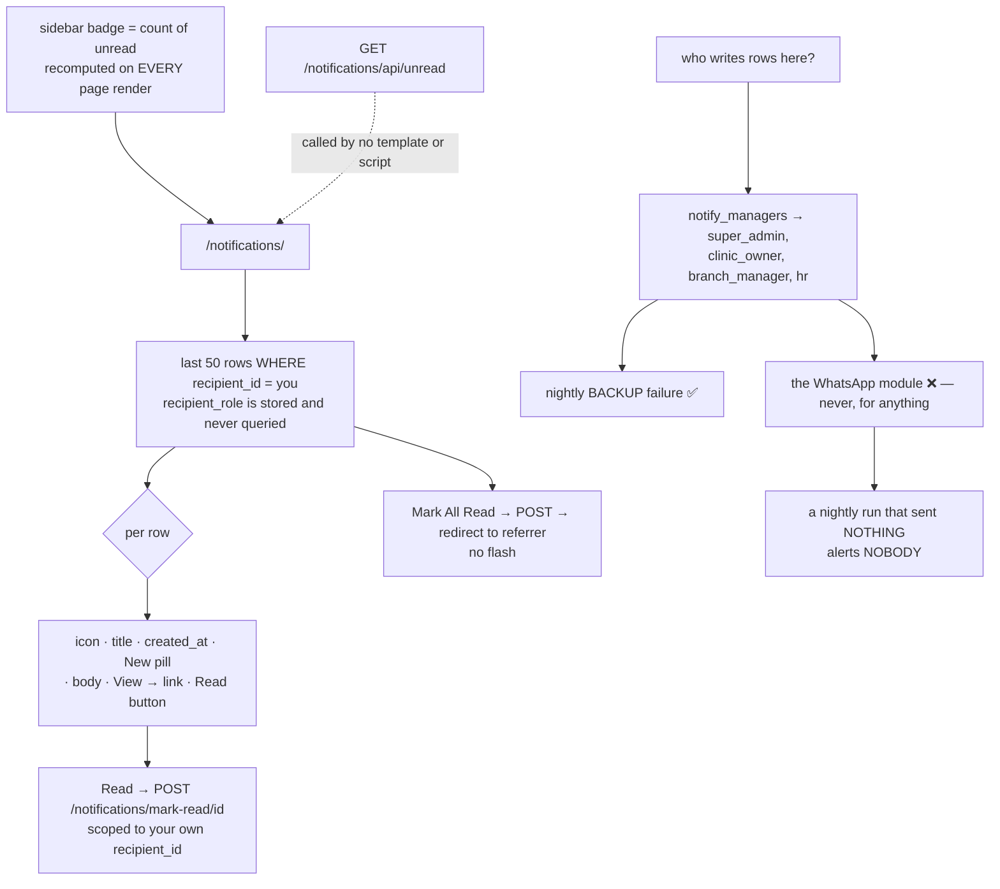

---

## Known limits

Everything below is a real behaviour of the code as it stands today. None of it is described
above as if it worked. Do not train staff on the version you wish existed.

**KL-0 — nothing has ever been sent end to end.** No Wapilot instance has ever been connected on
the demo database: `settings` has zero rows in the `wapilot` and `whatsapp` categories,
`reminder_runs` is empty, and all 109 `whatsapp_log` rows were fabricated by `seed_comms()` with
a randomly chosen status and a hardcoded `http_status = 200`. Everything in this chapter is read
from source and exercised only against a stubbed transport. **The one thing that has never been
verified is a message arriving on a phone.**
`D:/vet/platform/scripts/seed/demo_showcase.py:1332-1347`; `data/demo.db`

**KL-1 — every outbound message is English-only, with the brand hardcoded.** The three built-in
reminder bodies, the invoice summary (including `🐾 *Aleefy*` and `Happy Pets, Healthy Lives`)
and five of the six seeded templates are hardcoded English. `t()` is never called in the send
path, and the clinic identity configured under System → Branding is ignored. An Arabic-first
clinic trading under another name sends the wrong text in the wrong language.
`D:/vet/platform/blueprints/whatsapp/scheduler.py:232-237`, `:274-279`, `:319-324`;
`D:/vet/platform/blueprints/finance/routes.py:717-734`;
`D:/vet/platform/models/database.py:2460-2473`

**KL-2 — the nightly job sends a bare phone where every manual path sends a chat id.**
`_send_and_log` and the four Send Centre routes all build
`phone if "@" in phone else f"{phone.lstrip('+')}@c.us"`. `_send_whatsapp` — used by the 09:00
job and by all four Scheduler buttons — passes `str(phone or "").strip()` straight through,
under a comment that says the opposite.
`D:/vet/platform/blueprints/whatsapp/scheduler.py:148-149` versus
`D:/vet/platform/blueprints/whatsapp/routes.py:56`, `:248`, `:275`, `:288`, `:301`

**KL-3 — no phone number is ever normalised.** An Egyptian mobile stored as `01001234567`
becomes chat id `01001234567@c.us`, not `201001234567@c.us`. The only code in the product that
knows about the `0` → `2` conversion is two `wa.me` deep links in the visits module, which do
not use this transport.
`D:/vet/platform/templates/visits/exam.html:1803-1804`, `:2120`

**KL-4 — both chat-id lookup endpoints build a doubled path.** `BASE_URL` already ends in
`/api/v2`, and `get_chat_id_by_lid` / `get_lid_by_phone` prefix `/api/v2/` again, producing
`https://api.wapilot.net/api/v2/api/v2/<instance>/lids/…`. The Send Centre's **🔍 Phone Lookup**
box is therefore permanently broken.
`D:/vet/platform/blueprints/whatsapp/wapilot.py:11`, `:31`, `:247-251`

**KL-5 — the five forms on `/whatsapp/scheduler` carry no CSRF field.** All four manual triggers
and **🗑 Clear Old History** rely entirely on `platform.js` injecting `_csrf_token` at submit
time. With JavaScript disabled, every one returns the full-page 403.
`D:/vet/platform/templates/whatsapp/scheduler.html:55-88`;
`D:/vet/platform/static/js/platform.js:129-146`

**KL-6 — the Reminder Run Log always shows `0 sent · 0 failed · 0 processed`.**
`reminder_admin.html` renders `run.sent_count`, `run.failed_count` and `run.total_processed`;
`reminder_runs` has none of those columns (`id, run_type, entity_id, entity_type, status,
run_at`). Jinja resolves each to `Undefined` and `or 0` prints `0`. The table is also one row
per **entity**, not per run, so a night's twelve appointment reminders render as twelve
identical lines.
`D:/vet/platform/models/database.py:2164-2172`;
`D:/vet/platform/templates/whatsapp/reminder_admin.html:192-204`

**KL-7 — the campaign form hardcodes `instance4042`.** The yellow note tells you the campaign
will be created *"using your configured instance (**instance4042**)"* whatever your instance is
actually called. The route sends the real id, so only the note is wrong.
`D:/vet/platform/templates/whatsapp/campaign_form.html:31-35`

**KL-8 — 🔍 Test Connection tests the saved settings, not the boxes.** It calls
`/whatsapp/api/instance/status`, which reads the database. Before your first save it tests
nothing; after an edit it tests the previous values.
`D:/vet/platform/templates/whatsapp/wa_settings.html:81-99`

**KL-9 — you cannot clear the token or instance ID from the settings form.** The POST branch
guards each `wapilot` key with `if val:`, so blanking a field and saving leaves the old value.
`D:/vet/platform/blueprints/whatsapp/routes.py:721-731`

**KL-10 — ↩ Logout has no confirmation and no audit trail.** One click disconnects the clinic's
WhatsApp for everybody, and nothing anywhere records who did it or when.
`D:/vet/platform/templates/whatsapp/control_center.html:142`;
`D:/vet/platform/blueprints/whatsapp/routes.py:168-173`

**KL-11 — the settings audit row has no IP.** `log_audit` is called without `ip=`, unlike the
template and campaign audit calls which pass `request.remote_addr`. Changing the clinic's
WhatsApp credentials is the most sensitive action in the module and the least traceable.
`D:/vet/platform/blueprints/whatsapp/routes.py:744-750` versus `:532-539`, `:341-348`

**KL-12 — the Send Centre does not work without JavaScript.** There is no `<form>` on the page;
all four send buttons are `onclick` handlers calling `fetch()`.
`D:/vet/platform/templates/whatsapp/send_center.html:80`, `:168`, `:183`, `:198`

**KL-13 — `templates/whatsapp/reminder_settings.html` is orphaned.** A complete 108-line screen
with ON/OFF toggle switches, per-type description cards and the same six settings fields — and
**no route renders it.** `whatsapp.reminder_settings` is a 302 to `/whatsapp/settings`. The
sidebar's **Reminder Settings** link therefore lands on the plain checkbox form, and the nicer
screen has been unreachable since the alias was added.
`D:/vet/platform/blueprints/whatsapp/routes.py:773-780`;
`D:/vet/platform/templates/whatsapp/reminder_settings.html`

**KL-14 — `POST /whatsapp/reminders/<id>/send` is unreachable.** A complete JSON send route that
also flips the reminder to `Sent` on success, and **no template posts to it.** The Reminders
list uses the modal → `/whatsapp/send` instead, which is why sending from that list leaves the
reminder `Pending` (KL-31).
`D:/vet/platform/blueprints/whatsapp/routes.py:632-659`; no
`url_for('whatsapp.reminder_send')` exists under `D:/vet/platform/templates/`

**KL-15 — clicking a template in the Send Centre mangles it.** The `onclick` argument is built
with `| replace("'","") | truncate(200)`, so **every apostrophe is stripped** (`it's` becomes
`its`) and anything past roughly 200 characters is cut and replaced with `...`. The card preview
shows the full, correct text, so the damage is invisible until you read the textarea.
`D:/vet/platform/templates/whatsapp/send_center.html:217`

**KL-16 — the Send Centre logs the numeric template id in `template_name`.** `sendText()` posts
`template_name: selectedTemplateId||''`, so the Message Log's Template chip shows `3` rather
than `appointment_reminder`.
`D:/vet/platform/templates/whatsapp/send_center.html:289`

**KL-17 — image, file and video sends are never logged.** All three routes call Wapilot and
return the result without touching `whatsapp_log`. A media send leaves no trace anywhere in the
platform — not the log, not the client record, not the audit trail.
`D:/vet/platform/blueprints/whatsapp/routes.py:270-310`

**KL-18 — template placeholders are never substituted.** Nothing in any send path calls
`.format()` on a `whatsapp_templates.template_text`. All six seeded templates are full of
`{owner_name}`, `{pet_name}`, `{clinic_name}`, `{vaccine_name}` and `{invoice_number}`, and all
six send the braces to the client. The **only** substitution in the product is `_render()` in
the scheduler, which serves the three reminder-message settings and nothing else.
`D:/vet/platform/blueprints/whatsapp/routes.py:244-268`, `:964-993`;
`D:/vet/platform/models/database.py:2460-2473`;
`D:/vet/platform/blueprints/whatsapp/scheduler.py:193-208`

**KL-19 — a Send Centre message never reaches the client's record.** `api_send_text` takes
`owner_id` from the request body and the Send Centre's JS never sends one, so the row is written
with `owner_id = NULL` and cannot join to `/crm/owners/<id>` → Communication History.
`D:/vet/platform/blueprints/whatsapp/routes.py:255-263`;
`D:/vet/platform/templates/whatsapp/send_center.html:289`

**KL-20 — the invoice WhatsApp button uses `owners.phone`, not `owners.whatsapp_phone`.**
`get_invoice()` selects both; `invoice_whatsapp` reads `owner_phone`. A client whose WhatsApp
number differs from their landline gets the bill sent to the landline.
`D:/vet/platform/blueprints/finance/routes.py:736`; `D:/vet/platform/models/database.py:3623`

**KL-21 — the invoice button leaves no evidence when WhatsApp is unconfigured.**
`_send_and_log` raises on its first line, before the INSERT, and the whatsapp blueprint's error
handler does not apply to a `finance` request — so the exception surfaces as a red flash and
**no `whatsapp_log` row is written at all**. The nightly job in the same state writes a
`Not Configured` row; this path writes nothing.
`D:/vet/platform/blueprints/whatsapp/routes.py:24-29`, `:53-54`;
`D:/vet/platform/blueprints/finance/routes.py:741-751`

**KL-22 — the client record's ✉️ Send Message button carries no context.** It is a plain
`<a href="/whatsapp/send-center">` with no owner id, no name and no phone in the query string.
You must scroll back up the page, copy the number by hand, and paste it.
`D:/vet/platform/templates/crm/owner_detail.html:583-587`

**KL-23 — Communication History mixes attempts with intentions and hides the outcome.** The
panel unions `whatsapp_log` (what was attempted) with `reminders` (what is merely scheduled) on
one timeline. `status` is selected in both halves and **rendered in neither**, so a `Pending` or
`Cancelled` reminder is visually indistinguishable from a delivered message, and a `Failed` send
looks like a success. The `channel` word is the only clue, and both default to `WhatsApp`.
`D:/vet/platform/blueprints/crm/routes.py:386-401`;
`D:/vet/platform/templates/crm/owner_detail.html:589-601`

**KL-24 — the template form's live preview substitutes the wrong placeholders.** It replaces
nine names (`{owner}`, `{pet}`, `{vet}`, `{clinic}`, …) that no seeded template uses; the seeded
templates use `{owner_name}`, `{pet_name}`, `{clinic_name}`, `{vaccine_name}`,
`{invoice_number}`. So the preview of a shipped template shows the raw braces while calling
itself a WhatsApp Preview — and even a template using the "right" nine is not substituted at
send time (KL-18).
`D:/vet/platform/templates/whatsapp/template_form.html:106-117` versus
`D:/vet/platform/models/database.py:2460-2473`

**KL-25 — the 🗑 Delete button on the template edit form is inside the edit form.** Nested
`<form>` elements are invalid HTML; the browser discards the inner one and re-parents the button
to the outer form, so pressing Delete asks *"Delete this template?"* and then **saves** the
template.
`D:/vet/platform/templates/whatsapp/template_form.html:12`, `:92-98`

**KL-26 — a duplicate template name on Edit returns HTTP 500.** `template_new` wraps its INSERT
in `try/except`; `template_edit` wraps nothing, so the `UNIQUE` violation on
`whatsapp_templates.name` reaches the 500 handler.
`D:/vet/platform/blueprints/whatsapp/routes.py:558-570` versus `:518-545`

**KL-27 — a failed template create re-renders an EMPTY form.** The blank-name branch preserves
your input (`form=f`); the exception branch falls through to the shared
`render_template(..., form={}, ...)`. Collide on the name after typing a long Arabic message and
the message is gone.
`D:/vet/platform/blueprints/whatsapp/routes.py:518-545`

**KL-28 — deleting a template is not audited.** Create and update both write an `audit_log` row
with the IP; delete writes nothing.
`D:/vet/platform/blueprints/whatsapp/routes.py:587-596`

**KL-29 — the Pending Reminders due-date colouring never fires.** The template computes
`today = now().strftime(...) if now is defined else ''`, and `now` is not injected by the
context processor. `today` is therefore `''`, both comparisons are false, and **every** row —
including ones months overdue — renders green `due-upcoming`. The red and amber classes are
unreachable.
`D:/vet/platform/templates/whatsapp/reminders.html:68-71`; `D:/vet/platform/app.py:440-462`

**KL-30 — the reminders modal injects the message into an `onclick` attribute.** Only `'` is
escaped (`|replace("'","\\'")`). A message containing a double quote or a newline breaks the
attribute and the modal opens blank or misbehaves.
`D:/vet/platform/templates/whatsapp/reminders.html:99-104`

**KL-31 — sending from the Pending Reminders list does not clear the reminder.** The modal posts
to `/whatsapp/send`, which never touches the `reminders` row. The reminder stays `Pending` and
is still on the list tomorrow. You have to press **✓ Mark Sent** as a second, separate step.
`D:/vet/platform/blueprints/whatsapp/routes.py:964-993`

**KL-32 — Create Manual Reminder needs raw numeric database ids.** Two bare number boxes,
**Owner ID *** and **Pet ID**, with no picker, no search and no autocomplete. Finding an owner's
id means opening their CRM page and reading the URL.
`D:/vet/platform/templates/whatsapp/reminder_admin.html:78-97`

**KL-33 — two date formats coexist in `scheduled_for`.** The manual form's `datetime-local`
posts `2026-08-20T09:00`; the public booking API and the seeder write `2026-08-20 09:00:00`.
Reminder Admin partitions overdue from upcoming by comparing that TEXT column against a bound
`%Y-%m-%d %H:%M:%S` string, and `'T' > ' '` in ASCII, so a manually created reminder can land on
the wrong side of the split.
`D:/vet/platform/blueprints/whatsapp/routes.py:825`, `:828-849`, `:894-918`;
`D:/vet/platform/blueprints/public_api/routes.py:225`

**KL-34 — a cancelled reminder is invisible everywhere except the client's record, where it
looks pending.** **✕** sets `status='Cancelled'`; the Pending Reminders list, both Reminder
Admin tables and all three Reminder Admin counters filter it out; the CRM Communication History
still shows it, without its status (KL-23).
`D:/vet/platform/blueprints/whatsapp/routes.py:923-927`, `:806-814`

**KL-35 — nothing ever writes `reminders.status='Failed'`.** No statement in the codebase sets
it. The red **❌ Failed** counter on Reminder Admin can only be non-zero on a seeded or
hand-edited database. A failed **📱 Send Now** leaves the row `Pending`.
No `reminders SET status='Failed'` exists under `D:/vet/platform/blueprints/`

**KL-36 — a bad owner id on Create Manual Reminder returns HTTP 500.** `reminders.owner_id` is a
foreign key and `PRAGMA foreign_keys = ON`; the route has no `try/except`.
`D:/vet/platform/blueprints/whatsapp/routes.py:906-913`;
`D:/vet/platform/models/database.py:1855`, `:1093`

**KL-37 — the reminder → log link is never recorded.** `whatsapp_log.reminder_id` exists and is
written by nothing except the demo seeder. `reminders.api_response`, `reminders.retry_count`,
`reminders.created_by` and `reminders.appointment_id` are likewise never written by any
production path.
`D:/vet/platform/blueprints/whatsapp/routes.py:58-70`, `:906-913`;
`D:/vet/platform/scripts/seed/demo_showcase.py:1339-1346`

**KL-38 — campaigns store nothing locally.** No table, no `whatsapp_log` rows, and one
`audit_log` row only when a campaign is created from the HTML form (the JSON create route writes
none). Start, pause, finish, copy, reset, schedule, delay changes, contact adds and contact
deletes are all unrecorded. If a campaign goes to the wrong list, this platform cannot say who
pressed Start.
`D:/vet/platform/blueprints/whatsapp/routes.py:341-348`, `:389-494`

**KL-39 — the campaign detail screen discards all three upstream error strings.**
`data, _ = cli.campaign_messages(...)`, `stats, _ = …`, `delay, _ = …`. With Wapilot down the
page renders as a healthy empty campaign showing zeroes, with no banner and no explanation.
`D:/vet/platform/blueprints/whatsapp/routes.py:359-361`

**KL-40 — the campaign message filter only searches the first 80 characters.** The
server-rendered rows set `data-text="{{ (m.text or '')[:80] }}"`, and `filterMessages()` matches
against that.
`D:/vet/platform/templates/whatsapp/campaign_detail.html:206`, `:338-344`

**KL-41 — ▶ Start on a campaign has no confirmation.** One click on either the list card or the
detail page begins messaging every contact loaded into it. Compare the Scheduler screen, which
warns *"This will send real WhatsApp messages."* The **↩ Retry All Failed** button on the control
centre is likewise unguarded and unfiltered.
`D:/vet/platform/templates/whatsapp/campaigns_list.html:69-70`;
`D:/vet/platform/templates/whatsapp/campaign_detail.html:8`, `:91`;
`D:/vet/platform/templates/whatsapp/control_center.html:248`

**KL-42 — a refused campaign action is silent.** The six role-gated campaign endpoints redirect
to `/` with a flash, and the `fetch()` receives that HTML. The toast never fires, the flash is
never seen because the page does not navigate, and the user is left believing nothing happened.
`D:/vet/platform/blueprints/auth/routes.py:150-153`;
`D:/vet/platform/templates/whatsapp/campaign_detail.html:258-264`

**KL-43 — the vaccine switch is described backwards.** WhatsApp → Settings says
*"Remind owners of upcoming vaccines"*; the job selects vaccines due **today or overdue by up to
seven days** and never upcoming ones. The unrendered `reminder_settings.html` describes it
correctly.
`D:/vet/platform/blueprints/whatsapp/routes.py:706`;
`D:/vet/platform/blueprints/whatsapp/scheduler.py:256-267`

**KL-44 — the placeholder help line advertises fields that will silently fall back.** The line
above the three message boxes offers `{owner} {pet} {date} {time} {vaccine} {invoice} {amount}`
as one list, but each message accepts only its own subset. Put `{pet}` in the invoice message
and `_render` catches the `KeyError`, logs a warning, and sends the **built-in English wording**
to every client in that run. Two working fields, `{type}` and `{total}`, are never advertised.
`D:/vet/platform/templates/whatsapp/wa_settings.html:45-46`;
`D:/vet/platform/blueprints/whatsapp/scheduler.py:193-208`, `:238-241`, `:325-328`

**KL-45 — appointments booked through the clinic's own website never get an automatic
reminder.** `POST /api/public/book` writes the appointment with `status='Pending'`, and
`_appointment_reminders` selects only `Scheduled` and `Confirmed`. The `reminders` row it also
writes is never sent automatically either (§ 6.1). Somebody has to confirm the appointment
manually before the job will see it.
`D:/vet/platform/blueprints/public_api/routes.py:215-221`;
`D:/vet/platform/blueprints/whatsapp/scheduler.py:224`

**KL-46 — the messages ask for a reply nobody reads.** The built-in appointment reminder says
*"Reply CONFIRM to confirm"* and the seeded `appointment_reminder` template says *"Please
confirm by replying YES"*. There is **no inbound webhook, no poller and no handler** anywhere in
the module. Replies vanish and appointments stay `Scheduled`.
`D:/vet/platform/blueprints/whatsapp/scheduler.py:236`;
`D:/vet/platform/models/database.py:2462`

**KL-47 — overdue invoice reminders have no lower bound and never escalate or stop.** The query
is `due_date <= today - 3 days` with no floor, so a two-year-old unpaid invoice is chased every
single morning for ever. Nothing escalates, nothing caps the count, nothing gives up.
`D:/vet/platform/blueprints/whatsapp/scheduler.py:299-307`

**KL-48 — the invoice reminder quotes no currency.** `{amount}` is `"%.2f" % owed` with no
suffix, and the built-in wording says *"has 850.00 outstanding"*. The shipped default message
does not add `EGP` either.
`D:/vet/platform/blueprints/whatsapp/scheduler.py:321`, `:327`;
`D:/vet/platform/blueprints/whatsapp/routes.py:715`

**KL-49 — a failed send still burns the day's de-duplication mark.** `_mark_sent` is called on
the line after `_send_whatsapp`, unconditionally, whatever the status. A `Not Configured`,
`Not Sent` or `Failed` send lays down today's marker, so nothing will retry it today — and for
appointment reminders that is permanent, because tomorrow the appointment is no longer
tomorrow's. A clinic disconnected at 09:00 loses that day's appointment reminders outright.
`D:/vet/platform/blueprints/whatsapp/scheduler.py:242-247`, `:283-288`, `:329-334`

**KL-50 — a failed reminder run notifies nobody.** The WhatsApp module never calls
`notify_managers`, `notify_role` or `notify_user`. The nightly backup job does. A run that
logged `Not Configured` for every client leaves a green flash (if triggered by hand), one audit
line reading `appt=0 vaccine=0 invoice=0`, and a Python log entry — and no bell, no e-mail, no
banner.
No `notify_*` call under `D:/vet/platform/blueprints/whatsapp/`;
`D:/vet/platform/app.py:765-769`

**KL-51 — nothing lists clients who have no WhatsApp number.** All three nightly queries require
`whatsapp_phone IS NOT NULL AND != ''`, so those clients are silently excluded from every
automatic reminder for ever, and no screen anywhere surfaces them.
`D:/vet/platform/blueprints/whatsapp/scheduler.py:225`, `:266`, `:306`

**KL-52 — one owner can receive three messages in one run.** An appointment tomorrow, an overdue
vaccine and an overdue invoice produce three separate sends to the same number within seconds.
Nothing batches per owner.
`D:/vet/platform/blueprints/whatsapp/scheduler.py:347-350`

**KL-53 — a manual run and the nightly run can interleave.** Nothing locks the job. The
per-entity gate normally prevents duplicates, but the `_already_sent` check and the `_mark_sent`
write are not atomic with respect to a second concurrent run.
`D:/vet/platform/blueprints/whatsapp/scheduler.py:41-64`

**KL-54 — the Scheduler screen's three tiles do not match the job's filters.** The appointments
tile is exact. The vaccines tile uses `next_due_at <= today` with **no 7-day floor** and no
`!= ''` check. The invoices tile has **no `due_date` filter at all** and no `!= ''` check, so it
counts invoices that are not yet due. All three are wrapped in `try/except → 0`.
`D:/vet/platform/blueprints/whatsapp/routes.py:1035-1069` versus
`D:/vet/platform/blueprints/whatsapp/scheduler.py:224-226`, `:265-266`, `:304-306`

**KL-55 — the Scheduler history joins `whatsapp_log` and renders nothing from it.** The query
LEFT JOINs a correlated subquery to fetch `wa_status` and `wa_error` for each of 200 rows;
`scheduler.html` renders five columns and neither of those two.
`D:/vet/platform/blueprints/whatsapp/routes.py:1005-1026`;
`D:/vet/platform/templates/whatsapp/scheduler.html:112-137`

**KL-56 — the Scheduler stats strip is mislabelled.** Captioned *"total sent (all time)"*, it
counts rows inside the 200-row history window, and a `reminder_runs` row exists for every entity
the job **touched** — including ones logged `Not Configured` and `Failed`.
`D:/vet/platform/blueprints/whatsapp/routes.py:1029-1033`;
`D:/vet/platform/templates/whatsapp/scheduler.html:93-105`

**KL-57 — the three single-type Scheduler buttons resolve the transport once per message.**
`scheduler_run` calls `_appointment_reminders(conn)` with no `sender`, so `_send_whatsapp` falls
back to `_make_sender(conn)` for **every** recipient — a settings query each time, and a fresh
`_Sender` with `failures = 0`, so **the five-failure budget never trips on these buttons**. A
dead instance and 200 recipients is 200 sequential 15-second timeouts inside one blocking HTTP
request. `🚀 Run All Jobs Now` does not have this problem.
`D:/vet/platform/blueprints/whatsapp/routes.py:1088-1106`;
`D:/vet/platform/blueprints/whatsapp/scheduler.py:130-131`, `:347-350`

**KL-58 — "triggered successfully" is about the job, not the messages.** A completely
disconnected clinic gets the green flash `All reminder jobs triggered successfully.` while every
recipient is written `Not Configured`. Only the three single-type buttons hint at the truth, and
only through their count.
`D:/vet/platform/blueprints/whatsapp/routes.py:1090-1094`

**KL-59 — the message log has no filter, no search, no date range and no export**, and a hard
`LIMIT 200`. There is also no retention job, so `whatsapp_log` grows without bound while
remaining 200 rows visible.
`D:/vet/platform/blueprints/whatsapp/routes.py:678-695`

**KL-60 — the message log's stat tiles ignore the two statuses that matter most.** They count
exact matches on `Sent`, `Failed` and `Pending` over the 200 rows shown. `Not Configured` and
`Not Sent` fall into none of them, so a night on which nothing left the building reads
`200 / 0 / 0 / 0`.
`D:/vet/platform/templates/whatsapp/message_log.html:36-56`

**KL-61 — `Not Sent` renders as amber "⏳ Pending".** The status column tests `Not Configured`,
then `Sent`, then `Failed`, then falls through to a Pending badge — so a message the run
deliberately abandoned looks like one that is still on its way. It is not, and nothing will
retry it.
`D:/vet/platform/templates/whatsapp/message_log.html:90-104`;
`D:/vet/platform/blueprints/whatsapp/scheduler.py:142-146`

**KL-62 — two message tables render upstream values into `innerHTML` unescaped.** The control
centre's **📨 API Messages** tab and the campaign detail's JS-rendered table both
string-concatenate `m.id`, `m.phone_number`, `m.text` and `m.status` into HTML. The `title`
attribute gets a single `"` → `'` replacement and nothing else. The instance-details table does
the same with every upstream key and value.
`D:/vet/platform/templates/whatsapp/control_center.html:409-429`, `:463-468`;
`D:/vet/platform/templates/whatsapp/campaign_detail.html:314-336`

**KL-63 — `GET /notifications/api/unread` is called by nothing**, so the sidebar bell only
updates on a full page render. `notifications.recipient_role` is stored and never queried, so
role-targeted notifications are only ever read through the per-user fan-out rows.
`D:/vet/platform/blueprints/notifications/routes.py:31-38`;
`D:/vet/platform/models/database.py:4174-4189`

**KL-64 — the sidebar shows WhatsApp to everybody.** The nav item at `base.html:263` carries no
role condition, so a doctor, nurse, pharmacist, groomer, finance user or auditor sees the link
and is bounced with the permission flash on every click. The **Reminder Settings** link beneath
it is shown to `support_admin`, who also holds no `whatsapp` grant.
`D:/vet/platform/templates/base.html:263-281`;
`D:/vet/platform/models/database.py:4346-4379`

**KL-65 — `whatsapp_log.http_status` does not hold an HTTP status.** `_send_and_log` writes
`data.get("status", 0)` — the `status` field of the parsed JSON **body**. On a successful
Wapilot v2 response there is usually no such key, so the column stores `0`. The three other
writers never set it at all; only the demo seeder puts `200` there.
`D:/vet/platform/blueprints/whatsapp/routes.py:59`;
`D:/vet/platform/scripts/seed/demo_showcase.py:1344`

**KL-66 — `whatsapp_templates.language` and `is_default` are decorative.** Neither is read by
any code. `language` only chooses the `🌐 English` / `🌐 Arabic` label on the card; `is_default`
only draws a `⭐ Default` badge. Setting a template to Arabic does not make it the one an Arabic
session uses, and marking one Default makes nothing use it.
No read of either column exists outside `D:/vet/platform/templates/whatsapp/templates_list.html:193-196`

---

## Appendix A — the send paths at a glance

| Path | Entry point | Builds `@c.us`? | Substitutes placeholders? | Writes `whatsapp_log`? | Sets `owner_id`? | Writes `audit_log`? | Touches `reminders`? |
|---|---|---|---|---|---|---|---|
| Send Centre — text | `POST /whatsapp/api/send/text` | ✅ | ❌ | ✅ | ❌ | ❌ | ❌ |
| Send Centre — image / file / video | `POST /whatsapp/api/send/{image,file,video}` | ✅ | ❌ | ❌ | ❌ | ❌ | ❌ |
| Pending Reminders modal | `POST /whatsapp/send` | ✅ | ❌ | ✅ | ✅ | ❌ | ❌ |
| Reminder Admin **Send Now** | `POST /whatsapp/reminder-admin/reminders/<id>/send-now` | ✅ | ❌ | ✅ | ✅ | ❌ | ✅ on success |
| Unlinked JSON reminder send | `POST /whatsapp/reminders/<id>/send` | ✅ | ❌ | ✅ | ✅ | ❌ | ✅ on success |
| Invoice screen | `POST /finance/invoices/<id>/whatsapp` | ✅ | n/a — built in code | ✅ *(unless unconfigured — KL-21)* | ✅ | ❌ | ❌ |
| Nightly 09:00 job | `CronTrigger(hour=9)` | ❌ **KL-2** | ✅ — the only path that does | ✅ always | ✅ | ✅ one row per run | ❌ |
| Scheduler **Run All** | `POST /whatsapp/scheduler/run` (`type=all`) | ❌ | ✅ | ✅ always | ✅ | ✅ | ❌ |
| Scheduler single-type | `POST /whatsapp/scheduler/run` (`type=appt\|vaccine\|invoice`) | ❌ | ✅ | ✅ always | ✅ | ❌ | ❌ |
| Reminder Admin **Run Job Now** | `POST /whatsapp/reminder-admin/trigger` | ❌ | ✅ | ✅ always | ✅ | ✅ | ❌ |
| Campaigns | Wapilot, via `/whatsapp/api/campaigns/<cid>/start` | n/a — upstream | ❌ | ❌ | — | one row on create only | ❌ |

## Appendix B — every flash message in the module, in source order

| Message | Category | Route |
|---|---|---|
| `WhatsApp is not configured. Set the Wapilot API token and instance ID under WhatsApp → Settings, or via the WAPILOT_TOKEN / WAPILOT_INSTANCE environment variables.` | danger | error handler, `:28` |
| `Failed to create campaign: <error>` | danger | `campaign_new`, `:336` |
| `Campaign created.` | success | `campaign_new`, `:349` |
| `Template name is required.` | danger | `template_new`, `:516` |
| `Template '<name>' created.` | success | `template_new`, `:540` |
| `Error: <exception>` | danger | `template_new`, `:543` |
| `Template not found.` | danger | `template_edit`, `:555` |
| `Template updated.` | success | `template_edit`, `:579` |
| `Template deleted.` | success | `template_delete`, `:594` |
| `Reminder marked as sent.` | success | `mark_reminder_sent`, `:670` |
| `Settings saved.` | success | `wa_settings`, `:751` |
| `Reminder job triggered successfully. Check the run log.` | success | `reminder_trigger`, `:888` |
| `Reminder job failed: <exception>` | danger | `reminder_trigger`, `:890` |
| `Owner, scheduled date, and message are required.` | danger | `reminder_create`, `:905` |
| `Reminder created.` | success | `reminder_create`, `:916` |
| `Reminder cancelled.` | success | `reminder_cancel`, `:927` |
| `Reminder not found.` | danger | `reminder_send_now`, `:944` |
| `Owner has no phone number.` | warning | `reminder_send_now`, `:948` |
| `Reminder sent successfully.` | success | `reminder_send_now`, `:956` |
| `Send failed — check message log.` | warning | `reminder_send_now`, `:958` |
| `Phone number is required.` | danger | `send_message`, `:973` |
| `Message content is required.` | danger | `send_message`, `:985` |
| `Message sent to <phone>.` | success | `send_message`, `:990` |
| `Message queued / failed — check log.` | warning | `send_message`, `:992` |
| `All reminder jobs triggered successfully.` | success | `scheduler_run`, `:1093` |
| `Appointment reminders sent: <n>.` | success | `scheduler_run`, `:1097` |
| `Vaccine reminders sent: <n>.` | success | `scheduler_run`, `:1101` |
| `Invoice reminders sent: <n>.` | success | `scheduler_run`, `:1105` |
| `Unknown job type.` | warning | `scheduler_run`, `:1107` |
| `Scheduler error: <exception>` | danger | `scheduler_run`, `:1109` |
| `History cleared (entries older than 30 days removed).` | success | `scheduler_clear_history`, `:1135` |
| `History cleared.` | success | `scheduler_clear_history`, `:1143` |
| `Could not clear history: <exception>` | warning | `scheduler_clear_history`, `:1145` |

From outside the module:

| Message | Category | Route |
|---|---|---|
| `Owner has no phone number on file.` | warning | `finance.invoice_whatsapp`, `blueprints/finance/routes.py:738` |
| `Invoice sent via WhatsApp to <phone>.` | success | `finance.invoice_whatsapp`, `:747` |
| `WhatsApp queued / failed — check message log.` | warning | `finance.invoice_whatsapp`, `:749` |
| `WhatsApp error: <exception>` | danger | `finance.invoice_whatsapp`, `:751` |

Source: `D:/vet/platform/blueprints/whatsapp/routes.py`;
`D:/vet/platform/blueprints/finance/routes.py:736-752`

## Appendix C — the four statuses `whatsapp_log.status` can hold

| Value | Written by | Rendered on `/whatsapp/log` as | Rendered on the control centre as |
|---|---|---|---|
| `Sent` | all writers | green `✓ Sent / ✓ أُرسلت` | green `Sent / مُرسل` |
| `Failed` | all writers | red `✗ Failed / ✗ فشلت` + `error[:40]…` | red `Failed / فشل` |
| `Not Configured` | **the scheduler only** | red `⚠ Not sent — WhatsApp not connected / ⚠ لم تُرسل — واتساب غير متصل`, reason in `title` | amber pill reading `Not Configured` |
| `Not Sent` | **the scheduler only**, after the 5-failure budget trips | amber `⏳ Pending / ⏳ قيد الانتظار` — **misleading, KL-61** | amber pill reading `Not Sent` |

The schema's column default is `'Pending'`, and no production writer ever leaves it at the
default — every INSERT names a status explicitly.

Source: `D:/vet/platform/models/database.py:1878`;
`D:/vet/platform/blueprints/whatsapp/scheduler.py:133-159`;
`D:/vet/platform/templates/whatsapp/message_log.html:90-104`;
`D:/vet/platform/templates/whatsapp/control_center.html:223-231`
