# Finance — Invoices, Payments, Estimates, Credit, Accounting, Expenses

**Aleefy Veterinary ERP — Workflow Manual, Finance chapter**

Everything in this chapter was read out of the running source before it was written.
Where a screen does not do something you would expect it to do, that is recorded in
**Known limits** at the end rather than described as if it worked. Every screen carries a
`Source:` line so the next person can check the claim against the code.

There are **two** money modules and they are different products with different doors:

| Module | URL prefix | Permission key | What it is |
|---|---|---|---|
| **Finance / الفواتير والمالية** | `/finance` | `invoicing` | The client-facing till: invoices, payments, quotes, client deposits, the clinic expense list, and a period report |
| **Accounting / المحاسبة** | `/accounting` | `accounting` | The clinic's own books: P&L, cash flow, a second expense ledger, daily closing, monthly budget |

Both appear in the left sidebar under **BUSINESS / الأعمال** as **Finance / الفواتير والمالية**
and **Accounting / المحاسبة**.
Source: `D:/vet/platform/templates/base.html:185-196`, `D:/vet/platform/blueprints/finance/__init__.py:3`, `D:/vet/platform/blueprints/accounting/__init__.py:3`

---

## 0. Before you touch anything

### 0.1 Who can open which screen

Two gates run, in this order, and **both** must pass.

**Gate 1 — the module grant.** `login_required` calls `_permission_denied()`, which maps the
blueprint to a permission key: `finance → "invoicing"`, `accounting → "accounting"`. The
grant list lives in the `roles` table.
Source: `D:/vet/platform/blueprints/auth/routes.py:59-131`, `:135-160`

**Gate 2 — `@role_required(...)` on the individual route.** This can only *narrow*; it can
never widen a role past Gate 1.
Source: `D:/vet/platform/blueprints/auth/routes.py:163-198`

Seeded defaults (`DEFAULT_ROLE_PERMISSIONS`, `D:/vet/platform/models/database.py:4346-4380`):

| Role | holds `invoicing`? | holds `accounting`? |
|---|---|---|
| `super_admin` | bypasses both gates entirely | bypasses |
| `clinic_owner` | yes | yes |
| `branch_manager` | yes | yes |
| `finance` | yes | yes |
| `reception` | **yes** | **no** |
| `auditor` | **no** | yes |
| `doctor`, `nurse`, `pharmacist`, `groomer`, `boarding_staff`, `inventory_mgr`, `hr`, `support_admin` | no | no |

Practical consequences you will hit on day one:

* **Reception can bill, take money, quote and handle client deposits. Reception cannot open
  `/finance/expenses`, `/finance/reports`, `/finance/reports/export/xlsx`, or anything at all
  under `/accounting`.** Those three finance routes carry an extra
  `@role_required("super_admin","clinic_owner","branch_manager","finance","auditor")`.
  Source: `D:/vet/platform/blueprints/finance/routes.py:767`, `:847`, `:913`
* **A doctor or nurse cannot open any finance screen** — but the visit screens still create
  invoices, and the redirect afterwards lands them on `/finance/invoices/<id>`, where they are
  bounced. See Workflow 1, alternative scenario D.
* Being refused looks like this: a red flash **"You don't have permission to access this
  page."** and a redirect to the launcher home page. There is no 403 page for a normal
  browser request.
  Source: `D:/vet/platform/blueprints/auth/routes.py:127-131`, `:193-196`
* Not logged in at all: **"Please log in to continue."** and a redirect to the login screen
  with `?next=` set to where you were going.
  Source: `D:/vet/platform/blueprints/auth/routes.py:63-64`

> **Installation warning.** If a role's `permissions_json` is still empty and the role is one
> of the built-in names above, `_permission_denied()` **falls open** and that role reaches
> everything. On an unseeded install the table above is not what is actually enforced.
> Source: `D:/vet/platform/blueprints/auth/routes.py:113-127`

### 0.2 Arabic and English

Every finance and accounting screen is bilingual through the `t(en, ar)` helper: it returns
the Arabic string when the session language is `ar`, the English one otherwise.
Source: `D:/vet/platform/app.py:406-408`

Switch with the language button in the top bar. It POSTs `lang=ar` (or `en`) to
`/settings/lang` and reloads the page only if the POST succeeded.
Source: `D:/vet/platform/templates/base.html:936-959`, `D:/vet/platform/blueprints/settings/routes.py:149-158`

The two standalone print pages set `dir="rtl"` on `<html>` when the language is Arabic, so a
receipt printed for a Cairo client reads right-to-left.
Source: `D:/vet/platform/templates/finance/invoice_print.html:3`, `D:/vet/platform/templates/finance/estimate_print.html:3`

**Two Arabic traps that corrupt stored data — read these before working in Arabic:**

1. **Expense categories.** On *both* expense forms the `<option>` tags carry no `value=`
   attribute, so the browser submits the visible label. In Arabic, a rent payment is stored
   with `category = 'الإيجار'`; in English the same payment is stored as `'Rent'`. They then
   group as two different categories on the P&L, on the budget page and on every chart.
   Source: `D:/vet/platform/templates/finance/expenses_list.html:104-113`,
   `D:/vet/platform/templates/accounting/expenses_list.html:126-134`
2. **Line type on the Edit Invoice screen only.** Same defect:
   `<option {{ 'selected' if line.line_type=='service' }}>{{ t('service','خدمة') }}</option>`
   with no `value=`. Save an invoice from the Arabic edit screen and its lines become
   `line_type = 'خدمة'`. Those lines then vanish from **Top Services** (which filters
   `line_type='service'`) and appear as a separate bar on **Revenue by Line Type**.
   The *New Invoice* and *New Estimate* forms are correct — they do have `value=`.
   Source: `D:/vet/platform/templates/finance/invoice_edit.html:85` versus
   `D:/vet/platform/templates/finance/invoice_form.html:109-113`,
   `D:/vet/platform/models/database.py:4048-4055`

### 0.3 Typing money

Two different parsers exist and they behave differently. Know which screen you are on.

**`money.form_amount()` — the good one.** Accepts `1,500`, Arabic-Indic digits (`١٥٠٠`,
`٥٠٠`), the Arabic decimal separator `٫`, spaces, and a leading `EGP` / `egp` / `ج.م` / `£` /
`$`. On anything it cannot parse it returns an error string rather than guessing:
**"“1O0” is not a valid payment amount."** (the field name changes per caller).
Source: `D:/vet/platform/models/money.py:60-82`

Used by: Record Payment, Credit Note, deposits, refunds, apply-credit.

**`_num()` — the line-item one.** Same digit and comma handling, but silently falls back to a
default instead of complaining. A junk quantity becomes `1.0`, a junk price becomes `0.0`.
Source: `D:/vet/platform/blueprints/finance/routes.py:35-55`

Used by: every Qty / Unit Price / Disc % / Discount Value / Tax Rate box on New Invoice,
Edit Invoice and New Estimate.

**Bare `float()` — the bad one.** `/finance/expenses` parses the amount with
`float(f.get("amount") or 0)` with no guard at all; a non-numeric string raises and you get a
500 page. `/accounting/expenses/new` wraps it in try/except and coerces to `0.0`, which then
fails the validation and flashes **"Description and valid amount are required."**
Neither expense form accepts thousands separators or Arabic digits.
Source: `D:/vet/platform/blueprints/finance/routes.py:771`,
`D:/vet/platform/blueprints/accounting/routes.py:386-390`

### 0.4 The security token (why a form sometimes shows a 403 page)

Every POST is CSRF-checked. Most finance forms carry a hidden `_csrf_token`. Four do not and
rely on `static/js/platform.js` injecting it at submit time:

* New Invoice (`finance/invoice_form.html`)
* Record Expense (`finance/expenses_list.html`)
* Add Expense (`accounting/expenses_list.html`)
* Save Closing Note (`accounting/closing.html`)

and **Save Budget Targets** posts a field called `csrf_token` — the wrong name — which the
same script then supplements with the correct `_csrf_token`.

With JavaScript disabled or broken, those five POSTs render the 403 error page reading
**"Invalid or missing security token. Please go back and try again."**
Source: `D:/vet/platform/app.py:349-357`, `D:/vet/platform/static/js/platform.js:131-146`,
`D:/vet/platform/templates/accounting/budget.html:148`

### 0.5 The owner picker

Anywhere you see **Owner / المالك \***, the `<select>` is deliberately rendered **empty** and
carries `data-search-url="/crm/owners/search-json"`. `platform.js` puts a
*"Type to search… / اكتب للبحث…"* box above it. Nothing happens until you type **2 or more
characters**; then it fetches up to 25 matches. If exactly one owner matches it is selected
automatically and the page's `onchange` fires, which filters the Pet dropdown to that owner's
pets.
Source: `D:/vet/platform/static/js/platform.js:407-476`,
`D:/vet/platform/blueprints/crm/routes.py:543-560`,
`D:/vet/platform/templates/finance/invoice_form.html:55-61`

Typing one character, or nothing, leaves the list empty. That is not a bug in the data — it is
the minimum-2-character rule.

### 0.6 Screen index

| Screen | Route | Template | Route source |
|---|---|---|---|
| Finance Dashboard | `GET /finance/` | `finance/dashboard.html` | `finance/routes.py:94` |
| Invoices list | `GET /finance/invoices` | `finance/invoices_list.html` | `finance/routes.py:149` |
| New Invoice | `GET+POST /finance/invoices/new` | `finance/invoice_form.html` | `finance/routes.py:206` |
| Invoice detail | `GET /finance/invoices/<id>` | `finance/invoice_detail.html` | `finance/routes.py:318` |
| Record payment | `POST /finance/invoices/<id>/pay` | — | `finance/routes.py:368` |
| Edit invoice | `GET+POST /finance/invoices/<id>/edit` | `finance/invoice_edit.html` | `finance/routes.py:431` |
| Credit note | `POST /finance/invoices/<id>/credit-note` | — | `finance/routes.py:562` |
| Print invoice | `GET /finance/invoices/<id>/print` | `finance/invoice_print.html` | `finance/routes.py:663` |
| Invoice PDF | `GET /finance/invoices/<id>/pdf` | — | `finance/routes.py:677` |
| Send WhatsApp | `POST /finance/invoices/<id>/whatsapp` | — | `finance/routes.py:707` |
| Expenses (finance side) | `GET+POST /finance/expenses` | `finance/expenses_list.html` | `finance/routes.py:766` |
| Financial report | `GET /finance/reports` | `finance/reports.html` | `finance/routes.py:846` |
| Excel export | `GET /finance/reports/export/xlsx` | — | `finance/routes.py:912` |
| Estimates list | `GET /finance/estimates` | `finance/estimates_list.html` | `finance/routes.py:991` |
| New estimate | `GET+POST /finance/estimates/new` | `finance/estimate_form.html` | `finance/routes.py:1003` |
| Estimate detail | `GET /finance/estimates/<id>` | `finance/estimate_detail.html` | `finance/routes.py:1067` |
| Estimate decision | `POST /finance/estimates/<id>/decide` | — | `finance/routes.py:1079` |
| Estimate → invoice | `POST /finance/estimates/<id>/convert` | — | `finance/routes.py:1100` |
| Print estimate | `GET /finance/estimates/<id>/print` | `finance/estimate_print.html` | `finance/routes.py:1112` |
| Client account / credit | `GET+POST /finance/owners/<id>/credit` | `finance/owner_credit.html` | `finance/routes.py:1130` |
| Apply credit | `POST /finance/invoices/<id>/apply-credit` | — | `finance/routes.py:1177` |
| Accounting Dashboard | `GET /accounting/` | `accounting/dashboard.html` | `accounting/routes.py:21` |
| Profit & Loss | `GET /accounting/pl` | `accounting/pl_report.html` | `accounting/routes.py:156` |
| Cash Flow | `GET /accounting/cashflow` | `accounting/cashflow.html` | `accounting/routes.py:227` |
| Expenses (accounting side) | `GET /accounting/expenses` | `accounting/expenses_list.html` | `accounting/routes.py:316` |
| Add expense | `POST /accounting/expenses/new` | — | `accounting/routes.py:382` |
| Daily Closing | `GET+POST /accounting/closing` | `accounting/closing.html` | `accounting/routes.py:458` |
| Monthly Budget | `GET+POST /accounting/budget` | `accounting/budget.html` | `accounting/routes.py:540` |

### 0.7 The tables money lands in

| Table | Written by | Notes |
|---|---|---|
| `invoices` | `db.create_invoice`, invoice edit, credit note, `payments._reconcile_invoice` | `status` is one of `Unpaid` / `Partial` / `Paid` / `Cancelled` |
| `invoice_lines` | `db.create_invoice`, invoice edit (delete-then-reinsert) | |
| `payment_intents` | `payments.create_intent` | one row per *attempt*, including failures |
| `payments` | `payments._succeed` and `payments.refund` | the ledger; `received_at` is stamped in **local** time |
| `payment_events` | every state change | append-only audit trail |
| `owner_credits` | deposits, credit applications, credit refunds | signed rows; balance is always `SUM(amount)`, never stored |
| `estimates`, `estimate_lines` | `db.create_estimate`, `decide_estimate`, `convert_estimate` | |
| `expenses` | both expense forms | |
| `closing_notes` | Daily Closing | created on demand, once per database |
| `budget_targets` | Monthly Budget | `category` is `UNIQUE` |
| `loyalty_points` + `owners.loyalty_balance` | `_award_points` on the pay route only | |
| `audit_log` | credit notes only, `action='credit_note'` | |

Source: `D:/vet/platform/models/database.py:1590-1615`, `:1636-1696`, `:1698-1710`, `:1762-1774`,
`:2191-2197`, `D:/vet/platform/models/payments/__init__.py:300-360`,
`D:/vet/platform/blueprints/accounting/routes.py:443-456`

---

## Workflow 1 — Bill a completed visit and take the money at the counter

### 1.1 Who, when, why

**Who.** A doctor or nurse finishes the clinical work; **reception** (or whoever holds the
`invoicing` grant) takes the money at the counter. On the one-page exam screen the same
person often does both.

**When.** The moment the consultation ends and the client is standing at the desk.

**Why.** This is the only path that links an invoice to a visit (`invoices.visit_id`). An
invoice raised by hand is never linked — see Known limit **KL-9**.

### 1.2 Preconditions

* The owner and the pet exist in CRM.
* A visit row exists (`/visits/new`, or the one-page exam screen creates one).
* For sensible auto-prices: rows in `service_catalog` with `is_active=1` and a
  `standard_price`, whose `name` contains the visit type or the medication name. Any lookup
  that misses returns **0.00** and the line is billed at zero.
  Source: `D:/vet/platform/blueprints/visits/routes.py:508-516`

### 1.3 Happy path — route A: "Complete Visit" from the visit detail screen

1. **Doctor** opens `/visits/<visit_id>` and finishes the record — SOAP, diagnoses,
   prescriptions.
2. Doctor presses **Complete Visit**. This POSTs `/visits/<visit_id>/complete`.
   Source: `D:/vet/platform/blueprints/visits/routes.py:465-467`
3. The route sets `visits.status='Completed'`, then checks for an existing invoice on this
   visit (`SELECT id FROM invoices WHERE visit_id=?`). If there is none it builds the lines:
   * one `service` line per diagnosis, described **"Consultation — `<diagnosis>`"**, priced by
     looking up `service_catalog` for the visit type, falling back to a name containing
     `"consultation"`;
   * one `medication` line per prescription item, described with the medication name, quantity
     from the prescription, price looked up the same way;
   * if that produced nothing at all, one fallback line
     **"Veterinary Consultation — `<visit type>`"**.
   Source: `D:/vet/platform/blueprints/visits/routes.py:498-558`
4. `db.create_invoice()` writes the invoice with `visit_id` set, `discount_value=0`,
   `tax_rate=0`, `status='Unpaid'`, `paid_amount=0`, `due_amount=total`, and the note
   **"Auto-generated from visit #`<id>`. Please update prices."**
   Source: `D:/vet/platform/blueprints/visits/routes.py:562-573`, `D:/vet/platform/models/database.py:3578-3618`
5. Green flash: **"Visit completed. Invoice #`<id>` auto-generated."** and you land on
   `/finance/invoices/<inv_id>`.
6. **Reception** now reads the printable document on the left: clinic header, **Bill To /
   فاتورة إلى** (linked to the client record and to *All invoices for this client / كل فواتير
   هذا العميل*), **Patient / المريض** (linked to the pet and, because `visit_id` resolves to a
   live row, a **Visit / الزيارة** link back), the line table, then
   **Subtotal / المجموع الفرعي**, **TOTAL / الإجمالي**, **Paid / مدفوع**,
   **Balance Due / الرصيد المستحق**.
   Source: `D:/vet/platform/templates/finance/invoice_detail.html:84-170`
7. The prices are usually wrong at this point (see step 4's note). Press
   **✏️ Edit / تعديل** in the top bar, correct the unit prices, **💾 Save Changes / حفظ
   التغييرات**. See Workflow 6 for the full edit rules.
8. Back on the invoice, in the right sidebar under **+ Record Payment / تسجيل دفع**:
   * **Amount (EGP) / المبلغ (جنيه) \*** — the placeholder shows the balance due, e.g.
     `1,850.00`. Type the amount actually handed over.
   * **Method / طريقة الدفع** — a dropdown built from the payment gateway registry, not a
     hardcoded list. Out of the box: **Cash / نقدي**, **Card (terminal) / بطاقة (ماكينة)**,
     **Bank transfer / تحويل بنكي**, **InstaPay / إنستاباي**, **Insurance / تأمين**. An online
     gateway (Paymob) appears only once its three keys are configured.
     Source: `D:/vet/platform/models/payments/cash.py:52-66`, `D:/vet/platform/models/payments/paymob.py:92-99`,
     `D:/vet/platform/app.py:358-365`, `D:/vet/platform/templates/finance/invoice_detail.html:249-255`
   * **Reference / Receipt # / المرجع / رقم الإيصال** — optional. Use it for the InstaPay or
     bank transaction number; it is stored on the ledger row and is what you will match
     against a bank statement later.
9. Press **✅ Record Payment / تسجيل الدفع**. The form POSTs to
   `/finance/invoices/<id>/pay` carrying a one-time `idem` nonce minted when the page was
   rendered.
   Source: `D:/vet/platform/blueprints/finance/routes.py:368-424`,
   `D:/vet/platform/templates/finance/invoice_detail.html:235-262`
10. Green flash: **"Payment of 1850.00 recorded. +185 loyalty points awarded."** You are back
    on the invoice. The status badge is now **Paid**, **Balance Due** is `0.00`, the
    **Payments / المدفوعات** card lists the payment with method, date, reference and who took
    it, and the **Record Payment** card and the **Edit** button have both disappeared (both are
    hidden once status is `Paid` or `Cancelled`).
    Source: `D:/vet/platform/templates/finance/invoice_detail.html:10-12`, `:231`
11. Press **🖨 Print / طباعة** for the receipt. See Workflow 8.

### 1.4 Happy path — route B: the one-page exam screen

This is the fast counter flow. The doctor bills and takes the money on the same screen.

1. Open `/visits/exam` and pick the pet, or go straight to `/visits/exam/<pet_id>`.
2. Fill the clinical panes, then in the right-hand **Payment / الدفع** pane:
   * **Payment type / طريقة الدفع** — radio buttons **Cash / نقدي** or **VISA**.
   * **Discount / الخصم** — an `EGP` / `%` selector plus a value.
   * **Cash received / المبلغ المستلم** — what the client physically handed over.
   * Live **Change / الباقي** and **Due / المتبقي** readouts.
   Source: `D:/vet/platform/templates/visits/exam.html:309-340`
3. Press **Save visit / حفظ الكشف**, or **Save and print / حفظ وطباعة**.
4. The route builds one `service` line per billed item, drops any line with quantity ≤ 0 or a
   negative price, clamps each per-line discount to 0–100, then calls `db.create_invoice()`
   with `visit_id` set and `tax_rate=0`.
   Source: `D:/vet/platform/blueprints/visits/routes.py:1454-1508`
5. **The money.** `cash_received` is what was handed over, which may exceed the bill. Only
   `min(handed, total)` is recorded against the invoice; the rest is change, not an
   overpayment. The payment goes through `db.add_payment` with method `"Cash"` or `"Visa"` and
   the idempotency key `exam-<visit_id>-<invoice_id>`, so a double-clicked Save cannot bill
   twice.
   Source: `D:/vet/platform/blueprints/visits/routes.py:1510-1526`
6. Flash, assembled from the real figures:
   **"Visit saved. Invoice INV-2026-00184 — total 1850.00, change 150.00, due 0.00."**
   (the `change` and `due` clauses appear only when non-zero).
7. **Save and print** lands on `/finance/invoices/<id>/print`, which auto-prints after 500 ms.
   **Save visit** lands on `/finance/invoices/<id>`.
   Source: `D:/vet/platform/blueprints/visits/routes.py:1534-1537`

### 1.5 Every alternative scenario

**A. Nothing was billed on the exam screen.** No item rows survive the filter, so the invoice
is never created and you get **"Visit saved. No services were billed."**, redirected to
`/visits/<visit_id>`.
Source: `D:/vet/platform/blueprints/visits/routes.py:1492-1494`

**B. The visit already has an invoice.** "Complete Visit" skips invoice creation entirely and
flashes only **"Visit marked as Completed."**, staying on the visit screen. To reach the
existing bill use `/visits/<visit_id>/invoice`, which redirects to it.
Source: `D:/vet/platform/blueprints/visits/routes.py:498-500`, `:586-589`, `:591-604`

**C. Client pays part now, the rest later.** Enter the partial amount. Status becomes
**Partial**, the badge turns amber, **Balance Due** shows the remainder, and the Record
Payment card stays on screen for the next instalment. Pick it up in Workflow 3.

**D. A doctor presses Complete Visit and gets bounced.** The invoice *is* created — the
redirect to `/finance/invoices/<id>` is then refused by the finance module grant, so the
doctor sees **"You don't have permission to access this page."** and lands on the launcher.
The invoice exists; reception opens it from `/finance/invoices`.

**E. Client pays by InstaPay or bank transfer.** Choose that method and put the transaction
number in **Reference**. The counter gateways record it verbatim: an offline gateway never
overwrites a reference typed by staff with its own synthetic stub such as `IPAY-42`.
Source: `D:/vet/platform/models/payments/__init__.py:328-336`

**F. Client pays with an online gateway (Paymob).** Only offered when `configured()` is true —
all three of secret key, public key and HMAC secret present. The capture returns `pending`,
the intent is left `pending` awaiting the provider callback, and the invoice does **not** flip
to Paid until `handle_callback` verifies that callback.
Source: `D:/vet/platform/models/payments/__init__.py:191-201`, `:264-297`

**G. Several pets on one visit.** An invoice carries exactly one `pet_id`. Bill one invoice
per pet, or bill them all on one invoice and describe each animal in the line text.

**H. Arabic UI.** Everything above works identically. Do **not** use the Edit screen to change
line types while in Arabic — see §0.2 trap 2 and KL-2.

**I. Double-clicked Record Payment.** The second POST carries the same `idem` nonce, so
`payments.create_intent` finds the existing intent and returns it instead of charging again.
The flash still reads as a success. Two *genuine* payments made from two freshly loaded pages
carry different nonces and both go through.
Source: `D:/vet/platform/blueprints/finance/routes.py:22-32`, `:401`,
`D:/vet/platform/models/payments/__init__.py:142-149`

### 1.6 Errors and edge cases — exact messages

| What you did | What the app does | Exact message |
|---|---|---|
| Typed a letter in **Amount** | Refuses; nothing charged | `“1O0” is not a valid payment amount.` (red) |
| Amount `0` or negative | Refuses | `Payment amount must be greater than zero.` (red) |
| Amount larger than the balance | Refuses | `That is more than the 120.00 still owed on this invoice.` (amber) |
| Paying a cancelled invoice | Refuses | `That invoice has been cancelled.` (amber) |
| Invoice row missing under the intent | Refuses | `That invoice does not exist.` (amber) |
| Unknown method string posted | Falls back to the cash gateway and records the payment | no error |
| Online gateway unreachable | Intent marked `failed`, nothing charged | `The payment provider could not be reached. Nothing was charged.` (amber) |
| Any other crash while paying | Logged with a stack trace, nothing charged | `The payment could not be recorded. Nothing was charged — please try again, or record it in cash.` (red) |
| Payment succeeded but the loyalty write failed | Payment stands | `Payment of 1850.00 recorded successfully.` (green, no points clause) |
| Invoice id in the URL does not exist | HTTP 404 page | — |

Source: `D:/vet/platform/blueprints/finance/routes.py:379-424`,
`D:/vet/platform/models/payments/__init__.py:135-165`, `D:/vet/platform/models/money.py:80-82`

Further edge cases:

* **Payment taken after 21:00 in Cairo.** `received_at` is written with
  `datetime('now','localtime')` explicitly, precisely so an evening payment lands on today's
  till and not yesterday's. This is fixed; do not work around it.
  Source: `D:/vet/platform/models/payments/__init__.py:337-350`
* **Loyalty points** are `max(1, int(amount / 10))` — a 5 EGP payment still earns 1 point.
  They are awarded **only** by this route. Credit applied from a client's account earns
  nothing (KL-14).
  Source: `D:/vet/platform/blueprints/finance/routes.py:60-87`, `:403-411`
* **`paid_amount` is derived, never incremented.** After every capture or refund,
  `_reconcile_invoice` recomputes it as `SUM(payments.amount)` for that invoice and re-derives
  the status: `Paid` when the balance is under half a piastre, `Partial` when anything is
  paid, otherwise `Unpaid`. A `Cancelled` invoice keeps its status.
  Source: `D:/vet/platform/models/payments/__init__.py:369-403`

### 1.7 What gets written, and what changes elsewhere

**Written:**
`visits.status='Completed'` · one `invoices` row (`status='Unpaid'`, `visit_id` set) · one
`invoice_lines` row per line · one `payment_intents` row (`status='succeeded'`) · one
`payments` row · two `payment_events` rows (`created`, `succeeded`) · one `loyalty_points`
row and `owners.loyalty_balance += points` · `invoices.paid_amount` / `due_amount` / `status`
rewritten by `_reconcile_invoice`.

**Screens that change immediately:**

* `/finance/` — **Today's Revenue / إيرادات اليوم** rises (it reads `collected`, the payments
  ledger); **Outstanding / المستحق** falls; the invoice appears in **Recent Invoices**;
  **Payments Today / مدفوعات اليوم** counts invoices with today's `issue_date` and status
  Paid/Partial, so it moves only if this invoice was issued today.
* `/finance/invoices` — a new row.
* `/accounting/cashflow` — a new **↑ In / ↑ وارد** row linked to the invoice and the owner.
* `/accounting/closing` — **Cash Collected / النقد المحصّل** rises, the **Transactions**
  in-count rises.
* `/accounting/` and `/accounting/pl` — move on their own definitions of revenue, which are
  **not** the ledger. See KL-7.
* `/finance/reports` — **Invoiced** and **Revenue** move for the period containing
  `issue_date`.
* CRM owner detail — the invoice appears in the client's list.

### 1.8 Flowchart

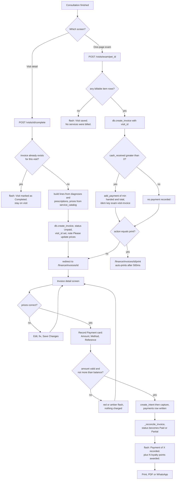

---

## Workflow 2 — Raise an invoice by hand

### 2.1 Who, when, why

**Who.** `super_admin`, `clinic_owner`, `branch_manager`, `reception`, `finance`.

**When.** There is money to bill and no visit behind it: a bag of food sold over the counter,
a re-bill, an old balance being brought onto the system, a grooming charge, a boarding stay.

**Why.** It is the only way to create an invoice outside the visit flow.

### 2.2 Preconditions

* The owner exists in CRM. **There is no "create owner" step inside the invoice form** — if
  the client is new, create them in CRM first (`/crm/owners/new`).
* If you want a pet on the invoice, the pet must exist and be active (`pets.is_active=1`);
  inactive pets are not offered.
  Source: `D:/vet/platform/blueprints/finance/routes.py:213-215`

### 2.3 Happy path

1. From `/finance/` press **+ New Invoice / فاتورة جديدة** in the top bar, or press the same
   button on `/finance/invoices`. You land on `/finance/invoices/new`.
2. **Patient / المريض** section:
   * **Owner / المالك \*** — type at least two characters into the *Type to search… /
     اكتب للبحث…* box above the dropdown, e.g. `منى` or `Mona`. Pick the client, e.g.
     `Mona Abdel Rahman · 01001234567`.
   * **Pet / الحيوان** — the list narrows to that owner's pets as soon as the owner is
     chosen. Pick `Basbous (Cat)`, or leave it empty for a product sale.
3. **Invoice Header / رأس الفاتورة**:
   * **Issue Date / تاريخ الإصدار \*** — pre-filled with today. Required.
   * **Due Date / تاريخ الاستحقاق** — optional. Purely informational; nothing chases it.
   * **Doctor / الطبيب** — free text, not a dropdown.
4. **Line Items / بنود الفاتورة** — one row is present. Per row:
   * **Description / الوصف** — required by the browser.
   * **Type / النوع** — `service` / `product` / `medication` (this form posts the English
     values correctly).
   * **Qty / الكمية**, **Unit Price / سعر الوحدة**, **Disc % / خصم %**.
   * The **Total** cell and the right-hand **Summary / الملخص** card recalculate live in the
     browser.
   * **+ Add Line Item / إضافة بند** adds a row; the **×** button removes one, but never the
     last remaining row.
   Source: `D:/vet/platform/templates/finance/invoice_form.html:93-123`, `:183-225`
5. **Adjustments / التعديلات**:
   * **Discount Type / نوع الخصم** — **Fixed Amount (EGP) / مبلغ ثابت (جنيه)** or
     **Percentage (%) / نسبة مئوية (%)**.
   * **Discount Value / قيمة الخصم**.
   * **Tax Rate (%) / نسبة الضريبة (%)**.
6. **Notes / ملاحظات** — printed on the invoice and on the receipt.
7. Press **🧾 Create Invoice / إنشاء الفاتورة**.
8. Server side, for every row: blank descriptions are skipped; `qty` and `unit_price` are
   parsed with `_num()`; **a row with quantity ≤ 0 or a negative unit price is silently
   dropped**; the per-line discount is clamped to 0–100; the line total is
   `round(qty × price − qty × price × disc/100, 2)`.
   Source: `D:/vet/platform/blueprints/finance/routes.py:238-261`
9. `db.create_invoice()` then computes the header: `subtotal` = sum of rounded line totals;
   `discount_amount` = the fixed value, or `subtotal × pct/100`, **clamped to
   `0 … subtotal`**; `tax_amount = (subtotal − discount) × rate/100`;
   `total = subtotal − discount + tax`. The invoice number is
   `INV-<year>-<count+1, five digits>`, e.g. `INV-2026-00184`. It is stored `Unpaid` with
   `paid_amount = 0` and `due_amount = total`.
   Source: `D:/vet/platform/models/database.py:3572-3618`
10. Green flash **"Invoice created successfully."** and you land on
    `/finance/invoices/<id>`, ready for Workflow 1 step 8 (take the money) or Workflow 8
    (send it).

### 2.4 Every alternative scenario

**A. Existing client.** As above.

**B. New client.** Leave this screen, create the owner in CRM, come back. Nothing is saved
when you navigate away.

**C. Product sale with no pet.** Leave **Pet** empty. The invoice's **Patient / المريض** block
renders `—`. Perfectly valid.

**D. No doctor.** Leave **Doctor** empty; the invoice shows no `Dr.` line.

**E. Percentage discount.** Choose **Percentage (%)**, enter `10`. Stored as
`discount_type='percent'`, `discount_value=10`, `discount_amount = subtotal × 0.10`.

**F. Fixed discount bigger than the subtotal.** `create_invoice` clamps it: the discount is
capped at the subtotal, the total floors at `0.00`, and the invoice is created `Unpaid` with
`due_amount = 0`. (The **Edit** screen does *not* clamp — KL-4.)
Source: `D:/vet/platform/models/database.py:3589-3593`

**G. Tax.** Egyptian VAT is not built in; type the rate you want into **Tax Rate (%)**. It is
applied *after* the header discount.

**H. Several pets.** One `pet_id` per invoice. Either one invoice per pet, or name the animals
in the line descriptions.

**I. Arabic UI.** Safe on this form — the Type and Discount Type options carry `value=`
attributes, so `service` and `value`/`percent` are stored in English whatever the language.
Source: `D:/vet/platform/templates/finance/invoice_form.html:109-113`, `:130-133`

**J. Invoice for a visit.** Not possible from here. The form has no `visit_id` field even
though the route reads one — KL-9. Use Workflow 1.

**K. Client has money on account.** The deposit is not offered on this screen. Create the
invoice, then use the **Client has credit / للعميل رصيد** card that appears on the invoice
detail — Workflow 5.

### 2.5 Errors and edge cases — exact messages

| What you did | What the app does | Exact message |
|---|---|---|
| Submitted with no owner selected | Re-renders the **empty** form | `Owner is required.` (red) |
| Every line blank, or every line dropped by the qty/price filter | Re-renders the **empty** form | `At least one line item is required.` (red) |
| A database error during creation | Re-renders the **empty** form | `Error creating invoice: <the exception>` (red) |
| JavaScript disabled | 403 error page (no `_csrf_token` in this template) | `Invalid or missing security token. Please go back and try again.` |

Source: `D:/vet/platform/blueprints/finance/routes.py:221-230`, `:263-272`, `:288-299`

> **Every one of those three failures throws away what you typed.** The route re-renders
> `invoice_form.html` with only `owners`, `pets` and `today` — it does not echo the posted
> values back. A twelve-line invoice rejected for a missing owner has to be typed again.
> This is KL-18.

Other edge cases:

* **Quantity typed as `0`.** The row is dropped without a word. If it was the only row you get
  "At least one line item is required."; if there were others, the invoice is created without
  it and nothing tells you.
* **Disc % typed as `150`.** Clamped to `100` — the line becomes free, not negative.
* **`1,200` in a price box.** Accepted; `_num()` strips the comma. **`١٢٠٠`** is accepted too.
* **A deleted invoice row anywhere in the table.** `_next_invoice_number()` counts rows rather
  than taking the maximum id, so after a deletion the next number collides with an existing
  `invoice_number`, which is `UNIQUE`. Creation then fails with
  `Error creating invoice: UNIQUE constraint failed: invoices.invoice_number`. The estimates
  numbering deliberately does not copy this.
  Source: `D:/vet/platform/models/database.py:3572-3576`, `:3689-3697`

### 2.6 What gets written, and what changes elsewhere

**Written:** one `invoices` row (`status='Unpaid'`, `paid_amount=0`, `due_amount=total`,
`visit_id` NULL) and one `invoice_lines` row per surviving line. Nothing else — no payment,
no ledger row, no audit entry.

**Screens that change:** `/finance/invoices` (new row) · `/finance/` **Outstanding** rises and
the invoice appears in **Recent Invoices** · `/finance/reports` **Invoiced** and **Invoices**
count rise for the period containing `issue_date` · the client's CRM record.
`/accounting/cashflow` and `/accounting/closing` do **not** move — no money has arrived.

### 2.7 Flowchart

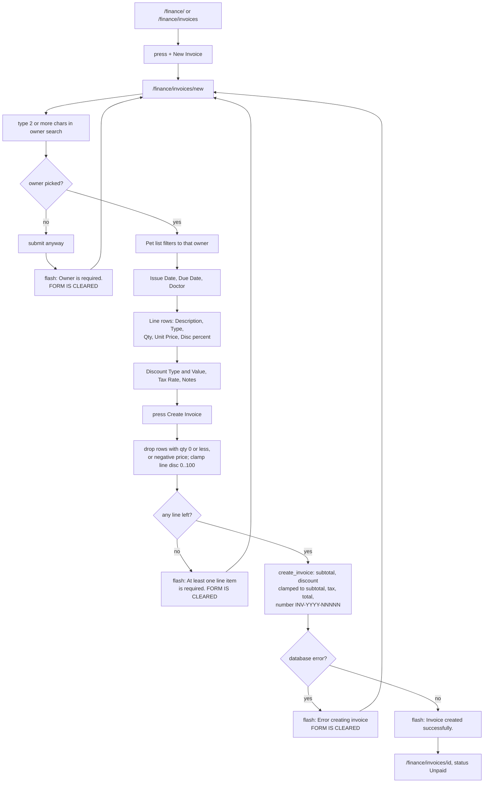

---

## Workflow 3 — Settle an outstanding invoice later

### 3.1 Who, when, why

**Who.** Anyone with `invoicing`: `super_admin`, `clinic_owner`, `branch_manager`,
`reception`, `finance`.

**When.** A client comes back to clear a balance, or somebody works the **Outstanding /
المستحق** tile at the end of the week.

**Why.** Outstanding money is the single figure the owner asks about. This is the workflow
that moves it.

### 3.2 Preconditions

* An invoice with `status` in (`Unpaid`, `Partial`) and `due_amount > 0`.
* The invoice is **not** `Cancelled` — `create_intent` refuses cancelled invoices outright.
  Source: `D:/vet/platform/models/payments/__init__.py:155-156`

### 3.3 Happy path

1. Open `/finance/`. The **Outstanding / المستحق** tile shows the sum of `due_amount` over
   every `Unpaid` and `Partial` invoice **for all time** — it is not filtered by any date.
   Source: `D:/vet/platform/blueprints/finance/routes.py:113-115`
2. Press **All Invoices / جميع الفواتير** in the top bar to reach `/finance/invoices`.
3. Filter. The bar has four controls plus two buttons:
   * **Search / بحث** — placeholder *Owner / Invoice # / المالك / رقم الفاتورة*. It matches
     owner name, invoice number **and** pet name, case-insensitively.
   * **Status / الحالة** — `All Statuses / جميع الحالات`, `Paid`, `Unpaid`, `Partial`,
     `Cancelled`. Choose **Unpaid**.
   * **From / من** and **To / إلى** — filter on `issue_date`.
   * **Filter / تصفية** and **Reset / إعادة تعيين**.
   Source: `D:/vet/platform/templates/finance/invoices_list.html:31-58`,
   `D:/vet/platform/blueprints/finance/routes.py:152-179`
4. The table lists **Invoice # / رقم الفاتورة**, **Owner / المالك**, **Pet / الحيوان**,
   **Date / التاريخ**, **Doctor / الطبيب**, **Total / الإجمالي**, **Paid / مدفوع**,
   **Due / المستحق**, **Status / الحالة**, and a **View / عرض →** link. The last row totals
   the rows currently on screen: `Totals / الإجماليات (N invoices)`.
5. Click the invoice number or **View**. You are on `/finance/invoices/<id>`.
6. In **+ Record Payment / تسجيل دفع** enter the **Amount**, choose the **Method**, add a
   **Reference** if relevant, press **✅ Record Payment / تسجيل الدفع**.
7. Green flash **"Payment of 600.00 recorded. +60 loyalty points awarded."** Status flips to
   **Partial** or **Paid**, the **Payments / المدفوعات** history gains a row, and the
   **Balance Due** line updates.

### 3.4 Every alternative scenario

**A. Working one client's balances.** From the invoice, click
**All invoices for this client / كل فواتير هذا العميل** in the **Bill To** block. That adds
`?owner_id=<id>` to the list, and a chip appears reading
**Filtered to client / مصفّاة على عميل** with the client's name linked to their CRM record and
a **Clear / إلغاء التصفية** button.
Source: `D:/vet/platform/templates/finance/invoices_list.html:60-70`

**B. The client has account credit.** A **Client has credit / للعميل رصيد** card sits *above*
the Record Payment card, showing the balance and pre-filling an amount capped at
`min(credit balance, balance due)`. Use it before taking cash — see Workflow 5.
Source: `D:/vet/platform/templates/finance/invoice_detail.html:197-228`

**C. Client pays in instalments.** Record each one separately. Each is its own `payments` row
with its own method, reference and taker. The status stays **Partial** until the balance drops
below half a piastre.

**D. Client pays more than the balance.** Refused before any money is recorded:
`That is more than the 120.00 still owed on this invoice.` Take only the balance, then put the
extra on the client's account as a deposit (Workflow 5) if they want to leave it with you.

**E. Client pays with a mix — some cash, some card.** Two Record Payment submissions, one per
method. Both land on the ledger and both show on `/accounting/cashflow` with their own
**Payment Method** value.

**F. The invoice was cancelled since it was raised.** The whole Record Payment card disappears
(`invoice.status not in ('Paid','Cancelled')` gates it), and a POST forced by hand is refused
with `That invoice has been cancelled.`
Source: `D:/vet/platform/templates/finance/invoice_detail.html:231`

**G. More than 200 unpaid invoices.** The list is hard-capped at 200 rows, and the free-text
search runs **in Python after** that slice. So the search box only ever searches the 200 most
recently created invoices in the current filter. Narrow with **Status** and the date range
first — those *are* applied in SQL. This is KL-12.
Source: `D:/vet/platform/blueprints/finance/routes.py:158-179`

**H. Arabic UI.** Identical. Status values themselves are stored and displayed in English
(`Paid`, `Unpaid`, `Partial`, `Cancelled`) on both the filter and the badges.

### 3.5 Errors and edge cases

Same table as §1.6 — the pay route is the same route. Two additions specific to this workflow:

* **The list shows a row you cannot open.** Not possible: every row links to
  `/finance/invoices/<id>` and the detail route only 404s if the id does not exist.
* **Credit notes appear in the register as ordinary rows** with status `Paid` and a **negative**
  Total, and they drag the footer totals down. That is by design of the credit-note routine —
  see Workflow 7 and KL-16.

### 3.6 What gets written, and what changes elsewhere

Identical to §1.7 from step "create_intent" onwards: one `payment_intents` row, one `payments`
row, two `payment_events` rows, a `loyalty_points` row, and `invoices.paid_amount` /
`due_amount` / `status` recomputed.

The **Outstanding** tile on `/finance/` and the **Outstanding** KPI on `/finance/reports` both
fall by the amount paid — both read the same all-time `SUM(due_amount)` over Unpaid+Partial.
Source: `D:/vet/platform/models/database.py:3975-3976`

### 3.7 Flowchart

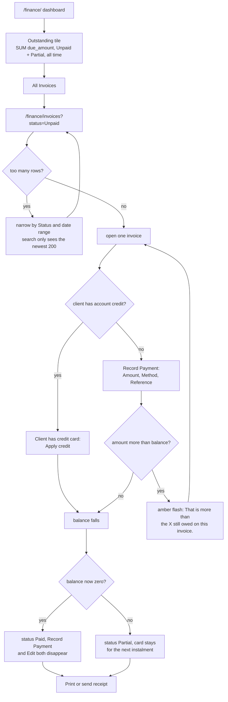

---

## Workflow 4 — Quote a surgery or hospital stay, get it approved, then bill it

### 4.1 Who, when, why

**Who.** Anyone with `invoicing`. In practice the doctor prices it and reception prints it and
records the client's answer.

**When.** Before any expensive, planned work: a spay, an orthopaedic repair, a multi-day
hospital stay, a dental under anaesthetic.

**Why.** An estimate is a priced plan the client agrees to **before** the work happens. Its
arithmetic is deliberately shared with `create_invoice` so an approved quote cannot total
differently from the invoice it becomes.
Source: `D:/vet/platform/models/database.py:3702-3715`

### 4.2 Preconditions

* The owner exists in CRM; the pet exists and is active if you want it on the quote.
* Nothing else. An estimate can be raised with no visit and no appointment.

### 4.3 Happy path

1. **Find the estimates area.** There is exactly one link to it in the whole app: the
   **📋 Estimates / عروض الأسعار** button in the top bar of `/finance/invoices`. The sidebar
   does not list it. Bookmark `/finance/estimates`.
   Source: `D:/vet/platform/templates/finance/invoices_list.html:7`
2. On `/finance/estimates` press **+ New Estimate / عرض سعر جديد**.
3. Fill `/finance/estimates/new`. It is the invoice form with one field swapped:
   * **Owner / المالك \*** — same type-to-search box.
   * **Pet / الحيوان**.
   * **Issue Date / تاريخ الإصدار \*** — today.
   * **Valid Until / صالح حتى** — pre-filled with **today + 14 days**.
     Source: `D:/vet/platform/blueprints/finance/routes.py:986-988`
   * **Doctor / الطبيب**.
   * Line rows — **Description / الوصف**, **Type / النوع**, **Qty**, **Unit Price**,
     **Disc %**. Same live summary panel.
   * **Discount Type / نوع الخصم**, **Discount Value / قيمة الخصم**,
     **Tax Rate (%) / نسبة الضريبة (%)**.
   * **Notes for the client / ملاحظات للعميل**.
   There is **no Due Date** on this form.
   Source: `D:/vet/platform/templates/finance/estimate_form.html:51-141`
4. Press the create button. Green flash **"Estimate created."** and you land on
   `/finance/estimates/<id>`. The number is `EST-<year>-<max id + 1, five digits>`, e.g.
   `EST-2026-00031`, and the status is **Draft**.
   Source: `D:/vet/platform/models/database.py:3689-3697`, `:3719-3733`
5. On the estimate detail you see the line table, the **Notes**, a **Summary / الملخص** card
   (Subtotal / Discount / Tax / TOTAL) and an **⚡ Actions / الإجراءات** card whose buttons
   depend on the status. In **Draft** you get all three:
   * **📤 Mark as sent to client / تم إرساله للعميل**
   * **✓ Client approved / وافق العميل**
   * **✕ Client declined / رفض العميل**
   plus a blue notice: *"An estimate becomes an invoice only after the client approves it. /
   يتحول عرض السعر إلى فاتورة فقط بعد موافقة العميل."*
   Source: `D:/vet/platform/templates/finance/estimate_detail.html:102-152`
6. Press **🖨 Print / طباعة** in the top bar. `/finance/estimates/<id>/print` opens in a new
   tab, auto-prints on load (`<body onload="window.print()">`), is titled **Estimate /
   عرض سعر**, and carries a **Client signature / توقيع العميل** line. **This is the sheet the
   client signs.**
   Source: `D:/vet/platform/templates/finance/estimate_print.html:32`, `:102`
7. Hand it over. Press **📤 Mark as sent to client**. Flash **"Estimate marked Sent."**,
   status becomes **Sent**, `decided_at` and `decided_by` are stamped.
8. The client agrees. Press **✓ Client approved / وافق العميل**. Flash
   **"Estimate marked Approved."**, status becomes **Approved**, and the Actions card now
   shows **🧾 Convert to invoice / تحويل إلى فاتورة**.
9. Press **Convert to invoice**. `db.convert_estimate` copies the estimate's lines, discount
   type/value and tax rate into a new invoice with **`issue_date` = today** (not the estimate's
   issue date) and notes prefixed **"From estimate EST-2026-00031."**. The estimate is set to
   **Converted** with `invoice_id` stored.
   Source: `D:/vet/platform/models/database.py:3751-3786`
10. Flash **"Invoice created from estimate."** and you land on the new invoice, `Unpaid`,
    ready for Workflow 1 or 3.
11. Reopen the estimate later and the Actions card is locked to a purple notice —
    *"Invoiced. This estimate is locked so the bill and the quote cannot drift apart. / تمت
    الفوترة. هذا العرض مقفل حتى لا يختلف عن الفاتورة."* — plus a
    **🧾 Open the invoice / فتح الفاتورة** button.

### 4.4 Every alternative scenario

**A. Client declines.** Press **✕ Client declined**. Status **Declined**. The **Client
approved** button is still offered on a Declined estimate, so a client who changes their mind
can be moved straight to Approved without re-quoting.
Source: `D:/vet/platform/templates/finance/estimate_detail.html:123`

**B. Client approves on the spot, never "Sent".** Press **✓ Client approved** while the
estimate is still **Draft**. Legal — `Approved` is accepted from Draft, Sent, Declined and
Expired.

**C. Client approves, then changes their mind before you convert.** Press **✕ Client
declined** — offered on Draft, Sent and Approved. The Convert button disappears again.

**D. The quote is stale.** If `valid_until` is earlier than today **and** the status is Draft
or Sent, an amber banner appears at the top: *"⚠️ This estimate passed its valid-until date on
2026-08-05. Prices may need re-checking before you approve it. / انتهت صلاحية هذا العرض في …
قد تحتاج الأسعار إلى مراجعة قبل الموافقة."* Nothing is blocked — it is a warning computed in
the template at render time.
Source: `D:/vet/platform/templates/finance/estimate_detail.html:46-52`

**E. Filtering the register.** `/finance/estimates` has one **Status / الحالة** dropdown that
auto-submits on change: `All / الكل`, `Draft`, `Sent`, `Approved`, `Declined`, `Expired`,
`Converted`. **`Expired` will always return nothing** — no code path ever writes that status.
KL-5.
Source: `D:/vet/platform/templates/finance/estimates_list.html:34-44`,
`D:/vet/platform/blueprints/finance/routes.py:1083`

**F. Empty register.** The empty state explains the feature: *"No estimates yet. Create one
before a surgery or hospital stay so the client agrees the price in advance. / لا توجد عروض
أسعار بعد. أنشئ عرضاً قبل الجراحة أو الإقامة ليوافق العميل على السعر مسبقاً."*

**G. Someone double-clicks Convert.** `convert_estimate` re-reads the estimate first; if
`invoice_id` is already set it returns that same id. You land on the same invoice. No second
bill.
Source: `D:/vet/platform/models/database.py:3757-3760`

**H. The work changes after approval.** The estimate is frozen once Converted. Convert it,
then edit the resulting invoice (Workflow 6) or issue a new estimate.

**I. Arabic UI.** The new-estimate form posts `value=`-backed line types, so it is safe. The
printed sheet flips to RTL and the signature line reads **توقيع العميل**.

**J. More than 100 estimates.** `list_estimates` caps at 100 rows and there is no paging. Use
the status filter.
Source: `D:/vet/platform/models/database.py:3729-3738`

### 4.5 Errors and edge cases — exact messages

| What you did | What the app does | Exact message |
|---|---|---|
| Created with no owner | Re-renders the **empty** form | `Owner is required.` (red) |
| Created with no usable line | Re-renders the **empty** form | `At least one line item is required.` (red) |
| Database error on create | Re-renders the **empty** form | `Error creating estimate: <exception>` (red) |
| Opened an estimate id that does not exist | Redirect to the estimates list | `Estimate not found.` (red) |
| POSTed a decision other than Sent / Approved / Declined | Redirect back to the estimate | `Unknown decision.` (red) |
| Tried to re-decide a **Converted** estimate | Redirect back to the estimate | `This estimate is already invoiced and cannot be changed.` (amber) |
| Pressed Convert on something not **Approved** | Redirect back to the estimate | `only an approved estimate can be converted` (red) |
| Convert on a missing estimate | Redirect back | `estimate not found` (red) |

Source: `D:/vet/platform/blueprints/finance/routes.py:1012-1014`, `:1041-1043`, `:1059-1061`,
`:1071-1073`, `:1083-1085`, `:1090-1094`, `D:/vet/platform/models/database.py:3757-3762`

Edge cases worth knowing:

* **A quote with a fixed discount larger than its subtotal stores a negative total.** The
  estimate's arithmetic helper `_money()` does **not** clamp the header discount, while
  `create_invoice()` does. Convert such a quote and the invoice totals `0.00` while the quote
  said `−500.00`. This is the one case where quote and invoice legitimately disagree — KL-19.
  Source: `D:/vet/platform/models/database.py:3702-3715` versus `:3589-3593`
* **The converted invoice's date is today, not the quote's date.** A quote written in July and
  converted in August produces an August invoice, and lands in August's report.
* **`valid_until` is not copied to the invoice.** Invoices have no such column.
* **`Expired` estimates.** Nothing expires anything. The status exists in the schema comment
  and the filter and is never written.

### 4.6 What gets written, and what changes elsewhere

**On create:** one `estimates` row (`status='Draft'`) plus one `estimate_lines` row per line.
**On decide:** `estimates.status`, `decided_at`, `decided_by`, `updated_at`.
**On convert:** a full `invoices` + `invoice_lines` set exactly as Workflow 2, then
`estimates.status='Converted'`, `estimates.invoice_id`, `updated_at`.

**Screens that change:** `/finance/estimates` (status pill) · `/finance/invoices` and
`/finance/` gain the new invoice · `/finance/reports` **Invoiced** rises. No money has moved,
so nothing in `/accounting/cashflow` or the daily closing changes yet.

### 4.7 Flowchart

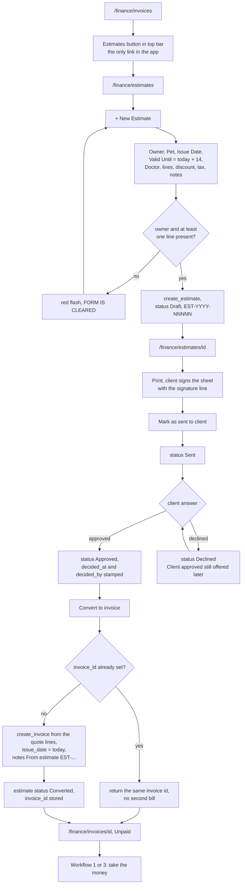

---

## Workflow 5 — Take a deposit before there is anything to bill, then spend it

### 5.1 Who, when, why

**Who.** Anyone with `invoicing`.

**When.** A boarding booking taken a week ahead, a surgery deposit, or a client who simply
wants to leave money on account.

**Why.** Money taken before an invoice exists cannot live in `payments` — that table's
`invoice_id` is `NOT NULL`. It goes to `owner_credits` instead, as append-only **signed** rows:
positive took money in, negative gave it back or spent it. The balance is always `SUM(amount)`
and is never stored, so it cannot drift.
Source: `D:/vet/platform/models/database.py:1678-1696`, `:3792-3800`

### 5.2 Preconditions

The owner exists. That is all — no invoice, no pet, no visit.

### 5.3 Happy path — taking the deposit

1. Open the client in CRM: `/crm/owners/<owner_id>`.
2. Press **💳 Account / الحساب** in the top bar. That is the only navigation route to this
   screen apart from an invoice that already shows credit. There is **no link from the finance
   dashboard**.
   Source: `D:/vet/platform/templates/crm/owner_detail.html:11-13`
3. You are on `/finance/owners/<owner_id>/credit`, titled with the client's name and subtitled
   **Deposits and account credit / الدفعات المقدمة ورصيد الحساب**.
4. Right-hand column, top card: the balance, labelled **On account / الرصيد**, with the note
   *"Money the client has paid that is not yet against any invoice. / أموال دفعها العميل ولم
   تُخصم بعد من أي فاتورة."*
5. In **➕ Take a deposit / تسجيل دفعة مقدمة**:
   * **Amount / المبلغ \*** — required, minimum `0.01`.
   * **Method / طريقة الدفع** — a **hardcoded** list on this screen only:
     **Cash / نقدي**, `Instapay`, **Card / بطاقة**, **Bank transfer / تحويل بنكي**. It does
     **not** come from the gateway registry, so it can differ from what the invoice screen
     offers. KL-17.
     Source: `D:/vet/platform/templates/finance/owner_credit.html:136-141`
   * **Reference / المرجع** — placeholder *Transaction no. / رقم العملية*.
   * **Note / ملاحظة** — placeholder *e.g. boarding deposit / مثال: دفعة إقامة*.
6. Press **Record deposit / تسجيل الدفعة**. Green flash **"Deposit recorded."**
7. The **📒 Account History / سجل الحساب** table on the left gains a row:
   **When / التاريخ**, **Type / النوع** (`deposit`), **Note / ملاحظة** with the reference in
   italics, **By / بواسطة**, and the **Amount / المبلغ** in green with a `+` sign.
   Source: `D:/vet/platform/templates/finance/owner_credit.html:40-67`

### 5.4 Happy path — spending it

**Option 1 — from the client's account page.** Once the balance is above zero *and* the client
has at least one invoice with `due_amount > 0`, a second card appears:
**🧾 Apply credit to an unpaid invoice / استخدام الرصيد في فاتورة غير مدفوعة**. Each row shows
the **Invoice / الفاتورة** number (linked), **Issued / التاريخ**, **Still owed / المتبقي**, an
amount box pre-filled and `max`-capped at `min(balance, due)`, and an
**Apply / استخدام** button.
Source: `D:/vet/platform/templates/finance/owner_credit.html:71-109`,
`D:/vet/platform/blueprints/finance/routes.py:1172-1173`

**Option 2 — from the invoice.** Open any of that client's unpaid invoices. Above the Record
Payment card sits **💳 Client has credit / للعميل رصيد**, showing the balance in large type,
the note *"Already paid by this client and not yet used. / مدفوع مسبقاً من هذا العميل ولم
يُستخدم بعد."*, an **Apply amount / المبلغ المستخدم** box pre-filled and capped the same way,
an **Apply credit / استخدام الرصيد** button, and a
**View account history / عرض سجل الحساب** link.
Source: `D:/vet/platform/templates/finance/invoice_detail.html:197-228`

Either way the POST goes to `/finance/invoices/<id>/apply-credit` and you always end up on the
invoice detail with **"Credit applied to the invoice."**

What `db.apply_credit` actually does, in order:

1. Round the amount; reject anything ≤ 0.
2. Reject more than the client holds.
3. Reject more than the invoice still owes.
4. Reject a `Cancelled` invoice.
5. Insert a **negative** `owner_credits` row, `kind='applied'`, `method='Credit'`,
   `invoice_id` set, note *"Applied to invoice INV-2026-00184"*.
6. Call `db.add_payment(..., method="Credit", reference="account credit")`, which goes through
   `create_intent` + `capture` exactly like cash, writing a real `payments` row and running
   `_reconcile_invoice`.
7. **If step 6 raises, step 5 is deleted again** so the client's money is not destroyed.
   Source: `D:/vet/platform/models/database.py:3822-3884`

### 5.5 Refunding unspent credit

Only when the balance is above zero does the **↩ Refund credit / رد الرصيد** card appear:

* **Amount / المبلغ \*** — `max` attribute set to the current balance.
* **Reason / السبب** — free text, stored as the row's note.
* **Record refund / تسجيل الرد** — behind a JavaScript confirm:
  *"Refund this amount to the client? / رد هذا المبلغ للعميل؟"*

Green flash **"Refund recorded."** A negative `owner_credits` row is written with
`kind='refund'`, `method='Cash'`, and the note (or *"Refunded to client"* if you left it
blank). **This records the refund; it does not move any money.** Hand the cash over yourself.
Source: `D:/vet/platform/templates/finance/owner_credit.html:158-178`,
`D:/vet/platform/models/database.py:3887-3903`

### 5.6 Every alternative scenario

**A. Deposit larger than any single bill.** Apply it invoice by invoice; each application is
capped at that invoice's balance.

**B. Deposit smaller than the bill.** Apply the whole balance, then take the difference in
cash through Record Payment. Status will be **Partial** in between.

**C. Client never comes back.** The credit sits there indefinitely. Nothing expires it and
nothing reports on aggregate held credit — there is no "all clients with credit" screen.

**D. Client wants the deposit back in full.** Use **Refund credit** for the whole balance. The
account history then nets to `0.00` and both the Apply card and the Refund card disappear.

**E. Deposit taken by InstaPay.** Choose `Instapay` and put the transaction number in
**Reference**. It shows in the history row in italics next to the note.

**F. Applying credit does not award loyalty points.** `apply_credit` calls `db.add_payment`
directly, bypassing the pay route where `_award_points` lives. KL-14.

**G. Applied credit shows on the cash flow as "Cash".** `gateway_for_method("Credit")` finds no
alias and falls back to the cash gateway, so the `payments.method` written is the cash
gateway's label. On `/accounting/cashflow` the row reads **Cash** even though no cash moved.
Source: `D:/vet/platform/models/payments/__init__.py:496-516`, `:337-346`

**H. Arabic UI.** All labels are translated. The four deposit methods post their English
`value=` (`Cash`, `Instapay`, `Card`, `Transfer`) in both languages, so this list is safe.

### 5.7 Errors and edge cases — exact messages

| What you did | What the app does | Exact message |
|---|---|---|
| Owner id in the URL does not exist | Redirect to `/finance/invoices` | `Owner not found.` (red) |
| Typed a letter in the deposit or refund **Amount** | Refuses | `“abc” is not a valid amount.` (red) |
| Deposit of `0` or negative | Refuses | `a deposit must be a positive amount` (red) |
| Refund of `0` or negative | Refuses | `the refund must be a positive amount` (red) |
| Refund larger than the balance | Refuses | `only 350.00 is available to refund` (red) |
| Applied more than the client holds | Refuses | `only 350.00 is available on account` (red) |
| Applied more than the invoice owes | Refuses | `this invoice only owes 120.00` (red) |
| Applied to a cancelled invoice | Refuses | `this invoice is cancelled — credit cannot be applied to it` (red) |
| Applied `0`, or a junk amount | Refuses | `the amount to apply must be positive` (red) |
| Invoice id in the apply URL does not exist | Redirect to `/finance/invoices` | `Invoice not found.` (red) |

Source: `D:/vet/platform/blueprints/finance/routes.py:1137-1163`, `:1179-1191`,
`D:/vet/platform/models/database.py:3808-3903`

> **A junk amount in the apply-credit box gives you the wrong reason.** The route calls
> `money.form_amount(...)[0]` and throws the error string away, so `"12x"` becomes `0.0` and
> you are told *"the amount to apply must be positive"* rather than that the number was
> unreadable. KL-21.
> Source: `D:/vet/platform/blueprints/finance/routes.py:1186`

Other edge cases:

* **The `max` attributes on the amount boxes are browser hints only.** Every limit is
  re-checked server-side; bypassing the HTML gets you the flash, not the money.
* **Open-invoice list on the account page is capped at 100** — `list_invoices` default limit.
  Source: `D:/vet/platform/blueprints/finance/routes.py:1172`, `D:/vet/platform/models/database.py:3636-3637`
* **If the credit row is written and the payment then fails and the rollback ALSO fails**, a
  `logger.error` is emitted reading *"COULD NOT REVERSE credit row … is missing from their
  account"*. Check the application log if a client's balance looks wrong.
  Source: `D:/vet/platform/models/database.py:3874-3882`

### 5.8 What gets written, and what changes elsewhere

| Action | `owner_credits` | `payments` | `invoices` |
|---|---|---|---|
| Take a deposit | `+amount`, `kind='deposit'` | — | — |
| Apply credit | `−amount`, `kind='applied'`, `invoice_id` set | one row, method = cash gateway label, reference `account credit` | `paid_amount` / `due_amount` / `status` recomputed |
| Refund credit | `−amount`, `kind='refund'` | — | — |

**Screens that change.** Applying credit moves everything a cash payment moves: the invoice,
`/finance/` **Outstanding**, `/accounting/cashflow` (as a **Cash** inflow), `/accounting/closing`
**Cash Collected**. Taking or refunding a deposit moves **nothing** outside the account page —
deposits are not revenue and appear on no report.

### 5.9 Flowchart

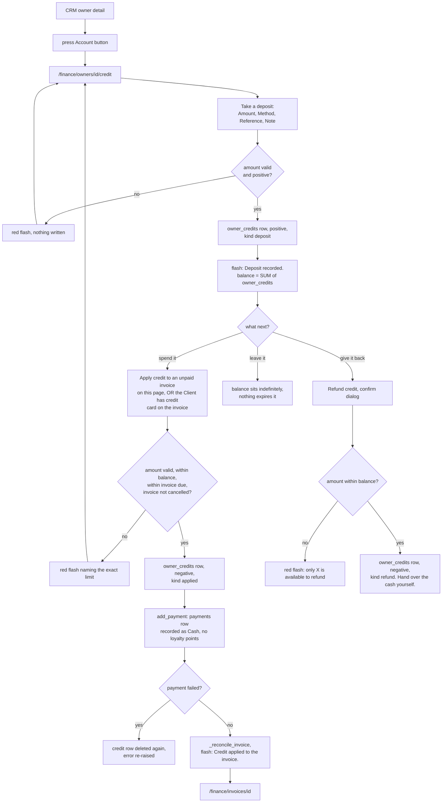

---

## Workflow 6 — Correct a wrong bill

### 6.1 Who, when, why

**Who.** Anyone with `invoicing`.

**When.** The price, quantity, description, pet, doctor or discount is wrong **and the invoice
is not fully paid**.

**Why.** Editing rewrites history in place. Once money has changed hands in full, the correct
instrument is a credit note (Workflow 7), and the app enforces that.

### 6.2 Preconditions

* `invoices.status` is **not** `Paid` and **not** `Cancelled`. The **✏️ Edit / تعديل** button
  is hidden in those two cases, and the route refuses even if you type the URL.
  Source: `D:/vet/platform/blueprints/finance/routes.py:440-443`,
  `D:/vet/platform/templates/finance/invoice_detail.html:10-12`
* The new total must not fall below `paid_amount`.

### 6.3 Happy path

1. Open `/finance/invoices/<id>`. Press **✏️ Edit / تعديل**.
2. You are on `/finance/invoices/<id>/edit`, page title `Edit INV-2026-00184`, subtitle
   `<status> · <issue date>`.
3. **👤 Owner & Patient / المالك والمريض** card:
   * **Owner \* / المالك \*** — the dropdown is rendered with *only this invoice's owner*
     pre-selected; to move the invoice to a different client, type into the search box.
     Source: `D:/vet/platform/blueprints/finance/routes.py:448-450`
   * **Pet / الحيوان** — every active pet in the clinic is listed, with the current one
     selected. Unlike the New Invoice form, this list is **not** filtered by owner.
   * **Doctor / الطبيب** — free text.
   * **Due Date / تاريخ الاستحقاق** — a real date box. **This is the only screen that can set
     a due date**; the New Invoice form's Due Date is never stored. See KL-20.
4. **📋 Line Items / البنود** card. Every existing line is an editable row:
   **Description / الوصف**, **Type / النوع**, **Qty / الكمية**,
   **Unit Price / سعر الوحدة**, **Disc % / الخصم %**, a **read-only Total** that recalculates
   in the browser, and a red **✕** that deletes the row immediately.
   **+ Add Line Item / + إضافة بند** appends a blank row.
   * The **Type** dropdown here offers five values — `service`, `product`, `lab`, `vaccine`,
     `medication` — where New Invoice offers three.
   * **In Arabic this dropdown corrupts the stored value.** See §0.2 trap 2 / KL-2.
   Source: `D:/vet/platform/templates/finance/invoice_edit.html:82-96`, `:159-171`
5. **🧮 Totals & Discount / الإجماليات والخصم** card:
   **Discount Type**, **Discount Value**, **Tax Rate (%)**, a read-only
   **Estimated Total / الإجمالي التقديري**, and **Notes / ملاحظات**.
6. Press **💾 Save Changes / حفظ التغييرات**. (**Cancel / إلغاء** returns to the invoice with
   nothing saved.)
7. The route re-parses every row with the same rules as creation — blank descriptions skipped,
   quantity ≤ 0 or negative price dropped, per-line discount clamped to 0–100. It then
   computes `subtotal`, `discount_amt`, `tax_amount` and `total`; checks the total against
   `paid_amount`; computes `due_amount = total − paid_amount` and re-derives the status
   (`Paid` if due ≤ 0, else `Partial` if anything is paid, else `Unpaid`).
   Source: `D:/vet/platform/blueprints/finance/routes.py:463-510`
8. It **deletes every `invoice_lines` row for this invoice and re-inserts** the surviving rows,
   then updates the invoice header.
   Source: `D:/vet/platform/blueprints/finance/routes.py:512-537`
9. Green flash **"Invoice updated successfully."** and you are back on the invoice detail.

### 6.4 Every alternative scenario

**A. Unpaid invoice.** Everything is editable and the total can move freely up or down.

**B. Partially paid invoice.** Editable, but the new total may not drop below what has already
been paid. Raising it is fine — the status stays **Partial** with a larger balance. Lowering
it exactly to `paid_amount` flips the status to **Paid** with `due_amount = 0`.

**C. Fully paid invoice.** Refused on arrival:
`Paid invoices cannot be edited. Issue a credit note instead.` You are bounced back to the
invoice detail. Use Workflow 7.

**D. Cancelled invoice.** Same refusal wording with `Cancelled` substituted:
`Cancelled invoices cannot be edited. Issue a credit note instead.` This guard is deliberate —
without it a voided invoice could be edited back to life while its credit note stayed on the
books, and both would count.
Source: `D:/vet/platform/blueprints/finance/routes.py:437-443`

**E. Moving the invoice to a different client.** Change **Owner**. The invoice moves entirely —
it will now appear under the new client's record, and any payments already on it move with it
on the invoice screen (the `payments.owner_id` rows themselves are **not** rewritten).

**F. Changing the issue date.** Not possible. There is no issue-date field on the edit form and
the UPDATE does not touch `issue_date`. All period reporting keys off `issue_date`, so a bill
cannot be moved between months by editing.

**G. Deleting every line.** Refused — see the error table.

**H. A line that came from the service catalogue.** The re-insert does **not** carry
`item_id`, so after any edit every line's catalogue link is lost. KL-22.
Source: `D:/vet/platform/blueprints/finance/routes.py:516-521`

**I. Arabic UI.** Safe for money, unsafe for line types. If you must edit in Arabic, switch the
UI to English first, edit, then switch back.

### 6.5 Errors and edge cases — exact messages

| What you did | What the app does | Exact message |
|---|---|---|
| Opened Edit on a **Paid** invoice | Redirect to the invoice detail | `Paid invoices cannot be edited. Issue a credit note instead.` (amber) |
| Opened Edit on a **Cancelled** invoice | Redirect to the invoice detail | `Cancelled invoices cannot be edited. Issue a credit note instead.` (amber) |
| Saved with no usable line | Redirect back to the **empty** edit form | `At least one line item is required.` (red) |
| Lowered the total below what is paid | Redirect back to the edit form, nothing saved | `This invoice already has 600.00 paid against it. Lowering it to 400.00 would owe the client 200.00 — issue a credit note or a refund instead.` (red) |
| Database error during the save | Redirect back to the edit form | `Error updating invoice: <exception>` (red) |
| Invoice id does not exist | HTTP 404 | — |

Source: `D:/vet/platform/blueprints/finance/routes.py:440-443`, `:485-488`, `:502-508`, `:541-544`

> **The rejection redirects to a freshly loaded edit form, so your unsaved changes are gone.**
> Fix the figure in one go rather than experimenting.

Serious edge case you must know about:

> **KL-4 — a fixed header discount larger than the subtotal is NOT clamped on this screen.**
> `create_invoice` clamps to `0 … subtotal`; the edit route does not. On an invoice with
> nothing paid, entering **Discount Type = Fixed Amount** and **Discount Value = 5000** against
> a 560 EGP subtotal stores `total = −4440.00`, `due_amount = −4440.00` and status **Paid**.
> The `total < paid_amount` guard only catches this once something has actually been paid.
> Source: `D:/vet/platform/blueprints/finance/routes.py:490-510` versus
> `D:/vet/platform/models/database.py:3589-3593`

### 6.6 What gets written, and what changes elsewhere

**Written:** all `invoice_lines` rows for the invoice deleted and re-inserted (new ids, no
`item_id`); `invoices.owner_id`, `pet_id`, `doctor_name`, `notes`, `discount_type`,
`discount_value`, `discount_amount`, `tax_rate`, `tax_amount`, `subtotal`, `total`,
`due_amount`, `status`, `due_date` updated. **`paid_amount` is never touched here**, and
neither is `issue_date`. No audit-log row is written for an invoice edit.

**Screens that change:** the invoice · `/finance/invoices` totals · `/finance/`
**Outstanding** · `/finance/reports` **Invoiced**, **Revenue by Line Type** and, if a line type
changed, **Top Services** · `/accounting/pl` **Revenue Breakdown**. Nothing on the cash side
moves — no payment was involved.

### 6.7 Flowchart

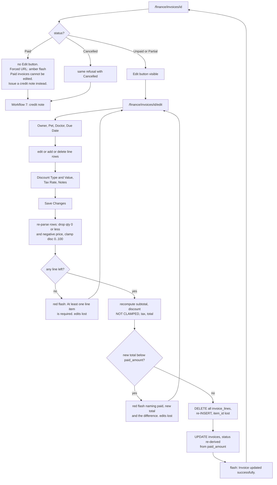

---

## Workflow 7 — Void or partially credit a bill

### 7.1 Who, when, why

**Who.** **Not reception.** This route carries
`@role_required("super_admin","clinic_owner","branch_manager","finance")` on top of the
`invoicing` grant. Reception **sees the card** on the invoice but the POST is refused with
*"You don't have permission to access this page."* and a redirect to the launcher.
Source: `D:/vet/platform/blueprints/finance/routes.py:562-564`,
`D:/vet/platform/templates/finance/invoice_detail.html:280`

**When.** The client cancels after being billed, was over-charged, or is owed money back — and
the invoice can no longer be edited.

**Why.** A credit note leaves both documents on the books. Deleting an invoice would not.

### 7.2 Preconditions

* The invoice is **not** already `Cancelled`.
* The credit amount is greater than zero and no larger than the invoice total.

### 7.3 Happy path — full void

1. Open `/finance/invoices/<id>`. Scroll the right sidebar to
   **↩️ Credit Note / Refund / إشعار دائن**. (The card is hidden only on `Cancelled`
   invoices — it is present on `Paid` ones.)
2. **Amount (EGP) / المبلغ** — pre-filled with the invoice total. Leave it as-is for a full
   void.
3. **Reason / السبب** — placeholder *Refund / cancellation reason / سبب الاسترداد / الإلغاء*.
   Type something meaningful; it goes on both the credit note and the audit log.
4. Press **↩️ Issue Credit Note / إصدار إشعار دائن**. A browser confirm appears:
   **"Issue a credit note for this invoice?"** (this string is English-only). Confirm.
   Source: `D:/vet/platform/templates/finance/invoice_detail.html:284-297`
5. The route:
   * parses the amount with `money.form_amount`, falling back to `paid_amount` then `total`
     then `0` if the field is empty;
   * refuses ≤ 0, refuses an already-cancelled invoice, refuses more than the invoice total;
   * creates a **second invoice** — same owner, same pet, `visit_id` NULL, `issue_date` =
     today, no discount, no tax — with exactly one line:
     `line_type='credit'`, quantity 1, unit price **negative**, description
     **"Credit note — INV-2026-00184: `<reason>`"**, and notes
     **"Credit note for INV-2026-00184. Reason: `<reason>`"**;
   * immediately forces that credit note to `due_amount=0`, `paid_amount=0`, `status='Paid'`
     so it is not a receivable;
   * because the credit is **≥ the invoice total**, sets the original to
     `status='Cancelled'`, `due_amount=0`;
   * writes an `audit_log` row with `action='credit_note'`, `module='finance'`,
     `entity_type='invoice'`, `entity_id` = the original invoice, and details
     *"Credit note 205 issued for INV-2026-00184: `<reason>`"*.
   Source: `D:/vet/platform/blueprints/finance/routes.py:568-651`
6. Green flash **"Credit note created successfully."** and you land on the **new credit
   note**, `/finance/invoices/<credit_id>`, not on the original. It looks like an ordinary
   invoice with a negative total and a **Paid** badge.
7. Go back to the original invoice: the badge now reads **Cancelled**, **Balance Due** is
   `0.00`, and the Record Payment, Edit and Credit Note cards have all gone.

### 7.4 Happy path — partial credit

Identical up to step 4, but you type a smaller **Amount** — say `500.00` against a 1,850 EGP
invoice. Then:

* the credit note is created for `−500.00` and settled at zero as before;
* the original is **not** cancelled. Instead
  `new_due = max(0, invoice_total − credit_amount − paid_amount)` and the status is
  re-derived: `Paid` if the new due is ≤ 0, else `Partial` if anything is paid, else `Unpaid`.
  Source: `D:/vet/platform/blueprints/finance/routes.py:631-639`

Worked example — invoice 1,850.00, client already paid 600.00, you credit 500.00:
`new_due = 1850 − 500 − 600 = 750.00`, `paid = 600 > 0` → status **Partial**. The client now
owes 750 instead of 1,250.

### 7.5 Every alternative scenario

**A. Voiding an unpaid invoice.** The commonest case. Original goes `Cancelled`, `due_amount`
`0`. Outstanding drops by exactly the invoice's due amount, once.

**B. Voiding a fully paid invoice.** The original goes `Cancelled` but its `paid_amount` stays
as it was — the money the client handed over is still recorded as received, and **there is no
screen anywhere that gives it back**. The credit note is the paperwork; hand the cash over
yourself and, if the client is leaving it with you, record it as a deposit (Workflow 5).
See KL-13.

**C. Crediting the same invoice twice.** Refused after the first full credit
(`This invoice is already cancelled. It cannot be credited again.`). After a **partial**
credit the invoice is *not* cancelled, so a second partial credit is accepted — and each is
checked only against the **original total**, not against what is left. Two partial credits of
1,000 each on a 1,850 invoice are both accepted.

**D. Reception tries it.** The card is visible; the POST is refused with
*"You don't have permission to access this page."* and a redirect to the launcher. Nothing is
written. Ask a manager or the finance user.

**E. A credit note in the invoice register.** It is a normal row with a negative **Total** and
a green **Paid** badge, and it drags the footer totals down. On `/finance/reports` its negative
total reduces **Invoiced** (that KPI counts everything except `Cancelled`). KL-16.

**F. Editing a credit note.** Impossible — it is created `Paid`, so the Edit button never
appears.

**G. Crediting a credit note.** The card is visible on it (status is `Paid`, not `Cancelled`).
Its total is negative, so `amount > inv_total` is true for any positive amount and you get
`A credit note cannot exceed the invoice total of -500.00.` Effectively blocked.

**H. Arabic UI.** All the labels translate; the JavaScript confirm text does not.

### 7.6 Errors and edge cases — exact messages

| What you did | What the app does | Exact message |
|---|---|---|
| Typed a letter in **Amount** | Refuses | `“12,34x” is not a valid amount.` (red) |
| Amount `0` or negative | Refuses | `Credit note amount must be greater than zero.` (red) |
| Invoice already `Cancelled` | Refuses | `This invoice is already cancelled. It cannot be credited again.` (amber) |
| Amount larger than the invoice total | Refuses | `A credit note cannot exceed the invoice total of 1850.00.` (red) |
| Anything raised during creation | Refuses; you stay on the original | `Error creating credit note: <exception>` (red) |
| Reception (or any role outside the four) | Refuses before the route body runs | `You don't have permission to access this page.` (red) + redirect to launcher |
| Invoice id does not exist | HTTP 404 | — |

Source: `D:/vet/platform/blueprints/finance/routes.py:568-591`, `:654-656`

Edge cases:

* **Leaving Amount blank.** The field is pre-filled with the invoice total by the template, so
  this only happens if you clear it. The route then falls back to `paid_amount`, then `total`,
  then `0`.
* **Outstanding moves exactly once.** The credit note is force-settled at zero precisely so it
  cannot pull its own value out of Outstanding *and* have the cancellation pull the same value
  out again. Do not "fix" a credit note's `due_amount` by hand.
  Source: `D:/vet/platform/blueprints/finance/routes.py:618-626`
* **The credit note carries no `visit_id`**, so it never shows a Visit link.

### 7.7 What gets written, and what changes elsewhere

**Written:** a new `invoices` row (negative `subtotal` and `total`, `due_amount=0`,
`paid_amount=0`, `status='Paid'`) · one `invoice_lines` row with `line_type='credit'` and a
negative total · the original invoice's `status` and `due_amount` (full credit) or
`due_amount` and `status` (partial) · one `audit_log` row, `action='credit_note'`.

**Screens that change:** `/finance/` **Outstanding** falls · `/finance/invoices` gains the
credit-note row and the original's badge changes · `/finance/reports` **Invoiced** falls by the
credit amount, **Revenue by Line Type** gains a negative `credit` bar · `/accounting/pl`
**Revenue Breakdown** gains a negative row **only if the credit note has status Paid or
Partial** — which it does, so it will appear there · the audit log. Nothing on the cash side
moves: no `payments` row is written and `/accounting/cashflow` does not change.

### 7.8 Flowchart

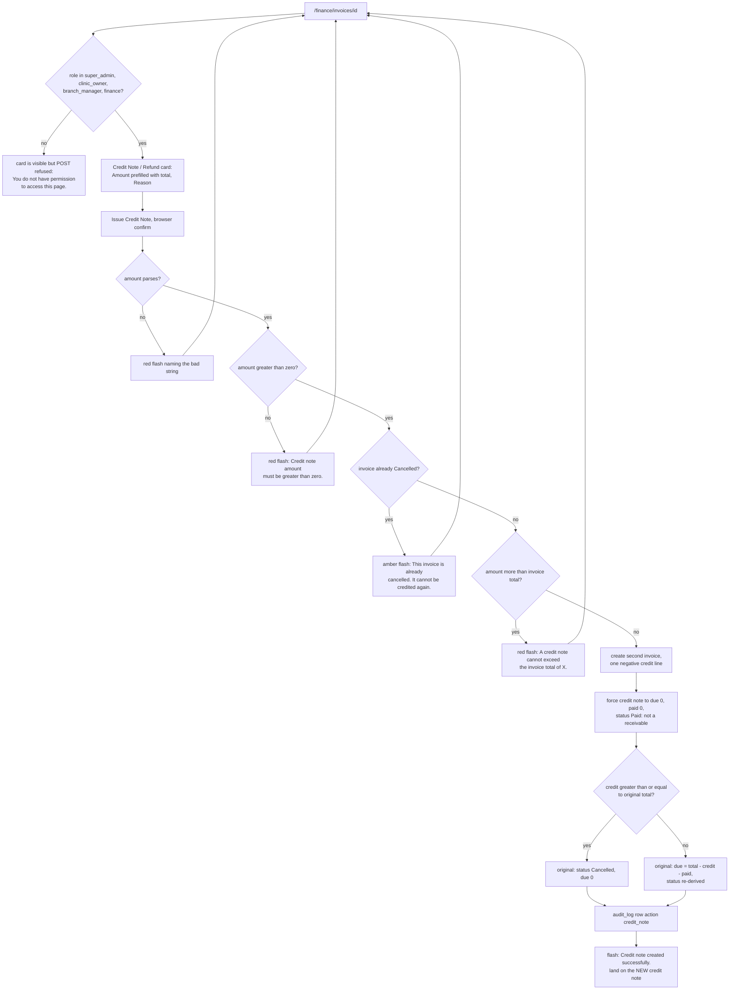

---

## Workflow 8 — Get the bill to the client

### 8.1 Who, when, why

**Who.** Anyone with `invoicing`.

**When.** At the counter after payment (a receipt), or later when chasing a balance.

**Why.** Three delivery routes exist and they behave differently. Pick deliberately.

### 8.2 Preconditions

An invoice exists. For WhatsApp, the **owner must have a phone number on file**
(`owners.phone` — the route reads `invoice.owner_phone`, not `whatsapp_phone`).
Source: `D:/vet/platform/blueprints/finance/routes.py:736-739`,
`D:/vet/platform/models/database.py:3621-3625`

### 8.3 Route A — Print / طباعة

1. On `/finance/invoices/<id>` press **🖨 Print / طباعة**. It opens `target="_blank"`.
2. `/finance/invoices/<id>/print` is a **standalone page** — its own `<!DOCTYPE html>`, not the
   app shell. `dir="rtl"` when the language is Arabic. The tab title is
   `INV-2026-00184 — Aleefy`.
3. Three buttons at the top (they do not print themselves):
   **🖨 Print / طباعة**, **⬇ Download PDF / تحميل PDF**, **✕ Close / إغلاق**.
4. The page calls `window.print()` automatically 500 ms after load, so the browser print
   dialog opens on its own.
   Source: `D:/vet/platform/templates/finance/invoice_print.html:1-6`, `:41-45`, `:135`
5. Content: clinic header from `db.get_clinic()`, Bill To, Patient, the line table,
   **Subtotal**, **Discount**, **Tax**, **TOTAL**, **Paid**, **Balance Due**, the notes, and
   the footer *"Thank you for choosing `<clinic name>`"*.

> **The Payment History block on this page never renders.** `db.get_invoice()` sets
> `payments = []` unconditionally, and only the *detail* route backfills the real rows. The
> printed receipt therefore shows the totals but never itemises the payments. KL-3.
> Source: `D:/vet/platform/models/database.py:3634`,
> `D:/vet/platform/blueprints/finance/routes.py:326-330`,
> `D:/vet/platform/templates/finance/invoice_print.html:112-123`

### 8.4 Route B — Download PDF

1. Press **⬇ Download PDF / تحميل PDF** on the invoice detail or on the print page.
2. `/finance/invoices/<id>/pdf` renders with `fpdf2` and returns the file as
   `invoice-INV-2026-00184.pdf` with `Content-Disposition: attachment`.
   Source: `D:/vet/platform/blueprints/finance/routes.py:677-700`
3. If `fpdf2` is not installed you are **not** shown an error page — you are flashed
   **"fpdf2 is not installed. Run: pip install fpdf2"** and redirected to the print page, which
   is the working fallback.
   Source: `D:/vet/platform/models/pdf_generator.py:374-377`
4. Any other failure flashes **"PDF generation failed: `<exception>`"** and redirects to the
   same place.

### 8.5 Route C — Send via WhatsApp

1. On the invoice detail, the **📱 Send via WhatsApp / إرسال واتساب** card explains
   *"Send invoice summary to owner via WhatsApp / إرسال ملخص الفاتورة عبر واتساب"* and offers
   one green button, **📱 Send WhatsApp / إرسال**.
2. It POSTs `/finance/invoices/<id>/whatsapp`. The route builds a **hardcoded English**
   message:

   ```
   🐾 *Aleefy*
   Invoice: *INV-2026-00184*
   Date: 2026-08-19

   *Services:*
     • Spay surgery — Basbous: 1500.00 EGP
     • Post-op medication: 350.00 EGP

   Subtotal: 1850.00 EGP
   *Total: 1850.00 EGP*
   Paid: 1850.00 EGP
   *Balance Due: 0.00 EGP*

   Thank you for choosing Aleefy 🐾
   Happy Pets, Healthy Lives
   ```

   `Discount:` and `Tax:` lines are inserted only when those amounts are non-zero.
   Source: `D:/vet/platform/blueprints/finance/routes.py:713-734`
3. The phone is turned into a WhatsApp chat id (`01001234567@c.us`) and handed to
   `blueprints.whatsapp.routes._send_and_log` with `template_name='invoice_whatsapp'`, which
   writes a `whatsapp_log` row whether it succeeded or failed.
   Source: `D:/vet/platform/blueprints/whatsapp/routes.py:51-72`
4. Green flash **"Invoice sent via WhatsApp to 01001234567."** on success.

> **This message is not bilingual.** It ignores `t()` entirely and hardcodes the brand name
> "Aleefy" and the tagline, so an Arabic-first clinic under a different name sends the wrong
> text. KL-15.

### 8.6 Every alternative scenario

**A. Client wants paper at the counter.** Route A. The dialog opens by itself.
**B. Client wants it by e-mail.** Route B, then attach the PDF yourself. There is no e-mail
button in finance.
**C. Client wants it on WhatsApp.** Route C. Check the owner's phone first.
**D. Owner has no phone.** Amber flash **"Owner has no phone number on file."** and nothing is
sent or logged.
**E. WhatsApp accepted but did not deliver.** `_send_and_log` returns anything other than
`"Sent"` → amber **"WhatsApp queued / failed — check message log."** The attempt is still in
`whatsapp_log`.
**F. The WhatsApp client itself raised.** Red **"WhatsApp error: `<exception>`"**.
**G. Printing an estimate rather than an invoice.** Different page —
`/finance/estimates/<id>/print`, which auto-prints on `body onload` and has the signature
line. Workflow 4.
**H. Arabic.** The print page and the PDF respect the language; the WhatsApp text does not.

### 8.7 Errors and edge cases — exact messages

| What you did | What the app does | Exact message |
|---|---|---|
| Requested a PDF with `fpdf2` missing | Redirect to the print page | `fpdf2 is not installed. Run: pip install fpdf2` |
| PDF generation failed some other way | Redirect to the print page | `PDF generation failed: <exception>` |
| WhatsApp with no phone on file | Redirect to the invoice, nothing sent | `Owner has no phone number on file.` (amber) |
| WhatsApp not confirmed as sent | Redirect to the invoice | `WhatsApp queued / failed — check message log.` (amber) |
| WhatsApp client raised | Redirect to the invoice | `WhatsApp error: <exception>` (red) |
| Invoice id does not exist on any of the three | HTTP 404 | — |

Source: `D:/vet/platform/blueprints/finance/routes.py:679-700`, `:736-752`

### 8.8 What gets written, and what changes elsewhere

Print and PDF write **nothing**. WhatsApp writes one `whatsapp_log` row (owner, phone, the
first 500 characters of the message, template name, status, HTTP status, the first 500
characters of the response, the first 300 characters of any error, and the send time) which is
visible in the WhatsApp module's message log. No invoice field changes on any of the three.

### 8.9 Flowchart

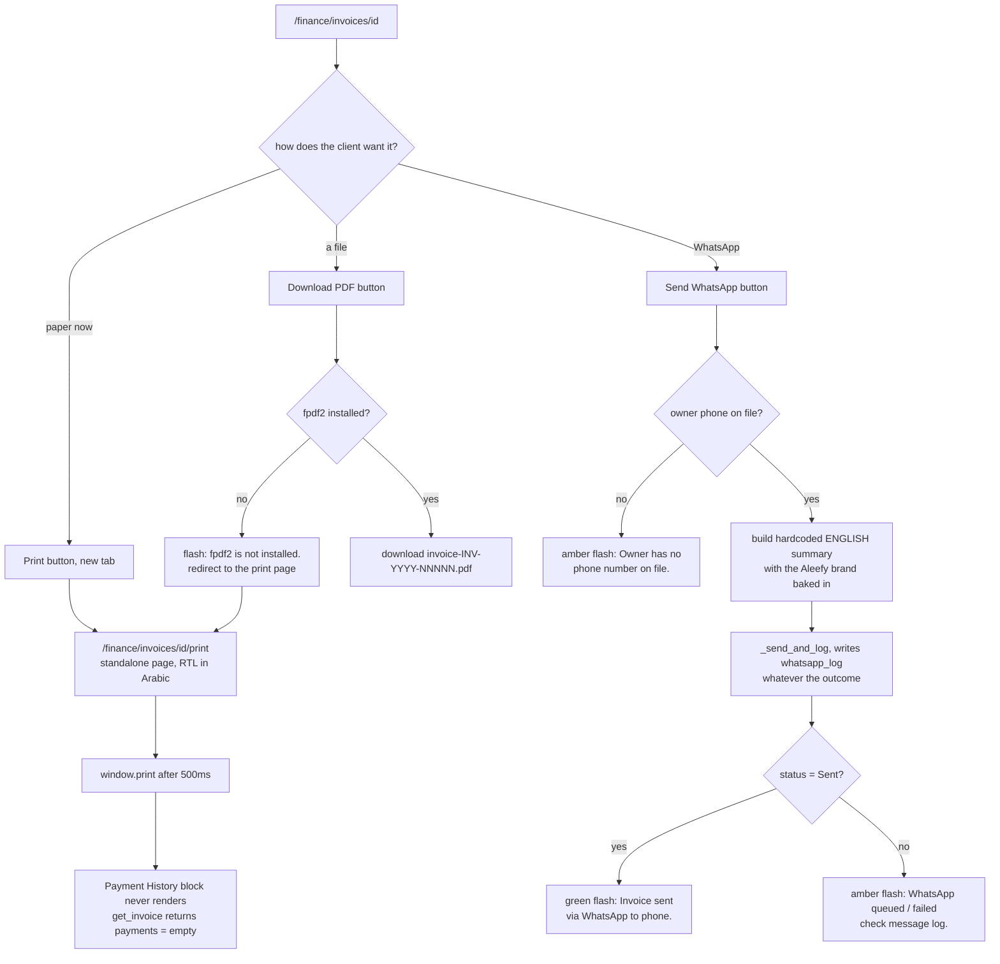

---

## Workflow 9 — Record what the clinic itself spent

### 9.1 Who, when, why

**Who.** `super_admin`, `clinic_owner`, `branch_manager`, `finance`.
**Reception is deliberately excluded** from `/finance/expenses` — the code comment on that
route says so in as many words, citing a live test where a receptionist read the clinic's rent
and marketing spend off `/finance/reports`.
Source: `D:/vet/platform/blueprints/finance/routes.py:759-767`

`auditor` is named in that route's `@role_required` list but **does not hold the `invoicing`
grant**, so Gate 1 denies it first. Auditor cannot open `/finance/expenses` at all. It *can*
open `/accounting/expenses`. KL-1.

**When.** Rent day, a supplier receipt, the salary run, the electricity bill, a lab invoice.

**Why.** Expenses feed the P&L, the cash-flow "out" side, the daily closing net figure and the
budget variance. Nothing else creates an expense row.

### 9.2 There are two expense screens, and they are not the same

Both write to the same `expenses` table. **Neither can edit or delete a row once saved.**

| | `/finance/expenses` | `/accounting/expenses` |
|---|---|---|
| Who can open it | super_admin, clinic_owner, branch_manager, finance | those four **plus auditor** |
| Row cap | 200 | 300 |
| Filters | date from / to | **category** + date from / to |
| Columns | Date, Category, Description, Vendor, Amount, Ref | Date, Category, Description, Amount, Vendor, Receipt #, **Method** |
| Form has **Notes** | yes | no |
| Form has **Payment Method** | no | yes — but it is **never stored**, see below |
| Category dropdown | Supplies, Medications, Utilities, Salaries, Rent, Maintenance, Equipment, Marketing, Lab, Other | Medicines/Supplies, Staff Salaries, Utilities, Equipment, Marketing, Miscellaneous, **plus every category already in the table** |
| Amount parser | bare `float()` — crashes on junk | `try/except` → `0.0` |
| Category default if blank | `"General"` | `"General"` |

Source: `D:/vet/platform/blueprints/finance/routes.py:766-832`,
`D:/vet/platform/blueprints/accounting/routes.py:316-426`,
`D:/vet/platform/templates/finance/expenses_list.html:99-143`,
`D:/vet/platform/templates/accounting/expenses_list.html:122-170`

> **The Payment Method dropdown on `/accounting/expenses` is dead.** There is no
> `payment_method` column on `expenses` — not in the SQLite schema, not in the PostgreSQL
> schema, not in any migration. The route tries the INSERT with that column, the INSERT
> raises, and it silently retries without it. The value you chose is discarded, and the
> **Method / طريقة الدفع** column in the table renders `—` on every row, forever. KL-23.
> Source: `D:/vet/platform/models/database.py:1762-1774`,
> `D:/vet/platform/blueprints/accounting/routes.py:399-414`,
> `D:/vet/platform/templates/accounting/expenses_list.html:96`

### 9.3 Happy path — the finance side

1. There is **no link to `/finance/expenses` from the finance dashboard**. Type the URL, or
   come back to it after using it once. (Its own top bar has a
   **← Dashboard / لوحة التحكم** button back to `/finance/`.) KL-8.
2. Right-hand card **➕ Record Expense / تسجيل مصروف**:
   * **Category / الفئة \*** — required. Ten fixed options.
   * **Description / الوصف \*** — required. Placeholder
     *What was purchased/paid? / ما الذي تم شراؤه/دفعه؟*
   * **Amount (EGP) / المبلغ (جنيه) \*** — required, minimum `0.01`.
   * **Date / التاريخ \*** — pre-filled with today.
   * **Vendor / Supplier / المورد / المزود** — free text.
   * **Receipt / Reference # / الإيصال / رقم المرجع**.
   * **Notes / ملاحظات**.
3. Press **💾 Save Expense / حفظ المصروف**. Green flash **"Expense recorded."** and the page
   reloads with the new row on the left.
4. Left-hand table: **Date**, **Category** (as a badge), **Description**, **Vendor**,
   **Amount (EGP)** in red, **Ref**. The footer row totals what is on screen:
   `Total / الإجمالي (N records)`.
5. **Vendor becomes a link** to `/procurement/suppliers/<id>` only when the free-text name is
   an **exact** match for a row in `suppliers`. Otherwise it renders as plain text. Type the
   supplier's name exactly as it is in Procurement if you want the link.
   Source: `D:/vet/platform/blueprints/finance/routes.py:814-817`,
   `D:/vet/platform/templates/finance/expenses_list.html:71-75`

### 9.4 Happy path — the accounting side

1. `/accounting/` → **Expenses / المصروفات** in the top bar, or the
   **View All / عرض الكل** link on the **Top Expense Categories** card.
2. Filter with **All Categories / جميع الفئات** (built from `SELECT DISTINCT category`), **From**
   and **To**, or **Reset / إعادة تعيين**.
3. Right-hand **Add Expense / إضافة مصروف** form → POST `/accounting/expenses/new` → always
   redirects back to `/accounting/expenses`.
4. Green flash **"Expense recorded successfully."**

### 9.5 Every alternative scenario

**A. Rent.** `/finance/expenses`, Category **Rent / الإيجار**, Description
`August rent — Maadi branch`, Amount `12000`, Date the 1st, Vendor the landlord's name,
Receipt # the transfer reference, Notes anything.

**B. A supplier receipt you want linked.** Use the accounting side if you want the receipt
number in its own column, and type the vendor name **exactly** as it appears in Procurement.

**C. Salaries.** Category **Salaries / الرواتب** on the finance side, or **Staff Salaries /
رواتب الموظفين** on the accounting side. **These are two different strings and they will not
group together.** Pick one screen for salaries and stay on it.

**D. A category that is not in the list.** The accounting form's dropdown appends every
category already present in the table, so a category invented once on the finance side becomes
selectable on the accounting side afterwards. There is no free-text category box on either
form.

**E. Working in Arabic.** **Do not.** Both dropdowns submit the visible label, so an Arabic
session stores `الإيجار` and an English one stores `Rent`. They then appear as two separate
categories on the P&L, on **Expenses by Category**, on the accounting **Top Expense
Categories** card, and — worst — the budget page matches `budget_targets.category` to
`expenses.category` with **exact string equality**, so a target set in one language never sees
spending recorded in the other. Standardise on one language for expense entry. KL-2.

**F. A mistake was saved.** There is no edit and no delete on either screen. Record a
correcting entry, or fix the row in the database.

**G. More than 200 / 300 rows in range.** The lists silently truncate. The footer total is the
total of the rows **shown**, not of the range. Narrow the dates.

### 9.6 Errors and edge cases — exact messages

| Screen | What you did | Exact message |
|---|---|---|
| Both | Blank description, or amount ≤ 0 | `Description and valid amount are required.` (red) |
| `/finance/expenses` | Save succeeded | `Expense recorded.` (green) |
| `/accounting/expenses` | Save succeeded | `Expense recorded successfully.` (green) |
| Both | Database error on the INSERT | `Error saving expense: <exception>` (red) |
| `/finance/expenses` | Typed `1,200` or `١٢٠٠` in **Amount** with the browser's number validation bypassed | **HTTP 500** — `float()` is called bare with no guard |
| `/accounting/expenses/new` | Same input | coerced to `0.0` → `Description and valid amount are required.` |
| Either | JavaScript disabled | 403 page: `Invalid or missing security token. Please go back and try again.` |

Source: `D:/vet/platform/blueprints/finance/routes.py:771-796`,
`D:/vet/platform/blueprints/accounting/routes.py:385-425`

### 9.7 What gets written, and what changes elsewhere

**Written:** one `expenses` row — `category`, `description`, `amount`, `vendor`,
`receipt_ref`, `expense_date`, `created_by`, plus `notes` from the finance form only.
`payment_method` is never written by anything.

**Screens that change:** both expense lists · `/finance/reports` **Expenses**, **Net**, and the
**Expenses by Category** bars · `/accounting/` **Total Expenses (This Month)**, **Net Profit**,
**Profit Margin**, the 12-month chart, **Top Expense Categories**, **Recent Transactions** ·
`/accounting/pl` **Total Expenses** and **Expense Breakdown** · `/accounting/cashflow` a new
**↓ Out / ↓ صادر** row, always labelled method **Cash** whatever you chose ·
`/accounting/closing` **Expenses Paid** and the out-count, if dated today ·
`/accounting/budget` **Actual**, **Variance** and **% Used** for that category.

### 9.8 Flowchart

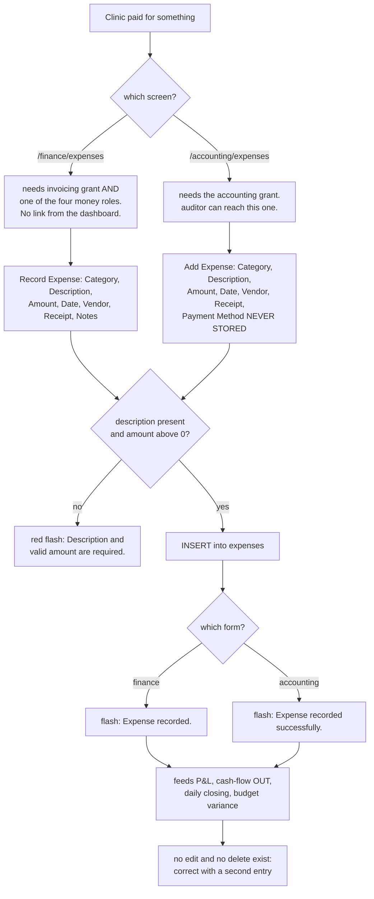

---

## Workflow 10 — Close the day and reconcile the till

### 10.1 Who, when, why

**Who.** `super_admin`, `clinic_owner`, `branch_manager`, `finance`, `auditor` — anyone with
the `accounting` grant. **Reception cannot reach this screen**, which is worth planning around
if reception is the one holding the drawer.

**When.** End of shift, before the money leaves the building.

**Why.** It is the one place that compares the day's recorded cash against the physical drawer
and leaves a dated, named note behind.

### 10.2 Preconditions

None. The `closing_notes` table is created on demand the first time this screen is used on a
given database.
Source: `D:/vet/platform/blueprints/accounting/routes.py:437-456`

### 10.3 Happy path

1. Open `/accounting/` and press **Daily Closing / الإغلاق اليومي** in the top bar, or use the
   **Quick Access / وصول سريع** strip.
2. `/accounting/closing` shows **🔒 Today's Closing Summary / ملخص إغلاق اليوم — 2026-08-19**
   with four tiles, all for **today only**:
   * **💵 Cash Collected / النقد المحصّل** — `SUM(payments.amount)` where
     `SUBSTR(received_at,1,10)` is today. The number itself is a link to
     `/accounting/cashflow?date_from=today&date_to=today`, with
     *EGP · View payments / عرض المدفوعات* beneath it.
   * **🧾 Expenses Paid / المصروفات المدفوعة** — `SUM(expenses.amount)` for today, linked to
     `/accounting/expenses?date_from=today&date_to=today`.
   * **📊 Net Cash / صافي النقد** — the difference, shown with an explicit sign.
   * **🔢 Transactions / المعاملات** — the total count, broken into `N in / وارد` and
     `M out / صادر`.
   Source: `D:/vet/platform/blueprints/accounting/routes.py:479-506`,
   `D:/vet/platform/templates/accounting/closing.html:46-80`
3. Count the drawer.
4. Click **Cash Collected** to drill into `/accounting/cashflow` filtered to today, and check
   the individual payments — each row links back to its invoice and to the owner.
5. Click **Expenses Paid** to check today's outgoings.
6. Come back and write the note. Right-hand card **📝 Add Closing Note / إضافة ملاحظة إغلاق**:
   * label **Closing Note for / ملاحظة الإغلاق ليوم 2026-08-19**
   * a textarea, placeholder *"Summarize today: cash on hand, any discrepancies, notes for
     manager... / لخّص اليوم: النقد الموجود، أي فروقات، ملاحظات للمدير..."*
   * **💾 Save Closing Note / حفظ ملاحظة الإغلاق**
7. Green flash **"Closing note saved."** The note appears in
   **📅 Previous Closing Notes (Last 7) / ملاحظات الإغلاق السابقة (آخر 7)** with
   **Date / التاريخ**, **Note / الملاحظة**, **Recorded By / سجّله**, **Time / الوقت**.
8. Quick links at the bottom of the right column: **💧 View Cash Flow / عرض التدفق النقدي**
   and **📋 P&L Report / تقرير الأرباح والخسائر**.

### 10.4 Every alternative scenario

**A. The drawer matches.** Write a one-liner: `Drawer 4,150 EGP — matches. Handed to Dr Hatem.`

**B. The drawer is short.** Say so in the note, with the figure. Nothing in the app records a
variance as a number; the note is the whole mechanism.

**C. Some of the day's money was card or InstaPay.** **Cash Collected** includes it — the tile
sums *every* payment row regardless of method, despite its name. Drill into the cash-flow page
and read the **Payment Method** column to split cash from card.

**D. A client's held credit was applied today.** It appears in Cash Collected as a **Cash**
inflow even though no cash moved (see Workflow 5, scenario G). Subtract it before comparing
against the drawer.

**E. Expenses paid today in cash.** They are already deducted in **Net Cash**. Expenses paid by
transfer are deducted too — the query has no method to filter on.

**F. Two notes for the same day.** Allowed. Both rows are stored and both show in the list.
There is no "one per day" constraint.

**G. Empty note.** Silently ignored: the route only inserts when the text is non-empty, and
there is no flash at all. It just redirects.
Source: `D:/vet/platform/blueprints/accounting/routes.py:464-475`

**H. Yesterday's closing.** Not possible. Everything on this screen is `date.today()`; there is
no date picker. To review an old day, use `/accounting/cashflow` with explicit dates.

**I. Arabic UI.** Fully translated including the placeholder.

### 10.5 Errors and edge cases — exact messages

| What you did | What the app does | Exact message |
|---|---|---|
| Saved a note | Redirect back to the closing screen | `Closing note saved.` (green) |
| Saved an empty note | Redirect, nothing written | *(no message at all)* |
| Database error saving | Redirect back | `Error saving note: <exception>` (red) |
| A tile query fails | The tile shows `0` and the page still renders | *(no message)* |
| JavaScript disabled | 403 page | `Invalid or missing security token. Please go back and try again.` |

Source: `D:/vet/platform/blueprints/accounting/routes.py:464-528`

Edge cases:

* **Every query on this screen is individually wrapped in try/except.** A failure produces a
  zero, not an error page. A tile reading `0` when you know money came in means the query
  failed — check the log rather than the drawer.
* **`received_at` is local time**, so a payment taken at 22:00 in Cairo is on today's tile, not
  yesterday's.
* **The 7-note history is ordered by `closing_date DESC`**, not by when it was written.

### 10.6 What gets written, and what changes elsewhere

**Written:** the `closing_notes` table if it does not exist, then one row —
`closing_date` (today), `note`, `created_by`, `created_at`.

Nothing else changes anywhere. A closing note is a record, not a transaction: it does not
adjust any balance and appears on no report.

### 10.7 Flowchart

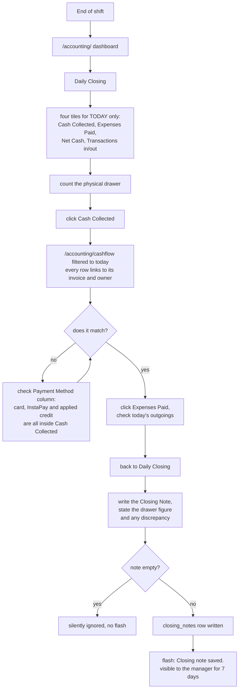

---

## Workflow 11 — Month-end reporting

### 11.1 Who, when, why

**Who.** `super_admin`, `clinic_owner`, `branch_manager`, `finance` for `/finance/reports`;
those four **plus `auditor`** for the accounting reports.

**When.** Month end, or whenever the owner asks how the clinic did.

**Why.** These are the screens that answer it — and they answer it three different ways, so
you have to know which one you are quoting.

### 11.2 The three definitions of "revenue" — read this first

| Screen | What "revenue" means there | Source |
|---|---|---|
| `/finance/reports` **Revenue** tile | `SUM(invoices.paid_amount)` where `issue_date` is in range and status is Paid/Partial — **accrual** | `models/database.py:3958-3963` |
| `/finance/` **Today's / Month Revenue** | `SUM(payments.amount)` by `received_at` — **cash** | `models/database.py:3965-3971`, `finance/routes.py:134-135` |
| `/accounting/` **Total Revenue (This Month)** | `SUM(invoices.paid_amount)` where status is Paid/Partial and **`created_at`** ≥ month start | `accounting/routes.py:29-37` |
| `/accounting/pl` **Total Revenue** | `SUM(invoice_lines.total)` joined to Paid/Partial invoices by **`issue_date`** — this is a **line-total figure, before the header discount and before tax** | `accounting/routes.py:160-179`, `:189` |
| `/accounting/cashflow` **Total Cash In** and `/accounting/closing` **Cash Collected** | the `payments` ledger by `received_at` — **cash** | `accounting/routes.py:236-259`, `:481-489` |

They will disagree, by design of the queries as written. A payment received in September
against an August invoice moves the August accrual figures and the September cash figures.
And the P&L's revenue ignores header discounts and tax entirely, so it will not equal the
finance report's Invoiced figure. KL-7 and KL-24.

> **The `/finance/reports` **Revenue** tile is mislabelled.** Its caption reads
> *"EGP collected / جنيه محصّل"* but the number it renders is `summary.revenue`, the accrual
> figure. The genuine cash figure is `summary.collected` and is not shown on that screen at
> all. KL-6.
> Source: `D:/vet/platform/templates/finance/reports.html:69-71` versus
> `D:/vet/platform/models/database.py:3945-3990`

### 11.3 Happy path — the finance report and the Excel extract

1. `/finance/` → **Full Report / التقرير الكامل →** on the revenue chart header, or type
   `/finance/reports`.
2. Set **From / من** and **To / إلى** and press **Apply / تطبيق**. Defaults are the first of
   the current month to today.
3. Six KPI tiles:
   * **💵 Revenue / الإيرادات** — accrual (see the warning above).
   * **🧾 Invoiced / الفواتير** — `SUM(total)` over everything in range except `Cancelled`.
     A credit note's negative total **reduces** this.
   * **⏳ Outstanding / المستحق** — all-time `SUM(due_amount)` over Unpaid+Partial. **Not
     filtered by your date range.**
   * **📉 Expenses / المصروفات** — `SUM(expenses.amount)` by `expense_date` in range.
   * **📊 Net / الصافي** — Revenue minus Expenses.
   * **📑 Invoices / الفواتير** — count in range, excluding `Cancelled`.
4. **📈 Daily Revenue — Last 30 Days / الإيرادات اليومية — آخر 30 يوم** — always the last 30
   days, **ignoring your date range**, on the accrual basis.
   Source: `D:/vet/platform/blueprints/finance/routes.py:856`,
   `D:/vet/platform/models/database.py:4014-4024`
5. **Revenue by Line Type / الإيرادات حسب النوع** — `invoice_lines` grouped by `line_type` for
   invoices issued in range, excluding `Cancelled`.
6. **Expenses by Category / المصروفات حسب الفئة** — for the range.
7. **🏆 Top Services / أبرز الخدمات** — `description`, `count`, `revenue` for lines with
   `line_type='service'`, **all time, not filtered by your range**, top 10 by revenue.
   Source: `D:/vet/platform/models/database.py:4048-4055`
8. Press **📊 Export Excel / تصدير Excel** in the top bar. It carries the current
   `date_from`/`date_to` through.
9. You get `finance_report_2026-08-01_2026-08-31.xlsx`, one sheet named **Invoices**, title row
   *Financial Report — 2026-08-01 to 2026-08-31*, then columns:
   **Invoice # · Date · Owner · Total · Discount · Tax · Net · Status**.
   *Total* is the invoice **subtotal** and *Net* is the invoice **total** — that naming is
   deliberate, because `invoices` has no `total_amount` or `net_amount` column.
   **Cancelled invoices are included.**
   Source: `D:/vet/platform/blueprints/finance/routes.py:920-960`

### 11.4 Happy path — the accounting P&L

1. `/accounting/` → **📋 P&L Report / الأرباح والخسائر** in the Quick Access strip, or
   `/accounting/pl`.
2. Set **From / من** and **To / إلى**, press **Apply Filter / تطبيق الفلتر**
   (**Reset / إعادة تعيين** returns to month-to-date).
3. Four summary boxes:
   * **Total Revenue / إجمالي الإيرادات** — the number itself links through to
     `/finance/invoices` for the same range, with a *View invoices / عرض الفواتير →* link
     beneath.
   * **Total Expenses / إجمالي المصروفات** — links to `/accounting/expenses` for the range.
   * **Net Profit / صافي الربح**.
   * **Profit Margin / هامش الربح**.
4. **💵 Revenue Breakdown / تفاصيل الإيرادات** — grouped by line description **and** line type:
   **Service / Item · Type · Count · Amount (EGP)**, ordered by amount.
5. **🧾 Expense Breakdown / تفاصيل المصروفات** — grouped by category:
   **Category · Count · Amount (EGP)**. Each category name links to
   `/accounting/expenses?category=…&date_from=…&date_to=…`.
6. There is **no export button** on this screen. The footnote says so:
   *"Export to PDF or Excel — use browser print / save as PDF / تصدير إلى PDF أو Excel —
   استخدم طباعة المتصفح / حفظ كـ PDF."*
   Source: `D:/vet/platform/templates/accounting/pl_report.html:86`

### 11.5 Every alternative scenario

**A. "How much did we actually take in August?"** Not on either report screen. Use
`/accounting/cashflow` with `date_from=2026-08-01&date_to=2026-08-31` and read **Total Cash
In** — that is the only date-ranged view of the payments ledger.

**B. "What is still owed?"** The **Outstanding** tile on either `/finance/` or
`/finance/reports`. Both are all-time. To see the invoices behind it,
`/finance/invoices?status=Unpaid`.

**C. "Give the accountant the invoices."** The Excel export. Remember it includes cancelled
invoices, so it will not tie to **Invoiced** without filtering the Status column.

**D. "Which services earn most?"** **Top Services** on `/finance/reports` — but it is all-time
and only counts lines whose `line_type` is exactly `'service'`, so any line saved through the
Arabic edit screen is missing from it (KL-2).

**E. "Compare to last year."** `/accounting/` has a **📊 12-Month Revenue vs Expenses /
الإيرادات مقابل المصروفات — 12 شهرًا** grouped bar chart. Note that its month buckets are
built by stepping back **28 days at a time** from the first of the current month and taking
whichever month each step lands in — an approximation, not a strict calendar walk.
Source: `D:/vet/platform/blueprints/accounting/routes.py:69-96`

**F. Auditor.** Can open `/accounting/pl`, `/accounting/cashflow`, `/accounting/expenses`,
`/accounting/closing` and `/accounting/budget`. **Cannot** open `/finance/reports` or the
Excel export, despite being named in their role lists. KL-1.

**G. Arabic UI.** Everything is translated. The Excel headers are English-only.

### 11.6 Errors and edge cases — exact messages

| What you did | What the app does | Exact message |
|---|---|---|
| Excel export failed for any reason | Redirect back to `/finance/reports` | `<the raw exception text>` (red) |
| `openpyxl` not installed | Same redirect | `openpyxl is not installed. Run: pip install openpyxl` |
| A P&L query failed | That table renders empty; the page still loads | *(no message)* |
| A cash-flow "money in" query failed | The out-side still renders | `Cash-in could not be read: <exception>` (amber) |
| A cash-flow "money out" query failed | The in-side still renders | `Cash-out could not be read: <exception>` (amber) |
| Reception or a clinician opens `/finance/reports` | Redirect to the launcher | `You don't have permission to access this page.` (red) |

Source: `D:/vet/platform/blueprints/finance/routes.py:961-963`,
`D:/vet/platform/models/excel_export.py:61-64`,
`D:/vet/platform/blueprints/accounting/routes.py:160-186`, `:236-273`

Edge cases:

* **A date range with no data** renders *"No data for this period / لا توجد بيانات لهذه
  الفترة"* and *"No expenses for this period / لا توجد مصروفات لهذه الفترة"* rather than
  blank panels.
* **`date_from` later than `date_to`** is not validated. Every `BETWEEN` returns nothing and
  every figure reads zero.
* **The Excel file streams from memory** — there is no temporary file on disk to clean up.

### 11.7 What gets written

**Nothing.** Every screen in this workflow is read-only. The Excel export writes a file to the
browser, not to the server.

### 11.8 Flowchart

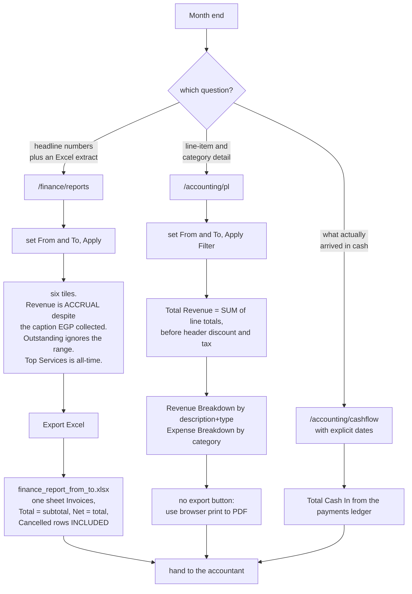

---

## Workflow 12 — Chase money that has not come in

### 12.1 Who, when, why

**Who.** Reception does the chasing; a manager usually starts it from the report.
**When.** Weekly, or when the Outstanding figure moves the wrong way.
**Why.** Outstanding is all-time and never ages out by itself.

### 12.2 Preconditions

At least one invoice with `status` in (`Unpaid`, `Partial`).

### 12.3 Happy path

1. `/finance/` — read **Outstanding / المستحق**. (The same figure is the **Outstanding** KPI on
   `/finance/reports`; both are all-time.)
2. Press **All Invoices / جميع الفواتير**, set **Status / الحالة** to **Unpaid**, press
   **Filter / تصفية**. Add a date range to work oldest-first — remember the free-text search
   only sees the newest 200 rows (KL-12).
3. Open an invoice. Look at **Bill To / فاتورة إلى** for the client's name and phone.
4. Choose how to chase:
   * **📱 Send WhatsApp / إرسال** — the message ends with the **Balance Due** line, which is
     exactly what you want here. Workflow 8, route C.
   * Phone them using the number under **Bill To**.
   * **All invoices for this client / كل فواتير هذا العميل** to see everything they owe in one
     filtered list before you call.
5. When they pay: **Record Payment** (Workflow 3), or **Apply credit** if they already have
   money on account (Workflow 5).
6. When they will never pay: a full **Credit Note** writes the balance off and cancels the
   invoice, leaving both documents and an audit-log row (Workflow 7). That is the only
   write-off mechanism in the app.

### 12.4 Every alternative scenario

**A. Partial-payment chasing.** Filter **Status = Partial** instead. The **Due / المستحق**
column is the figure to quote.

**B. One client, several unpaid invoices.** Open one and click
**All invoices for this client / كل فواتير هذا العميل**, then work down the filtered list.
The client's account page also lists every invoice of theirs with `due_amount > 0`, but only
when they hold credit — that card is gated on `balance > 0`. With no credit on account, the
filtered invoice list is the only view.
Source: `D:/vet/platform/templates/finance/owner_credit.html:71`

**C. The client disputes the amount.** If nothing has been paid, Edit it (Workflow 6). If it is
partly paid and the correction is downward past what they paid, issue a partial credit note
(Workflow 7).

**D. The client has credit and an unpaid invoice at the same time.** The **Client has credit /
للعميل رصيد** card is deliberately placed **above** Record Payment for exactly this reason —
taking cash from a client who already has money on account is the mistake it prevents.
Source: `D:/vet/platform/templates/finance/invoice_detail.html:197-199`

**E. Cancelled invoices in the way.** They carry `due_amount = 0` and are excluded from
Outstanding, so they never appear in an Unpaid filter.

**F. Arabic UI.** The list, filters and invoice are translated. The WhatsApp chase message is
English-only (KL-15) — phone instead if that matters.

### 12.5 Errors and edge cases

There is no dedicated dunning screen, no ageing bucket report, no overdue flag and nothing
that uses `invoices.due_date` — the due date is displayed on the invoice header and nowhere
else. "Overdue" is a judgement you make from the **Date** column.

All the error messages you can hit here belong to Workflow 3 (payment), Workflow 5 (credit)
and Workflow 8 (WhatsApp).

### 12.6 What gets written

Nothing until you act. Then whatever Workflow 3, 5, 7 or 8 writes.

### 12.7 Flowchart

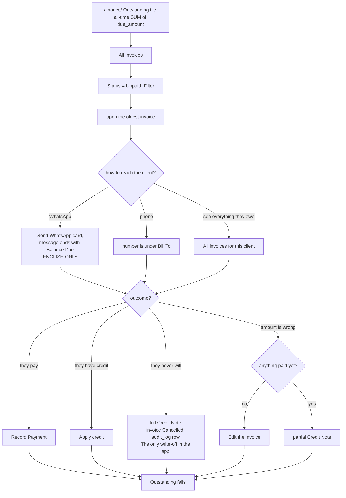

---

## Workflow 13 — Set the monthly spending target and watch it

### 13.1 Who, when, why

**Who.** Anyone with the `accounting` grant — including `auditor`, who can therefore **edit**
budget targets. There is no extra role gate on this route.
Source: `D:/vet/platform/blueprints/accounting/routes.py:540-542`

**When.** Start of the month, or the moment an **Over Budget / تجاوز الميزانية** badge shows up.

**Why.** It is the only forward-looking number in the whole finance area.

### 13.2 Preconditions

Rows in `budget_targets`. **A category with no target row never appears on this screen**, no
matter how much has been spent on it. Add it through the edit panel first.

### 13.3 Happy path

1. `/accounting/` → **💰 Budget** in the **Quick Access / وصول سريع** strip, or
   `/accounting/budget`.
2. Header: **🎯 Budget vs. Actuals / الميزانية مقابل الفعلي — August 2026**, subtitled
   *"Month-to-date spending against monthly targets / الإنفاق حتى اليوم مقابل الأهداف
   الشهرية"*, with three totals: **Total Budget / إجمالي الميزانية**,
   **Total Actual / الإجمالي الفعلي**, **Remaining / المتبقي**.
3. The table, one row per `budget_targets` row:
   **Category / الفئة** · **Budget (EGP) / الميزانية (جنيه)** ·
   **Actual (EGP) / الفعلي (جنيه)** · **Variance (EGP) / الفرق (جنيه)** (signed) ·
   **% Used / نسبة الاستخدام** as a progress bar · and a status badge:
   * **On Track / في المسار** — under 75 %
   * **Near Limit / قريب من الحد** — 75 % to 99 %
   * **Over Budget / تجاوز الميزانية** — 100 % or more
   Source: `D:/vet/platform/templates/accounting/budget.html:108-116`
4. **Actual** is `SUM(expenses.amount)` where `expense_date` is between the **first of this
   month** and **today**, and `category = <this target's category>` — **exact string match**.
   Source: `D:/vet/platform/blueprints/accounting/routes.py:566-583`
5. To change the numbers, open the collapsed
   **⚙️ Edit Budget Targets / ⚙️ تعديل أهداف الميزانية** panel at the bottom.
   * One number box per existing category, stepping in hundreds.
   * One extra row: **New category name (optional) / اسم فئة جديدة (اختياري)** plus an amount.
   * **💾 Save Budget Targets / 💾 حفظ أهداف الميزانية**, with the note
     *"Changes take effect immediately on the dashboard. / تسري التغييرات فوراً على لوحة
     التحكم."*
6. Existing categories are **UPDATE**d (stamping `updated_by` and `updated_at`); the new
   category is **upserted** on `category`, which is a `UNIQUE` column, so re-typing an existing
   name overwrites its amount rather than duplicating it.
   Source: `D:/vet/platform/blueprints/accounting/routes.py:546-565`
7. Green flash **"Budget targets saved."** and you are back on the budget page with the new
   figures.

### 13.4 Every alternative scenario

**A. First-ever setup.** The table will be empty. Use the **New category name** row, one
category per save — the panel offers exactly one new-category slot per submission.

**B. Removing a category.** Not possible from the UI. Set its target to `0`, which makes any
spending at all show as **Over Budget** with a `0` denominator (`pct_used` is forced to `0`
when the budget is `0`, so the badge logic reads it as **On Track** — a zero target is
effectively "untracked", not "banned").
Source: `D:/vet/platform/blueprints/accounting/routes.py:580`

**C. A category is over budget.** The row badge turns red. Drill in through
`/accounting/expenses?category=<name>` (the P&L's Expense Breakdown links there directly) to
see what caused it.

**D. Revenue targets.** There are none. `budget_targets` only ever holds expense targets, and
nothing on this screen mentions income.

**E. Arabic UI.** The screen is translated, **but** the exact-string match on category is the
same trap as everywhere else: a target saved as `Rent` never matches expenses recorded as
`الإيجار`. Both will appear — the target with `Actual = 0`, and the Arabic spend on no row at
all, because it has no target. KL-2.

**F. Mid-month reading.** **Actual** is month-**to-date**, so 40 % used on the 10th is on
track, and 40 % used on the 28th is under-spending. The screen does not pro-rate.

### 13.5 Errors and edge cases — exact messages

| What you did | What the app does | Exact message |
|---|---|---|
| Saved successfully | Redirect back to `/accounting/budget` | `Budget targets saved.` (green) |
| A non-numeric amount in any box | That box is treated as `0.0`; the save continues | *(no message — the target silently becomes zero)* |
| Database error | Redirect back | `Error saving budget: <exception>` (red) |
| Left the new-category name blank | The new-category row is skipped; the existing rows still save | `Budget targets saved.` |
| JavaScript disabled | 403 page — this form posts `csrf_token`, not `_csrf_token` | `Invalid or missing security token. Please go back and try again.` |

Source: `D:/vet/platform/blueprints/accounting/routes.py:546-570`,
`D:/vet/platform/templates/accounting/budget.html:148`

Edge case: **an actual-spend query that fails is swallowed** and that category shows
`Actual = 0`, which reads as healthy. If a category looks suspiciously untouched, check the
expense list directly.
Source: `D:/vet/platform/blueprints/accounting/routes.py:566-582`

### 13.6 What gets written, and what changes elsewhere

**Written:** `budget_targets.monthly_egp`, `updated_by`, `updated_at` for each existing
category, plus an insert-or-update for the new category. No expenses are touched.

**Screens that change:** only `/accounting/budget` itself. Despite the on-screen note about
"the dashboard", `/accounting/` does not read `budget_targets` at all — its tiles and charts
are built from `invoices` and `expenses` only.
Source: `D:/vet/platform/blueprints/accounting/routes.py:21-152`

### 13.7 Flowchart

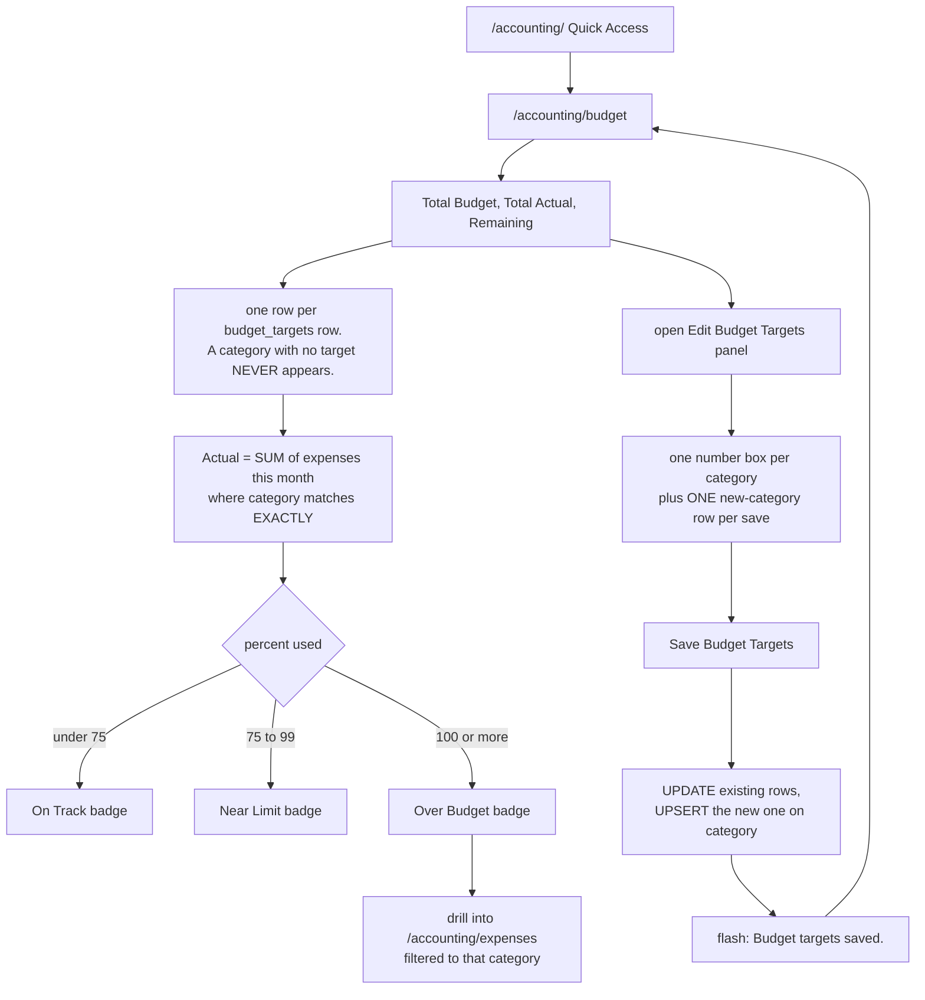

---

## Known limits

Everything below is a real behaviour of the code as it stands today. None of it is described
above as if it worked. Do not train staff on the version you wish existed.

**KL-1 — `auditor` cannot open three screens its role list names.**
`/finance/expenses`, `/finance/reports` and `/finance/reports/export/xlsx` all carry
`@role_required(..., "auditor")`, but `auditor` does not hold the `invoicing` grant, so the
blueprint gate denies it first. The `auditor` entry in those three lists is dead.
`D:/vet/platform/blueprints/finance/routes.py:767`, `:847`, `:913` versus
`D:/vet/platform/models/database.py:4378`

**KL-2 — the Arabic UI corrupts stored category and line-type values.**
The expense-category `<option>` tags on both expense forms, and the `line_type` `<select>` on
the invoice **edit** form, carry no `value=` attribute, so the browser submits the translated
label. Arabic sessions store `الإيجار` where English sessions store `Rent`, and `خدمة` where
English stores `service`. Consequences: expense grouping and budget matching split by UI
language; `get_top_services` (which filters `line_type='service'`) and the **Revenue by Line
Type** chart lose those lines. The new-invoice and new-estimate forms are correct.
`D:/vet/platform/templates/finance/expenses_list.html:104-113`,
`D:/vet/platform/templates/accounting/expenses_list.html:126-134`,
`D:/vet/platform/templates/finance/invoice_edit.html:85`,
`D:/vet/platform/models/database.py:4048-4055`

**KL-3 — the printed receipt never lists the payments.**
`db.get_invoice()` hard-sets `payments = []`; only the invoice *detail* route backfills the
real rows. The **Payment History / سجل المدفوعات** block in `invoice_print.html` is therefore
unreachable, and the same is true of the PDF, which is built from the same dict.
`D:/vet/platform/models/database.py:3634`, `D:/vet/platform/blueprints/finance/routes.py:326-330`,
`D:/vet/platform/templates/finance/invoice_print.html:112-123`

**KL-4 — the invoice edit screen does not clamp the header discount.**
`create_invoice()` clamps `discount_amount` to `0 … subtotal`; the edit route does not. On an
unpaid invoice a fixed discount larger than the subtotal stores a **negative** total and
`due_amount`, and the status is derived as **Paid**. The `total < paid_amount` guard only
catches it once something has been paid.
`D:/vet/platform/blueprints/finance/routes.py:490-510` versus
`D:/vet/platform/models/database.py:3589-3593`

**KL-5 — estimates never expire.**
`Expired` is offered in the list filter and named in the schema comment, but no code path ever
writes it; `estimate_decide` accepts only `Sent`, `Approved` and `Declined`. The expiry banner
on the estimate detail is computed in the template from `valid_until` at render time and
changes nothing.
`D:/vet/platform/models/database.py:1646`, `D:/vet/platform/blueprints/finance/routes.py:1083`,
`D:/vet/platform/templates/finance/estimate_detail.html:46-52`

**KL-6 — the `/finance/reports` Revenue tile is mislabelled.**
Caption *"EGP collected / جنيه محصّل"*, value `summary.revenue` — which
`get_finance_summary` explicitly documents as the **accrual** figure. The cash figure
(`summary.collected`) is computed and never shown on that screen.
`D:/vet/platform/templates/finance/reports.html:69-71`, `D:/vet/platform/models/database.py:3945-3990`

**KL-7 — four different definitions of revenue.**
`/accounting/` sums `invoices.paid_amount` by `created_at`; `/accounting/pl` sums
`invoice_lines.total` by `issue_date`; `/finance/reports` sums `invoices.paid_amount` by
`issue_date`; `/accounting/cashflow` and `/accounting/closing` sum the `payments` ledger by
`received_at`. They will disagree whenever a payment lands in a different month from its
invoice, and the P&L will disagree with everything because it ignores header discounts and tax.
`D:/vet/platform/blueprints/accounting/routes.py:29-37`, `:160-179`, `:236-259`, `:481-489`,
`D:/vet/platform/models/database.py:3958-3971`

**KL-8 — navigation gaps.**
`base.html` links only `finance.dashboard` and `accounting.dashboard`. There is **no link
anywhere** to `/finance/expenses`, and none to `/finance/estimates` except the button on
`/finance/invoices`. A client's credit account is reachable only from the CRM owner page or
from an invoice that already shows credit. Bookmark them.
`D:/vet/platform/templates/base.html:185-196`

**KL-9 — a hand-made invoice can never be linked to a visit.**
`invoice_new` reads `visit_id` from the form, but `invoice_form.html` has no such field. The
**Visit → / الزيارة ←** link on the invoice detail therefore never appears for a hand-made
invoice. `/visits/<id>/invoice` redirects to `/finance/invoices/new?visit_id=<id>`, and the
query string is ignored.
`D:/vet/platform/blueprints/finance/routes.py:277`, `D:/vet/platform/blueprints/visits/routes.py:601-603`

**KL-10 — five POST forms depend on JavaScript for their CSRF token.**
New Invoice, Record Expense (finance), Add Expense (accounting) and Save Closing Note carry no
`_csrf_token`; Save Budget Targets posts a field named `csrf_token`, which the server does not
read. All five work only because `platform.js` injects the correct field at submit time. With
JavaScript off they return the 403 page.
`D:/vet/platform/static/js/platform.js:131-146`, `D:/vet/platform/templates/accounting/budget.html:148`

**KL-11 — the expense forms do not use the money parser.**
`/finance/expenses` parses with a bare `float()` (a junk string is a 500);
`/accounting/expenses/new` uses `try/except` → `0.0` (a junk string becomes "amount required").
Neither accepts `1,200` or `١٢٠٠`, even though `money.form_amount` handles both everywhere else
in this module.
`D:/vet/platform/blueprints/finance/routes.py:771`, `D:/vet/platform/blueprints/accounting/routes.py:386-390`

**KL-12 — the invoice search only searches the newest 200 invoices.**
`db.list_invoices(limit=200)` runs first; the free-text `q` filter is applied in Python
**after** that slice. Status and date filters *are* applied in SQL. The estimates list caps at
100 with no search at all.
`D:/vet/platform/blueprints/finance/routes.py:158-179`, `D:/vet/platform/models/database.py:3729-3738`

**KL-13 — there is no screen that refunds a captured payment.**
`models/payments.refund()` exists and is complete (it writes a negative ledger row rather than
editing the original), but **no finance route calls it**. Money goes back to a client only as a
credit note, or as a refund of unspent account credit — and in both cases the app records the
paperwork while a human moves the actual money.
`D:/vet/platform/models/payments/__init__.py:203-249`

**KL-14 — loyalty points are awarded on only one path.**
`/finance/invoices/<id>/pay` awards them. Credit applied through `apply_credit` goes to
`db.add_payment` directly and awards nothing, and the one-page exam screen's payment does the
same. `_REDEEM_RATE` and `_MIN_REDEEM` are defined in the finance blueprint and never used —
there is no redemption screen in finance.
`D:/vet/platform/blueprints/finance/routes.py:59-62`, `:403-411`, `D:/vet/platform/models/database.py:3865-3868`

**KL-15 — the WhatsApp invoice message is English-only with the brand hardcoded.**
It does not call `t()` and does not read the clinic's own name; `🐾 *Aleefy*`,
`Thank you for choosing Aleefy 🐾` and `Happy Pets, Healthy Lives` are literals.
`D:/vet/platform/blueprints/finance/routes.py:713-734`

**KL-16 — credit notes look like ordinary invoices in the register.**
They appear on `/finance/invoices` with status **Paid** and a negative **Total**, drag the
footer totals down, and reduce the **Invoiced** KPI on `/finance/reports` (that KPI counts
everything except `Cancelled`). There is no separate credit-note view or filter.
`D:/vet/platform/blueprints/finance/routes.py:616-626`, `D:/vet/platform/models/database.py:3971-3973`

**KL-17 — the deposit form has its own payment-method list.**
The invoice screen's methods come from the gateway registry (`payments.available()`); the
deposit form on `owner_credit.html` hardcodes **Cash / Instapay / Card / Transfer**. The two
screens can therefore offer different methods, and the deposit values never pass through
`gateway_for_method`.
`D:/vet/platform/templates/finance/owner_credit.html:136-141` versus
`D:/vet/platform/templates/finance/invoice_detail.html:249-255`

**KL-18 — a rejected form is re-rendered empty.**
New Invoice, New Estimate and Edit Invoice all discard the posted values on a validation
failure. A long invoice rejected for a missing owner must be retyped from scratch.
`D:/vet/platform/blueprints/finance/routes.py:221-230`, `:263-272`, `:288-299`, `:485-488`, `:1012-1014`

**KL-19 — a quote can convert to a different total.**
`_money()` (used by estimates) does **not** clamp the header discount to the subtotal;
`create_invoice()` does. A quote with a fixed discount larger than its subtotal shows a
negative total and converts to a `0.00` invoice. Every other case is genuinely identical,
which is what the shared arithmetic was for.
`D:/vet/platform/models/database.py:3702-3715` versus `:3589-3593`

**KL-20 — the Due Date typed on New Invoice is silently discarded.**
`invoice_new` reads `due_date` into the data dict, but `create_invoice()`'s INSERT does not
include a `due_date` column. The only way to set a due date is the **Edit Invoice** screen,
whose UPDATE does write it.
`D:/vet/platform/blueprints/finance/routes.py:280` and `D:/vet/platform/models/database.py:3600-3608`
versus `D:/vet/platform/blueprints/finance/routes.py:522-535`

**KL-21 — apply-credit reports the wrong reason for a bad amount.**
The route calls `money.form_amount(...)[0]` and throws the error string away, so `"12x"`
becomes `0.0` and the user is told *"the amount to apply must be positive"* rather than that
the number was unreadable. The pay and credit-note routes handle this correctly.
`D:/vet/platform/blueprints/finance/routes.py:1186`

**KL-22 — editing an invoice loses every line's catalogue link.**
The edit route deletes all `invoice_lines` and re-inserts them without `item_id`, which
`create_invoice()` does populate. Any reporting that joins lines to catalogue items breaks
after the first edit.
`D:/vet/platform/blueprints/finance/routes.py:516-521` versus `D:/vet/platform/models/database.py:3609-3616`

**KL-23 — `expenses.payment_method` does not exist.**
It is not in the SQLite schema, not in the PostgreSQL schema, and not in any migration. The
accounting add-expense route attempts an INSERT including it, that INSERT raises, and it
silently retries without the column. So the **Payment Method** dropdown on
`/accounting/expenses` is decorative and the **Method / طريقة الدفع** column on the same page
renders `—` on every row.
`D:/vet/platform/models/database.py:1762-1774`,
`D:/vet/platform/blueprints/accounting/routes.py:399-414`,
`D:/vet/platform/templates/accounting/expenses_list.html:96`

**KL-24 — the P&L's revenue is a line-total figure.**
`/accounting/pl` sums `invoice_lines.total`, so it excludes the invoice-header discount and
excludes tax. It will not tie to `/finance/reports` **Invoiced**, nor to
`invoices.paid_amount`, on any invoice that carries a header discount or a tax rate.
`D:/vet/platform/blueprints/accounting/routes.py:160-179`, `:189`

**KL-25 — invoice numbering collides after a deletion.**
`_next_invoice_number()` is `COUNT(*) + 1`, and `invoice_number` is `UNIQUE`. Delete any
invoice row and the next creation fails with a UNIQUE constraint error. The estimate numbering
uses `MAX(id) + 1` on purpose and does not have this problem.
`D:/vet/platform/models/database.py:3572-3576`, `:3689-3697`

**KL-26 — expenses cannot be edited or deleted.**
Neither expense screen offers either operation, and no route exists. A mistake has to be
corrected with a second, opposing entry or fixed in the database.

**KL-27 — a second partial credit note is checked against the wrong figure.**
The `amount > inv_total` guard compares against the invoice's **original** total, not against
what is left after earlier partial credits. Two partial credits of 1,000 each are both accepted
on an 1,850 EGP invoice.
`D:/vet/platform/blueprints/finance/routes.py:588-591`

**KL-28 — voiding a paid invoice leaves the money recorded as received.**
A full credit note sets the original to `Cancelled` with `due_amount = 0`, but `paid_amount`
and every `payments` row stay exactly as they were. The client's cash is still on the ledger,
on the cash flow and in the daily closing. Nothing in the app gives it back — see KL-13.

**KL-29 — `invoices.due_date` drives nothing.**
It is displayed on the invoice header and the print page and used nowhere else. There is no
overdue flag, no ageing report, no dunning list and no reminder.

**KL-30 — the budget page's own note is wrong about the dashboard.**
*"Changes take effect immediately on the dashboard"* — but `/accounting/` never reads
`budget_targets`. The targets affect only `/accounting/budget`.
`D:/vet/platform/templates/accounting/budget.html:191`, `D:/vet/platform/blueprints/accounting/routes.py:21-152`

**KL-31 — the 12-month chart's buckets are approximate.**
Months are generated by stepping back in **28-day** increments from the first of the current
month and taking whichever month each step lands in, rather than by walking the calendar. The
label sequence is close but not guaranteed to be one distinct month per bar.
`D:/vet/platform/blueprints/accounting/routes.py:69-76`

**KL-32 — Recent Transactions sorts dates against datetimes.**
Invoices carry `created_at` (`'2026-08-19 14:03:11'`) and expenses carry `expense_date`
(`'2026-08-19'`). The merge sorts those strings directly, so a same-day expense always sorts
below a same-day invoice.
`D:/vet/platform/blueprints/accounting/routes.py:100-128`

**KL-33 — "Cash Collected" on the daily closing is not only cash.**
It sums every `payments` row for today regardless of method, so card, InstaPay, insurance and
applied account credit are all inside that figure. Split it on `/accounting/cashflow` using the
**Payment Method** column before comparing against the drawer.
`D:/vet/platform/blueprints/accounting/routes.py:481-489`

**KL-34 — the cash flow labels every expense "Cash".**
The money-out query hardcodes `'Cash' AS payment_method`. It could not do otherwise, because
the column does not exist (KL-23).
`D:/vet/platform/blueprints/accounting/routes.py:264-268`

**KL-35 — two panels on `/finance/reports` ignore your date range.**
**Daily Revenue — Last 30 Days** is always the last 30 days, and **Top Services** is all-time.
Only the six KPI tiles, **Revenue by Line Type** and **Expenses by Category** honour the range.
`D:/vet/platform/blueprints/finance/routes.py:856`, `:881`

**KL-36 — reception cannot reconcile the till.**
`/accounting/closing` needs the `accounting` grant, which reception does not hold by default.
If reception holds the drawer, either a manager closes the day or reception's role has to be
granted `accounting` on the Roles screen — which also hands them the P&L and the cash flow.
`D:/vet/platform/models/database.py:4366-4370`

---

## Could not verify

* **No live database was opened and no browser session was run.** Everything here is a static
  read of the source. The role behaviour on any given install depends on the contents of the
  `roles` table, which was not inspected; the grants quoted are `DEFAULT_ROLE_PERMISSIONS`,
  which `seed_default_permissions()` applies only to roles whose `permissions_json` is still
  empty.
  `D:/vet/platform/models/database.py:4384-4400`
* **The PDF path was read but not exercised.** `fpdf2` is declared in `requirements.txt` but
  was not importable in the shell used for this review, so the fallback-to-print behaviour is
  documented from the code, not from a run.
* **Exact rendered Arabic string widths and RTL layout** were not visually checked; the
  bilingual pairs quoted are the literal `t(en, ar)` arguments in the templates.
* **Paymob** was read only far enough to confirm `configured()` requires all three keys. Its
  checkout and callback behaviour was not traced end to end.

---

## Quick reference

### The five rules that keep the money straight

1. **Never edit a paid invoice.** The app refuses; issue a credit note.
2. **Look for the *Client has credit* card before taking cash.** It sits above Record Payment
   on purpose.
3. **Pick one language for expense entry and line-type editing, and stay on it.** KL-2.
4. **Reference numbers matter.** The InstaPay or transfer number you type is the key you will
   reconcile the bank statement with, and it survives to the ledger untouched.
5. **A rejected form loses what you typed.** Get the owner and at least one line right before
   you press the button.

### Bookmarks worth keeping (nothing links to them)

* `/finance/expenses` — the finance-side expense ledger
* `/finance/estimates` — quotes (only linked from the invoices list)
* `/finance/owners/<owner_id>/credit` — a client's deposit account
* `/accounting/closing` — daily till reconciliation
* `/accounting/budget` — monthly expense targets

### Which screen answers which question

| Question | Screen |
|---|---|
| What did we take today? | `/finance/` **Today's Revenue**, or `/accounting/closing` **Cash Collected** |
| What are we owed, in total, ever? | `/finance/` or `/finance/reports` **Outstanding** |
| Who owes it? | `/finance/invoices?status=Unpaid` |
| What did we bill this month? | `/finance/reports` **Invoiced** |
| What did we spend? | `/finance/reports` **Expenses**, or `/accounting/pl` **Expense Breakdown** |
| Did we make money? | `/accounting/pl` **Net Profit** — but read KL-7 and KL-24 first |
| What actually moved through the till in a period? | `/accounting/cashflow` with explicit dates |
| Are we over budget? | `/accounting/budget` |
| Give the accountant a file | `/finance/reports` → **Export Excel** |

### Money-status transitions

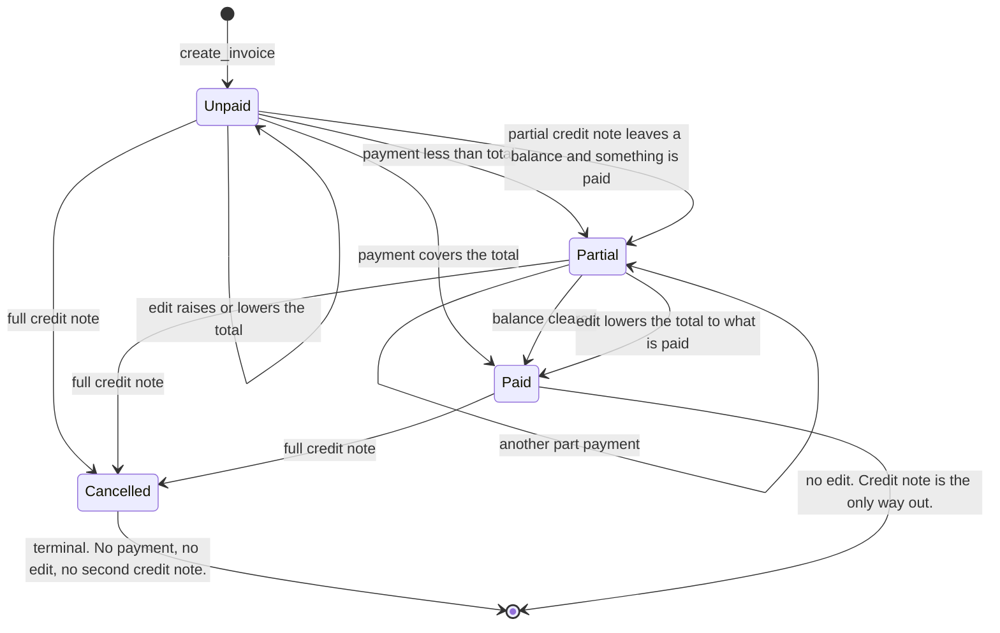

---

*Verified against source on 2026-08-19. Files read in full: `blueprints/finance/routes.py`
(1191 lines), `blueprints/accounting/routes.py` (625 lines), all 13 `templates/finance/*.html`,
all 6 `templates/accounting/*.html`, `models/money.py`, `models/payments/__init__.py`,
`models/payments/cash.py`, plus the finance, estimate, credit, payment, permission and schema
sections of `models/database.py`, the invoice-creating paths in `blueprints/visits/routes.py`,
the CSRF and context-processor sections of `app.py`, and the permission decorators in
`blueprints/auth/routes.py`.*
