# Front Desk — Clients, Patients, Appointments and the Walk-in Visit

**Modules:** `crm` (`/crm/…`), `appointments` (`/appointments/…`), `workflow` (`/workflow/`)
**Blueprints:** `blueprints/crm/routes.py`, `blueprints/appointments/routes.py`, `blueprints/workflow/routes.py`
**Templates:** `templates/crm/`, `templates/appointments/`, `templates/workflow/`

This chapter documents **only what the code does today**. Every claim was read out of
the route function or the template that produces it, and each section ends with a
`Source` line so the next writer can check it. Where a screen promises something it
does not deliver, that is written down as a limit — not described as a feature.

Nothing in this chapter was exercised in a browser. It is read from source.

---

## 0. Before you start

### 0.1 Every screen in this chapter

| # | Screen | URL | What it is |
|---|--------|-----|------------|
| 1 | Owners & Clients | `GET /crm/owners` | Paginated client list, 20 a page |
| 2 | New Owner | `GET\|POST /crm/owners/new` | Register a client |
| 3 | Client 360 | `GET /crm/owners/<owner_id>` | Everything about one client |
| 4 | Edit Owner | `GET\|POST /crm/owners/<owner_id>/edit` | Correct a client |
| 5 | Redeem points | `POST /crm/owners/<owner_id>/redeem-points` | Action only — no page |
| 6 | Adjust points | `POST /crm/owners/<owner_id>/adjust-points` | Action only — no page |
| 7 | All Pets | `GET /crm/pets` and `GET /crm/pets/` | Card grid of patients |
| 8 | New Pet | `GET\|POST /crm/pets/new?owner_id=N` | Register a patient |
| 9 | Patient record | `GET /crm/pets/<pet_id>` | Timeline, vaccinations, weights |
| 10 | Edit Pet | `GET\|POST /crm/pets/<pet_id>/edit` | Correct a patient |
| 11 | Medical History PDF | `GET /crm/pets/<pet_id>/history.pdf` | Downloadable report |
| 12 | Owner pets JSON | `GET /crm/owners/<owner_id>/pets-json` | JSON — no template uses it |
| 13 | Owner search JSON | `GET /crm/owners/search-json` | JSON behind every client type-ahead |
| 14 | Daily schedule | `GET /appointments/` and `/appointments/schedule` | Hour-by-hour agenda |
| 15 | Week calendar | `GET /appointments/calendar` | Seven-day grid |
| 16 | New Appointment | `GET\|POST /appointments/new` | Booking form |
| 17 | Appointment detail | `GET /appointments/<appt_id>` | One booking + status buttons |
| 18 | Update status | `POST /appointments/<appt_id>/status` | Action only — no page |
| 19 | Reschedule | `GET\|POST /appointments/<appt_id>/edit` | Move a booking |
| 20 | Slots JSON | `GET /appointments/api/slots` | JSON behind the slot pickers |
| 21 | Reception Workspace | `GET /appointments/reception` | Today + lookup + check-in |
| 22 | Pets JSON | `GET /appointments/api/pets` | JSON behind the pet dropdown |
| 23 | No-show risk JSON | `GET /appointments/api/risk-score/<owner_id>` | JSON behind the risk badge |
| 24 | Waiting-room TV | `GET /appointments/waiting-room` | Public display, token-gated |
| 25 | Queue JSON | `GET /appointments/api/queue` | JSON, same gate as the TV |
| 26 | New Visit (one page) | `GET /workflow/` | The whole walk-in on one screen |
| 27 | Workflow reads | `GET /workflow/api/owners`, `/api/today`, `/api/owner/<id>/pets`, `/api/visit/<id>`, `/api/pet/<id>/history` | JSON only — this blueprint never writes |

Source: `blueprints/crm/routes.py:217,245,321,446,491,536,543,567,657,686,763,819,896`;
`blueprints/appointments/routes.py:162,163,223,272,394,428,456,544,559,612,696,801,842`;
`blueprints/workflow/routes.py:36,57,98,131,148,201`

### 0.2 Who can open what

Two gates run and **both** must pass:

1. **The module grant.** `login_required` looks up the blueprint's permission key and
   checks the signed-in role holds it. Blueprint → key mapping: `crm` → `patients`,
   `appointments` → `appointments`, `workflow` → `visits`, `clinical` → `visits`,
   `finance` → `invoicing`.
2. **A role list on the route**, where one exists. No route in this chapter carries
   `role_required(...)` — every route here is `@login_required` only. A grant can only
   ever narrow, never widen.

Source: `blueprints/auth/routes.py:59-69, 89-134, 140-151, 167-194`

**Shipped role grants (both `data/platform.db` and `data/demo.db` agree):**

| Role | patients | appointments | visits | invoicing |
|------|:--------:|:------------:|:------:|:---------:|
| super_admin | bypasses every check | | | |
| clinic_owner | yes | yes | yes | yes |
| branch_manager | yes | yes | yes | yes |
| doctor | yes | yes | yes | **no** |
| nurse | yes | yes | yes | **no** |
| **reception** | yes | yes | **no** | yes |
| pharmacist | yes | no | yes | no |
| groomer | yes | yes | no | no |
| boarding_staff | yes | yes | no | no |
| finance | no | no | no | yes |
| inventory_mgr, hr, support_admin, auditor | no | no | no | no |

Source: `models/database.py:4346-4379`; verified against the `roles` table in
`data/platform.db` and `data/demo.db`

**The consequence that matters most at a front desk:** a `reception` user **cannot open
the New Visit page**. `/workflow/` is mapped to the `visits` key and `reception` does
not hold it. Clicking `New Visit / زيارة جديدة` in the sidebar produces a red flash
`You don't have permission to access this page.` and a bounce to the dashboard. The
sidebar shows that link to every signed-in user with no role condition — and the comment
directly above it in the template calls it "for reception the most-used entry point".
Source: `blueprints/auth/routes.py:150`; `models/database.py:4365-4367`;
`templates/base.html:110-117`; `blueprints/auth/routes.py:131-134`

**What being denied looks like:** flash `You don't have permission to access this page.`
and a redirect to `/` (the launcher). Nothing is written. If the request path starts
with `/api/` **or** the browser asked for JSON, a `403 {"ok": false, "error": "forbidden"}`
comes back instead.
Source: `blueprints/auth/routes.py:129-134`

### 0.3 How to get in

- **Sidebar, CLINIC group:** `Dashboard / لوحة التحكم`, `New Visit / زيارة جديدة`,
  `Appointments / المواعيد`, `Pets & Owners / الملاك والحيوانات`. No role condition on
  any of them.
  Source: `templates/base.html:106-125`
- **Sidebar, further down:** `Waiting Room TV / شاشة الانتظار`, opened in a new tab, with
  no `?t=` token on the link.
  Source: `templates/base.html:282-285`
- **Dashboard header buttons:** `+ New Appointment / موعد جديد` → `/appointments/new`,
  and `+ Add Pet / إضافة حيوان` → `/crm/pets/new` (which cannot work — see Workflow 2,
  Known limits).
  Source: `templates/launcher.html:336-339`
- **Reception Workspace has no link anywhere.** `/appointments/reception` is not in the
  sidebar, not on the dashboard, and not referenced by any template. It is reachable
  only by typing the URL.
  Source: grep over `templates/` finds no `appointments.reception` link outside
  `reception.html` itself

### 0.4 Arabic and English

Every label in this chapter is bilingual through the `t('English','عربي')` helper. The
language comes from the signed-in user's `language` column, then the session, then
`PLATFORM_DEFAULT_LANG`, then `en`. The `EN` / `عربي` buttons at the bottom of the
sidebar POST to `/settings/lang` and reload. Choosing `عربي` also flips the whole page
to `dir="rtl"`.
Source: `app.py:377-378, 406-408`; `templates/base.html:2-3, 341-345`

A second helper, `loc(row, 'full_name')`, shows the **record's own** Arabic name when
the interface is Arabic and `full_name_ar` is filled in, falling back to the Latin one.
It is used on the client list and in the Client 360 page heading — **not** on the
Client 360 info card, which prints `owner.full_name` and then `owner.full_name_ar`
underneath it, and **not** anywhere on the appointment, pet or workflow screens, which
all render the Latin column only.
Source: `app.py:410-438`; `templates/crm/owners_list.html:240`;
`templates/crm/owner_detail.html:4, 297-300`

### 0.5 Money, dates, phone numbers

- **Currency is EGP** and is written as plain text next to the number
  (`{{ "%.2f"|format(bal) }} {{ t('EGP','جنيه') }}`). No formatting library is involved.
  Source: `templates/crm/owners_list.html:259`; `templates/crm/owner_detail.html:480`
- **Dates are ISO `YYYY-MM-DD` text** in the database and are sliced with `[:10]` for
  display. The schedule header is the only place a friendly date is produced
  (`%A, %d %B %Y` — "Tuesday, 19 August 2026").
  Source: `templates/appointments/schedule.html:166`
- **Times are `HH:MM` text.** Bookable slots run 08:00–19:30 in 30-minute steps; the
  agenda columns run 08:00 to 20:00.
  Source: `blueprints/appointments/routes.py:109-116, 179`
- **Phone numbers are normalised before any duplicate check.** Arabic-Indic digits are
  folded to ASCII, everything non-digit is dropped, and the Egyptian country code is
  removed, so `0100 123 4567`, `+201001234567` and `٠١٠٠١٢٣٤٥٦٧` are one number to the
  duplicate guard. The value the user typed is stored exactly as typed.
  Source: `models/database.py:3081-3099`
- **Invoice numbers** are `INV-<year>-<5 digits>`, the digits being `COUNT(*)+1` over the
  whole invoices table.
  Source: `models/database.py:3572-3576`

### 0.6 JavaScript is not optional

Almost no form in this chapter ships a CSRF field. `static/js/platform.js` injects
`_csrf_token` into every POST form on submit, in the capture phase. The server accepts
only `_csrf_token` (form field), `X-CSRF-Token` (header) or a JSON `_csrf_token`.

Three forms ship `name="csrf_token"` — the wrong name — and survive only because the
same injector adds the right one alongside: the loyalty Redeem form, the Manual
Adjustment form, and the Reschedule form.

**With JavaScript disabled, every write in this chapter fails** with the full-page 403
`Invalid or missing security token. Please go back and try again.`
Source: `static/js/platform.js:131-146`; `app.py:350-357`;
`templates/crm/owner_detail.html:663, 685`; `templates/appointments/appt_edit.html:13`

---

## Workflow 1 — Register a new client

### 1.1 Who, when, why

The receptionist, when somebody walks in or phones who is not on file. A client record
must exist before a pet, an appointment, a visit or an invoice can exist — every one of
those tables carries `owner_id`.

### 1.2 Preconditions

- Signed in with a role holding the `patients` grant (reception, doctor, nurse,
  pharmacist, groomer, boarding_staff, branch_manager, clinic_owner, super_admin).
- Nothing else. A client needs no pet, no appointment and no money.

### 1.3 The happy path

1. **Sidebar → `Pets & Owners / الملاك والحيوانات`.** You land on `/crm/owners`, titled
   `Owners & Clients / الملاك والعملاء`, subtitled `<N> registered clients / عميل مسجل`.
   The table is Owner / Phone / Pets / Balance / Status / Actions, twenty rows a page.
   Source: `templates/crm/owners_list.html:3-6, 222-232`; `blueprints/crm/routes.py:19, 217-243`

2. **Before creating anything, search.** Type into
   `Search by name, phone, or email… / ابحث بالاسم أو الهاتف أو البريد…` and press
   `🔍 Search / بحث`. The server matches `full_name`, `phone`, `whatsapp_phone` and
   `email` with `LIKE %term%`. If the client is already there, stop — open them instead.
   Source: `templates/crm/owners_list.html:212-218`; `models/database.py:3036-3042`

3. **Press `➕ New Owner / مالك جديد`** at the top right. You land on `/crm/owners/new`,
   page title `New Owner`, subtitle `Register a new client / تسجيل عميل جديد`.
   Source: `templates/crm/owners_list.html:8-12`; `templates/crm/owner_form.html:3-5`

4. **Card 1 — `👤 Basic Information / البيانات الأساسية`.**
   - `Full Name (English) / الاسم الكامل (إنجليزي)` **required**, placeholder
     `e.g. Ahmed Hassan / مثال: أحمد حسن`. Type `Ahmed El Gohary`.
   - `Full Name (Arabic) / الاسم الكامل (عربي)` — RTL input. Type `أحمد الجوهري`.
   - `Preferred Doctor / الطبيب المفضل` — free text, no dropdown, placeholder taken from
     the clinic's own `doctor_name`. Type `Dr. Hatem El Khateeb` or leave blank.
   Source: `templates/crm/owner_form.html` Basic Information card

5. **Card 2 — `📞 Contact Details / بيانات التواصل`.**
   - `Phone / الهاتف`, placeholder `+20 10X XXX XXXX`. Type `01001234567`.
   - `WhatsApp Number / رقم واتساب`, hint
     `Leave blank if same as phone / اتركه فارغاً إذا كان نفس رقم الهاتف`.
   - `Email Address / البريد الإلكتروني`.
   - `Preferred Contact Method / وسيلة التواصل المفضلة` — `WhatsApp / واتساب`,
     `Phone / الهاتف`, `Email / البريد الإلكتروني`. Defaults to WhatsApp.
   - `Address (English) / العنوان (إنجليزي)`, placeholder
     `Street, Area, City / الشارع، المنطقة، المدينة`. Type
     `12 Ahmed Fakhry St, Nasr City, Cairo`.
   - `Address (Arabic) / العنوان (عربي)` — RTL.
   Source: `templates/crm/owner_form.html` Contact Details card

6. **Card 3 — `⚙️ Preferences & Notes / التفضيلات والملاحظات`.**
   - `Mark as VIP Client / تعيين كعميل مميز` — unticked by default.
   - `Consent to receive reminders & offers / الموافقة على استقبال التذكيرات والعروض`
     — **ticked** by default on this form.
   - `Internal Notes / ملاحظات داخلية`.
   Source: `templates/crm/owner_form.html` Preferences card

7. **Press `✅ Create Owner / إنشاء مالك`.**

8. **You land on the Client 360** at `/crm/owners/<id>` with a green flash
   `Owner 'Ahmed El Gohary' created successfully.` The heading is the client's name (the
   Arabic one if the interface is Arabic and one was typed), the subtitle is
   `Owner Profile / ملف المالك — ID #<id>`, and the five stat tiles read Pets 0,
   Total Visits 0, Balance EGP 0, Last Visit —, No-Shows 0.
   Source: `blueprints/crm/routes.py:296-306`; `templates/crm/owner_detail.html:4-5, 382-408`

### 1.4 Every alternative that genuinely branches

- **Registering from inside the New Visit page.** Step 1 of `/workflow/` has a
  `+ New client / عميل جديد` button that opens a six-field inline form —
  `Full name / الاسم بالكامل` (required), `Name (Arabic) / الاسم بالعربية`,
  `Phone / الهاتف` (required), `WhatsApp / واتساب`, `Email / البريد`,
  `Address / العنوان`. It POSTs to the same `/crm/owners/new` route. Whatever you had
  already typed in the search box is carried across: an all-digit string goes into the
  phone field, anything else into the name field.
  **Differences from the full form:** no Arabic address, no preferred doctor, no VIP, no
  notes, `preferred_contact` is forced to `WhatsApp`, `whatsapp_phone` defaults to the
  phone, and — because the form sends no `marketing_consent` field — the client is saved
  with **marketing consent off**, where the full form defaults it on.
  Source: `templates/workflow/index.html:468-495, 848-911`; `blueprints/crm/routes.py:260`

- **The client exists but you did not find them.** The New Visit page looks the number up
  *before* creating anything. On an exact phone match it shows
  `This mobile number already belongs to <name>. Opening that client — one mobile number,
  one client file.` and opens that client's file instead of creating a second record. If
  the exact-string check misses (because the number is stored in a different format) and
  the server answers 409, the page searches again and opens the first match with the same
  message.
  Source: `templates/workflow/index.html:872-901`

- **Editing an existing client** uses the identical three-card form. The button reads
  `💾 Save Changes / حفظ التغييرات`, a hidden `_seen_updated_at` field is added, and the
  top bar offers `← Back to Profile / ← العودة إلى الملف`.
  Source: `templates/crm/owner_form.html:5-16`; `blueprints/crm/routes.py:567-648`

### 1.5 Errors and edge cases — the exact messages

| What you did | What you see | HTTP |
|---|---|---|
| Left the English name blank | `Full name is required.` (red); the form re-renders with what you typed | 200 |
| Used a mobile another client already holds | `Ahmed El Gohary already uses this mobile number. Open Ahmed El Gohary instead, or use a different number.` (red) | **409** |
| Same, but the other client's name is blank in the database | `Another client already uses this mobile number. Open that client instead, or use a different number.` | 409 |
| Opened a client id that does not exist | `Owner not found.` and a redirect to `/crm/owners` | 302 |
| Saved an edit somebody else had already changed | `<username> changed this while you had it open (<timestamp>). Your changes were NOT saved. Reopen it and apply them again so nothing of theirs is lost.` | **409** |
| Same, but no audit row names who | `Somebody else changed this while you had it open. Your changes were NOT saved. Reopen it and apply them again.` | 409 |
| Somebody deleted the client while you had it open | `That record no longer exists — somebody deleted it while you had it open.` | 409 |
| JavaScript disabled | Full-page 403: `Invalid or missing security token. Please go back and try again.` | 403 |

Source: `blueprints/crm/routes.py:265, 275-286, 589, 606, 614-620`; `models/database.py:3134-3136`;
`models/concurrency.py:70-97`; `app.py:355-357`

Edge cases worth knowing:

- **The duplicate check compares normalised numbers and looks at both columns.** It scans
  every row in `owners` and matches your number against the other client's `phone` **or**
  `whatsapp_phone`. Entering a WhatsApp number that is somebody else's landline is
  refused.
  Source: `models/database.py:3102-3136`
- **Only one number is checked.** `assert_phone_is_free(data.get("phone") or
  data.get("whatsapp_phone"))` passes a single value: the phone if there is one,
  otherwise the WhatsApp number. A duplicate WhatsApp number alongside a fresh phone
  number is **not** caught.
  Source: `models/database.py:3140`
- **A blank phone is allowed.** `normalise_phone("")` returns `""`, the guard returns
  early, and the client is created with no number.
  Source: `models/database.py:3130-3131`
- **Duplicate email is not checked at all.** Two clients may share an email address.
- **The concurrency guard passes when the form carried no stamp.** A blank
  `_seen_updated_at` is treated as "form predates the check" and the save proceeds.
  Source: `models/concurrency.py:76-78`

### 1.6 What gets written, and what changes elsewhere

| Table | What |
|---|---|
| `owners` | One row: `full_name, phone, whatsapp_phone, email, address, preferred_contact, preferred_doctor, vip_flag, notes, marketing_consent, created_by`. Then a **second** `UPDATE` sets `full_name_ar` and `address_ar`. |
| `audit_log` | `action='create_owner'`, `module='crm'`, `entity_type='owner'`, `entity_id=<id>`, `details='Created owner: Ahmed El Gohary'` (edit writes `update_owner`, with no details string) |

Source: `models/database.py:3139-3153`; `blueprints/crm/routes.py:296-306, 633-641`

**What changes elsewhere immediately:**

- `/crm/owners` — the new row appears, and first, because the unsearched list is ordered
  by `created_at DESC`.
- `/appointments/new`, `/appointments/reception`, `/workflow/` step 1 — the client becomes
  findable by the type-aheads, which query the whole table (25 results on
  `/crm/owners/search-json`, 12 on `/workflow/api/owners`, both requiring 2 characters).
- `/appointments/reception` — the `<N> owners registered` counter goes up by one.

Source: `models/database.py:3044-3046`; `blueprints/crm/routes.py:543-561`;
`blueprints/workflow/routes.py:57-95`; `blueprints/appointments/routes.py:568-570`

`marketing_consent` is stored and never read: no route, model or template in the
repository selects on it.

### 1.7 Known limits of this workflow

1. **The duplicate refusal gives you no link to the client it names.** The route passes
   `duplicate_owner_id` and `duplicate_owner_name` into the template, and
   `owner_form.html` references neither. You get the flash text and have to search for the
   name by hand.
   Source: `blueprints/crm/routes.py:284-285, 619-620`; grep over `templates/` finds no
   use of either variable
2. **The list header can disagree with the list.** `count_owners()` searches `full_name`,
   `phone`, `email`; `list_owners()` searches those **plus** `whatsapp_phone`. Searching a
   number that exists only in `whatsapp_phone` shows the matching row while the page counts
   and paginates as though there were none.
   Source: `models/database.py:3036-3042` vs `3050-3059`
3. **The `Balance` column on the client list is always `—`.** It reads
   `owners.outstanding_balance`, a column no application code ever writes. The Client 360
   computes the true figure from `invoices` instead, so the two screens disagree by design.
   Source: `templates/crm/owners_list.html:257`; `blueprints/crm/routes.py:72-76`; the only
   writer in the repo is `scripts/seed/demo_showcase.py`
4. **Clients created on the New Visit page have marketing consent off**, silently — see
   1.4.

### 1.8 Flowchart

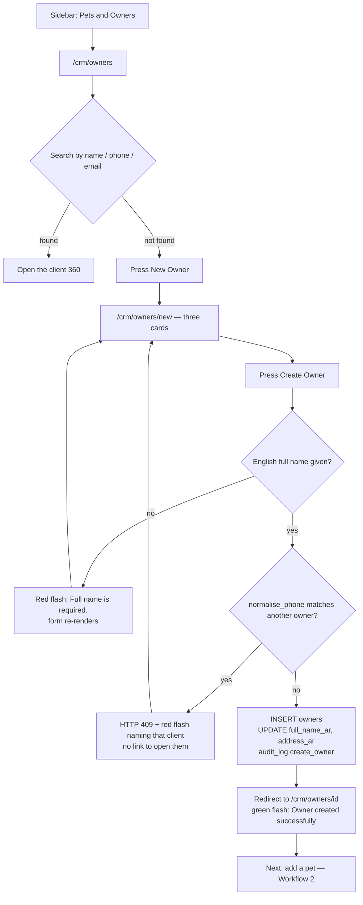

---

## Workflow 2 — Register a pet against a client

### 2.1 Who, when, why

The receptionist or a nurse, straight after the client is on file, or later when a family
brings a second animal. Nothing clinical can be recorded without a `pets` row —
appointments, visits, vaccinations and invoices all carry `pet_id`.

### 2.2 Preconditions

- The `patients` grant.
- **An existing client, and you must reach the form from that client.** The route reads
  `owner_id` from the query string or the POST body and refuses without it.
  Source: `blueprints/crm/routes.py:686-697`

### 2.3 The happy path

1. **Open the client 360** (`/crm/owners/<id>`).

2. **Press `🐾 Add Pet / إضافة حيوان`** in the top bar, or `➕ Add Pet / إضافة حيوان` in
   the header of the Pets section, or — if the client has none —
   `Add first pet → / أضف أول حيوان ←` in the empty state. All three go to
   `/crm/pets/new?owner_id=<id>`.
   Source: `templates/crm/owner_detail.html:8-10, 414-416, 441`

3. **The form opens with an owner banner** across the top: initials, the label
   `Owner / المالك`, the client's name, and `📱 <phone>`. A hidden `owner_id` field
   carries the client through the POST.
   Source: `templates/crm/pet_form.html` owner banner + hidden field

4. **Card 1 — `🐾 Pet Identity / بيانات الحيوان`.**
   - `Species / النوع` **required** — a radio grid of eight tiles: `🐕 Dog / كلب`,
     `🐈 Cat / قطة`, `🐰 Rabbit / أرنب`, `🐦 Bird / طائر`, `🐹 Hamster / هامستر`,
     `🐟 Fish / سمكة`, `🐢 Turtle / سلحفاة`, `🐾 Other / أخرى`. **Dog is pre-selected** on
     a new pet.
   - `Pet Name / اسم الحيوان` **required**, placeholder
     `e.g. Max, Bella / مثال: ماكس، بيلا`. Type `Bisa`.
   - `Breed / السلالة`, placeholder `e.g. Golden Retriever / مثال: جولدن ريتريفر`.
   - `Sex / الجنس` — `Male / ذكر`, `Female / أنثى`, `Unknown / غير معروف`.
   - `Date of Birth / تاريخ الميلاد` — native date picker.
   Source: `templates/crm/pet_form.html` identity card

5. **Card 2 — `⚖️ Physical Details / البيانات الجسدية`.**
   `Weight (kg) / الوزن (كجم)` (step 0.1), `Color / Markings / اللون / العلامات`,
   `Microchip ID / رقم الميكروشيب` (placeholder
   `15-digit microchip number / رقم ميكروشيب من 15 رقماً`), and the checkbox
   `Yes, this pet is neutered/spayed / نعم، هذا الحيوان محوّل/معقّم`.

6. **Card 3 — `🏥 Medical Information / المعلومات الطبية`.**
   `Known Allergies / الحساسية المعروفة`, `Chronic Conditions / الأمراض المزمنة`, and
   `Diet Notes / ملاحظات التغذية`. Fill allergies carefully — this one field drives the
   red banner on the patient record, the red line in the New Visit queue, the sticky
   allergy panel during a consultation, and the red ALLERGIES line on the PDF. If the
   record already has allergies, an amber box appears under the field reading
   `⚠️ Allergy alert on file / يوجد تنبيه حساسية بالملف`.

7. **Card 4 — `🛡️ Pet Insurance / تأمين الحيوان`.**
   `Insurance Provider / شركة التأمين` (placeholder `AXA, MetLife, Allianz`),
   `Policy Number / رقم الوثيقة`, `Policy Expiry Date / تاريخ انتهاء الوثيقة`.

8. **Card 5 — `📝 Additional Notes / ملاحظات إضافية`.**

9. **Press `✅ Register Pet / تسجيل الحيوان`.** You land on the patient record
   `/crm/pets/<pet_id>` with a green flash `Pet 'Bisa' added successfully.`
   Source: `blueprints/crm/routes.py:737-747`

### 2.4 Every alternative that genuinely branches

- **Registering the pet inside the New Visit page.** Step 2 offers
  `+ New patient / حيوان جديد`, an inline form with seven fields only: `Name / الاسم`
  (required), `Species / النوع` (**five** options — `Cat / قطة`, `Dog / كلب`,
  `Bird / طائر`, `Rabbit / أرنب`, `Other / أخرى`, and **Cat is the default**),
  `Breed / السلالة`, `Sex / الجنس` (Male/Female only — no Unknown),
  `Weight (kg) / الوزن (كجم)`, `Date of birth / تاريخ الميلاد`, and
  `Allergies / الحساسية` with the placeholder
  `Anything that must never be prescribed / أي شيء يجب ألا يوصف أبداً`. It POSTs to the
  same `/crm/pets/new`. Colour, microchip, neutered, chronic conditions, diet notes,
  insurance and notes are all left empty and must be filled in later through
  `/crm/pets/<id>/edit`.
  Source: `templates/workflow/index.html:513-545, 942-961`

- **A client with several animals.** Every pet is a separate row and a separate card on
  the Client 360 grid. There is no "family" concept and no limit on how many.

- **Editing a pet** uses the same five cards; the button reads
  `💾 Save Changes / حفظ التغييرات`. The edit route writes twice: `db.update_pet(...)` for
  the main columns, then a direct `UPDATE pets SET diet_notes, insurance_provider,
  policy_number, policy_expiry` — because `update_pet` does not carry those four.
  Source: `blueprints/crm/routes.py:852-869`; `models/database.py:3228-3240`

- **Browsing all patients.** `/crm/pets` shows a card grid with a free-text filter
  (`Search by name or microchip… / بحث بالاسم أو الميكروشيب…`), a species dropdown
  (`All Species / جميع الأنواع` plus whatever species are present),
  `Filter / تصفية` and `Clear / مسح`. Each card shows a species emoji, the name,
  species·breed, `👤 owner`, sex, `⚖️ weight`, `🔖 microchip` and any allergies in red.
  Source: `templates/crm/pets_list.html:18-85`

### 2.5 Errors and edge cases — the exact messages

| What you did | What you see | Where |
|---|---|---|
| Reached `/crm/pets/new` without an `owner_id` | `Owner ID is required to create a pet.` (red) and a redirect to `/crm/owners` | `blueprints/crm/routes.py:688-691` |
| `owner_id` points at a deleted client | `Owner not found.` (red) and a redirect to `/crm/owners` | `blueprints/crm/routes.py:695-698` |
| Left the pet name blank | `Pet name is required.` (red), form re-renders with your input | `blueprints/crm/routes.py:721-724` |
| Opened a pet id that does not exist | `Pet not found.` (red) and a redirect to `/crm/owners` | `blueprints/crm/routes.py:766-770, 822-826` |
| Saved an edit | `Pet updated successfully.` (green) | `blueprints/crm/routes.py:879` |
| Got a non-numeric value into `Weight (kg)` | **HTTP 500.** `float(weight_raw)` is unguarded in both `pet_new` and `pet_edit` | `blueprints/crm/routes.py:709, 837` |

Edge cases:

- **No duplicate check of any kind on pets.** The same name, the same microchip, even the
  same animal registered twice under one client — all accepted.
- **`diet_notes` is written by a second `UPDATE` wrapped in a bare `try/except: pass`.** If
  that write fails, the pet still saves and nothing is said.
  Source: `blueprints/crm/routes.py:728-735`
- **An expired insurance policy is not blocked**, only flagged on the patient record:
  `⚠️ EXPIRED / منتهية` in red when the expiry date is before today, `⏰ Expiring soon /
  تنتهي قريباً` in amber when it falls within the next month.
  Source: `templates/crm/pet_detail.html:284-291`; `blueprints/crm/routes.py:796-799`

### 2.6 What gets written, and what changes elsewhere

| Table | What |
|---|---|
| `pets` | One row: `owner_id, pet_name, species, breed, sex, dob, weight_kg, color, microchip_id, neutered, allergies, chronic_conditions, notes`. Then a second `UPDATE` for `diet_notes`. Insurance fields are written **only on edit**, not on create. |
| `audit_log` | `action='create_pet'`, `entity_type='pet'`, `details='Created pet: Bisa for owner 42'` |

Source: `models/database.py:3212-3226`; `blueprints/crm/routes.py:729-747`

**What changes elsewhere:**

- Client 360 — the Pets tile count and the pet card grid.
- `/crm/pets` — a new card (subject to the 100-row cap below).
- `/appointments/new` — the pet appears in that owner's pet dropdown, fed by
  `/appointments/api/pets`.
- `/appointments/reception` — the pet appears as a chip after an owner lookup.
- `/workflow/` step 2 — the pet appears in the list for that client.

### 2.7 Known limits of this workflow

1. **The two most obvious "add a pet" buttons cannot work.** `+ New Pet / حيوان جديد` on
   the All Pets screen and `+ Add Pet / إضافة حيوان` on the dashboard both link to
   `/crm/pets/new` with **no `owner_id`**, so both immediately flash
   `Owner ID is required to create a pet.` and dump you on the owners list. The only
   working entry points are the Add Pet buttons on a client record.
   Source: `templates/crm/pets_list.html:10-12`; `templates/launcher.html:338`;
   `blueprints/crm/routes.py:688-691`
2. **All Pets is capped at 100 rows with no pagination and no warning.** The species filter
   is applied in Python *after* that cap, and the species dropdown is built from a second,
   equally capped query — so in a clinic with more than 100 animals both the grid and the
   filter options are a truncated view, and the `<N> pet(s) found` counter counts only what
   survived the cap.
   Source: `models/database.py:3191-3200`; `blueprints/crm/routes.py:665-672`;
   `templates/crm/pets_list.html:30-32`
3. **The insurance fields are silently dropped on creation.** `pet_new` collects
   `insurance_provider`, `policy_number` and `policy_expiry` into `data`, `create_pet` does
   not insert them, and the follow-up `UPDATE` writes only `diet_notes`. They persist only
   once the record is saved again through `/crm/pets/<id>/edit`.
   Source: `blueprints/crm/routes.py:702-735` vs `models/database.py:3212-3226` vs
   `blueprints/crm/routes.py:856-869`
4. **Pet edit has no stale-record guard.** `owner_edit` calls `concurrency.guard` and
   returns 409 on a clash; `pet_edit` has no equivalent, so two people editing the same
   animal silently overwrite each other. (`pets` *is* in the guarded table set — the guard
   is simply never called.)
   Source: `blueprints/crm/routes.py:594-608` vs `819-893`; `models/concurrency.py:38-40`

### 2.8 Flowchart

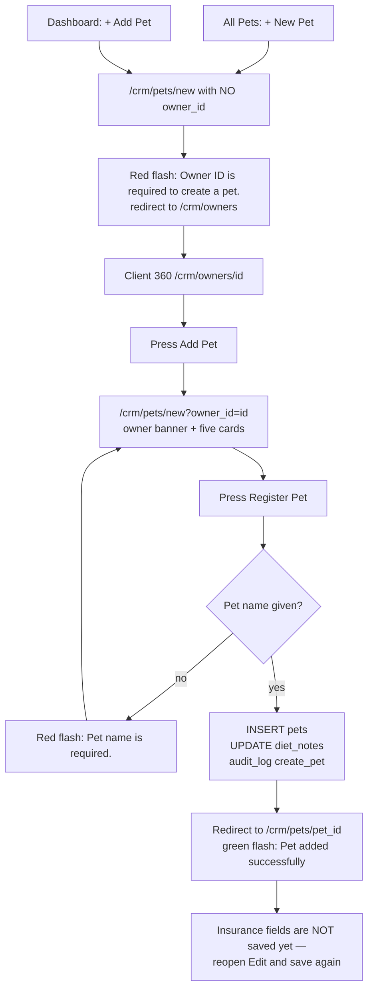

---

## Workflow 3 — Book an appointment

### 3.1 Who, when, why

The receptionist, whenever a client asks for a slot — at the counter, on the phone or over
WhatsApp. A booking is what puts the patient on the day's schedule, in the Reception
Workspace queue, on the waiting-room TV and at the top of the New Visit page.

### 3.2 Preconditions

- The `appointments` grant (reception, doctor, nurse, groomer, boarding_staff,
  branch_manager, clinic_owner, super_admin). **`pharmacist` does not hold it.**
- The client exists (Workflow 1) **and** has at least one pet (Workflow 2). The form
  refuses a booking without both.
- A doctor is optional. Leaving `— Assign Doctor —` blank is allowed and has consequences —
  see 3.7.

### 3.3 The happy path

1. **Open the day.** Sidebar → `Appointments / المواعيد` lands on `/appointments/schedule`
   for today, titled `📅 Daily Schedule / 📅 الجدول اليومي` with the date and `— Today`
   in the subtitle. Four stat cards: `Total / الإجمالي`, `Pending / قيد الانتظار`
   (Scheduled + Confirmed), `Checked In / تم الوصول`, `Completed / مكتمل`. Below them the
   agenda runs 8 AM to 8 PM, one row an hour, each empty hour saying
   `No appointments / لا توجد مواعيد`.
   Source: `templates/appointments/schedule.html:3-5, 170-241`;
   `blueprints/appointments/routes.py:165-216`

2. **Press `➕ New Appointment / ➕ موعد جديد`.** The date you were looking at is carried
   in the URL. You land on `/appointments/new`, titled `New Appointment / موعد جديد`,
   subtitled `Book a visit for a patient / حجز زيارة لمريض`.
   Source: `templates/appointments/schedule.html:8-10`; `templates/appointments/appt_form.html:3-5`

3. **Card 1 — `🐾 Patient / 🐾 المريض`.**
   - `Owner / المالك` **required**. The dropdown is a type-to-search control: only the
     pre-selected client (if any) is rendered into the page; everyone else is found by
     typing, which queries `/crm/owners/search-json` against the whole table and returns
     up to 25 matches. The hint reads
     `Start typing to filter, then select / ابدأ الكتابة للتصفية ثم اختر`.
   - `Pet / الحيوان` **required**. Changing the owner reloads this list from
     `/appointments/api/pets?owner_id=…`; when the client has exactly one animal it is
     selected automatically. With no owner chosen yet the hint reads
     `Select an owner first — pet list will reload / اختر المالك أولاً — ستُحدَّث قائمة الحيوانات`.
     If the chosen client has **no** pets you get
     `ℹ️ No pets found for this owner. / ℹ️ لا توجد حيوانات لهذا المالك.` and a link
     `Add a pet first → / أضف حيواناً أولاً ←`.
   - `Doctor / Vet / الطبيب البيطري` — `— Assign Doctor — / — تعيين طبيب —` plus every
     **active** user whose role is `doctor`, `super_admin` or `clinic_owner`, sorted by
     name, plus the clinic's own `doctor_name` appended as one more option if it is set.
   Source: `templates/appointments/appt_form.html:161-203, 331-358`;
   `blueprints/appointments/routes.py:350-372`

4. **Card 2 — `📋 Appointment Details / 📋 تفاصيل الموعد`.**
   - `Type / النوع` — seven radio tiles: `🩺 Consultation`, `💉 Vaccination`,
     `🔧 Surgery`, `✂️ Grooming`, `🔬 Lab`, `📋 Follow-up`, `🚨 Emergency`.
     **Consultation is pre-selected.** The type labels themselves are not translated.
   - `Priority / الأولوية` — `✅ Normal / ✅ عادي` (pre-selected), `⚡ Urgent / ⚡ عاجل`,
     `🚨 Emergency / 🚨 طوارئ`.
   - `Date / التاريخ` — pre-filled with the date you came from, or today.
   - `Duration / المدة` — 15 min, 30 min (default), 45 min, 1 hour, 1.5 hours, 2 hours.
   - `Channel / القناة` — `🚶 Walk-in`, `💬 WhatsApp`, `📞 Phone`, `🌐 Online`.
   - `Start Time / وقت البدء` **required** — a grid of 30-minute slots from 08:00 to
     19:30, with **09:00 pre-selected**. Taken slots are struck through, faded and
     unclickable; the hint reads
     `Grey slots are unavailable for the selected date/doctor / الفترات الرمادية غير متاحة للتاريخ/الطبيب المحدد`.
     The grid re-queries `/appointments/api/slots` whenever the date or the doctor changes.
   Source: `templates/appointments/appt_form.html:209-290, 360-391`

5. **Card 3 — `📝 Reason & Notes / 📝 السبب والملاحظات`.**
   `Reason for Visit / سبب الزيارة` (placeholder
   `e.g. Annual checkup, limping, vaccination due… / مثال: فحص سنوي، عرج، موعد تطعيم…`),
   `Symptoms (if any) / الأعراض (إن وجدت)`, `Internal Notes / ملاحظات داخلية`.

6. **Press `✅ Book Appointment / ✅ حجز الموعد`.** You land back on
   `/appointments/schedule?date=<the booked date>` with a green flash
   `Appointment booked successfully.`, and the new block appears in its hour with a blue
   `Scheduled` badge.
   Source: `blueprints/appointments/routes.py:342-343`

### 3.4 Every alternative that genuinely branches

Ten controls in the product lead here; what they pre-fill differs.

| You started from | URL it opens | Pre-filled |
|---|---|---|
| Daily schedule → `➕ New Appointment` | `/appointments/new?date=<day shown>` | date |
| Daily schedule, empty day → `➕ Book Appointment / ➕ حجز موعد` | same | date |
| Week calendar → `➕ New Appointment` | `/appointments/new` | nothing (date defaults to today) |
| Client 360 → `📅 Book Appt / حجز موعد` | `/appointments/new?owner_id=<id>` | owner + their pets |
| Patient record → `📅 New Appointment / موعد جديد` (top bar), `📅 Book / حجز` (card footer), or the timeline quick action | `/appointments/new?pet_id=<id>&owner_id=<id>` | owner **and** pet |
| Appointment detail → Quick Actions `New Appointment / موعد جديد` | `…?owner_id=&pet_id=&date=` | owner, pet, that date |
| Reception Workspace → `➕ Book / ➕ حجز` | `/appointments/new?date=<today>` | today |
| Reception Workspace → `📅 Book Appointment for this Owner / حجز موعد لهذا المالك` | `…?owner_id=<id>&date=<today>` | owner + today |
| Reception Workspace → a pet chip | `…?owner_id=&pet_id=&date=<today>` | owner, pet, today |
| Dashboard → `+ New Appointment / موعد جديد` | `/appointments/new` | nothing |

Source: `templates/appointments/schedule.html:8-10, 248-251`;
`templates/appointments/calendar.html:8`; `templates/crm/owner_detail.html:373`;
`templates/crm/pet_detail.html:8-9, 317, 398`; `templates/appointments/appt_detail.html:119`;
`templates/appointments/reception.html:37-38, 341-350, 558-563`;
`templates/launcher.html:337`

Other genuine branches:

- **Walk-in versus booked.** There is no separate walk-in path here. A walk-in is booked
  exactly like anything else, with `Channel` set to `🚶 Walk-in` (the default) and today's
  date. The alternative is to skip the booking entirely and use the New Visit page
  (Workflow 7), which creates a visit with no appointment behind it.
- **Urgent or Emergency priority** changes only the display: an `⚡ Urgent / ⚡ عاجل` or
  `🚨 Emergency / 🚨 طوارئ` pill on the schedule block and a coloured left border on the
  appointment detail card. It does not reorder the agenda, does not skip the queue and
  does not affect the waiting-room positions.
  Source: `templates/appointments/schedule.html:215-216`;
  `templates/appointments/appt_detail.html:20-22, 36-38`
- **No doctor assigned.** Permitted. The booking saves with an empty `doctor_name`, the
  schedule block simply omits the `🩺` line, and the double-booking guard never runs.
- **A client with several pets.** The pet dropdown lists them all; auto-selection happens
  only when there is exactly one.

### 3.5 Errors and edge cases — the exact messages

| What you did | What you see | What happens to your input |
|---|---|---|
| Submitted with no owner or no pet | `Owner and pet are required.` (red) | The form re-renders. **The owner survives; the pet, type, priority, slot, duration, channel, reason, symptoms and notes are all lost, and the date resets to today.** |
| Submitted a pet that does not belong to the chosen client (stale form, or the pet was moved or deleted) | `That pet is no longer on file for this client. Please re-select the client and pet.` (red) | Same re-render, same loss |
| Chose a doctor who already has that 30-minute slot | `⚠️ Dr. Hatem El Khateeb already has an appointment at 09:00 on 2026-08-19. Please choose a different slot.` (red) | **Redirect** back to the form with owner, pet and date in the URL; type, priority, duration, channel, reason, symptoms and notes are lost |
| JavaScript disabled | Full-page 403 `Invalid or missing security token. Please go back and try again.` | Nothing is written |

Source: `blueprints/appointments/routes.py:279-312`; `app.py:355-357`

Edge cases:

- **The "no past dates" guard is inert.** The date field renders
  `min="{{ today_str if today_str else '' }}"`, and `appt_new` never passes `today_str`,
  so the attribute is `min=""` and a date in the past is accepted by both the browser and
  the server.
  Source: `templates/appointments/appt_form.html:250` vs
  `blueprints/appointments/routes.py:374-387`
- **Double-booking is only checked when a doctor is named.** Both guards sit behind
  `if doctor_name and …`. With `— Assign Doctor —` left blank, any number of appointments
  can share one slot.
  Source: `blueprints/appointments/routes.py:309, 481`
- **With no doctor selected the slot grid greys out slots booked by *anybody*.**
  `_generate_slots` applies its doctor filter only when a doctor is passed, so an empty
  doctor means every appointment that day marks its slot as taken — including
  appointments belonging to other vets.
  Source: `blueprints/appointments/routes.py:96-106`; `models/database.py:3302`
- **09:00 is pre-selected even when it is grey.** Greyed labels are unclickable, but the
  radio for 09:00 is already checked in the markup. If 09:00 is taken and you never pick
  another slot, the form submits 09:00 — and with no doctor named, the server accepts it.
  Source: `templates/appointments/appt_form.html:282-283`;
  `blueprints/appointments/routes.py:309`
- **The doctor filter is a `LIKE '%name%'`.** Two vets whose names contain one another
  ("Dr. Ali" and "Dr. Ali Hassan") share a busy-slot view.
  Source: `models/database.py:3302`
- **Cancelled and No-Show appointments free their slot again**; every other status keeps
  it blocked.
  Source: `blueprints/appointments/routes.py:102-106`
- **Only the first 200 appointments of a day are considered** when computing free slots,
  and only 200 are drawn on the schedule.
  Source: `blueprints/appointments/routes.py:100, 173-175`
- **An unparseable start time** (not `HH:MM`) stores an empty `appt_end`; the schedule
  then shows the start time alone.
  Source: `blueprints/appointments/routes.py:301-306`

### 3.6 What gets written, and what changes elsewhere

| Table | What |
|---|---|
| `appointments` | One row: `owner_id, pet_id, doctor_name, room (always ''), appointment_type, priority, status='Scheduled', channel, appt_date, appt_start, appt_end (start + duration), duration_min, reason, symptoms, notes, created_by` |
| `audit_log` | `action='create_appointment'`, `module='appointments'`, `entity_type='appointment'`, `details='Booked Consultation for pet 17 on 2026-08-19'` |

Source: `models/database.py:3321-3338`; `blueprints/appointments/routes.py:314-341`

**What changes elsewhere:**

- `/appointments/schedule?date=…` — a new block in its hour; `Total` and `Pending` go up.
- `/appointments/calendar` — a chip on that day (only the first five per day are drawn,
  then `+N more`).
- Client 360 — a row in `Appointment History / سجل المواعيد` and `booked` count +1.
- `/appointments/reception` (if the date is today) — `Total Today` and `Waiting` go up,
  and the booking appears in `Waiting / Scheduled` with a `Check In` button.
- `/appointments/waiting-room` (if today) — the patient joins the queue at its time order.
- `/workflow/` step 1 `Today's bookings / حجوزات اليوم` (if today).
- `/appointments/api/slots` — that slot is now taken for that doctor.

### 3.7 Known limits of this workflow

1. **Booking with no doctor bypasses every collision check** (see 3.5). Nothing on screen
   says so.
2. **The past-date guard does nothing** (see 3.5).
3. **A validation failure loses almost the whole form.** The two `flash` branches fall
   through to the GET rendering code rather than returning, and that code reads its
   pre-fill values from `request.args`, which is empty on a POST — except for the owner,
   which it reads from `request.form` first.
   Source: `blueprints/appointments/routes.py:279-294, 345-353`
4. **`room` is inserted as an empty string always.** `create_appointment` accepts a
   `room` key and no caller in this chapter supplies one; there is no room field on the
   booking form.
   Source: `models/database.py:3325-3330`; `blueprints/appointments/routes.py:314-330`
5. **The seven appointment types are hardcoded English** and are not passed through
   `t()`, so an Arabic interface still shows "Consultation", "Vaccination" and so on.
   Source: `blueprints/appointments/routes.py:37`; `templates/appointments/appt_form.html:223`

### 3.8 Flowchart

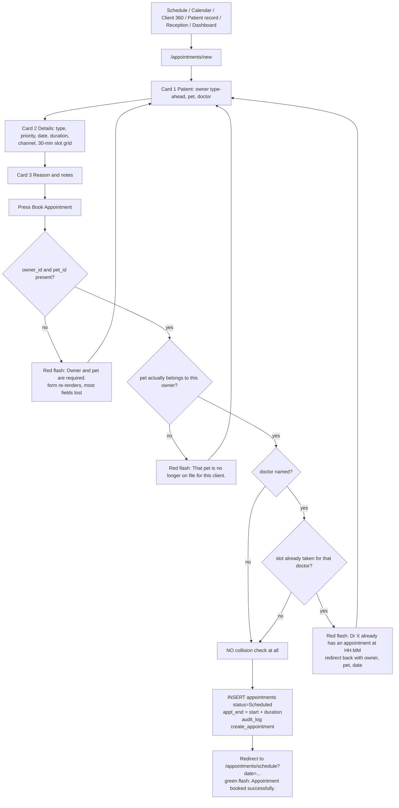

---

## Workflow 4 — Reschedule an appointment

### 4.1 Who, when, why

The receptionist, when a client rings to move a booking, or when a vet's day is
rearranged. Rescheduling changes when, how long, with whom and why — it never changes the
status, and it can never move the booking to a different client or a different animal.

### 4.2 Preconditions

- The `appointments` grant.
- The appointment's status is **not** `Completed` and **not** `Cancelled`. For those two
  the Reschedule button is not even rendered, and the route refuses anyway.
  Source: `templates/appointments/appt_detail.html:8-10`;
  `blueprints/appointments/routes.py:464-466`

### 4.3 The happy path

1. **Find the booking.** Daily schedule → click the block; or week calendar → click the
   chip; or Client 360 → `Appointment History / سجل المواعيد` → click the date; or
   Reception Workspace → click the row in the agenda or the Checked-In Queue.
   You land on `/appointments/<id>`, titled `Appointment #<id>` with
   `<date> · <start time>` underneath.
   Source: `templates/appointments/appt_detail.html:2-4`

2. **Read the left card, `Appointment Details / تفاصيل الموعد`.** A status badge, the
   priority and type pills, then Date, Time (`09:00 – 09:30 (30 min)`), Doctor, Channel,
   Reason, Symptoms, Notes and — once the patient has arrived — `Checked In / تم الوصول`
   with the timestamp. On a Scheduled or Confirmed booking a no-show risk badge loads
   itself here; see Workflow 11.

3. **Press `✏️ Reschedule / ✏️ إعادة جدولة`** in the top bar. You land on
   `/appointments/<id>/edit`, titled `Reschedule Appointment / إعادة جدولة الموعد` with
   `#<id> — <pet> / <owner>` underneath.

4. **Change what you need.**
   - `Date * / التاريخ *` — changing it reloads the slot grid.
   - `Doctor / الطبيب` — `— Any — / — أي —` plus the active doctor/owner accounts.
     Changing it reloads the slot grid too.
   - `Time Slot * / الفترة الزمنية *` — buttons from 08:00 to 19:30. The appointment's own
     current slot is excluded from the busy set, so it never blocks itself. Taken slots
     render red, `disabled`, with the tooltip `Already booked / محجوز بالفعل`.
   - `Duration (min) / المدة (دقيقة)` — 15, 30, 45, 60, 90, 120.
   - `Type / النوع`, `Priority / الأولوية`, `Channel / القناة`, `Reason / السبب`,
     `Notes / ملاحظات`.
   Source: `templates/appointments/appt_edit.html` content block;
   `blueprints/appointments/routes.py:518-537`

5. **Press `💾 Save Reschedule / 💾 حفظ إعادة الجدولة`.** You land back on the
   appointment detail with a green flash `Appointment rescheduled successfully.`, showing
   the new date, time and end time.
   Source: `blueprints/appointments/routes.py:514-515`

### 4.4 Every alternative that genuinely branches

- **Cancelling instead of moving.** There is no cancel button on the reschedule form. A
  cancellation is a status change: appointment detail → `Update Status / تحديث الحالة` →
  `Cancelled`. See Workflow 5.
- **Changing the doctor only.** Perfectly valid — keep the date and slot, pick a different
  name. The collision check then runs against the **new** doctor's day.
- **Moving to a date in the past.** The reschedule form has no `min` on its date input at
  all, and the server does not check. Accepted.
  Source: `templates/appointments/appt_edit.html` date input
- **Rescheduling a Checked-in appointment.** Allowed — only Completed and Cancelled are
  blocked. The status stays `Checked-in` and `checked_in_at` is left as it was.

### 4.5 Errors and edge cases — the exact messages

| What you did | What you see |
|---|---|
| Opened `/appointments/<id>/edit` on a Completed or Cancelled booking | `Cannot edit a completed or cancelled appointment.` (amber) and a redirect to the appointment detail |
| Opened an appointment id that does not exist | `Appointment not found.` (red) and a redirect to `/appointments/schedule` |
| Saved onto a slot the named doctor already has | `⚠️ Dr. Hatem El Khateeb already has an appointment at 11:30 on 2026-08-20.` (red) and a **redirect back to the reschedule form — every change you made is lost** |
| Saved with `— Any —` in the doctor box | No collision check runs at all |

Source: `blueprints/appointments/routes.py:459-484`

### 4.6 What gets written, and what changes elsewhere

| Table | What |
|---|---|
| `appointments` | `UPDATE … SET appt_date, appt_start, appt_end, duration_min, doctor_name, appointment_type, priority, reason, notes, channel, updated_at=datetime('now')`. **`status`, `symptoms`, `owner_id`, `pet_id`, `checked_in_at` and `checked_out_at` are not touched.** |
| `audit_log` | `action='reschedule_appointment'`, `details='Rescheduled to 2026-08-20 11:00 with Dr. Hatem El Khateeb'` |

Source: `blueprints/appointments/routes.py:486-513`

**What changes elsewhere:** the block moves on the daily schedule and the week calendar;
the Client 360 appointment history row shows the new date and time; the old slot becomes
free in every slot picker and the new one becomes taken (for a named doctor); if the new
date is today, the booking joins the Reception Workspace, the waiting-room queue and the
New Visit page's bookings list, and if it was today and is not any more, it leaves them.

### 4.7 Known limits of this workflow

1. **Symptoms cannot be edited.** `Symptoms (if any) / الأعراض` is captured on the booking
   form, is not on the reschedule form, and is not in the `UPDATE`. Once booked, the only
   way to change it is direct database access.
   Source: `templates/appointments/appt_form.html:304-308` vs
   `templates/appointments/appt_edit.html` (no symptoms field);
   `blueprints/appointments/routes.py:487-501`
2. **A collision refusal throws away every edit**, because it redirects to a fresh GET
   instead of re-rendering (see 4.5).
3. **No stale-record guard.** Two people rescheduling the same appointment silently
   overwrite each other; `appointments` is not in the guarded table set.
   Source: `models/concurrency.py:38-40`
4. **The hidden CSRF field is named `csrf_token`**, which the server does not accept. The
   form works only because `platform.js` adds a correctly-named `_csrf_token` on submit.
   Source: `templates/appointments/appt_edit.html:13`; `static/js/platform.js:131-146`

### 4.8 Flowchart

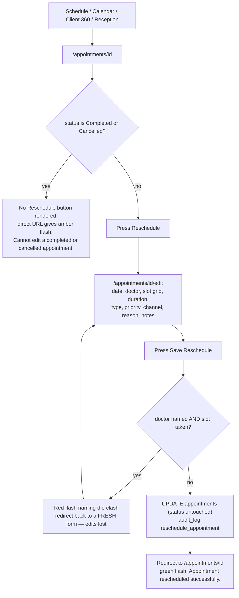

---

## Workflow 5 — Run the day at the front desk (check-in and closing)

### 5.1 Who, when, why

The receptionist, from opening until closing. This is the workflow that keeps the rest of
the clinic honest: `Checked-in` is what tells the vet who is physically in the building,
and it is what puts a patient on the waiting-room TV and at the top of the New Visit
page's bookings list. Every status move in this workflow is a manual button press —
nothing in the product moves an appointment's status on its own.

### 5.2 Preconditions

- The `appointments` grant.
- Bookings exist for today (Workflow 3).
- To use the Reception Workspace you must type `/appointments/reception` into the address
  bar: nothing links to it.

### 5.3 The happy path

1. **Open the Reception Workspace** at `/appointments/reception`. Titled
   `🖥️ Reception Workspace / 🖥️ مساحة الاستقبال`, subtitled
   `Today · <date> · Quick check-in & appointment management`. Top bar:
   `➕ New Appointment / ➕ موعد جديد` and `📅 Day Schedule / 📅 جدول اليوم`.
   Source: `templates/appointments/reception.html:3-14`

2. **Read the stat bar:** `Total Today / إجمالي اليوم`, `Checked In / تم الوصول`,
   `Waiting / في الانتظار` (Scheduled + Confirmed), `Completed / مكتمل`.
   Source: `templates/appointments/reception.html` stats block;
   `blueprints/appointments/routes.py:573-576`

3. **Left column — `📅 Today's Appointments / 📅 مواعيد اليوم`,** the same hour-by-hour
   agenda as the daily schedule, each block a link to the appointment.

4. **A client arrives.** Find them in the right column's
   `🕐 Waiting / Scheduled / 🕐 في الانتظار / مجدول` list — the **first eight** pending
   bookings, each showing the time, the pet, a status badge and the owner + type.

5. **Press `Check In / تسجيل وصول`** on that row. The page reloads to the same screen with
   a green flash `Appointment status updated to Checked-in.` The booking moves from
   `Waiting / Scheduled` into `🏥 Checked-In Queue / 🏥 قائمة الوصول`, the two counters
   swap, and `checked_in_at` is stamped.
   Source: `templates/appointments/reception.html:412-420`;
   `blueprints/appointments/routes.py:428-449`; `models/database.py:3340-3350`

6. **The vet sees the patient.** Nothing in this product changes the appointment while
   that happens.

7. **Close the booking by hand.** Open the appointment (`/appointments/<id>`), find the
   `Update Status / تحديث الحالة` card, and press one of the six buttons:
   `Scheduled`, `Confirmed`, `Checked-in`, `Completed`, `Cancelled`, `No-Show`. The
   current status is the highlighted button. Pressing `Completed` stamps
   `checked_out_at`, moves the booking out of the waiting-room queue, and returns you to
   the same page with `Appointment status updated to Completed.`
   Source: `templates/appointments/appt_detail.html:67-81`;
   `blueprints/appointments/routes.py:40, 428-449`; `models/database.py:3343-3348`

### 5.4 Every alternative that genuinely branches

- **Working from the daily schedule instead.** `/appointments/schedule` has no check-in
  button — you must open each appointment and use the status card. The Reception
  Workspace's one-click button is the only shortcut in the product.
- **Looking a client up at the counter.** Right column,
  `🔍 Owner Lookup / 🔍 البحث عن مالك`, placeholder
  `Type owner name or phone… / اكتب اسم المالك أو الهاتف…`, with
  `<N> owners registered` underneath. Type two or more characters; results come from
  `/crm/owners/search-json`. Click a result and a panel opens with the name and phone, one
  chip per pet (each a link straight into a booking form pre-filled with that owner, that
  pet and today), and
  `📅 Book Appointment for this Owner / 📅 حجز موعد لهذا العميل`.
  Source: `templates/appointments/reception.html:324-352, 460-568`
- **Confirming a booking the day before.** Press `Confirmed` on the appointment. It stays
  in the `Waiting / Scheduled` list (which counts Scheduled **and** Confirmed) with a teal
  badge, and it stays on the waiting-room queue.
  Source: `templates/appointments/reception.html:396, 404-405`;
  `blueprints/appointments/routes.py:575, 780`
- **A client who never turns up.** Press `No-Show`. `checked_out_at` is stamped, the
  booking leaves the waiting-room queue and the New Visit bookings list, and the client's
  `No-Shows` tile on the Client 360 goes up by one — which then feeds the no-show risk
  score (Workflow 11).
- **A client who cancels.** Press `Cancelled`. Same stamping; the schedule block renders
  with a struck-through red badge; the slot becomes bookable again.
  Source: `templates/appointments/schedule.html:137`;
  `blueprints/appointments/routes.py:102-106`
- **More than eight people waiting.** The list shows the first eight and then
  `+N more — view all / عرض الكل`, linking to the day schedule.
  Source: `templates/appointments/reception.html:423-428`

### 5.5 Errors and edge cases — the exact messages

| What you did | What you see |
|---|---|
| Posted a status that is not one of the six | `Invalid status: Arrived` (red) and a redirect to the appointment detail |
| Opened an appointment id that does not exist | `Appointment not found.` (red) and a redirect to `/appointments/schedule` |
| Typed one character into Owner Lookup | `Type at least 2 characters / اكتب حرفين على الأقل` |
| Nothing typed yet | `Type a name or phone to find a client / اكتب الاسم أو الهاتف للبحث` |
| Search returned nothing | `No match / لا توجد نتائج` |
| The search request failed | `Search failed / فشل البحث` |
| Selected a client who has no animals | `No pets registered` |
| The pet lookup failed | `Could not load pets` |

Source: `blueprints/appointments/routes.py:431-434, 398-400`;
`templates/appointments/reception.html:481, 514, 519, 523, 552, 566`

Edge cases:

- **Any status can be set from any status.** There is no state machine: a `Completed`
  appointment can be pushed back to `Scheduled`, and a `Cancelled` one to `Checked-in`.
  The only rule anywhere is that the *reschedule form* refuses Completed and Cancelled.
- **The timestamps are one-way but rewritable.** Setting `Checked-in` always rewrites
  `checked_in_at` to now; setting Completed, No-Show or Cancelled always rewrites
  `checked_out_at`. Pressing a button twice moves the timestamp.
  Source: `models/database.py:3343-3348`
- **Redirect after a status change** goes to the form's hidden `next` field, else the
  browser's `Referer`, else the appointment detail. The Reception Workspace sets `next` to
  itself; the appointment detail sets it to the current URL.
  Source: `blueprints/appointments/routes.py:448`;
  `templates/appointments/reception.html:414`; `templates/appointments/appt_detail.html:71`
- **The Reception Workspace reads at most 200 of today's appointments.**
  Source: `blueprints/appointments/routes.py:563`

### 5.6 What gets written, and what changes elsewhere

| Table | What |
|---|---|
| `appointments` | `status`, `updated_at`, and either `checked_in_at` (for Checked-in) or `checked_out_at` (for Completed / No-Show / Cancelled) |
| `audit_log` | `action='update_appointment_status'`, `details='Status → Checked-in'` |

Source: `models/database.py:3340-3350`; `blueprints/appointments/routes.py:437-445`

**What changes elsewhere the moment a booking becomes `Checked-in`:**

- Reception Workspace — moves from `Waiting / Scheduled` to `Checked-In Queue`; the
  `Checked In` and `Waiting` counters swap.
- Daily schedule — the badge turns purple and the `Checked In` stat goes up.
- Waiting-room TV — the row shows `🟢 In Progress / 🟢 جارٍ` and everybody behind it has
  20 minutes shaved off their estimate.
- `/workflow/` step 1 — the booking jumps to the top of `Today's bookings / حجوزات اليوم`
  with the pill `In the waiting room / في الانتظار`.
- Appointment detail — a `Checked In / تم الوصول` row appears with the timestamp.

Source: `blueprints/appointments/routes.py:819-822`;
`blueprints/workflow/routes.py:112-125`; `templates/workflow/index.html:1434-1436`

**And when it becomes `Completed`, `Cancelled` or `No-Show`:** it disappears from the
waiting-room queue, from the New Visit bookings list and from the Reception Workspace
queues (it stays in the agenda), and the Client 360 counters
`<N> booked · <N> no-shows · <N> cancelled` update.

### 5.7 Known limits of this workflow

1. **Finishing a walk-in does not close the booking.** No route in this area writes
   `appointments.status` on visit completion. The only writers are these manual buttons,
   the reschedule `UPDATE` (which leaves status alone) and the doctor module. After a full
   New Visit consultation the appointment is still `Checked-in` on the schedule, in the
   Reception Workspace and on the TV until somebody presses `Completed`.
   Source: `blueprints/appointments/routes.py:428-453, 488`;
   `blueprints/doctor/routes.py:289`; `blueprints/visits/routes.py:465-588` writes no
   appointment status
2. **`In Progress` is an off-list status.** The doctor module sets it, but it is absent
   from `VALID_STATUSES`, from `STATUS_COLORS` and from the waiting-room queue filter.
   Such an appointment renders with the default grey badge, cannot be re-selected on the
   status form (the six buttons do not include it), and vanishes from the TV.
   Source: `blueprints/doctor/routes.py:289`;
   `blueprints/appointments/routes.py:26-40, 780`
3. **The Reception Workspace is unreachable from the interface.** It is not in the
   sidebar, not on the dashboard, not linked from any template.
4. **The post-status redirect target is not validated.** `next` is taken from the posted
   form and handed to `redirect()` unchecked; the safe-redirect helper used by the login
   flow is not applied here.
   Source: `blueprints/appointments/routes.py:448`; `blueprints/auth/routes.py:40-52`
5. **The Reception Workspace subtitle and several small labels are English-only**
   (`Today · <date> · Quick check-in & appointment management`,
   `<N> owners registered`, `<N> currently checked in`, `<N> appointment(s) pending`,
   `Loading pets…`, `No pets registered`, `Could not load pets`).
   Source: `templates/appointments/reception.html:5, 337, 359, 393, 547, 552, 566`

### 5.8 Flowchart

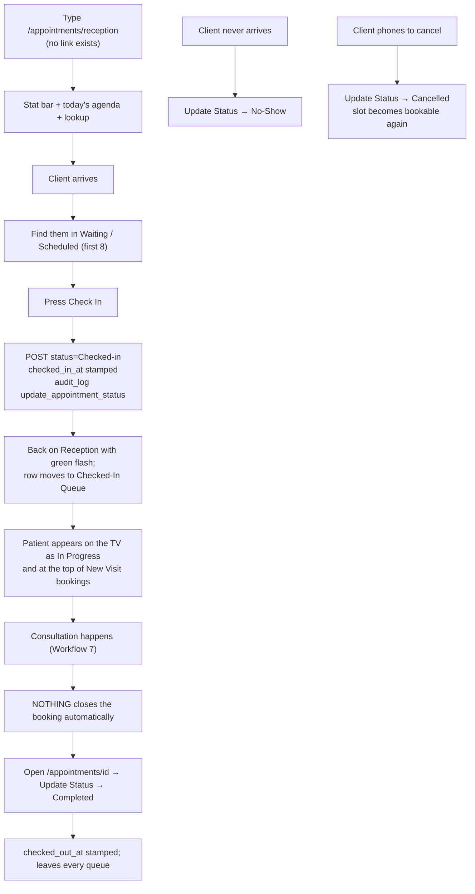

---

## Workflow 6 — The waiting-room TV

### 6.1 Who, when, why

Set up once by whoever installs the screen in the waiting area; after that it runs
unattended. It shows clients where they are in the queue and roughly how long they have to
wait, without showing anybody's full name.

### 6.2 Preconditions

- `WAITING_ROOM_TOKEN` must be set in the environment (or in `app.config`) for an
  **anonymous** screen to work at all. Provisioned clinics get one automatically from
  `scripts/provision/clinic_env.py`; a hand-deployed server may not have one.
- Today's appointments must exist and be in `Scheduled`, `Confirmed` or `Checked-in`.

Source: `blueprints/appointments/routes.py:723-758, 772-782`

### 6.3 The happy path

1. **On the TV's browser, open `/appointments/waiting-room?t=<the token>` once.** The page
   stores the token in a `wr_token` cookie (one year, HttpOnly, SameSite=Lax) so the
   page's own polling stays authorised and you never have to type the URL again.
   Source: `blueprints/appointments/routes.py:834-838`

2. **What appears** is a standalone full-screen dark page — it does not use the normal
   sidebar layout at all:
   - **Header:** the clinic's name and address, a live clock updating every second, and
     today's date as `Tuesday, 19 August 2026`.
   - **`Today's Queue / قائمة اليوم`** — a table of `#`, `Patient / المريض`,
     `Type / النوع`, `Doctor / الطبيب`, `Est. Wait / الانتظار المتوقع`. Each row shows a
     species emoji (🐶 Dog, 🐱 Cat, 🐰 Rabbit, 🦜 Bird, 🐾 anything else — matched
     exactly), the pet's name, and the owner's name **masked** as `Ahmed E.`
   - **Estimated wait:** a `Checked-in` row reads `🟢 In Progress / 🟢 جارٍ`; the first
     waiting row reads `Next up / التالي`; every row after that reads `~20 min`,
     `~40 min`, and so on — 20 minutes per position ahead, minus the number already
     checked in.
   - **Three stat tiles:** `In Queue / في الانتظار`, `In Consultation / في الكشف`,
     `Max Wait (min) / أقصى انتظار (دقيقة)`, plus a fourth tile hardcoded to `24` with
     the label `Yrs of Care / سنوات من الرعاية`.
   - **`Health Tip of the Moment / نصيحة صحية`** — one of ten fixed English tips,
     rotating every 12 seconds.
   - **A scrolling marquee** of seven fixed English messages.
   Source: `blueprints/appointments/routes.py:807-833`;
   `templates/appointments/waiting_room.html:125-248`

3. **When there is nobody in the queue** the table is replaced by
   `No patients in queue right now / لا يوجد مرضى في قائمة الانتظار حالياً` and
   `Walk-ins welcome / المراجعون بدون موعد مرحب بهم`.
   Source: `templates/appointments/waiting_room.html:192-198`

### 6.4 Every alternative that genuinely branches

- **A signed-in staff member opening the page** (for example through the sidebar link
  `Waiting Room TV / شاشة الانتظار`, which carries no `?t=`) is always allowed —
  `session["user"]` short-circuits the token check. **The names on the rendered page are
  masked for staff too**: the page always calls `_queue_rows()` with masking on. Only the
  JSON endpoint `/appointments/api/queue` returns full names, and only to a signed-in
  session.
  Source: `blueprints/appointments/routes.py:745-746, 807, 842-851`;
  `templates/base.html:282-285`
- **No token configured.** Anonymous requests to both `/appointments/waiting-room` and
  `/appointments/api/queue` get a **404**, and a one-time warning is written to the
  application log: `WAITING_ROOM_TOKEN is not configured — the waiting-room display is
  REFUSING anonymous requests. Set WAITING_ROOM_TOKEN in the environment and open the TV
  on ?t=<token> once.` Signed-in staff still see the page, so this failure is easy to miss
  from a staff PC.
  Source: `blueprints/appointments/routes.py:744-756, 804-805, 849-850`
- **A wrong token** — compared with `hmac.compare_digest` — is a 404 as well.

### 6.5 Errors and edge cases

- **There is no error page.** Every failure mode of this screen is a bare 404.
- **The queue query never raises.** If it fails it is logged and the queue renders empty.
  Source: `blueprints/appointments/routes.py:761-787`
- **A booking with no pet row still appears** (the pet join is a LEFT JOIN, so the name
  column is blank and the template prints `—`); a booking whose owner row is missing does
  not appear at all (that join is an INNER JOIN).
  Source: `blueprints/appointments/routes.py:772-782`
- **Single-word owner names are not masked.** `mask_owner_name` returns the name unchanged
  when there is only one word — `"Mostafa"` stays `"Mostafa"`. It is safe for Arabic and
  never raises on an empty name.
  Source: `blueprints/appointments/routes.py:709-720`
- **The estimate can only ever be a multiple of 20 minutes**, and appointment duration,
  type and priority play no part in it.
  Source: `blueprints/appointments/routes.py:818-822`

### 6.6 What gets written, and what changes elsewhere

**Nothing is written.** Both routes are read-only. The only state the workflow creates is
the `wr_token` cookie in the TV's browser.

The queue changes as a side effect of Workflow 5: a booking joins it when it exists in
`Scheduled`/`Confirmed`/`Checked-in` for today, and leaves it when somebody presses
`Completed`, `Cancelled` or `No-Show`.

### 6.7 Known limits of this workflow

1. **The queue table never refreshes itself.** The 30-second poll updates only the three
   stat counters (`In Queue`, `In Consultation`, `Max Wait`). The rows are rendered once,
   server-side, and stay exactly as they were until somebody reloads the page. A screen
   left running all day shows the morning's queue with an afternoon's counters.
   Source: `templates/appointments/waiting_room.html:286-298`
2. **The sidebar link cannot bootstrap the TV.** It opens `/appointments/waiting-room`
   with no `?t=`, which works for the signed-in staff member clicking it and does nothing
   for the display, which has no session. The tokenised URL must be typed on the TV once.
   Source: `templates/base.html:282`
3. **Staff never see unmasked names on this page** (see 6.4) — if you need the full name,
   open the appointment.
4. **The health tips, the marquee and the "24 Yrs of Care" tile are hardcoded English
   strings** with no Arabic version and no way to edit them from the interface.
   Source: `templates/appointments/waiting_room.html:222-225, 238-248, 262-273`
5. **An appointment set to `In Progress` by the doctor module disappears from the TV**,
   because the queue filter lists only `Scheduled`, `Confirmed` and `Checked-in`.
   Source: `blueprints/appointments/routes.py:780`; `blueprints/doctor/routes.py:289`

### 6.8 Flowchart

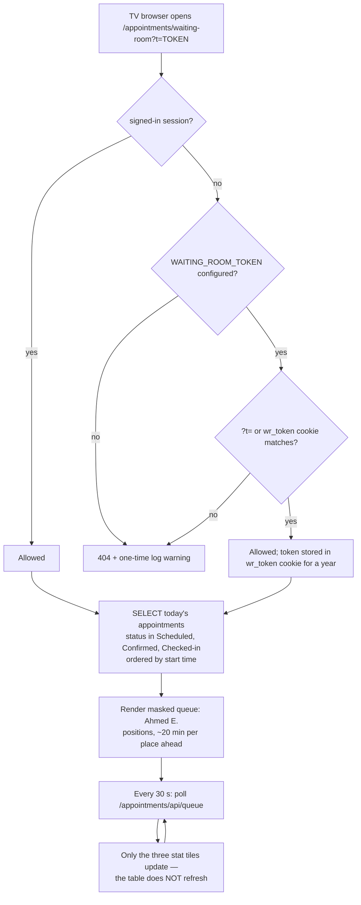

---

## Workflow 7 — The walk-in visit, end to end on one page

### 7.1 Who, when, why

A vet, a nurse or a manager, when a patient is actually in front of them: a walk-in, or a
booked patient called through from the waiting room. `/workflow/` — `New Visit /
زيارة جديدة` — carries the whole consultation on a single screen, from finding the client
to taking the money, without navigating away.

**Read this before anything else:** the receptionist **cannot open this page**. It is
governed by the `visits` grant, which the shipped `reception` role does not hold, even
though the sidebar shows her the link. See 0.2.

The blueprint itself never writes. Every save on this page POSTs to the same `/crm`,
`/visits`, `/clinical` and `/finance` route a normal form would, so every rule, permission
check and CSRF check in those routes still applies — and every one of their failure modes
reaches this page as an HTTP status rather than as their flash message, which is where
most of the limits in 7.7 come from.
Source: `blueprints/workflow/routes.py:1-52`; `templates/workflow/index.html:802-813`

### 7.2 Preconditions

- A role holding **`visits`**: doctor, nurse, pharmacist, branch_manager, clinic_owner,
  super_admin. Not reception, not groomer, not boarding_staff.
- To finish the money step you also need **`invoicing`**, which only branch_manager,
  clinic_owner and super_admin hold among the above. See 7.7.
- To create a client or a pet from inside the page you need `patients`; to record a
  vaccination you need `visits` (the `clinical` blueprint shares that key).
- The service catalogue should contain a priced consultation service, or the invoice will
  be raised at zero — see 7.5.

### 7.3 The happy path

The strip at the top shows six steps: `1 Client / العميل`, `2 Patient / الحيوان`,
`3 Examination / الفحص`, `4 Diagnosis / التشخيص`, `5 Treatment / العلاج`,
`6 Invoice & Payment / الفاتورة والدفع`. Completed steps turn green, the current one
turns primary, and on a phone the strip scrolls the active step into view. A sticky
patient panel sits to the right (above the step on a narrow screen) from step 3 onwards,
with **allergies at the top**.
Source: `templates/workflow/index.html:433-440, 770-800, 1533-1580`

**Step 1 — `Who is the client? / من هو العميل؟`**

1. The page opens on `Today's bookings / حجوزات اليوم` — every appointment for today that
   is not Completed, Cancelled or No-Show, with checked-in patients first, then by time.
   Each row shows the time, the pet and owner, the species and appointment type, any
   allergies in red, and a status pill — `In the waiting room / في الانتظار` for a
   checked-in patient, otherwise the raw status.
   Source: `blueprints/workflow/routes.py:98-128`; `templates/workflow/index.html:1410-1443`

2. **Click the row for the patient in front of you.** The client and the animal are both
   known, so the page jumps **straight to step 3**, and the appointment's
   `Reason for Visit` is copied into `Chief complaint` if you have not typed one.
   Source: `templates/workflow/index.html:1445-1460`

3. *(Walk-in instead)* Type two or more characters into
   `Name or phone… / الاسم أو رقم الهاتف…`. Results appear after a short pause as cards
   showing the name, the phone and `<N> pets / حيوان`. Press Enter to take the first
   result, or click one.
   Source: `templates/workflow/index.html:818-846, 1518-1525`;
   `blueprints/workflow/routes.py:57-95`

**Step 2 — `Which animal? / أي حيوان؟`**

4. The hint reads `Registered to <client name> / مسجل باسم …`, and every pet is a card
   with its name, species, breed and — in red — any allergies. Click one. If the client
   has no animals the hint reads
   `This client has no animals registered yet. / لا يوجد حيوانات مسجلة لهذا العميل.` and
   the new-patient form opens by itself.
   `← Change client / تغيير العميل` goes back a step.
   Source: `templates/workflow/index.html:498-546, 913-929`

**Step 3 — `Examination / الفحص`**

5. Above the fields, the page shows what it just fetched about the animal: an amber
   `⚠ Allergies / حساسية: <text>` bar if there are any, and a
   `Recent visits / زيارات سابقة` line listing up to five previous visits as
   `date — diagnosis (or chief complaint)`.
   Source: `blueprints/workflow/routes.py:201-225`; `templates/workflow/index.html:963-991`

6. Fill in:
   - `Chief complaint / الشكوى الرئيسية` **required**.
   - `Symptoms / الأعراض`.
   - `Visit type / نوع الزيارة` — `Consultation / كشف` (default), `Follow-up / متابعة`,
     `Vaccination / تطعيم`, `Emergency / طوارئ`, `Surgery / جراحة`.
   - `Doctor / الطبيب` — a free-text box pre-filled with **your own** full name.
   - `Vital signs / العلامات الحيوية`: `Weight (kg) / الوزن` (pre-filled from the pet's
     stored weight), `Temperature (°C) / الحرارة`, `Heart rate / النبض`,
     `Respiratory rate / التنفس`.
   Source: `templates/workflow/index.html:548-581, 963-965`

7. **Out-of-range vitals are flagged, never blocked.** For a Dog, Cat or Rabbit the page
   knows a general adult range (dog 37.8–39.2 °C, 70–160 bpm, 10–30 rpm; cat 38.1–39.2 °C,
   140–220 bpm, 20–30 rpm; rabbit 38.3–39.4 °C, 180–250 bpm, 30–60 rpm). An out-of-range
   box turns amber and a warning appears:
   `Outside the usual range for a cat: Temperature 39.8 (usual 38.1–39.2)` followed by
   `General adult reference only — age, stress and recent activity all move these.` No
   other species is checked at all.
   Source: `templates/workflow/index.html:1471-1516`

8. **Press `Start visit & continue / بدء الزيارة والمتابعة`.** This POSTs `/visits/new`
   and reads the new visit id out of the URL the route redirected to. A first, empty
   medication row is added to step 5, and if the visit type is `Vaccination` the
   vaccination block on step 5 is ticked open for you.
   Source: `templates/workflow/index.html:994-1024`; `blueprints/visits/routes.py:110-160`

**Step 4 — `Diagnosis / التشخيص`**

9. The hint states the rule the money step depends on:
   `At least one diagnosis is required before the visit can be completed. /
   مطلوب تشخيص واحد على الأقل قبل إنهاء الزيارة.`
   Fill `Diagnosis / التشخيص` **required**, `Severity / الشدة`
   (`Mild / خفيف`, `Moderate / متوسط` — the default, `Severe / شديد`), and
   `Notes / ملاحظات`.
   Source: `templates/workflow/index.html:594-611`

10. *(Optional)* `Suggest differentials / اقترح تشخيصات` sends the complaint, symptoms,
    species, vitals and recent history to `/ai/suggest-diagnosis` and lists suggestions
    with a likelihood pill and a `Use this / استخدم هذا` button that fills the diagnosis
    box. It never types into the field on its own. The whole strip is hidden server-side
    when the clinic has no AI configured.
    Source: `templates/workflow/index.html:612-621, 1277-1344`; `blueprints/workflow/routes.py:40-51`

11. **Press `Save diagnosis & continue / حفظ التشخيص والمتابعة`.** The page POSTs
    `/visits/<id>/diagnosis` and then **re-reads the visit from the server** to confirm a
    diagnosis row really exists before moving on.
    Source: `templates/workflow/index.html:1027-1047`

**Step 5 — `Treatment / العلاج`**

12. If the animal has allergies, the hint above the medication rows reads
    `⚠ Allergic to / حساسية من: <text>` in red.

13. Fill one row per medicine: `Medication / الدواء`, `Dose / الجرعة`,
    `Frequency / التكرار` (placeholder `BID`), `Duration / المدة` (placeholder `7 days`),
    `Qty / الكمية` (default 1). `+ Add medication / إضافة دواء` adds another row; the `✕`
    button removes one. **Rows with an empty medication name are silently skipped.**
    Every row is sent with `unit=unit` and `route=Oral` hardcoded.
    Source: `templates/workflow/index.html:1050-1088`

14. *(Optional)* `Check interactions / فحص التداخلات` takes the first medication you typed,
    adds everything already on file for this visit **from the server** plus the other rows
    you typed, and posts to `/ai/drug-interactions`. The answer is headed
    `Severe interaction / تداخل شديد`, `Moderate…`, `Mild…`, `No interaction found /
    لا يوجد تداخل` or `Not checked / لم يتم الفحص`. If the animal has nothing else on file
    it says so explicitly rather than implying an all-clear.
    Source: `templates/workflow/index.html:1346-1399`

15. *(If a vaccination was given)* Tick
    `A vaccination was given / تم إعطاء تطعيم`. The block opens with today's date already
    in `Given on / تاريخ الإعطاء` and a `Next dose due / الجرعة القادمة` date computed 12
    months ahead. Choose the `Vaccine / التطعيم` (`Rabies / السعار`, DHPP, Bordetella,
    Leptospirosis, Feline FVRCP, FeLV, or `Other… / أخرى…` which reveals a free-text
    `Vaccine name / اسم التطعيم`), and fill `Brand / الماركة`,
    `Batch number / رقم التشغيلة`, `Dose number / رقم الجرعة` (default 1) and
    `Site / موضع الحقن` (`Subcutaneous / تحت الجلد`, `Intramuscular / عضلي`,
    `Intranasal / أنفي`). For a cat the vaccine defaults to Feline FVRCP.
    The note under the date reads
    `The owner is reminded by WhatsApp when this falls due. / يتم تذكير المالك عبر واتساب عند حلول الموعد.`
    — and if you clear the date it turns red:
    `Without a next-due date no reminder is sent and the animal will lapse.`
    Source: `templates/workflow/index.html:651-699, 1583-1676`

16. **Press `Save prescription & continue / حفظ الروشتة والمتابعة`** — or
    `No medication — continue / بدون دواء — متابعة` if there is nothing to prescribe.
    Both buttons do the same three things in order: POST the prescription (only if at
    least one row has a medication name), POST the vaccination (only if the box is
    ticked), then POST `/visits/<id>/complete`. The vaccination goes first deliberately,
    because completing the visit raises the invoice.
    Source: `templates/workflow/index.html:1070-1110`

**Step 6 — `Invoice & Payment / الفاتورة والدفع`**

17. Completing the visit marks it `Completed` and auto-generates the invoice: one
    `Consultation — <diagnosis>` line per diagnosis priced from the service catalogue by
    matching the visit type (falling back to a match on "consultation"), plus one line per
    prescription item priced by matching the medication name. The page then re-reads the
    visit and refuses to continue if no invoice came back.
    Source: `blueprints/visits/routes.py:465-588`; `templates/workflow/index.html:1113-1126`

18. **The summary line** shows `Invoice / فاتورة`, `Total / الإجمالي`, `Due / المستحق`
    and `Status / الحالة` — for example
    `Invoice: INV-2026-00042 · Total: 250.00 · Due: 250.00 · Status: Unpaid`.

19. **Take the money.** `Amount / المبلغ` is pre-filled with the full amount due.
    `Method / طريقة الدفع` is built from the payment registry, cash first:

    | Value | Label |
    |---|---|
    | `cash` | `Cash / نقدي` |
    | `transfer` | `Bank transfer / تحويل بنكي` |
    | `card` | `Card (terminal) / بطاقة (ماكينة)` |
    | `instapay` | `InstaPay / إنستاباي` |
    | `insurance` | `Insurance / تأمين` |
    | `paymob` | `Card / Wallet / بطاقة / محفظة` — **only when Paymob is configured** |

    `Reference / مرجع` is free text.
    Source: `models/payments/cash.py:52-67`; `models/payments/__init__.py:113-125`;
    `models/payments/paymob.py:69-72`; `app.py:359-366, 454-459`;
    `templates/workflow/index.html:1138-1153`

20. **Press `Take payment / تحصيل الدفع`.** The page POSTs
    `/finance/invoices/<id>/pay`, re-reads the invoice, and redraws the panel. When the
    balance reaches zero it shows `✓ Settled in full. / تم السداد بالكامل.` with
    `Open visit / فتح الزيارة` and `Start another visit / بدء زيارة أخرى`.
    Source: `templates/workflow/index.html:1226-1246, 1154-1159`

### 7.4 Every alternative that genuinely branches

- **Booked patient versus walk-in.** Picking a row from `Today's bookings` skips steps 1
  and 2 entirely and lands on step 3 with the complaint pre-filled from the booking's
  reason. A walk-in goes through the search box (existing client) or the inline
  new-client form (Workflow 1, alternative path).

- **New client inside the flow.** `+ New client / عميل جديد` — see Workflow 1, 1.4. On
  success the page immediately loads that client's pets and moves to step 2.

- **New patient inside the flow.** `+ New patient / حيوان جديد` — see Workflow 2, 2.4. On
  success the page fetches the client's pets again and continues to step 3.

- **No medication.** `No medication — continue / بدون دواء — متابعة` skips the
  prescription POST entirely. The invoice then carries only the consultation line (or the
  fallback line).

- **Vaccination visit.** Choosing `Vaccination / تطعيم` as the visit type on step 3 ticks
  the vaccination box on step 5 automatically, so the one thing the visit exists for is
  not left behind an unticked checkbox.
  Source: `templates/workflow/index.html:1014-1019`

- **Instapay at the counter.** Choosing `InstaPay / إنستاباي` reveals a panel with the
  clinic's handle, a small QR thumbnail, and up to three controls:
  `Show QR to client / اعرض الكود للعميل` (full-screen overlay: the amount in large type,
  the pet name and invoice number, the scannable QR, the handle, and
  `Scan with your phone camera to pay by InstaPay / امسح الكود بكاميرا هاتفك للدفع عبر إنستاباي`,
  closed with `Done / تم` or Escape), `Open payment link / فتح رابط الدفع`, and
  `Copy link / نسخ الرابط`. Underneath:
  `Client scans and sends. Confirm the transfer has arrived before recording it, and put
  the Instapay reference in the field above so it can be reconciled later.`
  **The app records this payment; it does not move the money.**
  Source: `templates/workflow/index.html:1162-1213, 1688-1730`

- **Instapay not configured.** The panel is replaced by
  `No Instapay details are set up yet. Add them under Settings so clients can scan instead
  of typing. / لم يتم ضبط بيانات إنستاباي بعد. أضفها من الإعدادات ليتمكن العملاء من المسح بدل الكتابة.`
  Source: `templates/workflow/index.html:1167-1172`

- **Partial payment.** Type less than the amount due. The panel redraws with the reduced
  `Due`, the invoice status becomes `Partial`, and the payment box stays open, pre-filled
  with the new balance. Repeat until it is settled.
  Source: `models/payments/__init__.py:456-464`; `templates/workflow/index.html:1236-1242`

- **Client pays nothing today.** Leave step 6 alone and press `Open invoice / فتح الفاتورة`
  (or just navigate away). The visit is already Completed and the invoice already exists as
  `Unpaid`; it will show on the Client 360 in red and in the finance module until somebody
  settles it (Workflow 8).

- **The clinic has no AI configured.** Both AI strips are hidden server-side, so the flow
  is identical minus those two optional buttons.
  Source: `blueprints/workflow/routes.py:40-51`; `templates/workflow/index.html:1277-1280`

- **Arabic.** Every label, hint, button and error message on this page is bilingual, and
  the page inherits `dir="rtl"` from the base layout. The medication placeholders (`BID`,
  `7 days`) and the vaccine names are English-only.

### 7.5 Errors and edge cases — the exact messages

Errors here appear as a coloured bar at the top of the page (not as a normal flash), and
the page scrolls up to show it.

| What happened | What you see |
|---|---|
| Saved a new client with no name or no phone | `A name and a phone number are required. / الاسم ورقم الهاتف مطلوبان.` |
| That mobile already belongs to somebody | `This mobile number already belongs to Ahmed El Gohary. Opening that client — one mobile number, one client file.` — and that client is opened for you |
| The client POST failed | `Could not save the client. / تعذر حفظ العميل.` plus `HTTP <code>` |
| The client saved but could not be found again | `The client was not saved. / لم يتم حفظ العميل.` |
| Saved a new patient with no name | `The animal needs a name. / الحيوان يحتاج اسماً.` |
| The pet POST failed | `Could not save the patient. / تعذر حفظ الحيوان.` |
| Started a visit with no chief complaint | `What is the animal here for? / ما سبب الزيارة؟` |
| The visit POST failed | `Could not start the visit. / تعذر بدء الزيارة.` |
| The visit POST succeeded but no id came back | `The visit was not created. / لم يتم إنشاء الزيارة.` |
| Saved with an empty diagnosis | `A diagnosis is required. / التشخيص مطلوب.` |
| The diagnosis POST failed | `Could not save the diagnosis. / تعذر حفظ التشخيص.` |
| The diagnosis POST returned OK but no row exists | `The diagnosis did not save. / لم يتم حفظ التشخيص.` |
| The prescription POST failed | `Could not save the prescription. / تعذر حفظ الروشتة.` |
| Ticked the vaccination box, chose `Other…`, left the name blank | `Name the vaccine that was given. / اكتب اسم التطعيم الذي تم إعطاؤه.` |
| The vaccination POST returned OK but no row exists | `The vaccination was not saved. / لم يتم حفظ التطعيم.` |
| The visit completed but no invoice appeared | `The visit completed but no invoice was raised. / اكتملت الزيارة لكن لم تصدر فاتورة.` |
| The payment POST failed | `Could not record the payment. / تعذر تسجيل الدفع.` |
| The payment posted but the balance did not move | `The payment was not accepted. Check the amount against the balance due. / لم يتم قبول الدفع. راجع المبلغ مقابل المستحق.` |
| `Copy link` blocked by the browser | `Could not copy. Select the link and copy it manually. / تعذر النسخ. حدد الرابط وانسخه يدوياً.` |
| Nobody is booked today | `Nobody is booked for today. Search above for a walk-in. / لا يوجد حجوزات اليوم. ابحث بالأعلى عن حالة طارئة.` |
| The bookings list failed to load | `Bookings could not be loaded. Search above instead. / تعذر تحميل الحجوزات. ابحث بالأعلى بدلاً من ذلك.` |
| Search found nobody | `No client matches that. Add them as new. / لا يوجد عميل مطابق. أضفه كعميل جديد.` |
| Pressed `Check interactions` with no medication typed | `Enter a medication first. / أدخل اسم الدواء أولاً.` |
| The interaction check could not run | `The interaction check could not run. This is NOT a statement that the combination is safe. / تعذر إجراء فحص التداخلات. هذا لا يعني أن التركيبة آمنة.` |
| The differential service could not be reached | `The suggestion service could not be reached. Nothing was checked. / تعذر الوصول لخدمة الاقتراحات. لم يتم فحص أي شيء.` |

Source: `templates/workflow/index.html:830, 863, 875-877, 895-897, 906, 909, 944, 956, 959,
996, 1011, 1022, 1029, 1041, 1045, 1102, 1121, 1211, 1241, 1244, 1302, 1307, 1341, 1354,
1396, 1418, 1440, 1653, 1674`

The **underlying routes** have their own messages. Those flashes are rendered into the
redirect target that `fetch` follows, so **you do not see them on this page** — you see
whatever the table above says instead:

| Route | Its message |
|---|---|
| `/visits/new` | `Owner and pet are required.` / `Visit created successfully.` |
| `/visits/<id>/diagnosis` | `Diagnosis text is required.` / `Diagnosis added.` |
| `/visits/<id>/prescription` | `Visit not found.` / `Select the prescribing veterinarian. Only a vet may be recorded as the prescriber, though you may enter the prescription on their behalf.` / `"X" is not an active veterinarian on this system, so a prescription cannot be recorded against them.` / `No veterinarian is set up on this system, so a prescription cannot be attributed to one. Add a user with the doctor role first.` / `Prescription added.` |
| `/visits/<id>/complete` | `Please add at least one diagnosis before completing the visit.` / `Visit completed. Invoice #42 auto-generated.` / `Visit completed but invoice creation failed: <error>` / `Visit marked as Completed.` |
| `/clinical/vaccinations/new` | `Pet is required.` / `No next-due date was set, so no reminder will be sent for this vaccination.` / `Vaccination 'Rabies' recorded.` |
| `/finance/invoices/<id>/pay` | `"1O0" is not a valid payment amount.` / `Payment amount must be greater than zero.` / `That is more than the 120.00 still owed on this invoice.` / `That invoice has been cancelled.` / `Payment of 250.00 recorded. +25 loyalty points awarded.` / `The payment could not be recorded. Nothing was charged — please try again, or record it in cash.` |

Source: `blueprints/visits/routes.py:130, 159, 248, 260, 371, 342-352, 428, 477, 577, 582,
587`; `blueprints/clinical/routes.py:261, 305-307`; `blueprints/finance/routes.py:381,
387, 411, 413, 418, 421-422`; `models/money.py:82`; `models/payments/__init__.py:141,
158-165`

Edge cases:

- **A zero-price invoice reads as settled but is stored `Unpaid`.** If the service
  catalogue has no matching service, `_lookup_price` returns `0.0` and the invoice total
  is `0.00`. The summary line then shows `Status: Unpaid` while the panel below it shows
  `✓ Settled in full.`, because that alert is decided by the amount due, not the status.
  Source: `blueprints/visits/routes.py:509-517`; `models/database.py:3607`;
  `templates/workflow/index.html:1136-1155`
- **The invoice carries a note asking you to fix the prices:**
  `Auto-generated from visit #42. Please update prices.`
  Source: `blueprints/visits/routes.py:571`
- **A visit that already has an invoice is not re-invoiced.** `complete_visit` checks for
  an existing `invoices.visit_id` first and, if there is one, just marks the visit
  Completed.
  Source: `blueprints/visits/routes.py:499-503, 584-588`
- **Loyalty points are awarded on every payment** — one point per 10 EGP, minimum one — and
  the success flash says so. On this page you never see that flash.
  Source: `blueprints/finance/routes.py:60, 65-87, 411`
- **Overpaying is refused, not clamped**, which is exactly why the page's own
  "balance did not move" message exists.
  Source: `models/payments/__init__.py:162-165`
- **The `Take payment` button posts no idempotency nonce**, so each press is a separate
  payment attempt. The button disables itself while a request is in flight, but two
  completed presses are two payment rows (the second is refused as an overpayment if the
  first settled the invoice).
  Source: `templates/workflow/index.html:1230-1234`; `blueprints/finance/routes.py:22-32,
  401`
- **Amounts accept what people actually type** — thousands separators, Arabic-Indic
  digits, a stray `EGP` or `ج.م` — and anything genuinely unparseable is reported rather
  than coerced to zero.
  Source: `models/money.py:55-82`

### 7.6 What gets written, and what changes elsewhere

In order, across up to six routes:

| Step | Table | What |
|---|---|---|
| 1 (new client only) | `owners`, `audit_log` | as Workflow 1 |
| 2 (new patient only) | `pets`, `audit_log` | as Workflow 2 |
| 3 | `visits` | One row: `appointment_id=NULL`, `owner_id`, `pet_id`, `doctor_id` (resolved from the typed doctor name), `doctor_name`, `visit_date=now`, `visit_type`, `status='Open'`, `chief_complaint`, `symptoms`, `weight_kg`, `temp_c`, `heart_rate`, `respiratory_rate`, `notes=''`, `created_by` |
| 4 | `diagnoses` | One row: `visit_id`, `pet_id` (copied from the visit), `diagnosis`, `severity`, `notes`, `created_by`, `created_at` |
| 5 | `prescriptions` + `prescription_items` | One prescription (`status='Active'`, `prescribed_by` resolved to an active vet, `notes`) and one item per non-empty row |
| 5 | `vaccinations` | One row: `pet_id`, **`visit_id`**, `vaccine_name`, `vaccine_brand`, `batch_number`, `dose_number`, `administered_by` (you), `administered_at`, `next_due_at`, `site`, `notes` |
| 5→6 | `visits` | `status='Completed'`, `updated_at` |
| 6 | `invoices` + `invoice_lines` | `INV-<year>-<n>`, `status='Unpaid'`, `paid_amount=0`, `due_amount=total`, one line per diagnosis and one per medication |
| 6 | `payments`, `payment_events`, `invoices` | A payment intent, its capture events, and `paid_amount`/`due_amount`/`status` recomputed by summing the ledger |
| 6 | `loyalty_points`, `owners.loyalty_balance` | `+<points>` with the reason `Invoice #42 payment` |

Source: `blueprints/visits/routes.py:133-157, 253-257, 398-424, 492-495`;
`blueprints/clinical/routes.py:281-299`; `models/database.py:3578-3618`;
`models/payments/__init__.py:130-170, 445-470`; `blueprints/finance/routes.py:65-87`

**What changes elsewhere:**

- Patient record — the medical timeline gains the visit, the diagnosis, the prescription,
  the vaccination and the invoice; the vaccination table gains a row with its next-due
  date; the weight history chart gains a bar if you recorded a weight.
- Client 360 — `Total Visits`, `Last Visit`, `Balance EGP`, the Recent Visits list, the
  Invoices table and (after payment) the loyalty balance and ledger.
- Finance — the invoice appears in the invoice list and in the day's takings.
- Pharmacy — the prescription appears in the dispensing queue, attributed to the vet named
  as prescriber.
- WhatsApp reminders — the vaccination's `next_due_at` is what the recall selects on.
- **The appointment does not change.** See 7.7.

### 7.7 Known limits of this workflow

1. **Reception cannot open the page at all.** `/workflow/` is mapped to the `visits`
   permission key; the shipped `reception` grant list has `patients`, `appointments`,
   `invoicing`, `catalog`, `whatsapp`, `grooming`, `boarding`, `petshop` and `attendance`
   — but not `visits`. The sidebar link is shown to everyone with no role filter, and the
   comment above it in the template describes it as reception's most-used entry point. A
   receptionist clicking it gets `You don't have permission to access this page.` and is
   bounced to the dashboard.
   Source: `blueprints/auth/routes.py:150`; `models/database.py:4365-4367`;
   verified in the `roles` table of both `data/platform.db` and `data/demo.db`;
   `templates/base.html:110-117`; `blueprints/auth/routes.py:131-134`

2. **Starting a visit from a booking does not close the booking.** The page records which
   appointment you picked (`state.fromAppointment`) and nothing ever reads it; the visit
   is created with no `appointment_id` because the page posts no such field. After a
   complete walk-in the appointment is still `Checked-in` on the schedule, in the
   Reception Workspace and on the TV until somebody presses `Completed` by hand.
   Source: `templates/workflow/index.html:1451` and `999-1007`;
   `blueprints/visits/routes.py:116`

3. **A refused prescription looks like a success.** `add_prescription` refuses to record a
   non-vet as the prescriber and redirects with a flash; this page never sends a
   `prescribed_by` field, so for a **nurse, pharmacist or branch_manager** the refusal
   redirect returns HTTP 200, `res.ok` is true, and the page carries straight on to
   complete the visit. The invoice is then raised with **no medication lines** and no
   prescription exists — with nothing said on screen. (Only `doctor`, `clinic_owner` and
   `super_admin` are accepted as prescribers.) The page verifies the diagnosis and the
   vaccination by re-reading them from the server; it does not do the same for the
   prescription.
   Source: `blueprints/visits/routes.py:310, 326-352, 386-390`;
   `templates/workflow/index.html:1089-1092`

4. **A doctor or nurse cannot take the payment, and the page blames the amount.**
   `/finance/invoices/<id>/pay` is governed by the `invoicing` grant, which `doctor`,
   `nurse` and `pharmacist` do not hold. The permission redirect is followed to the
   dashboard and returns 200, so the page thinks the POST worked, re-reads an unchanged
   balance and shows
   `The payment was not accepted. Check the amount against the balance due.` — which is
   not what happened.
   Source: `blueprints/auth/routes.py:129-134`; `models/database.py:4359-4368`;
   `templates/workflow/index.html:1236-1242`

5. **Saving a new patient can select the wrong animal.** After POSTing the pet, the page
   re-fetches the client's pets and takes the **last item in the list** as the one it just
   created. That list is ordered by `pet_name`, not by id — so registering `Bella` for a
   client who already owns `Zeus` selects **Zeus**, and the whole visit, diagnosis,
   prescription and invoice are recorded against the wrong animal.
   Source: `templates/workflow/index.html:954-957`; `blueprints/workflow/routes.py:139-141`

6. **A silently failed prescription is not the only one-way check.** `saveRx` throws on a
   non-OK response, but every underlying route redirects rather than returning an error
   status, so almost the only failures this page can detect are network errors, 403s and
   500s.

7. **Vitals are checked only for Dog, Cat and Rabbit** — every other species (bird,
   hamster, tortoise, "Other") gets no reference range and no warning.
   Source: `templates/workflow/index.html:1471-1482`

8. **Clients created here have marketing consent off and no Arabic address** (Workflow 1,
   1.4); patients created here have no microchip, colour, neutered flag, chronic
   conditions, diet notes or insurance (Workflow 2, 2.4).

9. **Prescription lines are sent with `route=Oral` and `unit=unit` hardcoded**, whatever
   was actually given.
   Source: `templates/workflow/index.html:1084-1085`

10. **The invoice is priced by a `LIKE` match on the service catalogue.** A medication with
    no catalogue entry is billed at 0.00; a visit type with no matching service falls back
    to anything whose name contains "consultation", and if that misses too, the whole
    consultation is 0.00.
    Source: `blueprints/visits/routes.py:509-517, 538-548`

### 7.8 Flowchart

```mermaid
flowchart TD
  A["Sidebar: New Visit → /workflow/"] --> A1{"role holds the visits grant?"}
  A1 -->|no e.g. reception| A2["Red flash: You don't have permission<br/>to access this page. → dashboard"]
  A1 -->|yes| B["Step 1 Client"]
  B --> B1{"pick from Today's bookings?"}
  B1 -->|yes| C3["Jump to step 3;<br/>complaint pre-filled from the booking reason"]
  B1 -->|no| B2["Search by name or phone"]
  B2 --> B3{"found?"}
  B3 -->|no| B4["+ New client → POST /crm/owners/new"]
  B4 --> C
  B3 -->|yes| C["Step 2 Patient"]
  C --> C1{"pet on file?"}
  C1 -->|no| C2["+ New patient → POST /crm/pets/new<br/>WARNING: picks the LAST pet by NAME"]
  C2 --> C3
  C1 -->|yes| C3
  C3 --> D["Step 3 Examination<br/>complaint, symptoms, type, doctor, vitals<br/>out-of-range vitals flagged, never blocked"]
  D --> D1["POST /visits/new → visits row, status Open"]
  D1 --> E["Step 4 Diagnosis (required)"]
  E --> E1["POST /visits/id/diagnosis<br/>then RE-READ to confirm the row exists"]
  E1 --> F["Step 5 Treatment: medication rows,<br/>optional vaccination block"]
  F --> F1["POST /visits/id/prescription (if any row filled)<br/>NOT verified afterwards"]
  F1 --> F2["POST /clinical/vaccinations/new (if ticked)<br/>then RE-READ to confirm"]
  F2 --> G["POST /visits/id/complete<br/>visit Completed + invoice raised"]
  G --> H["Step 6 Invoice and Payment"]
  H --> H1{"due greater than zero?"}
  H1 -->|no| H2["Shows: Settled in full<br/>even when the stored status is Unpaid"]
  H1 -->|yes| I["Amount, Method, Reference<br/>Instapay: Show QR to client"]
  I --> J["POST /finance/invoices/id/pay"]
  J --> K{"balance moved?"}
  K -->|yes| L["Redraw; settled or partial"]
  K -->|no| M["The payment was not accepted.<br/>Check the amount against the balance due.<br/>(also what a permission refusal looks like)"]
  L --> N["Open visit / Start another visit"]
  N --> O["The appointment is STILL Checked-in —<br/>close it by hand (Workflow 5)"]
```

---

## Workflow 8 — Client lookup and chasing an unpaid balance

### 8.1 Who, when, why

The receptionist, when a client phones about a bill, when the desk needs the history
before booking, or when somebody arrives with money owing from a previous visit. The
Client 360 is the one screen that answers "who is this, what do they owe, and what have we
already said to them".

### 8.2 Preconditions

- The `patients` grant to open the client. **The `invoicing` grant as well** to open the
  invoice or the account screen it links to — a doctor or a nurse can see the balance and
  cannot open the invoice.
- The client exists; invoices exist for there to be a balance.

### 8.3 The happy path

1. **Find the client.** `/crm/owners` → search by name, phone, WhatsApp number or email →
   click the row (the whole row is clickable) or press `View / عرض`.
   Source: `templates/crm/owners_list.html:235, 280`

2. **Read the header.** Five tiles: `Pets / الحيوانات`,
   `Total Visits / إجمالي الزيارات`, `Balance EGP / الرصيد بالجنيه` (red when above zero),
   `Last Visit / آخر زيارة`, `No-Shows / عدم حضور` (red when above zero). The balance is
   computed live as the sum of `due_amount` over every invoice that is neither `Paid` nor
   `Cancelled` — the same definition finance uses.
   Source: `blueprints/crm/routes.py:61-81`; `templates/crm/owner_detail.html:382-408`

3. **Open the `🧾 Invoices / الفواتير` section.** Its header repeats
   `Outstanding / المستحق: 780.00 EGP` in red or green. The table lists up to 25 invoices —
   **unpaid first, then newest** — with Invoice, Date, Pet, Status (`Paid` green,
   `Partial` amber, `Cancelled` grey, anything else red), Total and Due.
   Source: `blueprints/crm/routes.py:347-359`; `templates/crm/owner_detail.html:474-526`

4. **Click the invoice number** to open `/finance/invoices/<id>` and settle it there.

5. *(Alternatively)* **Press `💳 Account / الحساب`** in the top bar to open
   `/finance/owners/<id>/credit`, where a deposit or a refund can be recorded against the
   client's account. Success shows `Deposit recorded.` or `Refund recorded.`
   Source: `templates/crm/owner_detail.html:11-13`; `blueprints/finance/routes.py:1132-1163`

6. *(Alternatively)* **Press `✉️ Send Message / إرسال رسالة`** in the
   `💬 Communication History / سجل التواصل` header to open the WhatsApp send centre.

### 8.4 Every alternative that genuinely branches

- **Checking what has already been said.** `💬 Communication History / سجل التواصل` merges
  two sources: up to 20 rows from `whatsapp_log` (channel shown as `WhatsApp`, subject from
  the template name) and up to 20 rows from `reminders` (channel and type as stored), sorted
  newest first. Each row shows the date, the channel, the subject, the first 160 characters
  of the body and a status badge — `Sent` green, `Failed` red, `Pending` amber, anything
  else grey.
  Source: `blueprints/crm/routes.py:386-401`; `templates/crm/owner_detail.html:581-611`

- **Checking reliability before booking.** `📅 Appointment History / سجل المواعيد` lists up
  to 25 bookings with a summary line `<N> booked · <N> no-shows · <N> cancelled` (the
  counts are over **all** of the client's appointments, not just the 25 shown). Each date is
  a link to the appointment.
  Source: `blueprints/crm/routes.py:361-384`; `templates/crm/owner_detail.html:528-579`

- **Checking clinical background.** `🩺 Recent Visits / آخر الزيارات` shows the last five
  visits with date, type, pet, complaint and a status badge (`Completed` green, anything
  else amber).
  Source: `blueprints/crm/routes.py:334-345`

- **A client with nothing on file** gets explicit empty states rather than blank sections:
  `No pets registered yet. / لا توجد حيوانات مسجلة بعد.` (with
  `Add first pet → / أضف أول حيوان ←`), `No visit history yet.`,
  `No invoices issued yet.`, `No appointments booked yet.`,
  `No messages or reminders recorded for this client yet.`, `No points activity yet.`
  Source: `templates/crm/owner_detail.html:441, 469, 523, 576, 608, 730`

- **Notes** are shown as their own card only when the client has any.

### 8.5 Errors and edge cases

| What you did | What you see |
|---|---|
| Opened a client id that does not exist | `Owner not found.` (red) and a redirect to `/crm/owners` |
| Opened the invoice without the `invoicing` grant | `You don't have permission to access this page.` and a bounce to the dashboard |
| Opened `/finance/owners/<id>/credit` for a deleted client | `Owner not found.` and a redirect to the invoice list |

Source: `blueprints/crm/routes.py:325-327`; `blueprints/auth/routes.py:131-134`;
`blueprints/finance/routes.py:1137-1139`

Edge cases:

- **The balance ignores `Cancelled` and `Paid` invoices but counts everything else** —
  including `Draft`-like states if any exist — because the filter is
  `status NOT IN ('Cancelled','Paid')`.
  Source: `blueprints/crm/routes.py:72-76`
- **Only 25 invoices are shown**, with no paging and no "and N more" line. A long-standing
  client's older invoices are simply not on this screen; the finance module has the full
  list.
- **The communication list can hold up to 40 rows** (20 from each source) and every one of
  them is rendered.

### 8.6 What gets written, and what changes elsewhere

**The Client 360 itself writes nothing.** It is a read-only screen apart from the two
loyalty forms (Workflow 10). Settling the invoice happens on the finance screen and is
documented in the finance chapter; recording a deposit or refund writes through
`db.add_deposit` / `db.refund_credit`.

### 8.7 Known limits of this workflow

1. **The `Send Message / إرسال رسالة` button does not carry the client.** It links to
   `/whatsapp/send-center` with no `owner_id`, so the send centre opens with nothing
   selected and the client has to be found again.
   Source: `templates/crm/owner_detail.html:585-586`
2. **The balance on this screen and the balance on the client list are different numbers.**
   The list reads the never-written `owners.outstanding_balance` column and therefore always
   shows `—`; this screen computes the real figure. See Workflow 1, 1.7.
3. **`Balance EGP` is rounded to whole pounds on the tile** (`"%.0f"`) while the Invoices
   header shows two decimals. A balance of 780.50 EGP reads `781` on the tile and
   `780.50 EGP` twelve centimetres below it.
   Source: `templates/crm/owner_detail.html:395, 480`
4. **There is no "chase" action.** Nothing on this screen sends a reminder, marks a
   promise-to-pay, or records that the client was called. The Communication History is a
   log of what other modules did.

### 8.8 Flowchart

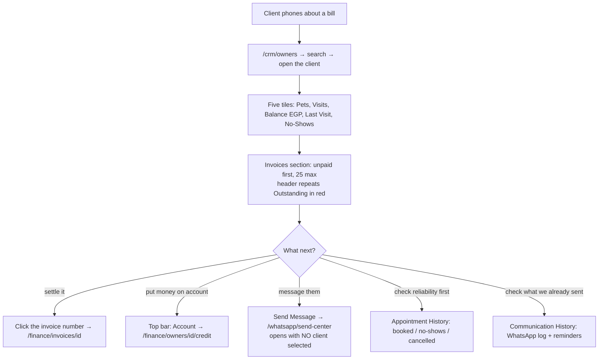

---

## Workflow 9 — Read a patient record and hand over its history

### 9.1 Who, when, why

A vet before an examination, or the front desk when an owner asks for their records — for
a referral, for travel, or for an insurance claim. The patient record is the merged view
of everything the product knows about one animal; the PDF is the version you can give
away.

### 9.2 Preconditions

- The `patients` grant.
- The pet exists. The record is readable with no clinical history at all — every section
  has an empty state.

### 9.3 The happy path

1. **Open the animal.** Client 360 → click its card in the `🐾 Pets` grid; or
   `/crm/pets` → click the card; or from any appointment via
   `View Medical Record / عرض السجل الطبي`.

2. **You land on `/crm/pets/<id>`,** headed with the species emoji and the pet's name,
   subtitled `<species> · <breed> — owned by / يملكه <owner>`.

3. **Left card:** the emoji, name, species·breed, then pills for sex, age (calculated from
   the date of birth as `3 yr` or, under a year, `7 mo`) and `Neutered / محوّل`. Below
   that: `Weight / الوزن`, `Date of Birth / تاريخ الميلاد`, `Color / اللون`,
   `Microchip / الميكروشيب` (monospaced), `Chronic Conditions / الأمراض المزمنة`, and an
   `Insurance / التأمين` block showing the provider, the policy number and the expiry
   date in green, amber (`⏰ Expiring soon / تنتهي قريباً`, within the next month) or red
   (`⚠️ EXPIRED / منتهية`).
   Then, if there are any, a red band: `⚠️ Allergies: / الحساسية: <text>`.
   Then the owner mini-card (initials, name, `📱 phone`) linking to the Client 360, and
   two footer links `✏️ Edit / تعديل` and `📅 Book / حجز`.
   Source: `templates/crm/pet_detail.html:207-319`; `blueprints/crm/routes.py:21-34, 806-809`

4. **`⚖️ Weight History / سجل الوزن`** — a bar per recorded visit weight, up to the last
   20, each labelled with the value in kg and the month-day of the visit. Bars are scaled
   against the largest value. The card is hidden entirely when no visit ever recorded a
   weight.
   Source: `blueprints/crm/routes.py:786-791`; `templates/crm/pet_detail.html:326-346`

5. **`📋 Medical Timeline / السجل الزمني الطبي`** — every event about this animal, newest
   first, with a count in the header. Fourteen kinds of event are merged:

   | Icon | Event | Opens |
   |---|---|---|
   | 🩺 | `Visit — <type>` | the visit |
   | 💉 | `Vaccine — <name>` | the vaccination certificate |
   | 🔧 | `Surgery — <procedure>` | — |
   | ✂️ | Grooming | the grooming booking |
   | 🧾 | Invoice | the invoice |
   | 🔬 | Lab | the lab request |
   | 🧬 | `Diagnosis / تشخيص — <text>` | the visit that produced it |
   | 💊 | `Prescription / وصفة طبية` (with an item count, e.g. `Active · 3 💊`) | the prescription |
   | 🏥 | `Inpatient admission / إقامة داخلية` | the stay |
   | 🏨 | `Boarding stay / إقامة إيواء` | the booking |
   | 🔔 | `Follow-up due / متابعة مستحقة` | the visit |
   | 🩻 | `Imaging study / دراسة تصويرية` | the study |
   | 📹 | `Telemedicine session / جلسة طب عن بُعد` | the session |
   | 🛍️ | `Pet shop purchase / مشتريات من المتجر` | the order |

   Imaging, telemedicine and pet-shop rows are fetched with guarded queries, so a module
   that has never been opened on this install contributes nothing instead of breaking the
   page.
   Source: `blueprints/crm/routes.py:100-211, 776-786`;
   `models/database.py:3242-3270`; `templates/crm/pet_detail.html:349-404`

6. **Quick links under the timeline:** `📅 New Appointment / موعد جديد`,
   `🩺 New Visit / زيارة جديدة`, `🩻 Imaging / التصوير الطبي`,
   `🏥 Inpatient / القسم الداخلي`, `⚕️ Drug & Dose Check / فحص الأدوية والجرعات`.
   Source: `templates/crm/pet_detail.html:397-403`

7. **`💉 Vaccinations / التطعيمات`** — Vaccine, Brand, Administered, Next Due, By. A
   next-due date in the past renders as overdue; one inside the next month renders as due
   soon. `➕ Add / إضافة` opens `/clinical/vaccinations/new?pet_id=<id>`.
   Source: `templates/crm/pet_detail.html:406-447`

8. **`📝 Notes / ملاحظات`** — shown only when the pet has notes.

9. **Hand over the history: press `📄 Medical History PDF / السجل الطبي PDF`** in the top
   bar. The browser downloads `Bisa_medical_history.pdf` (spaces in the name become
   underscores) containing:
   - a centred clinic header, the line `Patient Medical History Report`, and
     `Generated: 19 Aug 2026`;
   - a patient block — `Patient: <name>`, `Species | Breed`, `Sex | Age`, `Microchip`,
     `Neutered/Spayed`, then `ALLERGIES: …` in red if any, then `Chronic Conditions`;
   - `Owner Information` — name and phone;
   - `Vaccination Records (N)` — a bordered table of Vaccine / Date Given / Next Due /
     Batch + Notes;
   - `Visit History (N visits)` — for each visit, newest first:
     `<date> - <type> (Dr. <doctor>)`, then Weight, Complaint, Diagnosis, Treatment and
     Notes lines where present.

   Arabic names are rendered through an Arabic-safe FPDF subclass, so an Arabic patient or
   owner name does not break the document.
   Source: `blueprints/crm/routes.py:896-1052`

### 9.4 Every alternative that genuinely branches

- **An animal with no history at all** shows
  `No medical events recorded yet. / لا توجد أحداث طبية مسجلة بعد.` and
  `No vaccinations recorded yet. / لا توجد تطعيمات مسجلة بعد.`, no weight card, and the
  PDF still generates — with `Visit History (0 visits)` and no vaccination table.
- **An animal with allergies** gets the red band on the record and a red `ALLERGIES:` line
  in the PDF.
- **An animal with insurance** gets the extra block and the expiry colouring; without
  insurance the block is absent everywhere including the PDF, which never mentions
  insurance at all.
- **Correcting the record** — `✏️ Edit / تعديل` in the top bar or the card footer, which is
  Workflow 2's form in edit mode.

### 9.5 Errors and edge cases

| What you did | What you see |
|---|---|
| Opened a pet id that does not exist | `Pet not found.` (red) and a redirect to `/crm/owners` |
| Requested the PDF for a pet id that does not exist | Same |
| Pressed `✨ AI Summary / ملخص ذكي` | **Nothing happens.** See 9.7. |

Edge cases:

- **Age is "Unknown" whenever the date of birth is missing or unparseable**, and the age
  pill is then hidden on the record while the PDF prints `Age: Unknown`.
  Source: `blueprints/crm/routes.py:21-34`; `templates/crm/pet_detail.html:216-218`
- **The weight chart divides by the largest weight**, so a single stray 90 kg entry
  flattens every real bar.
  Source: `templates/crm/pet_detail.html:333-339`
- **"Expiring soon" is computed by replacing the month number**, which means the window is
  "same day next month" and rolls the year over in December.
  Source: `blueprints/crm/routes.py:796-799`
- **The PDF truncates:** complaint and diagnosis and treatment at 100 characters, notes at
  80, vaccine name and batch/notes at 40.
  Source: `blueprints/crm/routes.py:1036-1043`
- **A visit with no doctor prints `(Dr. )`.**
  Source: `blueprints/crm/routes.py:1031`

### 9.6 What gets written, and what changes elsewhere

**Nothing.** Both the record and the PDF are read-only. Ten queries build the timeline
(six from the shared model helper, one UNION covering five more types, three guarded ones),
plus one for the weight history.
Source: `blueprints/crm/routes.py:100-211, 776-800`

### 9.7 Known limits of this workflow

1. **The `✨ AI Summary / ملخص ذكي` button is dead.** Its modal markup sits between the
   `` that closes `content` and the `` that follows — that
   is, outside every Jinja block in a template that extends `base.html`, so Jinja discards
   it entirely. `openPetSummary()` then calls `modal.style.display` on `null` and throws a
   TypeError. The button is rendered unconditionally, even when the clinic has no AI
   configured. (Verified by rendering a minimal template of the same shape: content between
   two blocks in a child template is dropped.)
   Source: `templates/crm/pet_detail.html:461-505` (orphan markup), `506-538` (the script),
   `10-15` (the button)
2. **The PDF's clinic header always reads "Animal Hospital".** The route asks for
   `clinic.get("clinic_name")`, but the `clinic` table's column is `name` — verified in both
   `data/platform.db` and `data/demo.db` — so the lookup returns nothing and the hardcoded
   fallback prints on every report the clinic hands to a client.
   Source: `blueprints/crm/routes.py:950`; `models/database.py:2883-2893`;
   `PRAGMA table_info(clinic)` on both shipped databases
3. **The PDF prints only the first diagnosis and the latest treatment plan per visit** —
   a deliberate simplification, flagged as such in the code, because concatenating rows is
   not portable across both database engines.
   Source: `blueprints/crm/routes.py:918-931`
4. **The PDF has no Arabic labels.** The field names ("Patient", "Species", "Owner
   Information", "Visit History") are English regardless of the interface language; only
   the *data* is Arabic-safe.
5. **The timeline is unpaginated and uncapped.** Every event in the animal's life is
   rendered on one page.
6. **Surgeries have no deep link** — the timeline row is plain text — and neither the
   surgery nor the grooming rows appear in the PDF.
   Source: `blueprints/crm/routes.py:146-180`

### 9.8 Flowchart

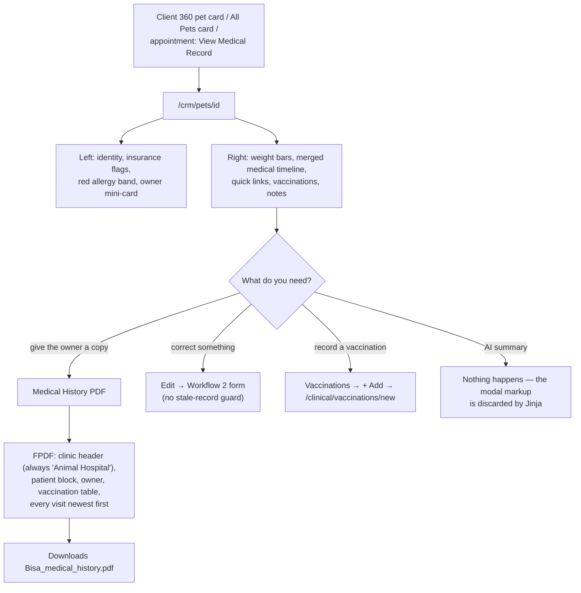

---

## Workflow 10 — Loyalty points: redeem or adjust

### 10.1 Who, when, why

The front desk, when a client asks to use the points they have earned, or when a manager
wants to grant a goodwill balance or claw one back. Points are earned automatically: every
payment awards one point per 10 EGP, minimum one, with the reason `Invoice #42 payment`.
Source: `blueprints/finance/routes.py:60, 65-87`

### 10.2 Preconditions

- The `patients` grant — **that is the only check**. See 10.7.
- To redeem, the client must have **at least 100 points**; below that the button is not
  rendered.

### 10.3 The happy path

1. **Open the client** and scroll to `🎁 Loyalty Points / نقاط الولاء`. The header shows
   the balance in large type, e.g. `240 pts / نقطة`.

2. **Three tiles:**
   - `BALANCE / الرصيد` — the points.
   - `REDEEM VALUE / قيمة الاستبدال` — `balance × 0.5`, labelled
     `EGP (if redeemed) / جنيه (عند الاستبدال)`.
   - `EARN RATE / معدل الكسب` — a fixed `1`, labelled
     `pt per 10 EGP paid / نقطة لكل 10 جنيه مدفوعة`.
   Source: `blueprints/crm/routes.py:422`; `templates/crm/owner_detail.html:634-655`

3. **Press `🎁 Redeem 100 pts → 50 EGP credit / استبدال 100 نقطة ← رصيد 50 جنيه`.** A
   browser confirm asks
   `Redeem 100 points for 50 EGP credit? / استبدال 100 نقطة مقابل رصيد 50 جنيه؟`

4. **Confirm.** You return to the Client 360 with a green flash
   `Redeemed 100 points for 50.0 EGP credit. Remaining balance: 140 pts.` The header
   balance drops by 100 and a new `-100` row appears in the ledger.
   Source: `blueprints/crm/routes.py:463-484`

### 10.4 Every alternative that genuinely branches

- **Below 100 points**, the button is replaced by a dashed box:
  `Minimum <N> more points needed to redeem (need 100, have <balance>). /
  تحتاج <N> نقطة إضافية للاستبدال (المطلوب 100، المتاح <balance>).`
  Source: `templates/crm/owner_detail.html:668-674`

- **Granting or removing points by hand.** Expand
  `⚙️ Manual Adjustment / تعديل يدوي` (a collapsed `
`), type a signed number into
  `Points (+ or -) / النقاط (+ أو -)` (placeholder `e.g. 50 or -20 / مثال: 50 أو -20`),
  optionally replace the pre-filled `Reason / السبب` (which defaults to the literal text
  `Manual adjustment`, placeholder `e.g. Welcome bonus / مثال: مكافأة ترحيبية`), and press
  `Apply / تطبيق`. You get
  `Added 50 loyalty points. Reason: Welcome bonus` or
  `Deducted 20 loyalty points. Reason: Manual adjustment`.
  Source: `templates/crm/owner_detail.html:676-700`; `blueprints/crm/routes.py:491-528`

- **Reading the ledger.** The last 30 rows are shown: Date, Reason, By, Points — positive
  green with a `+`, negative red. Rows come from earning (invoice payments), redemption and
  manual adjustment alike.
  Source: `blueprints/crm/routes.py:403-410`; `templates/crm/owner_detail.html:702-731`

### 10.5 Errors and edge cases — the exact messages

| What you did | What you see |
|---|---|
| Redeemed with fewer than 100 points (by posting directly — the button is hidden) | `Insufficient points. Need 100, have 40.` (amber) and a redirect back |
| Applied an adjustment of 0, or typed something that is not a number | `Enter a non-zero adjustment.` (amber) and a redirect back |
| Either action on a client id that does not exist | `Owner not found.` (red) and a redirect to `/crm/owners` |

Source: `blueprints/crm/routes.py:453-461, 493-506`

Edge cases:

- **A non-numeric adjustment becomes 0**, which then trips the "non-zero" message — it is
  never applied as a partial value.
  Source: `blueprints/crm/routes.py:500-506`
- **A negative adjustment can push the balance below zero.** There is no floor.
  Source: `blueprints/crm/routes.py:520-523`
- **Redemption is unconditional beyond the 100 check** — no once-per-visit limit, no cap.
  Press it repeatedly and the balance keeps dropping by 100.
- **The ledger and the balance are updated in one transaction**, so a failure leaves
  neither.
  Source: `blueprints/crm/routes.py:464-480`

### 10.6 What gets written, and what changes elsewhere

| Table | Redeem | Adjust |
|---|---|---|
| `loyalty_points` | one row, `points=-100`, `reason='Redeemed 100 pts = 50.0 EGP credit'`, `ref_type='redemption'`, `created_by=<your full name>` | one row, `points=<signed>`, `reason=<yours>`, `ref_type='manual'` |
| `owners` | `loyalty_balance = loyalty_balance - 100` | `loyalty_balance = COALESCE(loyalty_balance,0) + <signed>` |

Source: `blueprints/crm/routes.py:464-480, 510-524`

**What changes elsewhere:** the balance chip on the client list (`🎁 <N>`, shown only above
zero), the three tiles, the ledger, and whether the redeem button is offered at all.
Source: `templates/crm/owners_list.html:270-276`

### 10.7 Known limits of this workflow

1. **Redemption creates no money anywhere.** It writes a ledger row and decrements a
   counter. **No invoice is credited, no account deposit is made, no finance record is
   touched.** The "50 EGP credit" exists only as the text of the ledger reason — somebody
   has to apply the discount by hand on the invoice, and nothing in the product connects
   the two.
   Source: `blueprints/crm/routes.py:463-484`
2. **The control is labelled for managers and gated for nobody.** Both routes carry only
   `@login_required`, so **any** role holding the `patients` grant — including groomer,
   boarding_staff and nurse — can grant or remove points, despite the heading
   `Manual Adjustment (admin/manager)` in the code comment and the collapsed styling that
   implies privilege.
   Source: `blueprints/crm/routes.py:446-448, 491-493`
3. **The redeem-value tile and the redeem button disagree except at exactly 100 points.**
   The tile values points at 0.5 EGP each, so 240 points shows `120 EGP`; the only thing
   you can actually do is exchange 100 for 50, four times over, leaving 40 points and
   200 EGP of "credit" that never existed as money anyway.
   Source: `blueprints/crm/routes.py:422, 450-451`
4. **Neither action is written to the audit log**, unlike creating or editing a client.
   Only the `created_by` name on the ledger row records who did it.
   Source: `blueprints/crm/routes.py:463-528` — no `db.log_audit` call
5. **Both forms ship the wrong CSRF field name** (`csrf_token`) and work only because
   `platform.js` injects the right one.
   Source: `templates/crm/owner_detail.html:663, 685`

### 10.8 Flowchart

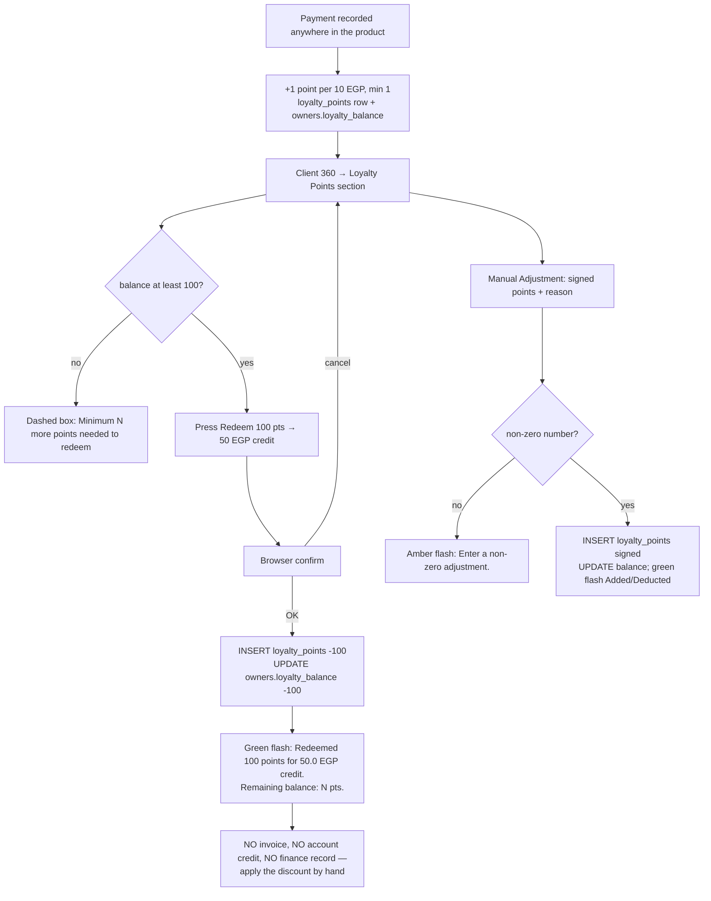

---

## Workflow 11 — Judge whether a booking will be honoured

### 11.1 Who, when, why

Anyone opening a `Scheduled` or `Confirmed` appointment. The badge loads by itself and
offers a 0–100 no-show score with the reasons behind it. It is **advisory only** —
nothing in the product acts on it.

### 11.2 Preconditions

- The `appointments` grant, and an appointment whose status is `Scheduled` or `Confirmed`.
  For every other status the badge is not rendered and the script does not run.
  Source: `templates/appointments/appt_detail.html:43-46, 140`

### 11.3 The happy path

1. **Open `/appointments/<id>`.** Next to the status, priority and type pills, a badge
   appears reading `Loading risk... / جارٍ حساب المخاطرة...` and then resolves to one of:
   - `🟢 Low Risk (12%)` — green, score under 30
   - `🟡 Medium Risk (45%)` — amber, 30–59
   - `🔴 High No-Show Risk (72%)` — red, 60 and above

2. **Click the badge.** A dark panel opens at the bottom right,
   `📊 No-Show Risk Factors / 📊 عوامل خطر عدم الحضور`, listing the reasons as bullets, and
   `Dismiss / تجاهل` closes it. With no reasons it reads
   `No specific risk factors identified.`
   Source: `templates/appointments/appt_detail.html:127-181`

### 11.4 How the score is built

| Condition | Points | Reason text |
|---|---|---|
| The client has never had an appointment | +15 | `New client — no history` |
| Any previous no-show | + no-show rate as a percentage, capped at 45 | `No-show rate: 2/8 appointments (25%)` |
| Cancellation rate above 30% | +10 | `High cancellation rate (37%)` |
| Invoices with status exactly `Unpaid` | +7 each, capped at 20 | `3 unpaid invoice(s)` |
| Last completed appointment more than 180 days ago | +12 | `Inactive — last visit 214 days ago` |
| …or more than 90 days ago | +5 | *(no reason line)* |
| The appointment starts before 09:00 | +8 | `Early morning slot` |

The total is capped at 100.
Source: `blueprints/appointments/routes.py:629-693`

### 11.5 Errors and edge cases

- **Any failure produces a zero score, not an error.** The whole computation is wrapped in
  a `try`; an exception is logged and the badge shows `🟢 Low Risk (0%)`.
  Source: `blueprints/appointments/routes.py:686-693`
- **A failed fetch leaves the badge hidden**, because the script only reveals it on a
  successful response.
  Source: `templates/appointments/appt_detail.html:144-165`
- **`Partial` invoices do not count** — the unpaid check matches `status='Unpaid'` exactly.
  Source: `blueprints/appointments/routes.py:657-659`
- **The 90-day band adds points with no reason line**, so a score can be 5 higher than the
  listed factors explain.
  Source: `blueprints/appointments/routes.py:675-676`

### 11.6 What gets written

**Nothing.** The endpoint is read-only and the result is not stored, not logged and not
used by any other screen.

### 11.7 Known limits of this workflow

1. **The badge text is English-only** (`High No-Show Risk`, `Medium Risk`, `Low Risk`) and
   so is every reason string, on an otherwise bilingual page.
   Source: `blueprints/appointments/routes.py:645-683`;
   `templates/appointments/appt_detail.html:152-161`
2. **Nothing acts on the score.** No reminder is triggered, no overbooking is suggested, no
   deposit is requested. It is a number on a screen.
3. **The score is computed twice on every page load.** `appt_detail.html` defines
   `` *inside* ``, and Jinja renders a nested block in
   both places — once where it is written and once where `base.html` calls it — so the
   fetch fires twice and the badge is written twice. (Verified by rendering a minimal
   template of the same shape.)
   Source: `templates/appointments/appt_detail.html:13, 138, 184-185`;
   `templates/base.html:1321`

### 11.8 Flowchart

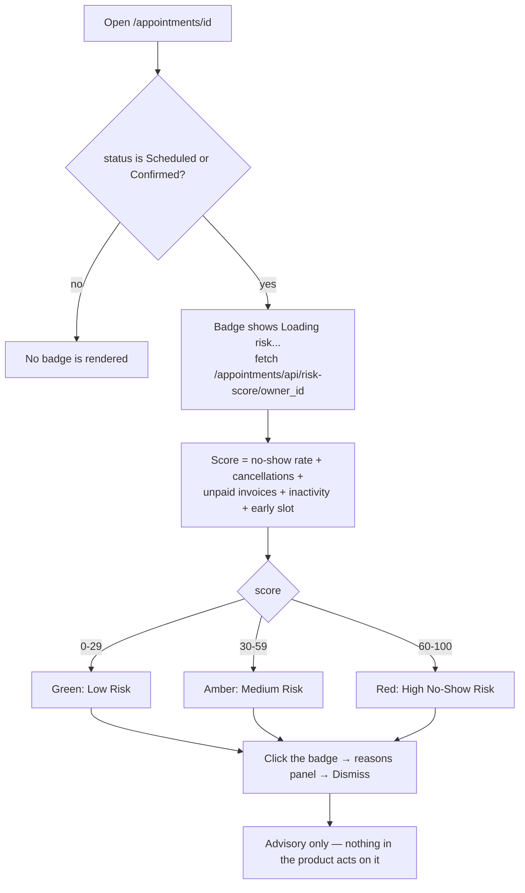

---

## Appendix A — Everything in this chapter that does not work as it looks

Ordered by how likely it is to cost somebody an afternoon.

| # | What | Where | Section |
|---|---|---|---|
| 1 | Reception cannot open `New Visit`, though the sidebar offers it to her | `blueprints/auth/routes.py:150`; `models/database.py:4365-4367` | 0.2, 7.7 |
| 2 | A new patient created on the New Visit page can select the **wrong animal** (last by name, not newest) | `templates/workflow/index.html:954-957` | 7.7 |
| 3 | A prescription refused for a non-vet reads as a success; the invoice is raised with no medication lines | `blueprints/visits/routes.py:326-352`; `templates/workflow/index.html:1089-1092` | 7.7 |
| 4 | A doctor or nurse taking payment on the New Visit page is told the amount is wrong, not that they lack permission | `blueprints/auth/routes.py:129-134`; `templates/workflow/index.html:1236-1242` | 7.7 |
| 5 | Finishing a walk-in never closes the appointment | `blueprints/visits/routes.py:465-588` (writes no appointment status) | 5.7, 7.7 |
| 6 | Booking with no doctor bypasses every double-booking check | `blueprints/appointments/routes.py:309, 481` | 3.5 |
| 7 | Loyalty redemption creates no money anywhere, and any `patients` role can adjust points | `blueprints/crm/routes.py:446-484` | 10.7 |
| 8 | The `Balance` column on the client list is always `—` | `templates/crm/owners_list.html:257` | 1.7 |
| 9 | `+ New Pet` and `+ Add Pet` on All Pets and the dashboard cannot work | `templates/crm/pets_list.html:10`; `templates/launcher.html:338` | 2.7 |
| 10 | All Pets is capped at 100 with no pagination; the species filter runs after the cap | `models/database.py:3191-3200` | 2.7 |
| 11 | Insurance fields are dropped when a pet is first created | `blueprints/crm/routes.py:702-735` | 2.7 |
| 12 | Pet edit and appointment reschedule have no stale-record guard | `blueprints/crm/routes.py:819-893` | 2.7, 4.7 |
| 13 | The waiting-room queue table never refreshes; only three counters do | `templates/appointments/waiting_room.html:286-298` | 6.7 |
| 14 | The waiting room fails closed with a bare 404 when no token is configured | `blueprints/appointments/routes.py:744-756` | 6.4 |
| 15 | Reception Workspace is unreachable from the interface | no template links to it | 0.3, 5.7 |
| 16 | The `AI Summary` button on the patient record is dead markup | `templates/crm/pet_detail.html:461-505` | 9.7 |
| 17 | The Medical History PDF header always reads "Animal Hospital" | `blueprints/crm/routes.py:950` | 9.7 |
| 18 | The booking form's "no past dates" guard is inert | `templates/appointments/appt_form.html:250` | 3.5 |
| 19 | A booking validation failure loses almost the whole form | `blueprints/appointments/routes.py:279-294, 345-353` | 3.7 |
| 20 | Symptoms cannot be edited after booking | `templates/appointments/appt_edit.html` | 4.7 |
| 21 | The duplicate-client refusal names the client but gives no link to open them | `blueprints/crm/routes.py:283-286` | 1.7 |
| 22 | `In Progress` is an off-list status: grey badge, unselectable, invisible on the TV | `blueprints/appointments/routes.py:26-40, 780` | 5.7 |
| 23 | The client-list header count and the client list itself use different search columns | `models/database.py:3036-3059` | 1.7 |
| 24 | `Send Message` on the Client 360 opens the send centre with no client selected | `templates/crm/owner_detail.html:585` | 8.7 |
| 25 | A zero-priced invoice shows `Settled in full` while its stored status is `Unpaid` | `templates/workflow/index.html:1136-1155` | 7.5 |
| 26 | Every write in this chapter needs JavaScript; without it, a 403 page | `static/js/platform.js:131-146` | 0.6 |
| 27 | The status-change redirect target is taken from the form unvalidated | `blueprints/appointments/routes.py:448` | 5.7 |
| 28 | Clients created on the New Visit page have marketing consent off | `blueprints/crm/routes.py:260` | 1.7 |
| 29 | The no-show risk score is computed twice per page load | `templates/appointments/appt_detail.html:13, 138` | 11.7 |

---

## Appendix B — Every flash message in this chapter, in one place

**Clients and patients** (`blueprints/crm/routes.py`)

- `Full name is required.`
- `<name> already uses this mobile number. Open <name> instead, or use a different number.`
- `Owner '<name>' created successfully.`
- `Owner updated successfully.`
- `Owner not found.`
- `Owner ID is required to create a pet.`
- `Pet name is required.`
- `Pet '<name>' added successfully.`
- `Pet updated successfully.`
- `Pet not found.`
- `Insufficient points. Need 100, have <n>.`
- `Redeemed 100 points for 50.0 EGP credit. Remaining balance: <n> pts.`
- `Enter a non-zero adjustment.`
- `Added <n> loyalty points. Reason: <reason>` / `Deducted <n> loyalty points. Reason: <reason>`

**Concurrency** (`models/concurrency.py`)

- `<username> changed this while you had it open (<when>). Your changes were NOT saved. Reopen it and apply them again so nothing of theirs is lost.`
- `Somebody else changed this while you had it open. Your changes were NOT saved. Reopen it and apply them again.`
- `That record no longer exists — somebody deleted it while you had it open.`

**Appointments** (`blueprints/appointments/routes.py`)

- `Owner and pet are required.`
- `That pet is no longer on file for this client. Please re-select the client and pet.`
- `⚠️ <doctor> already has an appointment at <time> on <date>. Please choose a different slot.`
- `Appointment booked successfully.`
- `Appointment not found.`
- `Invalid status: <status>`
- `Appointment status updated to <status>.`
- `Cannot edit a completed or cancelled appointment.`
- `⚠️ <doctor> already has an appointment at <time> on <date>.`
- `Appointment rescheduled successfully.`

**Visits, clinical and finance, reached from the New Visit page**

- `Owner and pet are required.` · `Visit created successfully.`
- `Diagnosis text is required.` · `Diagnosis added.`
- `Visit not found.` · `Select the prescribing veterinarian. Only a vet may be recorded as the prescriber, though you may enter the prescription on their behalf.` · `"<name>" is not an active veterinarian on this system, so a prescription cannot be recorded against them.` · `No veterinarian is set up on this system, so a prescription cannot be attributed to one. Add a user with the doctor role first.` · `Prescription added.`
- `Please add at least one diagnosis before completing the visit.` · `Visit completed. Invoice #<n> auto-generated.` · `Visit completed but invoice creation failed: <error>` · `Visit marked as Completed.`
- `Pet is required.` · `No next-due date was set, so no reminder will be sent for this vaccination.` · `Vaccination '<name>' recorded.`
- `"<text>" is not a valid payment amount.` · `Payment amount must be greater than zero.` · `That is more than the <amount> still owed on this invoice.` · `That invoice has been cancelled.` · `Payment of <amount> recorded. +<n> loyalty points awarded.` · `Payment of <amount> recorded successfully.` · `The payment could not be recorded. Nothing was charged — please try again, or record it in cash.`
- `Deposit recorded.` · `Refund recorded.`

**Access and session** (`blueprints/auth/routes.py`, `app.py`)

- `Please log in to continue.`
- `Your session has expired. Please log in again.`
- `You don't have permission to access this page.`
- `Invalid or missing security token. Please go back and try again.` (a full 403 page, not a flash)

---

*Written from source only. No screen in this chapter was opened in a browser while writing
it; every statement was read from the route functions, templates, `models/database.py`,
`models/concurrency.py`, `models/payments/`, `models/money.py`, `static/js/platform.js` and
the two SQLite databases in `data/`.*
