# Aleefy Workflow Book — Chapter: Dashboards, Reports and the AI Assistant

**Scope of this chapter.** Everything the platform shows you *about itself*: the
main clinic dashboard at `/`, the eight report screens under `/reports/`, the
report builder, the AI Assistant at `/ai/`, the Ctrl+K command palette, and the
Petsy chat bubble.

**Everything below was read out of the source before it was written.** Every
screen carries a `**Source**` line at the end so the next writer can check it.
Where the code does something surprising, wrong, or nothing at all, it is said
plainly here and repeated in **Appendix B — Known limits**. Nothing in this
chapter describes a button that does not exist.

**Bilingual.** The platform renders every `t('English', 'العربية')` string in the
reader's language. Where a label is bilingual, both are given. Where a label is
English-only in the source, that is stated — it is not an oversight in this
manual, it is the state of the code.

**Money.** All amounts are Egyptian pounds (EGP). The examples use a Cairo clinic:
Dr. Hatem El Khateeb, receptionist Mona Abdel Rahman, inventory manager Karim
Fouad, owner-manager Ahmed El Gohary, and clients such as Salma Ibrahim (Maadi)
with her cat **Bosy**, and Youssef Naguib (Nasr City) with his German Shepherd
**Simba**.

---

## Table of contents

| # | Workflow | Route(s) |
|---|----------|----------|
| 0 | Who can see what — the permission map | — |
| 1 | Morning dashboard check | `GET /` |
| 2 | Find and open a module from the catalogue | `GET /` |
| 3 | Executive report review | `GET /reports/dashboard` |
| 4 | Financial period review with comparison | `GET /reports/financial`, `/reports/financial/compare` |
| 5 | Stock and expiry review, then export | `GET /reports/inventory`, `/reports/inventory/export/xlsx` |
| 6 | Doctor revenue review | `GET /reports/doctor-revenue` |
| 7 | Bulk data extract (four CSV buttons) | `GET /reports/export/csv` |
| 8 | Build a custom report | `GET /reports/builder` → `POST /reports/builder/run` |
| 9 | Save and re-run a report configuration | `POST /reports/builder/save`, `GET /reports/builder/saved/<id>` |
| 10 | Describe a report in plain language | `POST /ai/nl-report` |
| 11 | Ask the AI Assistant | `GET /ai/` → `POST /ai/chat` |
| 12 | Quick ask from anywhere (Ctrl+K) | `POST /ai/chat` |
| 13 | AI actions embedded in clinical and comms screens | 8 JSON endpoints |
| 14 | Ask Petsy for live clinic data (staff mode) | `POST /petsy/chat` |
| 15 | A pet owner asks Petsy a public question | `/petsy/embed`, `/petsy/widget.js` |
| A | Side doors: stub, coming-soon, legacy bridge | `/module/<id>`, `/coming-soon`, `/launcher/legacy/*` |
| B | Known limits (verified in source) | — |
| C | Screen index with file:line | — |

---

# 0. Who can see what — the permission map

Read this once. Half of the "it doesn't work for me" calls in this area are a
permission, not a fault.

## 0.1 The two gates

There are **two independent gates**, and both must pass.

**Gate 1 — the module grant.** Every request into a blueprint passes
`_permission_denied()`, which is called from inside `@login_required`. It maps
the blueprint name to a *grant key* and checks whether the signed-in user's role
holds that key.

| Blueprint | Grant key | Set at |
|---|---|---|
| `reports` (all report + builder routes) | `reports` | `_BP_PERMISSION` default (name matches) |
| `ai_assistant` (all `/ai/…` routes) | `ai` | `blueprints/auth/routes.py:140` |
| `petsy` | `petshop` — **but see 0.4, it never fires** | `blueprints/auth/routes.py:146` |
| `launcher` (the dashboard) | *none* — falls open | `_permission_for()` returns `""` |

If the gate refuses, you get a red banner reading
**"You don't have permission to access this page."** and you land back on the
dashboard. For a JSON request (`/api/…` path, or `Accept: application/json`) you
get `403 {"ok": false, "error": "forbidden"}` instead.

**Source:** `D:/vet/platform/blueprints/auth/routes.py:89` (`_permission_denied`),
`:140` (`_BP_PERMISSION`), `:154` (`_permission_for`).

**Gate 2 — the launcher card filter.** Which *cards* appear on the dashboard is a
separate list, `mod["roles"]`, hardcoded per module in `MODULES`. It has nothing
to do with the grant. The two disagree — see 0.3.

**Source:** `D:/vet/platform/blueprints/launcher/routes.py:574` (`_visible_modules`).

## 0.2 Seeded grants, by role

These are the **defaults** in `DEFAULT_ROLE_PERMISSIONS`. `seed_default_permissions()`
only writes them into a role whose `permissions_json` is empty, so an
administrator who has edited the Roles screen overrides everything below.

| Role | Holds `reports`? | Holds `ai`? |
|---|---|---|
| `super_admin` | bypasses both gates entirely | bypasses |
| `clinic_owner` | ✅ (holds every key) | ✅ |
| `branch_manager` | ✅ | ❌ |
| `doctor` | ✅ | ✅ |
| `nurse` | ❌ | ❌ |
| `reception` | ❌ | ❌ |
| `pharmacist` | ❌ | ❌ |
| `inventory_mgr` | ✅ | ❌ |
| `finance` | ✅ | ❌ |
| `hr` | ❌ | ❌ |
| `groomer` | ❌ | ❌ |
| `boarding_staff` | ❌ | ❌ |
| `support_admin` | ❌ | ❌ |
| `auditor` | ✅ | ❌ |

**`super_admin` short-circuits at the top of `_permission_denied()`** — the
function returns `None` before any key is looked up.

**Source:** `D:/vet/platform/models/database.py:4346` (`DEFAULT_ROLE_PERMISSIONS`),
`:4382` (`seed_default_permissions`), `blueprints/auth/routes.py:105`.

## 0.3 Where the card list and the grant disagree

This is the single most confusing thing in this area, and it is real:

| Module card | Card shown to (`mod["roles"]`) | Grant actually needed | Result |
|---|---|---|---|
| **AI Assistant** (`/ai/`) | super_admin, clinic_owner, branch_manager, doctor, nurse, reception, finance, inventory_mgr | `ai` — held only by clinic_owner and doctor | A **nurse, receptionist, branch manager, finance or inventory user sees the card, clicks it, and is bounced** with "You don't have permission to access this page." |
| **Reports** (`/reports/dashboard`) | super_admin, clinic_owner, branch_manager, finance, auditor | `reports` — also held by doctor and inventory_mgr | A **doctor or inventory manager sees no Reports card**, but the sidebar link works and the URL opens fine. |

On top of that, the **left sidebar shows the "AI Assistant / المساعد الذكي" and
"Reports / التقارير" links to every signed-in user regardless of role** — they are
not wrapped in any ``.

**Source:** `blueprints/launcher/routes.py:364` (ai card roles), `:378` (reports card
roles), `templates/base.html:219` (Reports nav link), `:261` (AI Assistant nav link).

## 0.4 Petsy has no gate at all

None of the three Petsy routes (`/petsy/chat`, `/petsy/embed`, `/petsy/widget.js`)
carries `@login_required`. `_permission_denied()` is only ever called *from
inside* `@login_required`, so the `"petsy": "petshop"` mapping is dead code for
these routes. Anyone — signed in or not, any role — can reach all three.

Inside staff mode the **only** role scoping is a doctor's own-name filter on the
appointments and visits queries. A groomer, a boarding attendant or a nurse who
types "revenue today" into Petsy gets the clinic's real collected figure; "unpaid
invoices" returns real client names and real balances.

**Source:** `blueprints/petsy/routes.py:755` (`chat`, no decorator), `:830` (`embed`),
`:846` (`widget_js`), `:270` (the doctor filter), `blueprints/auth/routes.py:146`.

## 0.5 The unknown-role trap

`_permission_denied()` **fails closed for an unknown role**. If the user's role
string has no row in the `roles` table *and* is not one of the built-in keys in
`DEFAULT_ROLE_PERMISSIONS`, the grant set becomes empty and every governed
blueprint — reports and AI included — refuses.

The literal role `"staff"` appears in several launcher card role lists
(appointments, crm, invoicing, petshop, …) but has **no entry** in
`DEFAULT_ROLE_PERMISSIONS`. A user whose role is `staff` and whose clinic has no
`staff` row in `roles` is denied everything the gate governs.

A user whose role matches *no* module at all is flashed, on the dashboard:

> **"Your account has no role assigned, or its role is not recognised. Ask an administrator to set your role."**

**Source:** `blueprints/auth/routes.py:118-128`, `blueprints/launcher/routes.py:604-608`.

---

# Workflow 1 — Morning dashboard check

## 1.1 Who, when, why

**Who:** every staff member, every role, every morning.
**When:** immediately after sign-in — `auth.login` sends you to `/`.
**Why:** to see today's numbers and jump to whatever needs doing.

## 1.2 Preconditions

- A signed-in session. `launcher.index` has **no `@login_required`**; it checks
  `session.get("user")` itself and redirects a guest to the login page.
- The user's role must match at least one module, otherwise the module catalogue
  is empty and the "no role assigned" warning fires (see 0.5).
- Nothing else. All figures degrade to `0` if the database read fails — the whole
  `db.get_dashboard_stats()` call is wrapped in `try/except` and falls back to
  an empty dict.

## 1.3 The happy path

**Step 1 — Sign in.** You land on `/`, page title **"Dashboard" / "لوحة التحكم"**.

**Step 2 — Read the greeting.** Top-left:
`Good Morning, <your full name> 👋` (Morning before 12:00, Afternoon before
17:00, Evening after). The **greeting word is English-only** — it is not wrapped
in `t()`. The subtitle underneath *is* bilingual:
**"Here's what's happening at the clinic today" / "إليك ما يجري في العيادة اليوم"**.

Top-right, two buttons: **"+ New Appointment / + موعد جديد"** (`/appointments/new`)
and **"+ Add Pet / + إضافة حيوان"** (`/crm/pets/new`).

**Step 3 — Read the 8 KPI cards.** Every card is a link. The numeric cards animate
from 0 to their value over 900 ms.

| # | Card | Arabic | Source field | Links to |
|---|---|---|---|---|
| 1 | Today's Appointments | مواعيد اليوم | `appts_today` | `/appointments/` |
| 2 | Total Pets | إجمالي الحيوانات | `pets_total` | `/crm/owners` |
| 3 | Pet Owners | أصحاب الحيوانات | `owners_total` | `/crm/owners` |
| 4 | Visits Today | زيارات اليوم | `visits_today` | `/visits/` |
| 5 | Revenue Today | إيرادات اليوم | `revenue_today` | `/finance/invoices` |
| 6 | Unpaid Invoices | فواتير غير مدفوعة | `invoices_unpaid` | `/finance/invoices?status=Unpaid` |
| 7 | Reminders | التذكيرات | `pending_reminders` | `/whatsapp/control` |
| 8 | Outstanding | المستحق | `outstanding` | `/finance/invoices?status=Unpaid` |

Money cards render with thousands separators and **no currency symbol** — the
sub-caption carries it: "EGP collected today / جنيه محصّل اليوم" and
"EGP total receivable / إجمالي المستحق بالجنيه". So a 4,850 EGP morning shows as
`4,850`.

What the numbers actually count (this matters at month-end):

- **Revenue Today** = `SUM(paid_amount)` over invoices whose **`issue_date` is
  today** and whose status is `Paid` or `Partial`. It is *accrual*, not till cash:
  600 EGP taken this morning against an invoice issued last Tuesday does **not**
  appear here.
- **Unpaid Invoices** counts status `Unpaid` **and `Partial`** — a half-paid
  invoice is counted as unpaid.
- **Outstanding** = `SUM(due_amount)` over the same `Unpaid`+`Partial` set, with
  **no date filter at all** — it is the clinic's whole receivable book, not
  today's.

**Source:** `models/database.py:3995` (`get_dashboard_stats`),
`templates/launcher.html:360-431`.

**Step 4 — Use the Quick Launch strip.** Eight fixed tiles, identical for every
role and **not filtered by permission**: Appointments / المواعيد, Pets & Owners /
الحيوانات والملاك, Clinical Visits / الزيارات السريرية, Finance / المالية,
Inventory / المخزون, Pet Shop / متجر الحيوانات, AI Assistant / المساعد الذكي,
Reports / التقارير. Clicking one you have no grant for gets you the
"You don't have permission…" bounce from the destination.

**Source:** `templates/launcher.html:436-500`.

**Step 5 — Read Today's Schedule.** Left column, headed
**"📆 Today's Schedule / جدول اليوم"**, with a **"View all / عرض الكل →"** link to
`/appointments/`.

- If `appts_today == 0`, you get the empty state: 🌿, **"No appointments today /
  لا مواعيد اليوم"**, **"The clinic is calm — no appointments scheduled for today. /
  العيادة هادئة، لا مواعيد مجدولة لهذا اليوم."**, and a green
  **"+ Schedule Appointment / + جدولة موعد"** button.
- Otherwise three grey skeleton bars appear, then JavaScript fetches
  `/appointments/api/queue` and fills a five-column table:
  **Time / الوقت · Pet / الحيوان · Owner / المالك · Doctor / الطبيب · Status / الحالة**,
  capped at the **first 8 rows**. Below it: **"📅 View full calendar / عرض التقويم الكامل →"**.

**The Time column always shows `—`.** The API returns the field as `appt_time`;
the dashboard script reads `a.time || a.appointment_time || '—'`. Neither name
exists, so every row falls to the dash. Pet, Owner, Doctor and Status are correct.

The status badge always renders in the blue "scheduled" style: the script's colour
map is keyed on lowercase (`'scheduled'`, `'in_progress'`, `'done'`, `'cancelled'`)
while the database stores `Scheduled`, `Confirmed`, `Checked-in`. The badge *text*
is the real status; only its colour is wrong.

**Source:** `templates/launcher.html:497-535` and `:713-771`;
`blueprints/appointments/routes.py:761` (`_queue_rows`), `:842` (`api_queue`).

**Step 6 — Glance at the three side cards.**

- **🤖 AI Insights / رؤى الذكاء الاصطناعي.** Two skeleton bars, then a POST to
  `/ai/insights`. **It never shows an insight** — see B-1. What you always read is
  **"AI ready for queries." / "الذكاء الاصطناعي جاهز للاستفسارات."** Link:
  **"Open AI Assistant / فتح المساعد الذكي →"**.
- **📦 Stock Alerts / تنبيهات المخزون.** **Always green** — see B-2. You always
  read **"✅ All stock levels are healthy / مستويات المخزون جيدة"**, even with four
  items at zero. Link: **"View inventory / عرض المخزون →"**.
- **🖥️ System / النظام.** Entirely hardcoded text: a green dot,
  **"All systems operational / جميع الأنظمة تعمل"**, and
  **"Last backup: today / آخر نسخ احتياطي: اليوم"**. There is no health check and
  no backup timestamp behind either line. Link: **"System monitor / مراقبة النظام →"**.

**Source:** `templates/launcher.html:542-577`, `:695-711`.

**Step 7 — Scroll to the module catalogue.** See Workflow 2.

**Step 8 — Footer.** `Platform v3 · <clinic name> · <clinic doctor name>`.

## 1.4 Alternative scenarios

**Arabic (RTL) session.** `t()` returns the Arabic side of every pair; `base.html`
flips direction. Two things stay English regardless: the greeting word
("Good Morning"), and — inside each module card — the *secondary* name line, which
deliberately shows the **opposite** language to the one you are reading. In an
English session a card reads `Appointments & Reception` with `المواعيد والاستقبال`
underneath in RTL; in an Arabic session the two swap.

**Source:** `templates/launcher.html:331`, `:637-643`.

**Doctor.** No **Reports** card in the catalogue (the card's role list omits
`doctor`), but the Quick Launch **Reports** tile and the sidebar link both work
because the doctor role *does* hold the `reports` grant.

**Nurse / receptionist.** The **AI Assistant** card and tile are both visible and
both bounce (0.3).

**super_admin.** Sees all 31 module cards.

**Legacy bridge enabled.** If `LEGACY_APP_ENABLED` is truthy, two extra topbar
buttons appear: **"🩺 Open Exam Module / وحدة الفحص"** and
**"🧾 Quick Invoice / فاتورة سريعة"**. On every hosted deployment this flag is off
and neither button renders. See Appendix A-3.

**Source:** `templates/launcher.html:12-19`, `blueprints/launcher/routes.py:695`
(`legacy_available`).

## 1.5 Errors and edge cases

| Situation | What actually happens |
|---|---|
| Not signed in | Immediate `redirect(url_for("auth.login"))`. No flash, no landing page. |
| Session expired | `app.py` clears the session and flashes **"Your session has expired. Please log in again."** |
| Role matches no module | Amber flash: **"Your account has no role assigned, or its role is not recognised. Ask an administrator to set your role."** The catalogue renders empty; the KPI cards and Quick Launch still render. |
| `get_dashboard_stats()` raises | Caught. Every KPI shows `0` — indistinguishable from a genuinely quiet clinic. |
| `/appointments/api/queue` fails or returns `[]` | The skeleton is replaced by 📋 **"No appointments loaded. / لم يتم تحميل مواعيد."** |
| `fetch` for the queue throws | Appended below the table: **"Could not load appointments. / تعذّر تحميل المواعيد."** plus a **"View calendar → / عرض التقويم ←"** link. |
| `/ai/insights` `fetch` **rejects** (network down) | The card becomes a link: **"Ask AI for clinic insights → / اسأل الذكاء الاصطناعي عن رؤى العيادة ←"** |
| `/ai/insights` returns 403 (no `ai` grant) | The response still parses as JSON, so the `.catch` never fires; the card falls to **"AI ready for queries."** — indistinguishable from success. |
| All of today's appointments are already `Completed` | KPI card 1 shows a non-zero count (it counts every status), but the queue query only returns `Scheduled`/`Confirmed`/`Checked-in`, so the table shows the "No appointments loaded" empty state. Not a fault; the two queries ask different questions. |

## 1.6 What is written to the database

**Nothing.** The dashboard is entirely read-only. `/ai/insights`, if it is
reachable, calls the AI provider but writes no `ai_conversations` row (unlike
`/ai/chat`). No audit row is written for viewing the dashboard.

## 1.7 Flowchart

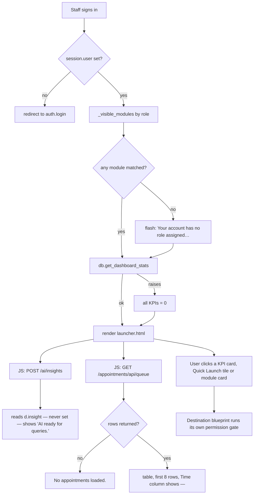

**Source:** `templates/launcher.html` (route: `blueprints/launcher/routes.py:599`).

---

# Workflow 2 — Find and open a module from the catalogue

## 2.1 Who, when, why

**Who:** anyone who does not know where a feature lives.
**When:** any time — the catalogue is the bottom half of the dashboard.
**Why:** 31 modules is too many to remember; the search box is faster than the
sidebar.

## 2.2 Preconditions

- Signed in, with a role that matches at least one module.

## 2.3 The happy path

**Step 1.** Scroll to **"🗂 All Platform Modules / جميع وحدات المنصة"**, or click
**"View all modules / عرض كل الوحدات →"** next to the Quick Launch heading.

**Step 2.** Type into the box placeholder-labelled
**"Search modules... / ابحث عن وحدة..."**. Filtering is client-side and instant
(`oninput`). It matches, case-insensitively, against **the English name, the
Arabic name, and the category label** — nothing else. Typing `فوات` finds
"Billing & Invoicing"; typing `invoice` also finds it; typing `SOAP` (which
appears only in the description text) finds **nothing**.

**Step 3.** Read the card. Ten category headers appear in fixed order, each with a
count badge:

| Category | Arabic | Icon |
|---|---|---|
| Clinical | السريرية | 🩺 |
| Operations | العمليات | ⚙️ |
| Inventory & Supply | المخزون | 📦 |
| Commercial & Retail | التجاري والبيع بالتجزئة | 🏪 |
| Finance | المالية | 💰 |
| Communication | التواصل | 💬 |
| Workspaces | مساحات العمل | 🖥️ |
| Intelligence & AI | الذكاء الاصطناعي | 🤖 |
| Admin & HR | الإدارة | 👥 |
| System | النظام | 🔧 |

Each card shows: icon, bilingual name, a status dot, the one-line description
(**English only** — `mod.description` is not passed through `t()`), and a footer
badge plus an **"Open / فتح →"** link.

| Status | Footer badge | Link text | Clickable? |
|---|---|---|---|
| `active` | Live / نشط (green), pulsing dot | Open / فتح → | yes |
| `beta` | Beta / تجريبي (gold), `β` mark | Preview / معاينة → | yes |
| `coming_soon` | Soon / قريباً | Coming Soon / قريباً | **no** |
| `planned` | Planned / مخطط, ⏳ | Planned / مخطط | **no** |

**Step 4.** Click anywhere on a Live or Beta card — the whole card is clickable
(`window.open(href, '_self')`) and so is the "Open" link.

**Cards go straight to the module URL.** They do **not** pass through
`/module/<id>`, so the audit row that route writes is never written for a normal
click. See B-6 and Appendix A-1.

## 2.4 Alternative scenarios

**Beta module.** Exactly one today: **Clinical Decision Support / دعم القرار
السريري** (`/cds/`, badge `Beta`). It opens like any live card.

**Planned module.** Exactly one today: **Multi-Branch Control Center / مركز التحكم
متعدد الفروع** (badge `Future`, status `planned`). It has **no `url` key**, so the
template would route it to `/module/multi_branch/stub` — but because its status is
`planned`, the template sets `mod_url = '#'` and drops the click handler
altogether. **It is not clickable, and therefore nothing on the dashboard ever
reaches the stub page.**

**Empty search.** Clearing the box restores every card and every category header.

**A search with no match.** Every card and every category header is hidden. There
is **no "no results" message** — the section simply goes blank below the search box.

**Arabic session.** Category labels and module names render in Arabic; the search
still matches both languages.

## 2.5 Errors and edge cases

| Situation | What happens |
|---|---|
| Click a `coming_soon`/`planned` card | Nothing. The card carries `al-module-card--disabled`, no `data-href`, no `onclick`. |
| You have the card but not the grant | The card opens the URL; the destination blueprint flashes **"You don't have permission to access this page."** and returns you to `/`. |
| Search text matches a category but no card in it | The category header stays visible (the filter keeps a header whose `data-cat` contains the query) while its grid shows nothing. |

## 2.6 What is written

**Nothing.** Card clicks are plain navigation.

## 2.7 Flowchart

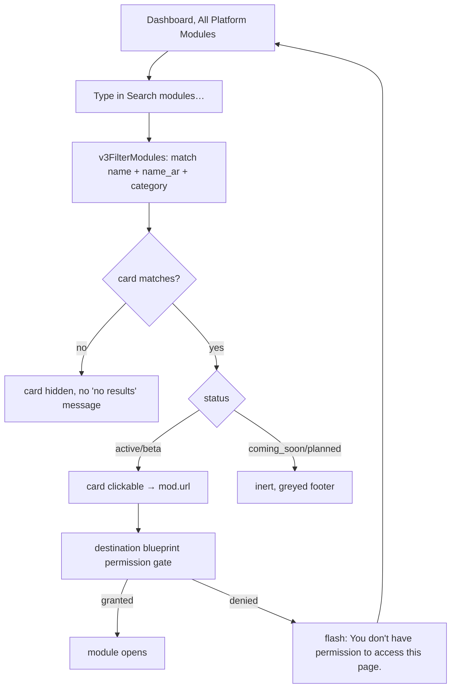

**Source:** `templates/launcher.html:583-675` (catalogue) and `:774-796`
(`v3FilterModules`); `blueprints/launcher/routes.py:21` (`MODULES`), `:558`
(`CATEGORY_META`), `:574` (`_visible_modules`), `:582` (`_grouped`).

---

# Workflow 3 — Executive report review

## 3.1 Who, when, why

**Who:** Ahmed (clinic_owner), a branch manager, finance, an auditor, and — via
the sidebar or URL — a doctor or inventory manager.
**When:** end of day, end of week, month-end.
**Why:** headline numbers, then drill into whichever dimension moved.

## 3.2 Preconditions

- Signed in with the **`reports`** grant (0.2).
- Nothing else. Every report renders on an empty database with its own empty state.

## 3.3 The happy path

**Step 1 — Enter.** Sidebar **"Reports / التقارير"**, the Quick Launch **Reports**
tile, or the dashboard module card. All three land on `/reports/` or
`/reports/dashboard`; `/reports/` is a bare `redirect(url_for("reports.dashboard"))`
with no template of its own.

**Step 2 — The executive dashboard.** Title
**"Reports & Analytics / التقارير والتحليلات"**, subtitle
**"Platform-wide KPIs and performance overview / مؤشرات الأداء الرئيسية ونظرة عامة على المنصة"**.

Topbar: **🩺 Clinical / السريري**, **💰 Financial / المالي**,
**📦 Inventory / المخزون**, **👨‍⚕️ Doctor Revenue / إيرادات الأطباء**.

Below the topbar, an export row: **"Export data: / تصدير البيانات:"** and four
buttons — **📥 Owners CSV / ملاك CSV**, **📥 Pets CSV / حيوانات CSV**,
**📥 Visits CSV / زيارات CSV**, **📥 Invoices CSV / فواتير CSV** (Workflow 7).

**Step 3 — Read the 12 KPI tiles.**

| Tile | Arabic | Field |
|---|---|---|
| Total Owners | إجمالي الملاك | `owners_total` |
| Total Pets | إجمالي الحيوانات | `pets_total` |
| Visits Today | زيارات اليوم | `visits_today` |
| Appointments Today | مواعيد اليوم | `appts_today` |
| Revenue Today (EGP) | إيرادات اليوم (جنيه) | `revenue_today` |
| Revenue This Month | إيرادات هذا الشهر | `revenue_month` |
| Unpaid Invoices | فواتير غير مدفوعة | `invoices_unpaid` |
| Outstanding (EGP) | المستحق (جنيه) | `outstanding` |
| Low Stock Items | أصناف منخفضة المخزون | `low_stock_count` |
| Expiring in 30 Days | تنتهي صلاحيتها خلال 30 يومًا | `expiry_soon` |
| Pending Reminders | تذكيرات معلقة | `pending_reminders` |
| VIP Owners | ملاك VIP | `vip_owners` |

Note the executive dashboard **does** show Low Stock Items correctly — it reads
`low_stock_count` straight from `get_dashboard_stats()`. It is only the *main*
dashboard card that is broken (B-2).

**Step 4 — Revenue chart.** **"📊 Revenue — Last 30 Days / الإيرادات — آخر 30 يوم"**,
an inline SVG bar chart. Bars are one per day *that has revenue* — a day with no
paid invoice produces no row and therefore no bar, so the x-axis is not evenly
spaced in calendar terms. Values under 10,000 print in full (`4,850`); at or above
they print as `12k`. Every fifth bar gets an `MM-DD` label. Under the chart:
**"Total / الإجمالي: 128,400 EGP"**.
Empty state: **"No revenue data for last 30 days / لا توجد بيانات إيرادات لآخر 30 يوم"**.

The series is **fixed at 30 days** and is not affected by any filter — there is no
date filter on this screen.

**Step 5 — Top Services.** **"🏆 Top Services / أبرز الخدمات"**, columns
**# · Service / الخدمة · Count / العدد · Revenue / الإيرادات**, top 10 by revenue.
Rows come from `invoice_lines` grouped by `description` where `line_type='service'`
— so the "service" name is the **free-text description written on the invoice
line**, not a catalogue item. Two lines typed "Consultation" and "consultation "
are two separate rows. Empty state:
**"No service data yet / لا توجد بيانات خدمات بعد"**.

**Step 6 — Drill.** Click one of the four topbar buttons. Each destination has a
**"← Dashboard / ← لوحة التحكم"** button back (Doctor Revenue's reads
**"← Reports / ← التقارير"**) plus one or two sideways links.

## 3.4 Alternative scenarios

**Clinical drill-down (`/reports/clinical`).** Title
**"Clinical Reports / التقارير السريرية"**, subtitle
**"Visit types, diagnoses, and doctor workload — last 30 days / أنواع الزيارات والتشخيصات وعبء عمل الأطباء — آخر 30 يوماً"**.
Three panels:

1. **"🩺 Visits by Type — Last 30 Days / 🩺 الزيارات حسب النوع — آخر 30 يوماً"** —
   horizontal bars scaled against the largest type. A visit with no `visit_type`
   is labelled `Unknown` (English only).
2. **"👨‍⚕️ Doctor Workload — Last 30 Days"** (heading is **English only**) — same
   bar style, by `doctor_name`; a visit with no doctor is labelled `Unassigned`.
3. **"🔬 Top Diagnoses — Last 30 Days / 🔬 أكثر التشخيصات — آخر 30 يوماً"** —
   table **# · Diagnosis / التشخيص · Cases / الحالات · Frequency Bar / شريط التكرار**,
   top 10.

**This page is hardcoded to the last 30 days and has no date filter of any kind.**
Empty states: **"No visit data for last 30 days / لا توجد بيانات زيارات لآخر 30 يوماً"**,
**"No doctor workload data for last 30 days"** (English only),
**"No diagnosis data for last 30 days / لا توجد بيانات تشخيص لآخر 30 يوماً"**.

Topbar: **← Dashboard / ← لوحة التحكم** and **💰 Financial / 💰 مالي**.

**Financial** → Workflow 4. **Inventory** → Workflow 5.
**Doctor Revenue** → Workflow 6.

## 3.5 Errors and edge cases

| Situation | What happens |
|---|---|
| No `reports` grant | **"You don't have permission to access this page."**, back to `/`. |
| Empty clinic | Every tile shows `0`; both charts show their empty state. Nothing errors. |
| A diagnosis row with `created_at` stored as a timestamp | The clinical query compares `created_at >= '2026-07-20'` as a plain column comparison. A timestamp string sorts correctly against a date string, so this works; a genuinely `NULL` `created_at` is excluded. |
| `revenue_by_day` has one day at 12,000 and the rest near zero | The chart scales to the max, so 29 bars render at the 2 px minimum height. There is no log scale. |

## 3.6 What is written

**Nothing.** All five report screens are read-only `SELECT`s. `role_required` is
imported at `blueprints/reports/routes.py:9` and **never used** — no report route
carries a role decorator; access rests entirely on the blueprint-level `reports`
grant.

## 3.7 Flowchart

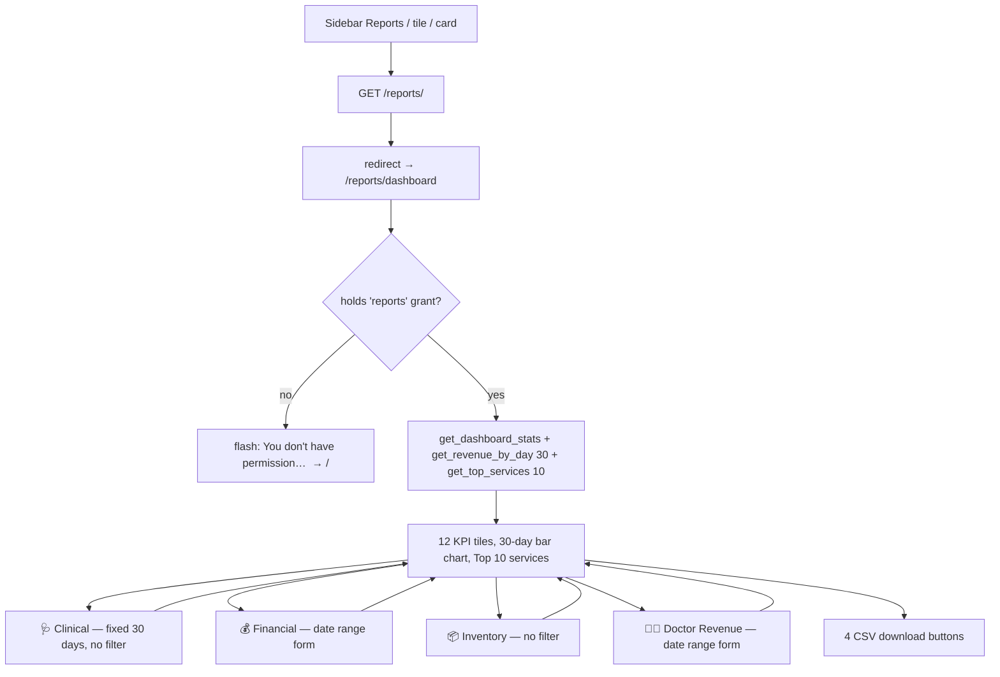

**Source:** `templates/reports/dashboard.html` (route:
`blueprints/reports/routes.py:20`); `templates/reports/clinical.html` (route:
`blueprints/reports/routes.py:35`); `models/database.py:3995`, `:4016`, `:4048`.

---

# Workflow 4 — Financial period review with comparison

## 4.1 Who, when, why

**Who:** Ahmed (clinic_owner) or the finance user.
**When:** end of month, or any time somebody asks "how did we do?".
**Why:** revenue, invoiced, outstanding, expenses and net for a chosen window,
optionally against the window before it.

## 4.2 Preconditions

- The `reports` grant.
- Expenses must have been entered for the Expenses figure to be non-zero; it reads
  the `expenses` table directly.

## 4.3 The happy path

**Step 1.** From the reports dashboard, click **💰 Financial / المالي**. You arrive
at `/reports/financial` with **no query string**, so the page defaults to
**the last 30 days**: `date_from = today − 30 days`, `date_to = today`.

**Step 2 — Set the window.** A single-row GET form:
**From / من** `<input type="date">` · **To / إلى** `<input type="date">` ·
**"🔍 Apply / 🔍 تطبيق"**. Press Apply; the page reloads as
`/reports/financial?date_from=2026-07-01&date_to=2026-07-31`.

**Step 3 — Read the six summary cards.** All from `db.get_finance_summary()`:

| Card | Label in code | What it actually is |
|---|---|---|
| Revenue Collected (EGP) | **English only** | `SUM(paid_amount)` on invoices whose **issue_date** falls in the window and whose status is `Paid` or `Partial`. Accrual. |
| Total Invoiced (EGP) / إجمالي المفوتر (جنيه) | bilingual | `SUM(total)` on non-cancelled invoices issued in the window. |
| Outstanding (EGP) | **English only** | `SUM(due_amount)` over **all** `Unpaid`+`Partial` invoices — **the date window is ignored for this figure**. |
| Expenses (EGP) | **English only** | `SUM(amount)` from `expenses` where `expense_date` is in the window. |
| Net Revenue (EGP) | **English only** | Revenue − Expenses. Green when ≥ 0, red when negative. |
| Invoices Issued | **English only** | `COUNT(*)` of non-cancelled invoices issued in the window. |

`get_finance_summary()` also returns a **`collected`** key — true till cash from the
`payments` ledger — but **this template never renders it**. Everything you see on
this screen is accrual.

**Step 4 — The chart.** **"📊 Revenue by Day — Last 30 Days"** (English only).
Note the mismatch: it always calls `get_revenue_by_day(30)`, so **it shows the last
30 days regardless of the dates you entered**. Setting the window to March 2026
gives you March figures in the cards and the last 30 days in the chart.
Empty state: **"No revenue data in selected range"**.

**Step 5 — Payment Methods.** **"💳 Payment Methods"** (English only). It is a
single fabricated row: label **"All Payments"**, count = number of `Paid`/`Partial`
invoices in the window, total = their `SUM(paid_amount)`, percentage hardcoded to
**100%**. The source comment says why: *"payment_method column not present"*. It
is a breakdown of one, not a breakdown.

**Step 6 — Compare.** Click **"📊 Compare Periods / 📊 مقارنة الفترات"**. It carries
your current `date_from`/`date_to` to `/reports/financial/compare`.

The compare view renders the **same template** with `compare_mode=True` and:

- A blue strip: **"📊 Comparison Mode / 📊 وضع المقارنة"**, then
  **"Current: / الحالي:"** `2026-07-01 → 2026-07-31` `vs Previous:`
  `2026-05-31 → 2026-06-30`, and a **"✕ Exit compare"** link (English only) back
  to the plain view with the same dates.
- Two delta badges — on **Revenue Collected** and on **Invoices Issued** only —
  reading e.g. `▲ 18.4% vs prev period` (green) or `▼ 7.2% vs prev period` (red).

The previous period is computed as: `delta = (date_to − date_from).days`,
`prev_to = date_from − 1 day`, `prev_from = date_from − (delta+1) days`. For a
31-day July window (`delta = 30`), the previous window is 31 days ending 30 June.

Note `/reports/financial/compare` has a **different default window** from the plain
view: `today − 29 days` rather than `today − 30 days`. Arriving at the compare URL
without dates gives you a 30-day window, not 31.

## 4.4 Alternative scenarios

**Previous period had zero.** `_pct_change()` returns `None` when the previous
value is `0`, and the badge macro renders nothing at all. A first month of trading
shows no badges — not "0%", not "new".

**A third badge that never appears.** The view also computes `paid_change` (from
`invoiced`), but no card in the template renders it. It is dead.

**Long window.** `revenue_by_day(delta + 1 if delta < 90 else 30)` — a window of 90
days or more silently falls back to 30 days of chart.

**Export.** **"📥 Export CSV / 📥 تصدير CSV"** in the topbar downloads the
**invoices** CSV — see Workflow 7. It is **not filtered by your date range**; it is
always the latest 500 invoices.

**Sideways links.** **"← Dashboard / ← لوحة التحكم"** and **"🩺 Clinical / 🩺 سريري"**.

## 4.5 Errors and edge cases

| Situation | What happens |
|---|---|
| `date_from` later than `date_to` | No validation. `BETWEEN` returns nothing; every card shows `0` and the payment row shows `0 transactions`. No warning. |
| A malformed `date_from` in the URL on `/reports/financial` | Passed straight into `BETWEEN` as a string. No crash; the comparison simply matches nothing. |
| A malformed date on `/reports/financial/compare` | **500.** `datetime.fromisoformat(date_from)` is called with no `try`. `?date_from=july` raises `ValueError` and the request fails. The plain financial view does not have this problem. |
| No expenses recorded | Expenses shows `0`, Net equals Revenue. |
| Outstanding looks wrong for the window | It is not scoped to the window — by design in the code, but it reads like a period figure next to five period figures. |

## 4.6 What is written

**Nothing.** Both routes are read-only.

## 4.7 Flowchart

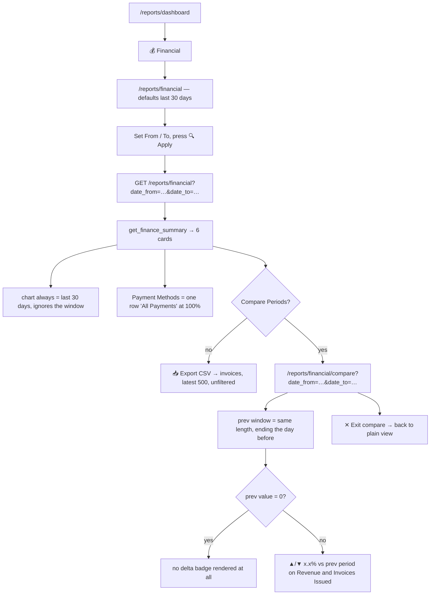

**Source:** `templates/reports/financial.html` (routes:
`blueprints/reports/routes.py:66` and `:270`); `models/database.py:3940`
(`get_finance_summary`).

---

# Workflow 5 — Stock and expiry review, then export

## 5.1 Who, when, why

**Who:** Karim (inventory_mgr) or Ahmed (clinic_owner).
**When:** weekly reorder round; before placing a supplier order.
**Why:** to see what to reorder and what is about to expire, and to walk away with
a spreadsheet.

## 5.2 Preconditions

- The `reports` grant. (Note `inventory_mgr` holds `reports` by default, so this
  screen is reachable for them — even though the **Reports card** is not shown to
  them on the dashboard.)
- For the Excel export: **`openpyxl` must be installed on the server.**

## 5.3 The happy path

**Step 1.** From the reports dashboard, click **📦 Inventory / المخزون**. Page title
**"Inventory Reports / تقارير المخزون"**.

Topbar: **← Dashboard / ← لوحة التحكم**, **💰 Financial / 💰 مالي**, and a green
**"📊 Export Excel / 📊 تصدير Excel"**.

**Step 2 — Stock Value by Category.** Heading **"📊 Stock Value by Category"**
(English only). Columns **Category / الفئة · Items / الأصناف · Value (EGP)**, sorted
by value descending, with a proportional bar. Value =
`SUM(batches.quantity × items.cost_price)` per category, counting only
`is_active = 1` items. A category with no items still appears, at 0.
Empty state: **"No inventory data available"**.

**Step 3 — Low Stock Items.** Heading **"⚠️ Low Stock Items (7)"** — the count is
live; the words are English only. Columns
**Item / الصنف · Category / الفئة · Stock / المخزون · Reorder**. The rule is
`SUM(batches.quantity) <= items.reorder_level` over active items, ascending by
stock, **capped at 50 rows**. Stock renders to one decimal with the item's unit
(e.g. `3.0 vial`). Scrolls inside a 320 px box.
Empty state: ✅ **"All items are adequately stocked"**.

An item with `reorder_level = 0` and zero stock **does appear** here (0 ≤ 0). That
is different from the executive dashboard's `low_stock_count`, which is the same
rule, and different again from `/ai/insights`, which requires `reorder_level > 0`.

**Step 4 — Expiry Alerts.** Heading
**"⏳ Expiry Alerts — Items Expiring within 90 Days (12)"** (English only).
Columns **Item / الصنف · Batch # · Qty / الكمية · Expiry Date / تاريخ الانتهاء · Urgency**.
Every batch with `quantity > 0` and `expiry_date <= today + 90 days`, ordered by
expiry date. Urgency buckets:

| Bucket | Rule |
|---|---|
| `critical` | expiry ≤ today + 30 days |
| `warning` | expiry ≤ today + 60 days |
| `notice` | everything else inside 90 days |

**Already-expired batches are included** and land in `critical` — the query has no
lower bound, so a vial that expired in January still shows here in August as long
as its quantity is above zero.

**Step 5 — Export.** Click **"📊 Export Excel / 📊 تصدير Excel"**. The browser
downloads `inventory_report_2026-08-19.xlsx` (today's date). One sheet named
**Inventory**, title row `Inventory Report — 2026-08-19`, and these nine columns
for **every active item** — not just the low ones:

`Name · SKU · Category · Unit · Stock Qty · Reorder Level · Cost Price · Stock Value (EGP) · Status`

`Status` is the literal string `LOW` or `OK`.

## 5.4 Alternative scenarios

**There is no CSV on this screen** and no PDF. Excel is the only export.

**There is no filter of any kind** — no category filter, no date filter, no
"only critical" toggle. The three tables are what they are.

**Reaching it directly.** `/reports/inventory` and `/reports/inventory/export/xlsx`
are both plain GETs; the export can be bookmarked and re-run daily.

## 5.5 Errors and edge cases

| Situation | What happens |
|---|---|
| `openpyxl` is not installed | `make_workbook()` raises `RuntimeError("openpyxl is not installed. Run: pip install openpyxl")`. The route catches **`RuntimeError` only**, flashes that exact text in red, and returns you to `/reports/inventory`. Note this is an operator instruction shown to clinic staff. |
| Any other exception inside `make_workbook` | **Not caught.** The request 500s. |
| More than 50 low-stock items | Only the 50 lowest are listed. There is no pagination and **no message saying rows were cut** — the heading count also reads `50`, so the screen cannot tell you it truncated. |
| An item with no category | `Category` renders blank (the join is a `LEFT JOIN`). |
| A batch with `quantity = 0` | Excluded from Expiry Alerts, included in the category value total (it contributes 0). |
| A `NULL` `cost_price` | Excel export writes `0.0`; the category value treats it as 0. |

## 5.6 What is written

**Nothing.** Both routes are read-only. The `.xlsx` is built in memory
(`BytesIO`) and streamed; no file is left on the server.

## 5.7 Flowchart

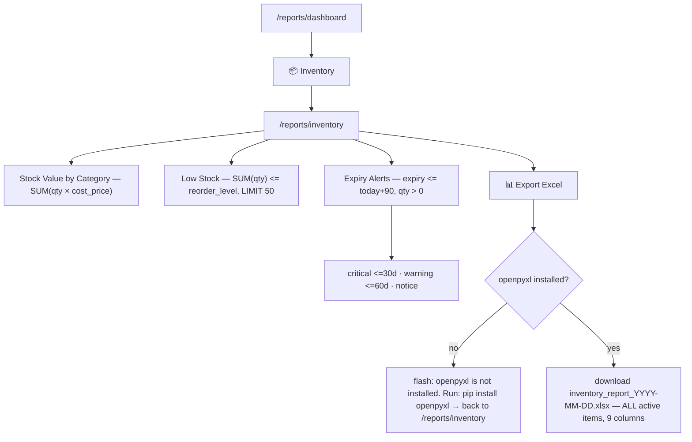

**Source:** `templates/reports/inventory_report.html` (route:
`blueprints/reports/routes.py:96`); export route `:148`;
`models/excel_export.py:50` (`make_workbook`), `:62` (the `RuntimeError`).

---

# Workflow 6 — Doctor revenue review

## 6.1 Who, when, why

**Who:** Ahmed (clinic_owner) or the finance user. **Anyone holding the `reports`
grant sees every doctor's figures** — this screen is **not** scoped to the
requesting doctor, so a doctor opening it sees his colleagues' numbers too.
**When:** month end, when settling with the doctors.
**Why:** who invoiced what, how much of it has been collected, and what services it
came from.

## 6.2 Preconditions

- The `reports` grant.
- Invoices must carry a non-empty `doctor_name`. **An invoice with no doctor name
  is excluded entirely** — it appears in no row and in no grand total on this
  screen, so these totals will not match the financial report.

## 6.3 The happy path

**Step 1.** From the reports dashboard, click **👨‍⚕️ Doctor Revenue / إيرادات الأطباء**.
Page title **"👨‍⚕️ Doctor Revenue Report"** (English only in the heading; the browser
tab title *is* bilingual: **"Doctor Revenue Report / تقرير إيرادات الأطباء"**).
Subtitle shows the active window: `2026-08-01 → 2026-08-19`.

**Default window is month-to-date**: `date_from = first day of this month`,
`date_to = today`.

**Step 2 — Adjust the window.** **From / من** and **To / إلى** date inputs, then
**"Apply / تطبيق"**.

**Step 3 — Read the five KPI tiles.**

| Tile | Arabic | Meaning |
|---|---|---|
| Active Doctors | الأطباء النشطون | number of distinct doctors with invoices in the window |
| Total Invoiced (EGP) | إجمالي المفوتر (جنيه) | `SUM(total)` on non-cancelled invoices |
| Collected (EGP) | المحصّل (جنيه) | `SUM(total)` where status is exactly `Paid` |
| Pending (EGP) | المعلق (جنيه) | `SUM(total)` where status is neither `Paid` nor `Cancelled` |
| Collection Rate | معدل التحصيل | Collected ÷ Invoiced, or `—` when Invoiced is 0 |

**Read "Collected" carefully.** It is the invoice **total** of every fully-paid
invoice — not `paid_amount`. A `Partial` invoice with 400 of 900 EGP received
contributes **0** to Collected and its **full 900** to Pending. There is no
part-payment arithmetic on this screen.

**Step 4 — Read the table.** Columns:
**Doctor / الطبيب · Invoices / الفواتير · Invoiced (EGP) / المفوتر (جنيه) ·
Collected / المحصّل · Pending / قيد الانتظار · Collection % / نسبة التحصيل % ·
Service Breakdown / توزيع الخدمات**, sorted by invoiced descending, with a
**TOTAL / الإجمالي** row at the bottom.

The Service Breakdown cell lists each `invoice_lines.line_type` with its subtotal,
e.g. `service: 6,200 · medication: 1,450 · lab: 800`. The line-type names are raw
database values and are not translated.

**Step 5 — Read the bar panel.** **"Revenue by Doctor / الإيرادات حسب الطبيب"** —
one bar per doctor with the invoiced amount and its share of the grand total as a
percentage.

## 6.4 Alternative scenarios

**Nothing to show.** If no invoice in the window carries a doctor name:
**"No invoice data found for the selected period. / لا توجد بيانات فواتير للفترة المحددة."**
and underneath **"Try a different date range. / جرّب نطاقاً زمنياً مختلفاً."**

**There is no commission.** Despite the route's docstring saying *"Revenue and
commission breakdown per doctor"*, **there is no commission percentage field, no
payout calculation and no payout button anywhere on this screen or in the view
function**. It reports; it does not settle.

**There is no export on this screen** — no CSV, no Excel, no print button. To get
these numbers into a spreadsheet you need the report builder (Workflow 8) with the
`invoices` source and the `Doctor` column.

**`month_label`.** The view passes a `month_label` such as `"August 2026"` built
from **today**, not from your chosen window. The template does not currently render
it, so it is invisible — but if it is ever surfaced it will disagree with a
back-dated range.

## 6.5 Errors and edge cases

| Situation | What happens |
|---|---|
| No `reports` grant | Bounced with **"You don't have permission to access this page."** |
| `date_from` after `date_to` | No validation. Empty result, empty state shown. |
| A malformed date in the URL | Passed to `BETWEEN` as a string; no crash, no rows. |
| Invoices with `doctor_name = ''` | Excluded (`AND i.doctor_name != ''`). |
| A doctor with invoices but no invoice **lines** | Appears in the table with correct money and an **empty** Service Breakdown cell. |
| Grand invoiced = 0 | Collection Rate renders `—`; the bar panel divides by a guarded 0 and shows `0%`. |

## 6.6 What is written

**Nothing.**

## 6.7 Flowchart

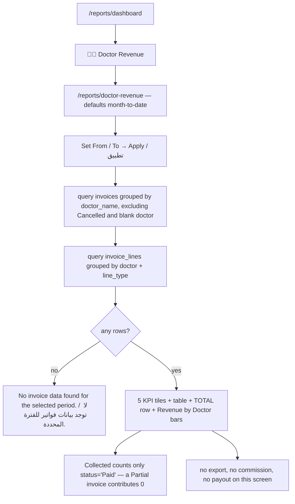

**Source:** `templates/reports/doctor_revenue.html` (route:
`blueprints/reports/routes.py:201`).

---

# Workflow 7 — Bulk data extract (the four CSV buttons)

## 7.1 Who, when, why

**Who:** Ahmed or finance.
**When:** handing data to the accountant, or making a backup snapshot for Excel.
**Why:** one click, one file, no configuration.

## 7.2 Preconditions

- The `reports` grant.

## 7.3 The happy path

**Step 1.** Go to `/reports/dashboard` (or `/reports/financial` for invoices only).

**Step 2.** Click one of:

| Button | Arabic | URL | Contents | Row cap |
|---|---|---|---|---|
| 📥 Owners CSV | ملاك CSV | `?type=owners` | ID, Full Name, Phone, WhatsApp, Email, Address, VIP, Created At — ordered by name | **all rows** |
| 📥 Pets CSV | حيوانات CSV | `?type=pets` | ID, Pet Name, Species, Breed, Sex, Owner — ordered by pet name | **all rows** |
| 📥 Visits CSV | زيارات CSV | `?type=visits` | ID, Date, Type, Pet, Owner, Doctor, Status — newest first | **500** |
| 📥 Invoices CSV | فواتير CSV | `?type=invoices` | Invoice #, Date, Owner, Total, Paid, Due, Status — newest first | **500** |

**Step 3.** The file downloads immediately as `owners_2026-08-19.csv` (etc.) — the
type plus today's date. There is no confirmation dialog, no progress bar and no
page navigation.

## 7.4 Alternative scenarios

**From the financial report.** The topbar **"📥 Export CSV / 📥 تصدير CSV"** button is
hardwired to `type=invoices`. It ignores the date range you set on that page.

**Pets and visits require an owner.** Both use an inner `JOIN owners`, so a pet or
visit whose owner row is missing is silently omitted.

**Encoding.** The response is written with Python's `csv` module into a plain
`text/csv` response with **no BOM**. Arabic names (`سلمى إبراهيم`) will look like
mojibake if the file is double-clicked into Excel on a Windows machine set to a
non-UTF-8 codepage. Open via Excel's *Data → From Text/CSV* and choose UTF-8, or
open in Google Sheets.

## 7.5 Errors and edge cases

| Situation | What happens |
|---|---|
| Any other `?type=` value (typo, or `type=payments`) | You get a **valid, empty CSV file** — no header row, no data rows, zero bytes of content — named after your typo, e.g. `payments_2026-08-19.csv`. No error, no flash. |
| No `?type=` at all | Defaults to `owners`. |
| More than 500 visits/invoices | You get the newest 500 with **no indication** that anything was cut. |
| Very large owner table | The whole CSV is built in memory before it is sent. |

## 7.6 What is written

**Nothing.** No audit row is written for an export.

## 7.7 Flowchart

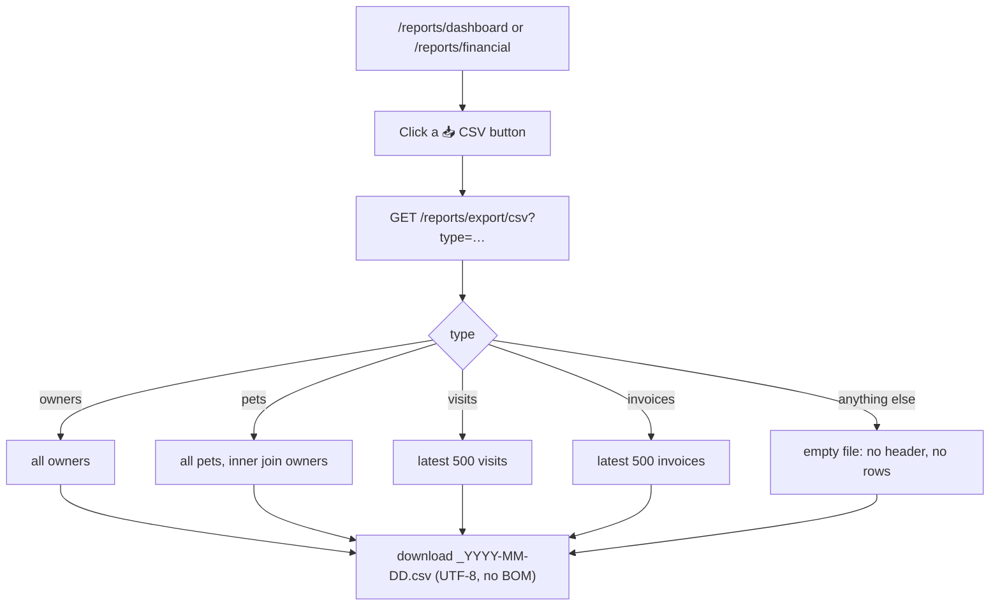

**Source:** `blueprints/reports/routes.py:332`; buttons at
`templates/reports/dashboard.html:50-53` and `templates/reports/financial.html:10`.

---

# Workflow 8 — Build a custom report

## 8.1 Who, when, why

**Who:** Ahmed, finance, or anyone with the `reports` grant who needs a slice the
five fixed reports do not give.
**When:** ad hoc — "give me every unpaid invoice from July with the owner's phone".
**Why:** pick a table, pick columns, pick a window, get rows or a file.

## 8.2 Preconditions

- The `reports` grant.
- **You must type the URL.** `/reports/builder` is an **orphan screen**: no link to
  it exists in `base.html`, in any reports template, or anywhere else under
  `templates/`. The only inbound link in the whole codebase is the
  **"← Builder / ← المُنشئ"** back-link on its own results page.
- First visit creates the `saved_reports` table automatically (once per database).

## 8.3 The happy path

**Step 1.** Navigate to `https://<your-clinic>/reports/builder`. Title
**"Custom Report Builder / مُنشئ التقارير المخصصة"**, subtitle
**"Build any report — choose source, columns, filters, and export format / ابنِ أي تقرير — اختر المصدر والأعمدة والتصفية وصيغة التصدير"**.

**Step 2 — Panel 1: Data Source / مصدر البيانات.** Eight radio cards. The first
(**Invoices**) is pre-selected on load.

| Card | Underlying table(s) | Date column | Status filter |
|---|---|---|---|
| 🧾 Invoices | `invoices` + `owners` + `pets` | `i.issue_date` | Unpaid, Paid, Partial, Cancelled |
| 📅 Appointments | `appointments` + `owners` + `pets` | `a.appt_date` | Scheduled, Confirmed, Completed, Cancelled, No Show |
| 🏥 Medical Visits | `visits` + `owners` + `pets` | `v.visit_date` | Open, Completed, Cancelled |
| 💳 Payments Received | `payments` + `owners` + `invoices` | `py.received_at` | none |
| 👤 Owners / Clients | `owners` | `o.created_at` | none |
| 🐾 Patients (Pets) | `pets` + `owners` | `p.created_at` | none |
| 💸 Expenses | `expenses` | `expense_date` | none |
| 📦 Inventory | `items` + category + supplier | `i.created_at` | none |

**Step 3 — Panel 2: Columns / الأعمدة.** Selecting a source repaints this panel
client-side from that source's column dictionary. **The first six columns are
pre-ticked.** Buttons **"All / الكل"** and **"None / لا شيء"** toggle the lot.

Available columns per source (label shown → column selected):

- **Invoices:** Invoice ID, Invoice #, Owner Name, Owner Phone, Pet Name, Species,
  Issue Date, Status, Subtotal, Discount, Total (EGP), Paid, Due, Doctor.
- **Appointments:** ID, Date, Time, Owner Name, Phone, Pet Name, Species, Type,
  Doctor, Status, Notes.
- **Medical Visits:** Visit ID, Visit Date, Owner, Phone, Pet, Species, Visit Type,
  Doctor, Status, Chief Complaint, Weight (kg), Temp (°C).
- **Payments Received:** Payment ID, Date, Owner, Phone, Invoice #, Amount (EGP),
  Method, Reference, Received By.
- **Owners / Clients:** ID, Full Name, Phone, Email, Address, Preferred Contact,
  Joined Date, Loyalty Points.
- **Patients (Pets):** Pet ID, Pet Name, Species, Breed, Sex, Date of Birth,
  Weight (kg), Owner, Owner Phone, Registered.
- **Expenses:** ID, Date, Category, Description, Amount (EGP), Vendor,
  Receipt Ref, Created By.
- **Inventory:** ID, Product Name, Category, SKU, Unit, Reorder Level, Cost Price,
  Sell Price, Supplier.

All column labels are **English only**.

**Step 4 — Panel 3: Filters / عوامل التصفية.**

- **Date From / من تاريخ** and **Date To / إلى تاريخ** — both optional. Each is
  applied only if the source has a date column (all eight do).
- **Status Filter / تصفية الحالة** — a `<select>` that is **hidden entirely** unless
  the chosen source has a status column, i.e. only for Invoices, Appointments and
  Medical Visits. Default option **"— All Statuses — / — جميع الحالات —"**.
- **Row Limit / حد الصفوف** — 100 / 250 / **500 (default)** / 1000 /
  **2000 rows (max) / 2000 صف (الأقصى)**. Whatever is submitted is hard-capped at
  2000 server-side.
- **Output Format / صيغة الإخراج** — **View in Browser / عرض في المتصفح** (default),
  **Download CSV / تحميل CSV**, **Download Excel (.xlsx) / تحميل Excel (.xlsx)**.

**Step 5 — Panel 4: Run Report / تشغيل التقرير.** Press
**"▶ Run Report / ▶ تشغيل التقرير"**. Beside it, the note
**"Results open in a new page / تُفتح النتائج في صفحة جديدة"** — the form posts
normally, replacing the current page; it does not open a browser tab.

**Step 6 — The results page.** Title `<Source> Report`, subtitle
`137 rows returned · 2026-07-01 → 2026-07-31 · Unpaid`.

- Topbar: **"← Builder / ← المُنشئ"**.
- Export bar: **"Export as: / تصدير كـ:"** then **"⬇ CSV"** and a green
  **"⬇ Excel"**. Each is its own POST form carrying the identical configuration
  back to `/reports/builder/run` with `format` changed — so the query re-runs
  against live data; you are not downloading the rows you are looking at.
- Right of the bar: `**137** rows`, or — when the returned count equals or exceeds
  your limit — an amber warning:
  **"⚠ Showing limit of 500 rows — increase limit or filter further"**.
- The table itself, one column per label.
- Bottom right: **"🖨 Print / 🖨 طباعة"**, which calls `window.print()` and uses a
  print stylesheet that hides the sidebar, topbar and every button.

## 8.4 Alternative scenarios

**CSV or Excel chosen up front.** Instead of a results page you get an immediate
download: `report_invoices_2026-08-19.csv` or `.xlsx`. There is no on-screen
confirmation — the page simply does not change.

**Inventory source.** Deliberately **cannot show stock on hand**. The builder emits
a flat `SELECT <cols> FROM <table>` with no room for `SUM(batches.quantity)`; the
source comment says so explicitly and points you at `/reports/inventory` instead.
Reorder Level and Cost Price are available; current quantity is not.

**Payments source.** This is the one place in the reporting area you can see a real
**Method** column (cash, card, …) — the financial report cannot (Workflow 4,
step 5). If someone asks for a payment-method breakdown, build it here.

**Which columns are safe.** Submitted columns are checked against that source's
dictionary before being pasted into the `SELECT`; anything not in the whitelist is
silently dropped. A tampered form cannot inject SQL through the column list.

## 8.5 Errors and edge cases

Quoted exactly from the source:

| Situation | Message and where you land |
|---|---|
| No source, or zero columns ticked | Amber flash **"Please select a data source and at least one column."** → back to `/reports/builder`. |
| Columns submitted but none survive the whitelist | Amber flash **"No valid columns selected."** → back to `/reports/builder`. |
| The SQL fails for any reason | Red flash **"Query error: <the raw database error>"** → back to `/reports/builder`. The raw driver message is shown to the user. |
| `format=xlsx` and `openpyxl` is missing (or any export failure) | Red flash **"Excel export error: <error>"** — and then the code **falls through and renders the HTML results page anyway**, so you see the table with an error banner above it rather than a download. |
| Zero rows match | Results page renders with the table header and one centred row: **"No data found for the selected filters. / لا توجد بيانات للتصفية المحددة."** |
| You ask for 5000 rows via a hand-edited form | Capped to 2000 (`min(int(limit), 2000)`). |
| `limit` submitted as text (e.g. `abc`) | `int("abc")` raises → **500**. Not reachable from the dropdown. |
| Two selected columns share a short name | The results template and the CSV writer both key each value on the text after the last dot. The `inventory` source works around this by aliasing `category_name` and `supplier_name`; the other sources have no clash. |

**On dialect:** the date filters emit PostgreSQL syntax —
`SUBSTRING(col::text,1,10) >= ?`. This is **not** a PostgreSQL-only failure, as it
might appear: `models/database.py` translates `::text` into
`CAST(… AS TEXT)` for the SQLite path (verified — `_fix_sql_sqlite()` rewrites the
query), and SQLite has supported `SUBSTRING()` as an alias for `substr()` since
3.34. It works on both back ends. On a SQLite build older than 3.34 it would fail
into the "Query error: …" flash.

## 8.6 What is written

- **On first ever use of the builder**, the `saved_reports` table is created
  (`CREATE TABLE IF NOT EXISTS`), once per database.
- **Running a report writes nothing.** No row, no audit entry, no log of who
  extracted what.

## 8.7 Flowchart

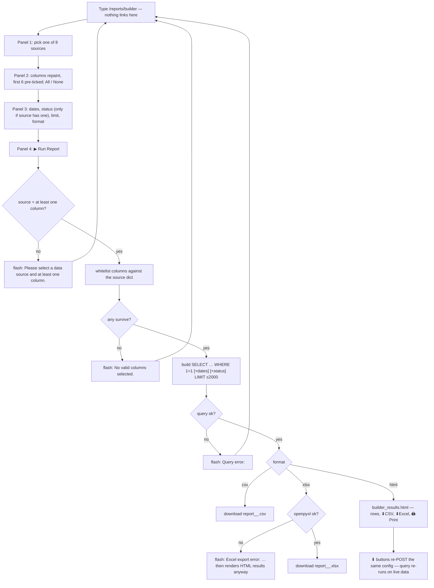

**Source:** `templates/reports/builder.html` (route:
`blueprints/reports/builder_routes.py:181`); `templates/reports/builder_results.html`
(route: `:201`); `SOURCES` at `:16`.

---

# Workflow 9 — Save and re-run a report configuration

## 9.1 Who, when, why

**Who:** whoever built a report they will want again next month.
**When:** right after configuring the builder.
**Why:** so "unpaid July invoices with owner phone" is one click next time.

## 9.2 Preconditions

- The `reports` grant.
- A configured builder screen (Workflow 8, steps 2–4). You do **not** have to run it
  first — you can save an untested configuration.

## 9.3 The happy path

**Step 1.** On `/reports/builder`, right-hand column, panel
**"💾 Save Report Config / 💾 حفظ إعداد التقرير"**. Type a name into the box
placeholder-labelled **"Report name (e.g. Monthly Invoices) / اسم التقرير (مثال: فواتير شهرية)"**
— for example `Unpaid invoices — Maadi clients`.

**Step 2.** Press **"Save / حفظ"**. JavaScript copies the currently ticked columns,
the source, both dates, the status filter and the row limit into a hidden form and
submits it to `POST /reports/builder/save`.

**Step 3.** You return to `/reports/builder` with a green flash:
**`Report "Unpaid invoices — Maadi clients" saved.`**

**Step 4 — The Saved Reports list.** Panel **"📁 Saved Reports / 📁 التقارير المحفوظة"**
now appears (it is hidden entirely when the list is empty). Newest first, **latest
50**. Each row shows the name, a blue badge with the source key (`invoices`), the
first 16 characters of the creation timestamp, and `by <username>`.

**Step 5 — Re-run.** Press **"▶ Run / ▶ تشغيل"**. The route reads `config_json`,
rebuilds the form with **`format` forced to `html`**, and calls the run function
directly — you land on the results page.

**Step 6 — Delete.** Press **🗑**. The browser asks
**"Delete saved report?"** (English only, a plain `confirm()`). Confirm and you
return to `/reports/builder` with a green flash **"Saved report deleted."**

## 9.4 Alternative scenarios

**Saved reports have no owner.** `builder_saved` and `builder_delete` look the row
up **by id only**. Anyone with the `reports` grant can run — or permanently delete —
a report another user saved. The `created_by` name is shown but is never checked.

**A saved report always renders HTML.** The saved `format` is discarded; if you
saved with `csv` selected, running it from the list still gives you the results
page. Use its **⬇ CSV** button from there.

**Saving does not run.** Nothing is executed at save time, so an invalid
configuration saves happily and only fails when someone runs it.

**Date ranges are stored literally**, not as "last month". A report saved with
`2026-07-01 → 2026-07-31` will return the same July rows forever. To re-scope you
have to rebuild it.

## 9.5 Errors and edge cases

| Situation | Message |
|---|---|
| Empty name | JavaScript stops first: browser alert **"Please enter a report name."** (English only). Nothing is submitted. |
| Name or source missing at the server (hand-crafted POST) | Amber flash **"Name and source are required."** → back to the builder. |
| Running a deleted or non-existent id | Red flash **"Saved report not found."** → back to the builder. |
| A saved report whose source key was later renamed in `SOURCES` | Falls through to the run path's own guard: **"Please select a data source and at least one column."** |
| A saved report whose columns are no longer valid | **"No valid columns selected."** |
| More than 50 saved reports | Only the newest 50 are listed. The older ones still exist in the table but are unreachable from this screen. |

## 9.6 What is written

**`saved_reports`** — one row per save:

| Column | Value |
|---|---|
| `id` | autoincrement |
| `name` | what you typed |
| `source` | the source key, e.g. `invoices` |
| `config_json` | JSON: `cols` (list), `date_from`, `date_to`, `status_filter`, `limit` |
| `created_by` | `session["user"]["username"]` |
| `created_at` | `datetime('now')` default |

Deleting removes the row permanently — **there is no soft delete and no undo**.

**Which other screens change:** only the Saved Reports panel on
`/reports/builder`. Nothing else in the platform reads this table.

## 9.7 Flowchart

```mermaid
flowchart TD
    A["/reports/builder configured"] --> B[Type a name in 💾 Save Report Config]
    B --> C{name empty?}
    C -- yes --> D["browser alert: Please enter a report name."]
    C -- no --> E["POST /reports/builder/save"]
    E --> F{name and source present?}
    F -- no --> G["flash: Name and source are required."]
    F -- yes --> H["INSERT into saved_reports (name, source, config_json, created_by)"]
    H --> I["flash: Report \"…\" saved. → /reports/builder"]
    I --> J["📁 Saved Reports — newest 50"]
    J --> K["▶ Run → GET /reports/builder/saved/<id>"]
    K --> L{row exists?}
    L -- no --> M["flash: Saved report not found."]
    L -- yes --> N["rebuild form, force format=html, call builder_run()"]
    N --> O[results page]
    J --> P["🗑 → confirm 'Delete saved report?'"]
    P --> Q["POST …/delete → DELETE by id, no ownership check"]
    Q --> R["flash: Saved report deleted."]
```

**Source:** `blueprints/reports/builder_routes.py:304` (save), `:335` (run saved),
`:360` (delete); UI at `templates/reports/builder.html:185-219`.

---

# Workflow 10 — Describe a report in plain language

## 10.1 Who, when, why

**Who:** anyone on the builder screen who would rather type than click.
**When:** as a shortcut before configuring panels 1–3 by hand.
**Why:** "unpaid invoices from last month" is faster to type than it is to click.

## 10.2 Preconditions

- The `reports` grant **and** the **`ai` grant** — the box posts to `/ai/nl-report`,
  which lives in the AI blueprint. By default that means **only clinic_owner,
  doctor and super_admin can use this box**, while the rest of the builder works
  fine for finance, auditor, branch_manager and inventory_mgr.
- An AI provider must be configured (`AI_API_KEY`, or a reachable local proxy).

## 10.3 The happy path

**Step 1.** At the top of `/reports/builder`, in the dark purple panel
**"✨ AI Report Builder / مُنشئ التقارير بالذكاء الاصطناعي"**, subtitled
**"Describe what you want in plain English / صف ما تريده بلغة بسيطة"**.

The placeholder gives three examples:
**"e.g. unpaid invoices from last month · dogs treated for vomiting this week · inventory below reorder level"** /
**"مثال: فواتير غير مدفوعة من الشهر الماضي · كلاب عولجت من القيء هذا الأسبوع · مخزون أقل من حد إعادة الطلب"**.

**Step 2.** Type, then press **Enter** or the button
**"🤖 Build Report / 🤖 بناء التقرير"**. The button text changes to `...` while it
works.

**Step 3.** The request goes to `POST /ai/nl-report`. The model is asked to return
exactly `{"source", "date_from", "date_to", "status", "suggestion"}` and to compute
real dates from today for phrases like "last month".

**Step 4.** On success:
- the matching **source radio** is ticked and the Columns panel repaints,
- **Date From** and **Date To** are filled,
- the **Status Filter** select is set,
- a green strip appears reading `✅ <the model's suggestion>`, or
  `✅ Report configured. Review and click Run.` when it returned no suggestion text.

**Step 5.** **You still have to finish the job.** Columns are *not* chosen by the
AI — the first six of the newly-selected source are ticked by the repaint — and
**nothing runs automatically**. Review, then press **▶ Run Report**.

## 10.4 Alternative scenarios

**The model returns an unknown source key.** `document.querySelector` finds no
matching radio, so the source is left alone; dates and status may still be applied
to the *previously* selected source. Read the green strip before you run.

**The model returns prose instead of JSON.** The server searches the reply for the
first `{…}` block. If there is none, it returns
`{"suggestion": "<first 200 characters of the reply>"}` — you get a green strip
with the model's chatter in it and **no** fields changed.

**Arabic query.** The prompt does not restrict the input language and the model is
instructed elsewhere to answer in the user's language; the `suggestion` will come
back in whatever the model chooses. The source key, dates and status are structural
and language-independent.

## 10.5 Errors and edge cases

| Situation | What happens |
|---|---|
| Empty box | The JS returns immediately. Nothing is sent. |
| No query reaches the server | `400 {"error": "No query"}` — the browser's `fetch` still resolves, so the green strip shows `✅ undefined`-style output rather than the red one. |
| `fetch` rejects (network, CORS, server down) | Red strip: **"⚠️ AI unavailable. Please configure manually."** |
| No `ai` grant (nurse, finance, reception…) | The gate returns a **302 redirect** to the launcher for a normal request. The `fetch` follows it, gets HTML, and `r.json()` throws → the **red** "AI unavailable" strip. Functionally correct message, misleading cause. |
| AI not configured at all | `call_ai()` returns its bilingual "not enabled" sentence as plain text; no `{…}` is found; you get a green strip containing that sentence and no fields filled. |
| Model invents a date like `2026-13-01` | It is written straight into the `<input type="date">`, which rejects it and stays blank. |

## 10.6 What is written

**Nothing.** `/ai/nl-report` does **not** persist to `ai_conversations` — unlike
`/ai/chat`, only the chat endpoint saves.

## 10.7 Flowchart

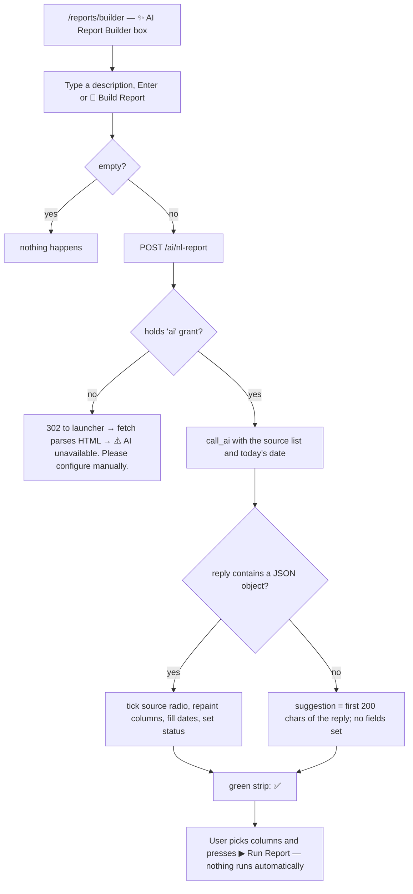

**Source:** `templates/reports/builder.html:24-89`; route
`blueprints/ai_assistant/routes.py:687` (`nl_report`).

---

# Workflow 11 — Ask the AI Assistant

## 11.1 Who, when, why

**Who:** by default **only clinic_owner, doctor and super_admin** (0.2/0.3).
**When:** between patients — a dosage check, a differential, a protocol reminder.
**Why:** a persistent, per-user thread that remembers the conversation.

## 11.2 Preconditions

- The **`ai`** grant.
- For the chat panel to render at all, `ai_configured()` must be true. That means
  the `openai` Python package is importable **and** either `AI_API_KEY` is set, or
  `AI_BASE_URL` points at localhost/127.0.0.1 **and something is actually listening
  on that port** (probed by TCP connect, cached for 60 seconds).

## 11.3 The happy path

**Step 1.** Open the AI Assistant from the sidebar **"AI Assistant / المساعد الذكي"**,
the Quick Launch tile, or the dashboard card. Title
**"AI Assistant / المساعد الذكي"**, subtitle (English only)
**"Powered by freellmapi — multi-model router (Gemini · GPT · Claude)"**.

Topbar: **"📋 History / 📋 السجل"**, and — **only when AI is configured** —
**"🗑 Clear / 🗑 مسح"**.

**Step 2 — The Quick Prompts sidebar.** Heading
**"Quick Prompts / أسئلة سريعة"**. The set depends on your role. **Every prompt
button label and every prompt text is English only** — none of them passes through
`t()`.

| Your role | Buttons you get |
|---|---|
| `doctor`, `super_admin`, `clinic_owner` | 💊 Amoxicillin dosage (10 kg dog) · 🔍 Differentials: vomiting in dogs · ⚠️ Drug interaction: Metro + Phenobarb · 🔧 Pre-anesthetic protocol: cat spay · 🩺 PU/PD workup: senior dog · 🧪 Normal CBC ranges: dogs |
| `nurse` | 🌡️ Normal vitals: adult dog · 💉 SQ injection technique: cat · 😿 Pain assessment signs |
| `reception` | 📅 New appointment checklist · ℹ️ Explaining wellness exams · 🚨 Emergency triage questions |
| `inventory_mgr` | 📦 FEFO explained · 🌡️ Vaccine cold-chain storage · ♻️ Expired medication disposal |
| `pharmacist` | 💬 Patient counseling: Metronidazole · 🧪 Compounding considerations · 🔒 Controlled substance storage |
| `finance` | 🧾 Invoice compliance (Egypt) · 💳 Payment plan options |
| **anything else** (branch_manager, auditor, hr, groomer, …) | 🏥 Typical hospital services · 📅 Routine checkup frequency |

There **is** a fallback branch — no role gets an empty sidebar. But note the
practical joke in the seeding: the nurse, reception, inventory_mgr, pharmacist and
finance prompt sets can never actually be seen, because none of those roles holds
the `ai` grant by default (0.3). They only appear on a clinic whose administrator
has granted `ai` to that role on the Roles screen.

Clicking a quick prompt **fills the textarea and focuses it** — it does **not**
send. You press Enter yourself.

**Step 3 — The disclaimer.** A permanent amber strip above the thread (English
only):
**"⚠️ Disclaimer: AI suggestions are for reference only. Always verify with clinical judgment and a licensed veterinarian."**

**Step 4 — The thread.** Your last **50** exchanges, oldest first. Each user turn is
a right-aligned 👤 bubble; each reply is a left-aligned 🤖 bubble with a timestamp
and a **model badge** such as `⚡ gemini-2.5-flash` (hidden when the stored model is
`none`, i.e. a failed call). On a fresh account:
**"Start a conversation — ask a clinical question or use a quick prompt on the left."**
(English only.)

**Step 5 — Ask.** Type into the textarea, placeholder (English only)
**"Ask a clinical or operational question… (Enter to send, Shift+Enter for newline)"**.
**Enter sends. Shift+Enter makes a newline.** The box auto-grows to 130 px.
The **"Send ➤"** button does the same thing.

**Step 6 — What happens server-side.** `POST /ai/chat`:

1. Rate-limit check (see 11.5 — it does not do what its message implies).
2. Reject empty message → `400`.
3. Reject anything over **2000 characters** → `400`.
4. Rebuild context from your **last 20 stored exchanges**, chronological, as
   alternating user/assistant turns, then append the new message.
5. Prepend a system prompt: the Aleefy base prompt plus a **role-specific
   paragraph** (doctor, nurse, reception, inventory_mgr, pharmacist, finance — any
   other role gets the generic "You are assisting veterinary clinic staff"). The
   base prompt instructs: professional, always include a licensed-vet disclaimer,
   answer in the user's language, and **"BE CONCISE… Stay under 150 words unless
   detail is asked for."**
6. Call the provider: model from `AI_MODEL` (default `gemini-2.5-flash`),
   `max_tokens` from `AI_MAX_TOKENS` (default **700**), timeout from
   `AI_TIMEOUT_SECONDS` (default **45 s**), and **`max_retries=0`** — one attempt,
   never a retry.
7. Save the pair as **one row** in `ai_conversations`.
8. Return `{role, content, model, routed_via}`.

**Step 7 — The reply appears** in the thread with a live timestamp and the model
badge, and the view scrolls to the bottom.

**Step 8 — History.** Click **"📋 History / 📋 السجل"** for
`/ai/history`, title **"AI Conversation History / سجل محادثات المساعد الذكي"**,
subtitle (English only) "All past AI assistant interactions". Your last **200**
exchanges, grouped under a `📅 2026-08-19` heading per day (the first 10 characters
of `created_at`; a row with no timestamp is grouped under `Unknown`). Topbar:
**"💬 Back to Chat"** (English only). Empty state: 📭
**"No conversation history yet."** with a **"Start a conversation"** button.

**Step 9 — Clear.** **"🗑 Clear / 🗑 مسح"** asks
**"Clear all conversation history?"** (English only, browser `confirm()`).
Confirming deletes **every** `ai_conversations` row for your user id, flashes
**"Conversation history cleared."**, and returns you to `/ai/`.
**This is irreversible and there is no undo.**

## 11.4 Alternative scenarios

**AI not configured.** The whole chat panel is replaced by a block reading
**"AI Assistant Not Configured / المساعد الذكي غير مُعد"** with the text
*"The `openai` Python package is required. Run: `pip install openai`. Make sure the
freellmapi router is running at http://localhost:3001"*. **No textarea, no Send
button.** The **🗑 Clear** button also disappears (it is inside the same
``), so on an unconfigured install you cannot clear a
history you accumulated when it *was* configured — except by hand-posting to
`/ai/clear`.

**This message names the wrong cause.** `ai_configured()` also returns `False`
when the package *is* installed and only the API key is missing. See B-5.

**Asking in Arabic.** The system prompt says *"Respond in the same language as the
user's message"*, so an Arabic question gets an Arabic answer. Nothing in the code
enforces it; it is a model instruction.

**Patient context.** The chat endpoint accepts an optional `visit_id` in the JSON
body. When present, a full patient block (species, breed, age, weight, allergies,
chronic conditions, owner, complaint, vitals, last 5 diagnoses, active
prescriptions, upcoming vaccinations) is appended to the system prompt. **The
`/ai/` chat screen never sends it** — only the visit-detail panel does
(Workflow 13).

**Your history is yours.** Every read and the clear are scoped to
`session["user"]["id"]`. You cannot see another user's thread from any screen in
this area.

## 11.5 Errors and edge cases

| Situation | Exact behaviour |
|---|---|
| Empty message | `400 {"error": "Empty message"}` → the bubble shows **"⚠️ Empty message"**. |
| Over 2000 characters | `400 {"error": "Message too long. Maximum 2000 characters."}` → **"⚠️ Message too long. Maximum 2000 characters."** There is no client-side character counter, so you only find out after pressing Enter. |
| Rate limited | `429 {"error": "Too many requests. Please wait before sending another message."}` → **"⚠️ Too many requests…"** |
| **What actually trips that limiter** | `is_rate_limited(ip)` counts rows in the **`login_attempts`** table, and the only writer of that table is `record_failed_login()`. **Sending AI messages never writes a row there.** So: no amount of AI chatting will ever trip it — but **5 failed logins from your IP inside 15 minutes will lock you out of AI chat**, with a message about sending messages too fast. Verified: `models/security.py:171`, `:193`; the only other callers are the login routes. |
| Provider unreachable, or no key, and `ai_configured()` is false | The reply bubble reads **"🤖 المساعد الذكي غير مُفعَّل على هذا النظام. تواصل مع مزوّد النظام لتفعيله. / AI is not enabled on this installation."** The provider's own error is logged, never shown. **This still saves a row** in `ai_conversations` with `model_used = 'none'`. |
| Provider reachable but errors/times out | **"🤖 المساعد الذكي غير متاح مؤقتاً. حاول بعد قليل. / The AI assistant is temporarily unavailable."** Also saved with `model_used = 'none'`. |
| The `openai` package is not installed | `call_ai()` returns the literal string **"AI requires the 'openai' package. Run: pip install openai"** — but in practice the panel does not render at all in that state, so you would only see this via a hand-made POST. |
| `fetch` itself fails in the browser | **"⚠️ Network error. Please try again."** — **nothing is saved** in this case, because the server was never reached. |
| No `ai` grant | You never reach the screen: red flash **"You don't have permission to access this page."** and you land on `/`. |
| Two browser tabs open | Both read the same server-side thread. A message sent in tab A is not pushed to tab B — refresh tab B to see it. |
| A 45-second answer | The request simply takes 45 seconds; the "🤖 Thinking…" indicator stays up. There is no client-side timeout and no cancel button. |

## 11.6 What is written to the database

**`ai_conversations`** — **one row per exchange** (prompt and response together):

| Column | Value |
|---|---|
| `user_id` | your session user id |
| `role` | your role string at the time |
| `prompt` | your message, verbatim |
| `response` | the reply — **including the error text** when the call failed |
| `model_used` | `routed_via` if the proxy sent an `x-routed-via` header, else the model name, else `none` |
| `created_at` | table default |

**Which other screens change:**
- `/ai/` — the thread on your next visit (last 50).
- `/ai/history` — the grouped list (last 200).
- The **Ctrl+K palette** writes into and reads from this same thread (Workflow 12).
- **Nothing else.** No dashboard tile counts AI usage; no audit row is written.

`POST /ai/clear` deletes every row for your user id.

## 11.7 Flowchart

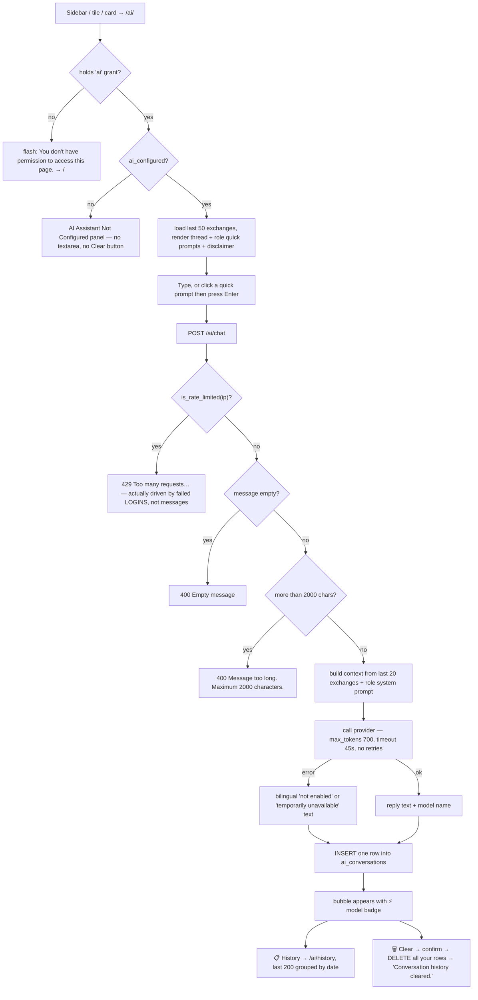

**Source:** `templates/ai_assistant/chat.html` (route:
`blueprints/ai_assistant/routes.py:367`); chat endpoint `:427`; history `:477`;
clear `:497`; `call_ai` `:156`; `ai_configured` `:90`;
`templates/ai_assistant/history.html`.

---

# Workflow 12 — Quick ask from anywhere (Ctrl+K)

## 12.1 Who, when, why

**Who:** anyone, on any page — the overlay is in `base.html`.
**When:** mid-task, without leaving the screen you are on.
**Why:** a one-shot question, or a fast jump to another module.

## 12.2 Preconditions

- Signed in (the overlay renders on any page that extends `base.html`).
- **To get an answer**, you need the **`ai`** grant — the palette posts to
  `/ai/chat`, which is gated (0.2).

## 12.3 The happy path

**Step 1.** Press **Ctrl+K** (or **Cmd+K** on a Mac) anywhere, or click the small
**`Ctrl+K`** key badge at the right-hand end of the topbar search box.

**Step 2.** A dark overlay opens with a single input, placeholder
**"Ask AI anything about your clinic… / اسأل المساعد الذكي عن عيادتك…"**, an
**ESC** chip, a **"Quick Navigate / تنقل سريع"** chip row, and a footer reading
**"Powered by Aleefy AI / مدعوم من اليفي AI"** and
**"Enter to ask · ESC to close / Enter للسؤال · ESC للإغلاق"**.

**Step 3 — Either navigate or ask.**

*Navigate:* click a chip — **🧾 Invoices / فواتير**, **📋 Estimates / عروض أسعار**,
**📅 Appointments / مواعيد**, **🐾 Patients / مرضى**, **🏥 Visits / زيارات**,
**📊 Reports / تقارير**, **🎥 Telemedicine / عن بُعد**, **🤖 AI Chat / دردشة AI**.
The palette closes and the browser navigates.

*Ask:* type and press **Enter**. The response area shows
**"Thinking… / جاري التفكير…"**, then the answer is **type-written** character by
character via `requestAnimationFrame`.

**Step 4.** Press **ESC**, or **Ctrl+K** again, or click the backdrop, to close. The
input and the response area are both cleared on close — **the answer is not kept in
the overlay**.

**Step 5.** The exchange **is** kept server-side. It lands in exactly the same
`ai_conversations` thread as the full chat screen, so it appears in `/ai/` and
`/ai/history` next time you look, and it becomes part of the context for your next
question in either place.

## 12.4 Alternative scenarios

**Ctrl+K toggles.** Pressing it while the palette is open closes it.

**There is no history in the palette** — no previous answers, no scroll-back, no
model badge, no send button. One question, one answer, then it is wiped from view.

**No `visit_id` is ever sent** from the palette, so answers here carry no patient
context.

**Petsy is a different thing.** The paw bubble (Workflow 14) is a separate assistant
with its own endpoint, its own prompt and **no persistence**. Ctrl+K writes to your
AI Assistant thread; Petsy writes nowhere.

## 12.5 Errors and edge cases

| Situation | What you see |
|---|---|
| Blank input, Enter pressed | Nothing happens (`if(q.trim())` guard). |
| `fetch` rejects | **"⚠️ AI service unavailable. / خدمة الذكاء الاصطناعي غير متاحة."** |
| No `ai` grant (nurse, reception, finance, branch manager, inventory manager…) | The gate returns a **redirect to the launcher**, not JSON. `fetch` follows it, gets an HTML page, and `r.json()` throws → **"⚠️ AI service unavailable."** The palette is present and looks functional for every role; only the answer never comes. |
| Server returned an `error` key (rate limit, too long, empty) | The palette renders `d.content \|\| d.error`, so the error text is type-written into the panel as if it were an answer. |
| Neither key present | **"No response. / لا يوجد رد."** |
| A very long answer | Type-writing one character per animation frame — a 700-token reply takes several seconds to finish drawing. There is no skip. |

## 12.6 What is written

Exactly as Workflow 11.6 — **one `ai_conversations` row per question**, including
failures (which store the bilingual error text as the response).

## 12.7 Flowchart

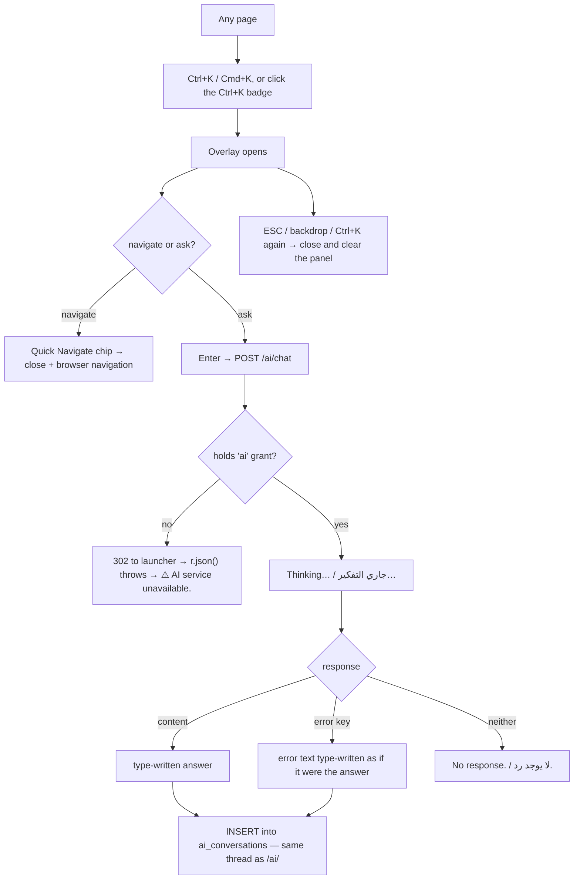

**Source:** `templates/base.html:397` (the Ctrl+K badge), `:841` (palette markup),
`:1248` (open/close), `:1271` (`v3AskAI`); endpoint
`blueprints/ai_assistant/routes.py:427`.

---

# Workflow 13 — AI actions embedded in clinical and comms screens

## 13.1 Who, when, why

**Who:** a doctor mid-consult, or reception drafting a WhatsApp message.
**When:** inside the clinical or comms screen itself, not in the AI module.
**Why:** these produce text the clinician then reviews and saves — the AI never
writes to the medical record.

## 13.2 Preconditions

- The **`ai`** grant for every one of these (they all live in the `ai_assistant`
  blueprint). By default: clinic_owner, doctor, super_admin.
- `/ai/context/visit/<id>` adds its **own** check on top: role must be one of
  super_admin, clinic_owner, branch_manager, doctor, nurse — and for a `doctor`
  with a branch set, the visit's `branch_id` must match. Otherwise
  `403 {"error": "Access denied"}` and a logged IDOR warning.

## 13.3 The eight live endpoints and where their buttons are

| Endpoint | Host screen | Button / trigger | What comes back |
|---|---|---|---|
| `POST /ai/pet-summary/<pet_id>` | `crm/pet_detail.html` | opens a modal; shows **"⏳ Generating clinical summary..."** | 2–3 paragraph referral-letter summary from the pet's last 10 visits, 10 diagnoses, 8 prescriptions and 8 vaccinations. A **"Print"** action opens the text in a new window. |
| `GET /ai/context/visit/<visit_id>` | `visits/visit_detail.html` | fires when the 🤖 panel opens | The patient context block. On success the panel shows the blue badge **"📋 Patient context loaded — AI knows <pet>'s history"**. |
| `POST /ai/analyze-photo` | `visits/visit_detail.html` | **"📸 Analyze Photo / تحليل الصورة"**, hint **"Upload wound/eye/skin photo for AI diagnosis / ارفع صورة جرح أو عين أو جلد للتشخيص بالذكاء الاصطناعي"** | Four headed sections: Visual Findings, Differential Diagnoses (top 3), Recommended Next Steps, Urgency Level (Emergency / Urgent / Routine). |
| `POST /ai/discharge-instructions/<visit_id>` | `visits/visit_detail.html` | **"📋 Discharge Instructions / تعليمات الخروج"** → modal **"AI Discharge Instructions / تعليمات الخروج بالذكاء الاصطناعي"**, spinner **"Generating bilingual discharge instructions... / جارٍ إنشاء تعليمات الخروج ثنائية اللغة..."** | Two sections in one reply: **ENGLISH VERSION** and **ARABIC VERSION (التعليمات بالعربية)**, each under 200 words, covering home care, medication schedule, warning signs and when to return. Modal buttons print it or send it by WhatsApp. |
| `POST /ai/drug-interactions` | `visits/visit_detail.html` (**"💊 Check Interactions / فحص التداخلات الدوائية"**) and `workflow/index.html` (**"Check interactions / فحص التداخلات"**) | `{safe, severity, interactions[], recommendation}` | See 13.4 — this one is deliberately pessimistic. |
| `POST /ai/suggest-diagnosis` | `workflow/index.html` | **"Suggest differentials / اقترح تشخيصات"** | Up to **4** differentials, each with `likelihood` (high/moderate/low), `why`, and `rule_out` (the single test that confirms or excludes it), plus a `red_flags` list. |
| `POST /ai/draft-message` | `whatsapp/send_center.html` | **"✨ AI Draft / ✨ مسودة بالذكاء الاصطناعي"** → modal, language select, **"🤖 Generate Message"** | A warm 2–4 sentence WhatsApp message in English or Arabic, max 2 emojis, signed `Aleefy.` A **Use** button drops it into the send box. |
| `POST /ai/nl-report` | `reports/builder.html` | Workflow 10 | Report-builder configuration. |

**Source:** `blueprints/ai_assistant/routes.py:586` (pet summary), `:384` (visit
context), `:791` (analyze photo), `:860` (discharge), `:989` (interactions),
`:1066` (suggest diagnosis), `:646` (draft message), `:687` (nl-report).
Callers: `templates/crm/pet_detail.html:518`, `templates/visits/visit_detail.html:848`,
`:1005`, `:1066`, `:1131`, `templates/workflow/index.html:1289`, `:1367`,
`templates/whatsapp/send_center.html:136`.

## 13.4 The two safety-critical branches — read these

These two endpoints **deliberately refuse to return a reassuring answer when the
check did not actually run.** This is intentional and it is the correct behaviour;
do not "fix" it.

**Drug interactions.** Four distinct outcomes:

| Input / outcome | Response |
|---|---|
| No `new_drug` given | `severity: "unchecked"`, `safe: null`, recommendation **"No drug specified — no interaction check was performed."** |
| A drug, but no current medications on file | `severity: "unchecked"`, `safe: null`, recommendation **"No other medications on file, so no interaction check applies to <drug>. This does NOT check species contraindications, breed sensitivity, or dosing — verify those yourself."** |
| Model reachable, reply parses | The model's own `{safe, severity: none\|mild\|moderate\|severe, interactions[], recommendation}`. |
| Model unreachable or reply unparseable | `safe: false`, `severity: "unchecked"`, recommendation **"The interaction check could not be completed — verify manually before prescribing. This is NOT a statement that the combination is safe."** |
| Reply parsed but omitted `severity` | Forced to `severity: "unchecked"`, `safe: false`. |

The one-screen workflow renders these as: **"Severe interaction / تداخل شديد"**
(red), **"Moderate interaction / تداخل متوسط"** (amber),
**"Mild interaction / تداخل خفيف"** (amber), **"No interaction found / لا يوجد تداخل"**
(green), and for anything else:
**"The interaction check could not run. This is NOT a statement that the combination is safe. / تعذر إجراء فحص التداخلات. هذا لا يعني أن التركيبة آمنة."**

**Suggest diagnosis.** Returns `ran: false` and an explicit note rather than an
empty list that could read as "nothing worth considering":

| Situation | `note` |
|---|---|
| No complaint given | **"No presenting complaint given."** |
| AI not configured | **"AI is not configured for this clinic."** |
| Model unreachable or reply unparseable | **"The suggestion service could not be reached. Nothing was checked — this is not a statement that the presentation is straightforward."** |
| Success | **"Suggestions only. Confirm against your own examination — the recorded diagnosis is yours."** |

## 13.5 Errors and edge cases

| Situation | What happens |
|---|---|
| Pet id not found | `404 {"error": "Pet not found"}` → the modal shows **"⚠️ Pet not found"**. |
| Any database error building the pet summary | `500 {"error": "<raw error>"}` → the modal shows **"⚠️ <raw database error>"**. The raw message reaches the screen. |
| `fetch` rejects on the pet summary | **"⚠️ Could not generate summary. Is the AI service running?"** |
| Visit id not found for discharge | `404 {"error": "Visit not found"}`. |
| `analyze-photo` with no image | `400 {"error": "No image data"}`. |
| `analyze-photo` with the `openai` package missing | `503 {"error": "AI package not installed"}`. |
| `analyze-photo` provider error | `500 {"error": "<raw provider error>"}` — this one is **not** sanitised the way `call_ai()` sanitises chat errors. |
| `context/visit` for a non-clinical role | `403 {"error": "Access denied"}` plus a logged **"IDOR attempt"** warning naming the username and role. |
| `context/visit` for a doctor whose branch differs | `403` plus a logged **"Branch IDOR attempt"**. If the branch lookup itself raises, the code logs and **allows** the request. |
| `_build_patient_context` fails internally | Returns the literal string `[Patient context unavailable: <error>]`, which is then injected into the prompt. |
| No `ai` grant | Every one of these returns a redirect to the launcher; the calling JavaScript sees a parse failure and shows its own "AI unavailable" style message. |

## 13.6 What is written

**Nothing, anywhere, by any of these eight endpoints.** They generate text and
return it. The clinician still types or pastes and saves their own record through
the normal visit/prescription forms. `ai_conversations` is **not** written by any
of them — only `/ai/chat` persists.

## 13.7 Flowchart

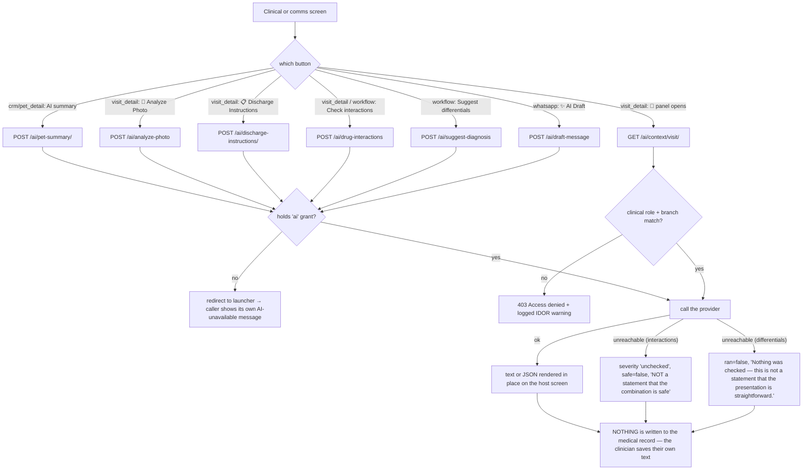

---

# Workflow 14 — Ask Petsy for live clinic data (staff mode)

## 14.1 Who, when, why

**Who:** any signed-in user, **any role, with no permission check at all** (0.4).
**When:** on any screen, without navigating away.
**Why:** a fast conversational read of live numbers — today's list, who is unpaid,
what is running out.

## 14.2 Preconditions

- Signed in — the paw button is inside `` in `base.html`.
- **The button is NOT gated on AI being configured.** `app.py:384` computes an
  `ai_enabled` flag with a comment explaining it exists to decide "whether to offer
  the Petsy button at all", and passes it to every template — but **`ai_enabled`
  appears in no template in the codebase** (a grep over `templates/` returns zero
  hits). On an installation with no AI provider, every page still shows a lively
  animated chat button that can only ever reply "Petsy is not enabled on this
  installation."

## 14.3 The happy path

**Step 1.** Click the **paw-print floating button** — bottom-right of every page,
animated, **draggable**, tooltip
**"Chat with Petsy AI / تحدث مع بيتسي الذكي"**.

**Step 2.** A panel opens, titled
**"🐾 Petsy AI Assistant / 🐾 مساعد بيتسي الذكي"**, with **Minimize / تصغير** (—)
and **Close / إغلاق** (×) buttons. Inside is an iframe that lazily loads
`/petsy/embed` the **first** time you open it (it is not fetched on page load).

**Step 3 — The embed page.** Its own standalone HTML document — it does **not**
extend `base.html`. Header: a cat SVG, **"🐾 Petsy"**, `<clinic name> · Your AI
Assistant`, and a green dot titled **"Online / متصل"**. Because you are signed in,
a red strip appears beneath it: **"🔒 Staff Mode — Live clinic data enabled"**.

Welcome card (English only): **"Hi, I'm Petsy!"** /
*"Your internal AI assistant — ask me about today's schedule, patients, revenue,
stock, and more."*

Six staff quick replies (English only): **📅 Today's appointments · 🏥 Open visits
now · 💰 Revenue today · 📦 Low stock alerts · 📊 Dashboard summary ·
💊 Pending prescriptions**.

**Step 4.** Click a quick reply — it strips the leading emoji, drops the text into
the input **and sends immediately** (unlike the AI Assistant's quick prompts, which
only fill the box). Or type your own into the box placeholder-labelled
**"Ask Petsy anything…"** and press Enter.

**Step 5 — What happens server-side.** `POST /petsy/chat`:

1. Per-IP rate limit: **15 requests per 60 seconds** (in-memory, per worker).
2. Reject empty (`400`), reject over **1500 characters** (`400`).
3. Take the **last 8 turns** of client-supplied history, then trim from the oldest
   until the total is under **6000 characters**.
4. Because `session["user"]` exists, run **staff mode**: match the message against
   **18 keyword intents** (bilingual English/Arabic regexes), run the matching live
   queries, and inject a formatted plain-text data block into the system prompt
   between `══ LIVE CLINIC DATA (fetched right now from the database) ══` markers.
5. Call the provider — model from `AI_MODEL`, `max_tokens` default **350** (note:
   lower than the AI Assistant's 700), timeout 45 s, `max_retries=0`.
6. Return `{reply, model, staff_mode: true, data_found}`.

The **18 intents**, and what each injects:

| Intent | Example trigger words (EN / AR) | Data injected |
|---|---|---|
| appointments_today | "appointments today" / "مواعيد اليوم" | today's non-cancelled appointments, up to 30, with time, pet, owner, status, type, doctor |
| appointments_upcoming | "this week", "upcoming appointment" / "المواعيد القادمة" | next 7 days, up to 20 |
| visits_open | "open visit", "who is in" / "الزيارات المفتوحة" | every visit with status `Open`, up to 20, with chief complaint |
| visits_today | "visit today", "patients today" / "زيارات اليوم" | today's visits, up to 30 |
| pending_invoices | "unpaid", "outstanding", "overdue" / "مديونية" | `Unpaid`/`Overdue`/`Partial` invoices, up to 25, **with owner names and balances**, plus the total |
| revenue_today | "revenue today" / "إيراد اليوم" | collected and invoiced for today |
| revenue_month | "revenue this month" / "إيراد الشهر" | month-to-date collected |
| low_stock | "low stock", "reorder" / "مخزون منخفض" | items at or below reorder level, or ✅ "All stock levels are above reorder points" |
| expiry_alerts | "expir", "expiry" / "انتهاء صلاحية" | batches expiring within 90 days, or ✅ "No items expiring within 90 days." |
| lab_pending | "lab result", "pending lab" / "نتيجة معلقة" | pending lab requests, or "🔬 No pending lab requests." |
| vaccinations_due | "vaccine due" / "تطعيم مستحق" | due in the next 30 days, or "💉 No vaccinations due in the next 30 days." |
| attendance_today | "who is present", "staff today" / "من حضر" | today's staff attendance |
| recent_patients | "new patient", "latest patient" / "مريض جديد" | most recent patients |
| dashboard_stats | "summary", "how many", "overview" / "ملخص", "كم عدد" | a combined snapshot |
| search_owner | "find owner", "look up" / "ابحث عن" | owner/pet name search (also fires as a **fallback for any message of 4 words or fewer with no other intent**, if the residual text is ≥ 3 characters) |
| grooming_today | "grooming today" / "تجميل اليوم" | today's grooming bookings |
| boarding_current | "boarding", "checked in" / "الإيواء" | current boarders, or "🏨 No animals currently boarding." |
| prescriptions_pending | "pending prescription" / "وصفة معلقة" | `Active` prescriptions, or "💊 All prescriptions have been dispensed." |

**Step 6.** The reply appears in the bubble with the model name. `data_found` tells
the widget whether the answer was backed by real data or was general knowledge.

## 14.4 Alternative scenarios

**You are a doctor.** Appointment and visit queries are filtered to
`doctor_name = <your full name>`. **Every other block is not.** Revenue, unpaid
invoices with client names and balances, staff attendance, stock — all returned in
full to any signed-in role, groomer and boarding attendant included.

**Nothing matched.** If no intent regex fires and the message is longer than four
words, no data block is injected and Petsy answers from general veterinary/clinic
knowledge with no database access.

**Several intents at once.** Intents are not exclusive. "Give me a summary of
today's appointments and revenue" fires three and injects all three blocks.

**Arabic.** Every intent regex carries Arabic keywords alongside the English, and
the staff prompt says *"Bilingual: reply in the user's language."* The **quick-reply
button labels are English only.**

**Opening `/petsy/embed` directly.** Works, in the same staff mode, as a full page
rather than an iframe.

**Answer length.** The staff prompt instructs **"Answer in under 120 words unless
asked for detail."** and the token budget is 350 — Petsy is deliberately terser
than the AI Assistant.

## 14.5 Errors and edge cases

| Situation | Exact behaviour |
|---|---|
| More than 15 requests in 60 s from your IP | `429 {"error": "Too many requests — please wait a moment."}` → bubble shows **"⚠️ Too many requests — please wait a moment."** |
| Empty message | `400 {"error": "Empty message"}`. |
| Over 1500 characters | `400 {"error": "Message too long (max 1500 characters)."}` |
| `openai` package missing, or `ai_configured()` false | **"🐾 بيتسي مش مفعّل على النظام ده. / Petsy is not enabled on this installation."** Deliberately *not* worded as "temporarily" — there is nothing temporary about an unconfigured provider. |
| Provider errors mentioning context/blocked/safety | **"🐾 My safety filters blocked that response. Please try rephrasing!"** |
| Any other provider error or timeout | **"🐾 Petsy is temporarily unavailable. Please try again shortly."** |
| Model returned an empty reply, or `finish_reason == "content_filter"` | **"🐾 I wasn't able to answer that — my safety filters flagged the content. Try rephrasing your question or ask about something else!"** |
| Browser `fetch` fails | **"⚠️ Connection error — please try again."** |
| One of the 18 SQL queries fails | Logged as `Petsy query error: …`; that block is skipped and the rest of the answer still assembles. Petsy will not tell you a block was missing. |
| CSRF | `/petsy/chat` is **exempt** from CSRF validation (`app.py:353`) — it is the public widget endpoint and is protected by rate limiting instead. |

## 14.6 What is written

**Nothing.** Petsy conversations are **not persisted anywhere** — not in
`ai_conversations`, not in any Petsy table. Close the panel and the thread is gone;
the only history is the last 8 turns the browser holds in memory and posts back.

The one exception: the **`petsy_usage`** table gets one row per **anonymous** call
(Workflow 15). **Staff calls never write a row** and never count against the cap.

## 14.7 Flowchart

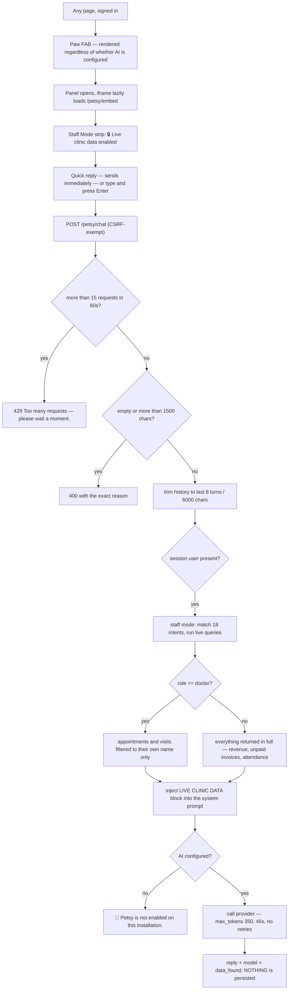

**Source:** `templates/base.html:525` (``), `:638` (the FAB),
`:657` (the panel and iframe); `templates/petsy/embed.html` (route:
`blueprints/petsy/routes.py:830`); `chat` at `:755`; intents at `:166`;
`_fetch_platform_data` at `:219`; `_call_petsy` at `:697`; CSRF exemption at
`app.py:353`.

---

# Workflow 15 — A pet owner asks Petsy a public question

## 15.1 Who, when, why

**Who:** a pet owner with no account — on the clinic's public website, or anyone
who opens `/petsy/embed` directly.
**When:** before booking, or with a general question.
**Why:** deflect routine questions from the phone.

## 15.2 Preconditions

- **None.** No sign-in, no token, no referer check. `/petsy/embed`,
  `/petsy/widget.js` and `POST /petsy/chat` are all reachable by anyone.
- To publish it on an external site, the clinic adds one line:
  `<script src="https://<your-clinic>/petsy/widget.js"></script>`. The script is
  served as `application/javascript`, cached for an hour
  (`Cache-Control: public, max-age=3600`), with `Access-Control-Allow-Origin: *`.
  Its `BASE` is derived from whichever host served it.

## 15.3 The happy path

**Step 1.** The visitor loads the clinic's website and the paw bubble appears.

**Step 2.** They open it. The header shows the clinic name and the Online / متصل
dot. **No** "Staff Mode" strip. Welcome card (English only):
**"Hi there! I'm Petsy 🐱"** / *"Your friendly vet assistant. Ask me anything about
your pet, our services, or general pet health!"*

Six public quick replies (English only): **📅 Book appointment · 💉 Vaccination
info · 🐶 Dog health tips · 🐱 Cat care tips · ⏰ Working hours ·
💊 Medication advice**.

**Step 3.** They type or click. `POST /petsy/chat` runs the same rate limit,
length cap and history trim as staff mode, finds **no session**, and therefore:

- **Never touches the database for clinic data.** `_fetch_platform_data()` is only
  called inside the `if user:` branch. There is no path by which an anonymous
  caller can retrieve appointments, invoices, stock or client names.
- Checks the **global anonymous daily cap** before spending anything: today's row
  count in `petsy_usage` against `PETSY_PUBLIC_DAILY_CAP` (default **500**).
- Uses the public system prompt: warm, professional, bilingual, **"BE SHORT. Three
  points at most, under 80 words, no preamble."**, and for anything medical it must
  append **"⚕️ Always consult Dr. Hatem or a licensed veterinarian."**

**Step 4.** The answer appears with `staff_mode: false`.

## 15.4 Alternative scenarios

**Arabic visitor.** The public prompt is explicitly bilingual and replies in the
visitor's language. The quick-reply labels stay English.

**A staff member who is signed in on the same browser** gets staff mode even
through the external widget — mode is decided purely by `session.get("user")`.

**The daily cap.** Signed-in staff are exempt and are **never counted**, so a busy
clinic cannot exhaust its own public budget by using Petsy internally.

## 15.5 Errors and edge cases

| Situation | Exact behaviour |
|---|---|
| Anonymous daily cap reached | `429` with **"Petsy is resting for today 🐾 Please contact the clinic directly, or try again tomorrow."** and `capped: true`. It stays that way until the date rolls over. |
| More than 15 requests in 60 s from one IP | `429 {"error": "Too many requests — please wait a moment."}` — this fires *before* the daily cap check. |
| The usage-accounting query itself fails | Logged as `Petsy usage accounting failed; allowing the call` and **the call is allowed** — bookkeeping never breaks the widget, at the cost of an unbounded bill if the table is broken. |
| AI not configured | **"🐾 بيتسي مش مفعّل على النظام ده. / Petsy is not enabled on this installation."** |
| Medical question | Answered generally, with the "consult Dr. Hatem or a licensed veterinarian" line appended by the prompt — the model is instructed to, not forced to. |
| A visitor asks "how many unpaid invoices do you have?" | Public mode never calls `_fetch_platform_data()`; the model answers from general knowledge with no clinic figures. |
| The per-IP limiter and multiple workers | `_rate` is a module-level dict, so each gunicorn worker keeps its own count — the effective per-IP limit is 15 × the worker count. The database-backed daily cap is the real ceiling. |

## 15.6 What is written

**`petsy_usage`** — one append-only row per **anonymous** call:
`day` (today's date), `ip`, `created_at`. The table (and its `day` index) are
created on first use. Nothing else is written; the conversation itself is not
stored.

## 15.7 Flowchart

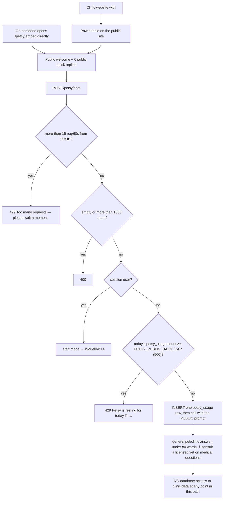

**Source:** `templates/petsy/embed.html` (route: `blueprints/petsy/routes.py:830`);
`templates/petsy/widget_js.html` (route: `:846`); `_public_budget_left` at `:81`;
`_PUBLIC_SYSTEM` at `:122`.

---

# Appendix A — Side doors

These three routes exist, are reachable, and are documented here so nobody
rediscovers them by accident. None is part of a normal working day.

## A-1. `GET /module/<module_id>` — the access-checked opener

Looks the module up in `MODULES`; **404** if the id is unknown. If your role is not
in that module's `roles` list and you are not `super_admin`, it flashes
**"You don't have access to this module."** (red) and returns you to `/`. Otherwise
it writes an audit row (`db.log_audit(action="open_module", module=<id>,
details=<module name>)`) and redirects — to the legacy app if the module is marked
legacy, otherwise to `/module/<id>/stub`.

**In practice this route is dead.** The dashboard cards link straight to `mod.url`,
so this route and its audit entry are only reached by typing the URL. Module access
is still properly enforced — by `_permission_denied()` on the destination
blueprint — but **"which modules did this user open" is not being recorded** for
normal clicks.

Note also: a module that *does* have a `url` (which is all of them except
`multi_branch`) will still be redirected by this route to its **stub page**, not to
its real URL, because the redirect only distinguishes `legacy` from everything
else. Typing `/module/crm` sends you to a "Coming Soon" page for a module that is
live.

**Source:** `blueprints/launcher/routes.py:642`; the bypass at
`templates/launcher.html:607-616`.

## A-2. `GET /module/<module_id>/stub` — the "Coming Soon" page

Shows the module icon, a status badge (**🔧 Beta Preview / معاينة تجريبية**,
**🔮 Planned / مخطط**, or **🗓 Coming Soon / قريباً**), the module name, its `badge`
value, its description, and two buttons: **"← Back to Launcher / العودة للوحة الوحدات"**
and **"🩺 Open Examination Module / فتح وحدة الفحص"**.

Three things to know:

1. **No per-module role check on this route.** It renders whatever `module_id` you
   pass; an unknown id renders a blank shell (`mod` is `None`) reading
   **"Module Under Development / وحدة قيد التطوير"**.
2. **The "Open Examination Module" button is ungated.** It points at
   `/launcher/legacy/start`, which `abort(404)`s whenever `LEGACY_APP_ENABLED` is
   off. The launcher's own copies of that button are correctly wrapped in
   ``; this one is not, so on every hosted deployment it is a
   404 waiting to be clicked.
3. **Nothing on the dashboard reaches this page** (Workflow 2.4).

**Source:** `templates/stub.html` (button at `:35`); route
`blueprints/launcher/routes.py:681`.

## A-3. `GET /coming-soon` — the parameterised placeholder

Everything on it comes from the query string: `?module=`, `?icon=`, `?desc=`,
repeated `?feature=`, `?eta=`. Defaults: `This Module`, `🔧`,
`This module is currently under development.`, `['Feature coming soon']`,
`Q3 2026`.

The page renders a floating icon, an **"In Development / قيد التطوير"** pulsing
badge, a **hardcoded 42% progress bar** with the note
**"Active development underway — core architecture and database schema are
complete. / التطوير جارٍ — اكتملت البنية الأساسية ومخطط قاعدة البيانات."**, a
**"✨ What's Coming / ✨ ما هو قادم"** grid of disabled checkboxes, a
**"🗓 Timeline / 🗓 الجدول الزمني"** card showing the ETA, the line
**"Our developers are working hard — even on weekends! 🐶 / مطورونا يعملون بجد — حتى في عطلة نهاية الأسبوع! 🐶"**,
and two buttons: **"🏠 Back to Dashboard / 🏠 العودة إلى لوحة التحكم"** and
**"← Go Back / ← رجوع"**.

**Nothing anywhere links to it.** The 42% is not a measurement of anything.

**Source:** `templates/coming_soon.html`; route
`blueprints/launcher/routes.py:762`.

## A-4. `GET /launcher/legacy/start` and `/launcher/legacy/ping`

The bridge to the old Windows examination app.

- `/start`: **`abort(404)` unless `LEGACY_APP_ENABLED` is truthy.** When enabled,
  it checks TCP `127.0.0.1:<port from LEGACY_APP_URL>`, and if nothing is
  listening, spawns `python app.py` in `../ppc_diagnostics_work` on **the server**,
  waits up to **12 seconds** (24 × 0.5 s) for the port to open, then redirects to
  `LEGACY_APP_URL + "/"` — whether or not it ever came up.
- `/ping`: returns `{"enabled": false, "up": false}` when disabled, otherwise
  `{"enabled": true, "up": <port open>}`.

On a hosted deployment `LEGACY_APP_ENABLED` is off, so `/start` is a 404 and the two
topbar buttons never render. The source comment explains why the flag exists at
all: `LEGACY_APP_URL` defaults to `http://localhost:5000`, which from a visitor's
browser means **their own machine**.

**Source:** `blueprints/launcher/routes.py:719` (`launch_legacy`), `:750`
(`legacy_ping`), `:695` (`legacy_available`).

---

# Appendix B — Known limits (every item verified in the source, both sides)

**B-1. The dashboard "AI Insights" card can never show an insight.**
`templates/launcher.html:707` reads `d.insight` — a singular string.
`blueprints/ai_assistant/routes.py:579` returns
`{"insights": [...], "generated_at": ...}`. The key does not exist, so the card
always falls to the literal
**"AI ready for queries." / "الذكاء الاصطناعي جاهز للاستفسارات."** The endpoint
runs, queries eight live figures, spends a model call, and its result is discarded
on every dashboard load for every user.

**B-2. The dashboard "Stock Alerts" card is always green.**
`templates/launcher.html:556` reads `stats.get('low_stock', 0)`. The stats dict
built at `blueprints/launcher/routes.py:614-623` has **no `low_stock` key** —
`get_dashboard_stats()` calls it `low_stock_count` and the launcher does not copy
it across. Every user, every day, reads
**"✅ All stock levels are healthy / مستويات المخزون جيدة"**, including on a clinic
with items at zero. `/reports/dashboard` shows the same figure correctly, because
it reads the stats dict directly.

**B-3. The dashboard "System" card is hardcoded.**
**"All systems operational / جميع الأنظمة تعمل"** and
**"Last backup: today / آخر نسخ احتياطي: اليوم"** are static text at
`templates/launcher.html:568-573`. There is no health check and no backup
timestamp behind either line.

**B-4. The dashboard's Today's Schedule "Time" column always shows `—`.**
`/appointments/api/queue` returns the field as `appt_time` (aliased from
`appt_start`); `templates/launcher.html:748` reads
`a.time || a.appointment_time || '—'`. Neither name exists. The status badge colour
is also always blue, because the script's colour map keys are lowercase while the
database stores `Scheduled`/`Confirmed`/`Checked-in`.

**B-5. The "AI Assistant Not Configured" screen names the wrong cause.**
`templates/ai_assistant/chat.html:317-327` tells clinic staff *"The `openai` Python
package is required. Run: `pip install openai`"* and names
`http://localhost:3001`. But `ai_configured()`
(`blueprints/ai_assistant/routes.py:90`) also returns `False` when the package **is**
installed and only `AI_API_KEY` is missing, or when the configured local proxy is
not listening. So the most common cause is misdiagnosed, and the fix instruction is
an operator command shown to a receptionist.

**B-6. The AI Assistant is unreachable for most of the roles it is advertised to.**
The launcher card lists `ai_assistant` for super_admin, clinic_owner,
branch_manager, doctor, nurse, reception, finance and inventory_mgr
(`blueprints/launcher/routes.py:364`), and `base.html:261` shows the sidebar link
to **everyone**. But the blueprint is mapped to the `ai` grant
(`blueprints/auth/routes.py:140`) and `DEFAULT_ROLE_PERMISSIONS` gives `ai` only to
clinic_owner and doctor (plus super_admin, which bypasses). A nurse, receptionist,
branch manager, finance or inventory user who clicks either is flashed
**"You don't have permission to access this page."** and bounced. The Ctrl+K palette
is the same, except it fails silently with "⚠️ AI service unavailable."

**B-7. Petsy has no permission gate at all, and almost no role scoping.**
None of the three Petsy routes carries `@login_required`, so `_permission_denied()`
never runs for them and the `"petsy": "petshop"` entry in `_BP_PERMISSION` is dead
code. Inside `_fetch_platform_data` the only role branch is a doctor's own-name
filter on appointments and visits (`blueprints/petsy/routes.py:273`, `:334`,
`:358`). A groomer, boarding attendant or nurse asking "revenue today" or
"unpaid invoices" gets the clinic's real financial figures, with client names and
balances.

**B-8. The Petsy floating button is not gated on AI being configured.**
`app.py:384` computes `ai_enabled` with the comment "Whether to offer the Petsy
button at all", but `ai_enabled` appears in **no template** (grep over
`templates/` returns zero hits). The FAB at `templates/base.html:638` is inside
`` only. On an installation with no AI provider, every page
shows an animated chat button whose only possible answer is
"Petsy is not enabled on this installation."

**B-9. `/reports/builder` is an orphan screen.** No link to it exists in
`base.html`, in any reports template, or anywhere under `templates/`. The only
inbound link in the codebase is the **← Builder** back-link on its own results
page. Users must type the URL to reach the most capable reporting tool in the
platform.

**B-10. Saved reports have no ownership.** `builder_saved`
(`blueprints/reports/builder_routes.py:335`) and `builder_delete` (`:360`) look the
row up by **id only**. Any user with the `reports` grant can run — or permanently
delete — a report another user saved. `created_by` is displayed but never checked.

**B-11. "Payment Methods" on the financial report is one fabricated row.**
`blueprints/reports/routes.py:84` aggregates every `Paid`/`Partial` invoice into a
single row labelled **"All Payments"** at a hardcoded **100%**, with a source
comment stating that no `payment_method` column exists on `invoices`. The section
header promises a breakdown the data cannot provide. The real per-method data
exists in the `payments` table and is reachable through the report builder's
**Payments Received** source (`py.method` → "Method").

**B-12. `/reports/clinical` has no date filter.** Hardcoded to the last 30 days,
with no way to change the window from the UI.

**B-13. The financial report's chart ignores the date range.** The cards respond to
From/To; the chart always calls `get_revenue_by_day(30)`. Setting the window to
March gives March cards next to a last-30-days chart, both labelled as if they
matched.

**B-14. Doctor Revenue's "Collected" ignores partial payments.** It sums the invoice
**total** where `status = 'Paid'`. A `Partial` invoice with 400 of 900 EGP received
contributes 0 to Collected and its full 900 to Pending. The screen's docstring
promises "commission" — there is no commission field, calculation or payout
anywhere in the route or the template.

**B-15. The AI chat rate limiter measures the wrong thing.**
`blueprints/ai_assistant/routes.py:436` calls `_sec.is_rate_limited(ip)`, which
counts rows in the **`login_attempts`** table. The only writer of that table is
`record_failed_login()` (`models/security.py:171`). No AI message ever writes a
row, so the limiter can never fire from chat volume — but **five failed logins from
your IP inside 15 minutes will block AI chat for 15 minutes** with the message
"Too many requests. Please wait before sending another message." The same class of
bug was already found and fixed in `blueprints/public_api/routes.py:65`, whose
comment explains it exactly; the AI blueprint was not updated.

**B-16. `/ai/health-alerts` is broken and orphaned.** Its middle query selects from
`inventory_items` — a table that exists nowhere in `models/database.py` or
`db_migrations/` (verified by grep). The entire body is wrapped in
`except Exception: pass`, so that failure silently kills the rest of the `try`
block and the third alert type (unpaid invoices older than 30 days) is **never
reached**. The endpoint can only ever return overdue-vaccination alerts. No
template calls it.

**B-17. `/ai/outbreak-radar` is orphaned.** The code works — it clusters diagnoses
across the last 7 days, flags any seen in 3+ distinct pets as `alert`, and asks the
model for a public-health comment — but **no template or static file calls it**.

**B-18. `/coming-soon` renders entirely from query-string parameters** and is linked
from nowhere. Its 42% progress bar is hardcoded.

**B-19. `/module/<id>` is effectively bypassed.** `templates/launcher.html:607-616`
links module cards straight to `mod.url`, so the role check and the
`db.log_audit("open_module")` row in `open_module()` only happen when someone types
the URL by hand. Module access is still enforced by `_permission_denied()` on the
destination blueprint, but the audit trail of module opens is empty in practice.
Worse, typing `/module/crm` for a module that *is* live redirects you to its stub
"Coming Soon" page.

**B-20. `stub.html:35` renders an ungated "Open Examination Module" button**
pointing at `/launcher/legacy/start`, which `abort(404)`s whenever
`LEGACY_APP_ENABLED` is off. The launcher's own copies of that button are correctly
wrapped in ``; this one is not.

**B-21. The AI chat quick prompts are English-only.** Neither the prompt strings nor
the button labels pass through `t()`
(`templates/ai_assistant/chat.html:239-310`), on a bilingual RTL product. There
**is** an `` fallback branch at `:304` giving two generic prompts to any
role not named, so no role gets an empty sidebar. Note also that the nurse,
reception, inventory_mgr, pharmacist and finance prompt sets can never be seen on a
default installation, because none of those roles holds the `ai` grant (B-6).

**B-22. `role_required` is imported and never used in reports.**
`blueprints/reports/routes.py:9` imports it; **no report route carries a role
decorator**. Report access rests entirely on the blueprint-level `reports` grant.

**B-23. `/reports/financial/compare` 500s on a malformed date.**
`datetime.fromisoformat(date_from)` at `blueprints/reports/routes.py:278` has no
`try`. `?date_from=july` raises `ValueError` and the request fails with a 500. The
plain `/reports/financial` view has no such problem.

**B-24. `/reports/export/csv` with an unknown `?type=` returns an empty file
silently** — no header row, no rows, no flash — named after whatever you typed.

**B-25. The report builder's Excel failure still renders HTML.** On an export
error, `builder_run` flashes **"Excel export error: …"** and then **falls through**
to `render_template("reports/builder_results.html", …)`, so you get the results
table with an error banner rather than a download.

**B-26. Effective roles depend on the clinic's own Roles screen.** Everything
stated about role reachability in this chapter is the **seeded default** from
`DEFAULT_ROLE_PERMISSIONS` (`models/database.py:4346`), which
`seed_default_permissions()` only applies to roles whose `permissions_json` is
empty. An administrator can have changed any of it. Separately, the literal role
`"staff"` appears in several launcher module role lists but has **no entry** in
`DEFAULT_ROLE_PERMISSIONS`; per the comment at `blueprints/auth/routes.py:118-123`,
an unknown role now denies, so a `staff` user with no `roles` row is denied every
governed blueprint including reports and AI.

## Two corrections to earlier notes on this area

**Not a bug: the report builder's date filters are not PostgreSQL-only.**
`blueprints/reports/builder_routes.py:232` emits
`SUBSTRING(col::text,1,10)`. `models/database.py` runs every SQLite statement
through `_fix_sql_sqlite()`, which rewrites `::text` to `CAST(… AS TEXT)`
(verified by running the translator against the builder's exact query shape), and
SQLite has provided `SUBSTRING()` as an alias for `substr()` since version 3.34
(2020). It works on both back ends. It would only fail on a SQLite build older than
3.34 — in which case it surfaces as the "Query error: …" flash.

**Not a bug: the AI chat quick-prompt chain does have a fallback.** There *is* an
`` branch at `templates/ai_assistant/chat.html:304`, giving
"🏥 Typical hospital services" and "📅 Routine checkup frequency" to any role not
explicitly named. No role gets an empty Quick Prompts sidebar. (The English-only
part of that note stands — see B-21.)

---

# Appendix C — Screen index

| Screen / route | Template | Route |
|---|---|---|
| Main dashboard `GET /` | `D:/vet/platform/templates/launcher.html` | `D:/vet/platform/blueprints/launcher/routes.py:599` |
| Module opener `GET /module/<id>` | — (redirect) | `D:/vet/platform/blueprints/launcher/routes.py:642` |
| Module stub `GET /module/<id>/stub` | `D:/vet/platform/templates/stub.html` | `D:/vet/platform/blueprints/launcher/routes.py:681` |
| Coming soon `GET /coming-soon` | `D:/vet/platform/templates/coming_soon.html` | `D:/vet/platform/blueprints/launcher/routes.py:762` |
| Legacy start `GET /launcher/legacy/start` | — | `D:/vet/platform/blueprints/launcher/routes.py:719` |
| Legacy ping `GET /launcher/legacy/ping` | — | `D:/vet/platform/blueprints/launcher/routes.py:750` |
| Reports index `GET /reports/` | — (redirect) | `D:/vet/platform/blueprints/reports/routes.py:14` |
| Executive dashboard `GET /reports/dashboard` | `D:/vet/platform/templates/reports/dashboard.html` | `D:/vet/platform/blueprints/reports/routes.py:20` |
| Clinical `GET /reports/clinical` | `D:/vet/platform/templates/reports/clinical.html` | `D:/vet/platform/blueprints/reports/routes.py:35` |
| Financial `GET /reports/financial` | `D:/vet/platform/templates/reports/financial.html` | `D:/vet/platform/blueprints/reports/routes.py:66` |
| Financial compare `GET /reports/financial/compare` | same template, `compare_mode=True` | `D:/vet/platform/blueprints/reports/routes.py:270` |
| Inventory `GET /reports/inventory` | `D:/vet/platform/templates/reports/inventory_report.html` | `D:/vet/platform/blueprints/reports/routes.py:96` |
| Inventory xlsx `GET /reports/inventory/export/xlsx` | — (file) | `D:/vet/platform/blueprints/reports/routes.py:148` |
| Doctor revenue `GET /reports/doctor-revenue` | `D:/vet/platform/templates/reports/doctor_revenue.html` | `D:/vet/platform/blueprints/reports/routes.py:201` |
| CSV export `GET /reports/export/csv` | — (file) | `D:/vet/platform/blueprints/reports/routes.py:332` |
| Report builder `GET /reports/builder` | `D:/vet/platform/templates/reports/builder.html` | `D:/vet/platform/blueprints/reports/builder_routes.py:181` |
| Builder run `POST /reports/builder/run` | `D:/vet/platform/templates/reports/builder_results.html` | `D:/vet/platform/blueprints/reports/builder_routes.py:201` |
| Builder save `POST /reports/builder/save` | — | `D:/vet/platform/blueprints/reports/builder_routes.py:304` |
| Saved report run `GET /reports/builder/saved/<id>` | `builder_results.html` | `D:/vet/platform/blueprints/reports/builder_routes.py:335` |
| Saved report delete `POST /reports/builder/saved/<id>/delete` | — | `D:/vet/platform/blueprints/reports/builder_routes.py:360` |
| AI chat `GET /ai/` | `D:/vet/platform/templates/ai_assistant/chat.html` | `D:/vet/platform/blueprints/ai_assistant/routes.py:367` |
| AI chat endpoint `POST /ai/chat` | — (JSON) | `D:/vet/platform/blueprints/ai_assistant/routes.py:427` |
| AI history `GET /ai/history` | `D:/vet/platform/templates/ai_assistant/history.html` | `D:/vet/platform/blueprints/ai_assistant/routes.py:477` |
| AI clear `POST /ai/clear` | — | `D:/vet/platform/blueprints/ai_assistant/routes.py:497` |
| AI insights `POST /ai/insights` | — (JSON) | `D:/vet/platform/blueprints/ai_assistant/routes.py:511` |
| Visit context `GET /ai/context/visit/<id>` | — (JSON) | `D:/vet/platform/blueprints/ai_assistant/routes.py:384` |
| Pet summary `POST /ai/pet-summary/<id>` | — (JSON) | `D:/vet/platform/blueprints/ai_assistant/routes.py:586` |
| Draft message `POST /ai/draft-message` | — (JSON) | `D:/vet/platform/blueprints/ai_assistant/routes.py:646` |
| NL report `POST /ai/nl-report` | — (JSON) | `D:/vet/platform/blueprints/ai_assistant/routes.py:687` |
| Health alerts `GET /ai/health-alerts` (orphan, broken) | — (JSON) | `D:/vet/platform/blueprints/ai_assistant/routes.py:728` |
| Analyze photo `POST /ai/analyze-photo` | — (JSON) | `D:/vet/platform/blueprints/ai_assistant/routes.py:791` |
| Discharge `POST /ai/discharge-instructions/<id>` | — (JSON) | `D:/vet/platform/blueprints/ai_assistant/routes.py:860` |
| Outbreak radar `GET /ai/outbreak-radar` (orphan) | — (JSON) | `D:/vet/platform/blueprints/ai_assistant/routes.py:928` |
| Drug interactions `POST /ai/drug-interactions` | — (JSON) | `D:/vet/platform/blueprints/ai_assistant/routes.py:989` |
| Suggest diagnosis `POST /ai/suggest-diagnosis` | — (JSON) | `D:/vet/platform/blueprints/ai_assistant/routes.py:1066` |
| Petsy chat `POST /petsy/chat` | — (JSON) | `D:/vet/platform/blueprints/petsy/routes.py:755` |
| Petsy embed `GET /petsy/embed` | `D:/vet/platform/templates/petsy/embed.html` | `D:/vet/platform/blueprints/petsy/routes.py:830` |
| Petsy widget `GET /petsy/widget.js` | `D:/vet/platform/templates/petsy/widget_js.html` | `D:/vet/platform/blueprints/petsy/routes.py:846` |
| Ctrl+K command palette | `D:/vet/platform/templates/base.html:841` (markup), `:1271` (`v3AskAI`) | posts to `/ai/chat` |
| Petsy floating button | `D:/vet/platform/templates/base.html:638` (FAB), `:657` (panel) | loads `/petsy/embed` |

**Supporting code referenced throughout this chapter:**

- Permission gate: `D:/vet/platform/blueprints/auth/routes.py:59` (`login_required`),
  `:89` (`_permission_denied`), `:140` (`_BP_PERMISSION`), `:167` (`role_required`).
- Seeded grants: `D:/vet/platform/models/database.py:4302` (`ALL_PERMISSIONS`),
  `:4346` (`DEFAULT_ROLE_PERMISSIONS`), `:4382` (`seed_default_permissions`).
- Statistics: `D:/vet/platform/models/database.py:3940` (`get_finance_summary`),
  `:3995` (`get_dashboard_stats`), `:4016` (`get_revenue_by_day`),
  `:4048` (`get_top_services`).
- Excel: `D:/vet/platform/models/excel_export.py:50` (`make_workbook`).
- Rate limiting: `D:/vet/platform/models/security.py:171`
  (`record_failed_login`), `:193` (`is_rate_limited`).
- SQL dialect translation: `D:/vet/platform/models/database.py:451` onward
  (`_fix_sql_sqlite` and its cast map).
- CSRF exemption for Petsy: `D:/vet/platform/app.py:353`.
- The unused `ai_enabled` flag: `D:/vet/platform/app.py:384`, `:453`.

---

*Written from the source, August 2026. The application was not run; every
behaviour above was read out of the route functions and templates cited, and both
sides of each contract (caller and callee) were checked before it was written
down.*
