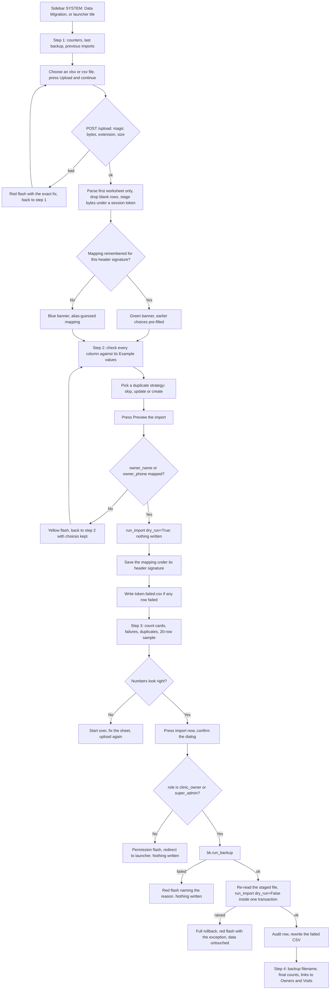

# Data Migration — Importing a Clinic's Existing Records

**Module:** `migration` · **URL prefix:** `/migration/` · **Blueprint:** `blueprints/migration/routes.py` · **Templates:** `templates/migration/` · **Engine:** `migrations/excel_import.py`

This is normally the **first thing a real clinic does**. They arrive with one
spreadsheet — owners, pets and whatever visit history their receptionist typed — and
this four-step wizard is how it becomes platform data.

This chapter documents **only what the code does today**. Where a screen promises
something it does not deliver, that is written down as a limit, not as a feature.
Every section ends with a `Source` line so the next writer can check the claim.

Nothing here was exercised in a browser. It is read from source — with one exception,
noted where it appears: the normalisation and duplicate-matching claims in §0.5, §1.4
and Workflow 3 were confirmed by running `migrations/excel_import.py`'s own functions
against a throwaway SQLite database built from the shipped `owners` / `pets` / `visits`
schema.

---

## 0. Before you start

### 0.1 The five routes and four screens

| # | Route | Method | Renders | What it is |
|---|-------|--------|---------|------------|
| 1 | `/migration/` | `GET` | `index.html` | Step 1 — the landing page and the file picker |
| 2 | `/migration/upload` | `POST` | `map.html` | Step 2 — reads the file, guesses the columns, shows the mapping table |
| 3 | `/migration/preview` | `POST` | `preview.html` | Step 3 — the dry run. Writes nothing |
| 4 | `/migration/commit` | `POST` | `result.html` | Step 4 — backup, then one transaction |
| 5 | `/migration/failed-rows.csv` | `GET` | CSV download | The rows that did not import, as a file to fix |

Four templates, five routes: `upload` renders the mapping screen and `commit` renders
the results screen, so neither has a page of its own you can navigate to. **Steps 2, 3
and 4 are all POST.** Refreshing them re-posts; using the browser Back button after a
commit and pressing the button again runs a second import (see Workflow 3 —
it will not duplicate under the default strategy, but it will take a second backup).

Source: `blueprints/migration/routes.py:140,171,229,283,363`; `app.py:234,262`

### 0.2 Who can open what

Two gates normally run in this product — the **module grant** (`login_required`) and the
route's own **role list** (`role_required`). For this module the first one falls open:
`migration` is not a key in `ALL_PERMISSIONS`, and `_permission_for()` returns `""` for
any blueprint with no grantable key, which `_permission_denied()` treats as "nothing to
enforce". **So the module cannot be granted or revoked on the Roles & Permissions
screen at all, and only the hardcoded role lists below decide access.**

Source: `blueprints/auth/routes.py:88-133, 155-166, 167-194`; `models/database.py:4302-4330`

| Route | Decorator | Who can actually use it |
|-------|-----------|-------------------------|
| `/`, `/upload`, `/preview`, `/failed-rows.csv` | `role_required("super_admin", "clinic_owner", "support_admin")` | super_admin, clinic_owner, support_admin |
| `/commit` | `role_required("super_admin", "clinic_owner")` | super_admin, clinic_owner |

**The consequence a support engineer will hit:** `support_admin` can upload a file, map
its columns and run the preview, but pressing **Import now / تنفيذ الاستيراد الآن** at the
bottom of the preview bounces to the launcher with `You don't have permission to access
this page.` The button is not hidden. Only the clinic owner (or a super admin) can
actually commit. This is deliberate — a destructive write to a customer's live database
is the clinic's decision — but nothing on screen says so before the click.

Source: `routes.py:38-39, 141, 172, 230, 284, 364`; `blueprints/auth/routes.py:186-190`

Everyone else — doctor, nurse, reception, pharmacist, inventory_mgr, finance, hr,
groomer, boarding_staff, auditor — is bounced on every route in the module.

### 0.3 How to get in

- **Sidebar** — `SYSTEM / النظام` group → `Data Migration / ترحيل البيانات`. The whole
  SYSTEM group is wrapped in a role test for `super_admin, clinic_owner, support_admin`,
  which matches the read roles exactly. Nobody sees a link they cannot open.
  Source: `templates/base.html:289, 318-321`
- **Launcher tile** — `🔄 Data Migration / ترحيل البيانات`, badge `Live`, category
  `system`, description `Import legacy Excel clinic data into the unified platform ·
  Patients · Visits · Owners`. Tile roles: `super_admin, clinic_owner, support_admin` —
  also an exact match.
  Source: `blueprints/launcher/routes.py:507-521`
- **Direct URL** — `/migration/`.

This is one of the few modules where the sidebar, the launcher and the route agree.

### 0.4 What the importer carries — the nineteen fields

Every column in your file is mapped onto one of these, or onto **Do not import / عدم
الاستيراد**. There are nineteen, no more, and this list is the whole contract:

| Group | Field key | English label | Arabic label | Lands in |
|-------|-----------|---------------|--------------|----------|
| **Owner / العميل** | `owner_name` | Owner name | اسم العميل | `owners.full_name` |
| | `owner_phone` | Phone | رقم الهاتف | `owners.phone` **and** `owners.whatsapp_phone` |
| | `owner_email` | Email | البريد الإلكتروني | `owners.email` |
| | `owner_address` | Address | العنوان | `owners.address` |
| | `owner_notes` | Owner notes | ملاحظات عن العميل | `owners.notes` |
| **Pet / الحيوان** | `pet_name` | Pet name | اسم الحيوان | `pets.pet_name` |
| | `pet_species` | Species | النوع | `pets.species` (defaults to `Unknown`) |
| | `pet_breed` | Breed | السلالة | `pets.breed` |
| | `pet_sex` | Sex | الجنس | `pets.sex` (defaults to `Unknown`) |
| | `pet_dob` | Date of birth | تاريخ الميلاد | `pets.dob` |
| | `pet_weight` | Weight (kg) | الوزن بالكيلوجرام | `pets.weight_kg` |
| | `pet_color` | Colour | اللون | `pets.color` |
| | `pet_microchip` | Microchip number | رقم الشريحة | `pets.microchip_id` |
| | `pet_notes` | Pet notes | ملاحظات عن الحيوان | `pets.notes` |
| **Visit / الزيارة** | `visit_date` | Visit date | تاريخ الزيارة | `visits.visit_date` |
| | `visit_type` | Visit type | نوع الزيارة | `visits.visit_type` |
| | `visit_doctor` | Doctor | الطبيب | `visits.doctor_name` (**text only** — see §0.5) |
| | `visit_complaint` | Reason / diagnosis | سبب الزيارة أو التشخيص | `visits.chief_complaint` |
| | `visit_notes` | Visit notes | ملاحظات الزيارة | `visits.notes` |

Source: `migrations/excel_import.py:43-64` (`TARGET_FIELDS`), `:67-72` (`GROUP_LABELS`),
`:749-757, 814-822, 853-861` (the three INSERT statements)

**One column per field.** `clean_mapping()` keeps the first column that claims a field
and silently drops any later one. The mapping screen also blocks submission in the
browser if two dropdowns hold the same value — see §1.5.
Source: `excel_import.py:526-547`; `templates/migration/map.html:137-148`

### 0.5 What it cannot carry

This matters more than the list above, because a clinic arriving with one spreadsheet
usually has money in it.

- **No money of any kind.** There is no price, fee, charge, paid, balance, discount or
  currency field. A column headed `Fee (EGP)` or `المبلغ` can only be mapped to
  **Do not import**, or squeezed into `visit_notes` as free text. **No invoice, payment,
  deposit or outstanding balance is created by an import.** A clinic's historical
  takings do not come across, and the imported visits are financially invisible: they
  appear in the medical record but contribute nothing to any finance or accounting
  report.
- **No service or product catalogue.** Service names, service prices, product prices,
  stock and suppliers have no field. The pet shop and the service catalogue must be
  built by hand or through their own screens.
- **The doctor is a name, not a person.** `visit_doctor` writes
  `visits.doctor_name` as free text; `visits.doctor_id` is left NULL. An imported visit
  is not attached to any staff record, so it will not show under that doctor anywhere
  that joins on `doctor_id`.
- **No Arabic-name columns.** The schema carries `owners.full_name_ar`,
  `owners.address_ar` and `pets.pet_name_ar`, and the app's `loc()` helper renders those
  to Arabic-language users in preference to the Latin column — but the importer never
  writes them. An Arabic name from the spreadsheet goes into `full_name` intact and
  displays correctly by fallback; there is simply no way to import a *pair* of names.
  Source: `app.py:410-438`; `models/database.py:1212-1231`
- **Nothing else in the medical record.** No appointments, vaccinations, prescriptions,
  lab results, imaging, allergies, chronic conditions, neuter status, diet notes,
  insurance number, attachments, vitals (weight/temp/pulse on the *visit*), symptoms,
  diagnoses table rows, loyalty points or owner VIP flag. Several of those columns exist
  in the schema and are simply left at their defaults.
- **Only the first sheet.** `wb.active` is read and every other worksheet in the
  workbook is ignored, with no warning that they exist.
  Source: `excel_import.py:441`
- **20,000 data rows maximum**, and 16 MB maximum upload.
  Source: `excel_import.py:30, 469-475`; `app.py:296`

### 0.6 Language, money and dates

- **Bilingual, both directions.** Every label on all four screens comes from `t(en, ar)`
  and flips with the signed-in user's language; this module has no English-only strings
  in its templates. The bilingual coverage extends to the *engine*: every row error and
  every duplicate note carries an `en` and an `ar` text, rendered as `{{ t(e.en, e.ar) }}`.
  Source: `app.py:406-408`; `excel_import.py:611-622`; `preview.html:80-84, 119-123`
- **Arabic data is first-class.** Arabic column titles are recognised by the guesser
  (`رقم الهاتف`, `اسم الحيوان`, `تاريخ الزيارة` and ~120 more aliases). Arabic-Indic
  digits `٠١٢٣٤٥٦٧٨٩` and Extended Arabic-Indic `۰۱۲۳۴۵۶۷۸۹` are converted to ASCII in
  phone, date and weight cells. Zero-width and bidi control characters that Excel
  sprinkles through Arabic cells are stripped before comparison, so two identical-looking
  names actually compare equal. Stored values keep the clinic's original spelling —
  the aggressive letter-folding (`أ إ آ → ا`, `ة → ه`, `ى ئ → ي`) is used for *matching
  only* and is never written to the database.
  Source: `excel_import.py:76-165, 168-206`
- **Phone numbers are normalised to one Egyptian local form.** Non-digits dropped, a
  leading `00` removed, a leading country code `20` followed by ≥9 more digits replaced
  by a single `0`, and a `0` prepended if one is missing. Verified by running the
  function: `01012345678`, `+201012345678`, `0020 101 234 5678`, `٠١٠١٢٣٤٥٦٧٨` and
  `1012345678` all become `01012345678`; `0100-123-4567` becomes `01001234567`.
  Source: `excel_import.py:208-232`
- **Dates are day-first, the Egyptian reading.** `03/04/2024` is 3 April 2024, not
  3 March. Eight formats are accepted: `YYYY-MM-DD`, `YYYY/MM/DD`, `DD/MM/YYYY`,
  `DD-MM-YYYY`, `DD.MM.YYYY`, `MM/DD/YYYY`, `DD/MM/YY`, `YYYYMMDD`. A time part is
  discarded. Anything else fails the row rather than guessing. Verified: `5/3/21` →
  `2021-03-05`, `20240403` → `2024-04-03`, `31/02/2024` → fails, `April 3 2024` → fails.
  Source: `excel_import.py:235-262`
- **There is no currency in this module** because there is no money in it at all (§0.5).

### 0.7 The security token

All three POSTs carry a hidden `_csrf_token` field. If it is missing or stale — typically
the mapping or preview page sat open past the 24-hour session lifetime — the server
answers 403 with the error page `Invalid or missing security token. Please go back and
try again.` Fix: go back to `/migration/` and upload the file again.
Source: `templates/migration/index.html:40`, `map.html:31`, `preview.html:204`;
`app.py:350-357`; `config.py:120`

### 0.8 Where your file lives while the wizard runs

Understanding this explains most of the "please upload it again" cases.

- On upload the raw bytes are written to `<uploads>/import_staging/<32-hex-token>.xlsx`
  (or `.csv`). `<uploads>` is `<dir of DATABASE_PATH>/uploads`.
- The token, the original filename and the extension go into your **session** under
  `import_file`. The session is the only thing that knows which staged file is yours.
- Steps 3 and 4 **re-read the file from disk every time** — the parsed rows are never
  held in the session or in memory between requests. So a commit re-parses and re-runs
  the whole import from scratch, using the mapping posted back from the preview page's
  hidden fields.
- Staged files older than **24 hours** are deleted — but only as a side effect of
  somebody starting a *new* upload. A site that never imports again keeps its last file
  indefinitely; the code says so in a `ponytail:` note.
- The failed-rows CSV is written alongside as `<token>.failed.csv` and read back by
  `/migration/failed-rows.csv`.
- **The session key is never cleared**, not even after a successful commit. So
  `/migration/failed-rows.csv` keeps working after the import finishes, which is what
  makes Workflow 2 possible.

Source: `routes.py:33-36, 44-51, 53-72, 75-79, 82-96, 125-137, 209-215`; `app.py:294-295`

---

## Workflow 1 — Bring a clinic's back-file in (the whole wizard)

### 1.1 Who, when, why

The clinic owner, on day one, with the spreadsheet the practice has been running on.
Roles that can complete it: **super_admin, clinic_owner**. A **support_admin** can do
steps 1–3 and must hand over for step 4 (§0.2).

The goal is that the clinic's existing owners, pets and visit history exist in the
platform before anyone is asked to use it, so the first receptionist to search for
`منى` finds her.

### 1.2 Preconditions

- You are signed in as clinic owner or super admin.
- **One file**, `.xlsx` or `.csv`, **first row = column titles**, up to 16 MB and 20,000
  data rows. Arabic titles and Arabic data are fine.
- **Every row needs an owner name or a phone number.** A row with a pet and neither is
  rejected. This is the only hard requirement on content.
- **The backup system must be working.** Step 4 refuses to run if the backup fails, so
  check `Backup Manager / مدير النسخ الاحتياطي` first if the `Last backup / آخر نسخة
  احتياطية` tile on step 1 reads `—`.
- The file should be **one row per visit** if you want history: owner and pet columns
  repeat on every row, and the importer de-duplicates them within the run.

### 1.3 The happy path

Worked example: **Cairo Vet Care / عيادة القاهرة البيطرية** in Nasr City arrives with
`clients_2019_2026.xlsx` — 4,180 rows, one per visit, columns
`اسم العميل | رقم الهاتف | اسم الحيوان | النوع | تاريخ الميلاد | تاريخ الزيارة | نوع الزيارة | الطبيب | الشكوى`.

1. **Open the wizard.** Sidebar → SYSTEM → `Data Migration / ترحيل البيانات`, or the
   launcher tile `🔄 Data Migration`.
   *You see:* the page `Import Your Data / استيراد بياناتك`, subtitle `Bring your existing
   owners, pets and visits in from Excel / انقل بيانات العملاء والحيوانات والزيارات من
   ملفات إكسل`. A blue box `How this works / كيف تتم العملية` lists the four steps and
   states `A full backup of your data is taken automatically before anything is written.
   If the backup fails, the import does not run.` Below: the file card, four stat tiles
   (`Owners on file / عملاء مسجّلون`, `Pets on file`, `Visits on file`, `Last backup / آخر
   نسخة احتياطية`), and either a `Previous imports / عمليات الاستيراد السابقة` table or the
   empty state `No data has been imported yet. / لم يتم استيراد أي بيانات حتى الآن.`
   Source: `routes.py:142-169`; `index.html:1-115`

2. **Check the two numbers that matter.** The three counters tell you what is already in
   the database — on a fresh install they are `0 / 0 / 0`, which is what you want before
   a first import. The `Last backup` tile shows the newest archive **for this clinic**
   (it is read inside `bk.for_current_clinic()`, so on a multi-tenant deployment it is
   not another clinic's archive). A `—` here means step 4 will probably refuse.
   Source: `routes.py:143-160`

3. **Pick the file.** Press the file input under `Your spreadsheet / ملف البيانات`
   (`accept=".xlsx,.csv"`), choose `clients_2019_2026.xlsx`, then press
   `Upload and continue / رفع الملف والمتابعة`.
   *Note under the box:* `The first row of the sheet must be the column titles. Arabic
   column names and Arabic data are fully supported. / يجب أن يحتوي الصف الأول على عناوين
   الأعمدة. أسماء الأعمدة والبيانات باللغة العربية مدعومة بالكامل.`
   Source: `index.html:39-58`

4. **The file is read and the columns are guessed.** `POST /migration/upload` validates
   the magic bytes, parses the first worksheet, drops fully blank rows, pads short rows
   to the header width, and gives any untitled column the name `Column 3`. Then it stages
   the bytes, and either recalls a mapping you saved for this exact file layout or guesses
   one.
   *You see:* `Step 2 — Match your columns / الخطوة ٢ — مطابقة الأعمدة`, subtitle
   `clients_2019_2026.xlsx — 4180 rows / صف`, and one of two banners:
   - first time: blue — `We have made a first guess for each column. Check them and
     correct anything that is wrong. Set a column to "Do not import" to leave it out.`
   - if you have previewed this layout before: green — `We recognised this file layout
     from a previous import and filled in your earlier choices. Change any of them if you
     need to. / تعرّفنا على تنسيق هذا الملف من عملية استيراد سابقة وملأنا اختياراتك السابقة.`
   Source: `routes.py:173-227`; `excel_import.py:399-482, 488-517`; `map.html:14-28`

5. **Check every row of the mapping table.** Three columns: `Column in your file / العمود
   في ملفك`, `Example values / أمثلة من البيانات` (up to three non-empty samples from the
   first three data rows, joined with ` · ` and truncated at 28 characters, or `—`), and
   `Import it as / استيراده كـ` — a dropdown whose first option is
   `Do not import / عدم الاستيراد` and whose remaining options are grouped
   `Owner / العميل`, `Pet / الحيوان`, `Visit / الزيارة`.
   **Do not trust the guess.** It is a two-pass alias match — exact aliases first across
   every field, then substrings — and it makes at least one mistake that costs real data.
   See §1.6.
   Source: `map.html:33-79`; `excel_import.py:488-517, 76-165`

6. **Choose what happens to records that already exist.** The card
   `If a record is already in the system / إذا كان السجل موجوداً بالفعل` carries the
   subtitle `Owners are matched by phone number, pets by name plus owner, visits by pet
   plus date.` and three radio buttons, with **Leave it as it is** pre-selected:
   - `Leave it as it is / تركه كما هو` — *"keep what is already in the system and do not
     import that row again. This is the safe choice."* (`strategy=skip`)
   - `Update it / تحديثه` — *"fill in details from the file. Empty cells in the file never
     erase information you already have."* (`strategy=update`)
   - `Add it anyway / إضافته على أي حال` — *"create a second record. Only choose this if
     you know the matches are different people or animals."* (`strategy=create`)
   For a first import into an empty database the choice is irrelevant. Leave it on skip.
   Source: `map.html:81-119`

7. **Press `Preview the import / معاينة الاستيراد`.** Beside the button:
   `Nothing is saved at this step. / لا يتم حفظ أي شيء في هذه الخطوة.` — which is true.
   *You see:* `Step 3 — Preview / الخطوة ٣ — المعاينة`, subtitle
   `clients_2019_2026.xlsx — 4180 rows read / صف تمت قراءته`, and a yellow banner:
   **`Nothing has been saved yet. / لم يتم حفظ أي شيء حتى الآن.`** `This is a preview of
   what will happen. Your database has not been touched. Review the numbers below, then
   confirm at the bottom of the page.`
   Source: `routes.py:231-281`; `preview.html:14-20`

8. **Read the three count cards.** `Owners / العملاء`, `Pets / الحيوانات`,
   `Visits / الزيارات`, each with three rows: `Will be created / سيتم إنشاؤها` (green),
   `Will be updated / سيتم تحديثها` (accent), `Will be skipped / سيتم تخطّيها` (muted).
   For a first import you expect something like owners 612 / 0 / 0, pets 840 / 0 / 0,
   visits 4,102 / 0 / 0.
   ⚠️ **The Visits "Will be updated" row is always 0.** There is no update path for a
   visit in the engine — see §1.6.
   Source: `preview.html:22-49`; `excel_import.py:832-864`

9. **Read the failure card, if there is one.** A red heading `N rows cannot be imported /
   صفاً لا يمكن استيراده`, subtitle `The rest of the file will still import. Fix these rows
   in your file and upload it again afterwards — nothing will be duplicated.`, a
   `Download these rows / تنزيل هذه الصفوف` button, and a two-column table
   `Row in your file / الصف في ملفك` + `What to fix / ما يجب تصحيحه` with the bilingual
   reason per row. Every message names the offending value and says what to type instead.
   Source: `preview.html:51-90`

10. **Read the duplicates card, if there is one.** `Records already in the system /
    سجلات موجودة بالفعل في النظام`, with a subtitle that changes with your strategy —
    `You chose to leave these as they are.` / `You chose to update these.` /
    `You chose to add them anyway.` — and a `Row / الصف` + `What we found / ما وجدناه`
    table. On a genuinely first import this card is absent.
    Source: `preview.html:92-129`

11. **Read the sample table.** `First rows, exactly as they will be stored / أول الصفوف
    كما سيتم حفظها تماماً` — **up to twenty rows**, columns `Row`, `Owner`, `Phone`, `Pet`,
    `Species`, `Date of birth`, `Visit`, `Action`. This is the single most useful thing on
    the page: it shows *normalised* values, not your originals. Where a phone was
    rewritten, the original is shown in small grey brackets after it —
    `01012345678 (+20 101 234 5678)`. The `Action` cell carries up to three badges, one
    each for the owner, pet and visit decision: `created`, `updated`, `skipped`.
    The card's subtitle explains the phone rule in full, in both languages.
    Source: `preview.html:131-189`; `excel_import.py:873-891`

12. **Commit.** The bottom card is `Step 4 — Import for real / الخطوة ٤ — تنفيذ الاستيراد`
    and repeats the guarantee: `A full backup will be taken first. If the backup cannot be
    created, the import will not run and your data stays untouched. Everything is imported
    in one go — if any part fails, nothing at all is saved.` Press
    `Import now / تنفيذ الاستيراد الآن`.
    *You see:* a browser confirm — `Import this file now? A backup will be taken first. /
    هل تريد استيراد هذا الملف الآن؟ سيتم أخذ نسخة احتياطية أولاً.` Press OK.
    Source: `preview.html:191-216`

13. **Wait.** The server runs `bk.run_backup()`, then re-reads the staged file, then runs
    the whole import inside a single `with conn:` transaction.
    *You see:* `Import finished / انتهى الاستيراد`, subtitle `clients_2019_2026.xlsx`, and a
    green banner: **`Your data is in. / تم إدخال بياناتك.`** `A backup was taken before
    anything was written:` followed by the archive filename in `<code>` and its size in KB
    — e.g. `platform_backup_20260820_142211.db (18432.6 KB)`.
    Source: `routes.py:285-360`; `result.html:15-19`

14. **Check the final counts** in the same three cards, now headed `Created / تم إنشاؤها`,
    `Updated / تم تحديثها`, `Skipped / تم تخطّيها`. They should match the preview exactly.
    Source: `result.html:21-49`

15. **Go and look at the data.** The last card is `Where to find your data / أين تجد
    بياناتك` with two buttons — `Owners / العملاء` (→ `/crm/owners`) and
    `Visits / الزيارات` (→ the visits list) — and a grey line
    `Started / البداية: 2026-08-20 14:22:11 · Finished / النهاية: 2026-08-20 14:23:47`.
    Search for `منى` on the owners page; her record, her cat and her visit history should
    be there.
    Source: `result.html:90-104`

### 1.4 Every alternative that genuinely branches

**A. `.xlsx` versus `.csv`.**
The extension is checked against the file's **magic bytes**, not trusted. `.xlsx` must
start `PK\x03\x04`; a `.csv` that starts with a zip or OLE signature is rejected as a
mis-named workbook. For CSV the text is decoded by trying `utf-8-sig`, then `utf-8`, then
`cp1256` (what Arabic Windows Excel writes on "Save as CSV") — so an Arabic CSV saved the
usual way reads correctly. The delimiter is sniffed from the first 4 KB across `, ; TAB |`,
falling back to comma. `.txt` is accepted and treated as CSV.
Source: `excel_import.py:325-377, 380-397, 452-461`

**B. The three duplicate strategies.** These only matter on a *second* import — see
Workflow 3 for the tested behaviour of each. In summary, per matched record:

| | Owner | Pet | Visit |
|---|---|---|---|
| `skip` (default) | left alone, counted as skipped | left alone, skipped | left alone, skipped |
| `update` | non-empty incoming values written, `updated_at` set | non-empty values written, but `""`/`None`/`"Unknown"` never overwrite | **no update path — still skipped** |
| `create` | second owner row created | second pet row created | second visit row created |

Under `update`, blank cells in your file genuinely cannot erase data: the owner change
set is `{k: v for k, v in owner_values.items() if v}` and the pet change set additionally
drops `"Unknown"`, so the map screen's promise holds.
Source: `excel_import.py:726-747, 786-808, 832-864`

**C. A remembered mapping.** At the end of *preview* (not commit) the mapping is written
to the `settings` table under key `import_map_<sha1-16>`, category `migration`, keyed on
a signature of the **folded header titles**. Upload a file with the same titles again and
the green banner appears with your choices pre-filled. Previewing is enough to teach it;
you never have to commit. A file whose titles differ by so much as one extra column gets
a different signature and no memory.
Source: `routes.py:104-122, 262`; `excel_import.py:519-524`

**D. An owner row with no phone.** `owner_key` becomes `n:<folded name>` instead of
`p:<phone>`, and the database lookup switches from
`WHERE phone=? OR whatsapp_phone=?` to `WHERE full_name=?`. This still works — a
name-only clinic can be imported and re-imported safely — but the matching is weaker in
one specific way described in §1.6.
Source: `excel_import.py:697-711`

**E. An owner row with a phone but no name.** The owner is created with
`full_name = phone`. So a spreadsheet with a blank name column produces owners literally
named `01012345678`. The preview's `Owner` column shows this, so it is visible before
you commit.
Source: `excel_import.py:713, 878`

**F. A row with a visit date but no pet name.** The owner and any pet are still handled,
but the visit is dropped and a duplicates-card note appears:
`This row has a visit date but no pet name, so the visit was not imported. / هذا الصف
يحتوي على تاريخ زيارة بدون اسم حيوان، لذلك لم يتم استيراد الزيارة.` The row is **not**
counted as failed and is not in the failed-rows CSV.
Source: `excel_import.py:865-869`

### 1.5 Errors and edge cases — exact messages

**Rejected before the file is read** (red flash, back to `/migration/`):

| Situation | Message (EN \| AR) |
|---|---|
| No file chosen | `No file was chosen. Click Choose file and pick your Excel or CSV file. \| لم يتم اختيار أي ملف. اضغط «اختيار ملف» واختر ملف إكسل أو ‎CSV.` (warning) |
| File over 16 MB | **Not a flash.** Werkzeug rejects the body before the view runs, so you get the 413 error page: `That file is larger than 16 MB. Split it into smaller files — for example one sheet per year, or owners and pets separately — and import them one after another.` The blueprint's own friendly message for this case is dead code and says so in a comment. |

Source: `routes.py:174-196`; `app.py:473-486`

**Rejected by the spreadsheet reader** (red flash `{en} \| {ar}`, back to `/migration/`):

| Situation | English text |
|---|---|
| Zero bytes | `The file is empty. Open it in Excel, check your data is there, and save it again.` |
| Old `.xls` renamed `.xlsx` (OLE magic) | `This is an old Excel file saved with an .xlsx name. Open it in Excel and choose File → Save As → Excel Workbook (.xlsx).` |
| `.xlsx` that is not a zip | `This file is not a real Excel workbook, even though it is named .xlsx. Re-save it from Excel and upload it again.` |
| Workbook named `.csv` | `This is an Excel workbook named .csv. Rename it to .xlsx, or open it in Excel and choose File → Save As → CSV UTF-8.` |
| A genuine `.xls` | `Old .xls files cannot be read. Open the file in Excel and choose File → Save As → Excel Workbook (.xlsx), then upload the new file.` |
| Any other extension | `Only Excel (.xlsx) and CSV (.csv) files can be imported. You uploaded a .pdf file.` |
| CSV in an unknown encoding | `The text in this CSV file could not be read. In Excel choose File → Save As → CSV UTF-8, then upload the new file.` |
| `openpyxl` not installed | `Excel support is not installed on this server. Ask your administrator to install the 'openpyxl' package, or upload a CSV file.` |
| Password-protected or damaged workbook | `This Excel file could not be opened — it may be password protected or damaged. Technical detail: {exc}` |
| Empty first sheet | `The first sheet in this file has no rows.` |
| Header row only | `This file has column titles but no data rows underneath them.` |
| Over 20,000 data rows | `This file has more than 20,000 rows. Split it into smaller files and import them one at a time.` |

Every one has a full Arabic twin. Source: `excel_import.py:325-377, 380-397, 421-482`

**Rejected on the mapping screen:**

- **Two dropdowns set to the same field.** The browser blocks the submit and alerts
  `Two columns are set to the same thing: Phone, Phone. Please pick a different field for
  one of them. / يوجد عمودان مضبوطان على نفس الحقل: … . من فضلك اختر حقلاً مختلفاً لأحدهما.`
  With JavaScript disabled the server does not complain — `clean_mapping()` keeps the
  first column claiming that field and silently ignores the second.
  Source: `map.html:137-148`; `excel_import.py:526-547`
- **Neither owner name nor phone mapped.** The mapping screen is re-rendered with a
  yellow flash: `Choose which column holds the owner's name or phone number — records
  cannot be imported without one of them. / اختر العمود الذي يحتوي على اسم العميل أو رقم
  هاتفه؛ لا يمكن استيراد السجلات بدون أحدهما.` Your other choices survive.
  Source: `routes.py:240-255`

**Rejected per row, during the dry run and the real run** — these do not stop the import,
they fail one row each and land in the CSV:

| Trigger | English message |
|---|---|
| Phone cell with no digits at all | `The phone number 'phone here' has no digits in it. Fix that cell in your file, or clear it.` |
| Pet with no owner name and no phone | `This row has a pet but no owner name and no phone number. Add the owner's name or phone to this row.` |
| Unparseable date of birth | `The date of birth 'not a date' is not a date we can read. Use the form DD/MM/YYYY, for example 05/03/2021.` |
| Unparseable visit date | `The visit date '32/13/2024' is not a date we can read. Use the form DD/MM/YYYY, for example 05/03/2021.` |
| Non-numeric weight | `The weight 'heavy' is not a number. Write it as a plain number such as 4.5.` |

Checks run in that order and the first one to fire ends the row, so a row with two
problems reports only the first. A row where owner name, phone **and** pet name are all
empty is skipped silently — not failed, not counted, not mentioned anywhere.
Source: `excel_import.py:641-694`

**Rejected at commit:**

- **The backup failed.** Red flash, nothing written, back to `/migration/`:
  `Nothing was imported. The safety backup could not be created, so we stopped before
  changing any of your data. Ask your administrator to check the Backup Manager. Reason:
  {reason} | لم يتم استيراد أي شيء. تعذّر إنشاء النسخة الاحتياطية، لذلك توقّفنا قبل تغيير أي
  من بياناتك. اطلب من مسؤول النظام مراجعة مدير النسخ الاحتياطي. السبب: {reason}`
  One `{reason}` you will meet in practice is
  `A restore is in progress — backup skipped`.
  Source: `routes.py:294-306`; `models/backup.py:180-182, 387-388`
- **The import raised.** Everything is rolled back by the `with conn:` block, then a red
  flash: `The import stopped and every change was undone — your data is exactly as it was
  before. Please send this message to support so they can help: {exc} | توقّف الاستيراد وتم
  التراجع عن كل التغييرات، وبياناتك كما كانت تماماً. من فضلك أرسل هذه الرسالة للدعم الفني:
  {exc}` The backup taken moments earlier is still on disk either way.
  Source: `routes.py:311-329`
- **You are `support_admin`.** `You don't have permission to access this page.` and a
  redirect to the launcher. See §0.2.

**The staged file has gone** (steps 3, 4 or the CSV download): yellow flash
`Your uploaded file is no longer available. Please upload it again. | لم يعد الملف الذي
رفعته متاحاً. من فضلك ارفعه مرة أخرى.` and back to step 1. Causes: a new session (you
signed out, or the 24-hour session lifetime elapsed), a different browser, or somebody
else starting an upload more than 24 hours after yours which swept your file away.
Source: `routes.py:98-102, 236, 291, 366-368`

### 1.6 Known limits of this workflow

**Column guessing is not safe to trust — one mistake is well hidden.**
A column titled exactly `Type` is mapped to **Species / النوع**, not to
**Visit type / نوع الزيارة**, because `"type"` is an exact alias of `pet_species` and
`pet_species` comes earlier in the alias dictionary than `visit_type`. Confirmed by
running `guess_mapping(["Client","Mobile","Pet","Visit Date","Type",…])`: `Type →
pet_species`. The damage is double — every pet gets a species of `Dental` or `Vaccination`,
and with no `visit_type` mapped **every** imported visit becomes `Consultation`, which
then collapses same-day visits into one another (below). The `Example values` column on
the mapping screen is your only defence: read it.
Source: `excel_import.py:76-165, 488-517`

**Two visits for the same pet on the same day, of the same type, silently become one.**
The in-run visit key is `(pet_id, visit_date, visit_type)`. A second row matching an
earlier one in the same file sets `visit_action = "skipped"` **without** calling
`note_dup()` and **without** incrementing any counter. So nothing on the preview, nothing
on the results page and nothing in the failed-rows CSV records that a visit was dropped —
the only clue is that `Visits · created` is lower than the number of visit rows you
supplied. Verified: three visit rows for one pet (`01/07/2024 Dental`, `01/07/2024 X-Ray`,
`02/07/2024 متابعة`) produced **two** visits.
Source: `excel_import.py:833-864`

**Three Arabic visit types never match and become `Consultation`.** `normalize_visit_type()`
looks the folded value up in a table whose Arabic keys were never folded, so any key
containing `ة` or `ئ` is unreachable. Verified by running the function over the table's
own keys:

| In your file | Intended | Actually stored |
|---|---|---|
| `جراحة` | Surgery | **Consultation** |
| `عملية` | Surgery | **Consultation** |
| `متابعة` | Follow-up | **Consultation** |

`كشف`, `تطعيم`, `تحصين`, `طوارئ`, `طواري`, `تجميل`, `تحليل` and all the English keys do
match. An Arabic clinic recording surgeries as `جراحة` gets a file full of consultations —
and, because of the previous limit, loses the second one when two fall on the same day.
Source: `excel_import.py:291-305`

**Unrecognised visit types are lost, despite a comment saying otherwise.** The code above
the vocabulary reads *"Anything unrecognised becomes Consultation, with the original text
preserved in the visit notes by the caller."* **The caller does not do this.** `run_import`
writes `visits.notes` from the `visit_notes` column only. `Dental`, `X-Ray`, `Grooming`
and every other unmapped word is discarded.
Source: `excel_import.py:288-290, 853-861`

**A comma decimal separator multiplies the weight by ten.** `normalize_float()` strips
everything except digits, `.` and `-`, so `4,5` becomes `45`. Verified: `4,5` → `45.0`
stored in `pets.weight_kg`. It does not fail the row and nothing warns you. `٤.٥` (Arabic
digits, dot) correctly gives `4.5`, and `4.5 kg` gives `4.5`.
Source: `excel_import.py:264-276`

**Almost anything with a digit in it becomes a valid phone number.** Only a cell with
*zero* digits fails. Verified: `2010` → `02010` and `20` → `020` — both accepted. So an
extension number, a room number or a stray year in the phone column becomes an owner's
identity key, and two different clients whose phone column both read `5` would merge into
one owner. There is no length check anywhere.
Source: `excel_import.py:208-232`

**Owner name matching is exact against the database but folded within the file.** The
in-run cache keys on `fold(owner_name)` — case-insensitive, harakat-stripped, `أ/إ/آ→ا`,
`ة→ه` — but the database lookup is `SELECT id FROM owners WHERE full_name=?` with the
cleaned, unfolded name. So `أحمد الجوهري` and `احمد الجوهري` are one owner within a single
import and two owners across two imports. Same asymmetry for pets: cache on
`fold(pet_name)`, database on `pet_name=? AND owner_id=?`.
Source: `excel_import.py:697-711, 767-776`

**An owner is matched by name only when the row has no phone.** If a row has a phone, the
name is never consulted. So the same person under two different numbers becomes two
owners, and there is nothing in this module to merge them afterwards.
Source: `excel_import.py:701-711`

**`Will be updated` on the Visits card can never be anything but zero.** There is no
update branch for a visit at all: an existing visit is skipped under `skip` and under
`update`, and duplicated under `create`. The row is rendered anyway on both the preview
and the results page.
Source: `excel_import.py:832-864`; `preview.html:38-41`; `result.html:37-40`

**The on-screen error and duplicate tables are capped; the CSV is not.** `errors` stops
collecting at **500** and `duplicates` at **300**, but `failed_rows` — what the CSV is
built from — is uncapped. A file with 900 bad rows shows 500 on screen and downloads 900.
Nothing on the page says the list was truncated.
Source: `excel_import.py:33-34, 611-622`

**The sample table is 20 rows** out of however many you uploaded, and it is always the
first twenty *usable* rows. There is no way to page through it or to sample from the
middle of the file.
Source: `excel_import.py:32, 873`

**The preview and the commit are two independent parses.** The commit re-reads the file
and re-runs everything; it does not replay the preview's decisions. If the staged file
were changed on disk between the two, the numbers would differ silently. In practice only
an administrator with filesystem access could do that.
Source: `routes.py:286-289, 313-317`

**`/commit` does not re-check the owner-name-or-phone rule** that `/preview` enforces. A
hand-crafted POST straight to `/commit` with neither mapped is accepted; every row is then
treated as blank and nothing at all is imported. Not reachable through the UI.
Source: `routes.py:240-255` (present) vs `:290-292` (absent)

**Only the first worksheet is read** (§0.5), with no list of the sheets that were ignored.

**The staged file is not encrypted and is only swept on the next upload.** A clinic's
entire client list sits in `<uploads>/import_staging/` — readable by anything with
filesystem access — until somebody starts another import at least 24 hours later.
Source: `routes.py:53-72, 198-207`

### 1.7 What gets written, and what changes elsewhere

Inside one transaction (`routes.py:311-317`, `with conn:`):

| Table | Row |
|-------|-----|
| `owners` | 1 per new owner: `full_name` (or the phone if the name is blank), `phone`, `whatsapp_phone` (**both set to the same normalised number**), `email`, `address`, `notes`, `created_by='import:<username>'`, `created_at`, `updated_at`. `full_name_ar`, `address_ar`, `preferred_contact` (`WhatsApp`), `preferred_branch` (`1`), `vip_flag` (`0`), `outstanding_balance` (`0.0`), `marketing_consent` (`1`), `preferred_doctor` are left at their schema defaults. |
| `pets` | 1 per new pet: `owner_id`, `pet_name`, `species` (or `Unknown`), `breed`, `sex` (`Unknown` unless a `pet_sex` column was mapped), `dob`, `weight_kg`, `color`, `microchip_id`, `notes`, `is_active=1`, `created_at`, `updated_at`. **No `created_by` column is written.** `neutered`, `allergies`, `chronic_conditions`, `diet_notes`, `insurance_number` stay at defaults. |
| `visits` | 1 per new visit: `owner_id`, `pet_id`, `doctor_name` (free text), `visit_date`, `visit_type`, **`status='Completed'`**, `chief_complaint`, `notes`, `created_by='import:<username>'`, `created_at`, `updated_at`. `appointment_id`, `doctor_id`, `room`, `symptoms`, `weight_kg`, `temp_c`, `heart_rate`, `respiratory_rate` are all left NULL; `branch_id` defaults to `1`. |

Under `update`, `owners` and `pets` receive an `UPDATE … SET … WHERE id=?` built only
from non-empty incoming values plus `updated_at`.

Outside the transaction:

| What | Where |
|---|---|
| The safety backup | `models/backup.py` archive, e.g. `platform_backup_20260820_142211.db`, plus an offsite copy if one is configured. Written **before** the import and kept whether it succeeds or fails. |
| The saved mapping | `settings` row `import_map_<sha1-16>`, category `migration`, `updated_by` = your username — written at **preview** time. |
| The audit trail | `audit_log`: `action='data_import'`, `module='migration'`, `entity_type='import'`, `entity_id` = the staging token, `details` = `Imported clients_2019_2026.xlsx: owners +612/~0, pets +840/~0, visits +4102; 18 rows failed; backup=platform_backup_20260820_142211.db` |
| The failed-rows CSV | `<uploads>/import_staging/<token>.failed.csv`, UTF-8 with BOM. Deleted if a later run has no failures. |

Source: `routes.py:116-122, 125-137, 294-360`; `excel_import.py:726-757, 786-822, 843-861`;
`models/database.py:1212-1332, 2946-2976`

**Screens that change immediately:**

- **`/migration/`** — the three counters rise; the new run appears at the top of
  `Previous imports / عمليات الاستيراد السابقة` (the 20 newest `audit_log` rows with
  `module='migration'`); the `Last backup` tile updates.
- **CRM** — every imported owner in `/crm/owners`, every pet in `/crm/pets` and on its
  owner's page, each pet's record showing its imported visit history.
- **Visits** — `/visits/` fills with rows dated across the clinic's whole history, all
  with status `Completed`.
- **Finance** — **nothing.** No invoice, no payment, no balance. Imported visits are
  medically complete and financially absent.
- **WhatsApp** — every imported owner now has a `whatsapp_phone` and
  `marketing_consent=1` by default, so they are inside the reach of the campaign and
  reminder screens from the moment the import finishes. Check that before running a
  campaign.

### 1.8 Flowchart



---

## Workflow 2 — Get the failed rows back to the clinic and re-import them

### 2.1 Who, when, why

Whoever ran the import, the moment the preview or the results page shows a red
`N rows cannot be imported`. Roles: **super_admin, clinic_owner, support_admin** may
download; only the first two may re-commit.

The point of the CSV is that the clinic fixes rows *in a file*, not in the platform —
eighteen bad phone numbers are quicker to correct in Excel than to key in one by one.

### 2.2 Preconditions

- A preview or a commit has run in **this session** and produced at least one failed row.
- The staged file must still be there — same session, within 24 hours, same browser.

### 2.3 The happy path

1. **Download.** On the preview page press `Download these rows / تنزيل هذه الصفوف`; on
   the results page the same link reads `Download rows to fix / تنزيل الصفوف المطلوب
   تصحيحها`. Either hits `GET /migration/failed-rows.csv`.
   *You get:* a file named **`rows_to_fix.csv`**, UTF-8 with a BOM so Excel opens the
   Arabic columns as Arabic rather than mojibake.
   Source: `preview.html:65-68`; `result.html:63-66`; `routes.py:363-380`

2. **Open it in Excel.** The columns are, in this order:
   `Row in your file`, `Why it was not imported`, then all nineteen field keys as
   literal keys — `owner_name`, `owner_phone`, `owner_email`, `owner_address`,
   `owner_notes`, `pet_name`, `pet_species`, `pet_breed`, `pet_sex`, `pet_dob`,
   `pet_weight`, `pet_color`, `pet_microchip`, `pet_notes`, `visit_date`, `visit_type`,
   `visit_doctor`, `visit_complaint`, `visit_notes`.
   *A real line looks like:*
   `7,The weight 'heavy' is not a number. Write it as a plain number such as 4.5.,Hany Samir,01555000222,,,,Rex,,,,,heavy,,,,,,,,`
   Source: `excel_import.py:897-911`

3. **Fix the cells.** `Row in your file` is the Excel row number in the **original**
   spreadsheet, counted from 1 with the header as row 1 — so row 7 in the CSV is row 7 in
   the clinic's own file. Fix either file; the CSV is easier because the reason is on the
   same line.

4. **Delete the two report columns** — or don't; see §2.4 — and upload the corrected CSV
   at `/migration/`.

5. **Map, preview, commit** exactly as in Workflow 1. Because the good rows were already
   imported and the default strategy is `skip`, only the newly-fixed rows are created.
   The preview proves this before you commit: owners/pets/visits `created` should equal
   what you fixed, and `skipped` should equal the rest.

### 2.4 Alternatives

**Re-uploading the CSV unchanged works.** Verified by running `guess_mapping()` on the
CSV's own header row: all nineteen field-key columns map back onto themselves, and both
report columns — `Row in your file` and `Why it was not imported` — come back as
`(ignored)`, i.e. `Do not import`. So you can fix the values and upload the file as-is;
you do not have to strip the two extra columns. Check the mapping screen anyway.

**Fixing the original file instead** is equally valid and is the better habit for a big
back-file: you end up with one corrected master file rather than a master plus patches.

### 2.5 Errors and edge cases

- **The download 404s into a flash.** If the session no longer holds a token, or the
  `.failed.csv` was removed, you get the yellow `Your uploaded file is no longer
  available. Please upload it again. | لم يعد الملف الذي رفعته متاحاً…` and land on step 1.
  There is no way to recover a failed-rows CSV from an import that happened yesterday.
  Source: `routes.py:366-368`
- **The download button is absent.** `has_failed_csv` is false when there were no failed
  rows at all — the card itself would not be shown — or when the staging token was not a
  clean hex string. The error table is still rendered without the button.
  Source: `routes.py:125-137, 264-266`
- **Re-previewing overwrites the CSV.** Every preview and every commit rewrites
  `<token>.failed.csv` for the *current* run, and **deletes it** if that run had no
  failures. Download before you re-preview.
  Source: `routes.py:125-137`
- **More than 500 failures.** The screen lists 500; the CSV has all of them. Nothing says
  the screen was truncated (§1.6).

### 2.6 Known limits of this workflow

- **The CSV is English-only.** `failed_rows_csv()` writes `item["reason"]`, which is the
  `en` text. The Arabic twin exists in the report and is shown on screen, but never
  reaches the file. An Arabic-speaking receptionist gets an English reason column.
  Source: `excel_import.py:611-616, 897-911`
- **The CSV column titles are field keys, not labels.** `owner_phone`, not
  `Phone / رقم الهاتف`. Functional for the round trip, unfriendly to read.
- **Columns you did not map are not in the CSV.** The `values` dict comes from
  `_row_values()`, which only walks the mapping. If the clinic's sheet had a
  `Fee (EGP)` or `Notes 2` column set to *Do not import*, it is absent from the download
  — so the CSV is not a faithful extract of the bad rows, only of their mapped parts.
  Source: `excel_import.py:557-559, 616`
- **Rows dropped for other reasons are not in it.** A row with a visit date and no pet
  name (§1.4 F) and a silently-collapsed same-day visit (§1.6) are neither failures nor
  duplicates in the report's sense; nothing about them reaches the CSV.

---

## Workflow 3 — Re-run a file, or import a second file from the same clinic

### 3.1 Who, when, why

The question every clinic asks before pressing the button: *"what if we run it twice?"*
Also the normal case where a clinic sends a corrected or extended sheet a week later.

### 3.2 The tested answer

Verified by running `run_import()` four times over the same five rows against a fresh
SQLite database built from the shipped schema:

| Run | Strategy | Owners c/u/s | Pets c/u/s | Visits c/u/s |
|-----|----------|--------------|------------|--------------|
| 1st | `skip` | **3 / 0 / 0** | 3 / 0 / 0 | 4 / 0 / 0 |
| 2nd, same file | `skip` | **0 / 0 / 3** | 0 / 0 / 3 | 0 / 0 / 4 |
| 3rd, same file | `update` | 0 / **3** / 0 | 0 / **3** / 0 | 0 / 0 / **4** |
| 4th, same file | `create` | **3** / 0 / 0 | **3** / 0 / 0 | **4** / 0 / 0 |

**So: re-running with the default strategy does not duplicate anything.** After runs
1–3 the database held exactly 3 owners, 3 pets and 4 visits. Run 4 with `create` doubled
all three to 6 / 6 / 8, which is what that option is for.

The same test confirmed that `+201001234567` on one row and `01001234567` on another
resolved to a single owner, and that an owner with **no** phone at all was still matched
on the second run by exact `full_name`.

Source: `excel_import.py:697-711, 767-776, 832-864`

### 3.3 What is matched on

| Record | Key |
|---|---|
| Owner | normalised phone against `owners.phone` **or** `owners.whatsapp_phone`; if the row has no phone, exact `owners.full_name` |
| Pet | `pet_name` exactly **and** `owner_id` |
| Visit | `pet_id` **and** `visit_date` **and** `visit_type` |

### 3.4 When a re-run *does* duplicate

All of these are real and none of them is warned about on screen:

- **You chose `Add it anyway / إضافته على أي حال`.** That is the whole meaning of the
  option; the preview will show the created counts before you commit.
- **The phone column changed between the two files.** A client whose number was retyped
  becomes a second owner, and the second owner gets a second copy of every pet, and every
  pet a second copy of its visits. This is the most likely way a real clinic ends up with
  duplicates.
- **A name-matched owner's spelling drifted.** `أحمد الجوهري` in file one and
  `احمد الجوهري` in file two are different to the database lookup even though they are
  the same to the in-file cache (§1.6).
- **The pet was renamed** — `Simba` → `simba` or `سيمبا` — the pet lookup is exact.
- **You mapped `visit_type` in one import and not the other.** Without the column every
  visit becomes `Consultation`; with it, `Vaccination` on the same date is a different
  key, so both are kept.

### 3.5 What a second import does not do

- It never **deletes** anything. There is no "replace the clinic's data" mode.
- It never **merges** two owners that turned out to be the same person. Nothing in this
  module can merge records after the fact.
- It never **updates a visit**, under any strategy (§1.6).
- Under `update`, blank cells never erase — verified against the change-set filters.

### 3.6 What gets written

Identical to Workflow 1 §1.7, plus a second `audit_log` row and — importantly — **a
second full backup**, because the backup gate runs on every commit. Repeated experimental
commits will fill the backup directory; retention is `RETENTION_DAYS` in
`models/backup.py` and runs on each successful backup.
Source: `routes.py:294-299`; `models/backup.py:392-399, 407-425`

---

## Workflow 4 — Import from the command line, without a browser

### 4.1 Who, when, why

An administrator or support engineer during commissioning, when the file is on the server
already, when it is too big to push through a browser session, or when the wizard's
24-hour staging window is inconvenient. `migrations/excel_import.py` is deliberately pure
— no Flask, no `current_app` — so the identical engine runs from a shell.

### 4.2 Preconditions

- Shell access on the server and the path to the SQLite database.
- **This path takes no backup.** The backup gate lives in the web route, not in the
  engine. Take one yourself before using `--apply`.

### 4.3 The happy path

```
python migrations/excel_import.py clients_2019_2026.xlsx --db data/platform.db
```

Prints the guessed mapping (`'اسم العميل' -> owner_name`, one line per column,
`(ignored)` for unmapped ones), then the row totals and per-entity counts, then up to 20
row errors, then:

```
Dry run — nothing was written. Re-run with --apply to import.
```

Add `--apply` to write, inside a `with conn:` transaction. `--strategy skip|update|create`
selects the duplicate behaviour, default `skip`. `--db` may be replaced by the
`PLATFORM_DB_PATH` environment variable; without either, it exits with
`no database given — pass --db or set PLATFORM_DB_PATH`. An unreadable file prints
`ERROR: <the same English message the web wizard shows>` and returns 1.

Source: `excel_import.py:915-968`

### 4.4 Known limits of this workflow

- **No backup, no audit row, no saved mapping.** None of the three is in the engine.
- **The mapping cannot be overridden.** The CLI always uses `guess_mapping()`; there is no
  flag to correct a column. Given the `Type → pet_species` trap in §1.6, that makes the
  printed mapping the most important part of the output — read it before adding `--apply`.
- **SQLite only.** `main()` opens the database with `sqlite3.connect()` directly, so it
  cannot drive a PostgreSQL deployment even though `run_import()` itself is written in
  portable SQL and works through `models.database` on both engines.
  Source: `excel_import.py:916-917, 944-946`
- **Not clinic-scoped.** It writes to whatever `--db` names, with none of the tenancy
  resolution the web app performs.

---

## Known limits — chapter-wide

Everything below is in addition to the per-workflow limits above.

### Not implemented at all

- **No money, no catalogue, no rest of the medical record.** See §0.5 — this is the
  single biggest thing to tell a clinic before they start. Historic invoices, payments,
  balances, service prices, product prices, vaccinations, prescriptions, lab results and
  appointments have no import path anywhere in the product.
- **No template to hand the clinic.** There is no "download a blank import template"
  button, no example file, and no documentation link on any of the four screens. The
  clinic finds out its column names were wrong only after uploading.
- **No undo.** Nothing in this module reverses an import. The only route back is
  Backup & Restore (`/system/backup`), restoring the archive that the commit itself
  created — which also discards everything else done since.
- **No progress indication.** A 20,000-row commit is one synchronous request behind a
  browser confirm dialog. There is no spinner, no percentage, and no job queue; the page
  simply does not respond until it is done.
- **No per-sheet or per-file record.** `audit_log` gets one line of text per import. There
  is no table of imported rows, no import id on the created records, and therefore no way
  to ask "which owners came from the March file".

### Permissions

- **The module cannot be granted or revoked.** `migration` is absent from
  `ALL_PERMISSIONS`, so it never appears on the Roles & Permissions screen and the module
  gate falls open for it. Access is fixed in code at the two role tuples in
  `routes.py:38-39`; changing who may import requires a code change.
  Source: `models/database.py:4302-4330`; `blueprints/auth/routes.py:155-166`
- **`support_admin` sees a commit button it cannot use** (§0.2).

### Data fidelity

- Arabic visit types `جراحة`, `عملية`, `متابعة` silently become `Consultation` (§1.6).
- Unrecognised visit types are discarded, not preserved in the notes (§1.6).
- Comma decimals inflate weights tenfold (§1.6).
- Same-pet same-day same-type visits collapse with no record (§1.6).
- Any cell containing a digit is accepted as a phone number (§1.6).
- `owners.full_name_ar`, `owners.address_ar` and `pets.pet_name_ar` are never written, so
  the `loc()` data-localisation feature has nothing to work with for imported records
  (§0.5).
- `visits.doctor_id` is never resolved from `visits.doctor_name` (§0.5).

### Housekeeping

- Staged uploads are swept only when somebody starts another upload, and only if they are
  over 24 hours old. A one-off import leaves the clinic's whole client list on disk
  indefinitely (§0.8, and the `ponytail:` note at `routes.py:53-60`).
- The `import_map_*` settings rows accumulate one per distinct header layout ever
  previewed, and nothing lists or clears them. They are invisible outside the database.
- The `import_file` session key is never cleared, including after a successful commit
  (§0.8).

### Bilingual coverage

This module is one of the better ones: **every** label, banner, button, flash, row error
and duplicate note on all four screens exists in both languages, including the strings
that come out of the engine rather than the templates. The two exceptions are both in the
download: the CSV's column titles are English field keys, and its reason column carries
only the English text (Workflow 2 §2.6).

Source: chapter as cited throughout; `blueprints/migration/routes.py`,
`templates/migration/*.html`, `migrations/excel_import.py`.
