# People — HR, Attendance, Leave, Overtime and Payroll

**Modules:** `hr` · `attendance` · `payroll`
**URL prefixes:** `/hr/` · `/attendance/` · `/payroll/`
**Blueprints:** `blueprints/hr/routes.py` · `blueprints/attendance/routes.py` · `blueprints/payroll/routes.py`
**Templates:** `templates/hr/` · `templates/attendance/` · `templates/payroll/`

This chapter documents **only what the code does today**. Where a screen promises
something it does not deliver, that is written down as a limit, not as a feature.
Every section ends with a `Source` line so the next writer can check the claim.

Three modules, one subject: the people who work at the clinic. HR holds the person,
attendance holds their time, payroll turns that time into money. They share three
tables — `users`, `shifts`/`staff_shifts` and `attendance_records` — and almost every
surprise in this chapter comes from one module reading a table another module wrote.

---

## 0. Before you start

### 0.1 The map — every screen and endpoint

**HR (`/hr/`)**

| # | Screen | URL | What it is |
|---|--------|-----|------------|
| 1 | Module entry | `GET /hr/` | Redirect only — sends you to the dashboard |
| 2 | HR Dashboard | `GET /hr/dashboard` | Headcount, today's attendance, alerts, birthdays, expiring certs |
| 3 | Staff Management | `GET /hr/staff` | The staff list with filters |
| 4 | New Staff Member | `GET\|POST /hr/staff/new` | Creates a login + full HR profile |
| 5 | Staff profile | `GET /hr/staff/<user_id>` | One page holding everything about one employee |
| 6 | Edit Staff Member | `GET\|POST /hr/staff/<user_id>/edit` | Same form as New, pre-filled |
| 7 | Reset password | `POST /hr/staff/<user_id>/reset-password` | Action only — form sits on the profile |
| 8 | Assign shift | `POST /hr/staff/<user_id>/assign-shift` | Action only — form sits on the profile |
| 9 | Roles & Permissions | `GET /hr/roles` | Read-only card list of roles |
| 10 | Performance Reviews | `GET /hr/performance` | Review list, 100-row cap |
| 11 | New Performance Review | `GET\|POST /hr/performance/new` | Create a review |
| 12 | Performance Review | `GET /hr/performance/<rev_id>` | Read a review; employee acknowledges here |
| 13 | Edit review | `GET\|POST /hr/performance/<rev_id>/edit` | Same form as New |
| 14 | Acknowledge review | `POST /hr/performance/<rev_id>/acknowledge` | Action only |
| 15 | Issue warning | `POST /hr/staff/<user_id>/warnings/add` | Action only — form on the profile |
| 16 | Acknowledge warning | `POST /hr/staff/<user_id>/warnings/<warn_id>/acknowledge` | Action only |
| 17 | Delete warning | `POST /hr/staff/<user_id>/warnings/<warn_id>/delete` | Action only |
| 18 | Certifications & Training | `GET /hr/certifications` | Clinic-wide licence register, read-only |
| 19 | Add certification | `POST /hr/staff/<user_id>/certifications/add` | Action only — form on the profile |
| 20 | Delete certification | `POST /hr/staff/<user_id>/certifications/<cert_id>/delete` | Action only |
| 21 | Add HR note | `POST /hr/staff/<user_id>/notes/add` | Action only — form on the profile |
| 22 | Delete HR note | `POST /hr/staff/<user_id>/notes/<note_id>/delete` | Action only |
| 23 | Weekly Roster | `GET /hr/roster?week=YYYY-MM-DD` | Shift × day grid for one week |
| 24 | Overtime Log | `GET /hr/overtime` | Overtime list + approve/reject, 200-row cap |
| 25 | Log overtime | `POST /hr/staff/<user_id>/overtime/add` | Action only — form on the profile |
| 26 | Approve overtime | `POST /hr/overtime/<ot_id>/approve` | Action only |
| 27 | Reject overtime | `POST /hr/overtime/<ot_id>/reject` | Action only |
| 28 | Attendance Records (HR) | `GET /hr/attendance` | Live board + range summary + paginated search |
| 29 | Log attendance | `POST /hr/attendance/add` | Action only — modal on screen 28 |
| 30 | Delete attendance row | `POST /hr/attendance/<rec_id>/delete` | Action only |
| 31 | Headcount API | `GET /hr/api/headcount` | JSON — **not called by any template** |

Source: `blueprints/hr/routes.py:244,250,459,581,644,802,852,916,934,951,986,1029,1052,1098,1124,1152,1171,1184,1200,1228,1241,1264,1279,1376,1447,1498,1512,1527,1647,1735,1748`

**Attendance & Leave (`/attendance/`)**

| # | Screen | URL | What it is |
|---|--------|-----|------------|
| 32 | Attendance & Leave | `GET /attendance/` | The dashboard everyone lands on |
| 33 | Check In / Out | `GET\|POST /attendance/checkin` | The clock — self panel + manager panel |
| 34 | Attendance Records | `GET /attendance/records` | Personal / clinic-wide record list |
| 35 | Edit Attendance Record | `GET\|POST /attendance/records/edit/<rec_id>` | Correct one day |
| 36 | Leave Requests | `GET /attendance/leaves` | Request list with counters |
| 37 | New Leave Request | `GET\|POST /attendance/leaves/new` | Submit a leave application |
| 38 | Leave Request detail | `GET /attendance/leaves/<req_id>` | Read one request; approve/reject here |
| 39 | Approve leave | `POST /attendance/leaves/<req_id>/approve` | Action only |
| 40 | Reject leave | `POST /attendance/leaves/<req_id>/reject` | Action only |
| 41 | Work Shifts | `GET /attendance/shifts` | Shift table + add/edit form |
| 42 | Save shift | `POST /attendance/shifts/save` | Action only |
| 43 | Leave Types | `GET /attendance/leave-types` | Type table + add/edit form |
| 44 | Save leave type | `POST /attendance/leave-types/save` | Action only |
| 45 | Leave Balances | `GET /attendance/balances?year=` | Staff × leave-type matrix |
| 46 | Set balance | `POST /attendance/balances/set` | Action only — modal on screen 45 |
| 47 | Monthly Attendance Report | `GET /attendance/report?year=&month=&user_id=` | One month, summarised and itemised |
| 48 | Public Holidays | `GET /attendance/holidays?year=` | Holiday list + add form + Egyptian quick-add |
| 49 | Save holiday | `POST /attendance/holidays/save` | Action only |
| 50 | Delete holiday | `POST /attendance/holidays/<hid>/delete` | Action only |
| 51 | Export Excel | `GET /attendance/export/xlsx` | Downloads `attendance_<from>_<to>.xlsx` |
| 52 | Today API | `GET /attendance/api/today` | JSON — **not called by any template** |

Source: `blueprints/attendance/routes.py:325,398,509,563,649,686,776,816,853,882,907,946,958,993,1022,1073,1150,1175,1202,1218,1266`

**Payroll (`/payroll/`)**

| # | Screen | URL | What it is |
|---|--------|-----|------------|
| 53 | Payroll Dashboard | `GET /payroll/?year=&month=` | One period's totals + last 20 records |
| 54 | Salaries | `GET /payroll/salaries?year=&month=&status=` | The period's salary rows |
| 55 | Export Excel | `GET /payroll/salaries/export/xlsx` | Downloads `payroll_<year>_<month>.xlsx` |
| 56 | New salary record | `GET\|POST /payroll/salaries/new` | Hand-enter one payslip |
| 57 | Salary Record | `GET /payroll/salaries/<sid>` | The payslip page — approve / pay / PDF here |
| 58 | Edit salary | `GET\|POST /payroll/salaries/<sid>/edit` | Same form as New |
| 59 | Approve salary | `POST /payroll/salaries/<sid>/approve` | Action only |
| 60 | Mark as paid | `POST /payroll/salaries/<sid>/pay` | Action only |
| 61 | Bulk Generate | `POST /payroll/bulk-generate` | Creates the whole month in one press |
| 62 | Salary Grades | `GET\|POST /payroll/grades` | Per-role defaults |
| 63 | Payslip PDF | `GET /payroll/salaries/<sid>/payslip` | Downloads `payslip_<Name>_<YYYY>-<MM>.pdf` |
| 64 | Attendance summary API | `GET /payroll/api/attendance/<uid>/<year>/<month>` | JSON — behind the Auto-fill button |
| 65 | Grade API | `GET /payroll/api/grade/<role>` | JSON — **not called by any template** |

Source: `blueprints/payroll/routes.py:237,282,325,393,444,484,540,554,573,635,670,703,722`

---

### 0.2 Who can open what

Two gates run on every request, and **both** must pass.

1. **The module grant.** `login_required` checks that the signed-in role holds the
   permission key for that blueprint — `hr`, `attendance` or `payroll`. Grants are
   editable on the Roles screen in the System module; the shipped defaults are below.
2. **The role list.** `role_required(...)` on the route narrows further. A grant can
   only ever narrow, never widen. `super_admin` bypasses the role list entirely.

Source: `blueprints/auth/routes.py:59-69, 89-133, 165-192`

**Shipped grants for the three keys** (`models/database.py:4346-4379`):

| Role | `hr` | `attendance` | `payroll` |
|------|------|--------------|-----------|
| `super_admin` | bypasses every check | bypasses | bypasses |
| `clinic_owner` | ✅ (holds every key) | ✅ | ✅ |
| `branch_manager` | ❌ | ✅ | ❌ |
| `hr` (HR Officer) | ✅ | ✅ | ✅ |
| `finance` | ❌ | ❌ | ✅ |
| `doctor`, `nurse`, `reception`, `pharmacist`, `inventory_mgr`, `groomer`, `boarding_staff` | ❌ | ✅ | ❌ |
| `support_admin` | ❌ | ❌ | ❌ |
| `auditor` | ❌ | ❌ | ❌ |

**Three consequences that will confuse you on day one:**

- **`branch_manager` and `support_admin` are named in almost every HR route's role list
  but hold no `hr` grant.** They are stopped by the first gate. Out of the box, only
  `super_admin`, `clinic_owner` and `hr` can open any `/hr/*` screen — even though the
  sidebar shows the link to branch managers and support admins.
  Source: `templates/base.html:227`; `models/database.py:4348-4352, 4376`
- **`finance` cannot clock in.** `attendance` is granted to every clinical and front-desk
  role but not to `finance`, `support_admin` or `auditor`. A finance user has no way into
  `/attendance/` at all — not even to record their own hours.
  Source: `models/database.py:4371, 4376-4378`
- **The HR Officer holds the `payroll` grant but cannot use it.** `_PAYROLL_ROLES` and
  `_PAYROLL_VIEW_ROLES` deliberately exclude `hr`, so an HR officer reaches only the four
  self-service payroll routes: their own salary list, their own payslip page, their own
  payslip PDF and their own attendance summary.
  Source: `blueprints/payroll/routes.py:16-26`; `models/database.py:4372`

**Route-level role lists, after the grant has already filtered:**

| Route group | `role_required(...)` | Who can actually use it as shipped |
|---|---|---|
| HR dashboard, staff list, staff new/detail/edit, assign shift, certifications, notes, HR attendance search + add | `super_admin, clinic_owner, branch_manager, support_admin, hr` | super_admin, clinic_owner, hr |
| Reset password | `super_admin, clinic_owner, support_admin` | super_admin, clinic_owner |
| Roles list | `super_admin, clinic_owner, branch_manager, support_admin` | super_admin, clinic_owner |
| Warnings add, certification delete, overtime add/approve/reject, HR attendance delete, review new/edit | `super_admin, clinic_owner, branch_manager, hr` | super_admin, clinic_owner, hr |
| Delete warning, delete HR note | `super_admin, clinic_owner` | super_admin, clinic_owner |
| Review detail | `login_required` + own-record check | anybody, for their own review |
| Acknowledge review / warning | `login_required` + `self_service` + own-record check | the subject, or an HR-view role |
| Attendance dashboard, check-in, records list, leaves list, new leave, leave detail, report, export | `login_required` + `attendance` grant | every role with the grant, scoped to self unless a manager |
| Record edit, shifts, leave types, balances, holidays, approve/reject leave | `_allowed_manager` = `super_admin, clinic_owner, branch_manager, hr` | those four |
| Payroll dashboard | `super_admin, clinic_owner, branch_manager, finance, support_admin` | super_admin, clinic_owner, finance |
| Payroll new/edit/approve/pay/bulk/grades | `super_admin, clinic_owner, branch_manager, finance` | super_admin, clinic_owner, finance |
| Salaries list, salary detail, payslip PDF, attendance API | `login_required` + `self_service` | anybody, scoped to their own rows |

Source: `blueprints/hr/routes.py:49, 251, 460, 582, 645, 803, 853, 917, 935, 952, 987, 1030, 1053, 1099, 1125, 1153, 1172, 1185, 1201, 1229, 1242, 1265, 1280, 1377, 1448, 1499, 1513, 1528, 1648, 1736`; `blueprints/attendance/routes.py:319-320, 568, 819, 856, 885, 910, 949, 961, 996, 1025, 1153, 1178, 1205`; `blueprints/payroll/routes.py:16-26, 238, 283-284, 394, 445-446, 485, 541, 555, 574, 636, 671-672, 704-705, 723`

**What being denied looks like:**

- Not signed in → yellow flash `Please log in to continue.` and a redirect to the login
  page with `?next=` set.
- Signed in but blocked by either gate → red flash `You don't have permission to access
  this page.` and a redirect to the launcher (`/`). Nothing is written.
- Blocked by an in-route manager check (attendance) → red flash `Access denied.` and a
  redirect back to the module dashboard or the records list.
- Blocked by an own-record check → e.g. `You don't have permission to view this salary
  record.` and a redirect to the launcher.

Source: `blueprints/auth/routes.py:60-62, 126-133, 186-190`; `blueprints/attendance/routes.py:414, 569, 793, 820, 857, 886, 911, 950, 962, 997, 1026, 1154, 1179, 1206`; `blueprints/payroll/routes.py:463`

---

### 0.3 How to get in

- **Sidebar → TEAM / الفريق group.** Three links: `HR & Staff / الموارد البشرية`
  (→ `/hr/staff`), `Attendance / الحضور والإجازات` (→ `/attendance/`) and
  `Payroll / الرواتب` (→ `/payroll/`). The whole group is rendered to
  `super_admin, clinic_owner, branch_manager, support_admin, hr` — which is **wider than
  the grants**. A branch manager clicking `HR & Staff` or `Payroll`, and a support admin
  clicking any of the three, gets the permission flash.
  Source: `templates/base.html:227-247`
- **Launcher tiles.**
  - `⏱ Attendance & Leave Management / الحضور وإدارة الإجازات` → `/attendance/`, shown to
    `super_admin, clinic_owner, branch_manager, hr, staff, doctor, nurse, reception`.
    (`"staff"` is not a real role in `_SEED_ROLES` — that entry matches nobody.)
  - `👥 Admin & HR / الإدارة والموارد البشرية` → `/hr/staff`, shown only to
    `super_admin, clinic_owner, branch_manager`. **The HR Officer does not see this tile**
    even though HR is their job; they reach HR through the sidebar.
  - `💵 Payroll & Salaries / الرواتب والأجور` → `/payroll/`, shown to
    `super_admin, clinic_owner, branch_manager, hr, finance`.
  Source: `blueprints/launcher/routes.py:431-470`; `models/database.py:2435-2450`
- **Typed URL.** `/attendance/holidays` has **no link from any template anywhere**. The
  only mention of public holidays in the UI is a sentence in the Notes panel on the leave
  form. To manage holidays you must type the URL.
  Source: `templates/attendance/leave_form.html:97`; no `url_for('attendance.holidays')` exists in `templates/`

---

### 0.4 Language: Arabic and English

Every screen in all three modules is built with the `t('English','العربية')` helper
registered in `app.py`, so labels, buttons, table headers and placeholders switch with
the toolbar `EN` / `عربي` buttons. Arabic sets `dir="rtl"` on `<html>` and loads the
Cairo font.
Source: `app.py:406-408`; `templates/base.html:2-3, 53, 342-344, 937-957`

**The four places English leaks through in this area:**

1. HR Dashboard topbar — `Certifications` and `Staff List` are plain English strings with
   no `t()` pair, unlike the four buttons beside them.
   Source: `templates/hr/dashboard.html:11-12`
2. Staff profile card titles — `Certifications & Training` and `Overtime / Extra Hours`
   are hardcoded English; every other card title on that page is bilingual.
   Source: `templates/hr/staff_detail.html:340, 432`
3. The shift assignment dropdown's empty option reads `— Remove Shift —` in both
   languages.
   Source: `templates/hr/staff_detail.html:151`
4. Confirm dialogs (`Delete this warning?`, `Reset password for ahmed.hassan?`,
   `Remove this certification?`, `Delete this note?`, `Bulk-generate Draft salaries…?`)
   are English-only JavaScript `confirm()` strings.
   Source: `templates/hr/staff_detail.html:125, 308, 367, 410`; `templates/payroll/dashboard.html:27`

**Which data is bilingual.** Only where the schema has a paired column:
`users.full_name_ar`, `leave_types.name_ar`, `public_holidays.name_ar`. Shift names,
warning reasons, action-taken text, HR notes, certification names, all four
performance-review text boxes and salary notes are single-field — they store exactly what
was typed, in whatever language, and are shown identically in both interface languages.
Source: `models/database.py:1160, 2028-2039, 2075-2083`; `blueprints/hr/routes.py:166-231`

---

### 0.5 The working week, the clock, and the shift

Four facts underpin everything in this chapter. Learn them before Workflow 1.

**A. The week is Sunday to Thursday.** `shifts.days_of_week` is stored as a comma list
using **Sun=0, Mon=1 … Sat=6**, and the column defaults to `'0,1,2,3,4'`. The four seeded
shifts are:

| Shift | Start | End | Break | Days stored |
|---|---|---|---|---|
| Morning Shift | 08:00 | 16:00 | 60 min | `0,1,2,3,4` (Sun–Thu) |
| Evening Shift | 14:00 | 22:00 | 60 min | `0,1,2,3,4` (Sun–Thu) |
| Night Shift | 22:00 | 06:00 | 60 min | `0,1,2,3,4,5,6` (every day) |
| Weekend Morning | 09:00 | 15:00 | 30 min | `5,6` (Fri–Sat) |

Source: `models/database.py:1982-1998, 2673-2687`

**B. Every employee is judged against *their own* shift.** `default_shift(conn, user_id,
on_date)` looks up `staff_shifts` for that person on that date. If they have **no
assignment**, it silently falls back to the clinic's **first active shift by id** — on a
seeded database, Morning Shift 08:00. An unrostered night nurse is therefore measured
against an 08:00 start. Roster everybody (Workflow 4).
Source: `blueprints/attendance/routes.py:86-126`

**C. Two clock formats live in `attendance_records.check_in` / `check_out`.** The app
writes `"HH:MM"` at check-in; seeded and imported rows carry a full timestamp
`"2026-08-12 09:27:00"`. Every calculation goes through `hhmm()`, which handles both and
returns `""` for anything unreadable.
Source: `blueprints/attendance/routes.py:19-55`

**D. Lateness has a grace window.** `LATE_GRACE_MINUTES` reads the environment variable
`ATTENDANCE_GRACE_MINUTES` and defaults to **15**. Arriving at 08:14 on an 08:00 shift is
`Present`; 08:16 is `Late` by 1 minute.
Source: `blueprints/attendance/routes.py:136, 148-169`

**Statuses in use.** `attendance_records.status` is written as `Present`, `Late`,
`Absent` or `On Leave` by the HR modal and as `Present`/`Late` by check-in. The edit
screen's dropdown offers a different list — `Present, Late, Absent, Leave, Holiday` — so
it is the only way to store `Leave` or `Holiday`, and neither of those two is counted by
the HR summary tiles, which filter on `On Leave`.
Source: `templates/attendance/record_edit.html:54`; `templates/hr/hr_attendance.html:347-352`; `blueprints/hr/routes.py:1578-1583`

---

### 0.6 Money, dates, numbers and the security token

- **Currency is EGP throughout**, printed as `EGP 12,500.00` on payroll screens and
  `EGP` / `جنيه` on the staff profile. There is no currency selector in these modules.
  Source: `templates/payroll/salary_detail.html:40-58`; `templates/hr/staff_detail.html:272-274`
- **Dates are ISO `YYYY-MM-DD`** in the database and in every `<input type="date">`.
- **Numbers typed by humans** go through `money.form_amount()`, which accepts thousands
  separators, Arabic-Indic digits, `٫`, spaces and a leading `EGP` / `ج.م` / `£` / `$`,
  and returns `(0.0, "“…” is not a valid <field>.")` on anything else. **Only the
  overtime form checks that error message.** Leave-type days, leave balances and salary
  grades discard it, so an unparseable value is silently stored as 0.
  Source: `models/money.py:55-82`; `blueprints/hr/routes.py:1453-1456`; `blueprints/attendance/routes.py:968, 1032-1034`; `blueprints/payroll/routes.py:641-643`
- **CSRF.** `platform.js` injects a `_csrf_token` field into every POST form on the page,
  so forms that do not carry the hidden field themselves still validate. Payroll's forms
  carry it explicitly.
  Source: `static/js/platform.js:138-141, 231`; `templates/payroll/dashboard.html:24`
- **Schema is created lazily.** The first request into `/hr/*` runs `_ensure_hr_tables()`,
  which adds eight columns to `users` (`hire_date`, `contract_type`, `national_id`,
  `emergency_contact`, `emergency_phone`, `job_title`, `gender`, `dob`) and creates
  `performance_reviews`, `staff_warnings`, `staff_certifications`, `staff_notes` and
  `overtime_log`. The first request into `/payroll/*` calls the same function and then
  creates `salary_grades` and `salaries`.
  Source: `blueprints/hr/routes.py:146-239`; `blueprints/payroll/routes.py:50-118`

---

## Workflow 1 — Hire a staff member and give them a login

### 1.1 Who, when, why

**Who.** `super_admin`, `clinic_owner` or the HR Officer (`hr`). The route also names
`branch_manager` and `support_admin`, but neither holds the `hr` grant, so neither gets
past the first gate (§0.2).

**When.** A new vet, nurse, receptionist or groomer starts. This screen does two jobs in
one press: it creates a **login to the whole platform** and it creates the **HR file**
behind that login. There is no way to have one without the other — a person who is not a
`users` row cannot be rostered, cannot clock in, cannot take leave and cannot be paid.

**Why it matters more than it looks.** The role you pick here decides which modules that
person can open for the rest of their employment, and the shift you pick here decides what
time they are expected to arrive, how many hours a day counts as normal, and therefore how
much overtime payroll will pay them. Both are changed later on other screens, but both
start here.

### 1.2 Preconditions

* You are signed in as a role holding the `hr` grant.
* **Branches**, if you use them, exist and are active (`branches.is_active=1`). The Branch
  dropdown is built from that table; an empty table leaves only `— No Branch / بدون فرع —`.
* **Shifts** exist and are active. The Work Shift dropdown reads
  `SELECT * FROM shifts WHERE is_active=1 ORDER BY name`. A seeded database already has
  four (§0.5).
* You have a password ready that satisfies **all five** rules in
  `models/security.py:346-366`: at least **12 characters**, one uppercase, one lowercase,
  one digit, one special character. The form's own placeholder says six. It is wrong; see
  KL-1.

Source: `blueprints/hr/routes.py:569-576`; `models/security.py:346-366`

### 1.3 Happy path

1. Go to **Sidebar → TEAM → HR & Staff / الموارد البشرية**, which lands on `/hr/staff`.
   Press **+ New Staff / موظف جديد** in the top bar. You are on `/hr/staff/new`.
   Source: `templates/hr/staff_list.html:10`
2. **Account Credentials / بيانات الحساب**
   * **Username / اسم المستخدم \*** — placeholder `e.g. dr.ahmed / مثال: dr.ahmed`.
     `users.username` is `UNIQUE`, so this must not already exist, and it can never be
     changed afterwards (the field is `readonly` on the Edit screen).
   * **Password / كلمة المرور \*** — placeholder reads `Min 6 characters / 6 أحرف على الأقل`.
     Ignore it: type twelve or more with an uppercase, a lowercase, a digit and a symbol.
   * **Confirm Password / تأكيد كلمة المرور \***
   Source: `templates/hr/staff_form.html:41-59`; `models/database.py:1157`
3. **Personal Information / البيانات الشخصية** — **Full Name (English) / الاسم الكامل
   (إنجليزي)** (placeholder `Dr. Ahmed Hassan`), **Full Name (Arabic) / الاسم الكامل
   (عربي)** (placeholder `د. أحمد حسن`, rendered RTL), **Email Address / البريد
   الإلكتروني**, **Phone Number / رقم الهاتف** (placeholder `+20 10 xxxx xxxx`),
   **Gender / النوع** (`Male / ذكر`, `Female / أنثى`, `Not specified / غير محدد`),
   **Date of Birth / تاريخ الميلاد**, **National ID / الرقم القومي**.
   Source: `templates/hr/staff_form.html:64-99`
4. **Emergency Contact / جهة الاتصال في الطوارئ** — name and phone. Free text, no
   validation.
5. **Employment Details / بيانات التوظيف** — **Job Title / المسمى الوظيفي**
   (placeholder `e.g. Senior Veterinarian / مثال: طبيب بيطري أول`), **Contract Type /
   نوع العقد** (`Full-time / دوام كامل`, `Part-time / دوام جزئي`, `Contract / عقد`,
   `Probation / تحت التجربة`, `Intern / متدرب`), **Hire Date / تاريخ التعيين**.
   Source: `templates/hr/staff_form.html:119-137`
6. **Role & Access Control / الدور والصلاحيات**
   * **Role / الدور \*** — thirteen options rendered as `Super Admin`, `Clinic Owner`,
     `Branch Manager`, `Doctor`, `Nurse`, `Reception`, `Inventory Mgr`, `Pharmacist`,
     `Finance`, `Groomer`, `Boarding Staff`, `Support Admin`, `Auditor`. **`HR Officer` is
     not in the list** even though the role exists and is seeded — see KL-2.
   * **Branch / الفرع** — optional.
   * **Work Shift / المناوبة** — optional, with the hint *"Assigning a shift here will set
     it from today. / تعيين مناوبة هنا سيبدأ سريانها من اليوم."* That hint is accurate: the
     route writes `staff_shifts.effective_from = today`.
   * **Account Status / حالة الحساب** — checkbox *"Active — user can log in / نشط — يمكن
     للمستخدم تسجيل الدخول"*, ticked by default.
   Source: `templates/hr/staff_form.html:144-187`; `blueprints/hr/routes.py:20-24, 607-618`
7. Press **Create Staff Member / إنشاء موظف**.
8. The route runs, in this order:
   * username and password both present, else it stops;
   * password matches confirmation, else it stops;
   * `guard_role_change()` — the role must exist, you may not grant above your own rank,
     and only a `super_admin` may create a `super_admin`;
   * `validate_password_strength()` — the five rules;
   * `INSERT INTO users (...)` with `db._hash_password(password)`, which is **bcrypt at
     cost 12**;
   * if a shift was chosen, it re-reads the new row by username and writes one
     `staff_shifts` row with `effective_from = today` and no `effective_to`;
   * `db.log_audit(action='create', module='hr', entity_type='user', details='Created
     user: <username>')`.
   Source: `blueprints/hr/routes.py:588-625`, `:501-566`; `models/database.py:2782-2791`
9. Green flash **"Staff member 'nurse.mona' created successfully."** and you land on
   `/hr/staff`, where the new row appears with their avatar initials, role badge, contract
   badge and **Active / نشط** status.
10. Open the new person's profile at `/hr/staff/<user_id>` and check the **Work Shift /
    المناوبة** card on the left. If it says *"No shift assigned. / لا توجد مناوبة معينة."*
    go to Workflow 2 now, before they clock in for the first time.

### 1.4 Every alternative scenario

**A. You want an HR Officer.** The Role dropdown does not offer it. The role is real —
`_SEED_ROLES` creates it with display names `HR Officer / موظف الموارد البشرية` and it
holds the `hr`, `attendance` and `payroll` grants — but neither `_ROLES` list in the code
includes it. Create the person on any other role, then have a `super_admin` or
`clinic_owner` change it from the System module's user screens. See KL-2.
Source: `models/database.py:2445`; `blueprints/hr/routes.py:20-24`

**B. An HR Officer tries to create a branch manager.** The dropdown lets them pick it; the
server refuses. `may_grant_role` compares ranks — `hr` is 60, `branch_manager` is 70 — so
the write is refused and you get red **"Error creating user: Your role (hr) cannot grant
branch_manager."** The form comes back with everything you typed still in it except the two
password boxes.
Source: `blueprints/auth/routes.py:294-338, 388-390`; `blueprints/hr/routes.py:626-634`

**C. Anybody except a super admin tries to create a super admin.** Same shape, different
message: **"Error creating user: Your role (clinic_owner) cannot grant super_admin."**
Source: `blueprints/auth/routes.py:332-333`

**D. The person already exists but left and came back.** Do not create a second login. Open
`/hr/staff?status=inactive`, find them, **Edit**, tick **Active**, save. Their attendance,
leave balances, warnings, certifications and salary history all hang off the same
`user_id` and come back with them.

**E. You do not know their password yet.** There is no "send an invite" path and no
temporary-password flow. Someone has to type a real password here and tell the employee.
A `super_admin`, `clinic_owner` or `support_admin` can change it later from the profile
(the **Reset Password / إعادة تعيين كلمة المرور** card); an HR Officer cannot.
Source: `blueprints/hr/routes.py:852-853`

**F. You created them with no shift.** They are counted in the HR Dashboard's
**No Shift Assigned / بدون مناوبة** tile and listed under **Staff without shift assignment
/ موظفون بدون مناوبة** at the bottom of the weekly roster. Until you fix it they are
measured against the clinic's first active shift — Morning 08:00 on a seeded database
(§0.5 B).
Source: `blueprints/hr/routes.py:339-346`; `templates/hr/roster.html:154-164`

**G. Arabic UI.** Every label on this form is bilingual. The two name fields are separate
columns, so fill both: `full_name` is what almost every other screen prints, and
`full_name_ar` is only read where a template asks for it.

**H. Editing later.** `/hr/staff/<id>/edit` is the same template with `editing=True`. The
username becomes read-only, the two password boxes disappear entirely, and the **Work
Shift** dropdown now shows the assignment actually in force — `_current_shift_id()` looks
it up in `staff_shifts` rather than assuming `users` holds it. Saving with the field
present rewrites the assignment through the same `_set_shift()` used by the assign form.
Source: `blueprints/hr/routes.py:815, 828-830, 884-914`

### 1.5 Errors and edge cases — exact messages

| What you did | What the app does | Exact message |
|---|---|---|
| Left username or password empty | Re-renders the form with your values | `Username and password are required.` (red) |
| Confirmation does not match | Re-renders the form | `Passwords do not match.` (red) |
| Password under 12 characters | Nothing written | `Error creating user: Password must be at least 12 characters.` (red) |
| Password has no uppercase | Nothing written | `Error creating user: Password must contain at least one uppercase letter.` (red) |
| Password has no lowercase | Nothing written | `Error creating user: Password must contain at least one lowercase letter.` (red) |
| Password has no digit | Nothing written | `Error creating user: Password must contain at least one digit.` (red) |
| Password has no symbol | Nothing written | `Error creating user: Password must contain at least one special character.` (red) |
| Username already taken | UNIQUE constraint, nothing written | `Error creating user: UNIQUE constraint failed: users.username` (red) |
| Role above your rank | Nothing written | `Error creating user: Your role (hr) cannot grant branch_manager.` (red) |
| A role name that is not in `roles` | Nothing written | `Error creating user: There is no role called 'wizard'.` (red) |
| Editing yourself and changing your own role | Nothing written | `Error updating user: You cannot change your own role. Ask another administrator.` (red) |
| Editing yourself and unticking Active | Nothing written | `Error updating user: You cannot deactivate your own account.` (red) |
| Demoting or deactivating the last active super admin | Nothing written | `Error updating user: This is the last active super admin. Promote somebody else first, or nobody will be able to get back in.` (red) |
| Opening `/hr/staff/<id>` for an id that does not exist | Redirect to the staff list | `User not found.` (red) |
| Reset password that fails the five rules | Nothing written | the failing rule verbatim, e.g. `Password must be at least 12 characters.` (red) |
| Reset password succeeds | `password_hash` rewritten, audit row written | `Password reset successfully.` (green) |

Source: `blueprints/hr/routes.py:594-603, 626-628, 840-842, 862-878`;
`blueprints/auth/routes.py:370-402`; `models/security.py:356-366`

Further edge cases:

* **The password rules are enforced on the server only.** The HTML says `minlength="6"` on
  the reset box and *"Min 6 characters"* on the create box, so the browser lets a
  seven-character password through and the server then refuses it. Nothing is lost — the
  create form comes back filled in — but it reads as a bug to the person typing.
  Source: `templates/hr/staff_detail.html:126`; `templates/hr/staff_form.html:52`
* **A legacy SHA-256 password still works.** `db._verify_and_migrate` accepts an old hash
  and silently upgrades it to bcrypt on that user's next successful login, so an account
  created before this code shipped is not locked out.
  Source: `blueprints/hr/routes.py:108-122`
* **`users.role` defaults to `'staff'` in the schema**, which is not a real role. Nothing
  in these three modules ever writes it — the form always posts one of the thirteen — but
  a row created outside the app with the default is treated as an unknown role and denied
  everywhere.
  Source: `models/database.py:1163`; `blueprints/auth/routes.py:120-128`

### 1.6 What gets written, and what changes elsewhere

**Written:** one `users` row (`password_hash` bcrypt cost 12, `is_active` per the
checkbox, plus the eight HR columns `hire_date`, `contract_type`, `national_id`,
`emergency_contact`, `emergency_phone`, `job_title`, `gender`, `dob`) · optionally one
`staff_shifts` row (`effective_from = today`, `effective_to = NULL`) · one `audit_log` row.

**Screens that change immediately:**

* `/hr/staff` — a new row.
* `/hr/dashboard` — **Active Staff / الموظفون النشطون** rises; **Headcount by Role** and
  **Contract Types** shift; the person appears under **Recent Hires (Last 90 Days) /
  التعيينات الحديثة** if `hire_date` is within 90 days; under **Birthdays This Month** if
  `dob`'s month matches; **No Shift Assigned / بدون مناوبة** rises if you left the shift
  blank.
* `/hr/roster` — they appear in a shift row, or under **Staff without shift assignment**.
* `/attendance/` and `/attendance/checkin` — **Total Staff / إجمالي الموظفين** rises, and
  they appear in the manager's staff picker.
* `/attendance/balances` — a new row in the matrix, every cell reading `—` until you set
  balances (Workflow 8).
* `/payroll/` — **active staff have no salary record for this period** warning counts them.
* The person can now sign in at `/login` with the username and password you typed.

### 1.7 Flowchart

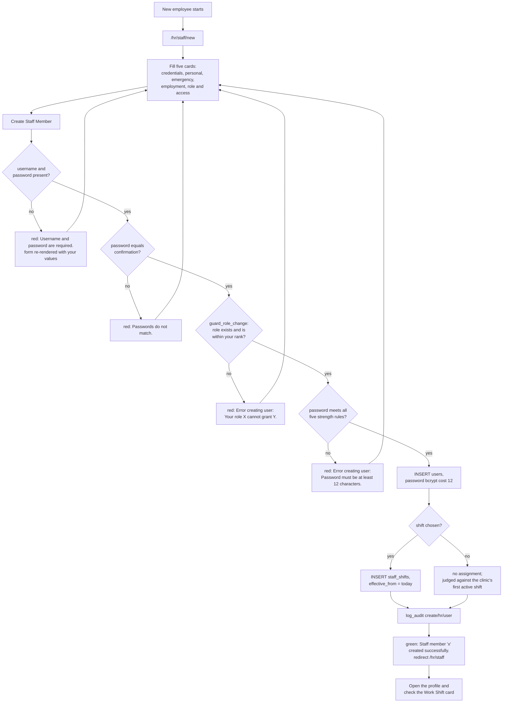

Source: `blueprints/hr/routes.py:581-639`

---

## Workflow 2 — Put an employee on a shift

### 2.1 Who, when, why

**Who.** `super_admin`, `clinic_owner`, `hr` (the route also names `branch_manager` and
`support_admin`, who are stopped by the grant).

**When.** On the day someone is hired, and again whenever they move between the morning,
evening or night rota.

**Why this is the most consequential two-click action in the chapter.** `staff_shifts` is
the only table that answers "what time is this person supposed to be here?", and four
separate calculations read it:

| Reads `staff_shifts` | To decide |
|---|---|
| `status_for_checkin()` | whether an arrival is **Present** or **Late**, and by how many minutes |
| `close_forgotten_checkouts()` | what time to close a record nobody clocked out of, and therefore how many hours to pay |
| `working_weekdays()` / `_business_days()` | which days of the week count, so how many days a leave request costs and how many working days the month had |
| `_get_attendance_summary()` | the standard hours a day is measured against, so how much of a long day becomes payable overtime |

An unrostered employee gets the clinic's **first active shift by id** for all four — on a
seeded database that is Morning Shift, 08:00–16:00, 60-minute break, Sun–Thu. A night nurse
left unrostered is judged against an 08:00 start.

Source: `blueprints/attendance/routes.py:86-126, 148-169, 172-227, 247-302`;
`blueprints/payroll/routes.py:171-190`

### 2.2 Preconditions

* At least one active shift exists. If the roster screen shows *"No shifts configured / لا
  توجد مناوبات معرّفة"* go to `/attendance/shifts` first (Workflow 12, §12.3).
* You know which shift, and from which date.

### 2.3 Happy path — the assign form on the staff profile

1. Open `/hr/staff/<user_id>`. In the left column, under the profile card, is the
   **Work Shift / المناوبة** card.
2. If they already have one, the card shows the shift name in bold, `08:00 – 16:00`,
   `· From 2026-08-01` and the raw stored day list — literally `0,1,2,3,4`, not day names.
   If they do not, it reads *"No shift assigned. / لا توجد مناوبة معينة."*
   Source: `templates/hr/staff_detail.html:133-146`
3. Under that sits the form:
   * a dropdown whose first option is **`— Remove Shift —`** (English in both languages —
     §0.4 leak 3), then every active shift as `Morning Shift (08:00–16:00)`. The
     employee's current shift is preselected.
   * a bare `<input type="date">` for **effective from**. It carries a `placeholder`
     attribute of `Effective from / ساري من`, which a date input does not display, so the
     box appears unlabelled.
   * **Update Shift / تحديث المناوبة**.
   Source: `templates/hr/staff_detail.html:148-161`
4. Press it. The POST goes to `/hr/staff/<user_id>/assign-shift` and runs `_set_shift()`,
   which does exactly two statements:
   * `UPDATE staff_shifts SET effective_to = <the new effective_from> WHERE user_id=? AND
     (effective_to IS NULL OR effective_to >= today)` — the old assignment is **closed**,
     not deleted, so history survives;
   * `INSERT INTO staff_shifts(user_id, shift_id, effective_from, effective_to)` for the
     new one.
   Source: `blueprints/hr/routes.py:894-929`
5. Green flash **"Shift assigned successfully."**, back on the profile. The Work Shift card
   now shows the new shift.

### 2.4 Every alternative scenario

**A. Assigning from the Edit Staff form instead.** `/hr/staff/<id>/edit` carries the same
**Work Shift / المناوبة** dropdown and routes it through the same `_set_shift()`. The route
acts on the field **only when the form actually carried it** (`if "shift_id" in
request.form`) — present-but-empty means a deliberate *— No Shift —*, absent means the
submission was not about shifts and the assignment must not be touched.
Source: `blueprints/hr/routes.py:828-830`

**B. Removing a shift.** Pick `— Remove Shift —` and press **Update Shift**. `_set_shift`
closes the running assignment with `effective_to = today` and inserts nothing. Blue flash
**"Shift removed from staff member."** From that day the person falls back to the clinic's
first active shift for every calculation.

**C. Leaving *effective from* blank.** It defaults to today. This is the normal case.

**D. Back-dating.** Type an earlier date and the new row starts then, while the old row is
closed on that same date. Attendance already written for the intervening days is **not**
recalculated — `attendance_records` stores `status` and `hours_worked` as computed at the
time and no job rewrites them. Correct affected days by hand (Workflow 4).

**E. Forward-dating.** Type a future date. The new row exists immediately but
`default_shift()` filters on `effective_from <= on_date`, so it does not take effect until
that date. Careful: `working_weekdays()` and payroll's shift lookup **do not** filter on
`effective_from` — only on `effective_to` — so a future-dated assignment changes the leave
day-count and the payroll standard hours straight away while lateness still uses the old
one. See KL-14.
Source: `blueprints/attendance/routes.py:109-112` versus `:260-265`;
`blueprints/payroll/routes.py:171-178`

**F. There is no *effective to* box.** The route reads `request.form.get("effective_to")`
and the template never renders such a field, so it is always `None`. A time-boxed
assignment cannot be created from the UI. See KL-15.
Source: `blueprints/hr/routes.py:922-923` versus `templates/hr/staff_detail.html:148-161`

**G. Assigning at hire time.** The New Staff form's **Work Shift** dropdown does the same
thing with a plain INSERT (no closing UPDATE, because there is nothing to close) and
`effective_from = today`.
Source: `blueprints/hr/routes.py:607-618`

**H. Seeing who is on what.** `/attendance/shifts` has an **On This Shift / على هذه
المناوبة** column listing every active employee whose assignment covers today, each a link
to their profile, with a **Weekly roster → / جدول المناوبات الأسبوعي ←** link underneath.
Source: `blueprints/attendance/routes.py:892-900`; `templates/attendance/shifts.html:43-57`

### 2.5 Errors and edge cases — exact messages

| What you did | What the app does | Exact message |
|---|---|---|
| Chose a shift and pressed Update Shift | Old assignment closed, new one inserted | `Shift assigned successfully.` (green) |
| Chose `— Remove Shift —` | Old assignment closed with today's date | `Shift removed from staff member.` (blue) |
| Posted a `shift_id` that does not exist | The INSERT still runs; the row points at nothing | no error — the Work Shift card silently shows nothing, because the card's query INNER JOINs `shifts` |
| Assigned a shift twice in one day | The first row is closed with today's date and a second is inserted from today | `Shift assigned successfully.` (green) — you now have a zero-length row in the history |
| Opened `/hr/staff/<id>/assign-shift` in the address bar | HTTP 405, the route is POST only | — |

Source: `blueprints/hr/routes.py:916-929`; `templates/hr/staff_detail.html:660-667`

Further edge cases:

* **Nothing validates the shift's own times.** `/attendance/shifts` will save a shift whose
  end is before its start and whose break is negative; the form's `min="0"` is browser-side
  only. A negative break **adds** hours to every record measured against that shift. See
  KL-16.
  Source: `blueprints/attendance/routes.py:907-941`
* **Two employees on the same shift are independent.** `staff_shifts` has no unique
  constraint and no capacity limit; a shift can hold the whole clinic.
* **Assignments are per person, not per branch.** `staff_shifts` carries no `branch_id`.

### 2.6 What gets written, and what changes elsewhere

**Written:** one `UPDATE staff_shifts` closing the running row · one `INSERT INTO
staff_shifts`. No audit row — unlike staff create and staff edit, the assign route does
**not** call `db.log_audit`.

**Screens that change immediately:**

* `/hr/staff/<id>` — the Work Shift card.
* `/hr/roster` — the person moves into that shift's row for any week the assignment overlaps.
* `/hr/dashboard` — **No Shift Assigned / بدون مناوبة** falls.
* `/attendance/shifts` — the **On This Shift** column.
* `/attendance/records/edit/<id>` — the record header now names the shift and its hours.
* `/payroll/salaries/<id>` — **Shift / المناوبة** in the *Attendance This Period* card.

**Calculations that change from the next event onward:** lateness on the next check-in;
the closing time used by the nightly auto-close; the business-day count on the next leave
request; the standard hours payroll measures against.

### 2.7 Flowchart

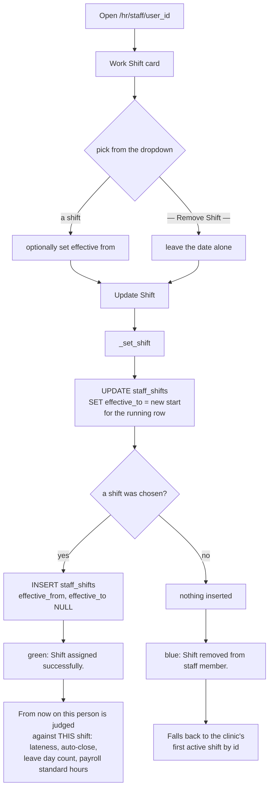

---

## Workflow 3 — The daily clock-in and clock-out

### 3.1 Who, when, why

**Who.** Everybody with the `attendance` grant, for themselves. On the shipped grants that
is every clinical and front-desk role plus the four management roles — but **not**
`finance`, `support_admin` or `auditor`, who have no way into the module at all (§0.2).
Managers (`super_admin`, `clinic_owner`, `branch_manager`, `hr`) additionally get a panel
for recording somebody else's arrival.

**When.** On arrival and on leaving, every working day.

**Why.** `attendance_records.hours_worked` is written **only at check-out**. Nothing else
sets it. Payroll reads exactly that column to decide how much overtime to pay. An employee
who works a full day and forgets to press the second button is worth zero hours to payroll
until the nightly job or a manager fixes it.

Source: `blueprints/attendance/routes.py:458-472`; `blueprints/payroll/routes.py:197-203`

### 3.2 Preconditions

* Signed in, with the `attendance` grant.
* The clock is the **server's** clock: `datetime.now().strftime("%H:%M")`. There is no
  timezone conversion anywhere in this module, so the times recorded are whatever the host
  thinks the local time is. On a Cairo-hosted install that is Cairo time.
  Source: `blueprints/attendance/routes.py:403`

### 3.3 Happy path — checking yourself in

1. Sidebar → **Attendance / الحضور والإجازات**, then **⏱ Check In / Out / ⏱ الدخول /
   الخروج** in the top bar. You are on `/attendance/checkin`. The subtitle shows today's
   date and a live clock (`Current time:`, refreshed by JavaScript every ten seconds).
   Source: `templates/attendance/checkin.html:4, 172-181`
2. The left card, **⏱ My Status Today / ⏱ حالتي اليوم**, shows a yellow dot and
   *"Not checked in / لم يسجل الدخول"*.
3. Optionally type into **Notes (optional) / ملاحظات (اختياري)** — placeholder
   *"e.g. Working from home / مثال: العمل من المنزل"*.
4. Press **✅ Check In Now / ✅ تسجيل الدخول الآن**.
5. The route reads the server clock, resolves **your own shift** for today through
   `staff_shifts`, and compares:
   `late_by = arrival − shift start − 15 minutes` (the grace, `ATTENDANCE_GRACE_MINUTES`).
   On a shift that crosses midnight the comparison wraps, so clocking in at 00:10 on a
   22:00 shift is ten past midnight on a shift that began two hours ago, not fourteen hours
   early.
   Source: `blueprints/attendance/routes.py:148-169`
6. An `attendance_records` row is inserted with `user_id`, `username`, `full_name`,
   `work_date`, `check_in` as `"HH:MM"`, `status` as `Present` or `Late`, your note, and
   `recorded_by` = your own username.
7. Flash:
   * on time → green **"Check-in recorded successfully."**
   * late → amber **"Checked in at 08:47 — 32 minutes after the shift start (grace 15
     min)."** Said plainly at the moment it happens, rather than discovered as a payroll
     deduction at the end of the month.
8. The card turns green: **Checked In / تم الوصول**, `Since 08:47`.

### 3.4 Happy path — checking yourself out

1. Return to `/attendance/checkin` at the end of the day.
2. The card offers **Break Time (minutes) / وقت الاستراحة (دقائق)**, a number box that
   ships with **`0` already in it**, and **🔴 Check Out Now / 🔴 تسجيل الخروج الآن**.
3. Press it. The route:
   * refuses if there is no check-in today, or if you already checked out;
   * computes `hours = (now − check_in) − break`, wrapping past midnight **only** if your
     shift genuinely crosses midnight;
   * `UPDATE attendance_records SET check_out, break_minutes, hours_worked`.
   Source: `blueprints/attendance/routes.py:458-472`, `:58-83`
4. Green flash **"Check-out recorded. Hours worked: 7.0h"** — one decimal place.
5. The card turns to **Day Complete / اليوم مكتمل** with three tiles: **Check In / تسجيل
   وصول**, **Check Out / الخروج** and **Hours Worked / ساعات العمل** in large green type.

> **The break box matters and it defaults to zero.** The route falls back to the shift's
> own unpaid break only when the browser sends nothing at all; both check-out forms ship
> `value="0"`, which is a digit, so an untouched form records a **zero-minute** break. On
> an 08:00–16:00 shift with a 60-minute break that stores 8.0 hours against a payroll
> standard of 7.0 — an hour of invented overtime for every hand-clocked day. Type the real
> break, or correct the day afterwards. See KL-3.
> Source: `blueprints/attendance/routes.py:425-428`; `templates/attendance/checkin.html:49, 105`

### 3.5 Happy path — a manager clocking somebody else

1. On the same screen, managers get a second panel: **👥 Record Attendance for Staff /
   👥 تسجيل حضور الموظفين**.
2. Five controls in a row: **Staff Member / الموظف** (every active user, shown as
   `Mona Ibrahim (nurse)`), **Action / الإجراء** (`Check In / تسجيل وصول` or
   `Check Out / الخروج`), **Break (min) / الاستراحة (دقيقة)** (again defaulting to `0`),
   **Notes / ملاحظات**, and the **Record / تسجيل** button.
3. It posts to the same route with a different `user_id`. Non-managers who forge a
   `user_id` are stopped server-side with red **"Access denied."** — the GET only renders
   the picker for managers, but the POST checks as well, because `hours_worked` is what
   payroll pays overtime on.
   Source: `blueprints/attendance/routes.py:406-415`
4. Below it, **📋 All Staff — Today / 📋 جميع الموظفين — اليوم** lists every record for
   today with **Staff / Check In / Check Out / Break / Hours / Status** and an **Edit /
   تعديل** button per row leading to Workflow 4.

### 3.6 Every alternative scenario

**A. Pressing Check In twice.** The route looks for any record for you today before
inserting. Amber **"Already checked in today."** and nothing is written.

**B. Pressing Check Out twice.** Amber **"Already checked out."** The first check-out
stands; the second is ignored. There is no "re-open the day" button — a manager has to edit
the record.

**C. Checking out without ever checking in.** Red **"No check-in record found for today."**

**D. Working past midnight on a night shift.** The check-out is recorded against the
**work_date the check-in was written under**, because the route looks up
`WHERE user_id=? AND work_date=?` with *today's* date. A night nurse who clocks in at 22:00
on the 12th and tries to clock out at 06:00 on the 13th finds no record for the 13th and
gets **"No check-in record found for today."** Her 12th stays open until the nightly job
closes it (Workflow 5). This is the one flow the check-in screen does not handle. See KL-4.
Source: `blueprints/attendance/routes.py:402, 430-432, 458-460`

**E. A day worker's clock-out lands before their clock-in.** `_calc_hours` refuses to
guess: unless the employee's shift genuinely crosses midnight, a backwards pair returns
**0.0** hours rather than wrapping to twenty-two. The record still saves — with zero hours
— and the flash reads **"Check-out recorded. Hours worked: 0.0h"**. Fix it on the edit
screen, which refuses the same ordering outright with a message that says why.
Source: `blueprints/attendance/routes.py:78-83`

**F. Arriving inside the grace window.** 08:14 on an 08:00 shift is **Present** with no
late minutes. 08:16 is **Late** by 1. The window is 15 minutes unless
`ATTENDANCE_GRACE_MINUTES` is set in the environment.

**G. An employee with no shift assignment.** Judged against the clinic's first active
shift by id. On a seeded database that is Morning 08:00, so an evening receptionist
clocking in at 14:00 is **Late by 345 minutes**, every day. Roster them (Workflow 2).

**H. A `finance` user.** Cannot open `/attendance/` at all — no grant. There is no way for
them to record their own hours, and no way for them to be paid overtime that depends on
hours. A manager must record their days from the HR modal (Workflow 4, route B).

**I. Arabic UI.** Both panels are fully bilingual. The `Since 08:47` line on the green card
and the `records` word in the manager panel's subtitle are English-only.

**J. Two stored time formats.** Rows written by this screen are `"08:47"`. Seeded and
imported rows carry a full timestamp `"2026-08-12 09:27:00"`. Everything that calculates
goes through `hhmm()`, which reads both. Two screens print the raw column instead — the HR
attendance board and its results table — so imported rows show the whole timestamp there.
See KL-5.
Source: `blueprints/attendance/routes.py:19-55`; `templates/hr/hr_attendance.html:128-131, 274-283`

### 3.7 Errors and edge cases — exact messages

| What you did | What the app does | Exact message |
|---|---|---|
| Checked in normally | Row inserted, `status='Present'` | `Check-in recorded successfully.` (green) |
| Checked in after the grace window | Row inserted, `status='Late'` | `Checked in at 08:47 — 32 minutes after the shift start (grace 15 min).` (amber) |
| Checked in twice | Nothing written | `Already checked in today.` (amber) |
| Checked out normally | `check_out`, `break_minutes`, `hours_worked` written | `Check-out recorded. Hours worked: 7.0h` (green) |
| Checked out with no check-in | Nothing written | `No check-in record found for today.` (red) |
| Checked out twice | Nothing written | `Already checked out.` (amber) |
| Posted somebody else's `user_id` without being a manager | Nothing written | `Access denied.` (red) |
| Typed a non-numeric break | Falls back to the **shift's** break, not to zero | no error |
| Typed a negative break | `str("-30").isdigit()` is False, so it also falls back to the shift's break | no error |

Source: `blueprints/attendance/routes.py:412-472`

### 3.8 What gets written, and what changes elsewhere

**Written on check-in:** one `attendance_records` row — `user_id`, `username`, `full_name`,
`work_date`, `check_in`, `status`, `notes`, `recorded_by`. `hours_worked` stays NULL.

**Written on check-out:** `check_out`, `break_minutes`, `hours_worked`, `updated_at` on
that same row. No audit row is written by either — `blueprints/attendance/routes.py`
imports nothing from the audit layer.

**Screens that change immediately:**

* `/attendance/` — **Present / حاضر**, **Checked In / تم الوصول** (records with a check-in
  and no check-out), and **Today's Attendance / حضور اليوم**.
* `/attendance/records` — a new row in the default last-30-days range, and the **Total
  Hours** tile.
* `/hr/attendance` — the live board card flips from *No record / لا يوجد سجل* to a
  green **Present** or amber **Late** card, and the range summary tiles move.
* `/hr/dashboard` — **Present Today / الحاضرون اليوم** and its `late` sub-line.
* `/hr/roster` — this person's chip for today turns green or amber.
* `/hr/staff/<id>` — **Attendance This Month / حضور هذا الشهر**.
* `/payroll/salaries/<id>` and `/payroll/api/attendance/...` — for the month containing
  this date, `present_days`, `late_count` and `overtime_hours` all move. On a payslip
  already generated nothing changes until somebody edits or regenerates it.

### 3.9 Flowchart

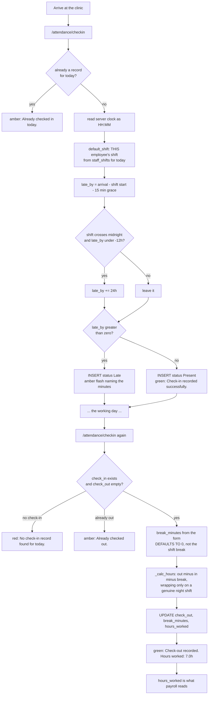

---

## Workflow 4 — A manager corrects an attendance record

### 4.1 Who, when, why

**Who.** Only `_allowed_manager` — `super_admin`, `clinic_owner`, `branch_manager`, `hr`.
Everyone else gets red **"Access denied."** and a bounce to the records list.

**When.** Somebody forgot to clock out, arrived before the system was reachable, worked a
day that was recorded against the wrong times, or needs marking absent or on leave.

**Why.** Two of the four columns on this form are money: `hours_worked` is what payroll
turns into overtime, and `status='Absent'` is what payroll turns into a salary deduction.
Nothing else in the system writes `Absent`.

Source: `blueprints/attendance/routes.py:563-620`; `blueprints/payroll/routes.py:192-203, 609-611`

### 4.2 There are two correction screens, and they are not the same

| | **Edit Attendance Record** | **Log Attendance (HR)** |
|---|---|---|
| URL | `GET\|POST /attendance/records/edit/<rec_id>` | `POST /hr/attendance/add` (modal on `/hr/attendance`) |
| Reached from | the **Edit / تعديل** button on any record row | the **+ Log Attendance / تسجيل حضور** button in the HR attendance top bar |
| Works on | one existing row | a person **and a date** — creates the row if it is missing |
| Status options | `Present, Late, Absent, Leave, Holiday` | `Present / حاضر`, `Late / متأخر`, `Absent / غائب`, `On Leave / في إجازة` |
| Break | typed by you, prefilled from the row | never asked — always taken from the shift |
| Hours | recomputed from your times and your break | recomputed from the times and the **shift's** break |
| Backwards times on a day shift | **refused with a message** | accepted; `_calc_hours` returns 0.0 |
| Concurrent-edit guard | yes | no |
| Deletes | no | yes, the ✕ on every row of the results table |

**They write different status strings for the same idea.** The edit screen's `Leave` and
the HR modal's `On Leave` are two different values in one column. The HR summary tiles
count `On Leave`; the monthly report counts `Leave`; the records list renders a badge for
both. Pick one and keep to it — see KL-6.
Source: `templates/attendance/record_edit.html:54`; `templates/hr/hr_attendance.html:347-352`;
`blueprints/hr/routes.py:1578-1583`; `blueprints/attendance/routes.py:1112-1115`

### 4.3 Happy path — route A: the edit screen

1. Find the day. Either `/attendance/records` (filter by **From / من**, **To / إلى**,
   **Staff / الموظف**, **Status / الحالة**) or the **All Staff — Today** table on the
   check-in screen. Press **Edit / تعديل**.
2. You are on `/attendance/records/edit/<rec_id>`. The header card names the employee
   (linked to their HR profile if you can open it), the work date, and **the shift the
   record belongs to**, resolved through `staff_shifts` for that date and linked to
   `/attendance/shifts` — e.g. `Night Shift (22:00–06:00)`. If they were unrostered it
   reads *"No shift assigned / لا توجد مناوبة مسندة"*.
   Source: `blueprints/attendance/routes.py:627-633`; `templates/attendance/record_edit.html:16-28`
3. Four inputs:
   * **Check In Time / وقت الدخول** and **Check Out Time / وقت الخروج** — `<input
     type="time">`, prefilled through `hhmm()` so a stored full timestamp still renders
     (a raw timestamp bound to a time input renders **empty**, which is what used to make
     opening a seeded record look like it wiped the times);
   * **Break (minutes) / الاستراحة (دقائق)** — `min="0" max="480"`;
   * **Status / الحالة** — the five-value dropdown, rendered in English in both languages.
   * **Notes / ملاحظات**.
   Source: `blueprints/attendance/routes.py:639-644`; `templates/attendance/record_edit.html:36-63`
4. A hidden `_seen_updated_at` carries the row's `updated_at` as it was when you opened the
   page.
5. Press **Save Changes / حفظ التغييرات**. The route, in order:
   * `concurrency.guard()` — if the row moved since you loaded it, nothing is written;
   * resolves the employee's shift **for that work date** and asks whether it crosses
     midnight;
   * refuses a check-out before a check-in on a shift that does **not** cross midnight;
   * `hours = _calc_hours(in, out, break, overnight)` — or `0` if either time is blank;
   * `UPDATE attendance_records SET check_in, check_out, status, break_minutes,
     hours_worked, notes, updated_at`.
   Source: `blueprints/attendance/routes.py:578-620`
6. Green flash **"Attendance record updated."** and you land back on
   `/attendance/records`.

### 4.4 Happy path — route B: the HR modal

1. Open `/hr/attendance`. The top of the page is a live board of today, then six summary
   tiles for whatever range is filtered, then the search bar, then the paginated results.
2. Press **+ Log Attendance / تسجيل حضور**. The modal **Log Attendance Record / تسجيل سجل
   حضور** opens with six fields: **Staff Member / الموظف \***, **Date / التاريخ \***
   (today), **Status / الحالة \***, **Check In / الدخول**, **Check Out / الخروج**,
   **Notes / ملاحظات**.
3. Press **Save Record / حفظ السجل**. The route reads any existing row for that person and
   date first, then:
   * **times you left blank do not erase what is stored** — `check_in = check_in or
     existing["check_in"]`. A status-only correction keeps the clock;
   * hours are recomputed **only if both times parse** through `hhmm()`, using the
     attendance module's own `_calc_hours` with the **shift's** break and the shift's
     overnight flag — not a second implementation;
   * UPDATE if the row existed, INSERT if it did not. `attendance_records` carries no
     `UNIQUE(user_id, work_date)`, so a read-then-write is the only correct pattern here.
   * `recorded_by` is set to **your** username.
   Source: `blueprints/hr/routes.py:1656-1726`
4. Green flash **"Attendance record saved."**, back on `/hr/attendance`.

### 4.5 Every alternative scenario

**A. Two managers edit the same day.** The second Save is refused. Red flash naming the
other person and when they touched it: **"Youssef Kamal changed this while you had it open
(2026-08-19 14:12). Your changes were NOT saved. Reopen it and apply them again so nothing
of theirs is lost."** You are sent back to the same edit screen, freshly loaded. If the row
was deleted meanwhile: **"That record no longer exists — somebody deleted it while you had
it open."**
Source: `models/concurrency.py:72-96`; `blueprints/attendance/routes.py:587-593`

**B. Correcting a night shift.** Enter `22:00` and `06:00`. Because the employee's shift
crosses midnight, `_calc_hours` wraps and stores 7.0 hours (8 hours minus the 60-minute
break you typed). The same pair on a **day**-shift employee is refused.

**C. A day-shift typo — 17:00 corrected to 07:00.** Red flash **"Check-out is before
check-in. This employee is not on a night shift, so one of the two times is wrong."**
Nothing is written and you are returned to the edit screen. This is deliberate: guessing
"night shift" here used to store 21.98 hours, which payroll paid fourteen hours of overtime
on.
Source: `blueprints/attendance/routes.py:598-607`

**D. Marking somebody absent.** Either screen. This is the **only** thing that produces a
payroll absence deduction — an employee who simply never clocked in has no row at all, and
a missing row costs nothing. See KL-7.

**E. Clearing both times.** Legitimate on an `Absent` or `Leave` day. `hours_worked` is set
to `0`, not left alone.

**F. Deleting a record.** Only from `/hr/attendance` — the red ✕ at the end of each results
row, behind the confirm *"Delete this attendance record? / حذف سجل الحضور هذا؟"*. Blue
flash **"Record deleted."** There is no undo and no audit row. Restricted to
`super_admin`, `clinic_owner`, `branch_manager`, `hr`.
Source: `blueprints/hr/routes.py:1735-1743`

**G. Editing a record the system wrote.** Rows closed by the nightly job carry
`recorded_by='system'` and a note ending `[auto-closed at shift end 16:00; no check-out was
recorded]`. Editing them replaces the times and hours but **leaves the note and
`recorded_by` alone** on the edit screen — the note box is prefilled with the existing text
and saved back verbatim, so the audit trail survives unless you delete the sentence
yourself. The HR modal, by contrast, overwrites `recorded_by` with your username and
`notes` with whatever the modal's Notes box held, which is empty by default.
Source: `blueprints/attendance/routes.py:611-616` versus `blueprints/hr/routes.py:1709-1724`

**H. Editing your own record.** Nothing stops a manager editing their own day. `recorded_by`
is not updated by the edit screen, so a record that still says `mona.nurse` can carry hours
a manager typed. No audit row is written either.

**I. Searching for the day.** `/hr/attendance` searches `full_name` and `username` with a
case-insensitive `LIKE`, filters by status, branch, staff member and date range, and pages
at 50 rows. The default range is the last seven days. The six tiles and the row count are
computed in SQL over the **whole** filtered set, not just the page.
Source: `blueprints/hr/routes.py:1534-1586`

### 4.6 Errors and edge cases — exact messages

| What you did | What the app does | Exact message |
|---|---|---|
| Saved a valid correction | Row updated | `Attendance record updated.` (green) |
| Opened an edit URL for a missing id | Redirect to the records list | `Record not found.` (red) |
| Not a manager, opened the edit URL | Redirect to the records list | `Access denied.` (red) |
| Day-shift check-out before check-in | Nothing written | `Check-out is before check-in. This employee is not on a night shift, so one of the two times is wrong.` (red) |
| Somebody else saved first | Nothing written | `<Name> changed this while you had it open (<when>). Your changes were NOT saved. Reopen it and apply them again so nothing of theirs is lost.` (red) |
| The row was deleted while open | Nothing written | `That record no longer exists — somebody deleted it while you had it open.` (red) |
| HR modal with no staff member picked | Nothing written | `Select a staff member.` (red) |
| HR modal saved | Row inserted or updated | `Attendance record saved.` (green) |
| HR modal raised anything at all | Rolled back | `Error: <the exception text>` (red) |
| Deleted a record | Row gone, no undo | `Record deleted.` (blue) |

Source: `blueprints/attendance/routes.py:568-620`; `blueprints/hr/routes.py:1652-1732, 1742`

Further edge cases:

* **The edit screen writes no audit row and does not stamp who edited.** A record can be
  changed from 8 hours to 11 and still say `recorded_by: mona.nurse`. HR's own routes call
  `db.log_audit` for comparable edits; this one does not.
* **`break_minutes` is bounded by the browser only** (`min="0" max="480"`). A crafted POST
  with a large break stores 0.0 hours; a negative one **adds** to the total.
* **The status you pick is not cross-checked against anything.** Marking a day `Present`
  while an approved leave request covers it is accepted, and the roster will show the leave
  chip while the record says Present.

### 4.7 What gets written, and what changes elsewhere

**Written (route A):** `check_in`, `check_out`, `status`, `break_minutes`, `hours_worked`,
`notes`, `updated_at` on one `attendance_records` row.
**Written (route B):** the same columns plus `recorded_by`, or a whole new row.

**Screens that change immediately:** `/attendance/records` and its four tiles ·
`/attendance/report` for that month · `/attendance/` if the date is today · `/hr/attendance`
live board and summary · `/hr/dashboard` present/late counts if today · `/hr/roster` chip
colour · `/hr/staff/<id>` **Attendance This Month** · the Excel export ·
`/payroll/api/attendance/...` and the **Attendance This Period** card on every payslip for
that month.

**What does not change:** any salary row already generated. `salaries.overtime_hours` and
`salaries.absence_deduction` are snapshots taken when the record was created. Correcting
attendance after payroll has run requires editing the salary too (Workflow 11, §11.5 D).

### 4.8 Flowchart

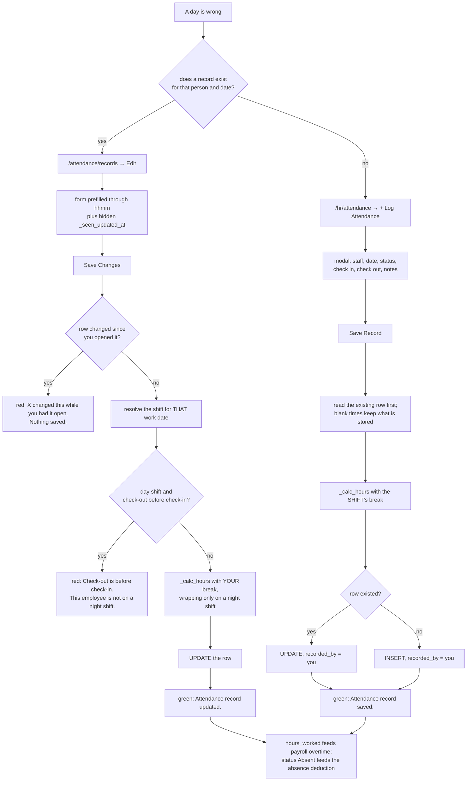

---

## Workflow 5 — The nightly auto-close of forgotten check-outs

### 5.1 Who, when, why

**Who.** Nobody. This is a scheduled job, not a screen. There is no button anywhere in the
UI that triggers it and no page that reports what it did.

**When.** **00:20 every night**, on an APScheduler cron trigger registered in `app.py`,
running once **per clinic** in a multi-tenant install.

**Why.** `hours_worked` is written only at check-out. An employee who works a full day and
forgets the second button is worth zero hours, and payroll reads exactly that column. The
dashboard counted open records; nothing acted on the count. Paying an estimate is fairer
than paying zero — as long as the estimate is identifiable afterwards, which is why every
row it touches says so.

Source: `app.py:805-825`; `blueprints/attendance/routes.py:172-227`

### 5.2 What it actually does

1. It targets **yesterday** — `date.today() - 1 day` — because a record found open at 03:00
   does not represent somebody working through the night.
2. It selects every `attendance_records` row for that date with a check-in and no
   check-out:
   ```sql
   SELECT id, user_id, check_in, break_minutes FROM attendance_records
   WHERE work_date=? AND check_in IS NOT NULL AND check_in <> ''
     AND (check_out IS NULL OR check_out = '')
   ```
3. **For each row separately**, it resolves *that employee's own* shift for *that date*
   through `staff_shifts`.
4. The break is `the row's own break_minutes, or failing that the shift's break, or 0`.
5. The closing time is **the shift's end**, with one guard: on a shift that does **not**
   cross midnight, an employee who arrived *after* the shift ended is closed at their own
   arrival time, so the record ends with zero hours instead of a negative day. That guard
   is deliberately skipped for a shift that does cross midnight, because on a 22:00–06:00
   night the check-in is always "after" the end by clock arithmetic.
6. `hours = _calc_hours(check_in, end, break, overnight = shift crosses midnight)`.
7. It writes, per row:
   ```sql
   UPDATE attendance_records
      SET check_out=?, hours_worked=?, break_minutes=?,
          recorded_by='system',
          notes = TRIM(COALESCE(notes,'') || ' [auto-closed at shift end 16:00; no check-out was recorded]'),
          updated_at=datetime('now','localtime')
   ```
8. It commits once, returns the count, and the app logs
   `attendance (default): auto-closed 3 forgotten check-out(s)` at INFO.

### 5.3 What it looks like the next morning

There is no notification, no flash and no dashboard tile. You find it by looking at the
record:

* **Check Out / الخروج** shows the shift's end time, not a real departure.
* **Hours / الساعات** is populated where it was `0.0h`.
* **Recorded By / سجّله** reads `system` on `/hr/attendance`.
* **Notes / ملاحظات** ends with `[auto-closed at shift end 16:00; no check-out was
  recorded]`.

The fastest way to review a month's worth: `/hr/attendance`, set the date range, and read
the **Recorded By** column. It is the only column that distinguishes reconstructed hours
from observed ones.
Source: `templates/hr/hr_attendance.html:303`

### 5.4 Every alternative scenario

**A. A morning employee who forgot to clock out.** Clocked in 08:03 on a Morning Shift
(08:00–16:00, 60-minute break). Closed at 16:00 with 6.95 hours and the note.

**B. A night nurse.** Clocked in 22:00 on the Night Shift (22:00–06:00). The wrap applies,
so she is closed at 06:00 with 7.0 hours — not 16:00 with a negative day, and not zero.

**C. Somebody who arrived after their shift had already ended.** Day shift 08:00–16:00,
clocked in 17:30. The guard fires: `check_out` is set to `17:30`, hours 0.0. The record is
closed and visibly wrong, which is the intent — it is a day for a manager to look at, not a
day to pay.

**D. An unrostered employee.** Falls back to the clinic's first active shift by id — on a
seeded database Morning 08:00–16:00 — so a night worker's record is closed at 16:00,
which the guard then rewrites to their 22:00 arrival, giving 0.0 hours. Roster people
(Workflow 2). This is the same fallback that makes them permanently Late.

**E. A record left open for several days.** The job only ever looks at **yesterday**. A
record from last Tuesday that nobody noticed is never touched. Close it by hand
(Workflow 4).

**F. The scheduler is not running.** In development, or with the scheduler disabled, the
job never fires and open records stay open forever. Nothing on any screen says the job did
not run. `/attendance/` **Checked In / تم الوصول** counts records with a check-in and no
check-out for **today** only, so a stale open record from last week does not show up there
either.

**G. It ran, and then the employee's shift changed.** The hours already written stand. The
job does not revisit closed rows.

**H. Someone edits an auto-closed row afterwards.** The edit screen prefills the note, so
the `[auto-closed …]` sentence survives unless it is deleted by hand. The HR modal
overwrites both `notes` and `recorded_by` — a status-only correction through the modal
therefore erases the evidence that the hours were reconstructed. See KL-8.

### 5.5 Errors and edge cases

| Situation | What happens |
|---|---|
| No open records yesterday | The job does nothing, commits nothing, and logs nothing |
| A row whose `check_in` is unreadable | `hhmm()` returns `""`, `_minutes()` returns 0, and `_calc_hours` returns 0.0 — the row is still closed, with zero hours |
| The shift's `break_minutes` is negative | The break is *added*: an eight-hour day with a −60 break stores 9.0 hours. Nothing validates it (KL-16) |
| A shift whose end equals its start | `shift_crosses_midnight` is true (`end <= start`), so it wraps to 24 hours minus the break |
| The job raises on one clinic | `_for_every_clinic` handles each tenant separately; the connection is closed in a `finally` |
| Rerunning it manually for an older date | Possible only from a Python shell: `close_forgotten_checkouts(conn, "2026-08-12")`. No route exposes it |

Source: `blueprints/attendance/routes.py:19-55, 189-227`; `app.py:812-825`

### 5.6 What gets written

Per closed row: `check_out`, `hours_worked`, `break_minutes`, `recorded_by='system'`, an
appended `notes` sentence, and `updated_at` stamped with `datetime('now','localtime')`.
No audit row, no notification, no flash.

**What changes elsewhere.** Every hours-based figure for that date moves overnight: the
**Total Hours** tile on `/attendance/records`, the per-person **Total Hrs** on
`/attendance/report`, **Avg Hours / متوسط الساعات** on `/hr/attendance`, **Hours** on
`/hr/staff/<id>`, and — the one that matters — `overtime_hours` in
`_get_attendance_summary`, which is what **Bulk Generate** turns into money.

### 5.7 Flowchart

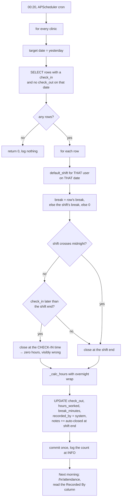
---

## Workflow 6 — Request leave

### 6.1 Who, when, why

**Who.** Anybody with the `attendance` grant, **for themselves only**. There is no "raise a
request on behalf of" — `leave_new` hardcodes `user["id"]` from the session. A manager who
needs to book leave for somebody who cannot reach the system has to sign in as them, or set
the balance by hand and mark the days on the attendance record.

**When.** Before the days off, ideally. Nothing enforces notice: `leave_types` carries
`min_notice_days` and `max_consecutive` columns and **no code reads either**.

**Why.** An approved request is what makes those days show as **Leave / إجازة** on the
roster, what the monthly report lists, and what draws down the allowance. It does **not**
create attendance rows and does **not** stop payroll counting the days.

Source: `blueprints/attendance/routes.py:686-773`; `models/database.py:2033-2034`

### 6.2 Preconditions

* Leave types exist and are active. Five are seeded: **Annual Leave / إجازة سنوية** (21
  days, paid), **Sick Leave / إجازة مرضية** (14, paid), **Emergency Leave / إجازة طارئة**
  (3, paid), **Maternity Leave / إجازة أمومة** (90, paid), **Unpaid Leave / إجازة بدون
  راتب** (30, unpaid).
  Source: `models/database.py:2688-2696`
* Public holidays for the period are entered if you want them excluded from the day count
  (Workflow 8, §8.6). Nothing warns you if they are missing.
* Ideally, the requester is rostered — the day count is measured against **their** shift's
  working week.

### 6.3 Happy path

1. Sidebar → **Attendance / الحضور والإجازات**, then **📋 Request Leave / 📋 طلب إجازة**
   in the top bar (or **+ New Request / + طلب جديد** from `/attendance/leaves`). You are on
   `/attendance/leaves/new`.
2. The screen is two columns. On the left, **📋 Leave Application / 📋 نموذج طلب الإجازة**:
   * **Leave Type / نوع الإجازة \*** — first option `— Select leave type — / — اختر نوع
     الإجازة —`, then each active type rendered as `Annual Leave (Paid)`. The `(Paid)` /
     `(Unpaid)` suffix is English in both languages.
   * **Start Date / تاريخ البدء \*** and **End Date / تاريخ الانتهاء \*** — both carry
     `min="<today>"`, so the browser will not let you pick a past date. The server does not
     check this.
   * **Reason / السبب** — optional, placeholder *"Briefly describe the reason for your
     leave request... / اذكر باختصار سبب طلب الإجازة..."*.
   Source: `templates/attendance/leave_form.html:17-56`
3. As soon as both dates are set, a blue preview bar appears: **"Approx. 4 business days"**
   followed by *"(business days, excl. weekends & holidays) / (أيام عمل، بدون عطلات نهاية
   الأسبوع والعطلات الرسمية)"*. **This preview is computed in the browser and it uses the
   Monday-to-Friday week.** The number the server stores is computed against the Egyptian
   week and will often differ. See KL-9.
   Source: `templates/attendance/leave_form.html:123-136`
4. On the right, **⚖️ My Balances / ⚖️ أرصدتي** shows a bar per leave type with the type's
   colour, a `Paid / مدفوع` or `Unpaid / بدون أجر` badge, a progress bar, and
   `Used: 3.0d` / `Remaining: 18.0d` — both labels English-only. Selecting a type in the
   dropdown outlines the matching bar.
5. Press **Submit Request / إرسال الطلب**. The route:
   * refuses if the type or either date is missing;
   * refuses if the end date is before the start date;
   * counts the days with `_business_days(start, end, conn, your user id)` — every date in
     the range whose weekday is in **your shift's** `days_of_week` and which is not in
     `public_holidays`;
   * works out `book_year` from the **start date's** year, not from today;
   * creates the balance row for that type and that year if it has never existed, seeded
     with the type's `days_per_year`;
   * compares `remaining − pending` against the days requested and **warns** if short;
   * `INSERT INTO leave_requests (... status='Pending')`;
   * `UPDATE leave_balances SET pending = pending + <days>` for that user, type and year.
   Source: `blueprints/attendance/routes.py:695-756`
6. Green flash **"Leave request submitted for 4 day(s). Awaiting approval."** You land on
   `/attendance/leaves`, where the new row sits under **Pending / قيد الانتظار** with an
   amber badge.

### 6.4 How the day count is actually reached

This is the number the whole workflow turns on, so it is worth being exact.

```
days_requested = count of dates d in [start … end] where
        (d.isoweekday() % 7) is in this employee's shift days_of_week
    and d is not a row in public_holidays
```

* `days_of_week` is read from the shift assigned to **this employee**
  (`staff_shifts JOIN shifts`), falling back to the clinic's first active shift, falling
  back to `{0,1,2,3,4}` = Sunday–Thursday if the column is empty or unparseable.
* The numbering is **Sun=0 … Sat=6**, and `isoweekday() % 7` converts Python's Mon=1…Sun=7
  into it. A stored `7` — which older seeded rows used for Sunday — is folded onto `0` by
  `_day_number`, which is why a stored `7` must never be compared against `weekday()`
  directly.
* Public holidays are matched on the exact date string. `is_recurring` exists in the schema
  and is read by nothing: a holiday entered for 2026 does not apply in 2027.

Source: `blueprints/attendance/routes.py:229-302`; `models/database.py:2082-2088`

**Worked example.** A nurse on the Morning Shift (`0,1,2,3,4`) asks for Sunday 2026-08-16
to Thursday 2026-08-20, with 2026-08-18 entered as a public holiday. The server counts Sun,
Mon, Wed, Thu = **4 days**. The browser preview, counting Monday to Friday, counts Mon,
Tue, Wed, Thu = 4 as well — by coincidence. Ask for Sunday alone and the preview says
**0** while the server stores **1**.

### 6.5 Every alternative scenario

**A. You do not have enough balance.** You get an amber warning — **"Insufficient balance.
Available: 2.0 days."** — and **the request is submitted anyway**. The warning is not a
refusal. The manager approving it sees the balance card on the detail screen and decides.
Approval then drives `remaining` down with a `MAX(0, …)` floor, so it cannot go negative;
it simply stops at zero and the overdrawn days vanish from the arithmetic. See KL-10.
Source: `blueprints/attendance/routes.py:736-753, 841-846`

**B. A leave type nobody has ever used.** `_get_or_create_balance` creates the row on the
spot, seeded with the type's `days_per_year`, so the reservation and the later deduction
land on a real row.

**C. A request in December for days in January.** The reservation is booked against
**January's** year, because approve and reject both settle against the start date's year.
The balance panel on the form and the balance card on the detail screen both show **this
calendar year**, so a December request for January shows a balance that has nothing to do
with the row being reserved. The arithmetic is right; the display is misleading. See KL-11.
Source: `blueprints/attendance/routes.py:724, 759-764, 796-798, 836, 869`

**D. A range that is entirely weekend or holiday.** `days_requested` is **0**. The request
is created, with a green flash reading **"Leave request submitted for 0 day(s). Awaiting
approval."**, and approving it deducts nothing.

**E. End before start.** Red **"End date must be on or after start date."**, nothing
written, and you are redirected back to an **empty** form — everything you typed is gone.

**F. A request that overlaps one you already have.** Nothing checks. Two overlapping
approved requests both deduct, and the roster shows the leave chip once.

**G. Cancelling a request.** There is no cancel or withdraw route. A pending request can
only be **rejected** by a manager, which is what releases the reserved days. A pending
request nobody ever touches keeps its days reserved forever — they sit in `pending`, and
`leave_new` computes availability as `remaining − pending`, so they stay out of reach.

**H. Editing a request.** There is no edit route. Get it rejected and submit a new one.

**I. Attaching a document.** `leave_requests.attachment_name` exists in the schema; no form
posts it and no screen shows it.
Source: `models/database.py:2075`

**J. Arabic UI.** The form labels and the Notes panel are bilingual. The type dropdown's
`(Paid)`/`(Unpaid)` suffix, the `Used:`/`Remaining:` labels, and the preview text
`Approx. N business days` are English in both languages.

### 6.6 Errors and edge cases — exact messages

| What you did | What the app does | Exact message |
|---|---|---|
| Submitted with a type and both dates | Request created, days reserved | `Leave request submitted for 4 day(s). Awaiting approval.` (green) |
| Left the type or either date empty | Nothing written, redirected to an empty form | `Leave type, start and end dates are required.` (red) |
| End date before start date | Nothing written, redirected to an empty form | `End date must be on or after start date.` (red) |
| Asked for more than you have | **Request still created** | `Insufficient balance. Available: 2.0 days.` (amber) |
| Range covers only weekend or holidays | Request created with 0 days | `Leave request submitted for 0 day(s). Awaiting approval.` (green) |
| Opened `/attendance/leaves/<id>` for somebody else's request without being a manager | Redirect to the list | `Access denied.` (red) |
| Opened a request id that does not exist | Redirect to the list | `Request not found.` (red) |

Source: `blueprints/attendance/routes.py:701-756, 788-795`

### 6.7 What gets written, and what changes elsewhere

**Written:** one `leave_requests` row (`status='Pending'`, plus a denormalised copy of
`username`, `full_name` and `leave_type_name`) · possibly one new `leave_balances` row for
that user/type/year · `leave_balances.pending += days_requested`.

**Screens that change immediately:**

* `/attendance/leaves` — a new row and the **Pending / قيد الانتظار** tile.
* `/attendance/` — **My Recent Requests / طلباتي الأخيرة**; for managers, the **⏳ Pending
  Leave Approvals / ⏳ طلبات إجازة بانتظار الاعتماد** table.
* `/hr/dashboard` — **Leave Requests / طلبات الإجازة** tile and the amber alert banner
  linking to `/attendance/leaves?status=Pending`.
* `/attendance/balances` — the **Pending** figure inside the cell, once you open the modal.
* `/attendance/leaves/new` — your own availability drops, because it is `remaining −
  pending`.

**What does not change until approval:** the roster, the monthly report, `used`,
`remaining`, and anything in payroll.

### 6.8 Flowchart

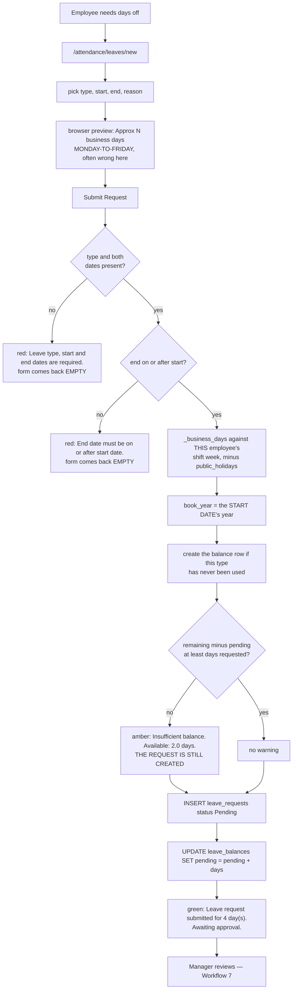

---

## Workflow 7 — Approve or reject a leave request

### 7.1 Who, when, why

**Who.** `_allowed_manager` only: `super_admin`, `clinic_owner`, `branch_manager`, `hr`.

**When.** As soon as it lands. A pending request holds its days in `pending`, and
`pending` is subtracted from availability, so an untouched request quietly blocks the
employee from asking for anything else.

**Why the two buttons are not symmetrical.** Approval moves days from `pending` into
`used` **and** off `remaining`. Rejection only releases `pending`. Approval also creates
the balance row if it is missing; rejection does not.

Source: `blueprints/attendance/routes.py:816-877`

### 7.2 Preconditions

* The request is `Pending`. Both routes are no-ops on anything else, and both buttons are
  only rendered for a pending request.
* Nothing else is required. There is no minimum notice check, no clash check against other
  approved leave, no headcount check against the roster, and no balance check at approval
  time.

### 7.3 Happy path — approving

1. Reach the request. Three ways: the **⏳ Pending Leave Approvals** table on
   `/attendance/`, the **Leave Requests / طلبات الإجازة** list at `/attendance/leaves`
   (filter **Status → Pending**), or the amber banner on `/hr/dashboard`.
2. Press **View / عرض**. You are on `/attendance/leaves/<req_id>`.
3. Read the screen:
   * header — the type name with its colour dot and the word `Leave`, `Submitted
     2026-08-14`, and a large status badge **⏳ Pending / ⏳ قيد الانتظار**;
   * three tiles — **Start Date / تاريخ البدء**, **End Date / تاريخ الانتهاء**, and
     **Business Days / أيام العمل** in the type's colour;
   * **Reason / السبب**, or `No reason provided.` (English only);
   * a line reading *"Not reviewed by anyone yet. / لم تتم مراجعته من أي مسؤول بعد."*;
   * right column — **👤 Staff / 👤 الموظف** with the person's name (linked to their HR
     profile if you can open it), their role, a link **Attendance over these dates → /
     الحضور خلال هذه التواريخ ←** pre-filtered to exactly this range, and a
     **Paid Leave / إجازة مدفوعة** or **Unpaid Leave / إجازة بدون أجر** badge;
   * below it, **⚖️ Balance (2026)** with four English-labelled rows — `Allocated`, `Used`,
     `Pending`, `Remaining` — or *"No balance has been allocated for this leave type. / لم
     يُخصَّص رصيد لهذا النوع من الإجازات."*
   Source: `templates/attendance/leave_detail.html:14-151`
4. Press **✅ Approve / ✅ اعتماد**. The route:
   * checks the request is still `Pending`;
   * `UPDATE leave_requests SET status='Approved', approved_by=<your username>,
     approved_at=datetime('now')`;
   * works out the year from the request's **start date**;
   * creates the balance row for that year if it is missing;
   * `UPDATE leave_balances SET used = used + d, pending = MAX(0, pending − d),
     remaining = MAX(0, remaining − d)`.
   Source: `blueprints/attendance/routes.py:824-848`
5. Green flash **"Leave request approved."** You stay on the detail page. The badge is now
   **✅ Approved / ✅ معتمد** and the footer line reads `Approved by Youssef Kamal on
   2026-08-15` — the name resolved by looking the **username** up in `users`, because
   `leave_requests.approved_by` stores a username, not an id.

### 7.4 Happy path — rejecting

1. Same screen. Press **❌ Reject / ❌ رفض**. The button hides itself and a panel opens
   underneath.
2. **Rejection Reason / سبب الرفض** — a textarea marked `required` in the HTML, placeholder
   *"Explain why this is rejected... / اشرح سبب الرفض..."*. The server does not check it.
3. Press **Confirm Rejection / تأكيد الرفض**. The route sets `status='Rejected'`,
   `approved_by` = your username, `approved_at`, and `rejection_reason`, then releases the
   reservation with `UPDATE leave_balances SET pending = MAX(0, pending − d)`.
4. Blue flash **"Leave request rejected."** The detail page now shows a red panel,
   **Rejection Reason / سبب الرفض**, with your text.
   Source: `blueprints/attendance/routes.py:853-877`; `templates/attendance/leave_detail.html:50-90`

### 7.5 Every alternative scenario

**A. Approving a request the employee cannot afford.** Nothing stops you. `remaining` and
`pending` are both floored at zero, so an employee with 2 days left who is approved for 5
ends at `remaining = 0`, `used = used + 5`. The three days they overdrew are invisible in
`remaining` but visible in `used` exceeding `allocated`. See KL-10.

**B. Approving a request whose type has no balance row for that year.** The row is created
first, seeded with the type's `days_per_year`, then deducted. Rejection has no such
guard — but rejection only touches `pending`, and a missing row has no pending days to
release, so the arithmetic still ends up right.

**C. Pressing Approve twice.** The second POST finds `status='Approved'`, skips the whole
block and **flashes nothing at all**. You are redirected to the detail page with no
message. The balance is not deducted twice.

**D. Rejecting an already-approved request.** Impossible through the UI — the buttons only
render while pending — and a crafted POST is a no-op for the same reason.

**E. Un-approving.** There is no route. An approval is final; the only correction is to
edit the balance by hand on `/attendance/balances` (Workflow 8).

**F. The employee still shows as absent on the approved days.** Approval writes **nothing**
to `attendance_records`. On the roster the day shows a blue **Leave / إجازة** chip, because
the roster checks `leave_requests` directly. But `/hr/attendance` shows the person under
**not recorded / بدون تسجيل** on the live board, and — critically — payroll's
`absent_days` counts only rows whose `status='Absent'`, so approved leave neither creates
nor prevents an absence deduction. Whoever marks people absent must check the leave list
first. See KL-12.
Source: `blueprints/hr/routes.py:1334-1346, 1600-1610`; `blueprints/payroll/routes.py:193`

**G. Paid versus unpaid leave.** `leave_types.is_paid` is displayed on the request, the
detail page and the balance panel, and is read by **nothing** that computes money. Unpaid
leave costs the clinic exactly as much as paid leave in payroll. See KL-13.

**H. Who approved it.** `approved_by` holds a username string. If that user is later renamed
or removed, the lookup returns nothing and the page falls back to printing the raw username.

**I. Arabic UI.** The buttons, badges and panels are bilingual. The balance card's four
labels and the word `days`, the `⚖️ Balance (2026)` title, `Leave Request #12`, `Submitted
…` and `No reason provided.` are English-only.

### 7.6 Errors and edge cases — exact messages

| What you did | What the app does | Exact message |
|---|---|---|
| Approved a pending request | Status, approver, timestamp and balance all written | `Leave request approved.` (green) |
| Rejected a pending request with a reason | Status, approver, timestamp, reason; `pending` released | `Leave request rejected.` (blue) |
| Approved something already approved | Nothing written | **no message at all** — silent redirect |
| Not a manager, posted to the approve URL | Nothing written | `Access denied.` (red) |
| Approve URL for an id that does not exist | Nothing written | **no message at all** — silent redirect to the detail page, which then flashes `Request not found.` and bounces to the list |
| Opened a colleague's request as a non-manager | Redirect to the list | `Access denied.` (red) |

Source: `blueprints/attendance/routes.py:816-877`

### 7.7 What gets written, and what changes elsewhere

**On approval:** `leave_requests.status='Approved'`, `approved_by`, `approved_at` · a
`leave_balances` row if missing · `used += d`, `pending = MAX(0, pending − d)`,
`remaining = MAX(0, remaining − d)`.

**On rejection:** `leave_requests.status='Rejected'`, `approved_by`, `approved_at`,
`rejection_reason` · `pending = MAX(0, pending − d)` only.

**Screens that change (approval):**

* `/attendance/leaves` — the row moves from the Pending tile to the Approved tile.
* `/attendance/` — **On Leave / في إجازة** rises if today falls inside the range; the
  pending-approvals table shrinks; **My Leave Balances** moves for the employee.
* `/hr/dashboard` — **On Leave / في إجازة** and **Leave Requests / طلبات الإجازة**.
* `/hr/roster` — a blue **Leave / إجازة** chip on every covered day of any week you view.
* `/hr/staff/<id>` — **Leave Balances (This Year) / أرصدة الإجازات (هذا العام)**. Note this
  card computes `remaining` itself as `allocated − used`, ignoring the stored column, so it
  can disagree with `/attendance/balances`.
* `/attendance/report` — the **🏖 Approved Leaves** table for that month.

**Nothing in payroll changes, ever.**

### 7.8 Flowchart

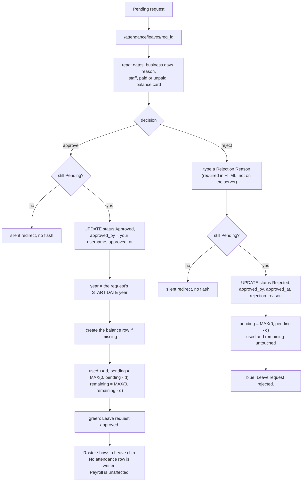

---

## Workflow 8 — Set leave balances, leave types and public holidays

### 8.1 Who, when, why

**Who.** `_allowed_manager` only, for all three screens.

**When.** Once a year for balances, once at setup for types, and at the start of each
calendar year for holidays.

**Why.** These three screens define the arithmetic every leave request runs through:
the type says how many days a year exist, the balance says how many this person actually
has, and the holidays say which dates do not count.

### 8.2 Happy path — setting one balance

1. Go to `/attendance/balances`. There is no sidebar link; reach it from the **⚖️ Leave
   Balances / أرصدة الإجازات** quick-link card at the bottom of `/attendance/` (managers
   only), from **⚖️ Balances / ⚖️ الأرصدة** on the leave-types screen, or from the
   **All leave balances → / جميع أرصدة الإجازات ←** link on a leave request.
2. The page is a matrix: one row per active employee, one column per active leave type. The
   column header carries the type's colour dot, its name, and `21d/yr` underneath. Each
   cell shows the stored `remaining` in the type's colour with `/ allocated` beneath it, or
   `—` and *"click to set / اضغط للتعيين"* if no row exists.
   The subtitle spells out the interaction: *"Click any cell to set/edit the balance for
   that staff member / اضغط على أي خانة لتعيين/تعديل رصيد ذلك الموظف"*.
   Source: `blueprints/attendance/routes.py:993-1019`; `templates/attendance/balances.html:57-107`
3. The year selector in the top bar reads `?year=` and offers **2024–2027** only, hardcoded
   in the template.
4. Click a cell. The **⚖️ Set Balance / ⚖️ تعيين الرصيد** modal opens, pre-filled with the
   current figures (or the type's `days_per_year` and zeros if the row is new), and names
   the person and type at the top.
5. Three number boxes: **Allocated / المخصص**, **Used / المستخدم**, **Pending / قيد
   الانتظار**, each `step="0.5" min="0"`. Underneath, a hint: *"Remaining = Allocated −
   Used − Pending / المتبقي = المخصص − المستخدم − المعلق"*.
6. Press **Save Balance / حفظ الرصيد**. The route computes
   **`remaining = max(0, allocated − used)`** — **not** what the hint says. Pending is
   stored but not subtracted, because every other screen treats `remaining` that way:
   `leave_approve` subtracts the days from `remaining` *while also* clearing them from
   `pending`, and `leave_new` reads availability as `remaining − pending`. Subtracting
   pending here as well would deduct the same days twice. **The hint on the screen is
   wrong; the arithmetic is right.** See KL-17.
   Source: `blueprints/attendance/routes.py:1036-1064`; `templates/attendance/balances.html:48`
7. The write is an explicit `INSERT … ON CONFLICT(user_id, leave_type_id, year) DO UPDATE`,
   so editing an existing balance genuinely updates it on both database engines.
8. Green flash **"Balance updated."**, back on the matrix for the same year.

### 8.3 Happy path — creating a leave type

1. `/attendance/leave-types`. Reach it from **Leave Types / أنواع الإجازات** in the
   balances top bar.
2. The table lists **Name / الاسم**, **Arabic / العربية**, **Days/Year / أيام/سنة**,
   **Type / النوع** (`Paid / مدفوع` or `Unpaid / بدون أجر`), **Status / الحالة**, and an
   **Edit / تعديل** button that loads the row into the form on the right.
3. The form: **Name (English) / الاسم (إنجليزي) \***, **Name (Arabic) / الاسم (عربي)**
   (RTL), **Days Per Year / الأيام في السنة** (default 21, `min="0" max="365" step="0.5"`),
   **Color / اللون**, and two checkboxes — **Paid Leave / إجازة مدفوعة** and
   **Active / نشط**, both ticked by default.
4. Press **Add Type / إضافة نوع**. Green flash **"Leave type added."** — or
   **"Leave type updated."** when editing.
   Source: `blueprints/attendance/routes.py:958-988`; `templates/attendance/leave_types.html:61-93`

### 8.4 Happy path — adding a public holiday

1. `/attendance/holidays`. **No template in the entire application links to this screen.**
   You have to type the URL. The only mention of holidays in the UI is a line in the Notes
   panel on the leave form.
   Source: `templates/attendance/leave_form.html:98`
2. The left card lists the year's holidays with **Date / التاريخ**, **Name / الاسم**,
   **Arabic / العربية**, and per-row **Edit / تعديل** and **Delete / حذف** buttons.
3. The right card is the add form: **Date / التاريخ \***, **Name (English) / الاسم
   (إنجليزي) \*** (placeholder *"e.g. National Day / مثال: العيد الوطني"*), and
   **Name (Arabic) / الاسم (عربي)**.
4. Underneath sits **QUICK ADD — 2026 Egyptian Holidays**, eight one-click buttons:
   `New Year / رأس السنة` (01-01), `Coptic Christmas / عيد الميلاد القبطي` (01-07),
   `25 January Revolution / ثورة 25 يناير` (01-25), `Sinai Liberation Day / تحرير سيناء`
   (04-25), `Labour Day / عيد العمال` (05-01), `June 30 Revolution / ثورة 30 يونيو`
   (06-30), `Revolution Day / ثورة 23 يوليو` (07-23), `Armed Forces Day / يوم القوات
   المسلحة` (10-06). **All eight dates are hardcoded to 2026** and each is only rendered
   when the year selector matches, so on any other year the quick-add block is empty. The
   movable Islamic holidays — Eid al-Fitr, Eid al-Adha, the Islamic New Year, the Prophet's
   Birthday — are not in the list at all and must be typed each year.
   Source: `templates/attendance/holidays.html:80-104`
5. Press a quick-add button or **Add Holiday / إضافة عطلة**. Green flash
   **"Holiday saved."** and the page reloads on the year of the date you entered.

### 8.5 Every alternative scenario

**A. Setting balances for the whole clinic.** There is no bulk action. Every cell is one
modal and one save. On twelve staff and five leave types that is sixty presses a year.

**B. A new employee mid-year.** Set their allocation to the pro-rata figure by hand. Nothing
computes it, and `_get_or_create_balance` — which fires the first time they request that
type of leave — seeds the **full** `days_per_year`.

**C. Carrying days over into next year.** Change the year selector, click the cell, and
type last year's remainder into **Allocated** plus the new entitlement. Nothing carries
over automatically.

**D. Typing something unreadable in a balance box.** `money.form_amount` returns
`(0.0, "…is not a valid allocated days.")` and **the route throws the error away**. The
value is silently stored as **0**. The same is true of **Days Per Year** on the leave-type
form. The overtime form is the only screen in these three modules that checks that error.
See KL-18.
Source: `blueprints/attendance/routes.py:968, 1032-1034`; `models/money.py:55-82`

**E. Deleting a leave type.** There is no delete route. Untick **Active** instead; it then
disappears from the request form, the balance matrix and the dashboard, while existing
requests and balances that reference it survive.

**F. Deleting a holiday.** The red **Delete / حذف** button behind an English-only confirm
`Delete this holiday?`. Green flash **"Holiday removed."** Removing a holiday does **not**
recompute `days_requested` on requests already submitted.

**G. Adding a holiday on a date that already exists.** `holiday_date` is `UNIQUE` and the
insert is `INSERT OR IGNORE`, so nothing is written and you still get the green
**"Holiday saved."** Pressing a quick-add button twice is therefore harmless and silent.
Source: `blueprints/attendance/routes.py:1194-1195`; `models/database.py:2085`

**H. Holidays and the working week interact.** A holiday that falls on a Friday costs
nothing — Friday is already outside the shift's `days_of_week`, and `_business_days`
excludes both independently.

**I. `is_recurring`.** The column exists; no form sets it and no query reads it. Every year
needs its own rows.

**J. Arabic UI.** All three screens are bilingual apart from the balance matrix title
`📊 Balance Matrix — 2026`, the holidays list title `🗓 Holidays — 2026`, the
`QUICK ADD — 2026 Egyptian Holidays` heading, and the JavaScript that retitles the forms to
`✏️ Edit Leave Type` / `✏️ Edit Holiday` / `Update Type` / `Update Holiday`.

### 8.6 Errors and edge cases — exact messages

| What you did | What the app does | Exact message |
|---|---|---|
| Saved a balance | Upserted; `remaining = max(0, allocated − used)` | `Balance updated.` (green) |
| Typed junk in Allocated / Used / Pending | Stored as `0`, error discarded | no error |
| Added a leave type | Row inserted | `Leave type added.` (green) |
| Edited a leave type | Row updated | `Leave type updated.` (green) |
| Left the leave-type name empty | Nothing written | `Leave type name required.` (red) |
| Added or edited a holiday | Row inserted or updated | `Holiday saved.` (green) |
| Added a holiday on a date that already exists | Nothing written | `Holiday saved.` (green) — silently a no-op |
| Left the holiday name or date empty | Nothing written | `Name and date required.` (red) |
| Deleted a holiday | Row gone | `Holiday removed.` (green) |
| Not a manager, on any of the three screens | Redirect to `/attendance/` | `Access denied.` (red) |

Source: `blueprints/attendance/routes.py:958-1068, 1175-1213`

### 8.7 What gets written, and what changes elsewhere

**Written:** one `leave_balances` row (upserted on `user_id, leave_type_id, year`) · or one
`leave_types` row · or one `public_holidays` row.

**Screens that change:**

* Balances → `/attendance/leaves/new` availability, the **⚖️ My Balances** panel, the
  balance card on every leave request for that year, **My Leave Balances** on
  `/attendance/`, and **Leave Balances (This Year)** on the staff profile.
* Leave types → the request dropdown, the balance matrix columns, and the colour used on
  every leave badge.
* Holidays → `_business_days`, so **every leave request submitted from now on** counts
  differently, and `working_days` in `_get_attendance_summary`, so **the absence deduction
  denominator moves for the whole clinic**. Requests already submitted keep the number they
  were stored with.

### 8.8 Flowchart

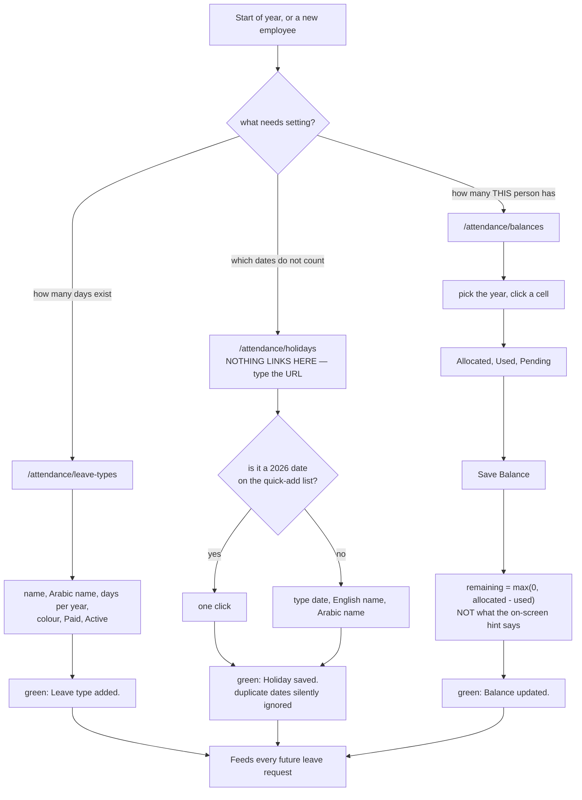

---

## Workflow 9 — Log and approve overtime

### 9.1 Who, when, why

**Who.** Logging and approving are both restricted to `super_admin`, `clinic_owner`,
`branch_manager` and `hr`. An employee **cannot log their own overtime** — there is no
self-service route and no form outside the HR staff profile.

**When.** After somebody has stayed late for a reason that is worth recording — an
emergency surgery, a stock count, an event.

**Why — and read this before you rely on it.** The overtime log is a **record**, not a
payment instruction. `overtime_log` is written and read **only** by the HR blueprint.
`blueprints/payroll/` never mentions the table. The `overtime_hours` that becomes money on
a payslip is computed from `attendance_records.hours_worked` exceeding the shift's standard
hours — a completely separate number that owes nothing to what was approved here. Approving
40 hours of overtime moves nothing on anybody's salary. See KL-19.

Source: `blueprints/hr/routes.py:1447-1522`; `blueprints/payroll/routes.py:197-203`

### 9.2 Preconditions

* The employee exists and is active.
* You know the date and the number of hours.

### 9.3 Happy path — logging

1. Open `/hr/staff/<user_id>` and scroll to the **Overtime / Extra Hours** card. That title
   is hardcoded English (§0.4 leak 2). The card shows the last five entries with **Date /
   التاريخ**, **Hours / الساعات**, **Reason / السبب** and **Status / الحالة**, plus a
   **View All / عرض الكل** link to `/hr/overtime?user_id=<id>`.
2. Under them, **Log Overtime / تسجيل عمل إضافي**:
   * a date box, prefilled with today, `required`;
   * an hours box, `step="0.5" min="0.5" max="24"`, placeholder *"Hours (e.g. 2.5) /
     الساعات (مثال: 2.5)"*, `required`;
   * a reason box, placeholder *"Reason / project / event / السبب / المشروع / الحدث"*.
   Source: `templates/hr/staff_detail.html:470-478`
3. Press **Log Overtime / تسجيل عمل إضافي**. The route:
   * parses the hours through `money.form_amount` and **reports the error if it fails** —
     this is the only form in these three modules that does;
   * refuses zero or negative hours with an explanation of what to do instead;
   * looks for an identical **Pending** row — same person, same date, same hours — and
     refuses it as a repeat submission;
   * `INSERT INTO overtime_log (user_id, work_date, hours, reason, status) VALUES
     (?,?,?,?,'Pending')`.
   Source: `blueprints/hr/routes.py:1449-1495`
4. Green flash **"2.5h overtime recorded."** and you are back on the profile, where the row
   appears with an amber **Pending / قيد الانتظار** badge.

### 9.4 Happy path — approving

1. Go to `/hr/overtime` — from the **Overtime / العمل الإضافي** button on the HR dashboard,
   the amber **Overtime Pending** banner, or **View All** on a staff profile.
2. Three tiles across the top: **Total Records / إجمالي السجلات**, **Approved Hours /
   الساعات المعتمدة**, **Pending Approval / بانتظار الاعتماد**. The first two are computed
   in SQL over **every** matching row; the third is counted in the template over the
   **200 rows the table shows**, so on a busy clinic it can read low while the other two do
   not. See KL-20.
   Source: `blueprints/hr/routes.py:1408-1425`; `templates/hr/overtime.html:38-56`
3. Filter with **All Staff / جميع الموظفين**, **All Statuses / جميع الحالات**
   (`Approved / معتمد`, `Rejected / مرفوض`, `Pending / قيد الانتظار`), and a **From date /
   من تاريخ** – **To date / إلى تاريخ** pair. **Filter / تصفية** applies,
   **Clear / مسح** resets.
4. The table lists **Staff Member / الموظف** (linked to the profile), **Date / التاريخ**,
   **Hours / الساعات**, **Reason / السبب**, **Status / الحالة**, **Approved By / اعتمده**
   and **Actions / إجراءات**. Pending rows carry two buttons.
5. Press **Approve / اعتماد**. `UPDATE overtime_log SET status='Approved', approved_by=<your
   user id>`. Green flash **"Overtime approved."**, back on the list.
6. Or press **Reject / رفض**, behind the confirm *"Reject this overtime entry? / رفض سجل
   العمل الإضافي هذا؟"*. `UPDATE overtime_log SET status='Rejected'` — note it does
   **not** record who rejected it, so the **Approved By** column stays `—` on rejected
   rows. Blue flash **"Overtime rejected."**
   Source: `blueprints/hr/routes.py:1498-1522`

### 9.5 Every alternative scenario

**A. A double-clicked Log Overtime button.** The duplicate guard fires: same user, same
date, same hours, still `Pending` is treated as a repeat submission, not a second shift.
Amber **"That overtime is already logged and awaiting approval."** and nothing is written.
Two genuinely separate stints on the same day must differ in hours, or be logged as one
combined entry.

**B. Someone tries to log negative hours to cancel an earlier entry.** Refused, with the
correct instruction in the message: **"Overtime hours must be greater than zero. To remove
an entry, reject or delete it rather than logging a negative."** A negative entry would
quietly reduce the clinic's approved total.

**C. Deleting an overtime entry.** There is no delete route. **Reject** is the only way to
take one out of the approved total.

**D. Approving something already rejected.** The two routes carry no status guard — they
are plain UPDATEs by id. The buttons only render for pending rows, so this cannot happen
by clicking, but a replayed POST would flip a rejected row to Approved.

**E. More than 200 entries.** The table caps at 200, newest work date first, and prints a
line underneath: *"Showing the most recent 200 of 431 records. The totals above cover all
of them. / يتم عرض أحدث 200 من 431 سجل. الإجماليات بالأعلى تشمل كل السجلات."* Narrow the
filters to see older rows.

**F. Paying the overtime.** Manually. Open the salary record for that month, put the hours
in **Overtime Hours / ساعات العمل الإضافي** and the rate in **Overtime Rate (EGP/hr) /
سعر الساعة الإضافية**, and save (Workflow 11, §11.4). Nothing carries the approved figure
across for you, and the **⚡ Auto-fill from Attendance** button on the salary form
overwrites the hours box with the *attendance-derived* number, discarding anything you
typed.

**G. Typing `2,5` or Arabic digits.** `money.form_amount` handles thousands separators,
Arabic-Indic digits, `٫` as a decimal mark, spaces and a leading currency symbol, so
`٢٫٥` parses as 2.5.

**H. Arabic UI.** The overtime list is fully bilingual including the row-count footer. The
card title on the staff profile is hardcoded English.

### 9.6 Errors and edge cases — exact messages

| What you did | What the app does | Exact message |
|---|---|---|
| Logged 2.5 hours | Row inserted, `status='Pending'` | `2.5h overtime recorded.` (green) |
| Typed a letter in Hours | Nothing written | `“2x” is not a valid overtime hours.` (red) |
| Typed `0` or a negative | Nothing written | `Overtime hours must be greater than zero. To remove an entry, reject or delete it rather than logging a negative.` (red) |
| Submitted the identical pending entry again | Nothing written | `That overtime is already logged and awaiting approval.` (amber) |
| Left the date empty | Defaults to today | no error |
| Anything else raised | Rolled back | `Error: <the exception text>` (red) |
| Approved an entry | `status='Approved'`, `approved_by` = your user id | `Overtime approved.` (green) |
| Rejected an entry | `status='Rejected'`, **no approver recorded** | `Overtime rejected.` (blue) |
| Approve or reject an id that does not exist | The UPDATE matches nothing | `Overtime approved.` / `Overtime rejected.` — success flashed regardless |

Source: `blueprints/hr/routes.py:1450-1522`; `models/money.py:80-82`

### 9.7 What gets written, and what changes elsewhere

**Written:** one `overtime_log` row on logging; `status` (and `approved_by` on approval
only) on decision. No audit row.

**Screens that change:**

* `/hr/overtime` — the row, and the three tiles.
* `/hr/staff/<id>` — the last five entries in the **Overtime / Extra Hours** card.
* `/hr/dashboard` — **Overtime Pending / عمل إضافي معلق** and its amber banner.

**Screens that do not change: every payroll screen.** No salary figure anywhere in the
system moves as a result of this workflow.

### 9.8 Flowchart

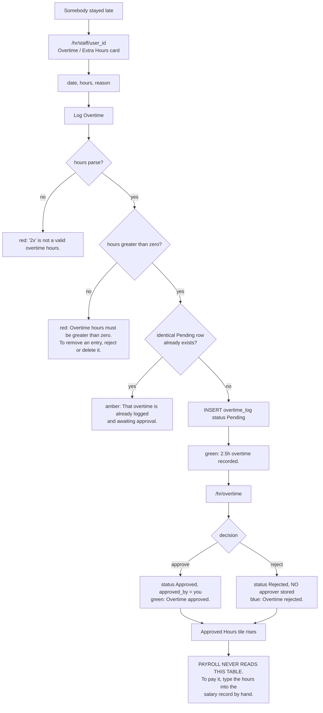
---

## Workflow 10 — Set the salary grades

### 10.1 Who, when, why

**Who.** `_PAYROLL_ROLES` — `super_admin`, `clinic_owner`, `branch_manager`, `finance`. Of
those, `branch_manager` holds no `payroll` grant, so in practice `super_admin`,
`clinic_owner` and `finance`. **The HR Officer cannot open this screen**, by design
(§0.2).

**When.** Once at setup, and again whenever pay changes for a whole role.

**Why.** `salary_grades` is the only thing that makes **Bulk Generate** produce sensible
numbers. Without it every generated payslip is basic 0, allowances 0, overtime rate 0 —
twenty rows an owner then has to open and correct by hand.

Source: `blueprints/payroll/routes.py:16-26, 635-665`

### 10.2 Preconditions

None. The table is created lazily on the first request into `/payroll/*`.

### 10.3 Happy path

1. `/payroll/` → **⚙ Grades / ⚙ الدرجات** in the top bar. You are on `/payroll/grades`.
   The subtitle states what it is for: *"Default basic salary and overtime rate per role.
   Used when bulk-generating payroll. / الراتب الأساسي وسعر الساعة الإضافية الافتراضي لكل
   دور. يُستخدم عند الإنشاء الجماعي للرواتب."*
2. One row per role, five columns:
   * **Role / الدور** — a badge with the raw role key (`branch_manager`, not
     `Branch Manager`).
   * **Basic Salary (EGP/month) / الراتب الأساسي (جنيه/شهر)**
   * **Allowances (EGP/month) / البدلات (جنيه/شهر)**
   * **Overtime Rate (EGP/hour) / سعر الساعة الإضافية (جنيه/ساعة)**
   * **Notes / ملاحظات** — placeholder `optional / اختياري`.
   Source: `templates/payroll/salary_grades.html:22-42`
3. Type figures against the roles you employ. Leave the rest at 0.
4. Press **💾 Save All Grades / 💾 حفظ كل الدرجات**. The route loops over **all thirteen**
   roles and upserts every one — `INSERT … ON CONFLICT (role) DO UPDATE` — so a single
   press writes thirteen rows, including zeros for roles you have nobody on.
   Source: `blueprints/payroll/routes.py:639-657`
5. Green flash **"Salary grades saved."**, and you land back on the same screen with the
   stored values.

### 10.4 Worked example — an Egyptian small-animal clinic

| Role | Basic (EGP/month) | Allowances | OT rate (EGP/hr) |
|---|---|---|---|
| `clinic_owner` | 0 | 0 | 0 |
| `branch_manager` | 18,000 | 2,000 | 120 |
| `doctor` | 15,000 | 1,500 | 100 |
| `nurse` | 7,500 | 800 | 55 |
| `reception` | 6,000 | 500 | 45 |
| `pharmacist` | 9,000 | 800 | 65 |
| `inventory_mgr` | 8,000 | 800 | 60 |
| `groomer` | 6,500 | 500 | 50 |
| `boarding_staff` | 5,500 | 400 | 45 |
| `finance` | 11,000 | 1,000 | 70 |

Bulk Generate for a nurse with two absent days in a 22-working-day month and 6.5 hours of
attendance-derived overtime then produces
`gross = 7500 + 800 + 6.5 × 55 = 8,657.50`, `absence = (2 ÷ 22) × 7500 = 681.82`,
`net = 7,975.68`, `status = Draft`, `notes = "Auto: 2 absent, 6.5h OT"`.

### 10.5 Every alternative scenario

**A. The HR Officer has no grade row.** The role list on this screen is the same
thirteen-item `_ROLES` used by the New Staff form, and **`hr` is not in it**. There is no
row to fill in, so an HR Officer who exists in the system is bulk-generated at basic 0,
allowances 0, overtime rate 0, and their payslip must be typed by hand every month. See
KL-2.
Source: `blueprints/payroll/routes.py:28-32`

**B. Someone whose pay differs from their role's grade.** The grade is only a **default
applied at generation time**. Generate the month, then open that person's salary record and
**Edit** it (Workflow 11, §11.4). Changing the grade afterwards does not touch salary rows
already created.

**C. Typing something unreadable.** `money.form_amount` returns an error string and the
route **discards it**, so the value is silently stored as **0**. The three boxes are
`type="number"` so the browser blocks most junk, but a cleared box posts `""`, which parses
to 0 with no message. See KL-18.
Source: `blueprints/payroll/routes.py:641-643`

**D. There is no per-employee salary field.** `users` has no `basic_salary` column.
Everything is either the role grade or the individual salary row for one month.

**E. The Auto-fill button on the salary form does not use allowances.** The New Salary
form's staff picker fills **Basic Salary** and **Overtime Rate** from the grade, and leaves
**Allowances** at 0 — even though the grade holds one and Bulk Generate applies it. See
KL-21.
Source: `templates/payroll/salary_form.html:123-132`

**F. `/payroll/api/grade/<role>` exists** and returns the grade as JSON (or
`{"basic_salary": 0, "overtime_rate": 0}` for an unknown role). **No template calls it** —
the salary form uses the `grades` dict rendered into the page instead.
Source: `blueprints/payroll/routes.py:722-732`

**G. Arabic UI.** Fully bilingual apart from the role badges, which show the raw keys.

### 10.6 Errors and edge cases — exact messages

| What you did | What the app does | Exact message |
|---|---|---|
| Saved the grid | Thirteen rows upserted | `Salary grades saved.` (green) |
| Cleared a number box | Stored as 0, error discarded | no error |
| Not a payroll role | Redirect to the launcher | `You don't have permission to access this page.` (red) |
| Opened it as the HR Officer | Redirect to the launcher | `You don't have permission to access this page.` (red) |

Source: `blueprints/payroll/routes.py:635-657`; `blueprints/auth/routes.py:180-190`

### 10.7 What gets written

Thirteen `salary_grades` rows, keyed on `role` (a `UNIQUE` column). No audit row. Nothing
else in the system changes until the next Bulk Generate or the next New Salary form load.

### 10.8 Flowchart

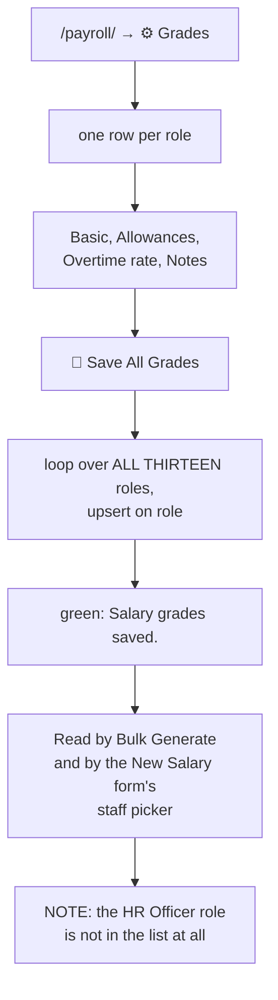

---

## Workflow 11 — Generate, approve and pay a month of payroll

### 11.1 Who, when, why

**Who.** Creating, editing, approving, paying and bulk-generating are `_PAYROLL_ROLES` —
effectively `super_admin`, `clinic_owner` and `finance`. **Reading** is wider: the salaries
list, one salary record, the payslip PDF and the attendance API are all `@self_service`, so
any signed-in employee reaches **their own** rows and nobody else's.

**When.** At the end of each month, after attendance for that month is correct.

**Why the order matters.** Every figure a generated payslip carries is a **snapshot of
attendance as it stood at the moment of generation**. Fix the attendance first (Workflows
4 and 5); a correction made afterwards changes the *Attendance This Period* card on the
payslip page but not the money.

Source: `blueprints/payroll/routes.py:16-26, 282-284, 444-447, 573-575, 670-673`

### 11.2 The arithmetic, once

```
gross = basic_salary + allowances + overtime_hours × overtime_rate
net   = gross − deductions − absence_deduction − tax_deduction
```

Both are rounded to two places and both are **stored**, not derived on display. Editing any
input recomputes and rewrites them.

Where each input comes from on **Bulk Generate**:

| Field | Source |
|---|---|
| `basic_salary` | `salary_grades.basic_salary` for that person's role, else 0 |
| `allowances` | `salary_grades.allowances`, else 0 |
| `overtime_rate` | `salary_grades.overtime_rate`, else 0 |
| `overtime_hours` | attendance: the sum, over days with status `Present` or `Late`, of `hours_worked − standard_hours` where that is positive |
| `absence_deduction` | `(absent_days ÷ working_days) × basic_salary`, rounded |
| `deductions`, `tax_deduction` | always **0** — never computed, only typed |
| `status` | always `Draft` |
| `notes` | `Auto: 2 absent, 6.5h OT` |

And the two attendance-derived terms in full:

* **`standard_hours`** = the assigned shift's `end − start`, minus its `break_minutes`.
  8.0 if the person has no assignment or the times will not parse. A night shift computes
  correctly (22:00→06:00 gives 8 hours before the break).
* **`absent_days`** = rows in the period whose `status` is exactly `'Absent'`. Nothing
  writes that automatically; a manager has to type it (Workflow 4). **An employee who
  simply never clocked in has no row at all and costs nothing.**
* **`working_days`** = `_business_days(period start, period end, this employee)` — their
  shift's week minus public holidays. If that returns 0 it falls back to the number of
  attendance rows, or failing that the number of calendar days in the month.

Source: `blueprints/payroll/routes.py:123-126, 146-232, 594-622`

### 11.3 Happy path — Bulk Generate

1. `/payroll/` and set **year** and **month** in the top bar, then **Filter / تصفية**.
2. Read the six tiles: **Total Records / إجمالي السجلات**, **Draft / مسودة**,
   **Approved / معتمد**, **Paid / مدفوع**, **Total Paid Out / إجمالي المصروف** and
   **Pending Payment / في انتظار السداد**, the last two as `EGP 84,300`.
3. If staff are missing, an amber banner appears: **"⚠ 12 active staff have no salary
   record for this period. Use Bulk Generate to create draft records."** (the sentence is
   half-translated — the count and the leading text are English in both languages).
   Source: `templates/payroll/dashboard.html:62-67`
4. Press **⚡ Bulk Generate / ⚡ إنشاء جماعي**. An English-only browser confirm asks
   *"Bulk-generate Draft salaries for all staff without records this period?"*
5. The route selects every **active** user whose role is not `super_admin` and who has no
   salary row for that year and month, computes the seven figures above per person, and
   inserts a `Draft` row for each.
6. Green flash **"Bulk generated 12 salary records for 2026-08."** You land on
   `/payroll/salaries?year=2026&month=8`.

### 11.4 Happy path — checking and correcting one payslip

1. From the salaries list, press **View / عرض**. You are on `/payroll/salaries/<sid>`.
2. The left card is the payslip itself: **Role / الدور**, **Period / الفترة**,
   **Basic Salary / الراتب الأساسي**, **Allowances / البدلات**, an
   `Overtime (6.5h × EGP 55.0)` line, **Deductions / الاستقطاعات**,
   **Absence Deduction / استقطاع الغياب** — whose label carries a link reading
   `(2 absent days / يوم غياب)` straight into `/attendance/records` filtered to this
   person, this period and `status=Absent` — **Tax Deduction / استقطاع الضريبة**,
   **Gross / الإجمالي** and **Net Pay / صافي الراتب** in green. Every figure is
   `EGP 12,500.00`.
   Source: `templates/payroll/salary_detail.html:36-60`
3. The right column carries the action card for the current status and, below it,
   **🗓 Attendance This Period / 🗓 الحضور عن هذه الفترة**: **Days Recorded / الأيام
   المسجلة**, **Days Present / أيام الحضور**, **Days Absent / أيام الغياب**,
   **Late Arrivals / مرات التأخير**, **Overtime Hours / ساعات العمل الإضافي**, and
   **Shift / المناوبة** linked to `/attendance/shifts`. Two links underneath:
   **View the days behind this payslip → / عرض الأيام المحتسبة في هذه القسيمة ←** and
   **Monthly attendance report → / تقرير الحضور الشهري ←**.
   **This card is recomputed live on every page load**, so after somebody corrects an
   attendance record it will disagree with the frozen numbers in the payslip beside it.
   That disagreement is the signal to edit the salary.
   Source: `blueprints/payroll/routes.py:470-472`; `templates/payroll/salary_detail.html:118-156`
4. To correct: **Edit / تعديل** in the top bar (hidden once the status is `Paid`). The form
   is the same one used by **+ New Salary**, with the staff picker replaced by a disabled
   box. Every money box recalculates a live **Gross: / الإجمالي:** and
   **Net: / الصافي:** strip as you type.
5. Press **💾 Save Salary Record / 💾 حفظ سجل الراتب**. Green flash **"Salary updated."**

### 11.5 Happy path — approve, pay, payslip

1. On a **Draft** record the right column shows **Approve Salary / اعتماد الراتب** with a
   single **✅ Approve / ✅ اعتماد** button. Press it. The UPDATE is guarded — `WHERE id=?
   AND status='Draft'` — and you get green **"Salary approved."**
2. On an **Approved** record the card becomes **Mark as Paid / تعليم كمدفوع**, with a
   method dropdown (`Bank Transfer`, `Cash`, `Cheque`, `Wallet` — English in both
   languages) and a date box defaulting to today. Press **💸 Mark Paid / 💸 تعليم كمدفوع**.
   Guarded by `WHERE id=? AND status='Approved'`. Green **"Salary marked as paid."**
3. The card turns into a green-bordered **✅ Paid / ✅ مدفوع** panel showing the method, the
   date and *"By / بواسطة"* whoever pressed it. The **Edit** button disappears from the top
   bar and from the salaries list.
4. **Download Payslip PDF / تحميل قسيمة الراتب PDF** is always available. It produces
   `payslip_Mona_Ibrahim_2026-08.pdf`: a navy header band with the clinic's name and logo
   and a purple **PAY SLIP** badge, six info boxes (Employee Name, Period, Role, Payment
   Status, Hire Date, Contract Type), an **EARNINGS** table ending in a purple **GROSS
   PAY** row, a **DEDUCTIONS** table ending in a red **TOTAL DEDUCTIONS** row, a green
   **NET PAY: EGP 7,975.68** band, a `Paid on 2026-09-01 via Bank Transfer` line when the
   record is paid, the notes, two signature lines (**Employee Signature** /
   **Authorized Signatory**) and a footer. **The PDF is English-only** — it does not call
   `t()` and does not print `full_name_ar`.
   Source: `models/pdf_generator.py:738-914`
5. **📊 Export Excel / 📊 تصدير Excel** on the salaries list downloads
   `payroll_2026_08.xlsx` with fifteen columns: Name, Role, Year, Month, Basic, Allowances,
   OT Hrs, OT Rate, Gross, Deductions, Absence Ded, Tax Ded, Net Salary, Status, Payment
   Date. It is scoped exactly like the list — a non-payroll employee exports only their own
   row.
   Source: `blueprints/payroll/routes.py:325-390`

### 11.6 Every alternative scenario

**A. Bulk Generate run twice.** The second run selects only people who still have no row,
so nothing is duplicated and the flash reads **"Bulk generated 0 salary records for
2026-08."** `salaries` also carries `UNIQUE (user_id, period_year, period_month)` as a
backstop.

**B. One person's insert fails.** The loop is wrapped in `try / except Exception: pass`.
That row is skipped silently, `created` is not incremented, and there is nothing on screen
to say who was missed. Compare the flash count against the amber banner's count.
Source: `blueprints/payroll/routes.py:614-625`

**C. Adding one person by hand.** **+ New Salary / + راتب جديد**. Pick the staff member;
the picker fills **Basic Salary** and **Overtime Rate** from the grade and, if attendance
exists, shows a blue **📊 Attendance — Aug 2026** banner with **✅ Present:**, **❌ Absent:**,
**⏰ Late:** and **🕐 Overtime:** counts plus an **⚡ Auto-fill from Attendance / ⚡ تعبئة
تلقائية من الحضور** button. Pressing it writes the overtime hours and the computed absence
deduction into the form. The banner is only rendered when `total_days > 0`.
Source: `templates/payroll/salary_form.html:29-44, 134-160`

**D. Attendance was corrected after payroll ran.** Nothing recalculates. The **Attendance
This Period** card updates; the stored `overtime_hours` and `absence_deduction` do not. Open
**Edit**, press nothing else, retype the two figures from the card, and save. If the record
is already **Paid** you cannot edit it at all — see F.

**E. Somebody was paid the wrong amount.** A `Paid` record refuses editing with amber
**"Cannot edit a paid salary."** There is no un-pay route, no reversal, no credit note and
no `Cancelled` transition — the status exists in `_STATUS_COLORS` and in the list filter,
and **no code path ever writes it**. The only correction is at the database level, or a
compensating adjustment on next month's record. See KL-22.
Source: `blueprints/payroll/routes.py:36-41, 497-500`; `templates/payroll/salaries_list.html:28`

**F. Approving something that is not a Draft.** The UPDATE matches nothing and you still
get green **"Salary approved."** Same for **Mark Paid** on something that is not Approved.
The buttons only render for the right status, so this only bites on a replayed POST — but
the success message is a lie either way. See KL-23.

**G. An employee reads their own payslip.** `/payroll/salaries` scopes to `s.user_id = <you>`
for anyone outside `_PAYROLL_VIEW_ROLES`, and `/payroll/salaries/<sid>` refuses a record
that is not theirs with red **"You don't have permission to view this salary record."** The
Excel export and the PDF are scoped the same way. An HR Officer holds the `payroll` grant
but is excluded from `_PAYROLL_VIEW_ROLES`, so they too see only their own.
Source: `blueprints/payroll/routes.py:140-143, 298-306, 337-339`

**H. An employee who has since left.** `salary_detail` uses a `LEFT JOIN`, so the payslip
still opens with the name rendered as `Former employee / موظف سابق` in plain text. The
**payslip PDF** route uses an inner `JOIN` and returns **404** instead. See KL-24.
Source: `blueprints/payroll/routes.py:451-455` versus `:677-685`

**I. `super_admin` is excluded from Bulk Generate** — `u.role != 'super_admin'` — on the
grounds that the system account is not an employee. Add one by hand if you need it.

**J. Nobody has any attendance.** `working_days` still resolves from the calendar, so
`absent_days = 0` gives an absence deduction of 0 and the payslip is just the grade.

**K. fpdf2 is missing.** The PDF route catches everything and flashes red
**"Payslip generation failed: fpdf2 is not installed. Run: pip install fpdf2"**, then
returns you to the salary record.

**L. Arabic UI.** The dashboard, the list, the detail page and the form are bilingual. The
payment-method options, the status badges, the bulk-generate confirm dialog, the
`Salary Records — Aug 2026` heading, the `Created …` / `Updated …` footer, the salary
form's `💰 New Salary Record` title, and the whole PDF are English-only.

### 11.7 Errors and edge cases — exact messages

| What you did | What the app does | Exact message |
|---|---|---|
| Bulk-generated a month | N Draft rows created | `Bulk generated 12 salary records for 2026-08.` (green) |
| Bulk-generated the same month again | Nothing created | `Bulk generated 0 salary records for 2026-08.` (green) |
| Created a duplicate by hand | UNIQUE constraint; nothing written | `Error: UNIQUE constraint failed: salaries.user_id, salaries.period_year, salaries.period_month` (red) |
| Cleared a number box on New or Edit Salary and saved | **HTTP 500** — `float("")` raises before any handler | — |
| Saved an edit | Row updated, gross and net rewritten | `Salary updated.` (green) |
| Tried to edit a Paid record | Redirect to the detail page | `Cannot edit a paid salary.` (amber) |
| Approved a Draft | `status='Approved'` | `Salary approved.` (green) |
| Approved something not a Draft | Nothing written | `Salary approved.` (green) — the message is wrong |
| Marked an Approved record paid | `status='Paid'`, method, date, `paid_by` | `Salary marked as paid.` (green) |
| Marked something not Approved as paid | Nothing written | `Salary marked as paid.` (green) — the message is wrong |
| Opened a salary id that does not exist | Redirect to the list | `Record not found.` (red) |
| Opened a colleague's salary record | Redirect to the launcher | `You don't have permission to view this salary record.` (red) |
| Payslip PDF for a deleted employee | HTTP 404 | — |
| Payslip PDF with fpdf2 missing | Redirect to the record | `Payslip generation failed: fpdf2 is not installed. Run: pip install fpdf2` (red) |
| Excel export with openpyxl missing | Redirect to the list | `openpyxl is not installed. Run: pip install openpyxl` (red) |
| Attendance API with month 13 | JSON, no page | `{"error": "bad period"}`, HTTP 400 |
| Attendance API for a colleague | JSON, no page | `{"error": "forbidden"}`, HTTP 403 |

Source: `blueprints/payroll/routes.py:388-390, 402-425, 497-500, 540-568, 629, 684-698, 707-717`;
`models/excel_export.py:61-64`

### 11.8 What gets written, and what changes elsewhere

**Written:** one `salaries` row per employee (`status='Draft'`, `created_by` = you) on
generation; the seven money columns plus `gross`, `net`, `notes`, `updated_at` on edit;
`status` on approval; `status`, `payment_method`, `payment_date`, `paid_by` on payment.
**No audit rows, and no accounting entry of any kind.** Paying salaries does not touch
`expenses`, the cash flow, the daily closing or the P&L — payroll and accounting are not
connected.

**Screens that change:**

* `/payroll/` — all six tiles and the recent-20 table.
* `/payroll/salaries` — the rows, and each row's **Edit** button disappears once Paid.
* `/hr/staff/<id>` — **Salary History (Last 6 Months) / سجل الرواتب (آخر 6 أشهر)**, showing
  period, basic in red, net in green, status badge and a **View** link.
* `/hr/dashboard` — **Payroll This Month / رواتب هذا الشهر**, printed as
  `EGP 84,300` with a `9/12 paid` sub-line.

### 11.9 Flowchart

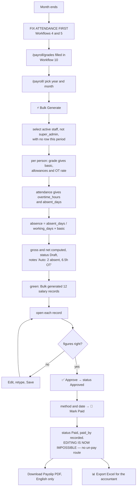

---

## Workflow 12 — Run the week: the shift table and the weekly roster

### 12.1 Who, when, why

**Who.** The roster at `/hr/roster` is `super_admin`, `clinic_owner`, `hr` in practice; the
shift table at `/attendance/shifts` is `_allowed_manager`, which additionally includes
`branch_manager`.

**When.** Every week, to see who is covering what, and once whenever the clinic's hours
change.

**Why.** The roster is the only screen that puts the shift plan and the attendance reality
side by side: a chip is green if the person turned up, amber if they were late, red if
their record says anything else, blue if they are on approved leave, and grey if there is
no record at all.

Source: `blueprints/hr/routes.py:1279-1369`; `blueprints/attendance/routes.py:882-941`

### 12.2 Preconditions

* Shifts exist and are active.
* People are assigned to them (Workflow 2). Anyone unassigned appears only in the list at
  the bottom.

### 12.3 Happy path — creating or editing a shift

1. `/attendance/shifts`, reached from the **🕐 Shifts / المناوبات** quick-link card at the
   bottom of `/attendance/`, from **Manage Shifts / إدارة المناوبات** on the HR dashboard,
   or from the shift name on an attendance record.
2. The left card, **🕐 All Shifts / 🕐 جميع المناوبات**, lists **Name / الاسم**,
   **Start / البداية**, **End / النهاية**, **Break / الاستراحة**, **Days / الأيام** (each
   stored number rendered as `Sun` `Mon` `Tue` … through a `{0:'Sun', 1:'Mon', … 6:'Sat'}`
   map), **On This Shift / على هذه المناوبة** (everyone assigned today, linked), and
   **Status / الحالة**.
3. The right card is the form: **Shift Name / اسم المناوبة \*** (placeholder *"e.g. Morning
   Shift / مثال: مناوبة صباحية"*), **Start Time / وقت البدء** (default 08:00),
   **End Time / وقت الانتهاء** (default 17:00), **Break (minutes) / الاستراحة (دقائق)**
   (default 60), **Working Days / أيام العمل** — seven checkboxes listed **Sunday first**
   with **Sun–Thu pre-ticked** — **Color / اللون** and **Active / نشط**.
   Source: `templates/attendance/shifts.html:99-126`
4. **Edit / تعديل** on any row loads it into the form, retitles the card `✏️ Edit Shift`
   and the button `Update Shift` (both English-only) and scrolls to the top.
5. Press **Add Shift / إضافة مناوبة**. Green flash **"Shift added."** or
   **"Shift updated."** If no day is ticked at all, the route stores `0,1,2,3,4` — Sunday
   to Thursday — rather than falling back to a Monday-to-Friday week.
   Source: `blueprints/attendance/routes.py:919-941`

### 12.4 Happy path — reading the roster

1. `/hr/roster`, reached from **Weekly Roster / جدول المناوبات الأسبوعي** on the HR
   dashboard, on the overtime screen, or from **Weekly roster → / جدول المناوبات الأسبوعي ←**
   under any shift's staff list.
2. Navigation: **← Prev Week / ← الأسبوع السابق**, the label
   *"Week of 17 Aug 2026 – 23 Aug 2026"*, **Next Week → / الأسبوع التالي ←**, and a
   **Today / اليوم** button. `?week=YYYY-MM-DD` anchors any date; an unparseable value
   falls back to today.
3. The grid: one column per day, **starting on Monday**, one row per active shift. Today's
   column is tinted green.
4. Each cell holds a chip per assigned employee, showing **their first name only**
   (`full_name.split(' ')[0]`), coloured by what actually happened:

   | Chip | Meaning |
   |---|---|
   | blue, `Mona (Leave)` | an approved leave request covers that date |
   | green, `Mona` | an attendance record with `status='Present'` |
   | amber, `Mona (Late)` | `status='Late'` |
   | red, `Mona` | any other status — `Absent`, `Leave`, `Holiday` |
   | grey, faded | no attendance record at all for that date |

   Every chip links to that person's HR profile. A legend underneath spells the five out:
   **Present / حاضر**, **Late / متأخر**, **Absent / غائب**, **On Leave / في إجازة**,
   **No record yet / لا يوجد سجل بعد**.
   Source: `templates/hr/roster.html:98-144`
5. Cells for days the shift does not run are greyed and read **Off / إجازة**.
6. At the bottom, **Staff without shift assignment / موظفون بدون مناوبة (3)** lists everyone
   active who has no assignment overlapping this week, each linked to their profile. This
   is the list to work through with Workflow 2.

### 12.5 The Sunday column always reads "Off"

The grid decides whether a shift runs on a given day with
`d.isoweekday()|string in shift.days_of_week.split(',')`.

`isoweekday()` is **Mon=1 … Sun=7**. `days_of_week` is **Sun=0 … Sat=6**. The two agree by
coincidence for Monday through Saturday, and disagree for exactly one day: **Sunday, which
is `7` here and `0` in the column, so it never matches and every shift shows `Off` on
Sunday** — including the Night Shift, which is stored as running all seven days.

Sunday is the **first working day of the Egyptian week**. The consequence is that on a
standard install the roster shows a four-day week (Mon–Thu) for every Sun–Thu shift, and
the weekend shift correctly shows Fri–Sat. Nothing else in the system is affected —
lateness, leave counting, auto-close and payroll all read `days_of_week` correctly through
`working_weekdays()`. This is a display bug on one screen, but it is on the screen managers
use to plan the week. See KL-25.

Source: `templates/hr/roster.html:91-96` versus `blueprints/attendance/routes.py:235-244, 297-299`

### 12.6 Every alternative scenario

**A. Somebody rostered mid-week.** They appear in that week's grid. The assignment query
uses proper interval overlap — `effective_from <= <last day of week> AND (effective_to IS
NULL OR effective_to >= <first day of week>)` — so an assignment made on the Tuesday is not
excluded from its own week.
Source: `blueprints/hr/routes.py:1309-1320`

**B. Somebody on two shifts in one week.** Both assignments overlap, so they appear as a
chip in both rows. The bottom list only excludes people who appear at least once.

**C. An inactive shift.** Excluded from the grid entirely (`WHERE is_active=1`), so anyone
whose only assignment is to that shift silently disappears from the roster and does **not**
appear under *Staff without shift assignment* either — they are in `assignments` only if
the shift row joined, which it does not.

**D. A shift with no days ticked.** The template falls back to `'1,2,3,4,5'`, which under
its own isoweekday reading is Mon–Fri. The database default is `'0,1,2,3,4'`. The two
disagree, but the fallback only fires on a NULL or empty column, which the save route
cannot produce.

**E. Overlapping approved leave.** `leave_users` is built by expanding every approved
request across the week's dates, so the blue chip wins over any attendance status.

**F. The roster is read-only.** No cell is editable, nothing drags, and there is no
"publish the rota" step. Assignments are made one person at a time on the staff profile.

**G. No shifts at all.** The grid is replaced by *"No shifts configured / لا توجد مناوبات
معرّفة"* with a link reading **Attendance → Shifts / الحضور ← المناوبات**.

**H. Arabic UI.** The roster is fully bilingual, including the day-name row. The week label
`Week of 17 Aug 2026 – 23 Aug 2026` uses English month abbreviations in both languages.

### 12.7 Errors and edge cases — exact messages

| What you did | What the app does | Exact message |
|---|---|---|
| Saved a shift | Row inserted or updated | `Shift added.` / `Shift updated.` (green) |
| Left the shift name empty | Nothing written | `Shift name required.` (red) |
| Ticked no days | Stored as `0,1,2,3,4` | no error |
| Saved a shift ending before it starts | **Accepted** — treated as a night shift everywhere | no error |
| Saved a negative break | **Accepted** — adds hours to every record on that shift | no error |
| Not a manager, on `/attendance/shifts` | Redirect to `/attendance/` | `Access denied.` (red) |
| `?week=` set to nonsense | Falls back to the current week | no error |
| No `hr` grant, on `/hr/roster` | Redirect to the launcher | `You don't have permission to access this page.` (red) |

Source: `blueprints/attendance/routes.py:907-941`; `blueprints/hr/routes.py:1282-1288`

### 12.8 What gets written

The roster writes **nothing** — it is a read-only view over `shifts`, `staff_shifts`,
`attendance_records`, `leave_requests` and `users`. The shift form writes one `shifts` row.

### 12.9 Flowchart

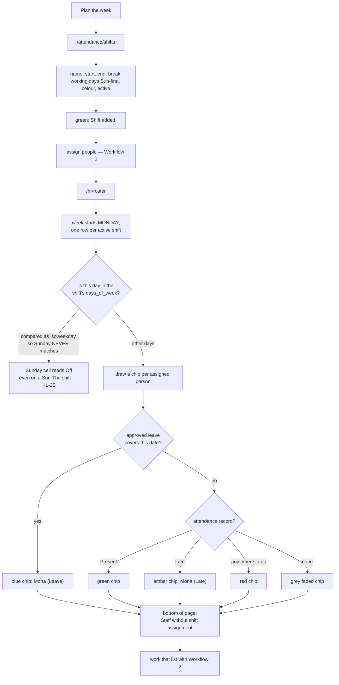

---

## Workflow 13 — Keep the staff file: reviews, warnings, certifications and notes

### 13.1 Who, when, why

**Who.** Creating reviews and warnings, and deleting certifications, is
`super_admin, clinic_owner, branch_manager, hr`. Adding certifications and notes also
allows `support_admin`. **Deleting** a warning or a note is `super_admin, clinic_owner`
only. Reading one's own review and acknowledging it is open to the subject of the record.

**When.** Reviews at the end of each period; warnings when something goes wrong;
certifications when a licence is issued or renewed; notes whenever.

**Why.** These four are the employment paper trail. Only one of them has any automation
behind it: certification expiry drives an HR dashboard panel and a clinic-wide register.

Source: `blueprints/hr/routes.py:951-1272`

### 13.2 Performance reviews

1. **Create.** `/hr/performance/new`, or **+ Review / تقييم** from any staff profile.
   Fields: **Staff Member / الموظف \***, **Review Period / فترة التقييم \*** (free text,
   placeholder *"e.g. 2025-Q2 or 2025-H1 / مثال: 2025-Q2 أو 2025-H1"*),
   **Review Date / تاريخ التقييم**, **Status / الحالة**
   (`Draft / مسودة`, `Submitted / مُرسل`, `Acknowledged / مُعتمد`), a five-star
   **Overall Rating / التقييم العام** (radio buttons, 1 = Needs Improvement, 5 =
   Outstanding), and four textareas — **Strengths / نقاط القوة**,
   **Areas for Improvement / مجالات التحسين**, **Goals for Next Period / أهداف الفترة
   القادمة** and **Additional Comments / ملاحظات إضافية**. Green flash
   **"Performance review created."**
   The reviewer is recorded as whoever is signed in; the rating defaults to **3** if no star
   is picked; the review date defaults to today.
   Source: `blueprints/hr/routes.py:986-1026`
2. **Read.** `/hr/performance` lists the newest 100 with filters for period, staff member
   and status — **the status filter is decorative**, read from the query string only to
   echo the selection back into the dropdown and never applied to the query. See KL-26.
   Source: `blueprints/hr/routes.py:954-983`; `templates/hr/performance_list.html:42-47`
3. **The employee's own copy.** `/hr/performance/<rev_id>` is `@login_required` plus an
   own-record check: the subject may read it, and so may any of the five HR-view roles.
   Anybody else gets red **"You don't have permission to view this review."** and a bounce
   to the launcher. The subject id is taken from the stored row, never from the URL.
   Source: `blueprints/hr/routes.py:1029-1049, 56-71`
4. **Acknowledge.** The **Acknowledge / الاعتماد** card appears only while the status is
   `Submitted`. Pressing **Mark as Acknowledged / تعليم كمعتمد**, behind a bilingual
   confirm, sets `status='Acknowledged'`. Green **"Review acknowledged."** The route is
   `@self_service`, so an employee reaches it without the `hr` module grant.
5. **Edit.** `/hr/performance/<id>/edit`, same form. The **Edit / تعديل** button in the top
   bar is rendered for anybody whose status is not `Acknowledged` — including the employee
   themselves, who is then bounced by the role check. Green **"Review updated."**

### 13.3 Warnings and the disciplinary record

1. The **Disciplinary Record / السجل التأديبي** card on the staff profile lists every
   warning with a coloured type chip, the reason, `Action: <text>` (English label), the
   issue date, who issued it, and an **Acknowledged / مُعتمد** marker.
2. **Issue Warning / إصدار إنذار** at the bottom of the card: **type** (`Verbal`,
   `Written`, `Final Warning`, `Suspension` — English in both languages),
   **Reason / سبب الإنذار** (`required`), **Action taken / الإجراء المتخذ**,
   **Issue date / تاريخ الإصدار** and **Expiry date / تاريخ الانتهاء**. Amber flash
   **"Warning recorded."**
3. **Ack / اعتماد** sets `acknowledged=TRUE`; like the review, the subject is read from the
   stored row and only the subject or an HR-view role may press it. Green
   **"Warning acknowledged by employee."**
4. **Del / حذف**, behind the English-only confirm `Delete this warning?`, is restricted to
   `super_admin` and `clinic_owner`. Blue **"Warning deleted."** There is no undo.
5. The five most recent warnings clinic-wide appear under **Recent Disciplinary Actions /
   الإجراءات التأديبية الأخيرة** on the HR dashboard.
6. `expiry_date` is stored and **read by nothing** — an expired warning still counts in the
   *"3 on record / بالسجل"* badge and still shows in the list. See KL-27.

Source: `blueprints/hr/routes.py:1122-1179`; `templates/hr/staff_detail.html:283-335`

### 13.4 Certifications and training

1. **Add Certification / Training / إضافة شهادة / تدريب** on the staff profile:
   **Certification / course name \*** , **Issuing body / الجهة المانحة**,
   **Certificate number / رقم الشهادة**, **Issue date / تاريخ الإصدار**,
   **Expiry date / تاريخ الانتهاء**, **status** (`Active / سارية`,
   `Pending / قيد الانتظار`, `Expired / منتهية`) and **Notes / ملاحظات**. Green
   **"Certification added."**
2. Each row on the profile shows `Exp: 2027-03-01` in green, or red once expired. The
   expired flag is computed **in the route**, not the template, because `expiry_date` comes
   back as a `date` on PostgreSQL and a string on SQLite and comparing the two in Jinja
   raises.
   Source: `blueprints/hr/routes.py:742-756`
3. **✕** deletes, behind the English-only confirm `Remove this certification?`. Blue
   **"Certification removed."**
4. `/hr/certifications` is the clinic-wide register: four summary tiles
   (**Active / سارية**, **Expiring Soon / تنتهي قريباً**, **Expired / منتهية**,
   **Total Records / إجمالي السجلات**) over a table of every certification in the clinic,
   sorted by expiry with NULLs last. Each row shows a badge:
   **Expired / منتهية**, **Expiring in 12d / تنتهي خلال 12ي**,
   **Pending / قيد الانتظار**, or **Active · 340d / سارية · 340ي**.
   It is read-only — everything is added and deleted from the individual profile.
5. **Expiring Certifications / شهادات على وشك الانتهاء** on the HR dashboard shows the next
   30 days. That query is the only one in this area still using
   `BETWEEN CURRENT_DATE AND CURRENT_DATE + INTERVAL '30 days'`, wrapped in a bare
   `except: pass` — so on a database where the comparison fails, the panel silently renders
   empty and there is no way to tell "no certifications expiring" from "this panel does not
   work here". See KL-28.
   Source: `blueprints/hr/routes.py:396-409`

### 13.5 HR notes

1. **HR Notes / ملاحظات الموارد البشرية** with the subtitle *"(private — managers only) /
   (خاصة — للمديرين فقط)"*. Twenty most recent, each with author and timestamp.
2. **Add Note / إضافة ملاحظة** — one textarea, `required`, placeholder *"Add a private HR
   note about this employee… / أضف ملاحظة خاصة عن هذا الموظف…"*. Green **"Note saved."**
   An empty note is refused with red **"Note cannot be empty."**
3. **Delete / حذف**, behind the English-only confirm `Delete this note?`, restricted to
   `super_admin` and `clinic_owner`. Blue **"Note deleted."**
4. `staff_notes.is_private` defaults to TRUE and **nothing reads it**. "Private" here means
   the page it sits on is HR-only, not that any per-note flag is enforced.

Source: `blueprints/hr/routes.py:1241-1272`; `models/database.py:210-219`

### 13.6 Errors and edge cases — exact messages

| What you did | What the app does | Exact message |
|---|---|---|
| Created a review | Row inserted | `Performance review created.` (green) |
| Review insert raised | Rolled back | `Error: <exception text>` (red) |
| Opened a review id that does not exist | Redirect to the review list | `Review not found.` (red) |
| Opened somebody else's review | Redirect to the launcher | `You don't have permission to view this review.` (red) |
| Acknowledged a review that is not yours | Redirect to the launcher | `You don't have permission to acknowledge this review.` (red) |
| Acknowledged your own review | `status='Acknowledged'` | `Review acknowledged.` (green) |
| Saved an edit | Row updated | `Review updated.` (green) |
| Issued a warning | Row inserted | `Warning recorded.` (amber) |
| Acknowledged somebody else's warning | Redirect to the launcher | `You don't have permission to acknowledge this warning.` (red) |
| Acknowledged your own warning | `acknowledged=TRUE` | `Warning acknowledged by employee.` (green) |
| Deleted a warning | Row gone | `Warning deleted.` (blue) |
| Added a certification | Row inserted | `Certification added.` (green) |
| Deleted a certification | Row gone | `Certification removed.` (blue) |
| Saved an empty note | Nothing written | `Note cannot be empty.` (red) |
| Saved a note | Row inserted | `Note saved.` (green) |
| Deleted a note | Row gone | `Note deleted.` (blue) |

Source: `blueprints/hr/routes.py:1015-1020, 1043-1046, 1084, 1106-1116, 1143-1146, 1160-1178, 1219-1235, 1246-1271`

### 13.7 What gets written

One row in `performance_reviews`, `staff_warnings`, `staff_certifications` or `staff_notes`
respectively. **None of the four writes an audit row**, and none of them is read by
attendance or payroll. A `Final Warning` costs nothing; a five-star review pays nothing.

### 13.8 Flowchart

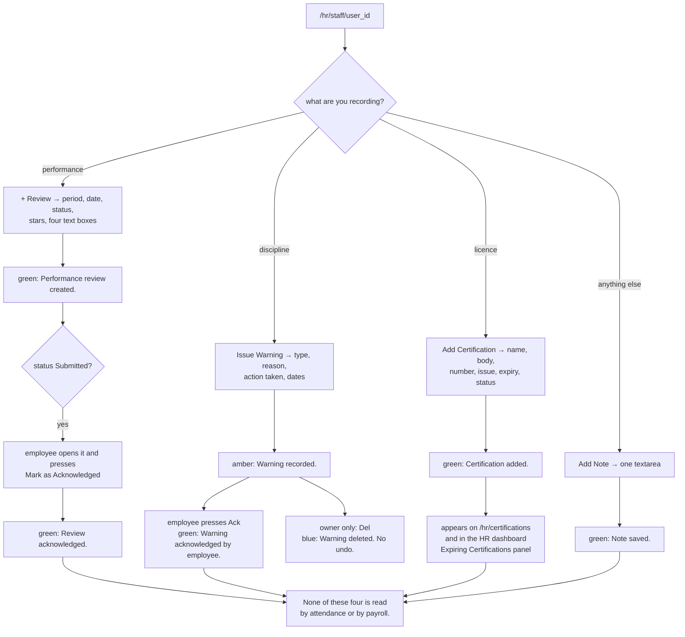

---

## Workflow 14 — Close the month: the attendance report and the extracts

### 14.1 Who, when, why

**Who.** `/attendance/report` and `/attendance/export/xlsx` are open to anybody with the
`attendance` grant, **scoped to themselves** unless they are one of the four managers.
`/hr/attendance` needs the `hr` grant.

**When.** On the first working day of the new month, before payroll (Workflow 11).

**Why.** This is where you find the days that will cost money — the zero-hour records, the
`system`-closed records, the missing days and the mismatched statuses — while they can still
be corrected.

### 14.2 The month-end checklist

1. **`/attendance/report?year=&month=`** — pick the period, optionally one member of staff,
   press **Generate / إنشاء**.
   * A card per employee: **Present / حاضر**, **Absent / غائب**, **Late / متأخر** and
     **Total Hrs / إجمالي الساعات**. These count `status` exactly: `Present`, `Absent`,
     `Late` and `Leave`. A record written by the HR modal as **`On Leave`** matches none of
     the four and is invisible in every tile while still contributing its hours.
   * **🏖 Approved Leaves in August** — every approved request overlapping the month.
   * **📋 Daily Records** — every row, with a **Day / اليوم** column that prints the date
     again rather than the weekday. The template sets a variable for it and never uses it.
     See KL-29.
   Source: `blueprints/attendance/routes.py:1100-1127`; `templates/attendance/report.html:41-51`
2. **`/hr/attendance`** with the range set to the whole month — the **Recorded By / سجّله**
   column tells you which days were reconstructed by the nightly job (`system`) rather than
   clocked, and the six tiles give **Present / Late / Absent / On Leave / Total / Avg Hours
   / متوسط الساعات** over the whole filtered set. Use the **This Month / هذا الشهر** and
   **Last Month / الشهر الماضي** quick buttons.
3. **`/attendance/records`** filtered to **Status → Absent** — this is the list that will
   become salary deductions. Anything on it that should have been leave needs correcting
   now.
4. **Excel.** From `/attendance/records`, **Export Excel / تصدير Excel** downloads
   `attendance_2026-08-01_2026-08-31.xlsx` with nine columns: Date, Staff Name, Role,
   Check-In, Check-Out, Break (min), Hours Worked, Status, Notes. The check-in and check-out
   columns are written as raw strings, so imported rows arrive as full timestamps. The
   export honours the same scoping as the list — an employee exports only their own rows.
   Source: `blueprints/attendance/routes.py:1218-1261`
5. Only then run payroll.

### 14.3 Every alternative scenario

**A. An employee runs the report on themselves.** `uid` is forced to their own id even if
they type `?user_id=` for somebody else, exactly as the records list already does. The staff
dropdown is not rendered.
Source: `blueprints/attendance/routes.py:1080-1083`

**B. The year selector only offers 2024–2027.** Hardcoded in the template, on both the
report and the balances screens. Older or newer periods are reachable by editing the query
string — the route accepts any integer.

**C. `?month=13`.** `date(year, 13, 1)` raises `ValueError` and you get a 500. The payroll
attendance API validates its range; this route does not. See KL-30.

**D. The report has no export.** The Excel button lives on `/attendance/records`, not on the
report. Set the same date range there.

**E. `/hr/attendance` pagination on a bare URL.** The pager builds its links by appending
`&page=2` to `request.url` when the URL contains no `page=`. Arriving at `/hr/attendance`
with no query string at all therefore produces `/hr/attendance&page=2`, which is not a
valid URL. Search once first — the search form always puts a query string on the URL — and
the pager works. See KL-31.
Source: `templates/hr/hr_attendance.html:236-243`

**F. `/hr/api/headcount` and `/attendance/api/today`.** Both return JSON, both are
`@login_required`, and **no template calls either**. Useful for a dashboard you build
yourself.

### 14.4 Errors and edge cases — exact messages

| What you did | What the app does | Exact message |
|---|---|---|
| Generated a report for a month with no records | Empty tables | `No attendance records for August 2026.` (plain text, English only) |
| Exported with openpyxl missing | Redirect to the records list | `openpyxl is not installed. Run: pip install openpyxl` (red) |
| Typed `?month=13` | **HTTP 500** | — |
| Non-manager typed `?user_id=` for somebody else | Silently scoped back to themselves | no error |

Source: `blueprints/attendance/routes.py:1085-1089, 1250-1261`

### 14.5 What gets written

Nothing. All three screens and both exports are read-only.

### 14.6 Flowchart

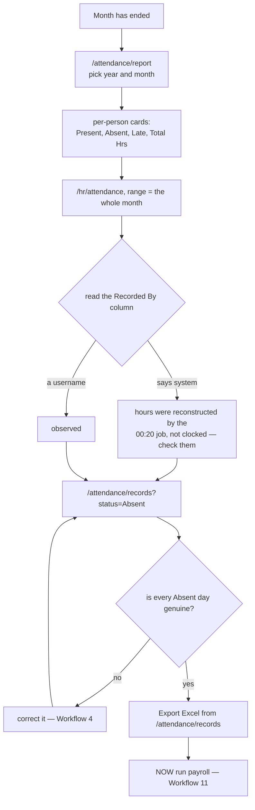
---

## Known limits

Everything below is a real behaviour of the code as it stands today. None of it is
described above as if it worked. Do not train staff on the version you wish existed.

**KL-1 — both password boxes advertise a rule the server does not use.**
The New Staff form's placeholder reads *"Min 6 characters / 6 أحرف على الأقل"* and the
Reset Password box carries `minlength="6"` and *"New password (min 6 chars) / كلمة مرور
جديدة (6 أحرف على الأقل)"*. The server enforces twelve characters plus an uppercase, a
lowercase, a digit and a symbol. The browser accepts a seven-character password and the
server then refuses it.
`templates/hr/staff_form.html:52`, `templates/hr/staff_detail.html:126` versus
`models/security.py:346-366`

**KL-2 — the HR Officer role cannot be assigned, and has no salary grade.**
`hr` is seeded in `_SEED_ROLES` with display names `HR Officer / موظف الموارد البشرية` and
holds the `hr`, `attendance` and `payroll` grants — but it is absent from the thirteen-item
`_ROLES` list used by the **New Staff / Edit Staff** role dropdown *and* from the identical
list used to build `/payroll/grades`. So the role cannot be granted from the HR screens,
and no default salary can be defined for it. Bulk Generate pays an HR Officer basic 0.
`models/database.py:2445` versus `blueprints/hr/routes.py:20-24` and
`blueprints/payroll/routes.py:28-32`

**KL-3 — the check-out forms send a zero break, defeating the shift-break default.**
`checkin` falls back to the shift's unpaid break only when the browser sends nothing:
`int(_raw_break) if str(_raw_break or "").strip().isdigit() else <shift break>`. Both
check-out forms — the employee's own and the manager panel — ship
`<input type="number" name="break_minutes" value="0">`, and `"0".isdigit()` is True. An
untouched check-out therefore records a **zero-minute** break. On an 08:00–16:00 shift with
a 60-minute break that stores 8.0 hours against a payroll standard of 7.0 — an hour of
invented overtime for every hand-clocked day.
`blueprints/attendance/routes.py:425-428` versus `templates/attendance/checkin.html:49, 105`

**KL-4 — a night worker cannot clock out the next morning.**
`checkin` looks up today's record with `WHERE user_id=? AND work_date=?` where the date is
always `date.today()`. Someone who clocked in at 22:00 on the 12th and presses Check Out at
06:00 on the 13th is looking for a record dated the 13th, finds none, and gets
**"No check-in record found for today."** Their 12th stays open until the 00:20 job closes
it at the shift end. The rest of the module handles night shifts correctly; this one query
does not.
`blueprints/attendance/routes.py:402, 430-432, 458-460`

**KL-5 — two screens print the raw time column instead of `hhmm()`.**
The HR attendance live board and its results table render `r.check_in` and `r.check_out`
directly, so a seeded or imported row shows `2026-08-12 09:27:00` where an app-written row
shows `08:47`. The results table then does `r.check_in.split(':')[0]|int` to colour the
cell, which on a timestamp yields `2026-08-12 09` and Jinja's `int` filter returns 0, so
every imported row is coloured as an early arrival.
`templates/hr/hr_attendance.html:128-131, 274-283` versus
`blueprints/attendance/routes.py:19-55`

**KL-6 — `Leave` and `On Leave` are two different values for one idea.**
The record-edit dropdown offers `Present, Late, Absent, Leave, Holiday`; the HR modal
offers `Present, Late, Absent, On Leave`. The HR summary tiles count `On Leave`; the
monthly report's per-person cards count `Leave`. A day marked through one screen is
invisible to the other's totals, and neither `Leave` nor `Holiday` is counted anywhere in
`/hr/attendance`.
`templates/attendance/record_edit.html:54`, `templates/hr/hr_attendance.html:347-352`,
`blueprints/hr/routes.py:1578-1583`, `blueprints/attendance/routes.py:1112-1115`

**KL-7 — not turning up is free; only a typed "Absent" costs money.**
`_get_attendance_summary` counts `absent_days` as rows whose `status` is exactly `'Absent'`.
Nothing writes that automatically — not the check-in screen, not the nightly job, not leave
approval. An employee with **no attendance row at all** for a day contributes nothing to
`absent_days` and is not deducted. The absence deduction only ever reflects days a manager
sat down and typed.
`blueprints/payroll/routes.py:193, 609-611`

**KL-8 — the HR modal erases the auto-close audit trail.**
Rows closed by the nightly job carry `recorded_by='system'` and a note ending
`[auto-closed at shift end 16:00; no check-out was recorded]`. Saving that day through
**Log Attendance** overwrites `recorded_by` with your username and `notes` with the modal's
Notes box, which is empty by default — so a status-only correction silently destroys the
only evidence that the hours were reconstructed rather than observed. The record-edit
screen prefills the note and does not.
`blueprints/hr/routes.py:1709-1724` versus `blueprints/attendance/routes.py:611-616, 214-223`

**KL-9 — the leave form's day preview counts the wrong week.**
`calcDays()` counts every day where `d.getDay() !== 0 && d.getDay() !== 6` — Monday to
Friday. The server counts the employee's own shift week, Sunday to Thursday by default.
A Sunday-only request previews as **"Approx. 0 business days"** and is stored as **1**; a
Friday-only request previews as 1 and is stored as 0. The caption underneath claims
*"business days, excl. weekends & holidays"*.
`templates/attendance/leave_form.html:46-49, 123-136` versus
`blueprints/attendance/routes.py:282-302`

**KL-10 — "insufficient balance" is a warning, not a refusal, and the overdraft then
disappears.** `leave_new` flashes **"Insufficient balance. Available: 2.0 days."** and
inserts the request anyway. Approval applies `remaining = MAX(0, remaining - days)`, so an
employee approved for five days with two left ends at `remaining = 0` and `used` exceeding
`allocated`. The three overdrawn days are visible only by comparing those two columns.
`blueprints/attendance/routes.py:736-753, 841-846`

**KL-11 — three screens show the wrong year's balance for a cross-year request.**
`leave_new` reserves against the **start date's** year and approve/reject settle the same
row, which is correct. But the form's **⚖️ My Balances** panel, the balance card on the
request detail, and `/hr/staff/<id>` all query `date.today().year`. A December request for
January days displays this year's allowance while operating on next year's row.
`blueprints/attendance/routes.py:724` versus `:691, 759-764, 796-798`;
`blueprints/hr/routes.py:710-714`

**KL-12 — approving leave writes nothing to attendance.**
`leave_approve` touches `leave_requests` and `leave_balances` only. The roster reads
`leave_requests` directly and draws a blue chip, but `/hr/attendance` lists the person
under **not recorded / بدون تسجيل**, the monthly report's per-person cards show nothing,
and payroll neither counts the day as absent nor excludes it. Whoever marks people absent
has to check the leave list first, by hand.
`blueprints/attendance/routes.py:824-848`

**KL-13 — `leave_types.is_paid` drives no money anywhere.**
It is displayed on the request form, the request detail, the balance panel and the leave
types table, and is read by no calculation. Thirty days of **Unpaid Leave / إجازة بدون
راتب** cost the clinic exactly what thirty days of Annual Leave cost, because neither
touches payroll at all.
`models/database.py:2033`; no reference in `blueprints/payroll/routes.py`

**KL-14 — a future-dated shift assignment takes effect immediately in two of four places.**
`default_shift()` filters `ss.effective_from <= on_date`, so lateness and the nightly
auto-close correctly ignore a forward-dated assignment. `working_weekdays()` and payroll's
`_get_attendance_summary` filter only on `effective_to`, so the leave day-count and the
payroll standard hours switch to the new shift the moment the row is written.
`blueprints/attendance/routes.py:109-112` versus `:260-265`;
`blueprints/payroll/routes.py:171-178`

**KL-15 — a shift assignment cannot be given an end date from the UI.**
`staff_assign_shift` reads `request.form.get("effective_to")` and no template renders such
a field, so it is always `None`. Every assignment is open-ended and is only closed by
making the next one.
`blueprints/hr/routes.py:922-923` versus `templates/hr/staff_detail.html:148-161`

**KL-16 — nothing validates a shift's times or its break.**
`shift_save` checks only that the name is non-empty. An end before the start is accepted
and read everywhere as "this shift crosses midnight". A negative `break_minutes` is
accepted and **adds** hours: `_calc_hours` computes `minutes − break`, so a −60 break turns
an eight-hour day into nine. The form's `min="0" max="240"` is browser-side only, and the
break feeds the nightly auto-close for every employee on that shift.
`blueprints/attendance/routes.py:907-941, 82-83`

**KL-17 — the Set Balance modal's hint contradicts what the route computes.**
The screen says *"Remaining = Allocated − Used − Pending / المتبقي = المخصص − المستخدم −
المعلق"*. The route computes `remaining = max(0, allocated − used)`. The route is right —
`leave_approve` already clears the same days from `pending` while subtracting them from
`remaining`, and `leave_new` reads availability as `remaining − pending`, so subtracting
pending here would deduct twice. The hint is the thing that is wrong.
`templates/attendance/balances.html:48` versus `blueprints/attendance/routes.py:1036-1047`

**KL-18 — four forms throw away the money parser's error message.**
`money.form_amount` returns `(0.0, "“…” is not a valid <field>.")` on anything it cannot
read. Leave-type **Days Per Year**, the three **Set Balance** boxes and all three
**Salary Grades** columns discard the second element, so an unreadable value is silently
stored as **0**. The overtime form is the only one in these three modules that checks it.
`blueprints/attendance/routes.py:968, 1032-1034`, `blueprints/payroll/routes.py:641-643`
versus `blueprints/hr/routes.py:1453-1456`

**KL-19 — the Overtime Log is not connected to payroll.**
`overtime_log` is written and read only by `blueprints/hr/routes.py`. The word does not
appear in `blueprints/payroll/routes.py`. The `overtime_hours` that becomes money is
derived independently from `attendance_records.hours_worked` exceeding the shift's standard
hours. Approving overtime changes no salary figure anywhere; to pay it, type the hours into
the salary record by hand — and remember that pressing **⚡ Auto-fill from Attendance**
overwrites what you typed.
`blueprints/hr/routes.py:1447-1522` versus `blueprints/payroll/routes.py:197-203`

**KL-20 — one of the three overtime tiles is counted differently from the other two.**
**Total Records** and **Approved Hours** are aggregated in SQL over every matching row.
**Pending Approval** is `rows | selectattr('status','eq','Pending') | list | length` in the
template, over the 200 rows the table is capped at. Past 200 entries the pending count
reads low while the other two do not, and the footer note only claims the *totals* cover
everything.
`blueprints/hr/routes.py:1415-1425` versus `templates/hr/overtime.html:51-53`

**KL-21 — the salary form's grade autofill ignores allowances.**
`loadGrade()` copies `basic_salary` and `overtime_rate` out of the grade and leaves
**Allowances** at 0, even though `salary_grades.allowances` exists and Bulk Generate applies
it. A record created by hand is therefore short the standing allowance unless you notice.
`templates/payroll/salary_form.html:123-132` versus `blueprints/payroll/routes.py:604`

**KL-22 — a paid salary cannot be corrected, and `Cancelled` is unreachable.**
`salary_edit` refuses a `Paid` record with **"Cannot edit a paid salary."** There is no
un-pay route, no reversal and no adjustment. `Cancelled` appears in `_STATUS_COLORS` and in
the salaries list's status filter, and **no code path ever writes it**. A wrong payment can
only be corrected in the database or offset on next month's record.
`blueprints/payroll/routes.py:36-41, 497-500`; `templates/payroll/salaries_list.html:28`

**KL-23 — Approve and Mark Paid flash success even when they change nothing.**
Both UPDATEs are guarded (`AND status='Draft'`, `AND status='Approved'`) and neither checks
the row count, so a replayed or out-of-order POST silently matches nothing and still returns
green **"Salary approved."** / **"Salary marked as paid."**
`blueprints/payroll/routes.py:540-568`

**KL-24 — the payslip PDF 404s for an employee who has been deleted.**
`salary_detail` uses `LEFT JOIN users` on purpose, so the page opens with
*"Former employee / موظف سابق"*. `salary_payslip` uses an inner `JOIN` and `abort(404)`s.
The **Download Payslip PDF** button is rendered regardless.
`blueprints/payroll/routes.py:451-455` versus `:677-685`

**KL-25 — the weekly roster shows every Sunday as "Off".**
The grid tests `d.isoweekday()|string in shift.days_of_week.split(',')`. `isoweekday()` is
Mon=1…Sun=7; `days_of_week` is Sun=0…Sat=6. They coincide Monday to Saturday and disagree
on exactly one day, so Sunday — the first working day of the Egyptian week — never matches
and every shift, including the Night Shift stored as `0,1,2,3,4,5,6`, reads **Off / إجازة**
in that column. The template's own fallback for an empty column, `'1,2,3,4,5'`, is written
in the isoweekday convention too. Nothing else in the system is affected — lateness, leave
counting, the auto-close and payroll all go through `working_weekdays()`, which converts
correctly.
`templates/hr/roster.html:84, 91-96` versus `blueprints/attendance/routes.py:235-244, 297-299`

**KL-26 — the performance list's Status filter does nothing.**
`performance_list` reads `request.args.get("status","")` only to pass it back to the
template so the dropdown keeps its selection. It is never added to the WHERE clause. The
period and staff filters do work.
`blueprints/hr/routes.py:964-983`; `templates/hr/performance_list.html:42-47`

**KL-27 — a warning's expiry date is stored and read by nothing.**
`staff_warnings.expiry_date` is on the form and in the schema. No query filters on it, the
*"N on record / بالسجل"* badge counts every row regardless, and an expired warning looks
identical to a live one.
`blueprints/hr/routes.py:1130-1141`; `templates/hr/staff_detail.html:286`

**KL-28 — the Expiring Certifications panel can silently render empty.**
It is the one query in this area still written as
`BETWEEN CURRENT_DATE AND CURRENT_DATE + INTERVAL '30 days'` against a TEXT column, and it
sits inside a bare `except: db.rollback_quietly(conn)`. Where that comparison is not
supported the panel shows nothing at all, and there is no way to tell "no certifications
expiring" from "this panel does not work here". Every sibling panel on that dashboard was
rewritten to bind the cutoff from Python; this one was not. `/hr/certifications` computes
its own days-left in Python and is unaffected.
`blueprints/hr/routes.py:396-409` versus `:316-323, 358-383`

**KL-29 — the monthly report's "Day" column prints the date twice.**
The template sets `` and then renders `{{ r.work_date }}`,
so the **Day / اليوم** column repeats the **Date / التاريخ** column instead of naming the
weekday. The `wd` list of day names above it is also unused.
`templates/attendance/report.html:41-51`

**KL-30 — `/attendance/report?month=13` is a 500.**
The route does `int(request.args.get("month", …))` and passes it straight to
`date(year, month, 1)`, which raises. `/payroll/api/attendance/...` validates its range and
returns a 400; this one does not.
`blueprints/attendance/routes.py:1079-1089` versus `blueprints/payroll/routes.py:712-713`

**KL-31 — the HR attendance pager breaks on a URL with no query string.**
The Prev/Next links are built as `request.url | replace('page='~page, …) if 'page=' in
request.url else (request.url ~ '&page='~(page+1))`. Arriving at `/hr/attendance` with no
query string produces `/hr/attendance&page=2`. Run a search first — the form always adds a
query string — and the pager works.
`templates/hr/hr_attendance.html:236-243`

**KL-32 — attendance and payroll write no audit rows at all.**
`blueprints/hr/routes.py` calls `db.log_audit` for staff create, staff update and password
reset. Nothing else in these three modules does: not the attendance edit, not the record
delete, not shift changes, not leave approval, not overtime approval, not salary approval
and not marking a salary paid. Approving and paying a month of wages leaves no trace beyond
the `salaries` rows themselves.
`blueprints/hr/routes.py:620-623, 832-837, 872-875`; no `log_audit` call in
`blueprints/attendance/routes.py` or `blueprints/payroll/routes.py`

**KL-33 — `/attendance/holidays` has no link from any template.**
No `url_for('attendance.holidays')` exists anywhere under `templates/`. The only mention of
public holidays in the UI is a bullet in the Notes panel of the leave form. The screen is
reachable only by typing the URL — and it feeds `_business_days`, which decides how many
days every leave request costs and how many working days payroll divides the absence
deduction by.
`templates/attendance/leave_form.html:98`

**KL-34 — the quick-add holidays are hardcoded to 2026 and omit every Islamic date.**
All eight entries carry literal 2026 dates and each is wrapped in
``, so on any other year the **QUICK ADD** block renders
empty. Eid al-Fitr, Eid al-Adha, the Islamic New Year and the Prophet's Birthday — which
move every year — are not in the list at all. `public_holidays.is_recurring` exists and is
read by nothing.
`templates/attendance/holidays.html:82-103`; `models/database.py:2086`

**KL-35 — a rejected leave form comes back empty.**
Both validation failures in `leave_new` `redirect()` rather than re-render, so the type, the
dates and the reason are all lost. The staff forms preserve what you typed on failure; this
one does not.
`blueprints/attendance/routes.py:701-709`

**KL-36 — the staff profile computes leave remaining differently from every other screen.**
The **Leave Balances (This Year)** card renders
`` in the template, ignoring the
stored `leave_balances.remaining` column that `/attendance/balances` and the request detail
both display. The two agree only while nothing has been edited by hand.
`templates/hr/staff_detail.html:212-215` versus `templates/attendance/balances.html:95`

**KL-37 — payroll is not connected to accounting.**
Marking a salary paid writes `salaries.status`, `payment_method`, `payment_date` and
`paid_by`, and nothing else. No `expenses` row, no cash-flow entry, no daily-closing line,
no P&L effect. A month of wages is invisible to every screen in the finance and accounting
modules.
`blueprints/payroll/routes.py:554-568`

**KL-38 — Bulk Generate hides its own failures.**
The per-person INSERT sits in `try: … except Exception: pass`. A row that fails is skipped,
`created` is not incremented, nothing is logged and nothing appears on screen. The only
signal is the flash count being lower than the amber banner's count of staff without a
record.
`blueprints/payroll/routes.py:614-625`

**KL-39 — clearing a number box on the salary form is a 500.**
`salary_new` and `salary_edit` parse all seven money fields with a bare
`float(f.get("basic_salary", 0))`, outside any `try`. A present-but-empty box posts `""`,
`float("")` raises `ValueError`, and the user gets the error page rather than a message.
Everywhere else in the platform the same job is done by `money.form_amount`.
`blueprints/payroll/routes.py:402-409, 504-511`

**KL-40 — an employee cannot log their own overtime, and cannot withdraw their own leave.**
`add_overtime` is HR-only, so extra hours exist only if a manager types them. There is no
cancel or withdraw route on a leave request either: a pending request holds its days in
`pending` — which is subtracted from availability — until a manager rejects it. A request
nobody ever looks at blocks the allowance indefinitely.
`blueprints/hr/routes.py:1447-1448`; `blueprints/attendance/routes.py:736`

**KL-41 — six schema columns in this area are written by nothing, or read by nothing.**
`leave_types.min_notice_days`, `leave_types.max_consecutive`, `leave_types.requires_approval`,
`leave_requests.attachment_name`, `public_holidays.is_recurring` and `staff_notes.is_private`
are all present in the schema, and none of them is set by a form or consulted by a query.
`performance_reviews.reviewed_at` is written but drives nothing.
`models/database.py:2030-2039, 2075, 2086, 216`; `blueprints/hr/routes.py:216`

**KL-42 — `finance`, `support_admin` and `auditor` cannot record attendance at all.**
None of the three holds the `attendance` grant, so none can reach `/attendance/*`. A finance
user has no way to clock in, no way to see their own record, and no way to request leave;
everything for them has to be typed by a manager through the HR modal. Meanwhile `finance`
holds the payroll grant and can pay everybody, including themselves.
`models/database.py:4371, 4376-4378`

---

## Could not verify

* **No live database was opened and no browser session was run.** Everything above is a
  static read of the source. The role behaviour on any given install depends on the
  contents of the `roles` table, which was not inspected; the grants quoted are
  `DEFAULT_ROLE_PERMISSIONS`, which `seed_default_permissions()` applies only to roles whose
  `permissions_json` is still empty.
  `models/database.py:4384-4400`
* **The nightly job was not observed firing.** The 00:20 cron registration and the function
  it calls were both read; the scheduler itself was not exercised, and the per-clinic loop
  was not run against more than one tenant.
* **The payslip PDF and the two Excel exports were read but not generated.** `fpdf2` and
  `openpyxl` are both declared in `requirements.txt`; neither was imported in the shell used
  for this review, so the fallback flashes are documented from the code rather than from a
  run.
* **The PostgreSQL path was not exercised.** Several notes in this chapter concern
  behaviour that differs between SQLite and PostgreSQL (the `NULLS LAST` ordering, the
  `FILTER (WHERE …)` aggregates, the `CURRENT_DATE + INTERVAL` comparison in KL-28,
  the `ON CONFLICT` upserts). All were read; none was run on PostgreSQL.
* **Exact rendered Arabic string widths and RTL layout** were not visually checked. The
  bilingual pairs quoted are the literal `t(en, ar)` arguments in the templates, and the
  "English leaks" listed in §0.4 and throughout are literals with no `t()` wrapper.
* **The demo and seed scripts were not run.** `scripts/seed/demo_showcase.py` and
  `seed_hr.py` both write `overtime_log` and `attendance_records` directly; the shape of the
  data they produce was not inspected beyond confirming that both write the full-timestamp
  form discussed in §0.5 C.

---

## Quick reference

### The seven rules that keep the people data straight

1. **Roster everybody, on day one.** An unrostered employee is measured against the
   clinic's first active shift by id — Morning 08:00 on a seeded database — for lateness,
   for the nightly auto-close, for leave day-counting and for payroll's standard hours.
2. **Type the real break at check-out.** The box ships with `0` in it and the shift's break
   is only used when the field is absent. Every untouched check-out invents an hour of
   overtime (KL-3).
3. **Only a typed "Absent" costs anybody money.** No attendance row at all costs nothing,
   and approved leave writes no row (KL-7, KL-12). If somebody is genuinely absent, mark
   them absent.
4. **Fix attendance before you run payroll, never after.** Every figure on a generated
   payslip is a snapshot. A `Paid` record cannot be edited, un-paid or cancelled (KL-22).
5. **The Overtime Log pays nobody.** It is a record. To pay overtime, type the hours onto
   the salary record — and do not press Auto-fill afterwards (KL-19).
6. **Pick one word for leave and stay on it.** `Leave` and `On Leave` are counted by
   different screens (KL-6).
7. **Enter the year's public holidays before anybody books leave.** The screen is unlinked
   (KL-33) and it decides both the leave day-count and the payroll absence denominator.

### Bookmarks worth keeping (nothing links to them)

* `/attendance/holidays` — public holidays, the only way in is the URL
* `/attendance/balances` — the leave-balance matrix (linked only from the attendance
  dashboard's manager quick-links and from a leave request)
* `/hr/roster` — the weekly grid
* `/hr/overtime` — the overtime log
* `/hr/certifications` — the clinic-wide licence register
* `/payroll/grades` — the per-role defaults
* `/hr/api/headcount` and `/attendance/api/today` — JSON, called by no template

### Which screen answers which question

| Question | Screen |
|---|---|
| Who is in the building right now? | `/attendance/` **Checked In**, or the live board on `/hr/attendance` |
| Who was late this week? | `/attendance/records?status=Late`, or the amber chips on `/hr/roster` |
| Which hours did the system make up rather than observe? | `/hr/attendance` → the **Recorded By** column reading `system` |
| Who is off today? | `/attendance/` **On Leave**, or the blue chips on `/hr/roster` |
| How many days does this person have left? | `/attendance/balances` for the stored figure; the staff profile computes its own (KL-36) |
| Who is waiting on me? | `/hr/dashboard` — the three amber banners, or `/attendance/leaves?status=Pending` |
| Who has no shift? | `/hr/roster`, bottom of the page |
| Whose licence is about to lapse? | `/hr/certifications`, or the HR dashboard panel (KL-28) |
| What did this month cost in wages? | `/payroll/?year=&month=` **Total Paid Out** + **Pending Payment** |
| Why is this payslip that number? | `/payroll/salaries/<id>` → **Attendance This Period**, then its two links |
| Give the accountant a file | `/payroll/salaries` → **Export Excel**, and `/attendance/records` → **Export Excel** |

### Status transitions

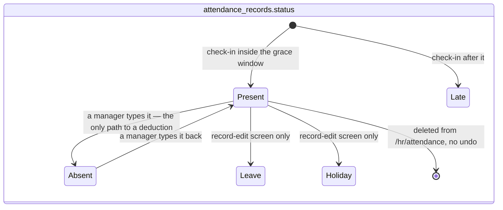

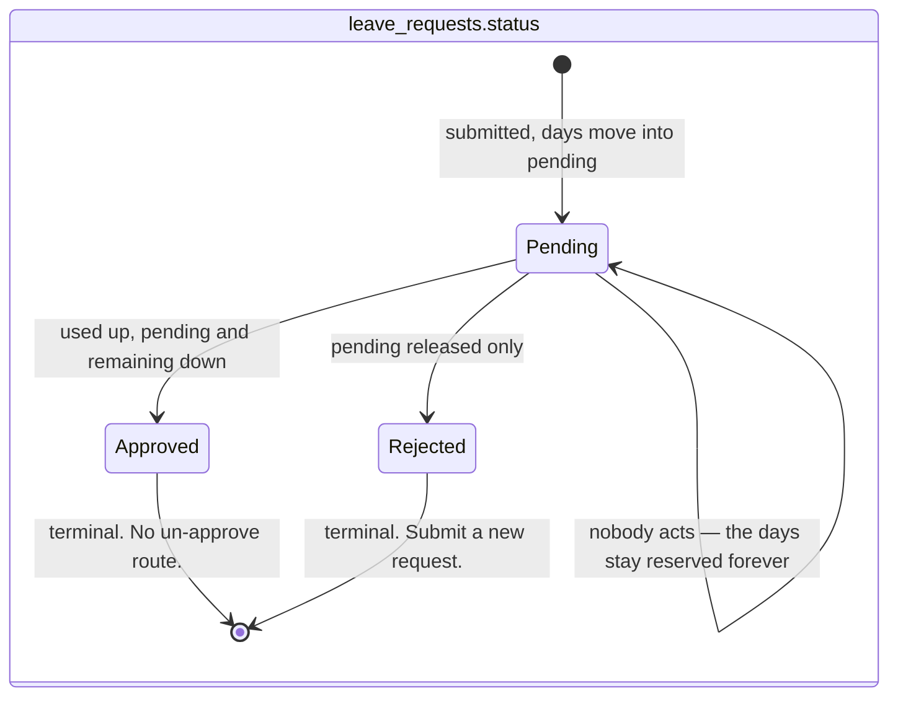

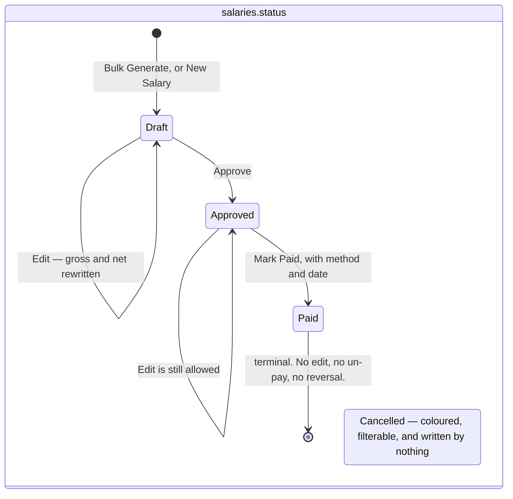

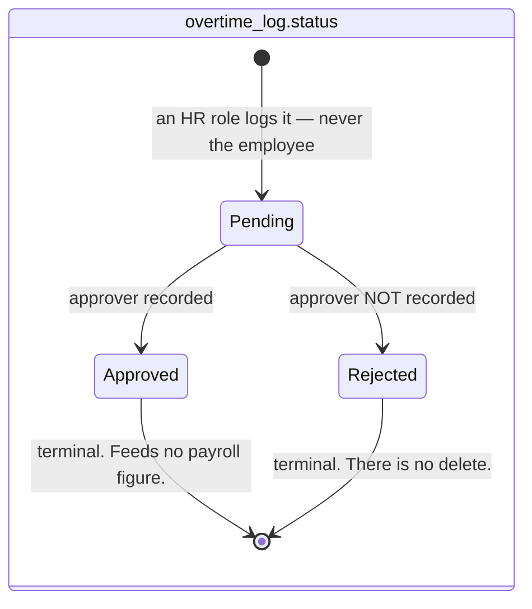

---

*Verified against source on 2026-08-19. Files read in full: `blueprints/attendance/routes.py`
(1,278 lines), `blueprints/hr/routes.py` (1,756 lines), `blueprints/payroll/routes.py` (733
lines), all 12 `templates/hr/*.html`, all 12 `templates/attendance/*.html`, all 5
`templates/payroll/*.html`, plus `models/money.py`, `models/concurrency.py`, the payslip
generator in `models/pdf_generator.py`, `models/excel_export.py`, the password rules in
`models/security.py`, the decorators and role-guard code in `blueprints/auth/routes.py`, the
scheduler registration in `app.py`, and the users, shifts, staff_shifts, attendance,
leave, holiday, role and permission sections of `models/database.py`.*
