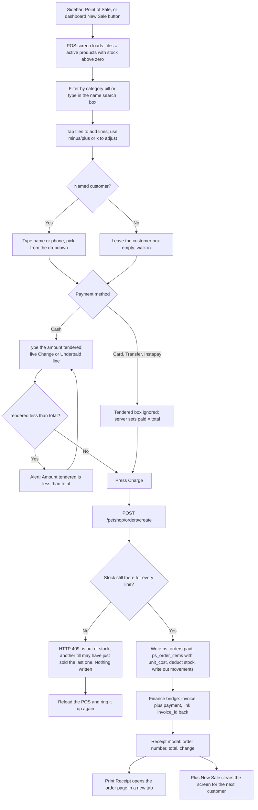
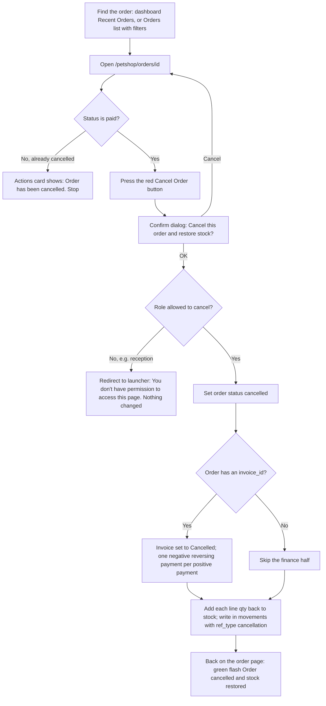
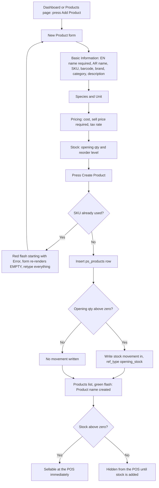
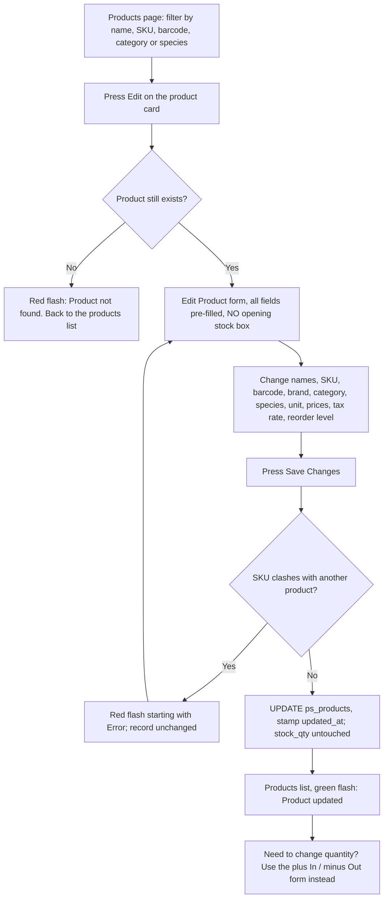
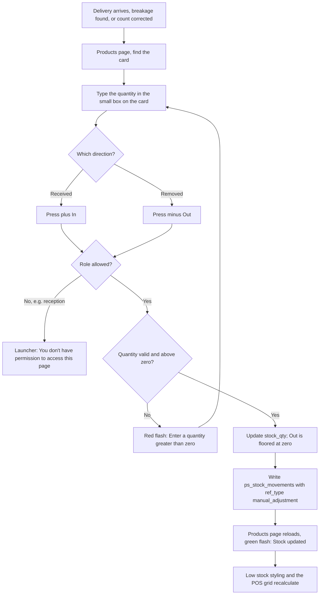
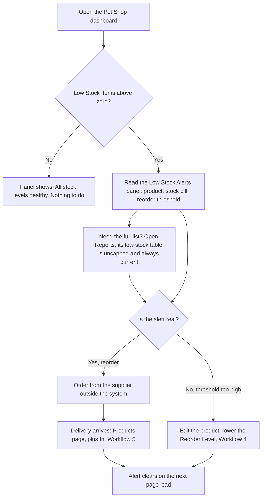
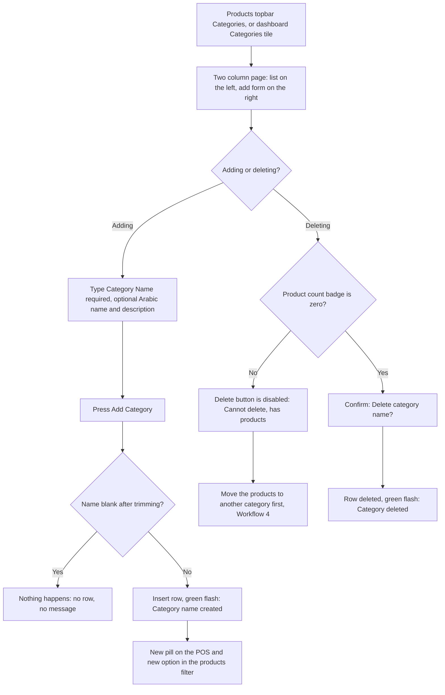
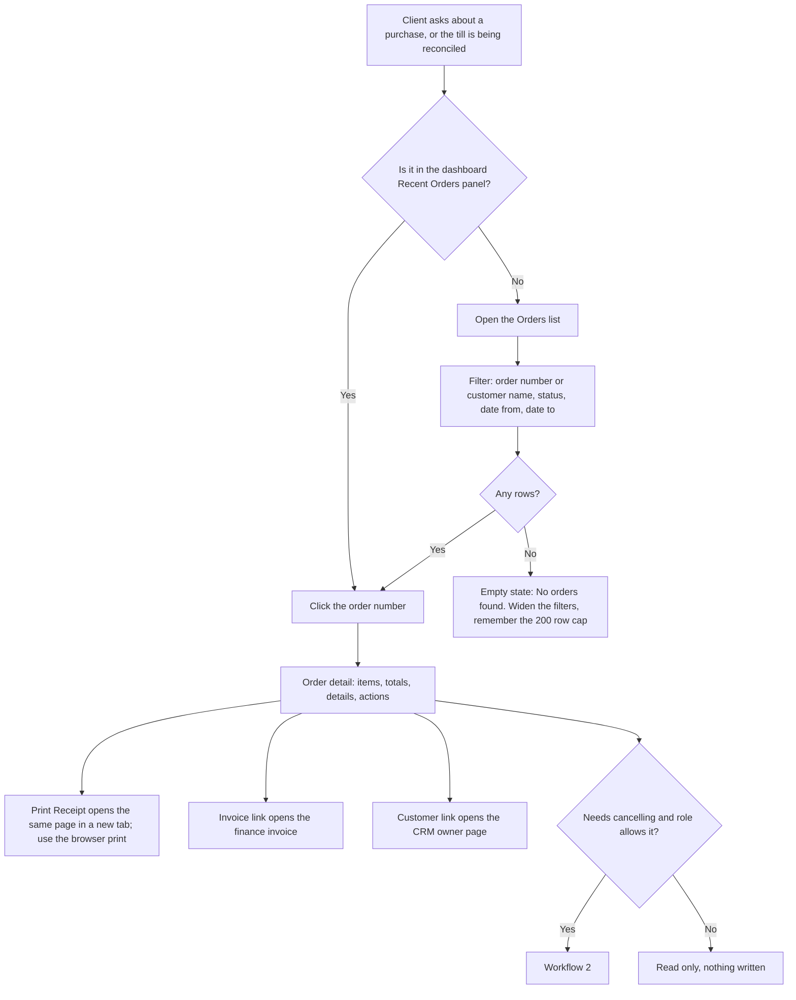
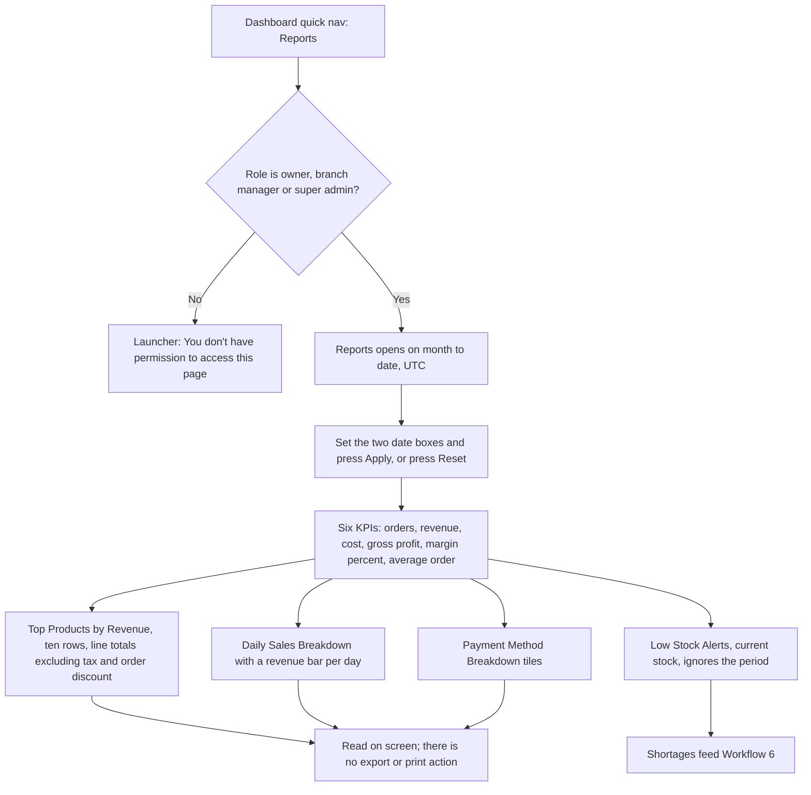

# Pet Shop — Retail Point of Sale, Products, Orders, Reports

**Module:** `petshop` · **URL prefix:** `/petshop/` · **Blueprint:** `blueprints/petshop/routes.py` · **Templates:** `templates/petshop/`

This chapter documents **only what the code does today**. Where a screen promises
something it does not deliver, that is written down as a limit, not as a feature.
Every section ends with a `Source` line so the next writer can check the claim.

---

## 0. Before you start

### 0.1 The nine screens and two JSON endpoints

| # | Screen | URL | What it is |
|---|--------|-----|------------|
| 1 | Pet Shop dashboard | `GET /petshop/` | KPIs, recent orders, low-stock panel, quick-nav |
| 2 | Products | `GET /petshop/products` | Catalogue grid + filters + inline stock adjust |
| 3 | New product | `GET\|POST /petshop/products/new` | Create a catalogue item |
| 4 | Edit product | `GET\|POST /petshop/products/<pid>/edit` | Re-price / correct an item |
| 5 | Stock adjust | `POST /petshop/products/<pid>/stock` | Action only — no page of its own |
| 6 | Categories | `GET\|POST /petshop/categories` | List + add + delete categories |
| 7 | Point of Sale | `GET /petshop/pos` | The till |
| 8 | Order create | `POST /petshop/orders/create` | JSON endpoint behind the Charge button |
| 9 | Orders | `GET /petshop/orders` | Sales history, filterable, 200-row cap |
| 10 | Order detail | `GET /petshop/orders/<oid>` | Receipt view |
| 11 | Cancel order | `POST /petshop/orders/<oid>/cancel` | Action only — no page of its own |
| 12 | Reports | `GET /petshop/reports` | Period trading review |
| 13 | Product search API | `GET /petshop/api/products/search` | JSON — **not called by any template** |
| 14 | Owner search API | `GET /petshop/api/owners/search` | JSON — used by the POS customer box |

Source: `blueprints/petshop/routes.py:187,217,247,291,332,361,402,439,457,642,666,718,815,832`

### 0.2 Who can open what

Two gates run, and **both** must pass:

1. **The module grant.** `login_required` checks that the signed-in role holds the
   `petshop` permission. Roles and their grants are editable on the Roles screen;
   the shipped defaults are below.
2. **The role list.** `role_required(...)` on the route narrows further. A grant can
   only ever narrow, never widen.

Source: `blueprints/auth/routes.py:59-69, 87-133, 165-192`

**Roles that hold the `petshop` grant out of the box:** `super_admin` (bypasses the
check entirely), `clinic_owner`, `branch_manager`, `reception`, `inventory_mgr`.
Source: `models/database.py:4330, 4346-4379`

| Screen | Extra role gate | Who can actually use it |
|--------|-----------------|-------------------------|
| Dashboard, Products list, POS, Orders, Order detail, Charge, both APIs | none | super_admin, clinic_owner, branch_manager, reception, inventory_mgr |
| New product, Edit product | `super_admin, clinic_owner, branch_manager, reception, support_admin` | super_admin, clinic_owner, branch_manager, reception |
| Stock adjust (+In / -Out) | `super_admin, clinic_owner, branch_manager, support_admin` | super_admin, clinic_owner, branch_manager |
| Categories | same | super_admin, clinic_owner, branch_manager |
| Cancel order | same | super_admin, clinic_owner, branch_manager |
| Reports | same | super_admin, clinic_owner, branch_manager |

`support_admin` appears in five of those decorators but its default grant set is
`["system","backup","audit","settings"]` — no `petshop` — so it is stopped by the
first gate and **cannot reach any pet shop screen as shipped**.
Source: `routes.py:248,292,333,362,667,719`; `models/database.py:4376`

**What being denied looks like:** a red flash `You don't have permission to access
this page.` and a redirect to the launcher (`/`). Nothing is written.
Source: `blueprints/auth/routes.py:126-133, 186-190`

**Important consequence for the front desk:** a `reception` user *sees* the `+ In` /
`- Out` buttons on the products page and the `❌ Cancel Order` button on an order —
neither is hidden by role — but pressing either bounces her to the launcher with the
permission flash. She must ask a branch manager or the owner.
Source: `templates/petshop/products.html:79-84`; `templates/petshop/order_detail.html:163-171`; `routes.py:333,667`

### 0.3 How to get in

- **Sidebar** — `Pet Shop / متجر الحيوانات` and `Point of Sale / نقطة البيع`. These two
  links are shown to **every** signed-in user with no role condition, so a doctor or a
  groomer will see them and be bounced on click.
  Source: `templates/base.html:201-210`
- **Launcher tile** — `🏪 Pet Shop & POS / متجر الحيوانات ونقطة البيع`, badge `Live`.
  The tile is filtered to `super_admin, clinic_owner, branch_manager, reception,
  finance, support_admin, staff`. That list disagrees with the real grants: `finance`,
  `support_admin` and `staff` get a tile that bounces them, and `inventory_mgr` — who
  genuinely has access — gets **no tile at all** and must use the sidebar or the URL.
  Source: `blueprints/launcher/routes.py:491-505, 579`
- **Direct URL** — `/petshop/`, `/petshop/pos`, etc.

### 0.4 Language: Arabic and English

The UI language comes from the signed-in user's `language` field, falling back to the
session, falling back to `PLATFORM_DEFAULT_LANG` (default `en`). It is switched by
`POST /settings/lang` with `lang=ar` or `lang=en` (the language control in the shell),
which also writes the choice onto the session user.
Source: `app.py:373-378, 406-408`; `blueprints/settings/routes.py:149-167`

Bilingual coverage in this module is **partial**. Fully bilingual: the dashboard, the
categories page, the orders list, and most of the order detail page. Still English-only
whatever the language setting:

- Page subtitles on POS, Products, Orders and Reports.
- `🛒 Cart`, `Tap a product to add it`, `Sale Complete!`, `+ New Sale`, the product
  search placeholder, the customer search placeholder, `Amount tendered (EGP)`, the
  `Change:` / `⚠️ Underpaid by` line, and every JavaScript `alert()` on the POS.
- The whole New/Edit Product form except `Category / الفئة`, `Description / الوصف`,
  `Unit / الوحدة`, `Tax Rate (%) / نسبة الضريبة (%)`, `Optional / اختياري` and
  `Cancel / إلغاء`.
- `Grand Total`, `Cash Tendered`, `Change`, `📋 Details`, `⚙️ Actions`, `❌ Cancel Order`
  on the order detail page.
- Every Reports KPI label and section title except `⚠️ Low Stock Alerts / تنبيهات نقص
  المخزون`, `Product / المنتج`, `Revenue / الإيرادات`, `Date / التاريخ`, `Orders / الطلبات`,
  `Stock / المخزون`, `Reorder At / إعادة الطلب عند`, `Apply / تطبيق`, `Reset / إعادة تعيين`.

Arabic *data* is stored where the form offers it: `Product Name (AR)` and category
`Name (AR)` are `dir="rtl"` inputs. **Neither is ever displayed** — the products grid,
the POS tiles, the category list and the receipt all render the English `name`.
Source: `templates/petshop/product_form.html:42-46`; `categories.html:92-95`; `products.html:71`; `pos.html:109`

### 0.5 Money, dates and numbering

- **Currency** is EGP everywhere, printed as a suffix (`1,250.00 EGP`). There is no
  currency selector in this module.
- **Amounts are stored as SQLite `REAL`.** Every money value is rounded to 2 decimals at
  the write. A code note records that ~66% of VAT-bearing sales would store a total not
  representable to 2 dp, currently harmless only because all shipped tax rates are 0.
  Source: `routes.py:485-489`; `docs/MONEY_PRECISION.md`
- **Dates are UTC.** "Today" on the dashboard is the UTC day, and the reports/orders date
  filters compare `date(created_at)` in UTC. Cairo runs UTC+2/+3, so a sale rung up at
  01:30 Cairo time falls into the **previous** day's figures.
  Source: `routes.py:191-196, 725-726`
- **Order numbers** look like `PS-202608-0042`. The last part is the next `ps_orders`
  row id, **not** a per-month counter, so it never resets: the first sale of September
  after 41 August sales is `PS-202609-0042`.
  Source: `routes.py:127-134`
- **Invoice numbers** created by the finance bridge look like `INV-2026-00042`.
  Source: `models/database.py:3572-3576`
- **Walk-in customer.** A counter sale with no customer selected is billed in finance to
  a shared owner record literally named `Walk-in Customer`, created automatically the
  first time it is needed and thereafter reused. It appears in the CRM owners list.
  Source: `routes.py:137-163`

### 0.6 The security token

Every POST carries a CSRF token — hidden `_csrf_token` field on the HTML forms, an
`X-CSRF-Token` header from the POS. If it is missing or stale (typically: the page sat
open past the session timeout), the server answers 403 with the error page
`Invalid or missing security token. Please go back and try again.`
Fix: reload the page and repeat the action.
Source: `models/security.py:270-283`; `app.py:350-357`

---

## Workflow 1 — Counter sale (POS checkout)

### 1.1 Who, when, why

The receptionist or shop staffer on the counter, every time a client buys food, a
collar, shampoo or a supplement — whether they came for a consultation or walked in off
the street. Roles that can do it: **super_admin, clinic_owner, branch_manager,
reception, inventory_mgr**. The goal is one keystroke-light screen that takes the money,
prints a number, moves the stock and puts the revenue in the clinic's books in one go.

### 1.2 Preconditions

- You are signed in and your role holds the `petshop` grant (§0.2).
- **At least one product exists with `stock_qty` greater than zero.** The POS grid is
  built from `is_active=1 AND stock_qty > 0` only — a product at zero stock is not shown
  at all, not even greyed out. If the grid is empty, do Workflow 3 or Workflow 5 first.
  Source: `routes.py:443-448`
- Categories are optional. With none defined, the only pill is `All / الكل`.
- To attach the sale to a named client, that owner must already exist in CRM. **The POS
  cannot create a customer.**

### 1.3 The happy path

Worked example: **Mona Abdel-Rahman** of Nasr City buys 2 bags of Royal Canin Adult Cat
Food 2 kg at 780.00 EGP and one Bravecto tick collar at 165.00 EGP, and pays 1,800 EGP
in cash.

1. **Open the till.** Sidebar → `Point of Sale / نقطة البيع`, or from the dashboard press
   the orange topbar button `🛒 New Sale (POS) / 🛒 عملية بيع جديدة (نقطة البيع)`, or from
   the orders list / an order page press `🛒 New Sale / 🛒 عملية بيع جديدة`.
   *You see:* a two-pane screen. Left = search box, category pills, product tiles.
   Right = an empty cart card showing `🛒` and `Tap a product to add it`, a totals block
   reading `0.00 EGP`, four payment buttons with **Cash** already highlighted, and a
   greyed-out `✅ Charge — 0.00 EGP` button.
   Source: `templates/petshop/pos.html:80-169`

2. **Find the product.** Either press a category pill (`All / الكل`, `Dog Food`,
   `Accessories`, …) or type into the search box
   `🔍  Search product by name, SKU, or barcode…`.
   *You see:* tiles hide and show as you type. Each tile shows an emoji picked from the
   product name (🥩 food, 🧴 shampoo, 🦮 collar, 🧸 toy, 💊 supplement/vitamin, 📦 anything
   else), the product name, the price to 2 dp, and `Stock: 14 bag`.
   ⚠️ **The box only matches the product name** despite what the placeholder says — see
   §1.6. Type `royal`, not the SKU.
   Source: `pos.html:85-113, 201-211`

3. **Add to the cart.** Tap the `Royal Canin Adult Cat Food 2kg` tile once.
   *You see:* the empty-cart message disappears; a line appears reading
   `Royal Canin Adult Cat Food 2kg  − 1 +  780.00 EGP  ×`. Subtotal becomes
   `780.00 EGP`, `TOTAL / الإجمالي` becomes `780.00 EGP`, and the Charge button lights up
   reading `✅ Charge — 780.00 EGP`.
   Source: `pos.html:214-258`

4. **Set the quantity.** Tap the tile again (or press `+` on the cart line) to make it 2.
   *You see:* the line reads `− 2 +  1,560.00 EGP`; the Charge button follows.
   The `+` stepper stops at the tile's stock figure — you cannot put 15 bags in the cart
   when the tile says `Stock: 14 bag`.
   Source: `pos.html:223-229, 260-265`

5. **Add the second product.** Tap the `Bravecto Tick Collar` tile.
   *You see:* a second cart line at `165.00 EGP`; `Subtotal / المجموع الفرعي` 1,725.00 EGP;
   `Tax / الضريبة` 0.00 EGP; `TOTAL / الإجمالي` 1,725.00 EGP.

6. **Attach the customer (optional).** Type `منى` or `Mona` or her phone number into
   `👤 Search customer (optional)…`. After a ~300 ms pause a dropdown lists up to 10
   matches as `Mona Abdel-Rahman — 01001234567`. Click hers.
   *You see:* the box now holds her name; the dropdown closes.
   Source: `pos.html:146-150, 298-335`; `routes.py:832-842`

7. **Choose the payment method.** `Cash` is already selected. (For Card / Transfer /
   Instapay see §1.4.)

8. **Enter what she handed over.** Type `1800` into `Amount tendered (EGP)`.
   *You see:* a green line under the box: `Change: 75.00 EGP`.
   Source: `pos.html:160-161, 284-288`

9. **Charge.** Press `✅ Charge — 1,725.00 EGP`.
   *You see:* the button greys and reads `Processing…`, then a modal appears:
   ✅ **Sale Complete!** — `Order: PS-202608-0042`, `Total: 1725.00 EGP`,
   `Change: 75.00 EGP`, with two buttons: `🖨️ Print Receipt / 🖨️ طباعة الإيصال` and
   `+ New Sale`.
   Source: `pos.html:171-182, 337-375`

10. **Give the change and the receipt.** `🖨️ Print Receipt` opens the order detail page
    in a **new browser tab** — it is the ordinary order page, not a till-roll layout. Use
    the browser's own print (Ctrl+P) from there. See §1.6.
    Source: `pos.html:178, 372`; `routes.py:642-663`

11. **Next customer.** Press `+ New Sale`. The modal closes and the screen is wiped:
    cart empty, discount back to 0, tendered box cleared, customer box and hidden
    customer id cleared.
    Source: `pos.html:377-385`

### 1.4 Every alternative that genuinely branches

**A. Walk-in versus named customer.**
Leave the customer box empty and the sale is a walk-in. `ps_orders.owner_id` stays NULL,
so the orders list and the order page show `Walk-in / عميل عابر`. In finance, though, the
invoice must be billed to somebody, so it is billed to the shared auto-created owner
`Walk-in Customer`. Named customer selected → the order links to her CRM record and the
invoice is raised in her name, so it also shows on her owner page.
Source: `routes.py:568-570, 137-163`; `templates/petshop/orders.html:74-80`

**B. Cash versus Card / Transfer / Instapay.**
- **Cash**: the `Amount tendered (EGP)` box matters. Change is computed and stored.
- **Card, Transfer, Instapay**: the tendered box and the change line are ignored — the
  change line is only ever drawn for Cash. The server **forces `paid_amount = total`**
  for any non-Cash method, so the finance invoice is settled in full and never left
  hanging. Change is 0.
  Source: `routes.py:503-510`; `pos.html:284-288`

**C. Exact cash versus over-tender.**
Tender exactly 1,725.00 → change 0.00; the order page will then show **no** `Cash
Tendered` / `Change` rows, because those two rows are drawn only when the method is cash
*and* `paid_amount > total`. Over-tender → both rows appear.
Source: `templates/petshop/order_detail.html:93-102`

**D. Giving a discount.**
Type into the small `Discount / الخصم` box in the totals block (EGP, not %). The total
updates live. The order-level discount is stored on the order **and** passed to the
invoice as a value discount, so the client is billed the discounted amount. The server
clamps it to the range 0…subtotal.
Source: `pos.html:135-139`; `routes.py:500-501, 574-583`

**E. Per-line discounts and pet, notes, payment reference.**
The endpoint accepts `discount` per line, `pet_id`, `notes` and `payment_ref`. **The POS
never sends any of them** — it hardcodes per-line `discount: 0`, `source: 'in-clinic'`,
and sends no pet, notes or reference. There is no UI in this module to set them.
Source: `pos.html:356-366`; `routes.py:463-471`

**F. One item versus many; changing your mind.**
`−` reduces a line and removes it at zero. `×` deletes the line outright. `Clear / مسح`
in the cart header empties the whole cart. All three re-total instantly.
Source: `pos.html:247-268`

**G. Arabic interface.**
With `lang=ar` the totals labels, `Clear / مسح`, `EGP / جنيه`, the topbar buttons and the
Print Receipt label switch to Arabic; the cart header, the two search placeholders, the
tendered box, the change line, `Sale Complete!` and `+ New Sale` stay English (§0.4).
Product names on the tiles are always the English `name` even when an Arabic name was
entered.

**H. A second till selling the same last unit.**
Two cashiers can both have the last bag on screen. The one who presses Charge second is
refused — see §1.5, error 5. Nothing is half-written: the order insert, the lines and the
stock deduction are one transaction.
Source: `routes.py:514-563`

### 1.5 Errors and edge cases — exact messages

1. **Empty cart.** The `✅ Charge` button is disabled while the cart is empty, and
   `submitOrder()` returns immediately if it is somehow pressed. Nothing happens, no
   message. Source: `pos.html:236-239, 339`

2. **Cash tendered is less than the total.** A browser alert, in English regardless of
   language:
   > `Amount tendered is less than total. Please enter the correct amount.`

   The sale is not sent. Note the check is skipped entirely for Card/Transfer/Instapay.
   Source: `pos.html:348-351`

3. **No items reached the server** (e.g. a hand-crafted request): HTTP 400 with
   `{"error": "No items"}`, surfaced by the POS as an alert `Error: No items`.
   Source: `routes.py:474-475, 369`

4. **A line with a zero or negative quantity:** HTTP 400,
   > `Every line needs a quantity greater than zero.`

   Shown as `Error: Every line needs a quantity greater than zero.` This cannot be
   produced by the stepper — it is the guard that stops a negative quantity minting stock.
   Source: `routes.py:477-483`

5. **Sold out between loading the screen and pressing Charge:** HTTP 409, alert text:
   > `Error: Royal Canin Adult Cat Food 2kg is out of stock — another till may have just sold the last one. Refresh and try again.`

   **The whole sale is rolled back** — no order, no stock movement, no invoice. Reload
   the POS (F5) to get true stock figures and ring it up again.
   Source: `routes.py:547-563, 624-630`

6. **Anything else failing server-side:** HTTP 500 with the deliberately generic
   > `The sale could not be completed. Nothing was charged.`

   The real exception goes to the application log, not to the counter.
   Source: `routes.py:631-637`

7. **Session expired / stale security token while the POS tab sat open.** The POST does
   not come back as JSON, so the browser shows
   `Network error: SyntaxError: ...` (the exact tail varies by browser). Reload the page,
   sign in again, and ring the sale up again. Nothing was charged.
   Source: `pos.html:374`; `app.py:350-357`; `blueprints/auth/routes.py:61-64`

8. **After any rejected sale the Charge button loses its amount.** The error handler
   rewrites the button's text to `✅ Charge`, which destroys the `` holding the
   running total; from that point the button no longer shows an amount and the
   `Change:` line stops updating, until the page is reloaded. **Reload the POS after
   every rejected sale.** Source: `pos.html:369, 282-288`

9. **Discount larger than the sale.** The till displays `0.00` and lets you charge; the
   server silently clamps the discount to the subtotal. With the shipped 0% tax rates
   the result is a real order for `0.00 EGP` with status `paid`, and — because nothing
   was tendered — **no payment row, so its invoice stays `Unpaid` at 0.00 EGP**. Avoid;
   there is no way to delete the order, only to cancel it (Workflow 2).
   Source: `routes.py:500-501, 274-289`; `models/database.py:3607-3608`

10. **Changing your mind about the customer.** Selecting an owner writes a hidden id.
    Clearing the customer text box afterwards does **not** clear that hidden id — the sale
    will still be attached to the owner you picked. To detach: reload the page, or finish
    the sale and press `+ New Sale`. Source: `pos.html:300-332, 377-385`

11. **A product priced 0.00.** Nothing stops it. It rings up as a 0.00 line and, if the
    whole sale is 0.00, behaves like case 9.

### 1.6 Known limits of this workflow

- **The POS search box does not search SKU or barcode**, though the placeholder says it
  does. The filter matches the tile's product name only. There is **no barcode-scanner
  support**: no Enter/keydown handler exists, and the endpoint that would do a real
  SKU/barcode lookup, `/petshop/api/products/search`, is never called by any template.
  Source: `pos.html:85, 201-211`; `routes.py:815-827`
- **`🖨️ Print Receipt` is not a print view.** Both the modal link and the button on the
  order page open the ordinary order detail page in a new tab; the route ignores query
  arguments, and there is no receipt template anywhere in `templates/petshop/`.
  Source: `pos.html:372`; `order_detail.html:158`; `routes.py:642-663`
- **Product names are inserted into the cart as HTML.** A product name containing `<`
  or `>` will render as markup in the cart line. Keep catalogue names plain.
  (The *customer* dropdown is built safely with DOM nodes and is not affected.)
  Source: `pos.html:244-253` vs `pos.html:309-322`
- Out-of-stock tile styling exists (`.prod-tile.out`) but is unreachable, because the
  query already excludes zero-stock products. Source: `pos.html:34, 96`; `routes.py:447`
- If the finance bridge fails, the sale still succeeds and the cashier is told nothing;
  the order simply shows `Not invoiced / بدون فاتورة` on its detail page. The failure is
  logged as a warning. Source: `routes.py:617-621`; `order_detail.html:131-136`

### 1.7 What gets written, and what changes elsewhere

Inside one transaction (`routes.py:514-563`):

| Table | Row |
|-------|-----|
| `ps_orders` | 1 row: `order_number`, `owner_id` (NULL for walk-in), `pet_id` NULL, `source='in-clinic'`, **`status='paid'`**, `subtotal`, `discount_amount`, `tax_amount`, `total`, `paid_amount`, `change_amount`, `payment_method`, `served_by` = your username |
| `ps_order_items` | 1 row per cart line: `product_name`, `qty`, `unit_price`, `discount`, `tax_rate`, **`unit_cost` snapshotted from the product's cost price at this moment**, `line_total` (net of line discount, **excluding tax**) |
| `ps_products` | `stock_qty` reduced, via `UPDATE … WHERE stock_qty >= qty` — the update that refuses rather than overselling |
| `ps_stock_movements` | 1 row per line: `movement='out'`, `ref_type='sale'`, `ref_id` = order id, `created_by` = your username |

Then the **finance bridge** (`routes.py:566-621`, non-fatal):

| Table | Row |
|-------|-----|
| `owners` | `Walk-in Customer` created on first walk-in sale only |
| `invoices` | 1 row, `INV-YYYY-#####`, billed to the selected owner or to Walk-in Customer, notes `Pet Shop Order PS-…`, value discount = the order discount |
| `invoice_lines` | 1 row per item, `line_type='product'`, line total **including** its tax |
| `payments` | 1 row when anything was paid, amount `min(paid, total)`, method as chosen, reference = the order number — which flips the invoice to `Paid` (or `Partial`) |
| `ps_orders.invoice_id` | updated with the new invoice id |
| audit log | `order_created`, module `petshop`, entity `ps_order` |

Source: `models/database.py:3578-3618, 3911-3938`; `models/payments/__init__.py:463-466`

**Screens that change immediately:**

- **Pet Shop dashboard** — `Sales Today`, `Revenue Today` rise; `Low Stock Items` may
  rise; the sale appears at the top of `🧾 Recent Orders`.
- **Orders list** — new row at the top.
- **Products page** and **POS grid** — stock figures drop; an item at or below its
  reorder level turns red with `⚠️`, and drops off the POS grid entirely at zero.
- **Reports** — order count, revenue, cost, profit, top products, daily and payment
  breakdowns all include it.
- **Finance** — a new invoice, paid; **CRM owner page** — for a named customer.

### 1.8 Flowchart

---

## Workflow 2 — Cancel a sale and restore stock

### 2.1 Who, when, why

A **branch manager, clinic owner or super_admin** — never reception on her own. Used when
a sale was rung up wrongly (wrong product, wrong quantity, wrong customer, duplicate
charge) or the client changed their mind at the counter. It is the module's **only**
reversal: there is no refund flow and no partial return.

### 2.2 Preconditions

- The order exists and its status is `paid`. The cancel button is only rendered for
  `paid` orders, and the server also skips anything already `cancelled` or `refunded`.
- You know how to find the order — Workflow 8.
- Your role is in the cancel list (§0.2).

Source: `templates/petshop/order_detail.html:163-175`; `routes.py:667-671`

### 2.3 The happy path

Worked example: cancelling `PS-202608-0042` — the cashier charged 2 bags when Mona only
took 1, so the whole sale is cancelled and re-rung.

1. **Find the order.** Dashboard → `🧾 Recent Orders` → click `PS-202608-0042`; or
   sidebar → `Pet Shop` → quick-nav `Orders` → click the order number or `View → / عرض ←`.
   *You see:* the order detail page. Left: `🧾 Order Items / 🧾 بنود الطلب` with Product,
   Qty, Unit Price, Line Total. Right: `💰 Totals / 💰 الإجماليات`, `📋 Details`
   (status pill `paid`, customer, invoice link, payment method, date), and `⚙️ Actions`.
2. **Press the red button** `❌ Cancel Order` in the `⚙️ Actions` card.
   *You see:* a browser confirm dialog, English only:
   > `Cancel this order and restore stock?`
3. **Press OK.**
   *You see:* the same order page reloads with a green flash
   `Order cancelled and stock restored.`; the status pill is now red `cancelled`; the
   page subtitle reads `… · Cancelled`; the `⚙️ Actions` card no longer offers cancelling
   and shows the grey box `Order has been cancelled`; `🖨️ Print Receipt` remains.
4. **If the goods are going back on the shelf, nothing more to do** — stock was already
   added back. Re-ring the corrected sale in the POS as a fresh order.

Source: `routes.py:666-713`; `order_detail.html:154-177`

### 2.4 Alternatives

**A. Invoiced versus not invoiced.**
If the order carries an `invoice_id` (the normal case), the cancel also sets that invoice
to `Cancelled` and writes a **negative reversing payment row for each positive payment**
on it — the original payment row is deliberately kept, so the audit trail still says the
money was taken and the pair nets to zero. If the finance bridge had failed at sale time
and the order shows `Not invoiced / بدون فاتورة`, only the order status and the stock are
touched. Source: `routes.py:676-703`

**B. Walk-in versus named customer.** No difference to the mechanics. For a named
customer, her CRM/finance view now shows a cancelled invoice.

**C. Reception tries to cancel.** She sees the button (it is not role-hidden), confirms
the dialog, and is redirected to the launcher with the red flash
`You don't have permission to access this page.` **Nothing is changed** — no status
change, no stock movement. Escalate to a manager.
Source: `routes.py:667`; `blueprints/auth/routes.py:186-190`

**D. Partial return — one item out of three.** **Not supported.** Cancel is
all-or-nothing. The workaround is to cancel the whole order and ring up a new sale for
the items actually kept.

**E. Refunds.** Status `refunded` is excluded by every dashboard and report query, but
**no route ever sets it**. There is no refund screen, button or endpoint in this module.

### 2.5 Errors and edge cases

- **Order id does not exist:** `Order not found.` (red flash) and you land on the orders
  list. Source: `routes.py:650-654`
- **Order already cancelled:** the button is not rendered. If the POST is repeated
  anyway (a stale tab, the back button), the server skips the work but **still flashes
  the success message** `Order cancelled and stock restored.` — nothing is
  double-restored, but the message is misleading. Check the stock movements before
  believing a second confirmation. Source: `routes.py:669-711`
- **Cancelling with the CSRF token stale:** the 403 error page
  `Invalid or missing security token. Please go back and try again.` Reload the order page
  and try again.
- **The stock restore is unconditional** — `stock_qty = stock_qty + qty`. If the product
  was sold and restocked in between, the figure simply goes up by that quantity again;
  it is a ledger entry, not a recount.
- **The reversal does not delete anything.** Both the original and the reversing payment
  stay visible in finance. That is deliberate.

### 2.6 What gets written, and what changes elsewhere

| Table | Change |
|-------|--------|
| `ps_orders` | `status='cancelled'`, `updated_at` stamped |
| `invoices` | when linked: `status='Cancelled'`, `updated_at` stamped |
| `payments` | when linked: one negative row per positive payment, reference `Reversal of pet shop order <id>`, `received_by` = your username, `received_at` = local time |
| `ps_products` | `stock_qty` increased by each line's qty |
| `ps_stock_movements` | one `movement='in'`, `ref_type='cancellation'`, `ref_id` = order id per line |
| audit log | `order_cancelled` |

Source: `routes.py:672-711`

**Screens that change:** the dashboard KPIs `Sales Today` / `Revenue Today` drop (both
exclude cancelled); `Low Stock Items` may fall as stock returns; the order keeps
appearing in `🧾 Recent Orders` with a red `cancelled` pill (that panel is **not**
status-filtered); the orders list shows it as `cancelled` and it can be isolated with the
`Cancelled` status filter; the products page and POS grid show the restored stock;
Reports drop it from every figure; Finance shows the invoice as Cancelled with a zeroed
payment pair.
Source: `routes.py:191-200, 199-201`; `templates/petshop/dashboard.html:65-88`

### 2.7 Flowchart

---

## Workflow 3 — Add a product to the catalogue

### 3.1 Who, when, why

**super_admin, clinic_owner, branch_manager or reception** — reception is included here
even though she cannot adjust stock afterwards. Done when a new line arrives from a
supplier, or when first loading the shop into the system.

### 3.2 Preconditions

- Your role can reach the form (§0.2).
- Categories are optional but easier to create first (Workflow 7) — the form's
  `Category / الفئة` dropdown offers only what already exists, plus `— No Category —`.
- Know the sell price. It is the only mandatory field besides the English name.

### 3.3 The happy path

Worked example: **Royal Canin Adult Cat Food 2 kg**, bought at 610.00 EGP, sold at
780.00 EGP, 12 bags delivered today, alert when 3 or fewer remain.

1. **Open the form.** Dashboard topbar `+ Add Product / + إضافة منتج`, or the same button
   on the products page, or `Add First Product` from the empty products state.
   *You see:* a single card titled `New Product`, subtitle
   `Add a new product to the pet shop catalog`, with four sections and a topbar link
   `← Products`.
2. **📦 Basic Information.**
   - `Product Name (EN) *` — required. Type `Royal Canin Adult Cat Food 2kg`.
     Placeholder shows `e.g. Royal Canin Adult Cat Food`.
   - `Product Name (AR)` — optional, right-to-left. Type `رويال كانين للقطط البالغة ٢ كجم`.
     (Stored, but never displayed anywhere — §0.4.)
   - `SKU / Code` — optional but **unique** if given. `RC-CAT-ADULT-2KG`.
   - `Barcode` — optional, placeholder `Optional / اختياري`.
   - `Brand` — `Royal Canin`.
   - `Category / الفئة` — pick `Cat Food` or leave `— No Category —`.
   - `Description / الوصف` — free text.
3. **🐾 Species & Unit.**
   - `Species Applicability` — `All`, `Dog`, `Cat`, `Bird`, `Rabbit`, `Fish`, `Exotic`.
     Defaults to `All`. Pick `Cat`.
   - `Unit / الوحدة` — `unit`, `bag`, `bottle`, `box`, `pack`, `kg`, `gram`, `litre`,
     `ml`, `piece`, `pair`, `set`. Defaults to `unit`. Pick `bag`.
4. **💰 Pricing.**
   - `Cost Price (EGP)` — `610`.
   - `Sell Price (EGP) *` — required — `780`.
   - `Tax Rate (%) / نسبة الضريبة (%)` — hint `0 = tax-free`. Leave `0` unless the clinic
     has switched pet-shop VAT on.
5. **📊 Stock.**
   - `Opening Stock Qty` — `12`. Hint: `Recorded as opening stock movement`.
     **This box only appears when creating.**
   - `Reorder Level (alert when ≤)` — `3`. Defaults to `5`.
6. **Press `➕ Create Product`.**
   *You see:* the products list with a green flash
   `Product 'Royal Canin Adult Cat Food 2kg' created.` and the new card in the grid,
   showing the `cat` badge, name, `SKU: RC-CAT-ADULT-2KG`, `Royal Canin`, `780.00 EGP`,
   `Cost: 610.00 EGP | Margin: 22%`, the stock-adjust row, and `✓ 12 bag` in green.
7. The product is **immediately sellable at the POS**, because its stock is above zero.

Source: `routes.py:247-288`; `templates/petshop/product_form.html:29-163`

### 3.4 Alternatives

- **No opening stock.** Leave `Opening Stock Qty` at `0`. The product is created, appears
  in the catalogue with `⚠️ 0 unit` in red, is counted in `Active Products` and in
  `Low Stock Items`, and is **invisible at the POS** until stock is added (Workflow 5).
- **No SKU / no barcode.** Both optional. An empty SKU is stored as NULL, so any number
  of products may have none; the `SKU:` line is simply not drawn on the card.
- **No category.** Choose `— No Category —`. The product then never appears under a
  category pill at the POS, only under `All / الكل`.
- **Species `all` versus a specific species.** The products page species filter matches
  `species = <chosen> OR species = 'all'`, so an `all` product shows under every species
  filter. The POS ignores species entirely.
  Source: `routes.py:231-233`
- **Arabic interface.** The form stays almost entirely English (§0.4); only `Category`,
  `Description`, `Unit`, `Tax Rate (%)`, the barcode placeholder and `Cancel` translate.
- **Cancel.** The `Cancel / إلغاء` link next to the save button returns to the products
  list without writing anything.

### 3.5 Errors and edge cases

- **Missing name or sell price:** the browser blocks the submit on the `required`
  attributes; no server round-trip, no flash.
- **Duplicate SKU:** the insert violates the UNIQUE index and you get a red flash
  beginning `Error:` followed by the database's own words, e.g.
  `Error: UNIQUE constraint failed: ps_products.sku`.
  ⚠️ **The form re-renders empty — everything you typed is lost.** Note your values
  before submitting a risky SKU. Source: `routes.py:283-288`
- **A non-numeric reorder level or price** (only reachable outside the browser's number
  inputs) gives the same `Error: …` flash with the Python conversion error.
- **Opening stock of 0** writes no stock movement at all; only quantities above zero do.
  Source: `routes.py:271-277`
- **Negative opening stock:** the input has `min="0"`, and the create path does not
  re-check. Do not bypass it.
- **Two products with the same name** are allowed (only SKU is unique). They will be
  indistinguishable on the POS tiles.

### 3.6 What gets written, and what changes elsewhere

| Table | Row |
|-------|-----|
| `ps_products` | 1 row; `is_active` defaults to 1; `stock_qty` = the opening quantity; `created_at`/`updated_at` stamped |
| `ps_stock_movements` | 1 row **only if** opening qty > 0: `movement='in'`, `ref_type='opening_stock'`, `created_by` = your username |
| audit log | `product_created` |

**Screens that change:** dashboard `Active Products` +1, and `Low Stock Items` +1 if the
opening quantity is at or below the reorder level; the products grid; the POS tile grid
(if stock > 0); the category's product count on the categories page — which also means
that category can no longer be deleted; the reports low-stock panel.

### 3.7 Flowchart

---

## Workflow 4 — Re-price or correct a product

### 4.1 Who, when, why

**super_admin, clinic_owner, branch_manager, reception.** A supplier raises a price, a
brand is misspelt, a category was wrong, or the alert threshold needs moving.

### 4.2 Preconditions

The product exists and is active. There is no way to reach a deactivated product — see
§4.5.

### 4.3 The happy path

Worked example: Royal Canin's price goes from 780.00 to 845.00 EGP and cost from 610.00
to 665.00 EGP; the alert threshold moves from 3 bags to 5.

1. **Find the product.** Sidebar → `Pet Shop` → quick-nav `Products` (or the topbar
   `📦 Products / 📦 المنتجات` from the categories page). Use the filter bar:
   `Search by name, SKU, barcode…`, `All Categories / جميع الفئات`, `All Species`, then
   `Search / بحث`. `Clear / مسح` appears once any filter is set.
   *You see:* `1 product(s) found` and the matching card.
2. **Press `Edit / تعديل`** at the bottom-right of the card.
   *You see:* the same form as Workflow 3, but titled `Edit Product` with the product
   name as the subtitle, every field pre-filled, the save button reading
   `💾 Save Changes`, and **no `Opening Stock Qty` box**.
3. **Change what you need** — here `Cost Price (EGP)` → `665`, `Sell Price (EGP) *` →
   `845`, `Reorder Level (alert when ≤)` → `5`.
4. **Press `💾 Save Changes`.**
   *You see:* the products list with a green flash `Product updated.`; the card now reads
   `845.00 EGP`, `Cost: 665.00 EGP | Margin: 21%`, and turns red with `⚠️` if the stock is
   now at or below the new reorder level.

Source: `routes.py:291-329`; `product_form.html:138-156`

### 4.4 Alternatives

- **Changing the quantity here is impossible by design.** The `Opening Stock Qty` box is
  hidden when editing (``) and the UPDATE statement does not touch
  `stock_qty`. Quantity moves only through Workflow 5, so every change leaves a movement
  row. Source: `product_form.html:138-144`; `routes.py:311-320`
- **Reorder level** is editable here, and it is the number that drives every low-stock
  alert — this is the screen for tuning noisy alerts.
- **Moving a product between categories** frees the old category for deletion once its
  count reaches zero (Workflow 7).
- **Turning tax on for one product.** Set `Tax Rate (%)`. It applies to sales made from
  then on: the POS reads the rate off the tile and the line stores its own `tax_rate`, so
  historical orders are unaffected. Read the money-precision caveat in §0.5 first.
- **Arabic interface:** as in Workflow 3, the form is mostly English.

### 4.5 Errors and edge cases

- **Product id does not exist:** red flash `Product not found.` and you land on the
  products list. Source: `routes.py:296-300`
- **Duplicate SKU on save:** red flash `Error: UNIQUE constraint failed: ps_products.sku`.
  Unlike the create form, the edit form re-renders with the **database's** values — your
  unsaved typing is lost but the record is untouched. Source: `routes.py:322-328`
- **Emptying the SKU box** stores NULL, which is allowed and releases that SKU for reuse.
- **There is no delete and no deactivate.** No route ever writes `is_active = 0`, and
  both the catalogue and the POS filter on `is_active = 1`. A discontinued line can only
  be hidden by editing the database directly. The practical alternative is to set its
  stock to zero (Workflow 5), which removes it from the till but leaves it in the
  catalogue and in `Active Products`. Source: `routes.py:222, 447`
- **Editing does not touch past orders.** Line names, prices and unit costs were
  snapshotted at sale time, so re-pricing never rewrites a closed month.
  Source: `routes.py:534-545`

### 4.6 What gets written, and what changes elsewhere

`ps_products`: `category_id, name, name_ar, sku, barcode, brand, species, description,
cost_price, sell_price, tax_rate, reorder_level, unit, updated_at`. **Not** `stock_qty`,
**not** `is_active`. Plus an audit entry `product_updated`.

**Screens that change:** the products grid (price, margin, low-stock styling); the POS
tile price and tax for future sales; the dashboard and reports low-stock panels if the
reorder level moved; the categories page counts if the category changed. Existing orders,
invoices and reports for past periods are unaffected.

### 4.7 Flowchart

---

## Workflow 5 — Receive a delivery or correct the count

### 5.1 Who, when, why

**super_admin, clinic_owner, branch_manager only.** Reception can see the buttons but
cannot use them. Run it when a supplier delivery arrives, after a shelf count, or when
something is damaged, expired or taken for clinic use.

### 5.2 Preconditions

- The product already exists (Workflow 3).
- You are on the products page, which is where the form lives — there is no separate
  stock screen and no stock-movement history screen anywhere in this module.

### 5.3 The happy path

Worked example: 20 more bags of Royal Canin arrive from the Cairo distributor.

1. **Open `Products`** — sidebar `Pet Shop` → quick-nav `Products`.
2. **Find the card.** Type `royal` in `Search by name, SKU, barcode…` and press
   `Search / بحث`. (Unlike the POS, **this** search really does match name, SKU and
   barcode.) Source: `routes.py:225-228`
3. **Type the quantity** into the small number box on the card — it starts at `1`, minimum
   `1`.
4. **Press the green `+ In`.**
   *You see:* the products page reloads with a green flash `Stock updated.`, the card's
   footer now reads `✓ 32 bag`, and the red `⚠️` low-stock styling clears if the new level
   is above the reorder level.
5. **Taking stock out** — breakage, expiry, clinic use — is the same but with the red
   `- Out` button. An out-movement is floored at zero: taking 40 out of 32 leaves 0, not
   −8.

Source: `routes.py:332-356`; `templates/petshop/products.html:79-84`

### 5.4 Alternatives

- **`+ In` versus `- Out`** — the only two movement types this form writes; both are
  recorded with `ref_type='manual_adjustment'`.
- **Emptying the shelf deliberately** — `- Out` the whole quantity to remove a product
  from the POS grid without deleting it (§4.5).
- **Correcting a count after stock-take** — there is no "set to N" action. Work out the
  difference and post it as an In or an Out.
- **Notes.** The route accepts a `notes` field and stores it on the movement, but
  **the form has no notes input**, so movements from this screen always carry an empty
  note. Source: `routes.py:337, 349-352`; `products.html:79-84`
- **Arabic interface:** the buttons `+ In` and `- Out` and the flash `Stock updated.` are
  English in both languages.

### 5.5 Errors and edge cases

- **Empty quantity box:** red flash `Enter a quantity greater than zero.` and back to the
  products page. Nothing is written. Source: `routes.py:334-338`
- **Zero or a negative typed in:** same message.
- **Something that is not a number** (possible only outside the browser's number input):
  red flash `“abc” is not a valid quantity.` — the typed text is quoted back at you.
  Source: `models/money.py:71-82`
- **Reception presses `+ In`:** redirect to the launcher with
  `You don't have permission to access this page.` Nothing is written.
- **Fractional quantities.** The parser accepts decimals (`2.5`) and the movement row
  stores a REAL, but `ps_products.stock_qty` is an INTEGER column, so a fractional
  adjustment will not survive as typed. Post whole numbers.
  Source: `routes.py:64` (`stock_qty INTEGER`), `routes.py:334`
- **Out below zero** is clamped by `MAX(0, stock_qty - qty)` — the movement row still
  records the full quantity you asked for, so a big Out can leave the movement log and
  the stock level disagreeing. Post the real figure.
  Source: `routes.py:344-345`
- **Adjusting stock while a POS tab is open elsewhere** does not update that tab; the
  cashier's tile still shows the old figure until they reload. The Charge-time check is
  what protects the shop.

### 5.6 What gets written, and what changes elsewhere

| Table | Change |
|-------|--------|
| `ps_products` | `stock_qty` + qty, or `MAX(0, stock_qty - qty)` |
| `ps_stock_movements` | 1 row: `movement` = `in`/`out`, `ref_type='manual_adjustment'`, `notes` (always empty from this screen), `created_by` = your username |
| audit log | `stock_adjusted` with the direction, quantity and notes |

**Screens that change:** the products card level and colour; the dashboard
`Low Stock Items` KPI and `⚠️ Low Stock Alerts` panel; the reports low-stock panel; the
POS tile grid — a product crossing from 0 to positive **appears** at the till, one falling
to 0 **disappears** from it.

### 5.7 Flowchart

---

## Workflow 6 — Act on a low-stock alert

### 6.1 Who, when, why

Whoever watches the shop — in practice the **branch manager** — daily or weekly. The
alert says a line is at or below its reorder level and will run out.

### 6.2 Preconditions

Products exist and carry sensible reorder levels (set in Workflows 3 and 4). "Low" means
`stock_qty <= reorder_level`, so an item with a reorder level of 5 flags **at** 5, and an
item with reorder level 0 flags when it hits 0.
Source: `routes.py:198, 204-206`

### 6.3 The happy path

1. **Open the dashboard** — sidebar `Pet Shop / متجر الحيوانات`.
   *You see:* the red-bordered KPI `Low Stock Items / أصناف منخفضة المخزون` with a count
   (the card is red whenever the count is above zero), and the panel
   `⚠️ Low Stock Alerts / تنبيهات نقص المخزون` listing up to 10 products worst-first, with
   columns `Product / المنتج`, `Stock / المخزون` (a red pill, e.g. `2 bag`) and
   `Reorder At / إعادة الطلب عند` (e.g. `≤ 3`).
   When nothing is low the panel reads `✅ All stock levels healthy / ✅ جميع مستويات
   المخزون جيدة`.
   Source: `templates/petshop/dashboard.html:51-55, 91-113`
2. **Follow `All products → / كل المنتجات ←`** in that panel's header to the catalogue.
3. **Order from the supplier** — outside the system; nothing here raises a purchase order.
4. **When the delivery lands, post it** with `+ In` (Workflow 5).
   *You see:* the item's red styling clears; the dashboard count falls on the next load.
5. **If the alert is just noise** — a slow-moving line that does not need 5 in stock — open
   `Edit / تعديل` and lower `Reorder Level (alert when ≤)` instead (Workflow 4).

### 6.4 Alternatives

- **From the reports page instead of the dashboard.** `Reports` carries the same
  `⚠️ Low Stock Alerts / تنبيهات نقص المخزون` table, **unlimited in length** (the
  dashboard caps at 10) and **not filtered by the report's date range** — it always shows
  stock as it is right now, unlike every other panel on that page.
  Source: `routes.py:798-800`; `templates/petshop/reports.html:122-144`
- **Zero-stock items** are included in the alert list, but note they have already vanished
  from the POS grid, so the shop cannot sell them at all until restocked.
- **Roles.** Reception sees the alerts on the dashboard but can neither restock nor open
  Reports; she must tell a manager.

### 6.5 Errors and edge cases

- **This module never raises a purchase order.** The alert is informational and the loop
  closes with a manual stock adjustment. (The separate Procurement module is a different
  blueprint with its own grant.)
- **No email, WhatsApp or notification** is sent for low stock — it is a screen you have to
  look at.
- **The dashboard panel shows at most 10 rows** with no "see all" beyond the products
  link; use Reports for the full list.
- A product whose reorder level is 0 and whose stock is 0 flags as low forever until
  restocked — that is `0 <= 0`.

### 6.6 What gets written, and what changes elsewhere

Reading the alert writes nothing. Acting on it writes exactly what Workflow 5 or
Workflow 4 writes.

### 6.7 Flowchart

---

## Workflow 7 — Organise the catalogue into categories

### 7.1 Who, when, why

**super_admin, clinic_owner, branch_manager.** Done at setup and whenever a new
department of stock appears. Categories become filter options on the products page and
the pill tabs at the POS, which is what keeps the till usable once the catalogue grows.

### 7.2 Preconditions

Just the role. Categories are independent of products.

### 7.3 The happy path

1. **Open the page.** Products page topbar `🏷️ Categories`, or the dashboard quick-nav
   tile `🏷️ Categories`.
   *You see:* two columns. Left `🏷️ All Categories / 🏷️ جميع الفئات` — a table of
   `Name / الاسم`, `Description / الوصف`, `Products / المنتجات` (a count badge) and a
   `Delete / حذف` button per row. Right `➕ Add Category / ➕ إضافة فئة` — the form — plus a
   `💡 TIPS / 💡 نصائح` list once at least one category exists.
   With no categories yet the left column shows `🏷️`, `No categories yet / لا توجد فئات بعد`
   and `Add your first category using the form → / أضف أول فئة باستخدام النموذج ←`.
2. **Fill the form.**
   - `Category Name * / اسم الفئة *` — required. Placeholder `e.g. Dog Food / مثال: طعام كلاب`.
     Type `Cat Food`.
   - `Name (AR) / الاسم (عربي)` — right-to-left, placeholder
     `Arabic name (optional) / الاسم بالعربية (اختياري)`. Type `طعام قطط`.
   - `Description / الوصف` — placeholder `Brief description… / وصف مختصر…`.
3. **Press `➕ Add Category / ➕ إضافة فئة`.**
   *You see:* the page reloads with a green flash `Category 'Cat Food' created.` and the
   new row in the table with a `0` badge.
4. **Assign products to it** in the product form's `Category / الفئة` dropdown
   (Workflows 3 and 4). The badge count then rises.
5. **Deleting an unused category:** press `Delete / حذف` on a row whose badge is `0`.
   *You see:* a browser confirm, English only: `Delete category 'Cat Food'?` — then the
   page reloads with a green flash `Category deleted.`

Source: `routes.py:361-397`; `templates/petshop/categories.html:35-113`

### 7.4 Alternatives

- **Arabic name.** Stored on the category but **never displayed** — the table, the
  products filter dropdown and the POS pills all render the English `name`.
  Source: `categories.html:52`; `products.html:49`; `pos.html:89`
- **A category with products** cannot be deleted: the `Delete / حذف` button is rendered
  `disabled` with the tooltip
  `Cannot delete: has products / لا يمكن الحذف: يحتوي على منتجات`. To remove it anyway,
  first move every product to another category (Workflow 4), then delete.
- **No edit.** There is no route to rename a category or change its description. Create a
  new one, move the products, delete the old one.
- **Duplicate names** are allowed — nothing is unique here. Two `Cat Food` categories can
  coexist and will produce two identical POS pills.

### 7.5 Errors and edge cases

- **Server-side delete refusal** (a stale page, or the disabled button bypassed): red
  flash `Cannot delete: category has products.` Nothing is deleted.
  Source: `routes.py:366-375`
- **Blank or whitespace-only name.** The browser blocks it with `required`; if it reaches
  the server anyway, the route silently does nothing — **no row, no flash, no error**. You
  are simply returned to the page. Source: `routes.py:377-386`
- **Confirm dialog cancelled:** nothing is sent.
- **Deleting a category never touches products** — and cannot orphan any, because the
  count check blocks the only case where it could.
- The badge on the table counts **active** products while the server's delete check counts
  **all** rows for that category. As shipped, no product is ever deactivated, so the two
  always agree. Source: `routes.py:368, 390-393`

### 7.6 What gets written, and what changes elsewhere

| Table | Change |
|-------|--------|
| `ps_categories` | 1 row inserted (`name`, `name_ar`, `description`, `is_active` default 1) or 1 row deleted |

No audit entry is written for category changes (unlike products, stock and orders).

**Screens that change:** the products page `All Categories / جميع الفئات` dropdown; the POS
category pills; the New/Edit Product `Category / الفئة` dropdown.

### 7.7 Flowchart

---

## Workflow 8 — Look up a past sale

### 8.1 Who, when, why

Anyone with the module grant — **including reception and inventory_mgr**. A client comes
back about a purchase, a receipt needs reprinting, the till is being reconciled, or a
manager is about to cancel an order (Workflow 2).

### 8.2 Preconditions

At least one order exists. Helpful to know the order number (`PS-202608-0042`), the
customer's name, or the date.

### 8.3 The happy path

1. **Start from the dashboard** — the `🧾 Recent Orders / 🧾 الطلبات الأخيرة` panel lists
   the last 10 orders with `Order # / طلب رقم`, `Customer / العميل`, `Total / الإجمالي` and
   `Status / الحالة`. If it is there, click the order number and skip to step 4.
   Otherwise follow `View all → / عرض الكل ←`.
2. **On the orders list** (`Pet Shop Orders`), use the filter bar:
   - `Search order #, customer name…` — matches the order number **or** the linked
     customer's full name.
   - Status dropdown — `All Statuses / جميع الحالات`, `Paid`, `Draft`, `Cancelled`.
   - Two date pickers, tooltips `From date` and `To date`.
   - `Search / بحث`; `Clear / مسح` appears once any filter is set.
   *You see:* `12 order(s) found` and a table of `Order # / طلب رقم`, `Date / التاريخ`,
   `Customer / العميل`, `Items / الأصناف`, `Payment / الدفع`, `Total / الإجمالي`,
   `Status / الحالة`, `View → / عرض ←`. Newest first.
   Source: `routes.py:402-436`; `templates/petshop/orders.html:34-92`
3. **Click the order number** or `View → / عرض ←`.
4. **Read the order.**
   - Left: `🧾 Order Items / 🧾 بنود الطلب` — `Product / المنتج`, `Qty / الكمية`,
     `Unit Price / سعر الوحدة`, `Line Total / إجمالي البند`.
   - Right: `💰 Totals / 💰 الإجماليات` — `Subtotal / المجموع الفرعي` always;
     `Discount / الخصم` and `Tax / الضريبة` **only when non-zero**; `Grand Total`; and
     `Cash Tendered` + `Change` **only** when the method was cash and more was tendered
     than the total.
   - `📋 Details` — `Status / الحالة` pill, `Customer / العميل` (a CRM link, or
     `Walk-in / عميل عابر`), `Pet / الحيوان` when set, `Invoice / الفاتورة` (a link to the
     finance invoice, or `Not invoiced / بدون فاتورة`), `Payment / الدفع`,
     `Date / التاريخ`, and `Notes / ملاحظات` when set.
   - `⚙️ Actions` — `🖨️ Print Receipt / 🖨️ طباعة الإيصال`, plus `❌ Cancel Order` while the
     status is `paid`.
   Source: `routes.py:642-663`; `templates/petshop/order_detail.html:33-179`
5. **To print:** press `🖨️ Print Receipt / 🖨️ طباعة الإيصال`. It opens **this same page**
   in a new tab; print it with the browser (Ctrl+P). There is no till-roll layout.
6. **To follow the money:** click the `🧾 #41` invoice link to open the finance invoice, or
   the customer name to open her CRM owner page.

### 8.4 Alternatives

- **Walk-in sales cannot be found by customer name.** Their `owner_id` is NULL, so the
  name search never matches them — search by order number or filter by date instead. (The
  finance invoice for the same sale *is* under `Walk-in Customer`.)
  Source: `routes.py:415-417`
- **Filtering by status.** `Paid` and `Cancelled` behave as expected. **`Draft` always
  returns nothing** — the option is offered in the dropdown, but the only route that
  creates an order writes `status='paid'`, so no draft has ever existed.
  Source: `orders.html:38`; `routes.py:521`
- **Date filters** compare the UTC calendar day (§0.5). Leaving one side empty means
  "no bound" on that side.
- **Reception versus manager.** Both see the whole page; only the manager's cancel press
  actually works (§2.4 C).
- **Arabic interface:** the orders list and most of the order page translate; the page
  subtitle, `Grand Total`, `Cash Tendered`, `Change`, `📋 Details`, `⚙️ Actions` and
  `❌ Cancel Order` stay English.

### 8.5 Errors and edge cases

- **Unknown order id in the URL:** red flash `Order not found.` and back to the orders
  list. Source: `routes.py:650-654`
- **No matches:** the empty state shows `🧾 No orders found` and, when a search or status
  filter is set, `Try adjusting your filters`. With no filters at all it instead offers a
  `Create First Sale` button straight to the POS. Source: `orders.html:94-105`
- **The list is capped at 200 rows** with no paging. On a busy shop, orders older than the
  most recent 200 in the current filter are simply not shown — narrow the date range.
  Source: `routes.py:427`
- **The SKU line under each item never appears.** The template renders `it.sku`, but
  `ps_order_items` has no `sku` column. Source: `order_detail.html:53`; `routes.py:92-103`
- **`Pet / الحيوان` and `Notes / ملاحظات` never appear for POS sales** — the till never
  sends a pet or a note (§1.4 E).
- **`Not invoiced / بدون فاتورة`** means the finance bridge failed at sale time. The money
  is recorded on the order but **not in the books**; raise it with whoever runs finance.

### 8.6 What gets written, and what changes elsewhere

Nothing. Looking up an order is entirely read-only — there is not even an audit entry for
the view.

### 8.7 Flowchart

---

## Workflow 9 — Period trading review

### 9.1 Who, when, why

**super_admin, clinic_owner, branch_manager only** — reception and inventory_mgr are
blocked, and get the permission flash if they try the URL. Run at month-end, or any time
the owner wants to know whether the shop is making money.

### 9.2 Preconditions

Sales exist in the period. Meaningful cost figures need `Cost Price` filled in on the
products (Workflow 3) — a zero cost makes the margin look like 100%.

### 9.3 The happy path

1. **Open Reports.** Dashboard quick-nav tile `📊 Reports`, or the topbar of the orders /
   reports pages.
   *You see:* `Pet Shop Reports / تقارير متجر الحيوانات`, subtitle
   `Revenue, top products, stock health and daily breakdowns`, and a filter row reading
   `Period:` with two date boxes, `Apply / تطبيق`, `Reset / إعادة تعيين` and, at the right,
   `Showing: 2026-08-01 → 2026-08-19`.
   **Default period: the 1st of the current month → today**, both in UTC.
   Source: `routes.py:718-726`; `templates/petshop/reports.html:46-57`
2. **Read the six KPI cards** (all English labels): `Total Orders`, `Revenue (EGP)`,
   `Cost (EGP)`, `Gross Profit (EGP)`, `Margin %` — **the card turns red below 20%** —
   and `Avg Order (EGP)`. All are printed without decimals.
3. **`🏆 Top Products by Revenue`** — up to 10 rows, ranked with gold/silver/bronze badges
   for 1-3, each with the product name, its SKU, a bar showing its share of the best
   seller, `Qty Sold` and `Revenue`.
4. **`⚠️ Low Stock Alerts / تنبيهات نقص المخزون`** — beside it, the full current low-stock
   list (see §6.4 — this table ignores the period).
5. **`📅 Daily Sales Breakdown`** — `Date / التاريخ`, `Orders / الطلبات`,
   `Revenue / الإيرادات`, `Avg Order`, and a `Revenue Bar` scaled to the best day. Newest
   day first.
6. **`💳 Payment Method Breakdown`** — one tile per method used (💵 cash, 💳 card,
   📱 instapay, 🔄 anything else) with revenue and `n order(s)`.
7. **Change the period** — set the two date boxes and press `Apply / تطبيق`; press
   `Reset / إعادة تعيين` to return to month-to-date.

### 9.4 Alternatives

- **A single day.** Put the same date in both boxes.
- **Everything from a date onwards.** Clear the `to` box and press Apply — an emptied box
  means "no bound", and the route falls back to today; clearing the `from` box falls back
  to the 1st of the current month. You cannot express "all time" from this screen; set a
  far-back `from` date instead. Source: `routes.py:722-726`
- **A period with no sales.** KPIs read 0 and `0.0%`; the panels read
  `No sales data in this period` and `No sales in this period`; the low-stock table still
  shows today's shortages.
- **Cancelled and refunded orders** are excluded from every figure on this page.
- **Arabic interface:** only the page title, `Apply`, `Reset`, the low-stock table and a
  handful of column headings translate; every KPI label and section title stays English.

### 9.5 Errors, edge cases and how to read the numbers honestly

- **`Revenue` is `SUM(ps_orders.total)`** — i.e. after the order discount and **including
  any tax collected**. `Cost` is `SUM(qty × unit_cost)` using the cost **snapshotted at
  the time of sale**, falling back to the product's current cost for rows written before
  that column existed. So with a non-zero tax rate, `Gross Profit` and `Margin %` are
  overstated by the tax. With the shipped 0% rates they are correct.
  Source: `routes.py:728-745`
- **`Top Products by Revenue` uses `SUM(ps_order_items.line_total)`**, which excludes tax
  and excludes the order-level discount. **Its column will not add up to the `Revenue`
  KPI** whenever discounts or tax are in play. Source: `routes.py:748-758`
- **The low-stock table is not date-filtered** — unlike every other panel here.
  Source: `routes.py:798-800`
- **There is no export, no CSV and no print button.** The figures are read on screen only.
  To share them, take a screenshot or read them off.
- **`Avg Order` on a day row** is that day's revenue ÷ that day's order count, computed in
  the template.
- **Day boundaries are UTC** (§0.5), so a late-night Cairo sale lands on the following
  report day.
- **Permission:** an `inventory_mgr` — who can ring up sales — cannot open this page and
  gets `You don't have permission to access this page.`

### 9.6 What gets written, and what changes elsewhere

Nothing. The reports page is entirely read-only.

### 9.7 Flowchart

---

## 10. Module-wide known limits

Everything below was read in the source. None of it is inferred.

1. **`support_admin` cannot use the pet shop at all**, despite appearing in six route
   decorators — its default grant set has no `petshop` key. `routes.py:248,292,333,362,667,719`; `models/database.py:4376`
2. **`inventory_mgr` is half-admitted.** It holds the grant but appears in no
   `role_required` list: it can browse and **ring up sales**, but cannot add or edit
   products, adjust stock, manage categories, cancel orders or open reports.
   `models/database.py:4369`
3. **The launcher tile's role list disagrees with the real permissions** — `finance`,
   `support_admin` and `staff` see a tile that bounces them; `inventory_mgr` gets no tile
   at all. The sidebar shows `Pet Shop` and `Point of Sale` to everyone.
   `blueprints/launcher/routes.py:491-505, 579`; `templates/base.html:201-210`
4. **`🖨️ Print Receipt` is not a print view** — both links open the ordinary order detail
   page, and `order_detail()` ignores query arguments. No receipt template exists.
   `pos.html:372`; `order_detail.html:158`; `routes.py:642-663`
5. **The POS search does not match SKU or barcode** and there is no barcode-scanner
   handling. `/petshop/api/products/search`, which would do it, is never called.
   `pos.html:85, 201-211`; `routes.py:815-827`
6. **Status `draft` is offered as a filter and styled in three templates but can never
   occur** — order creation always writes `paid`. `orders.html:38`; `routes.py:521`
7. **Status `refunded` is excluded by every report query but no route ever sets it.**
   There is no refund and no partial return — only full cancellation.
8. **The SKU sub-line on the order detail items never renders** — `ps_order_items` has no
   `sku` column. `order_detail.html:53`; `routes.py:92-103`
9. **No product delete or deactivate route exists.** `is_active` is written once, at
   insert. `routes.py:252-270`
10. **Arabic product and category names are stored but never displayed anywhere.**
11. **Bilingual coverage is partial** — see §0.4 for the exact English-only strings.
12. **Money is stored as SQLite `REAL`.** A code note records that ~66% of VAT-bearing
    sales would store a total not representable to 2 dp, masked today only because all
    shipped tax rates are 0. `routes.py:485-489`; `docs/MONEY_PRECISION.md`
13. **"Today" and every date filter are UTC**, not Africa/Cairo. `routes.py:191-196, 725-726`
14. **The dashboard `🧾 Recent Orders` panel is not status-filtered** — cancelled orders
    stay in it (with a red pill) while the KPIs above exclude them. `routes.py:199-201`
15. **The orders list is hard-capped at 200 rows** with no paging. `routes.py:427`
16. **Walk-in sales cannot be found by customer name** on the orders list. `routes.py:415-417`
17. **`ensure_petshop_tables()` is not called by `product_stock`, `order_cancel` or
    `api_owners`** — the other eleven routes call it, so this only matters on a database
    where those three are somehow reached first. `routes.py:334, 668, 834`
18. **After a rejected sale the POS Charge button loses its running total and the change
    line freezes** until the page is reloaded. `pos.html:369, 282-288`
19. **Cart lines are rendered with `innerHTML`** — a product name containing markup will
    render as markup at the till. The customer dropdown, by contrast, is built with DOM
    nodes and is safe. `pos.html:244-253` vs `pos.html:309-322`
20. **Clearing the POS customer box does not clear the selected customer id.** `pos.html:300-335`
21. **`reports()` computes `net_revenue` and never passes it to the template**, and
    `_deduct_stock()` (`routes.py:173`) is defined but never called — both dead.
    `routes.py:730-735`
22. **Granting "Pet Shop & Retail" also unlocks the separate `petsy` blueprint** (an AI
    chat widget), because both blueprints map to the same `petshop` permission key.
    `blueprints/auth/routes.py:146`

---

## 11. Source map

| What | Where |
|------|-------|
| All routes | `D:/vet/platform/blueprints/petshop/routes.py` |
| Table definitions and idempotent migrations | `routes.py:38-124` |
| Order number / walk-in owner helpers | `routes.py:127-163` |
| Dashboard | `routes.py:187-212` · `templates/petshop/dashboard.html` |
| Products list | `routes.py:217-244` · `templates/petshop/products.html` |
| New / Edit product | `routes.py:247-329` · `templates/petshop/product_form.html` |
| Stock adjust | `routes.py:332-356` · form in `products.html:79-84` |
| Categories | `routes.py:361-397` · `templates/petshop/categories.html` |
| Orders list | `routes.py:402-436` · `templates/petshop/orders.html` |
| Point of Sale | `routes.py:439-454` · `templates/petshop/pos.html` |
| Charge / order create | `routes.py:457-639` · caller at `pos.html:337-375` |
| Order detail | `routes.py:642-663` · `templates/petshop/order_detail.html` |
| Cancel order | `routes.py:666-713` · form in `order_detail.html:163-171` |
| Reports | `routes.py:718-810` · `templates/petshop/reports.html` |
| JSON APIs | `routes.py:815-842` |
| Access gates | `blueprints/auth/routes.py:59-69, 87-133, 165-192` |
| Default role grants | `models/database.py:4330, 4346-4379` |
| Invoice + payment bridge | `models/database.py:3572-3618, 3911-3938`; `models/payments/__init__.py:463-466` |
| Amount parsing (`form_amount`) | `models/money.py:55-83` |
| CSRF | `models/security.py:270-283`; `app.py:350-357` |
| Language | `app.py:373-378, 406-408`; `blueprints/settings/routes.py:149-167` |
| Sidebar / launcher entries | `templates/base.html:201-210`; `blueprints/launcher/routes.py:491-505, 579` |
