# Pharmacy, Inventory and Procurement
## دليل سير العمل — الصيدلية والمخزون والمشتريات

Aleefy veterinary ERP — workflow manual for the three modules that handle medicine and
stock: **Pharmacy** (`/pharmacy/`), **Inventory** (`/inventory/`) and **Procurement**
(`/procurement/`).

Everything in this chapter was read out of the source. Where the screen does something
surprising, or does not do something you would expect, it is written down as a limit — not
smoothed over. Every screen section ends with a `Source:` line so the next writer can check
the claim against the code.

---

## 0. How to read this chapter

* **Bilingual labels.** The product runs in English or Arabic. Where a button is bilingual
  in the code it is quoted here as `English / عربي` — that is the same string, shown in
  whichever language the user has selected. Switch language with the **EN / عربي** buttons
  in the top bar (they POST to `/settings/lang` and reload the page; the whole page flips
  to `dir="rtl"` when Arabic is chosen).
  Source: `D:/vet/platform/templates/base.html:3,343-344`; `D:/vet/platform/blueprints/settings/routes.py:149-166`; `D:/vet/platform/app.py:406-408`
* **Exact messages.** Every message quoted in an "Errors" table is the literal string in the
  code. If the screen shows something else, the code changed and this document is stale.
* **`Source:` lines** give `file:line` for the route and the template behind each screen.
* **Money** is Egyptian pounds (EGP) everywhere in these three modules. There is no currency
  selector on any of these screens.
* Examples use a realistic Cairo clinic: owner **منى عبد الرحمن (Mona Abdel Rahman)**, cat
  **بسبس (Bosbos)**, doctor **Dr. Hatem El Khateeb**, supplier **Nile Veterinary Pharma /
  شركة النيل للأدوية البيطرية**.

---

## 1. Who is allowed in — read this before anything else

Every route in all three modules carries only `@login_required`. The real gate lives inside
that decorator: `_permission_denied()` maps the blueprint name to a permission key and checks
it against the role's grant row in the `roles` table.

Source: `D:/vet/platform/blueprints/auth/routes.py:59-134,140-165`

Default grants, seeded from `DEFAULT_ROLE_PERMISSIONS` and editable in **Settings → Roles**:

| Role | `pharmacy` | `inventory` | `procurement` |
|---|---|---|---|
| `super_admin` | ✅ (bypasses the check entirely) | ✅ | ✅ |
| `clinic_owner` | ✅ | ✅ | ✅ |
| `branch_manager` | ✅ | ✅ | ✅ |
| `doctor` | ✅ | ❌ | ❌ |
| `nurse` | ✅ | ❌ | ❌ |
| `pharmacist` | ✅ | ✅ | ❌ |
| `inventory_mgr` | ❌ | ✅ | ✅ |
| `reception` | ❌ | ❌ | ❌ |
| `finance`, `hr`, `groomer`, `boarding_staff`, `auditor`, `support_admin` | ❌ | ❌ | ❌ |

Source: `D:/vet/platform/models/database.py:4346-4379`

Two routes add a second, harder-coded gate **on top of** the module grant:

* **Dispensing and the Narcotics Register** — `_DISPENSER_ROLES = super_admin, clinic_owner,
  branch_manager, pharmacist, inventory_mgr, nurse, doctor`.
  (`inventory_mgr` is in that list but has no `pharmacy` grant by default, so it is stopped
  one layer earlier.)
  Source: `D:/vet/platform/blueprints/pharmacy/routes.py:12-15,130-132,287-289`
* **Stock Transfer** — `super_admin, clinic_owner, branch_manager, inventory_mgr, pharmacist`.
  Source: `D:/vet/platform/blueprints/inventory/routes.py:541-545`

**The sidebar is NOT filtered by permission.** Every signed-in user sees *Pharmacy /
الصيدلية*, *Inventory / المخزون* and *Procurement / المشتريات* in the left menu. A
receptionist who clicks *Inventory* is flashed **"You don't have permission to access this
page."** and bounced to the launcher. This is by design of the gate, not a bug in the menu —
tell staff before they report it.
Source: `D:/vet/platform/templates/base.html:130-133,196-200,211-214`; `D:/vet/platform/blueprints/auth/routes.py:128-134`

---

## 2. The objects these modules share

| Object | Table | Created by | Notes |
|---|---|---|---|
| Item (صنف) | `items` | Inventory → New Item | The catalogue entry. Carries reorder level, max stock, medication/controlled/Rx flags. |
| Batch (دفعة) | `batches` | Receive Stock, PO receiving, Transfer | The physical stock. **Quantity lives here, never on the item.** |
| Warehouse (مخزن) | `warehouses` | **Seed only** — one row, "Main Pharmacy / الصيدلية الرئيسية". No screen creates one. | Source: `D:/vet/platform/models/database.py:2663-2666` |
| Stock movement | `stock_movements` | Every stock write | The audit trail. Only four types are ever written by the app: `in`, `Dispensed`, `Transfer` (×2 legs). |
| Prescription | `prescriptions` + `prescription_items` | The **Visits** module | Status `Active` → `Partial` → `Dispensed`. |
| Dispensing log | `dispensing_log` | Pharmacy dispensing, **stock-linked lines only** | Feeds Dispensing History and the Narcotics Register. |
| Supplier | `suppliers` | Procurement → Suppliers | |
| Purchase order | `purchase_orders` + `po_lines` | Procurement → New Order | Numbered `PO-<year>-<00001>`. |

Stock on hand for an item is always `SUM(batches.quantity)` — it is computed, never stored.

---

## 3. ⚠ The one thing this manual must not let you get wrong

**Prescriptions written in Aleefy are never linked to an inventory item.**

Both prescription-writing paths insert `prescription_items` with a free-text
`medication_name` and leave `item_id` NULL — the doctor's form is a plain text box, not an
item picker.

Source: `D:/vet/platform/blueprints/visits/routes.py:406-423` (visit detail form) and `:1415-1432` (one-page visit flow); `D:/vet/platform/models/database.py:1376-1390` (`prescription_items.item_id` is nullable)

Consequences you will see on screen, every day, on a clinic that only uses the app's own
forms:

* On `/pharmacy/prescription/<id>` the **Stock / المخزون** column shows `—`, the **Batch /
  الدفعة** cell shows *"No inventory item / لا يوجد صنف بالمخزون"*, and there is **no
  Dispense Qty box** for that line.
* Pressing **💊 Dispense Selected / صرف المحدد** still works: the line is marked dispensed
  and an audit row `dispensed_untracked_medication` is written — but **no stock is deducted,
  no `dispensing_log` row and no `stock_movement` are created**.
  Source: `D:/vet/platform/blueprints/pharmacy/routes.py:160-185`
* Therefore **Dispensing History and the Narcotics Register stay empty**, and the FEFO/batch
  machinery documented in W-1 never runs.

The batch machinery is real and works — it only fires for prescription lines that carry an
`item_id`, which today means demo-seeded data (`D:/vet/platform/scripts/seed/demo_showcase.py:791`)
or rows inserted outside the UI. Everything in W-1 marked **"stock-linked line"** applies to
those; everything marked **"free-text line"** is what your clinic will actually hit.

---

# PART A — PHARMACY

---

## W-1. Dispense a prescription
### صرف وصفة طبية

### Who, when, why
The pharmacist (or, where the clinic runs without one, a nurse or the doctor) hands medicine
to the owner at the counter after the visit and records that it left the shelf.

Allowed: `super_admin`, `clinic_owner`, `branch_manager`, `pharmacist`, `nurse`, `doctor`
(the intersection of the `pharmacy` grant with `_DISPENSER_ROLES`). A user with the
`pharmacy` grant but outside that list can *open* the prescription but sees no Batch column,
no Dispense Qty box and no Dispense button.
Source: `D:/vet/platform/blueprints/pharmacy/routes.py:12-15,123`; `D:/vet/platform/templates/pharmacy/rx_detail.html:149,166-169,193,236`

### Preconditions
1. A visit exists for the pet, and a prescription was saved on it. The prescription is
   created with status `Active` and appears in the pharmacy queue immediately — there is no
   "send to pharmacy" step.
2. For stock to move, the line must carry an `item_id` and the item must have at least one
   batch with `quantity > 0` and an expiry date that is not in the past. See §3.

### Happy path — free-text prescription (the normal case)

1. Left menu → **Pharmacy / الصيدلية**. You land on **Pharmacy Dispensing Queue / قائمة صرف
   الصيدلية** at `/pharmacy/`.
   You see one row per prescription whose status is not `Dispensed`, newest first, capped at
   100 rows: `RX-42`, Pet/Owner (بسبس / منى عبد الرحمن, both links into CRM), Doctor, Visit
   Date, an items badge reading e.g. `0/3 dispensed`, the Status badge, Created, and a
   **Dispense / صرف** button.
   If nothing is waiting you get the empty state: 💊 **"Queue is clear / قائمة الانتظار
   فارغة"** — *"All prescriptions have been dispensed. / تم صرف جميع الوصفات."*
2. Click **Dispense / صرف** on RX-42 → `/pharmacy/prescription/42`.
   Four cards across the top: **Patient / المريض** (بسبس · Cat · 4.2 kg, with *Imaging →* and
   *Vaccinations →* links), **Owner / المالك** (منى عبد الرحمن + phone), **Doctor / Visit /
   الطبيب / الزيارة** (Dr. Hatem El Khateeb + visit date + *"Open the visit that prescribed
   this →"*), **Status / الحالة** (`Active`). If the visit recorded a chief complaint it is
   shown in a strip beneath.
3. Read the **Prescription Items / بنود الوصفة** table. For a free-text line you see:
   Medication (e.g. `Amoxicillin 250mg`), Prescribed Qty, Instructions, Stock `—`, Batch
   *"No inventory item / لا يوجد صنف بالمخزون"*, Dispense Qty `—`, Status `Pending`, and a
   **🖨 Label / 🖨 ملصق** link.
4. Optionally type into **Dispensing Notes / ملاحظات الصرف** (free text, one line).
   *(For free-text lines this note is not stored anywhere — it is only written into
   `dispensing_log`, and free-text lines do not create one.)*
5. Press **💊 Dispense Selected / صرف المحدد**.
6. The page reloads on the same prescription with a green flash:
   **"Prescription fully dispensed."** (or *"Prescription partially dispensed."* if any line
   was left pending). Every dispensed row turns pale green, its Status badge reads
   `Dispensed`, and the Batch/Dispense-Qty columns disappear once the prescription reaches
   `Dispensed`.
7. The prescription drops off `/pharmacy/` — the queue only lists `status != 'Dispensed'`.

### Happy path — stock-linked line (item_id present)

Steps 1–2 as above. From step 3 the row is different:

3. **Stock / المخزون** shows the total across batches, coloured red at 0, amber below the
   prescribed quantity, green otherwise. **Batch / الدفعة** is a dropdown whose first option
   is **"Auto (FEFO) / تلقائي (FEFO)"**, followed by every batch with `quantity > 0` ordered
   by expiry, each rendered as `BATCH-2026-014 · exp 2027-03-31 · 60 tablet · Main Pharmacy`.
   **Dispense Qty / كمية الصرف** is a number box pre-filled with the prescribed quantity.
4. Leave the batch on **Auto (FEFO)** unless you are deliberately handing over a specific box.
   FEFO picks the nearest expiry that (a) still holds at least the quantity you are
   dispensing and (b) has not already expired.
   Source: `D:/vet/platform/blueprints/pharmacy/routes.py:207-219`
5. Adjust **Dispense Qty** if you are giving less than prescribed (e.g. 10 of 20 tablets).
6. Press **💊 Dispense Selected / صرف المحدد**.
7. Flash: **"Prescription fully dispensed."** if no line is left undispensed, otherwise
   **"Prescription partially dispensed."** and the prescription status becomes `Partial` —
   it stays in the queue with an amber `n/m dispensed` badge.

### Alternative scenarios

| Situation | What actually happens |
|---|---|
| **Mixed prescription** (one stock-linked line + two free-text lines) | Each line is handled on its own branch in the same POST. Stock moves for the linked one; the other two get audit rows only. One flash covers the whole prescription. |
| **Partial dispensing** (you clear the Dispense Qty box for one line) | An empty Dispense Qty falls back to the full prescribed quantity — it does **not** skip the line. There is no "skip this line" control. The only way to leave a line pending is for it to error. Source: `pharmacy/routes.py:187` |
| **Coming back later** to finish a `Partial` prescription | Open it from the queue again. Lines already flagged `dispensed` are skipped by the loop, so nothing is double-deducted; only the pending lines are processed. When the last one clears, status flips to `Dispensed`. Source: `pharmacy/routes.py:151-152,260-267` |
| **Choosing a specific batch** instead of Auto | The chosen batch is validated for ownership (must belong to that item), expiry and quantity before anything moves. |
| **Prescription whose visit / pet / owner record was deleted** | The detail page still opens — every join is a LEFT JOIN and the template only links what still exists. The queue shows `—` in place of the missing name. Source: `pharmacy/routes.py:76-89`; `templates/pharmacy/index.html:33-49` |
| **Prescription already fully dispensed** | Opening it shows the table read-only: no Batch column, no Dispense Qty, no Dispense button, and the Status card carries the `dispensed_at` timestamp. |
| **Controlled substance** (`items.is_controlled = 1`) | The medication name carries a red **Controlled / خاضع للرقابة** badge, and dispensing writes an extra `controlled_drug_dispensed` audit row. Nothing extra is *asked* of the user — no second signature, no witness field. |
| **Arabic UI** | Same flow; page flips to RTL and every label above shows its Arabic half. The medication name itself is stored as typed by the doctor and is not translated. |

### Errors and edge cases

| Trigger | Exact message | Result |
|---|---|---|
| Role outside `_DISPENSER_ROLES` POSTs the form | `Access denied.` | Back to the prescription page, nothing written |
| The prescription id does not exist | `Prescription not found.` | Back to `/pharmacy/` |
| Chosen batch does not belong to this item | `Invalid batch for Amoxicillin 250mg` | **That line only** is skipped, stays `Pending` |
| Chosen batch expired | `Batch BATCH-2025-007 of Amoxicillin 250mg expired on 2026-05-31 — cannot dispense` | That line skipped |
| Chosen batch holds less than the dispense quantity | `Insufficient stock in selected batch for Amoxicillin 250mg (have 4.0, need 20.0)` | That line skipped |
| Auto (FEFO) and no unexpired batch holds the whole quantity | `Insufficient stock for Amoxicillin 250mg` | That line skipped. FEFO never splits across two batches — a quantity that only exists as 8 + 12 in two batches cannot be auto-dispensed; pick a batch and dispense twice, or receive a bigger batch. Source: `pharmacy/routes.py:210-214` |
| **Any** line errored | The per-line messages are flashed in red. **The prescription status is NOT advanced**, even for the lines that succeeded. | The successful lines *are* committed (flagged dispensed, stock deducted) but the prescription stays `Active`/`Partial` until you dispense again with the problem fixed. Source: `pharmacy/routes.py:260-278` |
| JavaScript disabled in the browser | `403 — Invalid or missing security token. Please go back and try again.` — *does not apply to this form:* `rx_detail.html` carries `_csrf_token` inline, so dispensing works without JS. Source: `templates/pharmacy/rx_detail.html:151` | — |
| A non-numeric Dispense Qty submitted directly (bypassing the `type=number` box) | `500 — An internal error occurred. Please try again.` — `float()` is called without a guard, unlike the receiving form. Source: `pharmacy/routes.py:187` | Transaction rolls back |

### What gets written

**Free-text line** (`item_id` NULL):
* `prescription_items.dispensed = 1`
* `audit_log`: action `dispensed_untracked_medication`, module `pharmacy`, details
  `"<med name> (not a stock item) for RX#42 pet 17"`
* **Nothing else.** No stock, no `dispensing_log`, no `stock_movements`.

**Stock-linked line:**
* `batches.quantity` reduced on the chosen/FEFO batch
* `stock_movements` row: `movement_type='Dispensed'`, `reference_type='prescription'`,
  `reference_id=<rx id>`, notes `"Dispensed for prescription #42"`, `created_by=<username>`
* `dispensing_log` row: prescription item, item, batch, visit, pet, quantity, dispensed_by,
  timestamp, and the Dispensing Notes box
* `prescription_items.dispensed = 1`
* `audit_log` `controlled_drug_dispensed` if the item is flagged controlled

**Once no line errored:** `prescriptions.status` = `Dispensed` or `Partial`,
`prescriptions.dispensed_at = now`, plus an `audit_log` `prescription_dispensed` row with
`Status=<new status>`.

### Screens that change afterwards
`/pharmacy/` (row leaves the queue, or its badge moves) · `/pharmacy/history` (stock-linked
only) · `/pharmacy/narcotics` (controlled + stock-linked only) · `/inventory/items/<id>`
(stock total, batch row, movement history) · `/inventory/movements` · `/inventory/alerts` and
the inventory dashboard tiles if the deduction pushes the item to or below its reorder level.

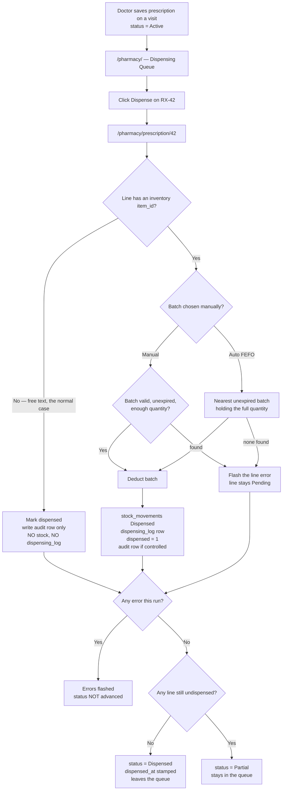

Source: route `D:/vet/platform/blueprints/pharmacy/routes.py:18-42,72-124,127-280` · templates `D:/vet/platform/templates/pharmacy/index.html`, `D:/vet/platform/templates/pharmacy/rx_detail.html`

---

## W-2. Print a medicine label
### طباعة ملصق الدواء

### Who, when, why
Whoever dispenses, at the moment of handover, so the owner goes home with dosing
instructions stuck to the box. Any role with the `pharmacy` grant can print — there is no
extra role check on this route.

### Preconditions
The prescription exists **and** its pet and owner rows still exist (this route uses inner
joins, unlike the prescription page).

### Happy path
1. On `/pharmacy/prescription/42`, click **🖨 Label / 🖨 ملصق** on the medicine's row.
2. A new browser tab opens at `/pharmacy/label/42/103` with a bordered label card:
   clinic name, address and phone from Settings; `💊 Rx #42`; **Patient / المريض**
   `بسبس (Cat) · 4.2 kg`; **Owner / المالك** `منى عبد الرحمن`; **Medication / دواء**;
   **Quantity / الكمية**; **Instructions / التعليمات** (only if the doctor typed any);
   **Frequency / التكرار** (only if present); and a footer line `Dispensed: 2026-08-19`.
3. Click **🖨 Print Label / 🖨 طباعة الملصق** (browser print dialog; the two buttons are
   hidden by the print stylesheet) then **Close / إغلاق**.

### Alternatives and edge cases

| Situation | What happens |
|---|---|
| Arabic UI | The label page sets `dir="rtl"` on its own — it does not extend the main layout, so it prints without the sidebar in either language. |
| Pet or owner row deleted | `Label data not found.` and you are returned to the prescription page. The prescription page itself still opens; only the label refuses. |
| Wrong `pi_id` for this prescription | Same message — the query requires the item to belong to the prescription. |
| **Doctor and Visit in the footer always print `—`** | The label query selects from `prescriptions` only, which has no `doctor_name` or `visit_date` column. Do not rely on the footer for the prescriber. Source: `pharmacy/routes.py:354-360` vs `models/database.py:1363-1374`; `templates/pharmacy/label.html:315-319` |
| **Duration never prints** | The template reads `item.duration_days`; the column is `duration`. The Duration block is therefore never rendered. Source: `templates/pharmacy/label.html:310-313`; `models/database.py:1383` |

### What gets written
**Nothing.** Printing a label is read-only — it does not mark the line dispensed and does not
appear in any log.

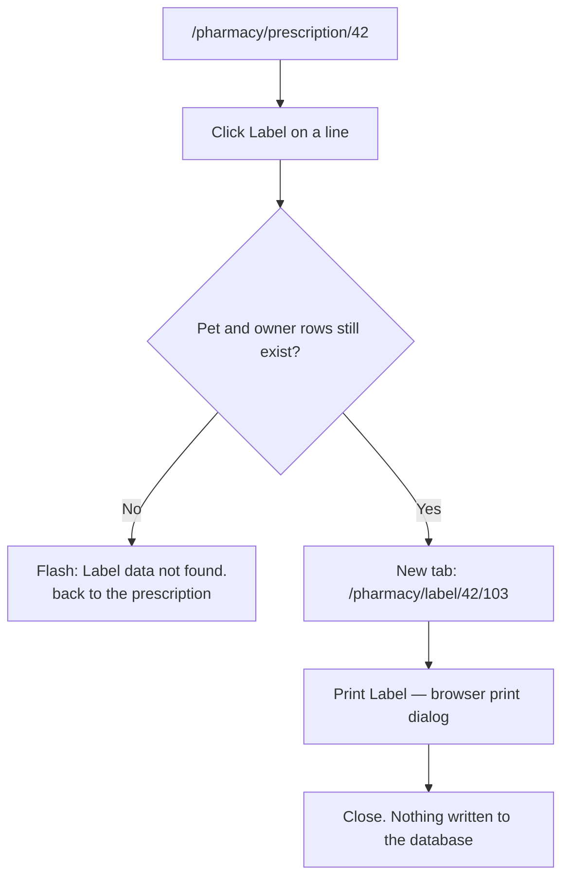

Source: route `D:/vet/platform/blueprints/pharmacy/routes.py:349-373` · template `D:/vet/platform/templates/pharmacy/label.html`

---

## W-3. Check a prescription against the drug reference
### مراجعة الوصفة في المرجع الدوائي

### Who, when, why
A pharmacist who wants to look the drugs up before handing them over. **Nothing is screened
automatically.** The panel is opt-in and fail-closed, and says so in both languages.

### Happy path
1. On `/pharmacy/prescription/42`, scroll to the grey panel at the bottom headed
   **❔ Not screened / ❔ لم يتم الفحص**. It states: *"This prescription has not been checked
   against species contraindications, drug interactions or dosing. That is not a statement
   that it is safe — verify manually."*
2. Click **"Open drug reference for this patient → / فتح المرجع الدوائي لهذا المريض ←"**.
   The medication names (one per line), plus species, breed and weight, are POSTed to the CDS
   module, which opens as a reference.
3. Read it, close it, come back. Under the button the panel repeats: *"Reference data is a
   DRAFT that has not been reviewed by a licensed veterinarian. Opening it does not check,
   clear or approve this prescription."*

### What gets written
**Nothing is written back to the prescription.** There is no "screened" flag, no timestamp,
no record that anyone looked. The panel reads *Not screened* forever.

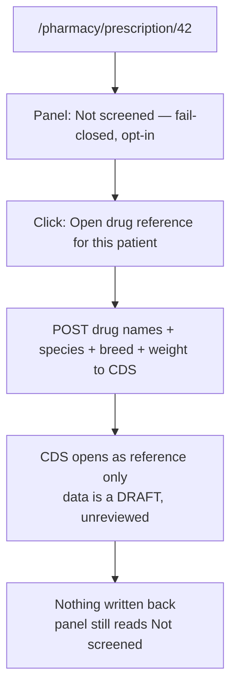

Source: `D:/vet/platform/templates/pharmacy/rx_detail.html:253-285`

---

## W-4. Look up what was dispensed
### سجل الصرف

### Who, when, why
Anyone with the `pharmacy` grant, when an owner phones asking what was handed over, or at
end of shift. No extra role check on this route.

### Preconditions
There must be `dispensing_log` rows — i.e. **stock-linked** dispensing. See §3: on a clinic
using only the app's own prescription form this screen is permanently empty and shows
*"No dispensing records found for this period. / لا توجد سجلات صرف لهذه الفترة."*

### Happy path
1. From the pharmacy queue top bar click **Dispensing History / سجل الصرف** →
   `/pharmacy/history`.
2. The single filter **From Date / من تاريخ** defaults to **today**. Set it back (e.g.
   `2026-08-01`) and press **Filter / تصفية**.
3. The table lists up to 200 rows, newest first: Time, Pet/Owner, Medication + unit, Batch,
   Expiry, Qty, Dispensed By, RX Status.

### Edge cases
* **There is no "to" date and no paging.** You can only ask for "from date X onward", capped
  at 200 rows. For a bounded range use the Narcotics Register (W-5), which has From *and* To —
  but that one only shows controlled substances.
* Rows whose pet or owner record was deleted disappear from this screen entirely (inner
  joins), even though the prescription still opens in W-1.

### What gets written
Nothing — read-only.

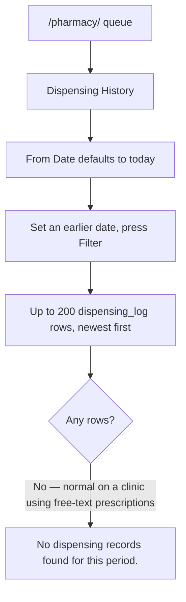

Source: route `D:/vet/platform/blueprints/pharmacy/routes.py:45-69` · template `D:/vet/platform/templates/pharmacy/history.html`

---

## W-5. Controlled-drug register — review and print
### سجل المخدرات والمواد الخاضعة للرقابة

### Who, when, why
A regulatory inspection, or the month-end controlled-substances reconciliation. Restricted to
`_DISPENSER_ROLES` (see §1) — a `pharmacy`-granted role outside that list is flashed
**"Access denied."** and sent back to the queue.

### Preconditions
Items must be flagged **Controlled Substance / مادة خاضعة للرقابة** in the item form, and the
dispensing must have been **stock-linked**. See §3 — otherwise this register is empty.

### Happy path
1. Pharmacy queue top bar → **Narcotics Register / سجل المخدرات** (the purple button) →
   `/pharmacy/narcotics`.
2. Read the purple **Regulatory Notice / إشعار تنظيمي** strip: *"This register records all
   dispensing events for controlled and narcotic substances. It must be maintained accurately
   and is subject to regulatory inspection. Entries are auto-generated from dispensing
   records."*
3. Three tiles: **Dispensing Events / عمليات الصرف**, **Total Units Dispensed / إجمالي
   الوحدات المصروفة** (2 decimals), **Controlled Substances / المواد الخاضعة للرقابة** (how
   many controlled items are active in the catalogue).
4. Filters — **From / من** and **To / إلى** default to the 1st of the current month and
   today; **Substance / المادة** defaults to *"All Controlled Substances / جميع المواد
   الخاضعة للرقابة"*. Press **Filter / تصفية**, or **Reset / إعادة تعيين** to go back to the
   current month.
5. The table (max 500 rows) shows: row number, Date & Time, Substance + unit/category, Batch
   + `Exp:`, Qty, Patient, Owner, Doctor, Dispensed By, and **RX Ref / مرجع الوصفة** linking
   back to the prescription.
6. Click **Print Register / طباعة السجل** — `window.print()`; the print stylesheet hides the
   sidebar, the top bar, the filters and every button, so the printout is the notice, the
   tiles and the table.

### Alternatives and edge cases

| Situation | What happens |
|---|---|
| No matching events | 💊 empty state: *"No controlled drug dispensing events found / لا توجد عمليات صرف لمواد خاضعة للرقابة"* — *"Events appear here automatically when controlled substances are dispensed via prescriptions."* |
| More than 500 events in the range | Silently truncated at 500, with no warning and no paging. Narrow the date range. |
| A controlled drug dispensed on a prescription with **no linked visit** | **It is missing from the register.** The query inner-joins `visits`, although the prescription page deliberately tolerates a missing visit. Source: `pharmacy/routes.py:319` |
| Filtering by substance | The dropdown lists only items with `is_controlled=1 AND is_active=1`. A controlled item that was later deactivated cannot be selected, though its past rows still appear under "All". |

### What gets written
Nothing — the register is generated from `dispensing_log` on every page load.

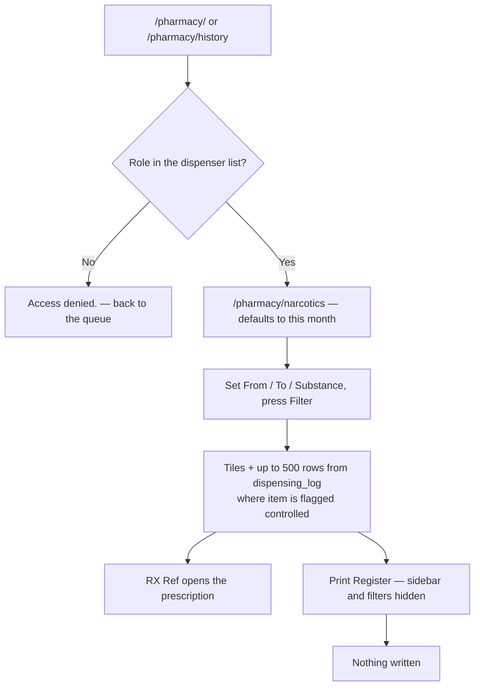

Source: route `D:/vet/platform/blueprints/pharmacy/routes.py:283-346` · template `D:/vet/platform/templates/pharmacy/narcotics.html`

---

# PART B — INVENTORY

---

## W-6. Catalogue a stock item
### إضافة صنف للمخزون أو تعديله

### Who, when, why
`clinic_owner`, `branch_manager`, `pharmacist`, `inventory_mgr` (and `super_admin`) —
whenever the clinic starts carrying a new drug or supply, or a price, reorder level or flag
changes. There is **no per-route role gate inside the blueprint**; the `inventory` module
grant is the whole check.

### Preconditions
None. Categories are pre-seeded (Medications / أدوية, Vaccines / تطعيمات, Consumables /
مستهلكات, Surgical Materials, Lab Materials, Grooming Products, Pet Food, Pet Accessories,
Cleaning, Office Supplies) — there is no screen for creating a new category.
Source: `D:/vet/platform/models/database.py:2452-2458`

### Happy path (new item)
1. **Inventory / المخزون** → the dashboard `/inventory/`. Top bar → **+ New Item / + صنف
   جديد** (also on `/inventory/items`) → `/inventory/items/new`.
2. **📦 Basic Information / المعلومات الأساسية**
   * **Item Name (English) / اسم الصنف (إنجليزي)** — required, e.g. `Amoxicillin 250mg Capsules`
   * **Item Name (Arabic) / اسم الصنف (عربي)** — e.g. `أموكسيسيلين 250 ملج كبسولات` (RTL box)
   * **SKU / Item Code / رمز المنتج** — e.g. `MED-001` (must be unique across items)
   * **Barcode / الباركود**
   * **Category / الفئة** — dropdown, default *"— Select Category —"*
   * **Unit of Measure / وحدة القياس** — fixed list of 15: `tablet, capsule, vial, bottle,
     ampoule, bag, box, tube, unit, ml, mg, g, kg, L, piece`. Defaults to `unit`.
3. **💰 Pricing / التسعير** — **Cost Price (EGP) / سعر التكلفة (جنيه)** e.g. `2.50`,
   **Sell Price (EGP) / سعر البيع (جنيه)** e.g. `5.00`.
4. **📊 Stock Rules / قواعد المخزون** — **Reorder Level / مستوى إعادة الطلب** (default `10`)
   and **Maximum Stock / الحد الأقصى للمخزون** (default `1000`). These two numbers drive the
   low-stock alerts *and* the suggested order quantity everywhere else — set them
   deliberately.
5. **🏷️ Item Flags / خصائص الصنف** — three checkboxes: **💊 Medication / دواء**,
   **🔒 Controlled Substance / مادة خاضعة للرقابة** (this is what puts the item in the
   Narcotics Register), **📋 Requires Prescription / يستلزم وصفة طبية**.
6. **🌡️ Storage Notes / ملاحظات التخزين** — free text, e.g. *"Store below 25°C, away from
   light."*
7. **✅ Create Item / إنشاء الصنف**.
8. Flash **"Item created successfully."** and you land on the item's detail page
   `/inventory/items/<id>` — with **no stock yet**. Creating an item never creates a batch;
   go on to W-7.

### Happy path (edit)
`/inventory/items` → **Edit / تعديل** on the row (or **Edit Item / تعديل الصنف** on the
detail page) → the same form pre-filled, titled **Edit: Amoxicillin 250mg Capsules** →
**💾 Save Changes / حفظ التغييرات** → flash **"Item updated successfully."** → back to the
detail page.

### Finding an item again — `/inventory/items`
Filters: free-text **Search / بحث** over name, SKU and barcode; **Category / الفئة**;
**Type / النوع** (*All Types* / *Medications Only / الأدوية فقط* / *Non-Medication / غير
دوائي*); **Search** and **Clear / مسح**. The header reads `N item(s) found`. Each row: SKU,
name with the Arabic name underneath, category, a coloured stock bar against max stock with
`Reorder: 10` beneath, unit, sell price, badges (💊 Medication / Controlled / Supply), and
**View / عرض · Edit / تعديل · +Stock / +مخزون**.

### Alternatives and edge cases

| Situation | What happens |
|---|---|
| Only English name typed | Fine — the Arabic name is optional. Lists then show the English name in both languages. |
| Duplicate SKU | `sku` is `UNIQUE`. The insert raises and you get the red flash **"Error creating item: UNIQUE constraint failed: items.sku"** on the re-rendered form. **Your typing is lost** — the form re-renders empty (`item=None`). Source: `inventory/routes.py:206-217` |
| Blank prices / levels | Blank fields fall back to `0`, `0`, `10`, `1000` respectively. |
| Non-numeric price typed directly (bypassing `type=number`) | `float()` raises → red flash **"Error creating item: could not convert string to float: 'abc'"**, form re-rendered empty. |
| **You want to delete an item** | **There is no delete and no deactivate anywhere in the UI.** `items_list` only shows `is_active=1` and no route ever sets it to 0. An item created by mistake stays in every dropdown forever. |
| **You want to set a preferred supplier** | **The item form has no supplier field**, and neither save writes `items.supplier_id`. The *Preferred / المفضل* badge on the item page and the supplier pre-selection on the "Order N unit" links only ever appear for data inserted outside the UI. Source: `templates/inventory/item_form.html` (no field); `inventory/routes.py:177-240,325-389` |
| JavaScript disabled | This form has **no inline CSRF field** — the token is appended by `static/js/app.min.js` at submit time. With JS off the save returns `403 — Invalid or missing security token. Please go back and try again.` The same applies to every form in Parts B and C except supplier edit. Source: `static/js/app.min.js:80-95`; `app.py:357` |

### What gets written
One `items` row (or an UPDATE) with: category, sku, barcode, name, name_ar, unit,
cost_price, sell_price, reorder_level, max_stock, is_medication, is_controlled, requires_rx,
storage_notes, `is_active=1`, created_at/updated_at.

### Screens that change
`/inventory/items`, the **Total Active Items** tile on `/inventory/`, every item dropdown
(Receive Stock, Transfer, Movements filter, PO lines), and — if the new item has no stock and
its reorder level is above 0 — the **Low Stock** list, immediately.

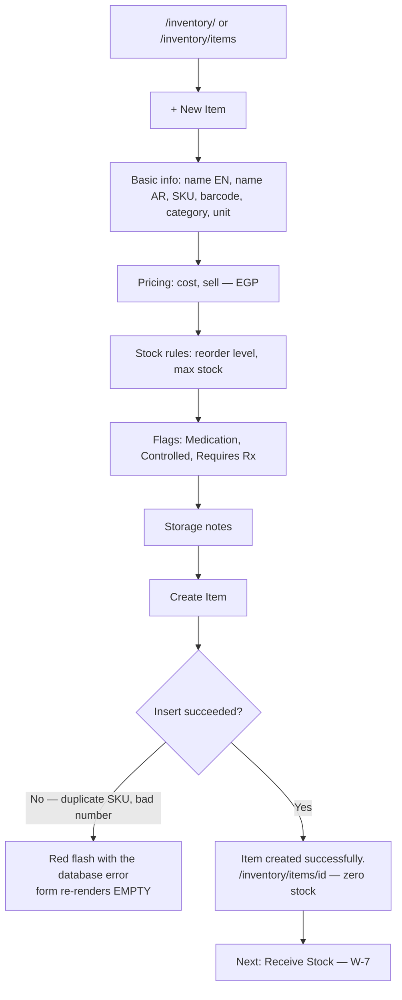

Source: routes `D:/vet/platform/blueprints/inventory/routes.py:127-172,177-240,242-323,325-389` · templates `D:/vet/platform/templates/inventory/items_list.html`, `item_form.html`, `item_detail.html`

---

## W-7. Receive stock without a purchase order
### استلام مخزون بدون أمر شراء

### Who, when, why
Opening stock when the clinic goes live, a supplier drop with no PO in the system, or a
counter purchase from the pharmacy down the road. Any role with the `inventory` grant.

### Preconditions
The item must already exist in the catalogue (W-6). At least one warehouse must exist — on a
fresh install exactly one does, **Main Pharmacy / الصيدلية الرئيسية**.

### Happy path
1. Three ways in, all landing on `/inventory/batches/new`:
   * Inventory dashboard top bar → **Receive Stock / استلام مخزون** (no item preselected)
   * `/inventory/items` → **+Stock / +مخزون** on the row
   * `/inventory/items/<id>` → **+ Receive Stock / + استلام مخزون**
2. If you arrived without an item, pick one in **Item * / الصنف *** — a dropdown of up to
   1000 items showing `name · SKU`. If you arrived from an item, that item is fixed and shown
   in a blue context banner with its SKU and unit instead.
3. **Batch Information / بيانات الدفعة**
   * **Batch Number / رقم الدفعة** — e.g. `BATCH-2026-014`
   * **Lot Number / رقم التشغيلة** — the manufacturer's lot
   * **Manufacture Date / تاريخ التصنيع** — date picker
   * **Expiry Date / تاريخ الانتهاء** — date picker. **Fill this in.** A batch with no expiry
     never appears in the expiry alerts and behaves unpredictably in FEFO (see Known limit L8).
4. **Stock Details / تفاصيل المخزون**
   * **Quantity Received * / الكمية المستلمة *** — required, e.g. `120`
   * **Unit Cost (EGP) / تكلفة الوحدة (جنيه)** — e.g. `2.50`
5. **Warehouse / المخزن** — dropdown of active warehouses (one, on a stock install).
6. **Notes / ملاحظات** — e.g. *"Delivery note 4471, Nile Veterinary Pharma, driver Sayed."*
7. **💾 Receive Stock / 💾 استلام مخزون**.
8. Flash **"Stock received: 120.0 units added."** and you land on the item detail page, where
   the new batch is in the **Stock Batches / دفعات المخزون** table and the **Current Stock /
   المخزون الحالي** number has gone up.

### Alternatives and edge cases

| Situation | What happens |
|---|---|
| Same item, second delivery | Always a **new batch row**. Batches are never merged on receipt, even with an identical batch number and expiry. Two deliveries of the same lot show as two rows. |
| Quantity typed as `1,500` or with Arabic digits or an `EGP` prefix | Accepted — `money.form_amount` strips separators, currency symbols and converts Arabic digits. Source: `D:/vet/platform/models/money.py:55-82` |
| Quantity typed as `1O0` (letter O) | Red flash **`“1O0” is not a valid quantity.`** and you are sent back to the form. It is **not** silently read as zero. Same for unit cost: `“x” is not a valid unit cost.` |
| Quantity 0 or negative | **"Item and positive quantity are required."** — back to the form (or the items list if you came in without an item). |
| No item selected | Same message. |
| Database rejects the insert | **"Error receiving stock: &lt;error&gt;"** and you are redirected to the item detail page. |
| Blank Unit Cost | Stored as `0.0`. The item then contributes nothing to the **Total Inventory Value** tile — the tile is `SUM(batch qty × unit cost)`. |
| Expiry left blank | Allowed. That batch never shows in the expiry alerts and sorts first under SQLite's FEFO ordering — i.e. it gets handed out before dated stock. See L8. |

### What gets written
* One `batches` row: item, warehouse, batch_number, lot_number, manufacture_date,
  expiry_date, quantity, unit_cost, `received_by` = the logged-in user's **full name**,
  notes, and `received_at` = now.
* One `stock_movements` row: `movement_type='in'`, `reference_type='receiving'`,
  **`reference_id` NULL** (there is nothing to link to), `created_by` = the same full name.

### Screens that change
Item detail (stock total, per-warehouse breakdown, batches, movement history) ·
`/inventory/items` stock bar · `/inventory/movements` · the dashboard **Total Inventory
Value** tile · **Low Stock** list (the item drops off it once stock exceeds the reorder
level) · **Expiry Alerts** if the expiry is within 30 days.

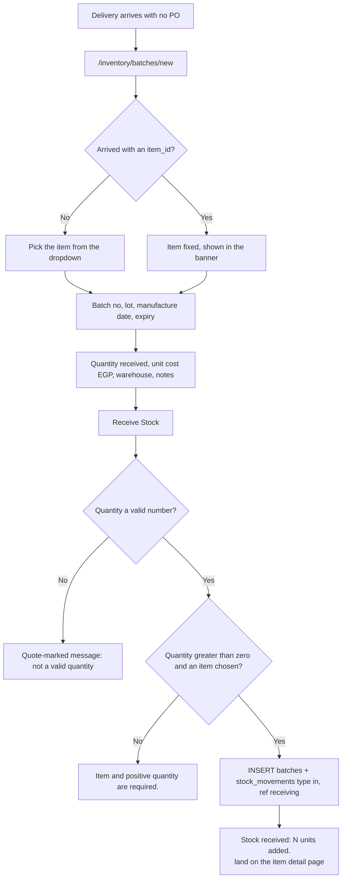

Source: route `D:/vet/platform/blueprints/inventory/routes.py:391-468` · template `D:/vet/platform/templates/inventory/batch_form.html`

---

## W-8. Read an item's full history
### تفاصيل الصنف وسجله

### Who, when, why
Anyone with the `inventory` grant, when asking "how much do we have, where did it come from,
who sells it, and what happened to it".

### Happy path
1. `/inventory/items` → **View / عرض**, or any link from the alerts, movements or PO screens
   → `/inventory/items/<id>`.
2. Top bar: **+ Receive Stock / + استلام مخزون**, **Edit Item / تعديل الصنف**,
   **← Items / ← الأصناف**.
3. **📦 Item Information / معلومات الصنف** — SKU, Barcode, Category, Unit, Cost Price, Sell
   Price (both prefixed `EGP`), Reorder Level, Max Stock, the type badges, the Arabic name
   and the storage notes.
4. **📊 Current Stock / المخزون الحالي** — the total, coloured; a badge reading **Stock OK /
   المخزون جيد**, **Low Stock / مخزون منخفض** (at or below twice the reorder level) or
   **Below Reorder Level / أقل من مستوى إعادة الطلب**; the per-warehouse breakdown; and two
   buttons — **+ Receive Stock** and **🛒 Order 940 tablet → / ← 🛒 طلب 940 tablet**, which
   opens a purchase order already holding this item at the suggested quantity.
5. **📋 Stock Batches / دفعات المخزون** (anchor `#batches`) — Batch #, Lot #, Expiry Date,
   Quantity, Unit Cost, Warehouse, Received.
6. **🏭 Suppliers / الموردون** — the item's preferred supplier plus everyone who has shipped
   it on a PO, with an order count and **View supplier →**.
7. **🧾 Purchase Orders / أوامر الشراء** — the last 10 POs carrying this item; the action
   link reads **Receive → / استلام ←** while the PO is Draft or Sent, otherwise **View order →**.
8. **🔄 Movement History (Last 20) / سجل الحركات (آخر 20)** — date, type badge, quantity,
   reference (a link when the visit / prescription / purchase order still exists, plain text
   otherwise), notes, and who.

### Edge cases

| Situation | What happens |
|---|---|
| Item id does not exist | `404 — Page not found` |
| No batches yet | *"No batches found. / لا توجد دفعات."* with a **Receive stock now →** link |
| No supplier on record | *"No supplier on record for this item."* + **Browse suppliers →**. This is the normal state — see W-6 on `supplier_id`. |
| Never ordered | *"This item has never been on a purchase order."* + **Order it now →** |
| **The `(Soon) / (قريباً)` expiry badge** | **Unreliable.** It is computed by gluing this month onto day+30, producing impossible dates like `2026-08-49`, and comparing them as text. Use the **Stock Alerts** screen (W-11), which uses a real SQL threshold. `(EXPIRED)` is a straight date comparison and is correct. Source: `templates/inventory/item_detail.html:212-217` |

### What gets written
Nothing — read-only.

Source: route `D:/vet/platform/blueprints/inventory/routes.py:242-323` · template `D:/vet/platform/templates/inventory/item_detail.html`

---

## W-9. Watch the inventory dashboard
### لوحة المخزون والصيدلية

### Who, when, why
The daily glance: the pharmacist or inventory manager opening `/inventory/` first thing.

### What you see
* Four tiles: **Total Active Items / إجمالي الأصناف النشطة**; **Low Stock Alerts / تنبيهات
  المخزون المنخفض** ("Items at or below reorder level"); **Expiry Alerts (30 days) / تنبيهات
  انتهاء الصلاحية (30 يوم)**; **Total Inventory Value / إجمالي قيمة المخزون** in
  **EGP (cost basis)** = `SUM(batch quantity × unit cost)` over active items with stock.
* **🔴 Low Stock Items / أصناف المخزون المنخفض** — up to 8 cards, each with a **View Item →**
  link, and **View all alerts →** in the header.
* **🟡 Expiring Soon (30 days) / تنتهي صلاحيتها قريباً** — up to 6 cards (item, quantity,
  batch number, expiry).
* **📋 Recent Stock Movements / حركات المخزون الأخيرة** — the last 10, with **View all →**.
* Top bar: **+ New Item**, **Receive Stock**, **Transfer Stock**.

### Known defects on this screen (do not report as data problems)

| Symptom | Cause |
|---|---|
| **Every low-stock card shows `0` for the current quantity** | The card reads `current_stock`; the query that feeds it aliases the batch sum as `stock_qty`. The tile *count* is right and the Alerts screen (W-11) shows the right numbers. Source: `templates/inventory/dashboard.html:121` vs `models/database.py:3449` |
| Already-expired batches are counted in the **Expiry Alerts (30 days)** tile | The query has no lower bound — it is "expiry ≤ today + 30", including the past. The Alerts screen at least labels them *Expired*; the tile does not distinguish. Source: `models/database.py:3537-3544` |
| The **Recent Stock Movements** Reference column is plain text | This table prints `reference_type` only, with no link — unlike the Movements screen and the item page. Source: `templates/inventory/dashboard.html:186` |

Source: route `D:/vet/platform/blueprints/inventory/routes.py:92-125` · template `D:/vet/platform/templates/inventory/dashboard.html`

---

## W-10. Replenish short stock — from alert to purchase order
### طلب الأصناف الناقصة

### Who, when, why
An item has fallen to or below its reorder level. The person who notices is usually the
pharmacist (`inventory` grant), but **only someone with the `procurement` grant can actually
create the order** — `clinic_owner`, `branch_manager`, `inventory_mgr`, `super_admin`. A
pharmacist clicking the Order link is flashed *"You don't have permission to access this
page."* Plan for that hand-off.

### Preconditions
At least one **active** supplier exists (W-13) — the supplier dropdown on the PO form only
lists `is_active=1`, and a PO cannot be saved without one.

### Happy path — one item
1. `/inventory/` → **View all alerts →** or the sidebar route `/inventory/alerts`.
2. Under **🔴 Low Stock / مخزون منخفض (N items)** find the card, e.g.
   `Amoxicillin 250mg Capsules · Medications · tablet`, a red fill bar, `Current: 6` and
   `Reorder at: 10`.
3. Click **Order 994 tablet → / ← طلب 994 tablet**. The number is computed for you:
   *max_stock − current stock*, never below the reorder level, never below 1.
   Source: `inventory/routes.py:74-85`
4. You land on `/procurement/orders/new` with that item already on line 1 and the quantity
   pre-filled; the unit price is pre-filled from the item's **cost price**.
5. Pick **Supplier * / المورد *** (e.g. `Nile Veterinary Pharma`), optionally set
   **Expected Delivery / التسليم المتوقع** and **Notes / ملاحظات**, and choose **Status /
   الحالة**: **Draft / مسودة** or **Sent to Supplier / أُرسل إلى المورد**.
6. **Create Order / إنشاء طلب** → flash **"Purchase Order PO-2026-00007 created."** → you
   land on `/procurement/orders/7`.

### Happy path — everything that is short, in one order
1. On `/inventory/alerts`, click **Order All Short Items → / ← طلب جميع الأصناف الناقصة** in
   the Low Stock header.
2. The PO form opens with **one line per short item**, each at its own computed quantity and
   its own cost price. Remove any line you do not want with the red **✕** (available on every
   row after the first), or press **+ Add Line / + إضافة بند** for anything the alerts missed.
3. Pick the supplier and press **Create Order**.
   Note this builds a **single order for one supplier** — if the short items come from three
   different suppliers you must delete the lines that do not belong and repeat.

### Alternative entry points to the same form

| From | Link | What is pre-filled |
|---|---|---|
| `/inventory/items/<id>` | **🛒 Order N unit →** | that item, suggested quantity, its cost price, and its preferred supplier if one is set (see W-6 — normally none) |
| `/inventory/alerts` → Expiring Soon | **Replace → / استبدال ←** | that item at **the expiring batch's quantity**, no supplier |
| `/procurement/suppliers/<id>` | **+ Order from this supplier** | that supplier, plus a line for every item they supply (W-12) |
| `/procurement/` or `/procurement/orders` | **+ New Order / + طلب جديد** | nothing — one blank line |

### Errors and edge cases

| Trigger | Exact message | Result |
|---|---|---|
| No supplier chosen | `Please select a supplier.` | Back to a **blank** new-order form — your lines are lost |
| Every line blank or quantity 0 | `Please add at least one line item.` | Same: back to a blank form |
| Quantity typed as `abc` | *(no message)* — `money.form_amount` returns 0 and the error is discarded, so the line is silently dropped. If it was the only line you then get `Please add at least one line item.` Source: `procurement/routes.py:262-269` |
| A middle line removed with ✕ | Handled correctly — the route reads whichever indexes are actually present, so later lines are not truncated. Source: `procurement/routes.py:255-259` |
| An unknown `item_id` in the URL | Dropped silently rather than rendering an empty line |
| The `qty` list length does not match the `item_id` list | The whole quantity list is discarded and every line falls back to 1, rather than shifting quantities onto the wrong items. Source: `procurement/routes.py:214-216` |
| An item is named with JavaScript-looking text | Safe — item options are injected as JSON and built through the DOM, so a name can never become script. Source: `templates/procurement/order_form.html:107-146` |

### What gets written
* One `purchase_orders` row: `po_number` = `PO-<current year>-<count+1, 5 digits>`,
  supplier, `order_date` = today, expected_date, status (`Draft` or `Sent`), `total` = sum of
  the line totals, notes, `created_by` = username.
* One `po_lines` row per accepted line: item, quantity, unit_cost, total.
* **No stock moves yet.** Nothing reaches inventory until the order is received (W-15).
* The per-line **description** hidden field is collected by the route but `po_lines` has no
  such column, so it is discarded.

### Screens that change
`/procurement/` (Open Orders tile, Recent Purchase Orders) · `/procurement/orders` ·
the supplier's page · the item's **Purchase Orders** panel.

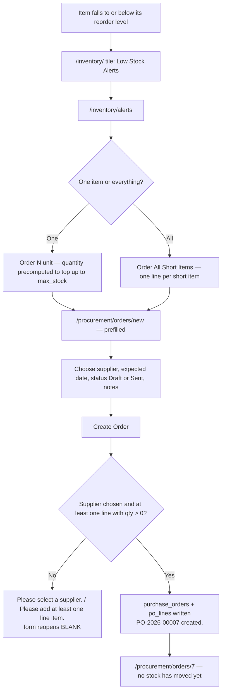

Source: routes `D:/vet/platform/blueprints/inventory/routes.py:475-496`, `D:/vet/platform/blueprints/procurement/routes.py:194-233,236-295` · templates `D:/vet/platform/templates/inventory/alerts.html`, `D:/vet/platform/templates/procurement/order_form.html`

---

## W-11. Monitor expiring stock
### متابعة الأصناف قريبة الانتهاء

### Who, when, why
The weekly shelf check. Anyone with the `inventory` grant.

### Happy path
1. `/inventory/` → **View all →** on the Expiring Soon block, or go straight to
   `/inventory/alerts`.
2. Scroll to **⚠️ Expiring Soon (N batches)**. The table lists every batch with
   `expiry_date ≤ today + 30 days` **and quantity > 0**: Item (link), Batch (link to the
   item's `#batches` section), Expiry Date, Qty, Status, Action.
3. The Status badge is one of:
   * **Expired / منتهية** — expiry on or before today
   * **Critical / حرج** — inside 7 days
   * **Warning / تحذير** — inside 30 days
4. Act: **Batch → / الدفعة ←** takes you to the item's batch list; **Replace → / استبدال ←**
   opens a purchase order pre-filled with that item at the expiring quantity.
5. If nothing is close: ✅ *"No items expiring within the next 30 days. / لا توجد أصناف تنتهي
   خلال 30 يوماً."*

### Edge cases and what is **not** here

| Situation | Reality |
|---|---|
| Expired stock is mixed in with expiring stock | Yes, by design of the query — there is no lower bound. They are at least labelled **Expired**. |
| **You want to write the expired stock off** | **There is no write-off, disposal, quarantine or damage route anywhere in this module.** Nothing in the app can reduce a batch except dispensing (W-1) and transfer (W-14). The only recorded outcome of an expiry alert is the replacement order, if you raise one. To zero an expired batch you need direct database access. |
| Expired stock is still counted | It counts in the item's stock total, in the low-stock calculation and in the **Total Inventory Value** tile. It is, however, correctly excluded from FEFO dispensing — the auto-pick refuses an already-expired batch. |
| A batch with no expiry date | Never appears here at all. PO-received stock has no expiry (see L8), so **stock received through a purchase order is invisible to the expiry alerts.** |

### What gets written
Nothing on this screen. The follow-through (a PO) is W-10.

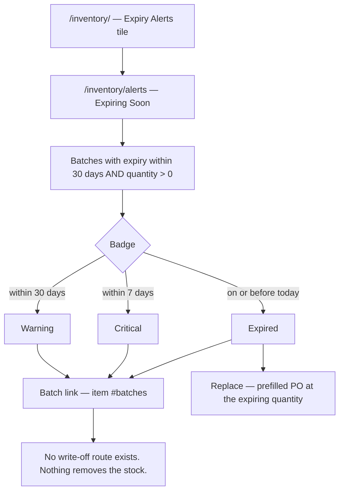

Source: route `D:/vet/platform/blueprints/inventory/routes.py:475-496`; `D:/vet/platform/models/database.py:3537-3544` · template `D:/vet/platform/templates/inventory/alerts.html`

---

## W-12. Trace where a stock movement came from
### تتبع حركة مخزون

### Who, when, why
A shelf count does not match, an auditor asks, or someone says "why did this quantity change".
Anyone with the `inventory` grant.

### Happy path
1. `/inventory/` → **View all →** on Recent Stock Movements, or the item page's **Movement
   History**, or straight to `/inventory/movements`.
2. Filter: **Item / الصنف** (dropdown of active items), **Type / النوع**, **Limit / الحد**
   (*Last 50 / Last 100 / Last 500*, default 100). Press **Filter / تصفية**, or
   **Reset / إعادة تعيين**.
3. Read the row: Date/Time, Item, Type badge, signed Qty, **Reference / المرجع**, By, Notes.
4. Click the reference to jump to the cause — a visit, a prescription (`/pharmacy/prescription/<id>`)
   or a purchase order (`/procurement/orders/<id>`). References are only rendered as links
   when the target row still exists; a deleted target degrades to plain text instead of a dead
   link. `receiving` and `transfer` movements carry no reference id at all and are always
   plain text — for a transfer, the detail is in the Notes column.

### The Type filter is a trap — read this

The dropdown offers **All Types / Stock In / Stock Out / Adjustment / Expired / Damaged**.
The types the application actually writes are:

| Written type | Written by | In the dropdown? |
|---|---|---|
| `in` | Receive Stock (W-7), PO receiving (W-15) | ✅ *Stock In* |
| `Dispensed` | Pharmacy dispensing (W-1) | ❌ **not selectable** |
| `Transfer` | Warehouse transfer (W-14), two rows per transfer | ❌ **not selectable** |
| `out`, `adjustment`, `expired`, `damaged` | **nothing in the app writes these** | ✅ but always empty |

So the two most common movement types cannot be filtered for, and four of the five filter
options return nothing. Use **All Types** plus the Item filter.
Source: `templates/inventory/movements.html:205-209`; writers at `inventory/routes.py:446,624,634`, `pharmacy/routes.py:229`, `procurement/routes.py:345`

Two more display quirks on this screen:
* A transfer's **out** leg renders as **`−-5`** — the template prefixes a minus to every
  non-`in` row, and the out leg is already stored negative. Source: `templates/inventory/movements.html:248`; `inventory/routes.py:624`
* The type filter is applied **after** the SQL `LIMIT`, so choosing a type can return far
  fewer rows than the limit implies — "Last 500" filtered to `in` means "the `in` rows among
  the last 500 movements", not "the last 500 `in` rows". Source: `inventory/routes.py:509-512`

### What gets written
Nothing — read-only.

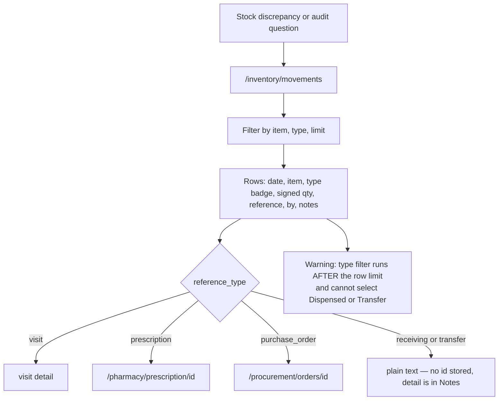

Source: route `D:/vet/platform/blueprints/inventory/routes.py:33-72,503-529` · template `D:/vet/platform/templates/inventory/movements.html`

---

## W-13. Move stock between warehouses
### تحويل مخزون بين المخازن

### ⚠ On a stock install this workflow cannot complete
Exactly **one** warehouse is seeded ("Main Pharmacy / الصيدلية الرئيسية") and **no screen in
the entire application creates another one**. The route refuses a destination equal to the
source, so with one warehouse every attempt ends in *"Select a different destination
warehouse."* Warehouses have to be inserted directly into the database before transfers are
usable.
Source: `D:/vet/platform/models/database.py:2663-2666` (only writer); `D:/vet/platform/blueprints/inventory/routes.py:576-580`

### Who, when, why
`super_admin`, `clinic_owner`, `branch_manager`, `inventory_mgr`, `pharmacist` — moving stock
from the main store to a branch fridge. Anyone else is flashed **"Access denied."** and sent
to the inventory dashboard.

### Preconditions
Two or more warehouses; a batch with `quantity > 0`.

### Happy path
1. Inventory dashboard → **Transfer Stock / نقل مخزون** → `/inventory/transfer`.
   Two panels: **From — Source / من — المصدر** and **To — Destination / إلى — الوجهة**.
2. **Item / Product / الصنف / المنتج** — choose the item. The page fetches its batches over
   AJAX (`/inventory/transfer/batches-json`) and enables the next dropdown.
3. **Source Batch / الدفعة المصدر** — options read
   `BATCH-2026-014 | Wh: Main Pharmacy | Qty: 60 | Exp: 2027-03-31`. Choosing one fills the
   read-only info panel: **Batch No / رقم الدفعة**, **Expiry / الانتهاء**, **Warehouse /
   المخزن**, **Available Stock / المخزون المتاح** — and sets the quantity box's `max`.
4. **Quantity to Transfer / الكمية المراد تحويلها** — e.g. `20`.
5. **Transfer Note (optional) / ملاحظة التحويل (اختياري)** — e.g. *"Weekly top-up, Maadi branch."*
6. Right panel: **Destination Warehouse / المخزن الوجهة**.
7. **Transfer Stock → / تحويل المخزون ←**.
8. Flash **"Transferred 20.0 units to Maadi Branch Store successfully."** and the form
   reloads empty.

### Errors and edge cases

| Trigger | Exact message |
|---|---|
| Role not in the allow-list | `Access denied.` (redirect to `/inventory/`) |
| Quantity blank, zero, negative or not a number | `Invalid quantity.` |
| Batch id missing or unknown | `Batch not found.` |
| Quantity above the batch | Blocked in the browser first — `alert("Quantity exceeds available stock (60)")` — and on the server: `Insufficient stock: only 60.0 available.` |
| Destination not chosen, unknown, **or the same as the source** | `Select a different destination warehouse.` |
| Anything raises during the write | `Transfer failed: <error>` — the whole transfer rolls back |

Other behaviour worth knowing:
* The item dropdown is **not submitted** — the batch determines the item. Selecting an item
  and then a batch is only a way of narrowing the batch list.
* The destination dropdown lists **all** warehouses, including inactive ones, while the
  Receive Stock screen lists only active ones. Source: `inventory/routes.py:547-549` vs `models/database.py:3565-3569`
* Transfers do not care about expiry — you can transfer an expired batch.

### What gets written
* Source `batches.quantity` reduced.
* Destination: an existing batch **with the same item, warehouse, batch number and expiry** is
  topped up; otherwise a new batch row is created there carrying the same batch number,
  expiry and unit cost, with `received_at` = today.
* Two `stock_movements` rows, both `movement_type='Transfer'`, `reference_type='transfer'`:
  the out leg with a **negative** quantity and note *"Transfer to warehouse Maadi Branch
  Store. &lt;your note&gt;"*, the in leg positive with *"Transfer from warehouse 1. &lt;your note&gt;"*.
* One `audit_log` row: action `stock_transfer`, entity `batches`, details `qty=20.0 to wh=2`.

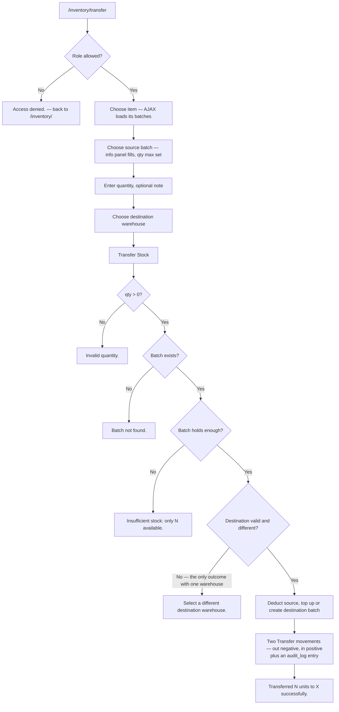

Source: routes `D:/vet/platform/blueprints/inventory/routes.py:536-662,665-682` · template `D:/vet/platform/templates/inventory/transfer.html`

---

# PART C — PROCUREMENT

---

## W-14. Add or maintain a supplier
### إضافة مورد أو تعديل بياناته

### Who, when, why
`clinic_owner`, `branch_manager`, `inventory_mgr`, `super_admin`. A new supplier is engaged,
or their phone / payment terms change. Every PO needs a supplier, so this comes first.

### Happy path — add
1. **Procurement / المشتريات** → `/procurement/` → **Suppliers / الموردون** →
   `/procurement/suppliers`. Left: the full supplier table. Right: the inline
   **Add New Supplier** card.
2. Fill it in:
   * **Name / الاسم *** — required, e.g. `Nile Veterinary Pharma`
   * **Contact Person / مسؤول التواصل** — e.g. `Ahmed Fathy`
   * **Phone / الهاتف** — e.g. `+20 100 123 4567`
   * **Email / البريد الإلكتروني**
   * **Address / العنوان** — e.g. `12 El Nasr St, Nasr City, Cairo`
   * **Payment Terms / شروط الدفع** — `Net 30`, `Net 60`, `COD (Cash on Delivery)`, `Prepaid`
     (or blank). If left blank the route stores `Net 30`.
   * **Notes / ملاحظات**
   * **Active Supplier** checkbox — ticked by default and **ignored** (see below)
3. **Add Supplier** → flash **"Supplier 'Nile Veterinary Pharma' added."** and the table on
   the left now includes it.

### Happy path — edit
1. `/procurement/suppliers` → **View / عرض** → `/procurement/suppliers/<id>` →
   **✏️ Edit Supplier / ✏️ تعديل المورد**.
2. Fields: **Supplier Name ***, **Contact Person / مسؤول التواصل**, **Phone**, **Email**,
   **Payment Terms** (here the list is `Net 30, Net 15, Net 60, Due on Receipt, Prepaid` —
   note it differs from the add form), **Address**, **Notes**, and the **Active / نشط**
   checkbox.
3. **💾 Save Changes / 💾 حفظ التغييرات** → flash **"Supplier 'Nile Veterinary Pharma'
   updated."** → back to the supplier page.

### Errors and edge cases

| Trigger | Exact message / behaviour |
|---|---|
| Blank name on either form | `Supplier name is required.` — back to the list (add) or the edit form (edit) |
| Supplier id does not exist | `Supplier not found.` → suppliers list |
| **Unticking "Active Supplier" on the add form** | **Ignored — new suppliers are always created active.** The route hardcodes `is_active=1`. Deactivating is only possible from the Edit screen. Source: `procurement/routes.py:74-84` |
| Deactivating a supplier | They vanish from the PO supplier dropdown (`is_active=1` only) but stay on the suppliers list with a red **No / لا** badge and keep all their history. |
| **Deleting a supplier** | No delete route exists anywhere. Deactivate instead. |
| The form field is `contact_person`, the column is `contact_name` | Handled by the route — nothing for you to do; noted so nobody "fixes" it. |

### What gets written
One `suppliers` row (or an UPDATE): name, contact_name, phone, email, address,
payment_terms, notes, is_active.

### Screens that change
`/procurement/suppliers` · the **Suppliers** tile on `/procurement/` · the supplier dropdown
on the new-PO form · the **Suppliers / الموردون** panel on any item they have shipped.

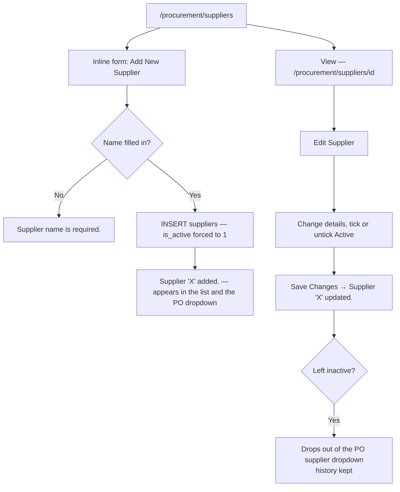

Source: routes `D:/vet/platform/blueprints/procurement/routes.py:52-62,65-88,91-121,124-162` · templates `D:/vet/platform/templates/procurement/suppliers_list.html`, `supplier_detail.html`, `supplier_edit.html`

---

## W-15. Order from a specific supplier
### الطلب من مورد بعينه

### Who, when, why
The routine monthly order to a known supplier, rather than a reaction to an alert. Same roles
as W-14.

### Happy path
1. `/procurement/` → **Suppliers / الموردون** → **View / عرض** on `Nile Veterinary Pharma`.
2. Read the profile: **Supplier Information / بيانات المورد** (contact person, phone, email,
   payment terms, address, **Member Since / مورد منذ**, notes) with an **Active / نشط** or
   **Inactive / غير نشط** badge; **Purchase Orders (N)** — every PO for this supplier with PO
   number, line count, order date, expected date, status badge, total and notes; and
   **Items Supplied / الأصناف المورَّدة (N)** — everything they are recorded as providing,
   with stock on hand, a red **Low / منخفض** badge where stock is at or below the reorder
   level, the reorder level, the order count and **View item →**.
3. Click **+ Order from this supplier / + الطلب من هذا المورد**.
4. `/procurement/orders/new` opens with the supplier selected and **one line per item they
   supply**, each at quantity 1 and that item's cost price. Adjust quantities, remove lines
   with ✕, add lines with **+ Add Line**.
5. **Create Order / إنشاء طلب** → **"Purchase Order PO-2026-00008 created."**

### Edge cases
* **"Items Supplied" is usually empty for a new supplier.** It is "items whose preferred
  supplier is this one" (never settable from the UI — see W-6) **or** "items this supplier has
  shipped on a PO". So the list only fills up after the first order. Until then use
  **+ New Order / + طلب جديد** and add lines by hand.
* The prefilled quantity is **1 per line**, not a computed top-up — this entry point passes
  item ids only, no quantities. That is different from the alerts route (W-10).
* An inactive supplier's page still shows **+ Order from this supplier**, but they are absent
  from the dropdown on the form, so the order cannot be saved until they are reactivated.

### What gets written
Identical to W-10: one `purchase_orders` row plus one `po_lines` row per line. No stock moves.

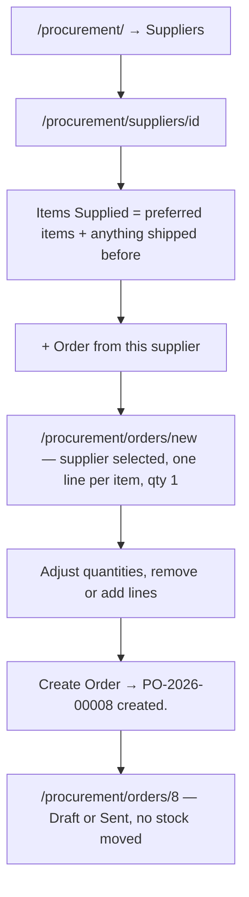

Source: routes `D:/vet/platform/blueprints/procurement/routes.py:91-121,194-233,236-295` · templates `D:/vet/platform/templates/procurement/supplier_detail.html`, `order_form.html`

---

## W-16. Progress a purchase order to the supplier
### تحديث حالة أمر الشراء

### Who, when, why
A Draft order has been approved and emailed/phoned to the supplier, or the order is
abandoned. Roles as W-14.

### Happy path
1. `/procurement/orders` → filter by **Status / الحالة** (*All Statuses / Draft / Sent /
   Received / Cancelled*) and, if needed, **From Date / To Date** on the order date. Press
   **Filter / تصفية** or **Clear / مسح**.
2. **View / عرض** on the order → `/procurement/orders/7`.
3. In the right column, the **🔄 Update Status / 🔄 تحديث الحالة** card offers
   **Draft / Sent / Cancelled**. Choose one and press **Update / تحديث**.
4. Flash **"Status updated to Sent."** and the Order Info badge changes colour.

### Alternatives and edge cases

| Situation | Reality |
|---|---|
| Order already **Received** or **Cancelled** | The Update Status card is **not rendered** — its status is final from the screen's point of view. |
| What actually changes on status update | **Only `purchase_orders.status`.** No stock, no dates, no email, no notification to the supplier. "Sent" is a note to yourselves. |
| Cancelling an order | Sets the status only. The lines stay, the total stays, and the order still appears in lists with a red **Cancelled / ملغى** badge. There is **no PO delete and no PO edit** — a wrong order can only be cancelled. |
| Invalid status posted directly | `Invalid status.` and back to the order page. |
| **`Received` via this route** | The route accepts `Received` even though the dropdown does not offer it. Reaching it (by crafting the POST) marks the PO Received **with no batch and no stock movement**, and then hides the *Mark Received* button — the delivery would never reach stock. Do not do this; use W-17. Source: `procurement/routes.py:361-373` vs `templates/procurement/order_detail.html:132` |

### What gets written
`purchase_orders.status`. Nothing else.

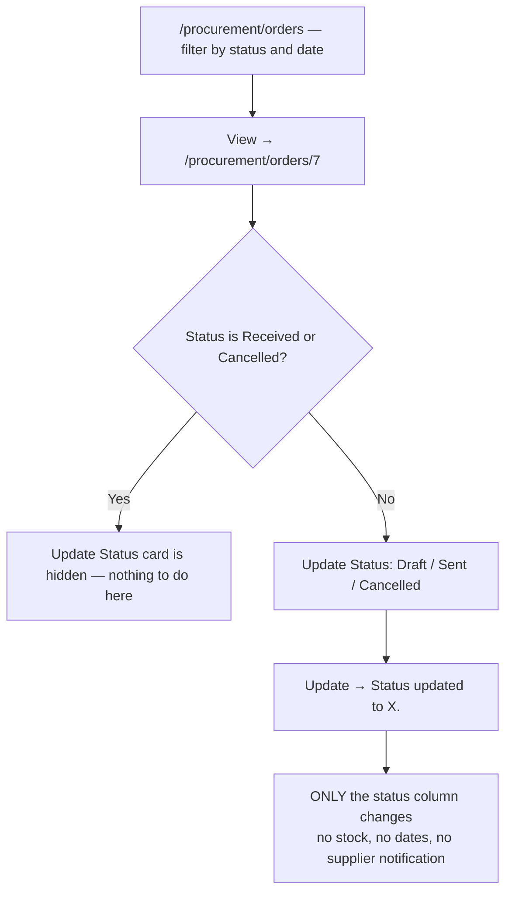

Source: routes `D:/vet/platform/blueprints/procurement/routes.py:167-191,298-315,361-373` · templates `D:/vet/platform/templates/procurement/orders_list.html`, `order_detail.html`

---

## W-17. Receive a purchase order into stock
### استلام أمر شراء وإضافته للمخزون

### Who, when, why
The delivery for an existing Draft or Sent PO arrives at the clinic door. Roles as W-14 —
note that the pharmacist who will actually count the boxes **cannot** press this button by
default (no `procurement` grant).

### Preconditions
The PO exists and its status is `Draft` or `Sent`.

### Happy path
1. Get to the order: `/procurement/orders` → **View**, or `/procurement/` → the Recent
   Purchase Orders table, or from the item page's **Purchase Orders** panel where the link
   reads **Receive → / استلام ←**.
2. On `/procurement/orders/7`, check the **📦 Order Lines / بنود الطلب** table against the
   delivery note: item (linked to inventory), unit, quantity, unit cost, line total, and the
   **Grand Total / الإجمالي الكلي** in EGP.
3. Top bar → **✅ Mark Received / ✅ تعليم كمستلم**.
4. A browser confirm appears: *"Mark this order as Received and update inventory?"* → OK.
5. Flash **"Purchase Order #7 marked as Received. Stock updated."** The status badge turns
   green, a **Received / مستلم** date appears in Order Info, the Mark Received button
   disappears and the Update Status card disappears.

### What receiving actually does — read before you rely on it

For **each line that carries an item id**, exactly two rows are written:
* `stock_movements`: `movement_type='in'`, `warehouse_id=1` (hardcoded), quantity and unit
  cost from the line, `reference_type='purchase_order'`, `reference_id=<order id>` — this is
  what makes the movement clickable back to the PO from the item's history.
* `batches`: item, **`warehouse_id=1`**, quantity, unit cost, `received_by` = username —
  **with no batch number, no lot number and no expiry date**.

And on the order: `status='Received'`, `received_date=today`.

Consequences:
* **Received stock never appears in the expiry alerts** (no expiry date).
* **It always lands in warehouse 1**, whatever warehouse the order was meant for.
* Its batch shows as `—` in every batch list, so it cannot be told apart from another
  PO-received batch of the same item.
* It affects FEFO: the auto-pick orders by expiry ascending and NULL expiries are eligible, so
  on SQLite (NULLs sort first) PO-received stock is handed out **ahead of** dated stock. See L8.

If you need batch numbers and expiry dates on the shelf — and for medicines you do — receive
the delivery through **W-7 (Receive Stock)** instead, and use the PO only as the paper order.
There is no way to add a batch number to stock that was received through a PO.

### Errors and edge cases

| Trigger | Exact message / behaviour |
|---|---|
| Pressing Mark Received twice (double-click, browser resend) | `Purchase Order #7 was already received.` (amber) — nothing is written the second time. Source: `procurement/routes.py:331-334` |
| Order id does not exist | `Purchase order not found.` → orders list |
| **Partial delivery** (supplier sent 80 of 100) | **Not supported.** Receiving is one shot, whole order, no per-line received quantity. `po_lines.received_qty` exists in the schema and is never written. Either receive the whole order and correct the stock by hand (which you cannot do — see W-11), or leave the PO open and record the real delivery through W-7. |
| Over-delivery | Same — the quantity received is always exactly the quantity ordered. |
| A line whose item was deleted | Skipped for stock (`if line["item_id"]`), and the line shows as **Deleted item / صنف محذوف** on the order. |
| **Receiving a Cancelled order** | The guard only blocks status `Received`. A Cancelled PO can still be received by POSTing directly — the button is merely hidden in the template. Source: `procurement/routes.py:331`; `templates/procurement/order_detail.html:7` |

### Screens that change
`/inventory/items/<id>` (stock total, a new blank-numbered batch, movement history) ·
`/inventory/movements` · the dashboard tiles · `/procurement/` (Open Orders drops, Items
Received This Month and Total Spend may move — see L11) · `/procurement/orders`.

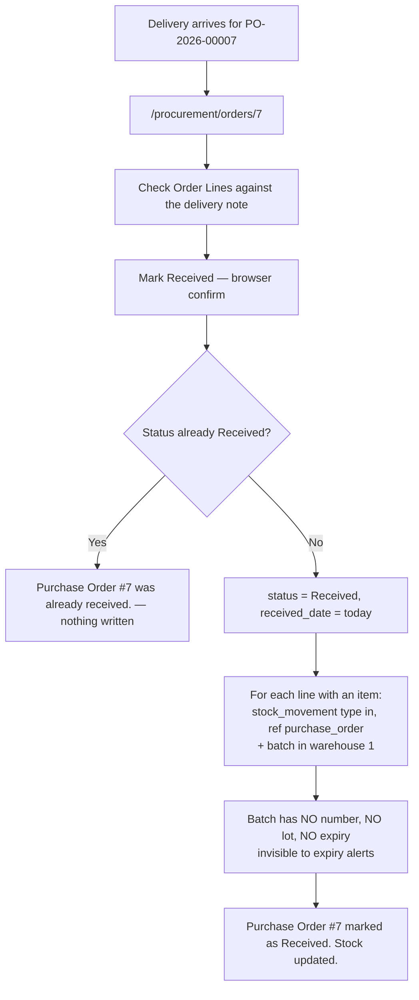

Source: routes `D:/vet/platform/blueprints/procurement/routes.py:298-315,318-358` · template `D:/vet/platform/templates/procurement/order_detail.html`

---

## W-18. Watch the procurement dashboard
### لوحة المشتريات

### What you see at `/procurement/`
Four tiles and the last 10 purchase orders (PO #, supplier, date, item count, total EGP,
status badge, **View**). Top bar: **+ New Order / + طلب جديد**, **Suppliers / الموردون**,
**All Orders / جميع الطلبات**.

| Tile | What it really counts |
|---|---|
| **Suppliers / الموردون** | suppliers with `is_active=1`. **Manage →** goes to the list. |
| **Open Orders / الطلبات المفتوحة** | POs with status `Draft` **or** `Sent`. **But its View → link filters `status=Draft` only**, so the list you land on is shorter than the number above it. Source: `templates/procurement/dashboard.html:21-28` |
| **Items Received This Month / الأصناف المستلمة هذا الشهر** | **Mislabelled.** It counts purchase **orders**, not items, and filters on `order_date`, not `received_date` — so an order placed last month and received this month is not counted. Source: `procurement/routes.py:21-24` |
| **Total Spend EGP (Month) / إجمالي الإنفاق بالجنيه (الشهر)** | `SUM(total)` of `Received` POs whose **order_date** falls in the current month — same date caveat. |

Also note the **PO #** column on this table and on `/procurement/orders` prints the database
id (`#7`), while the order page and the supplier page print the real `po_number`
(`PO-2026-00007`). They are different numbers for the same order.
Source: `templates/procurement/dashboard.html:66`, `orders_list.html:70` vs `order_detail.html:76`

Source: route `D:/vet/platform/blueprints/procurement/routes.py:11-47` · template `D:/vet/platform/templates/procurement/dashboard.html`

---

# PART D — Known limits

Everything below was read in the source. Cite these rather than describing the version you
wish existed.

**L1. Prescriptions are never linked to inventory.** See §3. This is the single most
important limit in the chapter: on a clinic using the app's own forms, dispensing moves no
stock, Dispensing History and the Narcotics Register stay empty, and FEFO never runs.
`visits/routes.py:406-423,1415-1432`

**L2. The inventory dashboard's low-stock cards always show `0`.** Template reads
`current_stock`, the query aliases `stock_qty`. The Alerts screen is correct.
`templates/inventory/dashboard.html:121` vs `models/database.py:3449`

**L3. Stock Transfer cannot complete on a fresh install** — one seeded warehouse, no route
anywhere creates another, and same-warehouse transfers are refused.
`models/database.py:2663-2666`; `inventory/routes.py:576-580`

**L4. No stock adjustment, stock count, write-off, damage or expiry-disposal route exists.**
Nothing in the application can reduce a batch except dispensing and transfer.
`db.deduct_stock` (which would write `out` movements) exists but **no blueprint calls it**.
`models/database.py:3508-3532`

**L5. The Movements type filter cannot select the two most common types** (`Dispensed`,
`Transfer`) and four of its five options match nothing. `templates/inventory/movements.html:205-209`

**L6. The Movements type filter is applied after the SQL LIMIT**, so a filtered "Last 500"
returns far fewer rows than 500. `inventory/routes.py:509-512`

**L7. A transfer's out leg renders as `−-5`** — the template prefixes a minus to a value that
is already negative. `templates/inventory/movements.html:248`

**L8. PO receiving is coarse.** One shot, whole order, no per-line received quantity, no
partial or over/under delivery, and the batch it creates has no batch number, no lot, no
expiry and `warehouse_id` hardcoded to 1. PO-received stock is therefore invisible to the
expiry alerts, and because FEFO orders by expiry ascending with NULLs eligible, **SQLite hands
out that undated stock first while PostgreSQL (NULLS LAST) would hand it out last — the two
engines behave differently.** `procurement/routes.py:340-354`; `pharmacy/routes.py:210-214`

**L9. The receive guard only blocks re-receiving a `Received` order.** A `Cancelled` PO can
still be received by POSTing directly; the button is merely hidden.
`procurement/routes.py:331`; `templates/procurement/order_detail.html:7`

**L10. `order_update_status` accepts `Received`** although the dropdown offers only
Draft/Sent/Cancelled. That path would mark the PO Received with no batch and no movement.
`procurement/routes.py:366`

**L11. Procurement dashboard tiles are mislabelled / mis-linked** — "Items Received This
Month" counts orders and filters on `order_date`; the Open Orders tile counts Draft+Sent but
links to Draft only. `procurement/routes.py:21-24`; `templates/procurement/dashboard.html:21-28`

**L12. The "Active Supplier" checkbox on the inline add-supplier form is ignored** —
`is_active` is hardcoded to 1. Deactivate from the Edit screen. `procurement/routes.py:76`

**L13. The item page's `(Soon)` expiry badge is not a real 30-day window** — it string-glues
day+30 onto the current month, producing dates like `2026-08-49`, and compares them as text.
The Alerts screen is correct. `templates/inventory/item_detail.html:215`

**L14. Expiry alerts have no lower bound**, so already-expired batches are counted in the
"Expiry Alerts (30 days)" tile and listed under "Expiring Soon". The Alerts table labels them
*Expired*; the dashboard tile does not. `models/database.py:3537-3544`

**L15. The Narcotics Register inner-joins `visits`**, so a controlled-drug dispensing event on
a prescription with no linked visit is absent from the register even though the prescription
page deliberately handles that case. The label route likewise inner-joins pets and owners, so
a label cannot print for a prescription whose pet or owner row was deleted.
`pharmacy/routes.py:319,354-360`

**L16. Sidebar navigation is not permission-filtered.** Every signed-in user sees Pharmacy,
Inventory and Procurement; a role without the grant is flashed *"You don't have permission to
access this page."* and bounced to the launcher. `templates/base.html:130,197,211`

**L17. Most POST forms in these modules carry no inline CSRF field** — the token is appended
at submit time by `static/js/app.min.js:80-95`. They work normally in a browser; with
JavaScript disabled they return `403 — Invalid or missing security token. Please go back and
try again.` The exceptions that do carry the field inline are `pharmacy/rx_detail.html:151`
and `procurement/supplier_edit.html:13`.

**L18. No pagination anywhere in these modules**, and several hard caps: pharmacy queue 100,
dispensing history 200, narcotics register 500, movements 500 max, item batches/POs 10–20 per
panel, Receive Stock item picker 1000. Items, suppliers and purchase order lists are
unbounded. The low-stock list is computed from the first 500 active items only
(`models/database.py:3534-3535` — the SQL limit is applied before the low-stock filter), so a
clinic with more than 500 items can miss short items.

**L19. No delete or deactivate for inventory items; no item-category management; no warehouse
management; no PO edit or delete; no supplier delete.**

**L20. The dispense quantity is not validated server-side.** The box is `type=number
min=0.01`, but the route calls `float()` with no guard and no floor: a non-numeric value
raises a 500, and a **negative** value passes every check and *increases* the batch quantity.
Contrast the receiving form, which reports a bad number. `pharmacy/routes.py:187,202,222`

**L21. The label footer's Doctor and Visit always print `—`**, and Duration never prints —
the template reads columns the query does not select and a field name that does not exist.
`templates/pharmacy/label.html:310-319`; `pharmacy/routes.py:354-360`

**L22. The Pet Shop / POS module keeps entirely separate stock** (`ps_products`,
`ps_stock_movements`). Selling a product at the POS does **not** change any number in
Inventory. `blueprints/petshop/routes.py:171-181`

**L23. `items.supplier_id` can never be set from the UI**, so the *Preferred / المفضل* badge
and supplier pre-selection only fire for seeded or externally inserted data.
`templates/inventory/item_form.html`; `inventory/routes.py:177-240,325-389`

---

## Appendix — screen index

| Route | Screen | Template | Route source |
|---|---|---|---|
| `GET /pharmacy/` | Dispensing queue | `templates/pharmacy/index.html` | `pharmacy/routes.py:18-42` |
| `GET /pharmacy/history` | Dispensing history | `templates/pharmacy/history.html` | `pharmacy/routes.py:45-69` |
| `GET /pharmacy/prescription/<rx_id>` | Prescription + dispensing form | `templates/pharmacy/rx_detail.html` | `pharmacy/routes.py:72-124` |
| `POST /pharmacy/dispense/<rx_id>` | *(action)* | — | `pharmacy/routes.py:127-280` |
| `GET /pharmacy/narcotics` | Controlled-drug register | `templates/pharmacy/narcotics.html` | `pharmacy/routes.py:283-346` |
| `GET /pharmacy/label/<rx_id>/<pi_id>` | Print label | `templates/pharmacy/label.html` | `pharmacy/routes.py:349-373` |
| `GET /inventory/` | Inventory dashboard | `templates/inventory/dashboard.html` | `inventory/routes.py:92-125` |
| `GET /inventory/items` | Items list | `templates/inventory/items_list.html` | `inventory/routes.py:127-172` |
| `GET / POST /inventory/items/new` | New item | `templates/inventory/item_form.html` | `inventory/routes.py:177-240` |
| `GET /inventory/items/<id>` | Item detail | `templates/inventory/item_detail.html` | `inventory/routes.py:242-323` |
| `GET / POST /inventory/items/<id>/edit` | Edit item | `templates/inventory/item_form.html` | `inventory/routes.py:325-389` |
| `GET / POST /inventory/batches/new` | Receive stock | `templates/inventory/batch_form.html` | `inventory/routes.py:391-468` |
| `GET /inventory/alerts` | Stock alerts | `templates/inventory/alerts.html` | `inventory/routes.py:475-496` |
| `GET /inventory/movements` | Stock movements | `templates/inventory/movements.html` | `inventory/routes.py:503-529` |
| `GET / POST /inventory/transfer` | Stock transfer | `templates/inventory/transfer.html` | `inventory/routes.py:536-662` |
| `GET /inventory/transfer/batches-json` | *(AJAX)* | — | `inventory/routes.py:665-682` |
| `GET /procurement/` | Procurement dashboard | `templates/procurement/dashboard.html` | `procurement/routes.py:11-47` |
| `GET /procurement/suppliers` | Suppliers + add form | `templates/procurement/suppliers_list.html` | `procurement/routes.py:52-62` |
| `POST /procurement/suppliers/new` | *(action)* | — | `procurement/routes.py:65-88` |
| `GET /procurement/suppliers/<id>` | Supplier profile | `templates/procurement/supplier_detail.html` | `procurement/routes.py:91-121` |
| `GET / POST /procurement/suppliers/<id>/edit` | Edit supplier | `templates/procurement/supplier_edit.html` | `procurement/routes.py:124-162` |
| `GET /procurement/orders` | Purchase orders | `templates/procurement/orders_list.html` | `procurement/routes.py:167-191` |
| `GET /procurement/orders/new` | New PO form | `templates/procurement/order_form.html` | `procurement/routes.py:194-233` |
| `POST /procurement/orders/new` | *(action)* | — | `procurement/routes.py:236-295` |
| `GET /procurement/orders/<id>` | PO detail | `templates/procurement/order_detail.html` | `procurement/routes.py:298-315` |
| `POST /procurement/orders/<id>/receive` | *(action)* | — | `procurement/routes.py:318-358` |
| `POST /procurement/orders/<id>/status` | *(action)* | — | `procurement/routes.py:361-373` |

All paths are relative to `D:/vet/platform/`.

---

*Written against the source as of 2026-08-19. Nothing here was confirmed against a running
instance — every statement is read from the code at the cited lines.*
