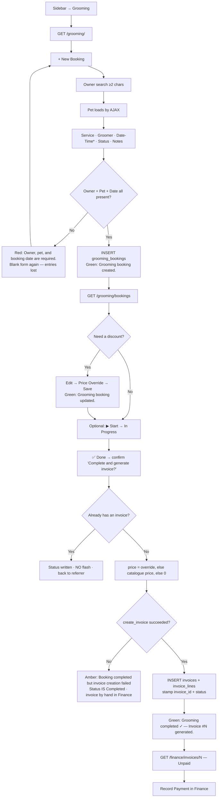
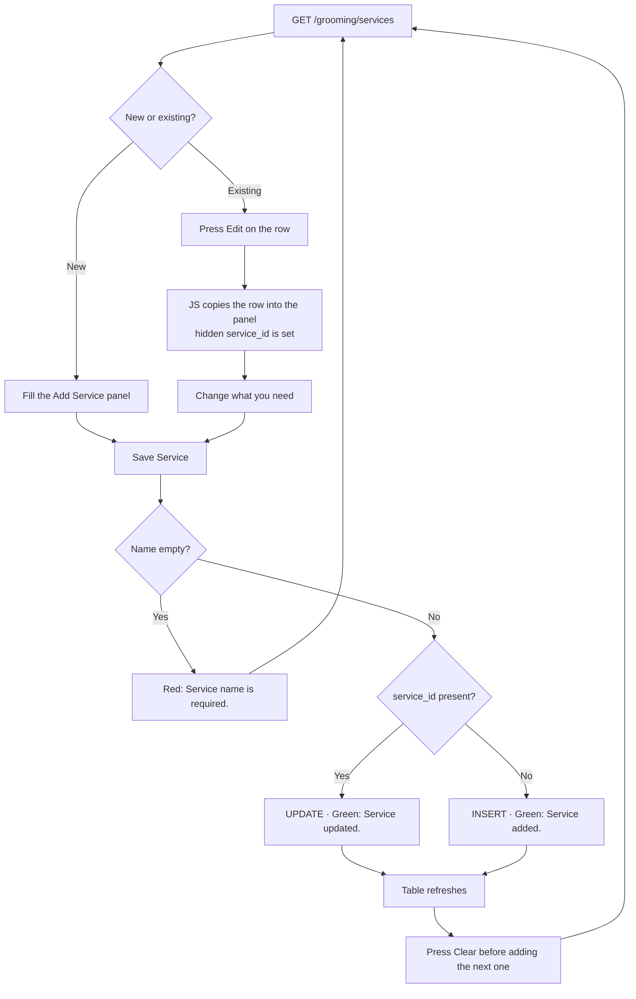
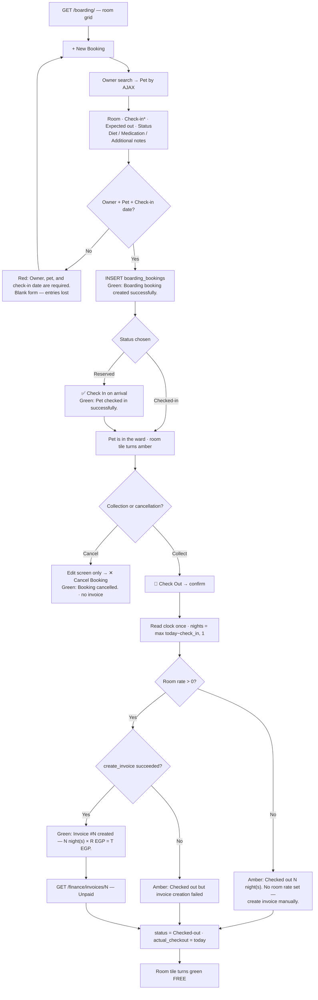
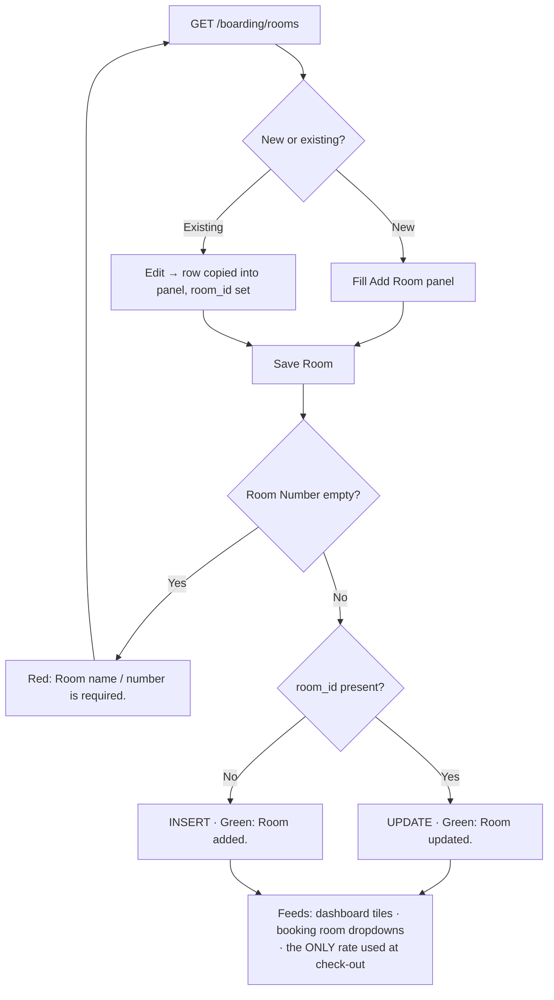
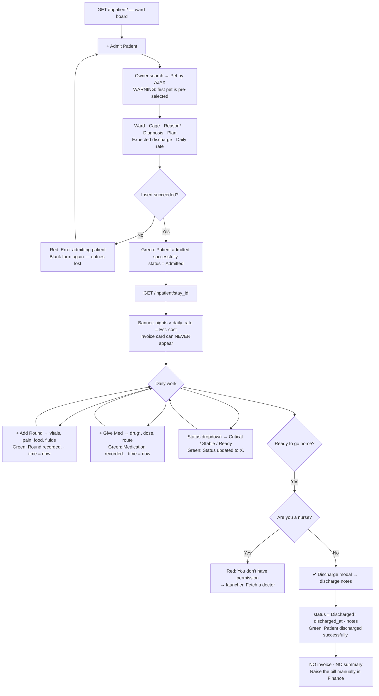
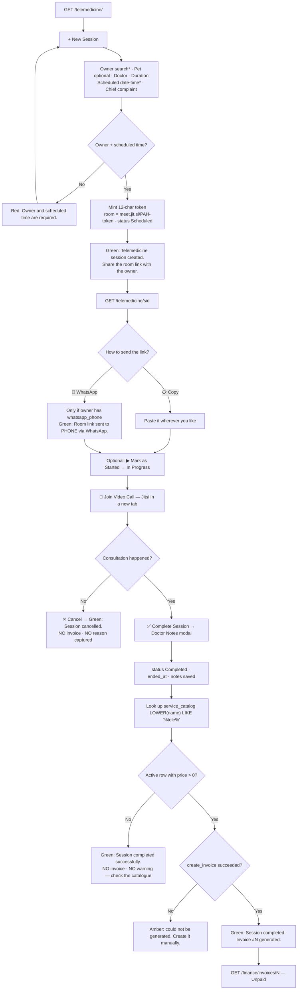
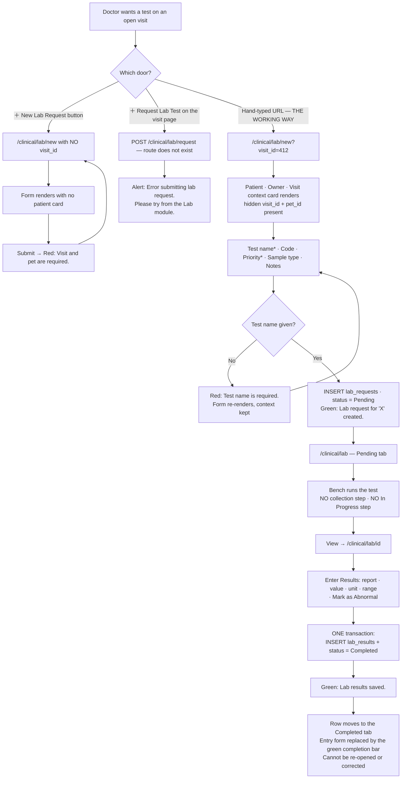
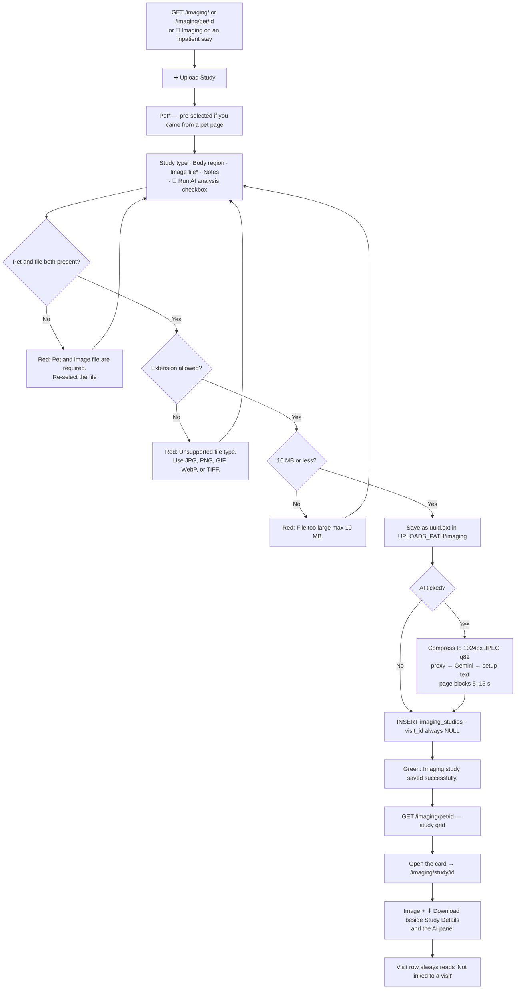
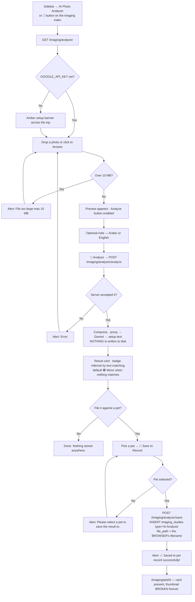

# Grooming, Boarding, Inpatient, Telemedicine, Lab and Imaging

**Six modules, six URL prefixes:**

| Module | URL prefix | Blueprint | Templates |
|--------|-----------|-----------|-----------|
| Grooming | `/grooming/` | `blueprints/grooming/routes.py` | `templates/grooming/` |
| Boarding | `/boarding/` | `blueprints/boarding/routes.py` | `templates/boarding/` |
| Inpatient | `/inpatient/` | `blueprints/inpatient/routes.py` | `templates/inpatient/` |
| Telemedicine | `/telemedicine/` | `blueprints/telemedicine/routes.py` | `templates/telemedicine/` |
| Lab (part of Clinical) | `/clinical/lab` | `blueprints/clinical/routes.py` | `templates/clinical/` |
| Imaging | `/imaging/` | `blueprints/imaging/routes.py` | `templates/imaging/` |

This chapter documents **only what the code does today**. Where a screen promises
something it does not deliver, that is written down as a limit, not as a feature.
Every claim carries a `Source` line so the next writer can check it.

Prices, names and phone numbers in the examples are made up but shaped like real
Egyptian clinic data. All money in this chapter is EGP.

---

## 0. Before you start

### 0.1 Every screen and endpoint in these six modules

**Grooming** — every route is `@login_required` only; there is no extra role gate anywhere in the module.

| # | Screen | URL | What it is |
|---|--------|-----|------------|
| 1 | Grooming dashboard | `GET /grooming/` | 3 stat cards, today's schedule with inline status control, next-7-days list |
| 2 | Bookings list | `GET /grooming/bookings` | Filterable list, 200-row cap, per-row action buttons |
| 3 | New booking | `GET /grooming/bookings/new` | Create form |
| 4 | Create booking | `POST /grooming/bookings/new` | Action only |
| 5 | Edit booking | `GET /grooming/bookings/<id>/edit` | Edit form + quick actions |
| 6 | Save booking | `POST /grooming/bookings/<id>/edit` | Action only |
| 7 | Change status | `POST /grooming/bookings/<id>/status` | Action only — this is where the invoice is made |
| 8 | Go to invoice | `GET /grooming/bookings/<id>/invoice` | Redirect only, no page |
| 9 | Services | `GET /grooming/services` | Catalogue table + add/edit panel |
| 10 | Save service | `POST /grooming/services/new` | Action only — inserts *and* updates |

Source: `blueprints/grooming/routes.py:26,84,130,149,180,207,250,311,326,342`

**Boarding** — every route is `@login_required` only.

| # | Screen | URL | What it is |
|---|--------|-----|------------|
| 1 | Boarding dashboard | `GET /boarding/` | 4 stat cards + room-status tiles |
| 2 | Bookings list | `GET /boarding/bookings` | Filterable list, 100-row cap |
| 3 | New booking | `GET /boarding/bookings/new` | Create form |
| 4 | Create booking | `POST /boarding/bookings/new` | Action only |
| 5 | Edit booking | `GET /boarding/bookings/<id>/edit` | Edit form + quick actions + the **only** Cancel button |
| 6 | Save booking | `POST /boarding/bookings/<id>/edit` | Action only |
| 7 | Cancel booking | `POST /boarding/bookings/<id>/cancel` | Action only |
| 8 | Check in | `POST /boarding/bookings/<id>/checkin` | Action only |
| 9 | Check out | `POST /boarding/bookings/<id>/checkout` | Action only — this is where the invoice is made |
| 10 | Go to invoice | `GET /boarding/bookings/<id>/invoice` | Redirect only, no page |
| 11 | Rooms | `GET /boarding/rooms` | Room register + add/edit panel |
| 12 | Save room | `POST /boarding/rooms/new` | Action only — inserts *and* updates |

Source: `blueprints/boarding/routes.py:10,61,114,135,169,196,222,234,251,329,344,365`

**Inpatient**

| # | Screen | URL | Extra role gate |
|---|--------|-----|-----------------|
| 1 | Ward board | `GET /inpatient/` | none |
| 2 | Admit patient | `GET\|POST /inpatient/admit` | `super_admin, clinic_owner, branch_manager, doctor, nurse` |
| 3 | Stay detail | `GET /inpatient/<stay_id>` | none |
| 4 | Update status | `POST /inpatient/<stay_id>/status` | `…, doctor, nurse` |
| 5 | Add round | `POST /inpatient/<stay_id>/round` | `…, doctor, nurse` |
| 6 | Give medication | `POST /inpatient/<stay_id>/med` | `…, doctor, nurse, pharmacist` |
| 7 | Discharge | `POST /inpatient/<stay_id>/discharge` | `super_admin, clinic_owner, branch_manager, doctor` — **no nurse** |
| 8 | Pets for owner (JSON) | `GET /inpatient/api/owner/<owner_id>/pets` | none |

Source: `blueprints/inpatient/routes.py:138,186,234,291,312,349,379,398`

**Telemedicine** — every route is `@login_required` only.

| # | Screen | URL |
|---|--------|-----|
| 1 | Telemedicine dashboard | `GET /telemedicine/` |
| 2 | New session | `GET\|POST /telemedicine/new` |
| 3 | Session detail | `GET /telemedicine/<sid>` |
| 4 | Mark as started | `POST /telemedicine/<sid>/start` |
| 5 | Complete session | `POST /telemedicine/<sid>/complete` |
| 6 | Cancel session | `POST /telemedicine/<sid>/cancel` |
| 7 | Send link via WhatsApp | `POST /telemedicine/<sid>/share` |
| 8 | Pets for owner (JSON) | `GET /telemedicine/api/pets/<owner_id>` |

Source: `blueprints/telemedicine/routes.py:84,128,177,201,247,311,327,365`

**Lab** (inside the `clinical` blueprint) — every route is `@login_required` only.

| # | Screen | URL |
|---|--------|-----|
| 1 | Lab requests | `GET /clinical/lab` |
| 2 | New lab request | `GET\|POST /clinical/lab/new` |
| 3 | Lab request detail | `GET /clinical/lab/<lab_id>` |
| 4 | Save results | `POST /clinical/lab/<lab_id>/results` |

Source: `blueprints/clinical/routes.py:77,93,157,190`

**Imaging** — every route is `@login_required` only.

| # | Screen | URL |
|---|--------|-----|
| 1 | All studies | `GET /imaging/` |
| 2 | Studies for one pet | `GET /imaging/pet/<pet_id>` |
| 3 | Upload study | `GET\|POST /imaging/upload` |
| 4 | Study detail | `GET /imaging/study/<study_id>` |
| 5 | Serve image file | `GET /imaging/file/<filename>` |
| 6 | AI photo analyzer | `GET /imaging/analyzer` |
| 7 | Run analysis (JSON) | `POST /imaging/analyzer/analyze` |
| 8 | Save analysis (JSON) | `POST /imaging/analyzer/save` |

Source: `blueprints/imaging/routes.py:185,208,233,301,330,339,358,380`

---

### 0.2 Who can open what

Two gates run on every request, and **both** must pass:

1. **The module grant.** `login_required` looks up the signed-in user's role and
   checks it holds the permission key that governs the blueprint. `super_admin`
   bypasses this check entirely.
2. **The role list.** `role_required(...)`, where a route carries it, narrows
   further. A grant can only ever narrow — it never widens.

Source: `blueprints/auth/routes.py:59-69, 89-134, 167-193`

Blueprint-to-key mapping is one-to-one for five of these modules. The exception:
**the `clinical` blueprint maps to the `visits` key**, not to any "lab" key —
there is no lab permission to grant.
Source: `blueprints/auth/routes.py:140-151`

**Default grants as shipped:**

| Module (permission key) | Roles that hold it by default |
|---|---|
| `grooming` | clinic_owner, branch_manager, reception, groomer |
| `boarding` | clinic_owner, branch_manager, reception, boarding_staff |
| `inpatient` | clinic_owner, branch_manager, doctor, nurse |
| `telemedicine` | clinic_owner, branch_manager, doctor |
| `visits` (governs Lab) | clinic_owner, branch_manager, doctor, nurse, pharmacist |
| `imaging` | clinic_owner, branch_manager, doctor, nurse |

`super_admin` reaches all six regardless. `clinic_owner` holds every key in the system.
Source: `models/database.py:4346-4379`

**What being denied looks like:** a red flash reading
`You don't have permission to access this page.` and a redirect to the launcher (`/`).
Nothing is written to the database.
Source: `blueprints/auth/routes.py:131-134, 190-191`

**Two role facts that trip people up:**

- **A nurse cannot discharge an inpatient.** She can admit, record rounds, give
  medication and change the status to *Ready for Discharge*, but the Discharge
  button's route excludes her. She will be bounced to the launcher with the
  permission flash. A doctor, branch manager or clinic owner must press it.
  Source: `blueprints/inpatient/routes.py:379-381`
- **A pharmacist cannot record an inpatient medication**, even though the route's
  role list names her. The module grant runs first, `pharmacist` has no `inpatient`
  grant, and she is stopped there. The listed permission is inert.
  Source: `blueprints/inpatient/routes.py:349-351`; `blueprints/auth/routes.py:186`; `models/database.py:4368`

---

### 0.3 How to get in

**Sidebar** (left rail, group `CLINICAL / السريري`): `Lab & Vaccines / المختبر والتطعيمات`,
`Inpatient / تنويم`, `Grooming / التجميل`, `Boarding / الإيواء`,
`Telemedicine / الاستشارة عن بُعد`, `Imaging / التصوير الطبي`, `AI Photo Analyzer / محلل الصور AI`.

**These seven links are rendered to every signed-in user with no role condition
whatsoever.** A groomer sees Inpatient, Telemedicine and Imaging in her sidebar;
each one bounces her to the launcher with the permission flash.
Source: `templates/base.html:137-176`

**Launcher tiles** (the `/` home grid) *are* role-filtered, and they mostly agree
with the grants. One does not: the **Telemedicine** tile lists `nurse` and
`reception` among its roles, but the `telemedicine` grant covers only
clinic_owner, branch_manager and doctor. A nurse or receptionist sees the tile on
her home screen and is bounced the moment she clicks it.
Source: `blueprints/launcher/routes.py:184-198`; `models/database.py:4362-4367`

---

### 0.4 Mechanics common to all six modules

**Picking an owner.** Every owner dropdown in these modules
(`grooming/booking_form.html`, `boarding/booking_form.html`,
`inpatient/admit.html`, `telemedicine/new_session.html`) is rendered **empty** and
searches the server as you type. The page-level JS turns the `<select>` into a
search box: type **at least 2 characters**, wait ~0.2 s, and the first 25 matches
load. The search matches `full_name`, `phone`, `whatsapp_phone` and `email`, all
with `LIKE %term%`. If exactly one owner matches, it is auto-selected and the
page's own `onchange` fires (which loads the pet list).

So typing `Mona` finds `منى عبد الرحمن / Mona Abdel Rahman`; typing `0100555` finds
her by phone. Typing one character finds nothing and the box stays as it was.

Source: `static/js/platform.js:407-476`; `blueprints/crm/routes.py:545-560`; `models/database.py:3036-3042`

**Picking a pet.** The pet dropdown is filled by AJAX after an owner is chosen.
Three different endpoints do this depending on the module:

| Form | Endpoint called |
|---|---|
| Grooming / Boarding booking | `/crm/owners/<id>/pets-json` |
| Inpatient admit | `/inpatient/api/owner/<id>/pets` |
| Telemedicine new session | `/telemedicine/api/pets/<id>` |

Source: `templates/grooming/booking_form.html:76`; `templates/boarding/booking_form.html:95`; `templates/inpatient/admit.html:82`; `templates/telemedicine/new_session.html:83`

If the fetch fails, the box reads `Error loading` and you cannot submit (the
grooming/boarding/inpatient pet field is `required`). On the **inpatient** admit
form only, the pet list has no leading blank option, so the owner's first pet is
pre-selected — **check it before you submit** if the owner has more than one animal.
Source: `templates/inpatient/admit.html:84-88`

**Language.** The `EN` / `عربي` buttons in the top bar POST to `/settings/lang` and
flip `session["lang"]`; the whole page re-renders with `dir="rtl"` in Arabic. Labels
written as `t('English','عربي')` swap; labels written as plain English do not, and
show as LTR English inline inside an RTL page. **Every flash message from every
route in these six modules is English-only**, as is every `confirm()` dialog.
Source: `blueprints/settings/routes.py:149-166`; `app.py:406-408`; `templates/base.html:2-3, 343-344`

**CSRF.** Every non-GET request is rejected without a valid token; the failure page
reads `Invalid or missing security token. Please go back and try again.` with HTTP 403.
Most forms in these modules carry no token in their HTML — it is injected by
JavaScript on submit. **With JavaScript disabled, almost nothing in these modules
can be saved.** The exceptions that carry a hard-coded token are the inpatient
admit form, the three inpatient modals, and the imaging upload form.
Source: `app.py:349-357`; `static/js/platform.js:131-145`; `templates/inpatient/admit.html:13`; `templates/inpatient/stay_detail.html:33,157,193,222`; `templates/imaging/upload.html:13`

**How an invoice is born.** Grooming, Boarding and Telemedicine each call the same
`db.create_invoice(...)`. It always creates the invoice as:

- `status = 'Unpaid'`, `paid_amount = 0.00`, `due_amount = total`
- no discount, no tax (these modules pass neither)
- exactly one line, `line_type = 'service'`

**Nothing in these six modules ever takes money.** Payment is recorded on the
invoice screen in Finance (`POST /finance/invoices/<id>/pay`), which offers a
method dropdown and a reference box, records partial payments, and awards loyalty
points at 1 point per 10 EGP. That is where cash-vs-card and paid-vs-partial
actually happens — none of it is decided here.
Source: `models/database.py:3578-3618`; `blueprints/finance/routes.py:368-425`; `templates/finance/invoice_detail.html:249-261`

---

## 1. Grooming — booking to invoice

### 1.1 Who, when, why

Reception or a groomer books a bath, trim or full groom for a client's animal,
runs the session, and closes it out. Closing it out is what raises the money.

Anyone holding the `grooming` grant can do every step: `clinic_owner`,
`branch_manager`, `reception`, `groomer`, plus `super_admin`. There is no
separate permission for taking the booking versus completing and invoicing it —
**a groomer can generate an invoice.**
Source: `blueprints/grooming/routes.py:130,149,180,207,250` (all `@login_required`, no `role_required`)

### 1.2 Preconditions

- The **owner** exists in CRM. There is no "add owner" shortcut on the booking form.
- The owner has at least one **pet** on file. The pet dropdown loads from the owner.
- Optionally, the **service** exists in the grooming catalogue (§2). A booking with
  no service is legal, but its invoice will be for **0.00 EGP** unless a price
  override is typed in.

### 1.3 The happy path

Example: `منى عبد الرحمن / Mona Abdel Rahman` (0100 555 0142) brings her cat
`بسبس / Basbous` for a *Full Bath & Trim* at 250 EGP with the groomer `هبة / Heba`,
Thursday at 11:00.

**Step 1 — Open the module.**
Sidebar → `Grooming / التجميل`, or the launcher tile `✂️ Grooming`. You land on
`GET /grooming/`.

You see three stat cards — `Today's Bookings`, `This Week / هذا الأسبوع`,
`In Progress / جارٍ` — then `📅 Today's Schedule`, then `📆 Upcoming (next 7 days)`
if anything is booked in that window.

Two things about those numbers, so you do not misread them:
- *This Week* counts everything from today to today + 7 days that is not `Cancelled`.
- *In Progress* counts **every** booking in the system with that status, of any
  date — a session someone forgot to close last month is still being counted.

Source: `blueprints/grooming/routes.py:28-81`; `templates/grooming/dashboard.html:12-25`

**Step 2 — Start the booking.**
Top bar → `+ New Booking / + حجز جديد`. You land on `GET /grooming/bookings/new`.

**Step 3 — Choose the owner.**
In `Owner * / المالك *`, type `Mona` (or `0100555`). Wait a moment; the list fills
from the server. Select her.

**Step 4 — Choose the pet.**
`Pet * / الحيوان *` reloads by itself. Pick `Basbous (Cat)`.

**Step 5 — Fill in the booking.**

| Field | What to enter | Required? |
|---|---|---|
| `Service / الخدمة` | `Full Bath & Trim (All) · 60min · 250 EGP` | No |
| `Groomer Name / اسم المُجمِّل` | `Heba` — free text, not a staff picker | No |
| `Booking Date & Time *` | Thursday 11:00, via the date-and-time picker | **Yes** |
| `Status / الحالة` | Leave on `Scheduled` — **see the Arabic warning in §1.6** | No |
| `Notes / ملاحظات` | e.g. `Mats behind the ears — clip short` | No |

Source: `templates/grooming/booking_form.html:33-61`

**Step 6 — Press `Create Booking / إنشاء حجز`.**
Green flash: `Grooming booking created.` You land on `GET /grooming/bookings`.
The new row shows a yellow `Scheduled / مجدول` badge, the catalogue price
`250.00 EGP`, and an empty Invoice column.

**Step 7 — On the day, start the session.**
On the bookings list, press `▶ Start / ▶ بدء` on Basbous's row. No confirmation
dialog. Blue flash: `Booking status updated to In Progress.` The badge turns blue.

**Step 8 — Finish the session and bill it.**
Press `✅ Done / ✅ تم`. A browser dialog asks (English only, in both languages):
`Complete and generate invoice?` → **OK**.

The app reads the booking's price override (blank here), falls back to the
catalogue price of 250.00, creates an invoice with a single service line, stamps
the invoice number onto the booking, and **takes you straight to the invoice**:

Green flash: `Grooming completed ✓ — Invoice #1042 generated.`
You are now on `GET /finance/invoices/1042` — invoice for Mona, pet Basbous,
line `Full Bath & Trim`, quantity 1, 250.00 EGP, header note
`Grooming: Full Bath & Trim`, status **Unpaid**, due 250.00.

Source: `blueprints/grooming/routes.py:252-308`

**Step 9 — Take the money.**
On that invoice screen, enter the amount, pick the method, press
`✅ Record Payment / تسجيل الدفع`. That is Finance's job, not Grooming's.

**Step 10 — Later, find the receipt.**
Back on `GET /grooming/bookings`, Basbous's row now shows a green
`🧾 #1042` in the Invoice column and a `🧾 Receipt / 🧾 إيصال` button in Actions.
The `▶ Start` and `✅ Done` buttons are gone.
Source: `templates/grooming/bookings_list.html:64-105`

### 1.4 Alternative scenarios

**A. Skipping the Start step.** `✅ Done / ✅ تم` shows for a booking that is
`Scheduled` **or** `In Progress`. A walk-in that is booked and finished in the same
five minutes can go straight from Scheduled to Done. Nothing is lost — `In Progress`
is not required.
Source: `templates/grooming/bookings_list.html:90`

**B. Booking from the edit screen instead of the list.** `✏️ Edit / ✏️ تعديل` opens
`GET /grooming/bookings/<id>/edit`, which carries the same two quick actions in its
footer: `✅ Complete & Generate Invoice` (shown when the status is not Completed or
Cancelled *and* no invoice exists) and `▶ Start Session` (shown only when Scheduled).
The completion confirm dialog reads differently here:
`Mark as completed and generate invoice?`
Source: `templates/grooming/booking_edit.html:108-124`

**C. Discounting a session.** The negotiated price lives on the **edit** screen
only, in `Price Override (EGP)`. Open the booking, type `200`, press
`💾 Save Changes / 💾 حفظ التغييرات` (flash: `Grooming booking updated.`), then
complete it. The invoice is raised for 200.00, not the catalogue 250.00.

Two traps here, both real:
- The list's `Price` column keeps showing **250.00 EGP** — it reads the catalogue
  price, never the override.
- Re-opening the edit screen shows the Price Override box **blank again**, and
  saving from that screen a second time **wipes the override back to nothing**.
  See §1.6(c).

Source: `blueprints/grooming/routes.py:209-247, 269-273`; `templates/grooming/booking_edit.html:56-60`; `templates/grooming/bookings_list.html:57`

**D. Auto-fill of the override.** On the edit screen, changing the `Service`
dropdown copies that service's catalogue price into the Price Override box via
JavaScript (any non-zero price). If you then save, that number is stored as an
explicit override — harmless while it equals the catalogue price, but it is now a
frozen number that will not follow a later price rise in the catalogue.
Source: `templates/grooming/booking_edit.html:128-135`

**E. No service chosen.** Completing a booking with no service produces an invoice
line described `Grooming Service` for **0.00 EGP**, header note `Grooming: Grooming Service`,
status Unpaid, due 0.00. Type a Price Override first if the session is chargeable.
Source: `blueprints/grooming/routes.py:269-286`

**F. Cancelling.** There is **no Cancel button** on the bookings list. Two ways in:
- Dashboard `📅 Today's Schedule` → the small status dropdown in the last column →
  choose `Cancelled` → press `✓`. Flash: `Booking status updated to Cancelled.`
  You stay on the dashboard.
- Edit screen → `Status / الحالة` dropdown → `Cancelled` → `💾 Save Changes`.

A cancelled booking drops out of the *Upcoming* list and out of the *This Week*
count, but **still appears in Today's Schedule** (that query has no status filter)
with a red badge. Its `▶ Start` and `✅ Done` buttons are gone, so it cannot be
invoiced afterwards.
Source: `templates/grooming/dashboard.html:60-69`; `templates/grooming/booking_edit.html:69-73`; `blueprints/grooming/routes.py:31-61`

**G. Several pets, one owner.** There is no multi-pet booking. Ahmed bringing both
`ريكس / Rex` and `لولو / Lulu` is **two bookings**, each with its own service, its
own completion and its own invoice. There is no way to put both on one invoice from
Grooming; Finance can raise a combined invoice manually instead.

**H. Filtering the list.** `GET /grooming/bookings` takes `status` (All / Scheduled /
In Progress / Completed / Cancelled), `date_from` and `date_to` on the booking date.
Newest first, hard cap **200 rows**. There is no paging — if a busy salon exceeds
200 in the window, the oldest silently fall off. Narrow the dates.
Source: `blueprints/grooming/routes.py:86-119`

**I. Arabic vs English.** Everything works in Arabic **except creating a booking**.
See §1.6(a) — this one is serious.

### 1.5 Errors and edge cases, with the exact messages

| What you did | What the app says | What happens |
|---|---|---|
| Submitted the new-booking form with no owner, no pet, or no date | `Owner, pet, and booking date are required.` (red) | Back to the blank new-booking form. **Everything you typed is lost.** |
| Cleared the Date & Time on the edit form and saved | `Booking date is required.` (red) | Back to the edit form; nothing saved |
| Typed letters in Price Override, e.g. `two hundred` | *nothing* | The value is silently discarded and the override is stored as empty. The invoice bills the catalogue price. |
| Opened `/grooming/bookings/999/edit` for a booking that does not exist | `Booking not found.` (red) | Back to the bookings list |
| Pressed `🧾 Receipt` (or hit `/grooming/bookings/<id>/invoice`) on a booking with no invoice | `No invoice linked to this booking yet.` (amber) | Back to the page you came from |
| Completed a booking and invoice creation failed | `Booking completed but invoice creation failed: <the error>` (amber) | **The booking is still marked Completed.** No invoice exists and the `✅ Done` button is gone, because it only shows for Scheduled/In Progress. Raise the invoice by hand in Finance. |
| Completed a booking that already has an invoice | *nothing at all* | Status is written, no flash, you land back where you came from. No second invoice is ever created. |

Source: `blueprints/grooming/routes.py:163-166, 219-222, 192-195, 318-323, 293-308`

Two silences worth knowing:
- The **only** validation on the edit form is the date. A booking can be edited to
  reference a deactivated service, a groomer who left, or a date in 2019.
- `price_override` and `grooming_services.description` are added to the database at
  **runtime** by an `ALTER TABLE` that runs the first time anyone opens the services
  screen, saves a booking edit, or completes a booking. If that ALTER ever fails,
  the failure is logged and swallowed. Source: `blueprints/grooming/routes.py:9-23`

### 1.6 Known limits — grooming

**(a) The status dropdown on the new-booking form corrupts data in Arabic.**
`templates/grooming/booking_form.html:52-56` writes its three options with no
`value` attribute:

```html
<option>{{ t('Scheduled', 'مجدول') }}</option>
```

With no `value`, the browser posts the **visible text**. In English that is
`Scheduled`, which is correct. In Arabic the browser posts `مجدول`. Every
downstream check compares against the English literal, so such a booking:

- renders with the red "unknown status" badge showing `مجدول`,
- **loses its `▶ Start` and `✅ Done` buttons on the list**, because those are
  gated on `status == 'Scheduled'` / `status in ('Scheduled','In Progress')`,
- can therefore never be completed or invoiced from the list.

**Recovery:** open the booking with `✏️ Edit`, set `Status` to `Scheduled` from that
screen's dropdown (which *does* carry proper `value` attributes), and save. The
booking behaves normally from then on.

This is the only place in these six modules where a value-less bilingual option
breaks logic. The dashboard's inline dropdown and the edit form's dropdown both loop
over English literals and are safe.
Source: `templates/grooming/booking_form.html:52-56` vs `booking_edit.html:69-73` and `dashboard.html:62-66`; `templates/grooming/bookings_list.html:82,90`

**(b) There is no Cancel route.** Cancellation is a status value, not an action. It
is reachable only from the dashboard's inline dropdown and the edit form's Status
dropdown — never from the bookings list.
Source: `blueprints/grooming/routes.py` (no cancel endpoint exists)

**(c) A saved price override never comes back to the form.**
`booking_edit.html:59` prefills the box from `booking.price`:

```html
value="{{ booking.price if booking.price else '' }}"
```

`grooming_bookings` has no `price` column — the stored column is `price_override` —
and the edit query selects only `gb.*` plus pet and owner fields. So the expression
is always empty. Practical consequence: **reopening the edit screen shows the box
blank, and pressing Save from that screen clears the override you set earlier.**
Always set the override in the same visit in which you complete the booking, or set
it again immediately before completing.
Source: `templates/grooming/booking_edit.html:59`; `models/database.py:1896-1911`; `blueprints/grooming/routes.py:182-190`

**(d) The Price column never shows the agreed price.** Both the dashboard and the
bookings list read `gs.price` from the catalogue join. A 200 EGP override on a 250
EGP service shows `250.00 EGP` on every list until the invoice exists.
Source: `blueprints/grooming/routes.py:36,48,97`

**(e) Nothing uses `before_photo` / `after_photo`.** Those two columns exist in
`grooming_bookings` and the launcher tile advertises "Before/after photos". No route
or template reads or writes them.
Source: `models/database.py:1905-1906`; `blueprints/launcher/routes.py:205`

**(f) Bookings cannot be deleted.** Neither can services — deactivate a service with
its `Active` checkbox instead.

### 1.7 What gets written, and what changes

**On create** — one row in `grooming_bookings`: `pet_id`, `owner_id`, `service_id`,
`groomer_name`, `booking_date`, `status`, `notes`. `created_at` defaults to now.
`invoice_id` and `price_override` stay NULL.
Source: `blueprints/grooming/routes.py:168-174`

**On edit** — the same row is updated: `service_id`, `groomer_name`, `booking_date`,
`status`, `notes`, `price_override`.
Source: `blueprints/grooming/routes.py:239-245`

**On complete** — `invoices` (1 row, status Unpaid) + `invoice_lines` (1 row,
`line_type='service'`) + `grooming_bookings.invoice_id` + `grooming_bookings.status`.
Source: `blueprints/grooming/routes.py:269-296`; `models/database.py:3598-3617`

**Screens that change afterwards:**

| Screen | What changes |
|---|---|
| `GET /grooming/` | Today's Schedule badge; the *In Progress* and *This Week* counters |
| `GET /grooming/bookings` | Badge, Invoice column, and which action buttons appear |
| `GET /finance/invoices` | The new invoice appears in Unpaid |
| `GET /finance/` | Outstanding total rises by the invoice amount |
| `GET /crm/owners/<id>` | Mona's account shows the new invoice |

### 1.8 Flowchart



---

## 2. Grooming — service catalogue maintenance

### 2.1 Who, when, why

A manager or receptionist sets up the salon's price list once, then edits it when
prices change. The catalogue drives the `Service` dropdown on both booking forms
and supplies the default price that grooming invoices are raised at.

Same permission as the rest of Grooming: clinic_owner, branch_manager, reception,
groomer, super_admin. **A groomer can change prices** — there is no extra gate.
Source: `blueprints/grooming/routes.py:328,344`

### 2.2 Preconditions

None. This is where grooming starts on a fresh install.

### 2.3 The happy path

**Step 1.** `GET /grooming/services` — from the Grooming dashboard top bar,
`Services / الخدمات`. The screen is a table on the left and an
`Add Service / إضافة خدمة` panel on the right.

**Step 2.** Fill the panel:

| Field | Example | Notes |
|---|---|---|
| `Service Name *` | `Full Bath & Trim` | The only required field |
| `Species / النوع` | `Dog` | All / Dog / Cat / Bird / Rabbit / Other; defaults to `All` |
| `Duration (min) / المدة (دقيقة)` | `60` | Defaults to 60 if left empty |
| `Price (EGP)` | `250` | Defaults to 0 if left empty |
| `Description / الوصف` | `Bath, blow-dry, full body clip, nails` | Free text |
| `Active / نشط` | ticked | Ticked by default |

Source: `templates/grooming/services.html:49-81`; `blueprints/grooming/routes.py:346-352`

**Step 3.** Press `Save Service / حفظ الخدمة`.
Green flash: `Service added.` The table refreshes with the new row.

**Step 4 — Editing.** Press `Edit / تعديل` on any row. JavaScript copies that row
into the same right-hand panel, the heading changes to `Edit Service #7`, and a
hidden `service_id` is set. Change the price to `280`, press
`Save Service`. Green flash: `Service updated.`

**Step 5 — Clearing.** Press `Clear / مسح` to blank the panel and go back to insert
mode. **This matters:** after an Edit, the panel stays in update mode. If you type a
brand-new service without pressing Clear first, you will **overwrite the service you
just edited** rather than create a new one.
Source: `templates/grooming/services.html:92-107`

### 2.4 Alternative scenarios

**Retiring a service.** There is no Delete. Press `Edit`, untick
`Active / نشط`, save. The row keeps its place in the table with a red
`Inactive / غير نشط` badge, and it disappears from the Service dropdown on both
booking forms (which query `WHERE is_active=1`). Bookings already pointing at it
keep working and still show its name and price.
Source: `blueprints/grooming/routes.py:137-139, 195-197`

**Species does not restrict anything.** The `Species` field is stored and displayed
in the dropdown label — `Full Bath & Trim (Dog) · 60min · 250 EGP` — but nothing
filters the dropdown by the selected pet's species. You can book a cat onto a
dog-only service.
Source: `templates/grooming/booking_form.html:38`

**Duration does not schedule anything.** `duration_min` is shown on the dashboard,
the list and the dropdown. It does not block double-booking, does not reserve a
slot, and does not feed the Appointments module.

### 2.5 Errors and edge cases

| What you did | What the app says | What happens |
|---|---|---|
| Saved with the name box empty | `Service name is required.` (red) | Back to the services screen; nothing saved |
| Typed a non-number in Price | *browser blocks it* | The field is `type="number"`, so the browser refuses to submit. The route itself does **no** parsing — `request.form.get("price") or 0` goes straight into the query — so a value that reaches it by any other route is stored unvalidated. |
| Two services with the same name | *nothing* | Both are created. There is no uniqueness check anywhere. |

Source: `blueprints/grooming/routes.py:354-357, 347-350`

### 2.6 What gets written, and what changes

One row inserted into or updated in `grooming_services`: `name`, `species`,
`duration_min`, `price`, `is_active`, `description`. The `description` column is
added by the runtime `ALTER TABLE` described in §1.5.
Source: `blueprints/grooming/routes.py:359-374, 9-23`

Changes: the `Service` dropdown on `GET /grooming/bookings/new` and
`GET /grooming/bookings/<id>/edit`; the `Price` and `Duration` columns on the
dashboard and the bookings list; and the price used for **future** completions.
**Existing bookings and existing invoices are not repriced.**

### 2.7 Flowchart



---

## 3. Boarding — reservation, check-in, check-out, invoice

### 3.1 Who, when, why

Reception takes a pet-hotel reservation, checks the animal in on arrival, and
checks it out on collection. Check-out is what calculates the nights and raises
the invoice.

Roles: `clinic_owner`, `branch_manager`, `reception`, `boarding_staff`, plus
`super_admin`. No route in the module has an extra role gate.
Source: `blueprints/boarding/routes.py:114,135,169,196,222,234,251,344,365`

### 3.2 Preconditions

- The **owner** and the **pet** exist in CRM.
- At least one **room** exists and is Active (§4). A booking with no room is legal
  and will check out **without an invoice**.
- The room's `Rate/Day` is set to something above zero. **The rate on the room is
  the only rate the bill is ever calculated from.**

### 3.3 The happy path

Example: `أحمد الجوهري / Ahmed El-Gohary` (0122 448 9910) leaves his German
Shepherd `ريكس / Rex` in Room `A1` (Standard, 150 EGP/day) from 3 to 8 September.

**Step 1 — Open the module.** Sidebar → `Boarding / الإيواء`, or the launcher tile
`🏨 Boarding / Pet Hotel`. You land on `GET /boarding/`.

Four stat cards — `Total Rooms`, `Occupied / مشغول`, `Available / متاح`,
`Checkout Today` — then a tile per active room. An occupied tile is amber and shows
the pet, the owner (both links), `In:` and `Out:` dates. A free tile is green and
reads `FREE`.

`Checkout Today` counts bookings whose **expected** checkout date is today **and**
whose status is still `Checked-in` — i.e. "who is due to leave today and has not
left yet."
Source: `blueprints/boarding/routes.py:44-47`; `templates/boarding/dashboard.html:12-70`

**Step 2 — Start the booking.** Top bar → `+ New Booking / + حجز جديد` →
`GET /boarding/bookings/new`.

**Step 3 — Owner and pet.** Type `Ahmed` in `Owner * / المالك *`, select him; pick
`Rex (Dog)` in `Pet * / الحيوان *`.

**Step 4 — Stay details.**

| Field | What to enter | Required? |
|---|---|---|
| `Room / الغرفة` | `Room A1 (Standard) · 150 EGP/day` | No |
| `Daily Rate (EGP) / السعر اليومي (جنيه)` | auto-fills to `150` when you pick the room | **Ignored — see §3.6(a)** |
| `Check-in Date *` | `2026-09-03` (date only, no time) | **Yes** |
| `Expected Checkout / موعد الخروج المتوقع` | `2026-09-08` | No |
| `Status / الحالة` | `Reserved / محجوز` or `Checked-in / تم الوصول` | No, defaults to Reserved |

Source: `templates/boarding/booking_form.html:33-62`

**Step 5 — Care instructions.**

| Field | Example |
|---|---|
| `Diet Notes` | `Two meals daily, dry food only, no chicken` |
| `Medication Notes / ملاحظات الأدوية` | `Meloxicam 0.5 ml once daily after breakfast` |
| `Additional Notes` | `Nervous around other dogs — walk alone` |

These three are stored as `feeding_instructions`, `medication_instructions` and
`vet_notes`.
Source: `templates/boarding/booking_form.html:66-82`; `blueprints/boarding/routes.py:144-146, 154-162`

**Step 6 — Press `Create Booking / إنشاء حجز`.**
Green flash: `Boarding booking created successfully.` You land on
`GET /boarding/bookings`, with Rex's row showing a yellow `Reserved / محجوز` badge.

**Step 7 — Arrival, 3 September.**
On the bookings list press `✅ Check In`. Dialog: `Check in this pet now?` → OK.
Green flash: `Pet checked in successfully.`

The badge turns green (`Checked-in / تم الوصول`). Back on `GET /boarding/`,
Room A1's tile is now amber and names Rex and Ahmed.

Check-in also back-fills the check-in date **with today** if it was blank —
it never overwrites a date you already set.
Source: `blueprints/boarding/routes.py:236-249`

**Step 8 — Collection, 8 September.**
Press `🚪 Check Out`. Dialog: `Check out and generate invoice?` → OK.

The app reads the clock **once**, counts
`nights = max(today − check_in, 1)` = 5, reads `price_per_night` from the room
(150.00), and raises an invoice for 5 × 150.00 = 750.00.

Green flash: `Invoice #1108 created — 5 night(s) × 150.00 EGP = 750.00 EGP.`
You land on `GET /finance/invoices/1108`, with a line reading
`Boarding — A1 (5 nights)`, quantity 5, unit price 150.00, total 750.00, header
note `Boarding: A1 × 5 nights`, status **Unpaid**.

The booking's status becomes `Checked-out` and `actual_checkout` is stamped with
today, regardless of what happened to the invoice.
Source: `blueprints/boarding/routes.py:253-327`

**Step 9 — Take the money** on that invoice screen, in Finance.

**Step 10 — Afterwards.** The bookings list shows a grey `Checked-out` badge,
`🧾 #1108` in the Invoice column, and a `🧾 Receipt / 🧾 إيصال` button. Room A1's
dashboard tile is green and `FREE` again.

### 3.4 Alternative scenarios

**A. Walk-in — arrive and check in at once.** On the new-booking form set
`Status` to `Checked-in / تم الوصول`. The booking is created already checked in;
the `✅ Check In` button never appears; go straight to `🚪 Check Out` when the
animal leaves. Because the status came from the form and not from the check-in
route, `check_in` is whatever you typed — set it to today.
Source: `templates/boarding/booking_form.html:56-62`

**B. Same-day boarding (day care).** Checked in and out on the same date gives
`(today − check_in).days == 0`, and the code clamps to a minimum of **1 night**.
A day-care stay in a 150 EGP room bills 150.00.
Source: `blueprints/boarding/routes.py:278`

**C. Staying longer than expected.** The `Expected Checkout` date is informational
only. Billing counts real days between `check_in` and the day you press Check Out.
Rex booked to 8 September and collected on the 11th is billed **8 nights**, not 5.
Nobody needs to edit anything first.

**D. Leaving early.** Same mechanism, fewer nights. Collected on the 5th → 2 nights
→ 300.00.

**E. Boarding with no room.** Leaving `Room / الغرفة` on
`— No specific room — / — بدون غرفة محددة —` is allowed. At check-out there is no
`price_per_night`, so no invoice is raised:
amber flash `Checked out (5 night(s)). No room rate set — create invoice manually.`
The booking still becomes `Checked-out` with `actual_checkout` stamped. Raise the
invoice by hand in Finance.
Source: `blueprints/boarding/routes.py:310-311`

**F. A room whose rate is 0.** Identical outcome to (E) — the branch is
`if price_night > 0`. Fix the rate on `GET /boarding/rooms` **before** checking
out, not after; once the status is `Checked-out` the button is gone.

**G. Cancelling.** The Cancel action exists at `POST /boarding/bookings/<id>/cancel`
and is exposed on **exactly one screen**: the edit form,
`GET /boarding/bookings/<id>/edit` → `✕ Cancel Booking` in the footer. Dialog:
`Cancel this booking?` → Green flash: `Booking cancelled.`
The button is hidden once the status is `Checked-out` or `Cancelled`. It is absent
from the bookings list and from the dashboard.
Source: `templates/boarding/booking_edit.html:130-135`; `blueprints/boarding/routes.py:222-232`

**H. Moving a pet to a different room mid-stay.** Edit the booking, change
`Room / الغرفة`, save (`Booking updated successfully.`). Billing at check-out uses
the **new** room's rate for **all** the nights — there is no per-night rate history.
Move a pet from a 150 room to a 300 room on the last night of a 5-night stay and the
invoice reads 5 × 300 = 1,500.00.
Source: `blueprints/boarding/routes.py:282-305`

**I. Two pets from one household.** One booking per pet. Two invoices at check-out.
There is no group or family stay. If both must share a room, book both against the
same room — the dashboard tile will show only one of them (§3.6(c)).

**J. Filtering.** `GET /boarding/bookings` takes `status`
(All / Reserved / Checked-in / Checked-out / Cancelled), `date_from` and `date_to`
on the check-in date. Newest first, hard cap **100 rows**, no paging.
Source: `blueprints/boarding/routes.py:66-107`

**K. The `Booked` status.** The list's Check In button also fires for status
`Booked`, which is the database default for the column. Nothing in the UI ever
writes it — it can only appear on seeded or imported data.
Source: `templates/boarding/bookings_list.html:85`; `models/database.py:1931`

### 3.5 Errors and edge cases, with the exact messages

| What you did | What the app says | What happens |
|---|---|---|
| Created a booking with no owner, no pet, or no check-in date | `Owner, pet, and check-in date are required.` (red) | Back to the blank new-booking form. **Everything you typed is lost.** |
| Opened `/boarding/bookings/999/edit` for a booking that does not exist | `Booking not found.` (red) | Back to the bookings list |
| Checked out and the invoice failed | `Checked out but invoice creation failed: <the error>` (amber) | **Status is still set to Checked-out.** No invoice; raise it by hand |
| Checked out a booking that already carries an invoice | *no new message* | Status and `actual_checkout` are rewritten; you are redirected to the **existing** invoice. No second invoice, no double charge. |
| Pressed `🧾 Receipt` on a booking with no invoice | `No invoice linked to this booking yet.` (amber) | Back to the page you came from |
| Saved a room with no name | `Room name / number is required.` (red) | Back to the rooms screen |

Source: `blueprints/boarding/routes.py:150-153, 181-184, 307-311, 316-323, 338-341, 375-378`

**A check-in date the system cannot read.** If `check_in` is unparseable, the night
count falls back to **1** without any message. Practically that only bites imported
data.
Source: `blueprints/boarding/routes.py:275-280`

**The edit form has no validation at all.** `POST /boarding/bookings/<id>/edit`
checks nothing before writing. In particular `Check-in Date` is **not marked
required on the edit screen** even though the column is declared `NOT NULL`;
clearing it posts NULL. Always leave the check-in date filled.
Source: `blueprints/boarding/routes.py:198-220`; `templates/boarding/booking_edit.html:63-67`; `models/database.py:1928`

**A midnight-crossing check-out is safe.** The clock is read once and the same
value is used both for counting nights and for stamping `actual_checkout`, so a
check-out at 23:59:59 cannot bill one day and stamp another.
Source: `blueprints/boarding/routes.py:255-262`

### 3.6 Known limits — boarding

**(a) The `Daily Rate (EGP)` box on the new-booking form is thrown away.**
It is posted as `daily_rate` and the create route never reads it — the route reads
only `pet_id`, `owner_id`, `room_id`, `checkin_date`, `expected_checkout`, the three
note fields and `status`. Billing at check-out always uses `boarding_rooms.price_per_night`.

**A rate negotiated with the client and typed into that box is silently discarded**
and the client is billed the standard room rate. To honour a negotiated rate you must
either edit the invoice in Finance after check-out, or change the room's rate
(which changes it for everyone).
Source: `templates/boarding/booking_form.html:44-47`; `blueprints/boarding/routes.py:137-168`

**(b) Changing the room on the edit screen throws a JavaScript error.** The edit
template carries the `autoRate()` handler copied from the create form, but the edit
form has no `dailyRate` field for it to write into, so the handler raises a
TypeError. The form still saves correctly; only the console shows the error.
Source: `templates/boarding/booking_edit.html:42, 139-144`

**(c) A room with capacity > 1 still shows a single occupant.** The dashboard picks
the *most recent* `Checked-in` booking per room and shows that one pet. Capacity is
stored and displayed on the rooms register but the tile is binary — `OCCUPIED` or
`FREE`. Two animals sharing Suite-3 look like one.
Source: `blueprints/boarding/routes.py:22-28`; `templates/boarding/dashboard.html:39-63`

**(d) Deactivated rooms vanish from the dashboard along with their occupants.**
The room grid filters `WHERE br.is_active = 1`. Deactivating a room that still has a
checked-in pet removes that pet from the ward view entirely; the booking is still on
the bookings list.
Source: `blueprints/boarding/routes.py:31`

**(e) An unparseable daily rate on the rooms form becomes 0.00 silently.** The
field is `type="number"`, so the browser normally blocks bad input — but if a value
does reach the route unparseable (a paste, an autofill, a client that skips
validation), the number parser returns `(0.0, "…is not a valid daily rate.")` and
**the route discards the error message**. The rate stores as **0.00**, the screen says
`Room updated.`, and every check-out from that room then silently refuses to invoice.
After changing a rate, check the register shows the number you meant.
Source: `models/money.py:55-82`; `blueprints/boarding/routes.py:372`

**(f) Nothing sends the owner an update.** The launcher tile advertises "WhatsApp
updates". No boarding route touches the WhatsApp module.
Source: `blueprints/launcher/routes.py:220`

**(g) Bookings and rooms cannot be deleted.**

### 3.7 What gets written, and what changes

| Action | Rows touched |
|---|---|
| Create | `boarding_bookings` +1: `pet_id`, `owner_id`, `room_id`, `check_in`, `check_out`, `feeding_instructions`, `medication_instructions`, `vet_notes`, `status` |
| Edit | Same row: `room_id`, `check_in`, `check_out`, `status`, and the three note columns |
| Check in | `status='Checked-in'`, `check_in=COALESCE(check_in, today)` |
| Cancel | `status='Cancelled'` |
| Check out | `invoices` +1 (Unpaid) · `invoice_lines` +1 · `boarding_bookings.invoice_id` · `status='Checked-out'` · `actual_checkout=today` |
| Save room | `boarding_rooms` +1 or updated: `name`, `room_type`, `capacity`, `price_per_night`, `is_active` |

Source: `blueprints/boarding/routes.py:154-162, 205-216, 239-244, 226-230, 282-324, 378-396`

**Screens that change:** the room grid and all four counters on `GET /boarding/`;
the badge, Invoice column and action buttons on `GET /boarding/bookings`; the
Occupied/Available badge on `GET /boarding/rooms`; the invoice list and Outstanding
total in Finance; the owner's account in CRM.

### 3.8 Flowchart



---

## 4. Boarding — room setup

### 4.1 Who, when, why

A manager configures the hotel's rooms once and adjusts rates when they change.
**The rate set here is the only rate that ever bills a stay.**

Same roles as the rest of Boarding.

### 4.2 The happy path

**Step 1.** `GET /boarding/rooms` — from the Boarding dashboard top bar,
`Manage Rooms` (English-only label). Table on the left, `Add Room` panel on the right.

**Step 2.** Fill the panel:

| Field | Example | Notes |
|---|---|---|
| `Room Number *` | `A1` (or `Suite-3`) | Free text, the only required field |
| `Room Type` | `Standard` | Standard / Suite / ICU / Isolation |
| `Capacity / السعة` | `1` | Stored and shown; see §3.6(c) |
| `Daily Rate (EGP) / السعر اليومي (جنيه)` | `150` | Digits only — see §3.6(e) |
| `Active / نشط` | ticked | Unticked rooms disappear from the dashboard and both booking dropdowns |

Source: `templates/boarding/rooms.html:57-83`; `blueprints/boarding/routes.py:369-373`

**Step 3.** `Save Room`. Green flash: `Room added.`

**Step 4 — Editing.** `Edit / تعديل` on a row copies it into the panel and sets the
hidden `room_id`. Change the rate to `180`, `Save Room` → `Room updated.`
Press `Clear / مسح` before adding a different room, or you will overwrite the one
you just edited.
Source: `templates/boarding/rooms.html:93-108`

### 4.3 Alternative scenarios and edge cases

- **Retiring a room.** No Delete. Untick `Active / نشط` and save. It stays in the
  register (with a red `No` in the Active column) and vanishes from the dashboard
  and from both booking room dropdowns. §3.6(d) explains why you should move any
  occupant out first.
- **Raising a rate.** Takes effect immediately for every **future** check-out —
  including animals already staying, because the rate is read at check-out time,
  not at booking time. Rex, booked at 150 and checked out after the rate rose to
  180, is billed 5 × 180.
- **The Status column** on the register (`Occupied / مشغول` vs `Available / متاح`)
  counts every booking on that room with status `Checked-in`, so it can read
  Occupied even when the dashboard tile shows a different pet.
  Source: `blueprints/boarding/routes.py:348-358`
- **Duplicate room numbers** are accepted. There is no uniqueness check.

### 4.4 Flowchart



---

## 5. Inpatient — admit, monitor, discharge

### 5.1 Who, when, why

A hospitalised animal — ICU, post-op recovery, IV therapy, isolation — is admitted
to a ward, monitored with nursing rounds and a medication record, and discharged.
This is the clinical stay; Boarding (§3) is the recreational one.

- **Admit, change status, record rounds:** clinic_owner, branch_manager, doctor,
  nurse, super_admin.
- **Give medication:** the same four — the route also names `pharmacist` but she is
  blocked by the module grant (§0.2).
- **Discharge:** clinic_owner, branch_manager, doctor, super_admin. **Not a nurse.**
- **Viewing** the ward board and a stay detail: anyone with the `inpatient` grant.

Source: `blueprints/inpatient/routes.py:186,291,312,349,379`

### 5.2 Preconditions

- Owner and pet exist in CRM. Allergies and chronic conditions on the pet record
  are surfaced on the stay screen, so they are worth filling in beforehand.
- Nothing else. The three inpatient tables are created automatically on the first
  request into the module.
  Source: `blueprints/inpatient/routes.py:36-100`

### 5.3 The happy path

Example: `نورهان سمير / Nourhan Samir` brings her Persian cat `لولو / Lulu`,
vomiting for two days and dehydrated. Dr. Hatem admits her to ICU, cage K-3, at
400 EGP/day.

**Step 1 — Open the ward board.** Sidebar → `Inpatient / تنويم`, or launcher tile
`🏥 Inpatient & Hospitalisation`. You land on `GET /inpatient/`.

Four counters: `Active Stays / الإقامات النشطة`, `Critical / حرج`,
`Ready for Discharge / جاهز للخروج`, `Discharged Today / خرجوا اليوم`. Then a filter
bar (`All Active / كل النشط` plus one button per status), then a card per stay.

The default view **hides discharged patients**. Cards are ordered Critical first,
then Admitted, then Stable, then everything else, newest admission first inside each
group.
Source: `blueprints/inpatient/routes.py:140-172`

**Step 2 — Admit.** Press `+ Admit Patient / + تنويم مريض` → `GET /inpatient/admit`.

**Step 3 — Fill the form.**

| Field | Example | Required? |
|---|---|---|
| `Owner * / المالك *` | search `Nourhan` | **Yes** |
| `Pet * / الحيوان *` | `Lulu (Cat)` — **check this**, the first pet is pre-selected | **Yes** |
| `Ward / العنبر` | `ICU` — General / ICU / Isolation / Post-Op / Neonatal / Exotic | No, defaults to General |
| `Cage / Kennel Number / رقم القفص` | `K-3` | No |
| `Reason for Admission * / سبب التنويم *` | `Vomiting 48h, 8% dehydrated, not eating` | **Yes** |
| `Initial Diagnosis / التشخيص المبدئي` | `Suspected acute gastroenteritis` | No |
| `Treatment Plan / خطة العلاج` | `IV LRS 60 ml/h, maropitant SC daily, NPO 12h` | No |
| `Expected Discharge Date / تاريخ الخروج المتوقع` | today or later — the picker's `min` is today, so a past date cannot be chosen | No |
| `Daily Rate (EGP) / السعر اليومي (جنيه)` | `400` | No, defaults to 0 |

Source: `templates/inpatient/admit.html:16-67`; `blueprints/inpatient/routes.py:188-215`

**Step 4 — Press `🏥 Admit Patient / 🏥 تنويم مريض`.**
Green flash: `Patient admitted successfully.` You land back on the ward board, with
Lulu's card at the top, blue-bordered, status `Admitted`.

**Step 5 — Open the stay.** Click the card → `GET /inpatient/<stay_id>`.

Top banner: the status badge, `Admitted <date>`, `Ward: ICU`, `Cage: K-3`, and
`<n> night(s) · Est. cost: <n × rate> EGP`. A stay admitted today shows
**0 night(s) · Est. cost 0.00 EGP** — the counter is whole days elapsed, not
"days present".
Source: `blueprints/inpatient/routes.py:125-133, 272-273`; `templates/inpatient/stay_detail.html:21-29`

Below that, two cards side by side:
- `🐾 Patient / 🐾 المريض` — `Allergies / الحساسية` in red, `Chronic / مزمن`,
  `Owner / المالك` (linked, with phone), `Admitted by / نوّمه`. Buttons:
  `🐾 Pet record / 🐾 ملف الحيوان` and `🩻 Imaging / 🩻 الأشعة`.
- `📋 Clinical / 📋 سريري` — Reason, Diagnosis, Plan as entered.

Then `📊 Clinical Rounds` and `💊 Medication Administration`, each with its own
table and modal button.

**Step 6 — Record a nursing round.** Press `+ Add Round / + إضافة جولة`. A modal
opens with, all optional:

`Temp (°C) / الحرارة (°م)` · `Heart Rate / معدل النبض` · `Resp Rate / معدل التنفس` ·
`Weight (kg) / الوزن (كجم)` · `Pain Score (0-10) / درجة الألم (0-10)` ·
`Food Intake / كمية الطعام` (free text, hint `Full / Half / Refused`) ·
`Fluid In (mL) / السوائل الداخلة (مل)` · `Fluid Out (mL) / السوائل الخارجة (مل)` ·
`Observations / الملاحظات` · `Treatment Given / العلاج المُعطى`

Press `Save Round / حفظ الجولة`. Green flash: `Round recorded.` The round appears at
the top of the table (newest first) stamped with the current time and your name.

**There is no time field in the modal** — the round is always stamped with the moment
you save it. You cannot back-date a round.
Source: `templates/inpatient/stay_detail.html:153-186`; `blueprints/inpatient/routes.py:312-345`

**Step 7 — Record a medication.** Press `+ Give Med / + إعطاء دواء`:

| Field | Example | Required? |
|---|---|---|
| `Medication * / الدواء *` | `Maropitant` | **Yes** |
| `Dose / الجرعة` | `1 mg/kg` | No |
| `Route / طريقة الإعطاء` | `SC` — PO / IV / IM / SC / Topical / Nebulisation / Intranasal | No, defaults to PO |
| `Notes / ملاحظات` | `Given before fluids` | No |

`Record / تسجيل` → Green flash: `Medication recorded.` Same rule: the time is now,
and there is no way to back-date.
Source: `templates/inpatient/stay_detail.html:188-212`; `blueprints/inpatient/routes.py:349-373`

**Step 8 — Move the status as the animal changes.** In the banner, the status
dropdown offers `Admitted`, `Critical`, `Stable`, `Ready for Discharge` — **not**
`Discharged`. Pick `Stable`, press `Update / تحديث`. Green flash:
`Status updated to Stable.` The card colour on the ward board changes with it
(blue Admitted, red Critical, green Stable, amber Ready for Discharge).
Source: `templates/inpatient/stay_detail.html:31-41`; `blueprints/inpatient/routes.py:19-27`

**Step 9 — Discharge.** A doctor (not a nurse) presses
`✔ Discharge / ✔ خروج` in the top bar. A modal opens saying:

> This will mark the stay as Discharged. Billing can then be generated from Finance.
> سيتم تعليم الإقامة كمنتهية. يمكن بعدها إصدار الفاتورة من وحدة المالية.

Type `Discharge Notes / Owner Instructions / ملاحظات الخروج / تعليمات المالك`, e.g.
`Bland diet 5 days, recheck Sunday, continue maropitant PO 3 days.`
Press `Confirm Discharge / تأكيد الخروج`.

Green flash: `Patient discharged successfully.` You stay on the stay screen, now
grey-bordered, status `Discharged`. All three action buttons — Add Round, Give Med,
the status dropdown — are gone. The stay disappears from the default ward board and
is reachable via the `Discharged` filter button.
Source: `blueprints/inpatient/routes.py:379-395`; `templates/inpatient/stay_detail.html:214-231`

**Step 10 — Bill it.** Read the estimated cost off the banner, go to Finance, and
raise the invoice by hand. **The module never creates one** (§5.6(b)).

### 5.4 Alternative scenarios

**A. Critical on arrival.** Admit as normal — the form has no status field, every
stay opens as `Admitted` — then immediately set the status to `Critical` from the
stay screen. Its card jumps to the front of the ward board and the `Critical / حرج`
counter rises.
Source: `blueprints/inpatient/routes.py:196-201, 156-159`

**B. Filtering the board.** The status buttons are links carrying `?status=<name>`.
`All Active / كل النشط` (no parameter) shows everything that is not Discharged;
any single status button shows exactly that status, discharged patients included.
Source: `blueprints/inpatient/routes.py:143-147`

**C. A long stay.** There is no cap on rounds or medications. Both tables show every
record, newest first, with no paging.

**D. Recording rounds and meds while the animal is Critical.** No restriction —
every action is available for any status except `Discharged`.

**E. Discharging a patient who is already discharged.** The update is written
`WHERE id=? AND status != 'Discharged'`, so nothing changes — but the flash still
reads `Patient discharged successfully.` and the original discharge notes and time
are preserved. In practice the button is hidden once discharged, so this needs a
hand-typed POST.
Source: `blueprints/inpatient/routes.py:383-389`

**F. Re-admitting after discharge.** There is no re-open. Admit the pet again; the
new stay is a separate record with its own rounds and medications.

**G. Arabic.** The admit form, the stay detail labels, the three modals and the
table headers are all bilingual. Ward names, medication routes, status names, the
estimated-cost line and every flash message are English-only.

### 5.5 Errors and edge cases, with the exact messages

| What you did | What the app says | What happens |
|---|---|---|
| Admission failed at the database | `Error admitting patient: <the error>` (red) | The transaction is rolled back and **the empty admit form is re-rendered — everything you typed is lost** |
| Opened `/inpatient/<id>` for a stay that does not exist | `Stay record not found.` (red) | Back to the ward board |
| Posted a status not in the allowed list | `Invalid status.` (red) | Back to the stay screen; nothing written. Only reachable by hand-crafting the POST |
| A round failed to save | `Error: <the error>` (red) | Rolled back; back to the stay screen |
| A medication failed to save | `Error: <the error>` (red) | Rolled back; back to the stay screen |
| A nurse pressed Discharge | `You don't have permission to access this page.` (red) | Bounced to the launcher. Nothing written |

Source: `blueprints/inpatient/routes.py:219-221, 238-241, 295-298, 339-343, 369-373`; `blueprints/auth/routes.py:190-191`

**Two clocks.** `admitted_at`, `discharged_at` and `updated_at` are written by the
database's own `datetime('now')`, which on SQLite is **UTC**. Round and medication
times are written by the application as **local** time. The night counter compares a
UTC admission date against the local calendar day. On a Cairo clock those differ for
part of the day, so a stay admitted late in the evening may count one extra or one
fewer night than staff expect. Treat `Est. cost` as an indication, not as the bill.
Source: `blueprints/inpatient/routes.py:56, 125-133, 301, 326, 365, 385`

### 5.6 Known limits — inpatient

**(a) No discharge summary is generated.** The module docstring says discharge
"generates a discharge summary automatically". It does not. Discharge writes exactly
three things: `status='Discharged'`, `discharged_at`, `discharge_notes`. There is no
document, no PDF, and nothing is sent to the owner.
Source: `blueprints/inpatient/routes.py:8` vs `383-389`

**(b) A stay can never show an invoice, and none is ever raised.**
The stay screen's only billing link runs through `stay.visit_id`, and looks for
`invoices WHERE visit_id = <that>`. But **the admit form has no visit field** and the
GET never reads `?visit_id=`, so `visit_id` is always NULL for anything created
through the UI. Consequence: every stay permanently reads
`No invoice has been raised for this stay yet. / لم تُصدر فاتورة لهذه الإقامة بعد.`
even after Finance has billed it, and the `📋 Admitting visit / 📋 زيارة التنويم`
button never appears either.

`Est. cost` is calculated and displayed but nothing bills it. **Inpatient revenue
must be invoiced manually in Finance, every time.**
Source: `blueprints/inpatient/routes.py:203, 263-270, 272-273`; `templates/inpatient/admit.html` (no `visit_id` field); `templates/inpatient/stay_detail.html:69-79`

**(c) `pharmacist` on the medication route is inert** — see §0.2.

**(d) Two orphan templates.** `templates/inpatient/list.html` (a second, divergent
ward list) and `templates/inpatient/admit_form.html` are referenced by no route and
no include. Ignore them; editing them changes nothing on screen.

**(e) Rounds and medications cannot be edited or deleted, and cannot be back-dated.**
A mistyped temperature stays on the chart. Record a correcting round with the truth
in `Observations / الملاحظات`.

**(f) Nothing checks the pet's allergies against the drug you record.** The allergy
line is displayed for a human to read; the medication modal is free text with no
warning.

### 5.7 What gets written, and what changes

| Action | Table | Columns |
|---|---|---|
| Admit | `inpatient_stays` +1 | `pet_id`, `owner_id`, `visit_id` (always NULL from the UI), `ward`, `cage_number`, `admitted_by` (your user id), `reason`, `diagnosis`, `treatment_plan`, `status='Admitted'`, `expected_discharge`, `daily_rate` |
| Round | `inpatient_rounds` +1 | `stay_id`, `recorded_by`, `round_time`, `temp_c`, `heart_rate`, `resp_rate`, `weight_kg`, `pain_score`, `food_intake`, `fluid_input`, `fluid_output`, `observations`, `treatment_given` |
| Medication | `inpatient_meds` +1 | `stay_id`, `given_by`, `medication`, `dose`, `route`, `given_at`, `notes` |
| Status | `inpatient_stays` | `status`, `updated_at` |
| Discharge | `inpatient_stays` | `status='Discharged'`, `discharged_at`, `discharge_notes`, `updated_at` |

Source: `blueprints/inpatient/routes.py:196-212, 318-333, 356-367, 300-303, 383-389`

**Screens that change:** the four counters and the card grid on `GET /inpatient/`;
the whole stay screen; nothing in Finance, nothing in CRM, nothing in Reports —
because no invoice is created.

### 5.8 Flowchart



---

## 6. Telemedicine — video consultation

### 6.1 Who, when, why

A remote client gets a video consultation. The system mints a public Jitsi Meet
room, the link is copied or pushed over WhatsApp, the doctor runs the call, and
completing the session writes the notes and raises the invoice.

Roles: `clinic_owner`, `branch_manager`, `doctor`, `super_admin`. **Not reception,
not nurse** — despite what the launcher tile suggests (§0.2).
Source: `models/database.py:4348-4361`; `blueprints/launcher/routes.py:193`

### 6.2 Preconditions

- The **owner** exists in CRM. The pet is optional.
- For the WhatsApp share to appear, the owner has a `whatsapp_phone` on file.
- **For an invoice to be raised, an active row must exist in the service catalogue
  whose name contains "tele" and whose `standard_price` is above zero.** Set it at
  `GET /catalog/` — for example `Telemedicine Consultation` at 200 EGP. Without it
  every completed session finishes with **no invoice** (§6.5).
  Source: `blueprints/telemedicine/routes.py:216-246`

### 6.3 The happy path

Example: Mona is travelling and wants Dr. Hatem to look at Basbous's eye. 30-minute
video consultation this evening at 19:00, catalogue price 200 EGP.

**Step 1 — Open the module.** Sidebar → `Telemedicine / الاستشارة عن بُعد`, or the
launcher tile `📹 Telemedicine`. You land on `GET /telemedicine/`.

Four tiles — `Total Sessions`, `Scheduled / مجدول`, `Completed / مكتمل`,
`Today / اليوم` — then `📅 Upcoming Sessions` (statuses Scheduled and In Progress,
50-row cap, earliest first) and `📋 Past Sessions` (Completed and Cancelled, 30-row
cap, most recent first, with the linked invoice).
Source: `blueprints/telemedicine/routes.py:86-125`

**Step 2 — Press `+ New Session`** → `GET /telemedicine/new`.

**Step 3 — Fill the form.**

| Field | Example | Required? |
|---|---|---|
| `Owner * / المالك *` | search `Mona` | **Yes** |
| `Pet / الحيوان` | `Basbous (Cat)` — or leave on `— No specific pet —` | No |
| `Doctor Name` | pre-filled with your own name; overwrite it if you are booking for someone else | No |
| `Duration / المدة` | `30 minutes` — 15 / 30 / 45 / 60 | No, defaults to 30 |
| `Scheduled Date & Time *` | today 19:00 | **Yes** |
| `Chief Complaint / Reason` | `Left eye watering and half-closed since yesterday` | No |

Source: `templates/telemedicine/new_session.html:14-56`; `blueprints/telemedicine/routes.py:132-139`

**Step 4 — Press `🎥 Create Session`.**
A 12-character token of capital letters and digits is minted and the room URL is set
to `https://meet.jit.si/PAH-<token>`. Status is `Scheduled`.

Green flash: `Telemedicine session created. Share the room link with the owner.`
You land on `GET /telemedicine/<sid>`.
Source: `blueprints/telemedicine/routes.py:147-163, 72-79`

**Step 5 — Send the link.**
The session card shows the room URL in a code box with a `📋 Copy / 📋 نسخ` button
(it changes to `✓ Copied!` for a second and a half).

If Mona has a WhatsApp number on file, press `📱 Send Link via WhatsApp`. Green flash:
`Room link sent to +201005550142 via WhatsApp.` She receives (English only):

```
Dear Mona Abdel Rahman,
Your video consultation is scheduled for 2026-09-03T19:00.

Join here:
https://meet.jit.si/PAH-K7M2QX9BR4TZ

No app download needed — works in any browser.
Aleefy
```

Source: `blueprints/telemedicine/routes.py:327-360`; `templates/telemedicine/session_detail.html:32-36, 60-64`

**Step 6 — At 19:00, press `▶ Mark as Started`.**
Status becomes `In Progress`, `started_at` is stamped. Green flash:
`Session started. Click the room link to open the video call.`

**Step 7 — Press `🎥 Join Video Call`.** Jitsi opens in a new browser tab. The
platform is not involved in the call itself; nothing is recorded, nothing is
uploaded, no duration is measured.

**Step 8 — Finish.** Back on the session page press
`✅ Complete Session / ✅ إنهاء الجلسة`. A modal opens:

- `Doctor Notes (optional)` — e.g.
  `Mild conjunctivitis, no corneal involvement visible. Advised saline flush 3×/day; recheck in person if no improvement in 48h.`
- Press `Complete & Generate Invoice`.

The session is set to `Completed`, `ended_at` is stamped, and the notes are saved.
The app then looks up the telemedicine price in the service catalogue and, if it
finds one above zero, raises the invoice.

Green flash: `Session completed. Invoice #1155 generated.`
You land on `GET /finance/invoices/1155` — line
`Video Consultation — Dr. Hatem (30 min)`, quantity 1, 200.00 EGP, header note
`Telemedicine consultation (30 min)`, status **Unpaid**.
Source: `blueprints/telemedicine/routes.py:249-309`

**Step 9 — Take the money** in Finance.

**Step 10 — Afterwards.** The session moves from `📅 Upcoming Sessions` to
`📋 Past Sessions` on the dashboard, with `🧾 #1155` in the Invoice column. The
session page grows an `Invoice generated` card with a
`View Invoice / عرض الفاتورة` button.

### 6.4 Alternative scenarios

**A. Skipping Mark as Started.** `✅ Complete Session` shows for both `Scheduled` and
`In Progress`, so a session can go straight from Scheduled to Completed. `started_at`
stays empty and the `Started: / بدأت:` line simply never appears in the side panel.
Source: `templates/telemedicine/session_detail.html:53-58, 142`

**B. Joining before pressing Start.** `🎥 Join Video Call` appears for both statuses
too. Nothing in the platform knows or cares whether anyone actually joined the room.

**C. Joining from the dashboard.** The Upcoming table has its own `🎥 Join` button,
but **only for status `Scheduled`** — once a session is In Progress that shortcut
disappears and you must open the session to find the Join button.
Source: `templates/telemedicine/dashboard.html:51-53`

**D. The owner has no WhatsApp number.** The `📱 Send Link via WhatsApp` button is
not rendered at all. Copy the URL with `📋 Copy` and send it however you like. (If
you reach the share route by hand you get the amber flash
`Owner has no WhatsApp number registered.`)
Source: `templates/telemedicine/session_detail.html:60`; `blueprints/telemedicine/routes.py:339-342`

**E. Cancelling.** `✕ Cancel` appears while the status is neither Completed nor
Cancelled. Dialog: `Cancel this session?` → Green flash: `Session cancelled.` You
land on the dashboard and the session appears in Past Sessions with a red badge.
**No invoice is raised and no notes are captured** — a cancellation reason has
nowhere to go.
Source: `blueprints/telemedicine/routes.py:311-323`; `templates/telemedicine/session_detail.html:66-71`

**F. No pet on the session.** Perfectly normal — a general advice call. The invoice
is raised against the owner with `pet_id` NULL, and the Patient card on the session
page is not rendered.

**G. Completing without notes.** The notes box is optional. The session is completed
with an empty `notes` and the `Clinical Notes / ملاحظات سريرية` card only appears if
there is a chief complaint.

**H. Arabic.** The side panel headings, the Copy button and the Complete button are
bilingual. `+ New Session`, `Doctor Name`, `Scheduled Date & Time *`,
`Chief Complaint / Reason`, `▶ Mark as Started`, `🎥 Join Video Call`,
`📱 Send Link via WhatsApp`, `✕ Cancel`, `Complete & Generate Invoice`, the WhatsApp
message and every flash are English-only.

### 6.5 Errors and edge cases, with the exact messages

| What you did | What the app says | What happens |
|---|---|---|
| Created a session with no owner or no scheduled time | `Owner and scheduled time are required.` (red) | Back to the blank new-session form. **Entries lost** |
| Opened `/telemedicine/9999` for a session that does not exist | *no flash* — HTTP **404** page | — |
| Completed a session that no longer exists | `Session not found.` (red) | Back to the dashboard |
| Completed a session and the invoice could not be made | `Session completed, but the invoice could not be generated. Please create it manually.` (amber) then `Session completed successfully.` (green) | **The session IS Completed.** No invoice; raise it by hand |
| Completed a session with no telemedicine price configured | `Session completed successfully.` (green) — **no warning that no invoice was made** | Session Completed, no invoice, nothing to tell you |
| WhatsApp send failed | `Could not send WhatsApp: <the error>` (amber) | Back to the session page |

Source: `blueprints/telemedicine/routes.py:142-145, 196, 255-258, 296-305, 357-358`

**The silent no-invoice case is the one to watch.** The price lookup is
`SELECT standard_price FROM service_catalog WHERE LOWER(name) LIKE '%tele%' AND is_active=1 ORDER BY sort_order, id LIMIT 1`.
If there is no such row, or its price is 0, the fallback price is **0.0**, the
`price > 0` test fails, and the session completes with a plain success message and
no invoice. Nothing on screen says money was skipped. Check the catalogue before you
go live, and check the Past Sessions table's Invoice column afterwards.
Source: `blueprints/telemedicine/routes.py:220-246, 268-292`

**Completing an already-completed session** rewrites `ended_at` and `notes`, and
then tries to invoice **again** — the guard is on price and owner, not on an
existing `invoice_id`. Through the UI this cannot happen (the button is hidden once
Completed), but a hand-crafted POST would produce a duplicate invoice.
Source: `blueprints/telemedicine/routes.py:260-292`

### 6.6 Known limits — telemedicine

**(a) The video room is public and unprotected.** The URL is a bare
`https://meet.jit.si/PAH-<12 characters>` with no password, no lobby and no
moderator gate. **Anyone who has the link can walk into the consultation**, and the
link is not revoked when the session is completed or cancelled. Treat the link as
confidential; do not post it anywhere shared.
Source: `blueprints/telemedicine/routes.py:72-79`

**(b) Two clocks on one screen.** `started_at` and `ended_at` are written in **UTC**;
`scheduled_at` comes from a local-time `datetime-local` picker. The
`Scheduled:` / `Started: / بدأت:` / `Ended:` lines in the Session Info panel are
therefore hours apart even for a call that started on time. In Egypt, expect roughly
a 2- or 3-hour discrepancy.
Source: `blueprints/telemedicine/routes.py:206, 260, 138`

**(c) The invoice always bills the catalogue price, ignoring duration.** A 15-minute
and a 60-minute session are billed identically. The duration only appears in the
line description and the invoice note.
Source: `blueprints/telemedicine/routes.py:275-290`

**(d) `prescription_id` exists on the table and is never written or read.** Nothing
in the module can issue a prescription.
Source: `blueprints/telemedicine/routes.py:51`

**(e) A session cannot be edited.** There is no route to change the time, the pet,
the doctor or the duration after creation. Cancel it and create a new one — which
mints a new room URL that must be re-sent.

**(f) Sessions cannot be deleted.**

### 6.7 What gets written, and what changes

| Action | Rows touched |
|---|---|
| Create | `telemedicine_sessions` +1: `owner_id`, `pet_id`, `doctor_name`, `scheduled_at`, `duration_min`, `room_token`, `room_url`, `status='Scheduled'`, `chief_complaint`, `created_by` |
| Start | `status='In Progress'`, `started_at` (UTC) |
| Complete | `status='Completed'`, `ended_at` (UTC), `notes` — then `invoices` +1, `invoice_lines` +1, `telemedicine_sessions.invoice_id` |
| Cancel | `status='Cancelled'` |
| WhatsApp share | nothing on the session; a row in the WhatsApp log, via `_send_and_log` |

Source: `blueprints/telemedicine/routes.py:150-160, 206-211, 260-292, 315-319, 344-355`

**Screens that change:** all four tiles and both tables on `GET /telemedicine/`; the
session page itself; the invoice list and Outstanding total in Finance; the owner's
account in CRM; the WhatsApp message log.

### 6.8 Flowchart



---

## 7. Laboratory — request to result

> **Read §7.6 first.** As shipped, a lab request cannot be created by pressing any
> button in the application. There is a working route, and there is a hand-typed URL
> that reaches it, and both are documented below — but the `＋ New Lab Request`
> button on the Lab screen leads to a form that cannot be submitted.

### 7.1 Who, when, why

A doctor wants a blood panel, a urinalysis or a culture on a patient. The request is
logged so the lab bench knows what to run; when the result comes back it is typed in
against the request and the request closes.

Roles: `clinic_owner`, `branch_manager`, `doctor`, `nurse`, `pharmacist`,
`super_admin` — because the `clinical` blueprint is governed by the `visits`
permission key. There is no separate "lab" permission to grant.
Source: `blueprints/auth/routes.py:144`; `models/database.py:4359-4368`

### 7.2 Preconditions

- **An open visit exists for the patient**, and you know its numeric id. `visit_id`
  is `NOT NULL` on `lab_requests`, and the form supplies it only from the URL.
- The pet is attached to that visit — the form takes the pet from the visit, never
  from a picker.

Source: `models/database.py:1392-1406`; `blueprints/clinical/routes.py:95-100`

### 7.3 The happy path (the one that actually works)

Example: Dr. Hatem is mid-consultation with Lulu on visit **412** and wants a CBC,
urgently.

**Step 1 — Get the visit number.** Open the visit (`/visits/412` — the number is in
the address bar and on the page header). Write it down.

**Step 2 — Type the request URL by hand:**

```
/clinical/lab/new?visit_id=412
```

You land on `New Lab Request / طلب مختبر جديد` with a context card across the top
showing `Patient / المريض` (Lulu, Cat · Persian), `Owner / المالك` (Nourhan Samir
with her phone) and `Visit / الزيارة` (the visit date and type). **If that card is
not there, the form will not submit** — go back and check the visit id.
Source: `blueprints/clinical/routes.py:95-100`; `templates/clinical/lab_form.html:13-33, 43-48`

**Step 3 — Fill it in.**

| Field | Example | Required? |
|---|---|---|
| `Test Name / اسم الفحص *` | `CBC (Complete Blood Count)` from the 12 built-in tests, or `Custom / Other / مخصص / أخرى` | **Yes** |
| `Custom Test Name / اسم فحص مخصص` | appears only when you choose Custom; e.g. `Pancreatic lipase (Spec fPL)` | Yes, if Custom |
| `Test Code / كود الفحص` | `CBC-001` | No |
| `Priority / الأولوية *` | `Urgent / عاجل` — Routine / Urgent / STAT (Immediate) | **Yes**, defaults to Routine |
| `Sample Type / نوع العينة` | `Blood (EDTA) / دم (EDTA)` — 10 options | No |
| `Notes / Instructions / ملاحظات / تعليمات` | `Fasting sample, run before 14:00` | No |

The 12 built-in tests are: CBC, Biochemistry Panel, Urinalysis, X-Ray, Ultrasound,
Culture & Sensitivity, Fecal Exam, Heartworm Test, Thyroid Panel, Electrolytes,
Blood Glucose, Coagulation Profile.
Source: `blueprints/clinical/routes.py:19-32`; `templates/clinical/lab_form.html:52-105`

**Step 4 — Press `Create Lab Request / إنشاء طلب مختبر`.**
Green flash: `Lab request for 'CBC (Complete Blood Count)' created.`
You land on `GET /clinical/lab`, on the **Pending** tab, with the new row at the top:
date, pet (linked), test name and code, an amber `URGENT` badge, a blue `Pending`
badge, the doctor's name, and a `View` button.
Source: `blueprints/clinical/routes.py:128-147`

**Step 5 — The bench runs the test.** Nothing to press. The request sits on the
Pending tab. **There is no "sample collected" step and no "In Progress" step** — see
§7.6(c) and (d).

**Step 6 — Enter the result.** Open the request (`View` → `/clinical/lab/<id>`).
The top of the page shows the request: Pet, Owner, `Visit / الزيارة` (linked),
`Requesting Doctor / الطبيب الطالب`, `Sample Type / نوع العينة`,
`Requested / تاريخ الطلب` and the notes.

Below that is `✏️ Enter Results / ✏️ إدخال النتائج`:

| Field | Example | Required? |
|---|---|---|
| `Result Text / Report / نص النتيجة / التقرير` | `Mild non-regenerative anaemia. WBC within range. No parasites seen.` | No |
| `Numeric Value / القيمة الرقمية` | `8.9` | No |
| `Unit / الوحدة` | `g/dL` | No |
| `Reference Range / المدى المرجعي` | `9.8–15.4 g/dL` | No |
| `Mark as Abnormal / تعليم كغير طبيعي` | tick it | No |

Source: `templates/clinical/lab_detail.html:186-232`

**Step 7 — Press `Save Results & Mark Complete / حفظ النتائج وإنهاء الطلب`.**
Green flash: `Lab results saved.` You stay on the same page, which now shows:

- a `📊 Results (1)` card with a red left border and a red
  `⚠ ABNORMAL / ⚠ غير طبيعي` badge, the value with its unit and reference range, the
  full report text, and your name plus the time;
- in place of the entry form, a green bar reading
  `✅ This lab request is complete. Results have been recorded above. / ✅ اكتمل طلب المختبر. سُجّلت النتائج أعلاه.`

The result is written and the request is flipped to `Completed` **in one
transaction** — you can never end up with a saved result on a request that still
reads Pending.
Source: `blueprints/clinical/routes.py:192-224`

**Step 8 — Where it shows up.** The request moves from the **Pending** tab to the
**Completed** tab on `/clinical/lab`. It also appears, read-only, in the
`🔬 Lab Requests / طلبات المختبر` panel on that visit's page — test name, sample
type, notes, priority badge and date. The visit page shows the *request*, not the
result; to read the result, follow it into the lab module.
Source: `templates/visits/visit_detail.html:589-625`

### 7.4 Alternative scenarios

**A. A test not on the list.** Choose `Custom / Other / مخصص / أخرى`. A
`Custom Test Name / اسم فحص مخصص` box appears (and becomes required). What you type
there is stored as the test name; the literal word `Custom` is never stored.
Source: `blueprints/clinical/routes.py:108-111`; `templates/clinical/lab_form.html:63-67, 121-128`

**B. Several tests on one visit.** Repeat the whole flow, once per test. There is no
panel or multi-select. Each becomes its own row with its own result.

**C. A normal result.** Leave `Mark as Abnormal` unticked. The result card renders
without the red border and without the `⚠ ABNORMAL` badge. Everything else is the same.

**D. A text-only result** (a culture report, a cytology description). Fill only
`Result Text / Report`; leave value, unit and range blank. The `Value:` line is
simply not rendered.
Source: `templates/clinical/lab_detail.html:170-177`

**E. STAT priority.** Choose `STAT (Immediate) / STAT (فوري)`. The row carries a red
`STAT` badge on the Pending tab. **That is all it does** — nothing sorts by
priority, nothing alerts anyone, nothing escalates. The list is ordered by creation
date, newest first.
Source: `blueprints/clinical/routes.py:62`; `templates/clinical/lab_list.html:44-48`

**F. Browsing the tabs.** The three tabs — Pending, In Progress, Completed — are
client-side; all three datasets are loaded with the page, each capped at **200 rows**.
The In Progress tab is always empty (§7.6(c)).
Source: `blueprints/clinical/routes.py:79-90`

**G. Arabic.** The form labels, priorities, sample types, table headers, the result
form and the completion banner are all bilingual. The 12 test names, the tab labels
(`Pending`, `In Progress`, `Completed`), the priority badge text on the table and
every flash message are English-only.

### 7.5 Errors and edge cases, with the exact messages

| What you did | What the app says | What happens |
|---|---|---|
| Submitted with no test name | `Test name is required.` (red) | The form is **re-rendered with your context card intact** — this is the one error in the module that does not lose your place |
| Submitted a form that had no visit behind it (i.e. from the `＋ New Lab Request` button) | `Visit and pet are required.` (red) | Redirected to `/clinical/lab/new` **with no visit** — the same unusable form. This is the loop described in §7.6(a) |
| Opened `/clinical/lab/9999` | *no flash* — HTTP **404** page | — |
| Posted results against a request that does not exist | *no flash* — HTTP **404** page | — |
| Typed a non-number in `Numeric Value` | *browser blocks it* | The field is `type=number`; the browser refuses to submit. Bypassing the browser control would raise a 500 |

Source: `blueprints/clinical/routes.py:111-126, 163-166, 194-197, 204-206`

**A request can only ever hold one result through the UI**, because saving the result
also completes the request, and the entry form is hidden for completed requests. The
`📊 Results (n)` card is written to display several, but nothing can create a second.
Source: `blueprints/clinical/routes.py:218-221`; `templates/clinical/lab_detail.html:185`

**A completed request cannot be re-opened or corrected.** There is no edit and no
delete. A wrong result stands; the only remedy is a fresh request.

### 7.6 Known limits — laboratory

**(a) The `＋ New Lab Request / ＋ طلب مختبر جديد` button leads to a dead end.**
The button on `/clinical/lab` links to `/clinical/lab/new` with **no** `visit_id`.
The form template has **no owner, pet or visit picker** — the only way it can learn
the visit and pet is from hidden inputs that render solely when the route was reached
with `?visit_id=`. So the form opens, you fill it in, you submit, and the route hits:

```python
if not v_id or not p_id:
    flash("Visit and pet are required.", "danger")
    return redirect(url_for("clinical.lab_new"))
```

…which sends you back to the same visit-less form. It is an unbreakable loop.
**The workaround is §7.3 Step 2: type `?visit_id=<n>` onto the URL yourself.**
Source: `templates/clinical/lab_list.html:7-10`; `templates/clinical/lab_form.html:43-48`; `blueprints/clinical/routes.py:122-126`

**(b) The `＋ Request Lab Test / طلب فحص مخبري` panel on the visit page does not
work either.** It appears on an **Open** visit, under the Lab Requests card. Its
form action is literally stubbed (`{{ url_for(...) if false else '#' }}`) and its
JavaScript posts to `/clinical/lab/request` — **a route that does not exist**. The
clinical blueprint declares only `/`, `/lab`, `/lab/new`, `/lab/<id>` and
`/lab/<id>/results`. The fetch gets a 404, `r.ok` is false, and you see the browser
alert:

> Error submitting lab request. Please try from the Lab module.

Nothing is saved. Follow §7.3 instead.
Source: `templates/visits/visit_detail.html:632-634, 969-993`; `blueprints/clinical/routes.py:70-225`

**(c) The `In Progress` tab is permanently empty.** The only two status writes in the
codebase are `'Pending'` on create and `'Completed'` when results are saved. Nothing
anywhere sets `'In Progress'`.
Source: `blueprints/clinical/routes.py:136, 220`

**(d) There is no sample-collection step.** `lab_requests.collected_at` exists in the
schema and no route reads or writes it. A request cannot be marked "sample taken".
Source: `models/database.py:1401`

**(e) Nothing about a lab request is billable from here.** No invoice is created, no
price is attached, and there is no link to Finance. Lab charges must be added to an
invoice by hand.

**(f) The sample-type dropdown stores whichever language you were using.** Its ten
options are written `<option>{{ t('Blood (EDTA)', 'دم (EDTA)') }}</option>` with no
`value`, so the browser posts the visible text: `Blood (EDTA)` in English,
`دم (EDTA)` in Arabic. Nothing compares that value, so nothing breaks — but a clinic
that switches languages ends up with the same sample type spelled two ways in its
data, and neither filtering nor reporting will group them.
Source: `templates/clinical/lab_form.html:86-98`

### 7.7 What gets written, and what changes

**On create** — one row in `lab_requests`: `visit_id`, `pet_id`, `test_name`,
`test_code`, `priority`, `status='Pending'`, `sample_type`, `notes`, `requested_by`
(your full name, falling back to your username). `created_at` defaults to now.
Source: `blueprints/clinical/routes.py:130-147`

**On results** — one row in `lab_results` (`lab_request_id`, `pet_id`, `result_text`,
`result_value`, `unit`, `reference_range`, `is_abnormal`, `reviewed_by`,
`reviewed_at`) **plus** `lab_requests.status='Completed'`, both inside one transaction.
Source: `blueprints/clinical/routes.py:206-221`

**Screens that change:** the tab counts and rows on `/clinical/lab`; the request's own
detail page; the read-only Lab Requests panel on that visit's page. Nothing in
Finance, nothing on the pet's record page.

### 7.8 Flowchart



---

## 8. Imaging — capture and read a study

### 8.1 Who, when, why

An X-ray, ultrasound, MRI or endoscopy image is attached to a patient's file so it
can be reviewed later, optionally with an AI reading generated at upload time.

Roles: `clinic_owner`, `branch_manager`, `doctor`, `nurse`, `super_admin`.
Source: `models/database.py:4359-4363`

### 8.2 Preconditions

- The **pet** exists and is **active**. The upload form lists
  `pets WHERE is_active=1` — an inactive or deceased patient cannot be chosen.
- The image is one of: **jpg, jpeg, png, gif, webp, bmp, tiff**, and **10 MB or less**.
- For AI analysis to produce anything real, the vision service is configured — see
  §8.6(d). Without it you get a setup-instructions block where the report should be.

Source: `blueprints/imaging/routes.py:35, 40, 290-297`

### 8.3 The happy path

Example: Rex is limping. A doctor takes a right-hip X-ray and uploads it.

**Step 1 — Open the module.** Sidebar → `Imaging / التصوير الطبي`, or launcher tile
`🩻 Medical Imaging`. You land on `GET /imaging/`: the 100 most recent studies as a
table — thumbnail, `Pet / الحيوان` (linked to that pet's studies), `Type / النوع`,
`Region / المنطقة`, `AI Analysis / تحليل AI` (green `✓ AI assessed / ✓ تم التقييم بالذكاء الاصطناعي`
or a dash), `Date / التاريخ`, and a `View / عرض` button.
Source: `blueprints/imaging/routes.py:187-207`; `templates/imaging/index.html:16-63`

**Step 2 — Press `➕ Upload Study / ➕ رفع دراسة`** → `GET /imaging/upload`.

Starting instead from the pet's own page (`/imaging/pet/<pet_id>` → `➕ Upload Study`)
pre-selects that pet for you.
Source: `templates/imaging/pet_studies.html:7`; `blueprints/imaging/routes.py:295-297`

**Step 3 — Fill the form.**

| Field | Example | Required? |
|---|---|---|
| `Pet / الحيوان *` | `Rex (Dog)` — the full active-pet list, alphabetical | **Yes** |
| `Study Type / نوع الدراسة` | `X-Ray` — X-Ray / Ultrasound / MRI / CT Scan / Endoscopy / Dermatoscopy / Fundoscopy / Other | No, defaults to X-Ray |
| `Body Region / منطقة الجسم` | `Right hip, VD view` | No |
| `Image File *` | pick the file | **Yes** |
| `Notes / ملاحظات` | `Non-weight-bearing right hind since Tuesday` | No |
| `🔬 Run AI analysis on this image (Gemini Vision)` | tick it if you want an AI reading | No |

Source: `templates/imaging/upload.html:14-57`

**Step 4 — Press `📤 Upload Study / 📤 رفع دراسة`.**

The file is checked for extension and size, saved into
`<UPLOADS_PATH>/imaging/` under a random UUID filename (the original name is not
kept), and the owner is resolved from the pet.

**If you ticked AI analysis, the page now blocks for roughly 5–15 seconds** while the
image is compressed (longest side 1024 px, JPEG quality 82) and sent to the vision
service. Do not press the button twice.

Green flash: `Imaging study saved successfully.` You land on `GET /imaging/pet/<pet_id>` —
Rex's study grid, newest first, with the new card showing the thumbnail, a
`X-Ray` badge, a green `✓ AI` mark if analysis ran, the body region, the date and the
first line of the notes.
Source: `blueprints/imaging/routes.py:249-283, 71-97`

**Step 5 — Read the study.** Click the card → `GET /imaging/study/<study_id>`.

The image is on the left at full size, with the creation time and a
`⬇ Download / ⬇ تحميل` link beneath it. On the right,
`Study Details / تفاصيل الدراسة` — Pet, Owner, `Visit / الزيارة`, Study Type,
Body Region, Recorded by, Date, then the notes. Below that, the
`🔬 AI Veterinary Analysis / 🔬 التحليل البيطري بالذكاء الاصطناعي` panel with the
stored text, or a grey placeholder reading
`No AI analysis for this study. / لا يوجد تحليل ذكاء اصطناعي لهذه الدراسة.`

The `Visit / الزيارة` row **always** reads
`Not linked to a visit / غير مرتبطة بزيارة` — see §8.6(a).
Source: `templates/imaging/study_detail.html:14-116`

### 8.4 Alternative scenarios

**A. Uploading from an inpatient stay.** The stay screen's
`🩻 Imaging / 🩻 الأشعة` button goes to that pet's study list, from which
`➕ Upload Study` arrives with the pet pre-selected. That is the whole integration —
the study is attached to the pet, never to the stay.
Source: `templates/inpatient/stay_detail.html:64`

**B. Uploading without AI.** Leave the checkbox unticked. The upload is instant,
`ai_analysis` stays empty, the index shows a dash in the AI column and the study page
shows the grey placeholder.

**C. Several images of the same patient.** One upload per image. The pet's grid holds
all of them, newest first, with no cap and no paging.

**D. Reviewing everything for one patient.** `GET /imaging/pet/<pet_id>` — reachable
from the Pet column on the index, from `🩻 Imaging` on an inpatient stay, or by URL.
An empty grid shows a large 🩻 and two buttons, `📤 Upload Study / 📤 رفع دراسة` and
`🔬 AI Analyzer / 🔬 محلل AI`.
Source: `templates/imaging/pet_studies.html:43-53`

**E. Downloading the original.** `⬇ Download / ⬇ تحميل` on the study page serves the
stored file. It is the file you uploaded, unmodified — the 1024 px compression is
only applied to the copy sent to the AI, never to what is stored.
Source: `blueprints/imaging/routes.py:266-273, 100-129`

**F. Arabic.** Page titles, table headers, the AI panel heading, the Download link and
the empty states are bilingual. `Image File`, `Run AI analysis on this image (Gemini Vision)`,
`Body Region` placeholder text, the study-type names, the detail rows
(`Study Type`, `Body Region`, `Recorded by`, `Date`) and every flash are English-only.

### 8.5 Errors and edge cases, with the exact messages

| What you did | What the app says | What happens |
|---|---|---|
| Submitted with no pet, or with no file | `Pet and image file are required.` (red) | The form re-renders. **The file input is empty again — re-select the file** |
| Uploaded a `.pdf`, `.heic`, `.dcm` or any other unsupported type | `Unsupported file type. Use JPG, PNG, GIF, WebP, or TIFF.` (red) | Nothing saved. **Note: BMP is also accepted even though the message does not say so** |
| Uploaded a file over 10 MB | `File too large (max 10 MB).` (red) | Nothing saved. Reduce the resolution and try again |
| Opened `/imaging/study/9999` | `Study not found.` (danger) | Back to the imaging index |
| Opened `/imaging/pet/9999` for a pet that does not exist | *no flash* — HTTP **404** page | — |
| A database failure while listing studies | *nothing at all* | The index and the upload form catch every exception and render an **empty but apparently healthy** screen. "No imaging studies yet" can mean the database is broken |

Source: `blueprints/imaging/routes.py:246-253, 322-324, 226-229, 196-201, 290-296`

**The AI can fail without failing.** If the vision service is unreachable or
unconfigured, `_analyze_image` still returns text — a setup-instructions block, or
`❌ **Invalid GOOGLE_API_KEY** — please check the key is correct.`, or
`⚠️ **Rate limit** — try again in a few minutes.` — and that text is **stored in the
`ai_analysis` field as if it were a clinical reading**. The study will show
`✓ AI assessed` on the index and display the error prose in the AI panel. Read the
panel before you trust the badge.
Source: `blueprints/imaging/routes.py:151-198, 264-267`

### 8.6 Known limits — imaging

**(a) A study can never be linked to a visit through the UI.** The upload route reads
`request.form.get("visit_id")` but the upload template has no such field, so
`imaging_studies.visit_id` is always NULL and the study page's `Visit / الزيارة` row
always shows the unlinked state.
Source: `blueprints/imaging/routes.py:270`; `templates/imaging/upload.html` (no `visit_id` input)

**(b) A genuine database failure looks like an empty screen.** Both `imaging.index`
and `imaging.upload` wrap their queries in a bare `except` that substitutes an empty
list. An index reading "No imaging studies yet" and an upload form with an empty pet
dropdown are indistinguishable from a healthy new install.
Source: `blueprints/imaging/routes.py:196-201, 290-296`

**(c) Studies cannot be edited or deleted.** The notes, region and type are fixed at
upload. There is no way to remove a wrong image.

**(d) The AI vision chain has no configuration screen.** It reads
`AI_BASE_URL`, `AI_API_KEY`, `AI_MODEL` and `GOOGLE_API_KEY` from the process
environment **at import time**, so changing them requires an application restart. It
tries, in order:
1. the freellmapi proxy at `AI_BASE_URL` (default `http://localhost:3001/v1`),
   attempting `gpt-4o`, `gemini-3.1-pro-preview`, `gemini-2.5-flash`, `openai/gpt-4.1`;
2. Google Gemini directly (`gemini-2.0-flash`) if `GOOGLE_API_KEY` is set;
3. a setup-instructions block that names a hard-coded `C:\vet\START_PLATFORM.bat`
   path and is formatted to look like a clinical assessment.

Source: `blueprints/imaging/routes.py:22-30, 99-198`

**(e) Image compression is silently skipped without Pillow.** If the imaging library
is not installed the original bytes go to the AI service unresized. Large images may
then time out or be rejected upstream.
Source: `blueprints/imaging/routes.py:71-97`

**(f) The AI text is escaped before display** — it cannot contain working HTML, so a
stored `` renders as visible text rather than running. That is
deliberate.
Source: `templates/imaging/study_detail.html:95-102`

### 8.7 What gets written, and what changes

One file at `<UPLOADS_PATH>/imaging/<uuid>.<ext>`, and one row in `imaging_studies`:
`pet_id`, `owner_id` (looked up from the pet), `visit_id` (always NULL), `study_type`,
`body_region`, `file_path` (the UUID filename only), `notes`, `ai_analysis`,
`created_by` (your username).
Source: `blueprints/imaging/routes.py:255-278`

**Screens that change:** `GET /imaging/` gains a row; `GET /imaging/pet/<pet_id>`
gains a card; the inpatient stay's `🩻 Imaging` button now leads somewhere with
content. Nothing in Finance — **imaging is never billed from here.**

### 8.8 Flowchart



---

## 9. Standalone AI photo triage

### 9.1 Who, when, why

A triage tool that needs no patient record: drop any animal photo, get a structured
assessment back, and optionally file it against a pet. Useful on the phone at
reception when an owner sends a picture of a wound, or for a street animal nobody has
registered.

Roles: `clinic_owner`, `branch_manager`, `doctor`, `nurse`, `super_admin` — the same
`imaging` grant.

### 9.2 Preconditions

- The vision service is configured (§8.6(d)). If `GOOGLE_API_KEY` is unset, the page
  shows an amber banner at the top telling you to add one.
- A photo of 10 MB or less in an allowed format.
- To file the result, an **active** pet must exist to file it against.

Source: `blueprints/imaging/routes.py:341-356`; `templates/imaging/analyzer.html:125-140`

### 9.3 The happy path

**Step 1 — Open it.** Sidebar → `AI Photo Analyzer / محلل الصور AI` (the purple
entry), or the `🔬 AI Photo Analyzer / 🔬 محلل الصور AI` button on the imaging index.
You land on `GET /imaging/analyzer`.

**Step 2 — Add the photo.** Drag it onto the drop zone
(`Drop an animal photo here or click to browse / أفلت صورة الحيوان هنا أو اضغط للتصفح`)
or click to browse. A preview appears with the file size on a badge, and the
Analyze button becomes enabled.

**Step 3 — Add a note (optional).** The text box accepts Arabic or English:
`عرج منذ أمس` or `limping since yesterday, wound on left hind`.

**Step 4 — Press `🔬 Analyze with Gemini Vision AI / 🔬 التحليل بـ Gemini Vision AI`.**
A loading bar reads
`Analyzing image with AI... this takes 5–15 seconds / جارٍ تحليل الصورة بالذكاء الاصطناعي... يستغرق 5–15 ثانية`.

**Step 5 — Read the assessment.** The result card is headed
`🩺 Veterinary AI Assessment / 🩺 التقييم البيطري بالذكاء الاصطناعي` with a severity
badge in the corner. The model is asked for eight sections: animal identification,
visible condition, severity, possible diagnoses, immediate first aid, veterinary
urgency, what **not** to do, and additional notes — and to answer in the language you
wrote your note in.
Source: `blueprints/imaging/routes.py:47-69`

**The severity badge is not the model's verdict.** The browser scans the returned text
and picks the first thing it recognises: `🚨 EMERGENCY` if it finds `🚨` or the word
"Emergency", then `🔴 Urgent`, then `🟡 Moderate`, and otherwise **`🟢 Minor` by
default**. A reply that names no severity at all — including an error message — is
badged green. Read the text, not the badge.
Source: `templates/imaging/analyzer.html:268-288`

**Step 6 — File it (optional).** Under the result, pick a pet in
`Save to patient record: / الحفظ في سجل المريض:` and press
`💾 Save to Record / 💾 حفظ في السجل`. A browser alert confirms
`✅ Saved to pet record successfully!` and you land on that pet's study list, where a
new card of type `AI Analysis` appears with a broken thumbnail (§9.6(a)).

### 9.4 Alternative scenarios

**A. Not filing it.** Read the assessment and walk away. Nothing is written and
nothing is stored — the photo is never saved to disk by this screen.
Source: `blueprints/imaging/routes.py:360-378` (no disk write)

**B. An animal with no record.** That is the point of this tool — it needs no pet to
run. You just cannot save the result until you create the pet in CRM first.

**C. Analysing a second photo.** Selecting a new file hides the previous result and
loading bar and re-enables the button. Only the most recent result can be saved.
Source: `templates/imaging/analyzer.html:254-257`

**D. Arabic.** The drop zone, the note placeholder, the result heading, the save
label and the button are bilingual. The severity badge text (`🚨 EMERGENCY`,
`🔴 Urgent`, `🟡 Moderate`, `🟢 Minor`), the loading alerts and the assessment itself
(which follows *your note's* language, not the UI language) are not driven by the UI
setting.

### 9.5 Errors and edge cases, with the exact messages

| What you did | What you see | What happens |
|---|---|---|
| Pressed Analyze with no photo | browser alert `Please select a photo first.` | Nothing sent |
| Chose a file over 10 MB | browser alert `File too large (max 10 MB)` | Rejected in the browser before upload; the server would answer the same |
| Chose an unsupported type | browser alert `Error: Unsupported file type` | HTTP 400 from the server |
| The request failed to reach the server | browser alert `Network error: <message>` | The button is re-enabled |
| Pressed Save with no pet selected | browser alert `Please select a pet to save the result to.` | Nothing sent |
| The save failed | browser alert `Error saving: <message>` | Nothing written |

Source: `templates/imaging/analyzer.html:212, 234, 293, 302`; `blueprints/imaging/routes.py:362-372, 386-390`

**The assessment always ends with a disclaimer** the model is instructed to append:
"This is an AI-assisted triage assessment. Please consult Dr. Hatem or a licensed
veterinarian for definitive diagnosis and treatment."
Source: `blueprints/imaging/routes.py:66`

### 9.6 Known limits — AI photo triage

**(a) A saved analysis has a permanently broken thumbnail.**
`analyzer_save` stores `filename` — **the name of the file on the browser's machine**,
e.g. `IMG_2291.jpg` — into `imaging_studies.file_path`, and **neither the analyze nor
the save endpoint ever writes the image to the server's disk**. The resulting study
row points at a file the server does not have. Its thumbnail on `/imaging/` and on the
pet's study grid, and its viewer on the study page, are broken forever.

To keep the picture as well as the words, use `➕ Upload Study` with the
`🔬 Run AI analysis` box ticked (§8) instead of this screen.
Source: `blueprints/imaging/routes.py:380-407`; `templates/imaging/analyzer.html:296`

**(b) The saved study is filed as type `AI Analysis` with notes `Via AI Analyzer`.**
Those two values are hard-coded; you cannot describe the study, choose a body region,
or attach it to a visit.
Source: `blueprints/imaging/routes.py:394-400`

**(c) The severity badge is inferred by string matching in the browser**, as
described in §9.3 Step 5. It is not a clinical grading.

**(d) With no vision service configured, the setup instructions are formatted as if
they were a report** — a `## ⚙️ Vision Setup Required` block naming a hard-coded
`C:\vet\START_PLATFORM.bat` path — and if you press Save it is filed on the pet's
record as an AI analysis, badged `🟢 Minor`.
Source: `blueprints/imaging/routes.py:181-198`

### 9.7 What gets written, and what changes

Running an analysis writes **nothing** — no file, no row, no log entry.

Saving writes one row in `imaging_studies`: `pet_id`, `owner_id` (from the pet),
`study_type='AI Analysis'`, `file_path` (the browser filename, pointing nowhere),
`notes='Via AI Analyzer'`, `ai_analysis` (the full text), `created_by`.
Source: `blueprints/imaging/routes.py:392-400`

**Screens that change:** the pet's study grid and the imaging index each gain a row
with a broken image. Nothing else.

### 9.8 Flowchart



---

## 10. Cross-cutting limits

These apply across all six modules and are not repeated in each section.

**(a) The sidebar is not role-filtered.** All seven links in the `CLINICAL / السريري`
group render for every signed-in user. Access is enforced only on arrival, so a
groomer sees six links that each flash a permission error. The launcher tiles *are*
filtered — but the telemedicine tile disagrees with the grant (§0.2).
Source: `templates/base.html:137-176`; `blueprints/launcher/routes.py`

**(b) Two launcher tiles name endpoints that do not exist.** The grooming and boarding
tiles declare `url_key` values `grooming.index` and `boarding.index`; the real
endpoints are `grooming.dashboard` and `boarding.dashboard`. The tiles still work
because the launcher template uses the literal `url` field instead. It is a latent
trap for anyone who later switches the template to `url_key`.
Source: `blueprints/launcher/routes.py:206, 221`

**(c) CSRF depends on JavaScript for almost every form here.** Only the inpatient
admit form, the three inpatient modals and the imaging upload form carry a token in
their HTML; everywhere else it is injected on submit by `static/js/platform.js`. With
scripting disabled, saving anything in Grooming, Boarding, Telemedicine or Lab fails
with `Invalid or missing security token. Please go back and try again.` (HTTP 403).
Source: `app.py:349-357`; `static/js/platform.js:131-145`

**(d) Bilingual coverage is partial and uneven.** Page titles and most table headers
use the bilingual helper; a great many strings do not. Every one of these is
English-only in an Arabic RTL page:

`Today's Bookings` · `Total Rooms` · `Checkout Today` · `Manage Rooms` ·
`Booking Date & Time *` · `Price Override (EGP)` · `Service Name *` · `Price (EGP)` ·
`Room Number *` · `Room Type` · `Save Room` · `Add Room` · `Check-in Date *` ·
`Diet Notes` · `Additional Notes` · `Doctor Name` · `Scheduled Date & Time *` ·
`Chief Complaint / Reason` · `Session Details` · `+ New Session` ·
`▶ Mark as Started` · `🎥 Join Video Call` · `📱 Send Link via WhatsApp` · `✕ Cancel` ·
`Complete & Generate Invoice` · `Image File` · `Run AI analysis on this image (Gemini Vision)` ·
`Pending` / `In Progress` / `Completed` tab labels · every `confirm()` dialog ·
every browser `alert()` · **every flash message from every route in all six modules** ·
the telemedicine WhatsApp message body.

**(e) Two dropdowns post their visible Arabic text instead of a stable value.** The
grooming new-booking `Status` field (which breaks the booking — §1.6(a)) and the lab
`Sample Type` field (which merely splits the data — §7.6(f)). Every other option list
in these six modules carries a proper `value` attribute or loops over English literals.

**(f) Only three of the six modules ever create an invoice.** Grooming (on Complete),
Boarding (on Check Out) and Telemedicine (on Complete). **Inpatient, Lab and Imaging
never bill anything** — those charges must be raised by hand in Finance every time.

**(g) None of the six modules ever takes a payment.** Every invoice they create is
`Unpaid` with `due_amount = total`. Cash, card, partial payment and receipts are all
Finance's job.
Source: `models/database.py:3605-3608`

---

## 11. Message reference

Every message these six modules can show you, with where it comes from.

### Grooming
| Message | Colour | Source |
|---|---|---|
| `Owner, pet, and booking date are required.` | red | `grooming/routes.py:164` |
| `Grooming booking created.` | green | `grooming/routes.py:176` |
| `Booking not found.` | red | `grooming/routes.py:193` |
| `Booking date is required.` | red | `grooming/routes.py:220` |
| `Grooming booking updated.` | green | `grooming/routes.py:246` |
| `Grooming completed ✓ — Invoice #<n> generated.` | green | `grooming/routes.py:293` |
| `Booking completed but invoice creation failed: <error>` | amber | `grooming/routes.py:297` |
| `Booking status updated to <status>.` | green | `grooming/routes.py:305` |
| `No invoice linked to this booking yet.` | amber | `grooming/routes.py:322` |
| `Service name is required.` | red | `grooming/routes.py:355` |
| `Service updated.` / `Service added.` | green | `grooming/routes.py:366, 373` |
| `Complete and generate invoice?` (dialog) | — | `templates/grooming/bookings_list.html:94` |
| `Mark as completed and generate invoice?` (dialog) | — | `templates/grooming/booking_edit.html:112` |

### Boarding
| Message | Colour | Source |
|---|---|---|
| `Owner, pet, and check-in date are required.` | red | `boarding/routes.py:151` |
| `Boarding booking created successfully.` | green | `boarding/routes.py:165` |
| `Booking not found.` | red | `boarding/routes.py:182` |
| `Booking updated successfully.` | green | `boarding/routes.py:218` |
| `Booking cancelled.` | green | `boarding/routes.py:229` |
| `Pet checked in successfully.` | green | `boarding/routes.py:246` |
| `Invoice #<n> created — <n> night(s) × <r> EGP = <t> EGP.` | green | `boarding/routes.py:307` |
| `Checked out but invoice creation failed: <error>` | amber | `boarding/routes.py:309` |
| `Checked out (<n> night(s)). No room rate set — create invoice manually.` | amber | `boarding/routes.py:311` |
| `Pet checked out.` | green | `boarding/routes.py:325` |
| `No invoice linked to this booking yet.` | amber | `boarding/routes.py:340` |
| `Room name / number is required.` | red | `boarding/routes.py:376` |
| `Room updated.` / `Room added.` | green | `boarding/routes.py:388, 395` |
| `Check in this pet now?` (dialog) | — | `bookings_list.html:88`, `booking_edit.html:121` |
| `Check out and generate invoice?` (dialog, list) | — | `bookings_list.html:93` |
| `Check out this pet and generate invoice?` (dialog, edit) | — | `booking_edit.html:126` |
| `Cancel this booking?` (dialog) | — | `booking_edit.html:133` |

### Inpatient
| Message | Colour | Source |
|---|---|---|
| `Patient admitted successfully.` | green | `inpatient/routes.py:214` |
| `Error admitting patient: <error>` | red | `inpatient/routes.py:219` |
| `Stay record not found.` | red | `inpatient/routes.py:239` |
| `Invalid status.` | red | `inpatient/routes.py:296` |
| `Status updated to <status>.` | green | `inpatient/routes.py:306` |
| `Round recorded.` | green | `inpatient/routes.py:339` |
| `Medication recorded.` | green | `inpatient/routes.py:369` |
| `Error: <error>` | red | `inpatient/routes.py:342, 372` |
| `Patient discharged successfully.` | green | `inpatient/routes.py:392` |

### Telemedicine
| Message | Colour | Source |
|---|---|---|
| `Owner and scheduled time are required.` | red | `telemedicine/routes.py:143` |
| `Telemedicine session created. Share the room link with the owner.` | green | `telemedicine/routes.py:162` |
| `Session started. Click the room link to open the video call.` | green | `telemedicine/routes.py:214` |
| `Session not found.` | red | `telemedicine/routes.py:257` |
| `Session completed, but the invoice could not be generated. Please create it manually.` | amber | `telemedicine/routes.py:297` |
| `Session completed. Invoice #<n> generated.` | green | `telemedicine/routes.py:303` |
| `Session completed successfully.` | green | `telemedicine/routes.py:305` |
| `Session cancelled.` | green | `telemedicine/routes.py:321` |
| `Owner has no WhatsApp number registered.` | amber | `telemedicine/routes.py:341` |
| `Room link sent to <phone> via WhatsApp.` | green | `telemedicine/routes.py:356` |
| `Could not send WhatsApp: <error>` | amber | `telemedicine/routes.py:358` |
| `Cancel this session?` (dialog) | — | `session_detail.html:69` |

### Lab
| Message | Colour | Source |
|---|---|---|
| `Test name is required.` | red | `clinical/routes.py:112` |
| `Visit and pet are required.` | red | `clinical/routes.py:125` |
| `Lab request for '<test>' created.` | green | `clinical/routes.py:145` |
| `Lab results saved.` | green | `clinical/routes.py:222` |
| `Error submitting lab request. Please try from the Lab module.` (alert) | — | `visits/visit_detail.html:987` |

### Imaging
| Message | Colour | Source |
|---|---|---|
| `Pet and image file are required.` | red | `imaging/routes.py:247` |
| `Unsupported file type. Use JPG, PNG, GIF, WebP, or TIFF.` | red | `imaging/routes.py:249` |
| `File too large (max 10 MB).` | red | `imaging/routes.py:253` |
| `Imaging study saved successfully.` | green | `imaging/routes.py:281` |
| `Study not found.` | red | `imaging/routes.py:323` |
| `No photo uploaded` / `Unsupported file type` / `File too large (max 10 MB)` (JSON 400) | — | `imaging/routes.py:366, 368, 372` |
| `pet_id and result are required` (JSON 400) | — | `imaging/routes.py:390` |
| `Please select a photo first.` (alert) | — | `analyzer.html:234` |
| `Please select a pet to save the result to.` (alert) | — | `analyzer.html:293` |
| `✅ Saved to pet record successfully!` (alert) | — | `analyzer.html:302` |
| `File too large (max 10 MB)` (alert) | — | `analyzer.html:212` |

### Shared
| Message | Colour | Source |
|---|---|---|
| `You don't have permission to access this page.` | red | `auth/routes.py:131, 190` |
| `Please log in to continue.` | amber | `auth/routes.py:63` |
| `Your session has expired. Please log in again.` | amber | `app.py:344` |
| `Invalid or missing security token. Please go back and try again.` | 403 page | `app.py:357` |
